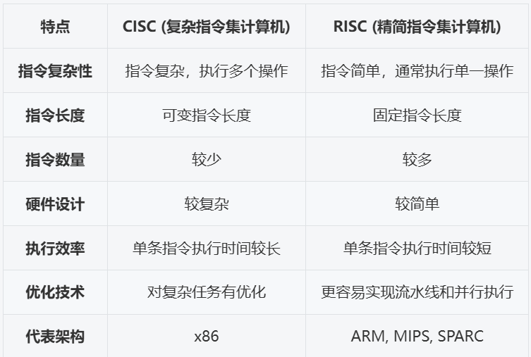
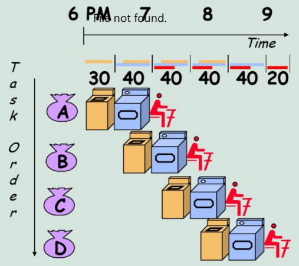
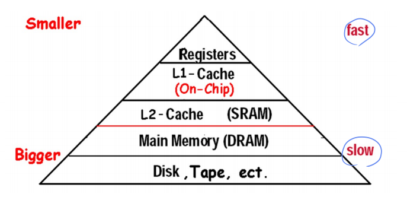

# Fundamentals of Computer Design
*对应教材Ch1*

涉及到软硬件协同的部分

## Introduction

Von Neumann Structure

### 计算机的分类

**Classes of Computers - 第一种分类**

* Desktop computers  
PC: Personal Computers，台式机，笔记本，通用计算
* Servers computers  
更强大的处理速度，容量大（用于冗余备份），稳定性比PC高
* Embedded computers
不能随意安装第三方应用的，与系统一体，称为嵌入式（不太符合国情x
* Personal Mobile Devices  
如手机，iPad
* Supercomputer

**Classed by Flynn - 第二种分类，从本质做划分，沿用至今**  
按照指令流和数据流进行分类

* SISD  
单指令流单数据流，如早期的单核 PC
* SIMD  
一条指令有多条数据流动（如向量数据），方便做流水线
* MISD  
多指令流单数据流，并不实际存在
* MIMD  
多指令流多数据流，可以做多核

*SIMD和MIMD有实际的机器*

**Performance**

* Alogrithm
* Programming language, compiler, architecture
* Processor and memory system
* I/O system (including OS)

!!! Summary
    According to the process of using data, computers are developing in three fields:

    * speed up processing (parallel)
    * speed up transmission (accuracy)
    * Increase storage capacity and speed up storage (reliability)

## Performance

这里有很多因素会影响性能：体系结构，硬件实现，编译器，OS...

对于性能我们有以下几个问题：

* 什么是performance？- 最简单的定义就是执行时间的倒数
* 如何量化分析？- 量化之后才能考虑trade-off
* 如何优化？

We need to be able to define a measure of performance.

* Single users on a PC -> a minimization of response time
* Large data -> a maximization of throughput

为了衡量性能，我们有响应时间和吞吐量两个指标：

* Latency (Response time 响应时间)  
一个事件开始到结束的时间  
* Throughput (bandwidth 带宽)  
给定时间范围内完成了多少的工作量

这部分可见[计组笔记](https://note.hobbitqia.cc/CO/co1/#performance)

<u>***The main goal of architecture improvement is to improve the performance of the system.***</u>

## Technology Trend

The improvement of computer architecture

* Improvement of input / output 
* The development of memory organization structure
* Two directions of instruction set development
    * CISC / RISC 
    * 
    * **CISC** 的设计理念更侧重于减少程序的指令数量，单条指令功能复杂，适合某些需要复杂计算的应用。
    * **RISC** 则通过简化指令集，优化硬件设计，使得处理器能够更高效地执行指令，适合需要高频率、高效并行计算的应用。
* Parallel processing technology  
不同层次、粒度的并行

## Quantitative approaches
两个对性能量化研究的方法

### CPU Performance Formula

* CPU 执行时间 = CPU 时钟周期数 * CPU 时钟周期时间 = CPU 时钟周期数 / CPU 时钟频率
    * 减少执行时间：减少周期数/提升时钟频率
* IC：Instruction Count，指令数
* CPI：Cycle Per Instruction，每条指令的时钟周期数
    * 由 CPU 硬件决定
    * 不同的指令也会有不同的 CPI，平均 CPI 取决于指令的组合方式
    * CPI = CPU 时钟周期数 / IC
    * CPU 执行时间 = IC * CPI / CPU 时钟频率
* 具体公式可参考[CO期中整理](./assets/CO期中整理.pdf)
* 多核运算比较难以使用上述公式衡量，一般直接使用时间比较

### Amdahl's Law

Amdahl's Law: the performance improvement to be gained from using some faster mode of execution is limited by the fraction of the time the faster mode can be used.  
当提升系统性能时，有多大的收益受限于被提升的部分所占的运行时间比例

$T_{improved}=\dfrac{T_{affected}}{\text{improvement factor}}+T_{unaffected}$

Make the common case fast!

也被用来分析可行性

* 加速比  

    $$
    \begin{align*}
    \text{Speedup} & =\dfrac{\text{Performance for entire task}_\text{using Enhancement}}{\text{Performance for entire task}_\text{without Enhancement}}\\
    & = \dfrac{\text{Total Execution Time}_\text{without Enhancement}}{\text{Total Execution Time}_\text{using Enhancement}}
    \end{align*}
    $$

    加速比 Sp = 改进后的性能 / 改进前的性能 = 改进前的时间 / 改进后的时间

* 执行时间  
$T_{new} = T_{old}\times \left((1-f)+\dfrac{f}{Sp}\right)$  
$f$ 指改进的部分所占的比例
* $Sp_{overall} = \dfrac{T_{old}}{T_{new}} = \dfrac{1}{(1-f)+\dfrac{f}{Sp}}$
    * 其中 $Sp$ 为**被优化部分**的加速比，$Sp_\text{overall}$ 为**整体**加速比（只和被优化部分的比例和局部加速比有关），$f$ 为被优化部分所占的运行时间比例

## Great Architecture Ideas

1. Design for Moore's Law - 设计紧跟**摩尔定律**
      - rapid change in computer design $\to$ design for where it will be
      - *e.g. 增加了电磁飞机弹射器(这是电力驱动的，而不是目前的蒸汽驱动的模型)，允许由新的反应堆技术提供的电力增加*
      - 强调做（for where it will be）这件事情本身

2. Use Abstraction to Simplify Design - 采用**抽象简化**设计
      - 低层级的具体实现细节对高层级隐藏
      - *e.g. 制造自动驾驶汽车，其控制系统部分依赖于已经安装在基础车辆中的现有传感器系统，如车道偏离系统和智能巡航控制系统，开发者不需要考虑所有模块的细节*

3. Make the **Common Case Fast** - 加速大概率事件
      - *e.g. 高楼内快速电梯*

4. Performance via Parallelism - 通过**并行**提高性能
      - *e.g. 增加CMOS晶体管的栅极面积（降低电阻）以减少其开关时间*

5. Performance via Pipelining - 通过**流水线**提高性能
      - 上一条指令未结束时下一条指令开始做：

      - *e.g. 汽车制造中的装配线(assembly lines)*

1. Performance via Prediction - 通过**预测**提高性能
      - 在知道精确的选择结果前先预测并执行下一步（例如if else语句，射击预判）
      - *e.g. 包含风力信息的飞机和航海导航系统*
      - 强调预测对行为的指导，减少等待时间

2. Hierarchy of Memories - 存储器**层次**
      - 存储器分层设计：快、最小和最昂贵的内存位于层次结构的顶部，最慢、最大和最便宜的内存位于底层
      - *e.g. 图书馆查书台 - 把经常要用的书放最上面*

3. Dependability via Redundancy - 通过**冗余**提高**可靠**性
      - 例如使用备用处理器，若探测到不一样的结果则报ERROR
      - *e.g. 悬索桥缆索*

## ISA
指令集是人类能看懂的最low level的语言

* Instruction Set Architecture  

Instruction Set Design Issues

* Where are operands stored?  
registers, memory, stack, accumulator
* How many explicit operands are there? (Classification of ISAs)   
0, 1, 2, or 3 
* How is the operand location specified? (Addressing Modes)  
register, immediate, indirect, ...
* What type & size of operands are supported? (Data Representation)  
byte, int, float, double, string, vector, ...
* What operations are supported? (Types of Instructions)  
add, sub, mul, move, compare, ...

Basic Principles

* Compatibility
* Versatility
* High efficiency
* Security

### ISA Classification Basis

这里主要指的是从哪里取数，存到哪里以及计算的规则。

* stack
    * First operand removed from second op replaced by the result.  
* accumulator
    * One implicit operand: the accumulator; one explicit operand: mem location
    * Accumulator is both an implicit input operand and a result  
* register
    * Register-memory architecture  
    任何指令都可以访存
    * Load-store architecture  
    只有 load/store 的时候才能访存，其他时候都是基于寄存器操作 

### GPR Classification

!!! Example "A+B"
    

    More: try to do with $D=A*B-(A+C*B)$

GPR 速度快，但是 GPR 太多也会有资源的浪费和性能下降（如寻找对应的寄存器）