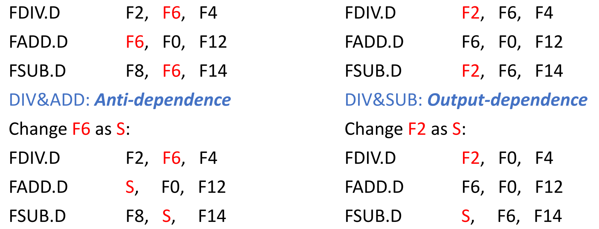
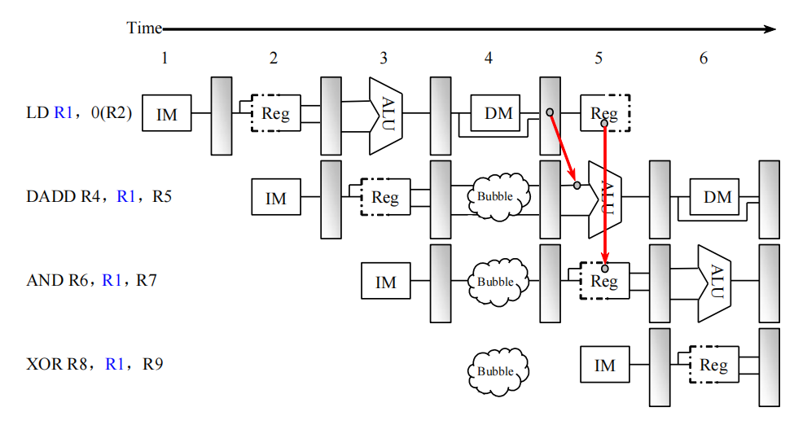
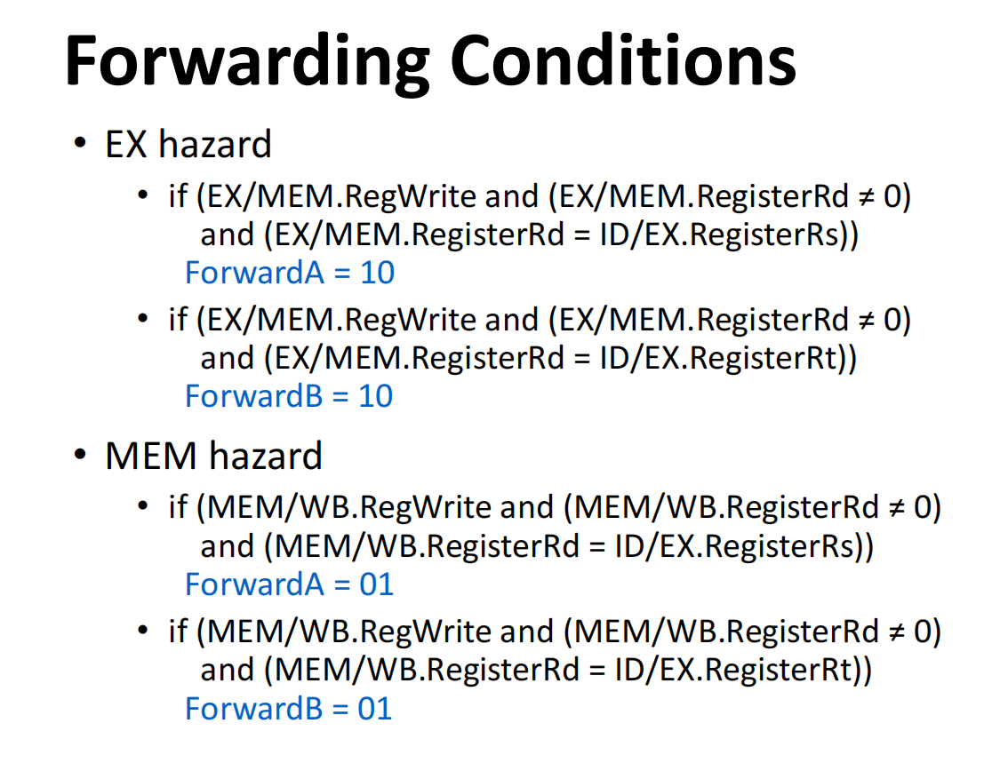
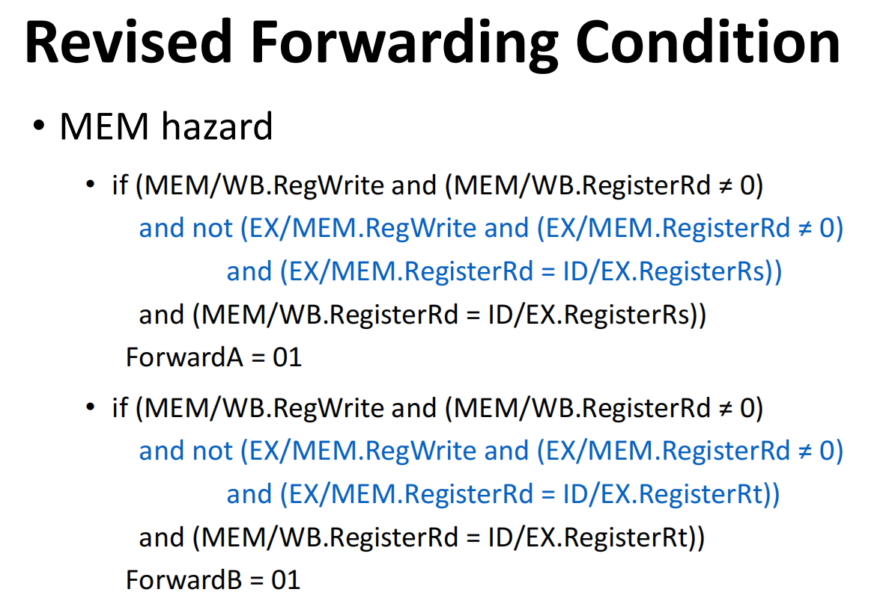
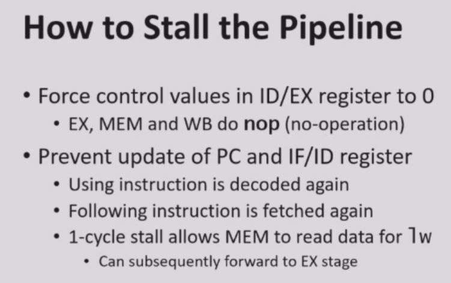
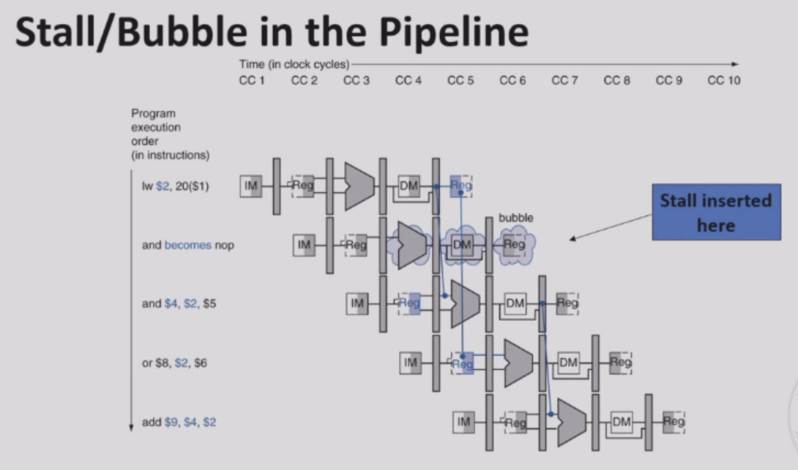
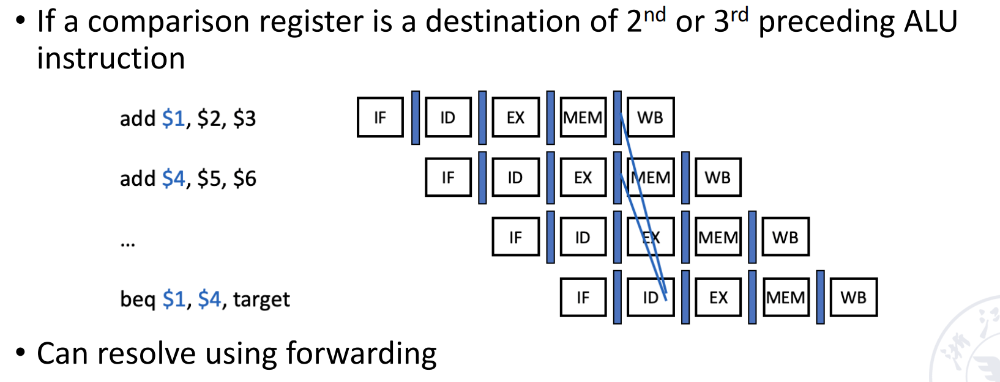
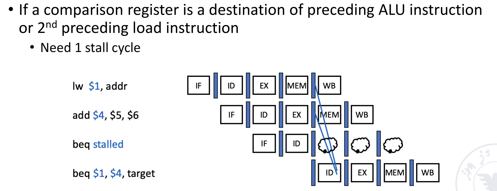
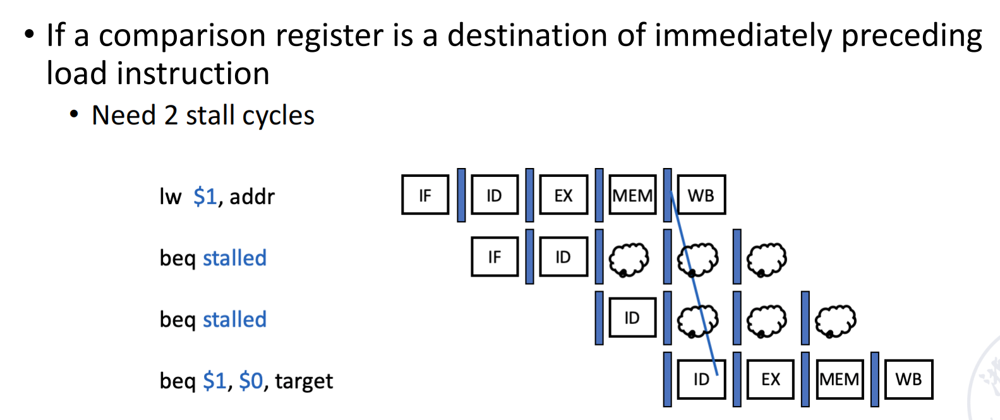

# Pipelining
*对应教材AppA, AppB*

!!! Abstract
    <div align = center></div>

    * What is pipelining?  - 指令和资源（部件）的角度，都会引起流水线的冒险
    * How is the pipelining Implemented?  
    * What makes pipelining hard to implement?  

## What is pipelining?

核心思想是重叠执行(overlap)，但是从微观上看每个部件只有一个指令在执行。
在同样的硬件资源情况下，最大程度地使用硬件资源。
从两个角度进行加速：对每一条的指令进行加速；对一段程序的执行进行加速

Pipelining is an implementation technique whereby multiple instructions are overlapped in execution; it takes advantage of parallelism that exists among the actions needed to execute an instruction.

机制上，先进行分段，每一段用不同的部件，就可以并行执行。我们用 Buffer 存放了临时的结果，有人放有人取

假设一条指令的执行分为下面三段（取指$\to$译码$\to$执行）：
<div align = center></div>

那么我们执行的模式可以有下面三种：

Three modes of execution

* Sequential execution  
* Single overlapping execution
* Twice overlapping execution

### Sequential execution

没有流水线的时候，每一条指令顺序执行，执行时间就是每一条指令的每个阶段时间**求和**。

<div align = center></div>

### Overlapping execution

重叠执行时，如果不同阶段时间不一致，如 ID 阶段时间较长，那么需要等待，**浪费资源**；如 EX 阶段时间较长，那么产生冲突，**执行部件不够**。
<div align = center></div>
<div align = center></div>

因此理想情况是让三个阶段的时间相等。

* Single  
好处：时间缩短 1/3，但提高了硬件开销，而且有冒险。  
    <div align = center></div>

* Twice    
  好处：时间缩短 2/3，但需要更复杂的硬件，而且需要单独的 FETCH DECODE EXE 部件。
    <div align = center></div>

如何实现重叠？
- Instruction Memory和Data Memory区分开避免Conflict in access memory
- buffer（以空间换时间）
Adding instruction buffer between memory and instruction decode unit.  
添加 buffer 之后，IF 阶段时间变得很短，此时可以和 ID 阶段**合并**（把二次重叠变为了**一次重叠**，时间较顺序执行缩短了一半且硬件代价小）。

但如果合并后 IFID 和 EX 阶段时间不一致，也会有执行部件的浪费。  
如何平滑速度的差异？- buffer

Common features: They work by FIFO, and are composed of a group of several storage units that can be accessed quickly and related control logic.
<div align = center></div>
<div align = center></div>

可以看到，添加 buffer 之后，ID 阶段不用等待 EX 阶段技术才能进行下一条的译码，因为 ID 阶段的结果已经存放在 buffer 中了。即执行阶段的操作数不直接来自于 ID 阶段，而是从buffer里面取。这样之后 EX 阶段就连起来了，处理器的资源利用率大大提高。

流水线被分为几段被称为流水线的深度。

## Classes of pipelining

Characteristics of pipelining

* Single function pipelining: only one fixed function pipelining.
* Multi function pipelining: each section of the pipelining can be connected differently for several different functions.  
  不同运算，用到流水线中不同的段，这样实现了不同的功能。

    ??? Example
        <div align = center></div>

    针对多功能流水线的划分:

    * Static pipelining  
      静态流水线：同一个时刻流水线只能做一个功能。  
      例如在刚刚的例子中，流水线要么做浮点加法，要么做乘法。
    * Dynamic pipelining  
      动态流水线：同一个时刻流水线可以做多个功能。  

        ??? Example
            <div align = center></div>

        可以不用等浮点加法第 n 条结束，就可以开始浮点乘法。

还可以从不同粒度分类：

* Component level pipelining (in component - operation pipelining)
* Processor level pipelining (inter component - instruction pipelining)
* Inter processor pipelining (inter processor - macro pipelining)

还可以分为线性/非线性：

* Linear pipelining
* Nonlinear pipelining  
  非线性，功能部件可能多次使用，造成回路

    ??? Example
        <div align = center></div>

还可以分为顺序/乱序：

* Ordered pipelining
流入和执行的顺序一致
* Disordered pipelining  
进来和流出的顺序不一样。后面的指令与前面的指令无关，则可以先出来，不能则要等待。

还可以分为标量/向量处理器：

* Scalar processor
* Vector pipelining processor: The processor has vector data representation and vector instructions. It is the combination of vector data representation and pipelining technology.  

## Performance evaluation of pipelining

### 1. Throughput

流水线希望我们**单位时间内处理的任务**越多越好，即提高吞吐率。

**Throughput(TP)** $TP=\dfrac{n}{T_K}<TP_{max}$（实际上 TP 会有损耗）
<div align = center></div>

$TP=\dfrac{n}{n+m-1}TP_{max}$

* if $n>>m, TP\approx TP_{max}$

Suppose the time of segments are different in pipelining, then the longest segment in the pipelining is called the **bottleneck segment**.

!!! Example 
    * $M = 4$
    * Time of S1, S3, S4: $\delta t$
    * Time of S2: $3\delta t$ (Bottleneck)

    <div align = center></div>
    <div align = center></div>
    
    可以看到 $TP_{max}$ 只和瓶颈段的时间有关

#### Common methods to solve pipeline bottleneck

* Subdivision 

    把瓶颈段分成若干段执行
    <div align = center></div>

* Repetition

    在瓶颈段多使用几个部件
    <div align = center></div>
最后的 $TP_{max}=\frac{1}{\Delta t}$

### 2. Speedup

是一个比值，没有量纲，表示加速比。

$S_p = \dfrac{n\times m \times \delta t_0}{m(m+n-1)\delta t_0} = \dfrac{n}{m+n-1}$

* if $n>>m, S_p\approx m$，和流水线段数有关，但是读取、传输数据的损耗在m很大的时候也不能忽略不计，因此m不能无限大

### 3. Efficiency

效率，从计算机部件的角度：纵轴代表使用的不同的功能部件。效率指的是我们真正使用这个部件占整个时空的百分比。
<div align = center></div>

$\eta = \dfrac{n\times m \times \delta t_0}{m(m+n-1)\delta t_0} = \dfrac{n}{m+n-1}$

* 注意效率得到的结果应该是百分比，之前的吞吐量、加速比都是没有量纲的数。
* if $n>>m, \eta\approx 1$

### Pipeline Performance

!!! Example "Vector Calculation in Static Pipeline"
    现在有两个向量 A 和 B，我们要计算 A 点乘 B，通过下面的动态双功能流水线运算。
    <div align = center></div>

    注意到这里是**静态**流水线，同一时刻只能做一类事情，需要先完成一种操作再完成另一种。这里我们需要先做乘法，排空，再做加法。做加法时，第三个乘法的结果需要等前两个乘法的结果相加后，再计算。
    <div align = center></div>
    
    注：这张图y轴标注有错位，从下往上5格分别代表12345这五个部件
    得到 $T_p=7/15\delta t, S_p = 1.6, \eta=32\%$

!!! Example "Vector Calculation in Dynamic Pipeline"
    动态流水线，可以在前一个功能还没有做完的时候执行另一个功能，不需要排空。
    <div align = center></div>

    这里当两个乘法的结果算出来之后，就可以执行对应的加法。
    <div align = center></div>

流水线的段数 m 不是越多越好。

Too many stages:

* Lots of complications
* Should take care of possible dependencies among in-flight instructions
* Control logic is huge

评价指标：$TP，S，E$
流水线的性能有关：动态（不需要排空，但需要硬件支持）还是静态，流水线段数，代码质量（冒险）

## Hazards of Pipelining

- data dependence - 上一条指令的输出是下一条指令的输入
- name dependences
   - Anti-dependence - 毫不相干的两个操作数使用了同一个寄存器
   - Output-dependence - 两条指令的结果写到同一个寄存器内
   
   

Hazards

* Situations that prevent starting the next instruction in the next cycle.
* **Structure hazards**

    A required resource is busy. 多条指令征用同一种资源。

* **Data hazard**

    Need to wait for previous instruction to complete its data read/write.

* **Control hazard**

    Deciding on control action depends on previous instruction.

### Structure Hazards

对结构的争用，如 memory.
<div align = center></div>

一般加 bubble，或者加硬件。或者将memory在cache中分开（分成 I-cache 和 D-cache）。

### Data Hazards

An instruction depends on completion of data access by a previous instruction.  

可以加 bubble, 或者通过 forwarding 前递数据，但并不是所有的情况都可以解决。

* Read after write: RAW  

    ``` asm
    FADD.D F6，F0，F12
    FSUB.D F8，F6，F14
    ```

    Forwarding 解决这种类型的冒险。
    <div align = center></div>
    读数据 - 右半边标灰，写数据 - 左半边标灰。
    对于第一条和第四条指令，我们如果将WB阶段分成两段，前半段写回后半段读取，可以在同一时钟周期完成，不需要forwarding。

* Write after read: WAR

    ``` asm
    FDIV.D F2，F6，F4
    FADD.D F6，F0，F12
    ```

    Name Dependences（顺序流水线中，重命名寄存器就可以解决，但是在**乱序**流水线中可能出现冒险）

* Write after write: WAW
  
    ``` asm
    FDIV.D F2，F0，F4
    FSUB.D F2，F6，F14
    ```

    Name Dependences（也是在乱序流水线中解决）

但是并不是所有的 RAW 都可以通过 Forwarding 解决，如 Load-use Hazard. 要配合bubble一起解决。



有的时候，我们可以对指令进行调度，改变指令的顺序，从而避免 stall 的情况。

!!! Example "Code Scheduling to Avoid Stalls"
    <div align = center></div>

* 静态调度：程序还没有运行，**编译器**为我们优化了代码，改变执行顺序。
* 动态调度：程序运行时，**处理器**为我们优化了代码，改变执行顺序。

### Control Hazards

为了减少分支指令带来的 stall，我们使用分支预测的技术。

* Static branch prediction
    * Based on typical branch behavior
    * ***e.g.*** 循环，if-else 语句
        * Predict backward branches taken
        * Predict forward branches not taken
* Dynamic branch prediction
    * Hardware measures actual branch behavior
        * ***e.g.*** 根据历史记录（如上一次分支的结果），预测下一次的分支
    * Assume future behavior will continue the trend

## Data Hazards: Forwarding vs. Stalling

具体实现见[CALab1](./assets/lab1_report.pdf)（forward情况编码好像和ppt略有出入）

* EX hazard & MEM hazard - forwarding

  

* Double hazard - 在MEM hazard的判定条件中加入不发生EX hazard

  

* Load-use hazard - 除了forwarding之外还需要一个stall

  

  

## Control Hazards

在 RISC-V 中，有无条件跳转 `jal, jalr` 和有条件跳转 `beq, bne, blt, bge, bltu, bgeu`。

可以在 ID 阶段就算出要跳转的目标地址，同时预测分支的结果。只有预测错误时才需要 stall 来 flush 掉之前的结果，预测成功不需要 stall。

不带预测使用stall解决的情况，一个branch指令会带来一拍的stall。

### Static Branch Prediction

* Prediction taken

* Prediction not taken

    <div align = center></div>

* Delayed Branch

    The behavior of a delayed branched is the same whether or not the branch is taken.  
    即无论分支是否发生，分支后面的指令都要执行。（延时槽）

    

!!! Question "Is delay slot a really good design?"
    RISC-V 和微架构绑定不深，而且延迟槽也有弊端。

在Branch预测的过程中也可能出现data hazard，和解决普通数据冲突的方式基本相同，还是尽可能forward解决，如果解决不了则加入stall：







### Dynamic Branch Prediction

Use dynamic prediction

* Branch prediction buffer (aka branch history table)
* Indexed by recent branch instruction addresses
* Stores outcome (taken/not taken)
* To execute a branch
    * Check table, expect the same outcome

        把之前大家的结果存在一个表里，通过历史判断未来，根据之前的分支结果预测这次。
    
    * Start fetching from fall-through or target
    * If wrong, flush pipeline and flip prediction

#### Branch History Table(BHT)

* 1-Bit Predictor

    <div align = center></div>

* 2-Bit Predictor
  
    <div align = center></div>

    实际上两位的效果已经很好，而且资源开销不小，因此我们一般不会再提升位数。

#### Advanced Techniques for Instruction Delivery and Speculation  

* Increasing Instruction Fetch Bandwidth
    * Branch-Target Buffers(BTBs)
        <div align = center></div>

        动态维护一个buffer，类似于 TLB，放分支预测的目标地址。如果有跳转的分支指令不在表中，就加入；如果有表中的分支指令不发生跳转，就去掉。
        <div align = center></div>

* Specialized Branch Predictors: Predicting Procedure Returns, Indirect Jumps, and Loop Branches
    * Integrated Instruction Fetch Units

* Benefit
    * 减少分支延迟
    * It can provide multiple instructions at the branch target once, which is necessary for the multi processor;
    * branch folding
        * It is possible to achieve unconditional branching without delay, or sometimes conditional branching without delay

## Schedule of Nonlinear pipelining

对于非线性流水线，功能部件可能经历多次，有调度问题。可能会有回路。

!!! Question
    纵轴代表不同的功能部件，横坐标表示拍数。即每一拍需要用到的功能部件。
    <div align = center></div>
​    如果每隔3拍进一条指令，会有两条指令对资源的争用。

调度算法：

* Initial conflict vector $\to$ Conflict vector $\to$ State transition graph $\to$ Circular queue $\to$ Shortest average interval

    二进制表示，第几拍是不能使用的。将几个二进制数取并集。（随着时间的变化）动态变化的二进制向量。

!!! Example
    * Initial conflict vector

        <div align = center></div>
    
        对每一个部件分开来看
    
        * 第一个部件，隔 8 拍会产生冲突；第二个部件：1，5，6；第三个部件：无；第四、五个部件：1
        * 将对应二进制数的第 1、5、6、8 位设为 1，其他位为 0，得到了初始的冲突向量 10110001。
        * 但是问题没有那么简单，比如第一个隔两拍可能没问题，但是连续隔3个两拍就会产生一个隔6拍的争用。
    
    * Conflict vector
    
        <div align = center></div>
    
        对于第三列，隔两拍进下一条指令，我们就把冲突向量向右移两位（高位补 0），得到了新的冲突向量，并和本来的冲突向量或起来得到 CCV。（注意这里最左侧的一列表示向右移动了多少次）
    
        找到了一个循环调度：2-2-7
    
    * State transition graph
    
        <div align = center></div>
        不一定回到初始的冲突向量，回到之前循环的某个状态就可以。

## Summary

!!! Summary
    1. How the instruction is executed
        * Sequential execution
        * Overlap once
        * Second overlap
        * Pipeline
    2. Classification of pipelines
        * Single function, multi-function
        * Static, dynamic
        * Linear, non-linear
        * In-order, out-of-order
    3. Performance indicators of the pipeline
        * Throughput rate
        * Speedup ratio effectiveness
    4. Factors affecting the performance of the pipeline
        * Pipeline design
        * Type of instructions
        * Instructions related
            * Data dependence
            * Name dependence
            * Control dependence
    5. Dynamic Branch Prediction
        * Branch History Table (BHT)
        * Branch-Target Buffer (BTB)
    6. Non-linear pipeline scheduling problem