# Memory Hierachy
*对应教材AppC, Ch2*

## Introduction

### Memory

内存层次：

* Register
* Cache
* Memory
* Storage

存储技术：

* Mechanical Memory
* Electronic Memory
    * SRAM - 静态随机访存，经常用来做cache
    * DRAM - 动态随机访存，经常用来做memory，有写回刷新操作
        * SDRAM
        * DDR
    * GDRAM
        * GDDR
    * HBM
    * EPPROM
        * NAND
        * NOR
* Optical Memory

个人移动设备可能只有L1L2的Cache，desktop会有L1L2L3的Cache，而server会对硬盘storage可靠性要求更高（很重要的数据有不止一两份备份）：

### Cache Concept

由于cache直接和cpu沟通（忽略reg离cpu最近的一层），所以cache读取的优化直接关联到cpu的优化。

**Cache**: a safe place for hiding or storing things. （之前因为临时存放，位置不确定所以无人在意；现在也不安全，attacker可以通过访问cache的时间差知道访问了什么数据）

* Cache **Hit/Miss**: When the processor *can/cannot* find a requested data item in the cache

    Cache Miss 会带来额外的开销：由 Latency, Bandwith 决定。优化过程中要尽可能提升hit的几率、降低cache miss的开销。

* Cache **Block/Line**: A fixed-size collection of data containing the requested word, retrieved from the main memory and placed into the cache.
  cpu访问cache的单位就是block。cache块取多大合适也是设计cache的一大问题。
* Cache **Locality**:
    * **Temporal locality** - 时间局部性: need the requested word again soon

        访问过这个数据，之后很可能再次访问这个数据。

    * **Spatial locality** - 空间局部性: likely need other data in the block soon

        访问了这个位置，之后很可能访问下一个位置。

!!! Info "36 terms of Cache"
    

## Four Questions for Cache Designers

对memory性能优化的目标：平衡容量、耗时和价格，离cpu越近，耗时少、容量小，价格贵。

这部分内容可见[计组笔记](https://note.hobbitqia.cc/CO/co5/)

**Caching** is a general concept used in processors, operating systems, file systems, and applications.

* **Q1**: Where can a block be *placed* in the upper level/main memory? (**Block placement**)
    * Fully Associative, Set Associative, Direct Mapped
* **Q2**: How is a block *found* if it is in the upper level/main memory? (**Block identification**)
    * Tag/Block
* **Q3**: Which block should be *replaced* on a Cache/main memory miss? (**Block replacement**)
    * Random, LRU, FIFO
* **Q4**: What happens on a *write*? (**Write strategy**)
    * Write Back or Write Through (with Write Buffer)

### Q1: Block Placement

* Direct mapped

    一个块在 cache 中有一个固定的位置（通常通过取模得到）。

    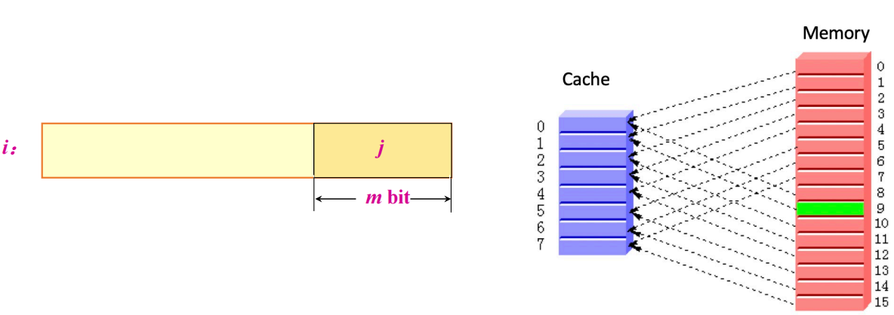

* Fully associative

    块可以放在 cache 里的任意位置。（不好找）

    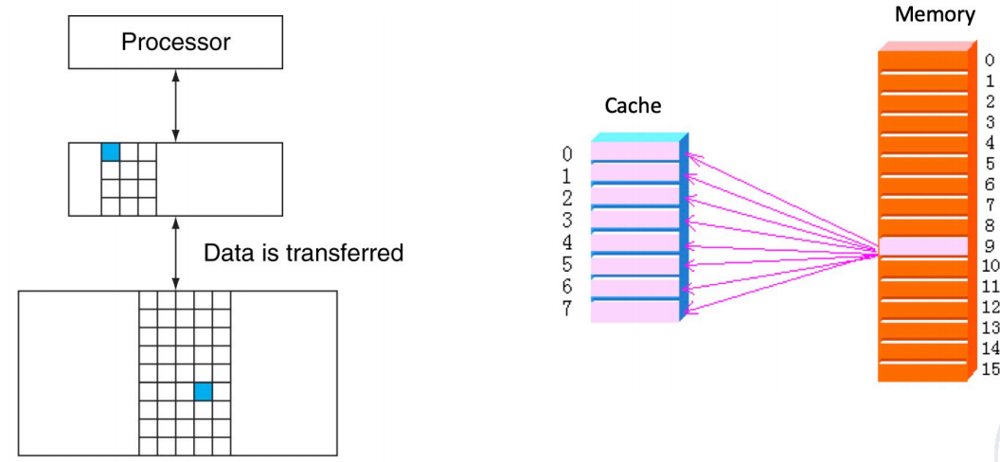

* Set associative
    * 块可以在一个组里的任何位置，组里可以放若干个块。
    
      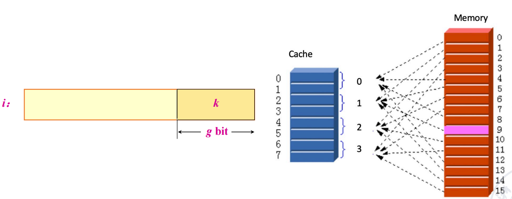
    
    * 直接映射相当于一路组相联，全相联相当于 n 路组相联（n 是 cache 的块数）。
    
      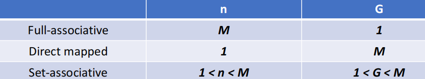
    
      一般情况，$n\leq 4$

### Q2: Block Identification

### Q3: Block Replacement

* **Random** replacement - randomly pick any block
* **Least-Recently Used (LRU)** - pick the block in the set which was least recently accessed
    最近最少使用 - 时间局部性原理
    需要额外的位数来记录访问的时间。一般我们用的是近似的 LRU。

* **First In, First Out (FIFO)** - Choose a block from the set which was first came into the cache

!!! Example "Strategy of Block Replacement"
    Suppose:
    
    * Cache block size is 3, and access sequence is shown as follows.  
        
        2, 3, 2, 1, 5, 2, 4, 5, 3, 4
    
    * FIFO, LRU and OPT are used to simulate the use and replacement of cache block. （OPT 是一种理想情况，用来衡量算法性能，从未来访问的角度决定替换策略）
    
        * FIFO
    
            

    
        * LRU
    
            

        
        * OPT，标识当前最远的会被用上的
    
            

    不同的替换算法会影响命中率。
Hit rate is related to the replacement algorithm, the access sequence, the cache block size.
* 特殊的访问序列：例如thrashing -  一直无法hit，每次都把下一次要访问的替换出去。

  

* block size: 

  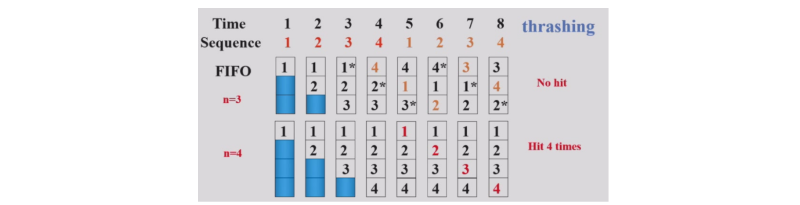

#### Stack replacement algorithm

有些算法随着 N 增大命中率非下降（当n变大的时候，n大的集合一定包含n小的集合），有些算法随着 N 增大命中率反而会下降。  
我们把随着 N 增大命中率非下降的算法称为 stack replacement algorithm：

$B_t(n)$ represents the set of access sequences contained in a cache block of size $n$ at time $t$.

* $B_t(n)$ is the subset of $B_t(n+1)$.

**LRU** replacement algorithm **is** a stack replacement algorithm, while **FIFO is not**.  
FIFO - Belady现象：

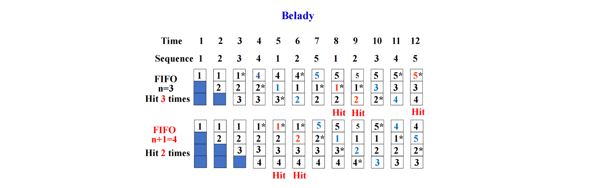

For LRU algorithm, the hit ratio always increases with the increase of cache block.

!!! Example "Using LRU"
    **用栈来模拟 LRU**，栈顶是最近访问的，栈底是最久未访问的，每次要替换的时候，替换栈底的元素。通过下面的图可以快速看到栈大小为 n 时的命中率。

    

#### LRU Implementation - Comparison Pair Method

如何只通过门和触发器来实现 LRU 算法？—— **Comparison Pair Method**

* Basic idea

    Let each cache block be combined in pairs, use a comparison pair flip-flop to record the order in which the two cache blocks have been accessed in the comparison pair, and then use a gate circuit to combine the state of each comparison pair flip-flop, you can find the block to be replaced according to the LRU algorithm.

    让任何两个 cache 块之间两两结对，用一个触发器的状态来代表这两个块的先后访问顺序（比如 1 表示 A 刚被访问，0 表示 B 刚被访问）。通过门电路对触发器的状态进行逻辑组合，找到最久未被访问的块。

!!! Example "Comparison Pair Method"
    这里有 3 个 cache blocks A, B, C。那么我们需要 3 个触发器来记录之间的状态。假设 $T_{AB}=1$ 表示 A 被更近访问，$T_{AC}, T_{BC}$ 同理。
    

    

* **Hardware usage analysis**

    假设有 p 个 cache blocks, 我们需要 $C_p^2=p\cdot (p-1)/2$ 个触发器。  
    当 $p$ 超过 8 时，需要的触发器过多，这个算法就不适用了。所以比较对法有一定的局限性。

### Q4: Write Strategy

* Write Hit
    * **Write Through**：直接写回到内存。

        写到内存的时间较长，这个过程需要 **Write Stall**，或者使用 **Write Buffer**（节省stall的时间）。
        

    * **Write Back**：只在 Cache 中写，不写入memory，同时通过一个额外的 dirty bit 表示这个块已经被修改。

* Write Miss
    * **Write Allocate**：将要写的块先读到 Cache 中，再写。
    * **Write Around**(no-write allocate)：直接写到内存。
* In general, **write-back** caches use **write-allocate** , and **write-through** caches use **write-around**.

??? Example
    

​    write allocate可以降低miss的rate。

## Memory System Performance

这部分也可见[计组笔记](https://note.hobbitqia.cc/CO/co5/#measuring-and-improving-cache-performance)

How to improve

* Reduce the miss penalty
* Reduce the miss rate
* Reduce the time to hit in the cache
* Reduce the miss penalty and miss rate via parallelism

例子：

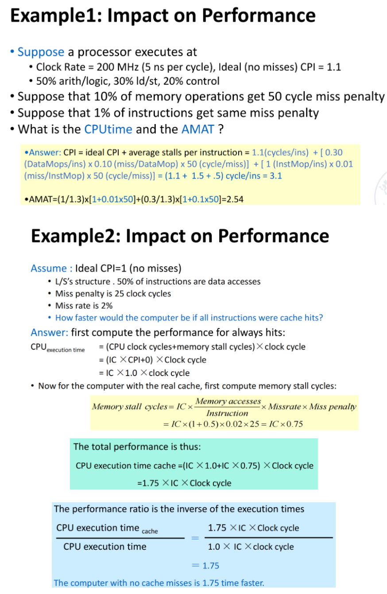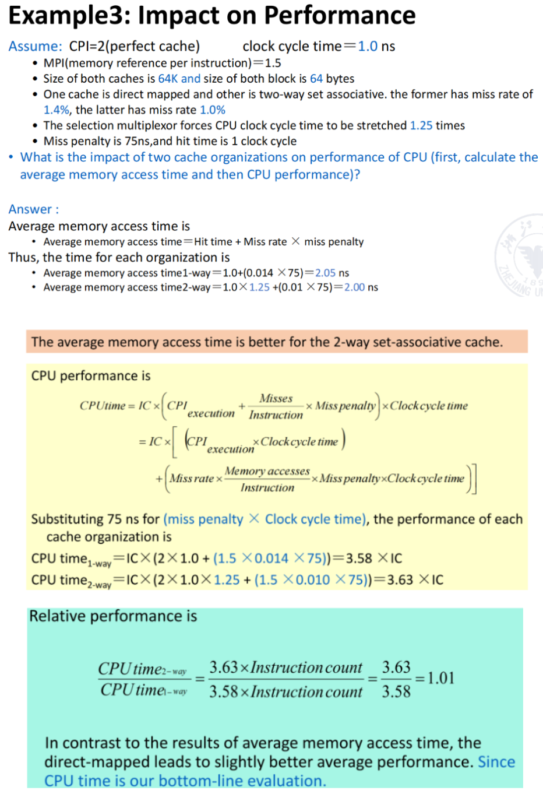

## Virtual Memory

物理内存有限，虚拟内存让用户体验到一个抽象的更大的（在一个进程内看上去是连续的）内存。

* Why virtual memory?

    可以让进程使用不连续的物理内存空间（虚拟地址上是连续的）；更好地隔离不同进程。

* virtual-physical address translation
* memory protection/sharing among multi-program

Virtual Memory = Main Memory + Secondary Storage(Disk memory reference，为进程的内存提供了更大的空间)

* Virtual Memory Allocation
    * Paged virtual memory

        **page**: fixed-size block
    
    * Segmented virtual memory

        **segment**: variable-size block
    
    

!!! Info "Paging vs Segmentation"
    

    分页式的易于实现，方便替换。现在常用段页式结合，或者纯页式。

### How virtual memory works?

Cache 的四个问题在虚拟内存中都有对应。

* Q1. Where can a block be placed in main memory?

    缺失代价很高，因此我们采用全相联的方式，以降低 miss rate。

* Q2. How is a block found if it is in main memory?

    虚拟地址分两部分，偏移量和页号。页号是页表的索引。
    

    
* Q3. Which block should be replaced on a virtual memory miss?

    Least Recently Used (LRU) block, with use/reference bit.

* Q4. What happens on a write?

    Write-back strategy(往disk里面写开销太大), with dirty bit.
    在不得不写回disk的时候再写回。

### Page Table

* Page tables are often large - 存在main memory里面

    ***e.g.*** 32-bit virtual address, 4KB pages, 4 bytes per page table entry.  
    page table size: $(2^{32}/2^{12}) \times 2^2 = 2^{22}$ bytes = $4$ MB
    
* Logically **two** memory accesses for data access:
    * one to obtain the physical address from **page table**;
    * one to get the **data** from the physical address;

正常来说页表需要两次内存访问，访问效率低下，因此我们需要 cache page table，即 TLB。

**Translation lookaside buffer (TLB)**

* tag: portions of the virtual address (VPN);
* data: a physical page frame number (PPN), protection field, valid bit, use bit, dirty bit;

!!! Example
    发送 tag (VPN) 尝试匹配，并看访问类型是否违规。如果匹配成功，就把对应的 PPN 送到 Mux，将偏移量加上 PPN 得到物理地址。
    

    

    

### Page Size Selection

* Pros of *larger* page size
    * Smaller page table, less memory (or other resources used for the memory map);

        页更少，所以页表更小。
    
    * Larger cache with fast cache hit;

        页更大，所以 cache 命中的时间更短（因为我们需要遍历的页更少）。

    * Transferring larger pages to or from secondary storage is more efficient than transferring smaller pages;

        一次搬运更多的数据，所以更高效，小页可能需要搬运多次。

    * Map more memory, reduce the number of TLB misses;

        TLB miss 次数更少。

* Pros of *smaller* page size
    * Conserve storage
      
        When a contiguous region of virtual memory is not equal in size to a multiple of the page size, a small page size results in less wasted storage.

        减少对内存的使用，内部碎片更少。

Use both: **multiple page sizes**

!!! Note "Address Translation"
    

​    L1 cache找指令，L2 cache找数据

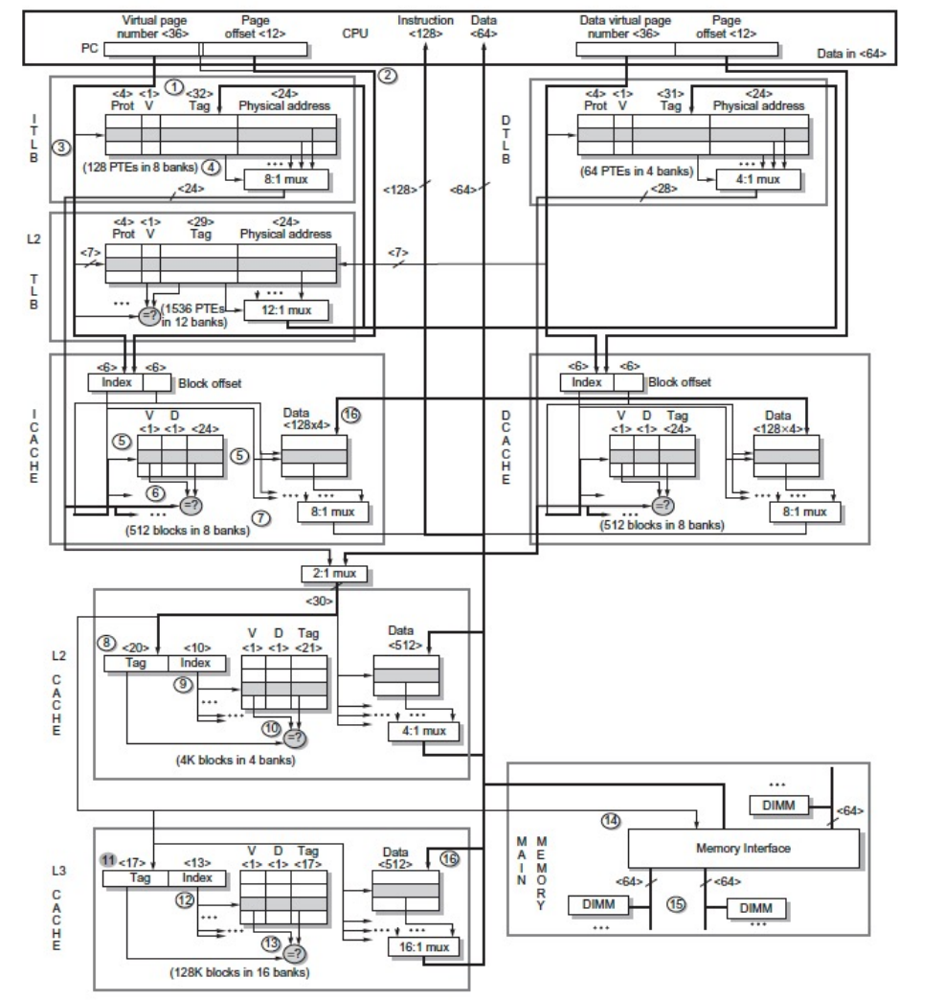

Intel Core i7 6700 - 在TLB的时候就分离了I/D TLB

### Safety - 由操作系统保护
每个进程有自己的page table，独立的，由每个进程自己管理；同时负责权限的管理；
权限层级 - 更高级别的处理器对进程的管理有更高的权限；
keys and locks;

## Summary

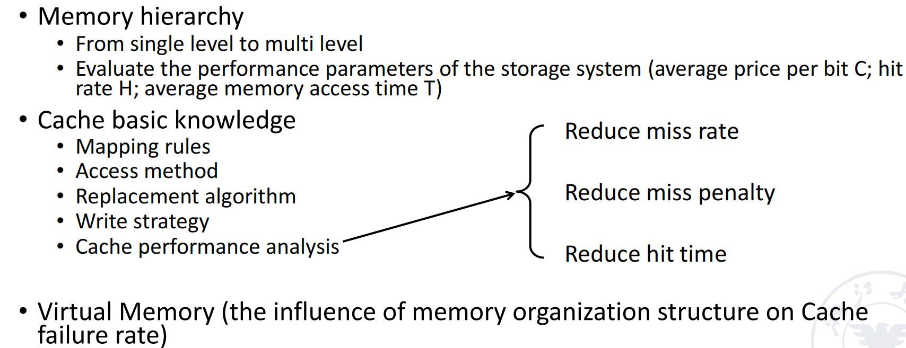

附：

MESI协议（Modified, Exclusive, Shared, Invalid）是一种常见的缓存一致性协议，用于多处理器系统中管理缓存数据的一致性。它通过为每个缓存块分配一个状态，确保多个处理器在访问共享内存时能够保持一致性。MESI协议的四种状态分别是：

1. **Modified（已修改）：**
      - 缓存块已被当前处理器修改，且与主存中的数据不一致。
      - 此时，缓存块是“脏”的，只有当前处理器拥有该数据的最新副本。
      - 如果该缓存块被替换，需要将数据写回主存。
2. **Exclusive（独占）：**
      - 缓存块只存在于当前处理器的缓存中，且与主存中的数据一致。
      - 当前处理器可以自由读取或写入该缓存块，而无需通知其他处理器。
3. **Shared（共享）：**
      - 缓存块可能存在于多个处理器的缓存中，且与主存中的数据一致。
      - 所有处理器只能读取该缓存块，不能直接写入。如果需要写入，必须先将其他处理器的缓存块置为无效。
4. **Invalid（无效）：**
      - 缓存块无效，不能被当前处理器使用。
      - 如果处理器需要访问该数据，必须从主存或其他处理器的缓存中重新加载。

## 安全专题：Cache侧信道攻击

- Meltdown：利用**乱序执行**技术，通过对内存的响应时间差来建立一个侧信道攻击，破坏了位于用户和操作系统之间的基本隔离。

  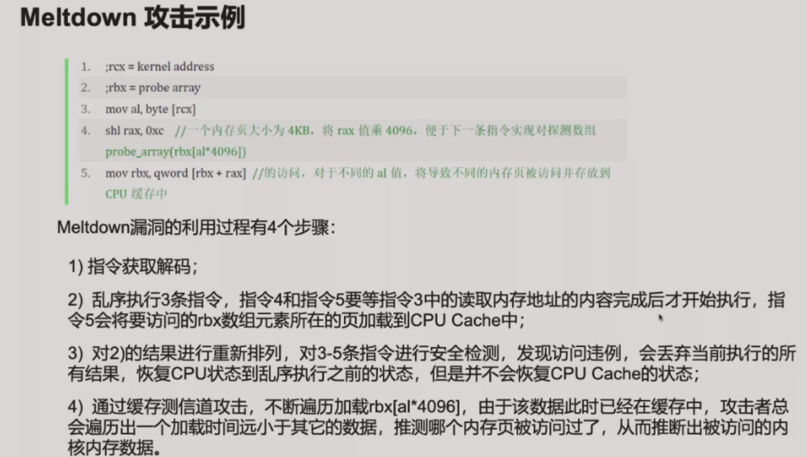

  缓解措施：

  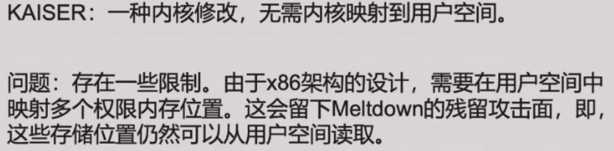

- Spectre：**预测执行**对CPU缓存的影响会被保留，即使预测错误恢复的也是CPU状态而非cache状态。

  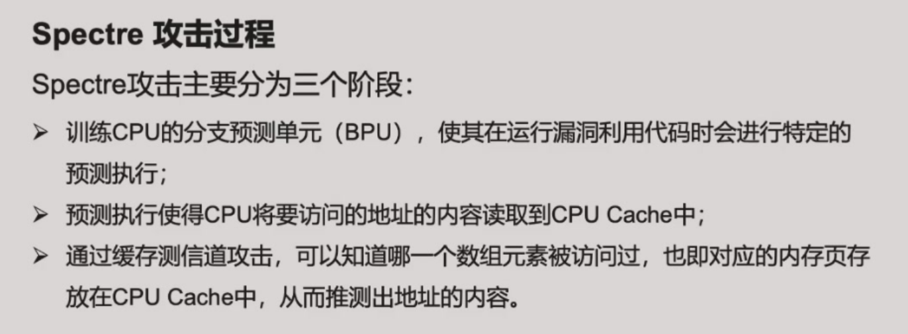

  缓解措施（都是以牺牲性能为代价的）：

  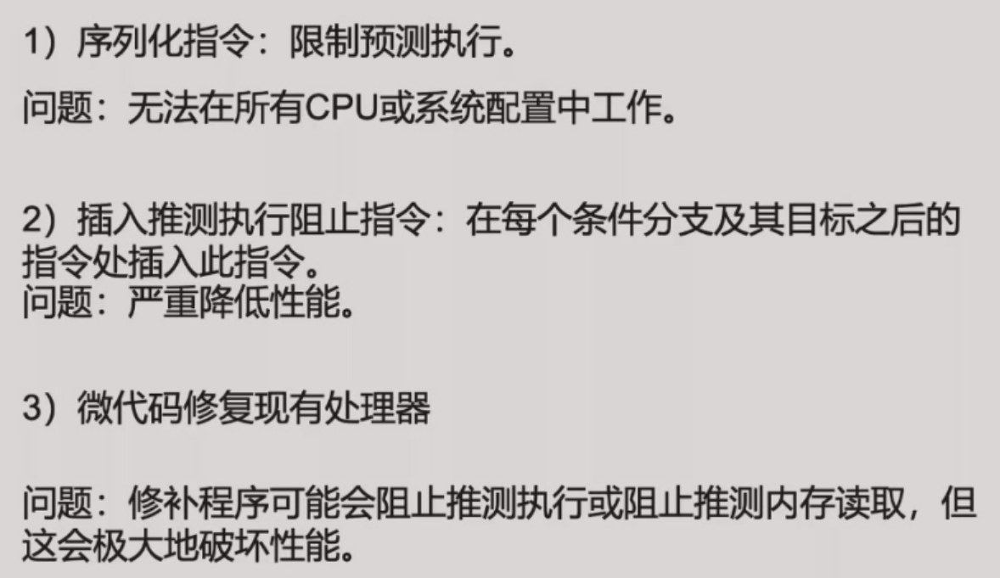
