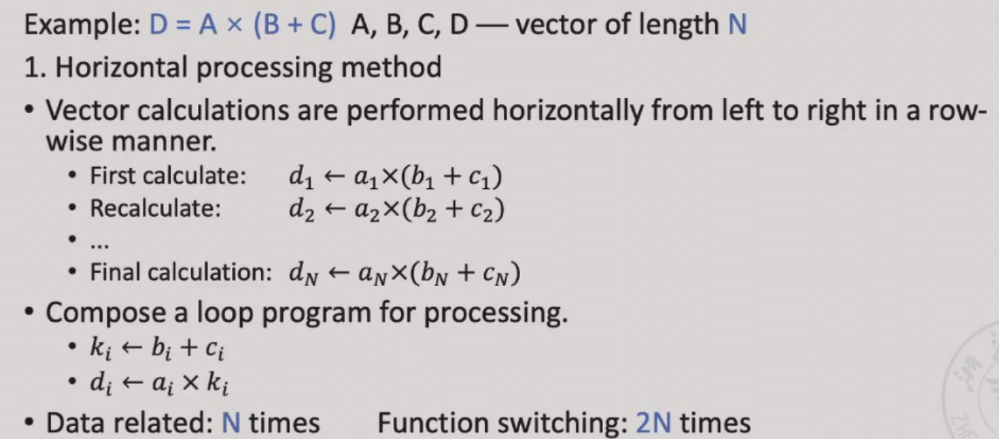
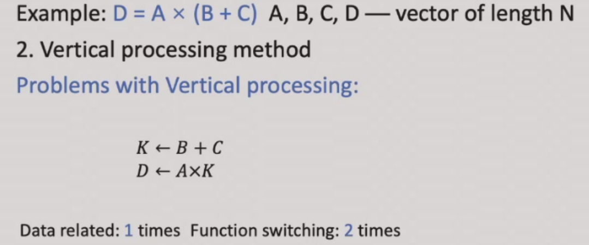
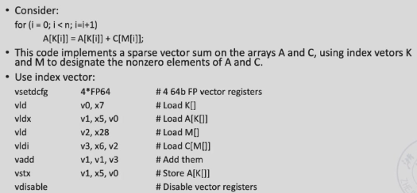

# DLP and TLP
*对应教材Ch4, Ch5*

## 0 Introduction


SISD - 单指令流单数据流
SIMD - 单指令流多数据流（比如向量一次传递多种数据)

* SIMD architectures can exploit significant data-level parallelism
  * Matrix-oriented scientific computing
  * Media-oriented image and sound processors

* SIMD is more energy efficient than MIMD
* SIMD allows programmer to continue to think sequentially

MIMD - 多指令流多数据流

## 1 SIMD: vector processor

### 1.1 Vector Processor处理模式
是处理的数据类型的分类，由不同的处理器处理不同的数据类型：
* **vector processor** - 流水线处理器，用向量表示和处理数据
* **scalar processor**  - 流水线处理器，不用向量表示和处理数据

通常有三种处理模式：

1. Horizontal processing method

   * Vector calculations are performed horizontally from left to right in a row.

       横向计算，从左到右，逐个计算出后再进行下一行。对于混合运算，一直在做功能切换。

       


   * Problems with horizontal processing:
       * When calculating each component, *RAW* correlation occurs, and the *pipeline efficiency is low*.
       * If a static multi-functional pipeline is used, the pipeline must be switched frequently; the throughput  of the pipeline is lower than that of sequential serial execution.

           如果是静态的多功能流水线，我们每次都要排空才能进行下一次运算，这样的效率很低。

       * The horizontal processing method is not suitable for vector processors.

2. Vertical processing method - 纵向计算



​	The vector calculation is performed vertically from top to bottom in a column manner.

​	要等加法全部都做完才能做乘法。

3. Horizontal and vertical processing method(group processing method) - 分组计算，组内纵向，组间横向

!!! Example
    D = A $\times$ (B + C) A, B, C, D ── vector of length N

    * Horizontal processing method
    
        先计算 $d_1\leftarrow a_1\times(b_1 +c_1)$，再计算 $d_2\leftarrow a_2\times(b_2 +c_2)$，以此类推。写作循环可以写作：
    
        $$
        \begin{aligned}
        k_i & \leftarrow b_i+c_i\\
        d_i & \leftarrow a_i \times k_i
        \end{aligned}
        $$
    
        循环里的两个语句存在数据相关。因此有 N 个数据相关，需要进行 2N 次功能切换。
    
    * Vertical processing method
    
        先计算加法，B+C 得到一个向量 K，再计算乘法，A*K 得到 D。
    
        $$
        \begin{aligned}
        K & \leftarrow B + C\\
        D& \leftarrow A\times K
        \end{aligned}
        $$
    
        这里只有 1 个数据相关，2 次功能切换。
    
    * Horizontal and vertical processing method
    
        如果 N 太大了，我们不能用一个向量来直接装下所有数据，就需要多次运算。假设 $N=S\times n +r$，即我们把 N 个数据分成了 S 组，每组有 n 个数据，最后一组有 r 个数据。组内做纵向运算，组间做横向运算。

Requirements for processor structure: **memory-memory structure**.  
源向量和目的向量都在内存中，中间结果也需要写回内存。

<div align = center></div>

### 1.2 Vector Processor Example - Cray-1

#### 1.2.1 基本架构

<div align = center></div>

有 8 个向量寄存器，每组向量寄存器有 64 位。有 12 条单功能流水线，可以并行工作。
<div align = center></div>

Each vector register Vi has a separate bus connected to 6 vector functional units.

不同的功能需要的拍数不同。

向量的指令也是可能存在相关性：  

* **Vi conflict**: The source vector or result vector of each vector instruction working in parallel uses the same Vi.

    当向量寄存器有依赖的时候，后续指令要在前面指令的结果出来之后再执行。这里并不是等前面的向量的每一个元素都计算完，而是等前面的向量的第一个元素计算完就开始计算第一个元素的后续指令，等第二个元素计算完就开始计算第二个元素的后续指令，以此类推。

    * Writing and reading data related

        $$
        \begin{aligned}
        V0 & \leftarrow V1+V2\\
        V3& \leftarrow V0\times V4
        \end{aligned}
        $$

    * Reading data related

        $$
        \begin{aligned}
        V0 & \leftarrow V1+V2\\
        V3& \leftarrow V4\times V0
        \end{aligned}
        $$

* **Functional conflict**: Each vector instruction working in parallel must use the same functional unit.

    $$
    \begin{aligned}
    V3 & \leftarrow V1\times V2\\
    V5& \leftarrow V4\times V6
    \end{aligned}
    $$

    如果我们只有一个乘法部件，就会有结构冲突。我们只能等前一条指令全部完成（最后一个元素做完才可以），才能开始下一条指令。

#### 1.2.2 Instruction Types of CRAY-1

<div align = center></div>

- 向量和向量
- 向量和标量
- 向量读取
- 向量存储

向量加法需要 6 拍；乘法需要 7 拍；读写需要 6 拍。

#### 1.2.3 Improve the Performance of Vector Processor

* Set up multiple functional units and make them work in parallel. - 增加功能部件采取并行机制
* Use **link technology** to speed up the execution of a string of vector instructions. - 链接技术
  * 链接条件：后面的刚好要用到前面的且没有功能部件冲突，且两个操作数在同一拍准备好

* Adopt **recycling mining technology** to speed up recycling processing.
* Using a **multi-processor system** to further improve the performance.

这里 1、3、4 都依赖于增加部件，我们将关注于第 2 种方法。

Link feature: It has two related instructions that are written first and then read. In the case of no conflicts between functional components and source vector conflicts, functional components can be linked for pipeline processing to achieve the purpose of speeding up execution.  
如果我们有两条指令，第一条指令的结果是第二条指令的输入，那么我们就可以把这两条指令链接起来，这样就可以减少一次读写的时间。

!!! Example "Use link technology to perform vector operations on CRAY-1"
    D = A $\times$ (B + C)；A, B, C, D ── vector of length N，假设 $N\leq 64$，均为浮点数，B 和 C 已经被存在 V0 和 V1 中。

    ```  asm
    V3 <- memory    // access vector A
    V2 <- V0 ＋ V1  // Vector B and Vector C perform floating point addition
    V4 <- V2 * V3   // Floating point multiplication, the result is stored in V4
    ```
    这里前两条指令没有冲突，可以并行完成。第三条指令需要等前两条指令完成，存在 RAW，不能并行但可以链接。
    
    这里假设把数据从寄存器送到功能部件需要一拍，功能部件的结果写回到寄存器也需要一拍。把数据从内存送到 fetch function unit 需要一拍。
    <div align = center></div>
    
    !!! Question
        计算下面的指令，假设三条指令串行执行；1 和 2 并行执行后执行 3；使用 link 技术，这三种情况下的拍数。
        ``` asm
        V3 <- A
        V2 <- V0 + V1
        V4 <- V2 * V3
        ```
        注意到向量功能内部也是流水的。
    
        * The execution time using serial method. 
    
            经过 8 拍 V0 的第一个元素到达 V2，那么再过 (N-1) 拍 V0 的最后一个元素就会到达 V2。因此总共需要 [(1+6+1)+N-1] + [(1+6+1)+N-1] + [(1+7+1)+N-1] = 3N+22 拍。
    
        * The first two instructions are parallel, and the third is serial.
    
            max{[(1+6+1)+N-1], [(1+6+1)+N-1]} + [(1+7+1)+N-1] = 2N+15
    
        * Use link technology.
    
            我们只需要知道 V4 的第一个结果多久可以出来：8+1+7+1=9 拍，随后还有 (N-1) 条指令，因此总共需要的拍数为 max{(1+6+1), (1+6+1)} + (1+7+1)+N-1 = N+16.

### 1.3 现代向量处理机模型与技术

#### 1.3.1 RV64V

<div align = center></div>

* 以Cray-1为基础架构拓展出来的现代架构
* 32 62-bit vector registers
    * Register file has 16 read ports and 8 write ports
* Vector functional units
    * Fully pipelined
    * Data and control hazards are detected
* Vector load-store unit
    * Fully pipelined
    * One word per clock cycle after initial latency
* Scalar registers
    * 31 general-purpose registers
    * 32 floating-point registers

!!! Example "DAXPY (Double Precision a*X plus Y)"
    <div align = center></div>

因为循环之间没有迭代相关（和跨迭代循环的数据相关），所以可以转化为向量运算，大大减少了指令条数。

#### 1.3.2 Multiple Lanes: Beyond One Element per Clock Cycle

多通道：每个时钟周期可以处理多个元素。
<div align = center></div>

#### 1.3.3 Gather-scatter: 使用向量结构处理矩阵运算



## 2 SIMD: array processor

多个处理器共同协作一个任务，必须有信息交流，需要组织处理器和内存的阵列。

N processing elements $PE_0$ to $PE_{N-1}$ are repeatedly set.

不同的阵列需要互相通信以连接。

!!! Example "ILLIAC IV"
    <div align = center></div>

根据内存组织形式的分类：

* Distributed memory
* Centralized shared memory

### 2.1 Distributed memory - 分布式

<div align = center></div>

PE 代表处理器，PEN 是其对应的内存，ICN 是一个内部的互联网络。

local的内存访问会快一点，访问其他的内存会慢一点。

### 2.2 Centralized shared memory - 集中共享式

<div align = center></div>

网络之间会通过拓扑结构设计谁和谁联通。处理器对不同的内存没有特权之分。

### 2.3 Parallel computer design

cpu之间的交流体系是parallel computer的关键。

如果我们想让任何两个处理器都互相连接，如果都是直连，那么需要 $C_n^2 $ 个连接。

**Definition**: A network composed of switching units according to a certain topology and control mode to realize the interconnection between multiple processors or multiple functional components within a computer system.  
网络中的节点代表一个处理器单元，每条边就代表一个连接。连接的通路越短就认为效率越高。

连接的东西包括 CPU，内存，接口，link and switch node。

* **Interface**: It is a device that obtains information from CPU and memory and sends information to another CPU and memory. Typical devices are network interface cards.
* **Link**: A physical channel to transmit data bits. The link can be a cable, twisted pair or optical fiber, it can be serial or parallel, and each link has its maximum bandwidth. The link can be simplex half-duplex and full-duplex, the clock mechanism used by the link can be synchronous or asynchronous.
* **Switch node**: It is the information exchange and control station of the interconnected network. It is a device with multiple input ports and multiple output ports which is able to perform data buffer storage and path selection.

!!! Note "Some key points"
    * Topology of interconnection network - 网络的拓扑结构
        * Static topology

            静态网络：网络设定好后节点和边的连接方式就确定下来。
    
        * Dynamic topology
    
            动态网络：网络由很多开关组成，网络的连接方式会变化，如交叉开关我们拨动之后两个点的连接改变。
    
    * Timing mode of interconnection network - 时序
        * Synchronization system: Use a unified clock. Such as SIMD array processor
        * Asynchronous system: No uniform clock. Each processor in the system works independently
    * Exchange method of interconnection network - 开关状态
        * Circuit switching
        * Packet switching
    * Control Strategy of interconnection network - 控制方式
        * Centralized control mode: have a global controller
        * Distributed control mode: no global controller

* **Single-stage interconnection network**: There are only a limited number of connections at the only level to realize information transmission between any two processing units.

    单级网络，一个 PE 和另一个 PE 连在一起。最具体的连接方式、最基本的单元。

* **Multi-stage interconnection network**: It is composed of multiple single-level networks in series to realize the connection between any two processing units.

    多级网络。多个单级网络通过某种形式连接。

互联函数：N 个入端和 N 个出端会建立一个映射关系 $j \leftrightarrow f(j)$。用二进制表示。

### 2.4 Single-stage interconnection network

几个常用的单级的互联网络

#### 1. Cube

假设有 N 个入端和出端，表示为 $P_{n-1}\ldots P_1P_0$。（用$n$位二进制表示，$n = log_2N$）

这里有 n 个不同的互联函数：（对第 i 位取反）

$$
Cube_i(P_{n-1}\ldots P_1P_0)=P_{n-1}\ldots \overline{P_i}\ldots P_1P_0
$$

!!! Example
    <div align = center></div>
    <div align = center></div>
    <div align = center></div>

<div align = center></div>

3D Cube 里，任意两个点最远需要 3 步。对于 N 维的 Cube（超立方体网络），任意两个点最远需要 $\log_2(N)$ 步。

#### 2. PM2I

**PM2I (Plus Minus 2i)** single-stage network
$$
PM2_{+i}(j)=(j+2^i)\mod N, PM2_{-i}(j)=(j-2^i)\mod N
$$

实际上这里只有 $2\log_2(N)-1$ 个不同的函数，因为 $PM2_{+\log_2(N)}$ 与 $PM2_{-\log_2(N)}$ 是一样的。

!!! Example
    Example: N = 8
    <div align = center></div>

    任意两点最短的互联距离是 2。（0 可以一步到 1、2、4、6、7，再过一步可以到 3、5， 而 0 和任意一个节点是等价的）

#### 3. Shuffle exchange network

混洗交换网络

Composed of two parts: **Shuffle** + **Exchange**

N-dimension shuffle function:

$$
shuffle(P_{n-1}\ldots P_1P_0)=P_{n-2}\ldots P_1P_0P_{n-1}
$$

!!! Example 
    可以看到这里 000 和 111 并没有与其他点连接，因此我们需要有更多的操作。

    <div align = center></div>

两次混洗：


第三次混洗变回原来的样子。


可以看到经过 3 次 shuffle 后其他点都回到了原来的位置，但是 000 和 111 还是没有连接。因此我们在此的基础上加上 exchange 的连线（红色是通过 $cube_0$ 实现的）。
<div align = center></div>   

在这里任意两个节点相连最多需要 5 步，3 exchanges + 2 shuffles.

函数简单，可以适用于n足够大的情况。

The maximum distance of shuffle exchange network: (from the nodes numbered all “0” to all “1”) **n** exchanges and **n-1** shuffles, maximum distance: **2n-1** （$n = log_2N$）

中间节点的距离较短，效率高，除了从全 0 到全 1 的距离远。

#### Others

* Linear array

    开销低，但是每个点都是关键节点，一旦出现故障就会影响整个系统。
    <div align = center></div>   

* Circular array

    任意一点断掉是不影响网络可用性的。

    <div align = center></div>

    可以在点上加一些弦。
    <div align = center></div>

* Tree array

    <div align = center></div>

    可以拓展为带环的树（Tree with loop）、Binary fat tree
    <div align = center></div>

* Star array

    安全性较差，中间的节点非常重要。
    <div align = center></div>

* Grid

    格网络，在 GPU 中广泛使用。可以把蓝色的点视为开关控制。
    <div align = center></div>

    可以拓展为 2D torus

    <div align = center></div>

* Hypercube

    <div align = center></div>

    Cube 也可以加上环（Cube with loop）
    <div align = center></div>

<div align = center></div> 

注意到这些都是静态网络。

### 2.5 Multi-stage interconnection network - 多级网络不考

// to be continued...
<!--

通过交叉开关可以实现动态的网络。（根据传过来的信号决定开关是开还是关）


开关也有多种控制方式，可以每个开关都有自己的控制器，可以有一个全局的控制，也可以分级开关，每一级是一样的。

双功能开关不能满足我们的需求，因此我们会有下面这样的交叉开关：
<div align = center></div>

常用的办法是级控制，每一级的开关是一样的。
<div align = center></div>

不同的多级网络，他们的拓扑结构、交换方式（交叉开关）、控制方式可能不一样。

#### Switching unit

A switching unit with two inputs and two outputs is the basic component of various multi-level interconnection networks.

The statuses of switching unit:

* Straight
* Exchange
* Upper broadcast
* Lower broadcast

随着端口增加，这里可以有其他的开关单元，如 multicast 即组播，分组广播。

#### Multi-stage cube interconnection network

这里假设

* Switch unit: two-function switch unit

    在立方体里，我们只需要双功能开关。即 straight 和 exchange 即可。

* Control mode: stage, part stage and unit control
* Topology: cube structure

那么 N 个输入，我们需要 $n=\log_2N$ 级，每一级需要 $N/2$ 的交叉开关。

!!! Example "Three-stage cube interconnection network"
下面图是一个静态的拓扑结构，中间的布线是三级 cube 网络静态拓扑图，但是开关是可以变化的，因此变成动态了。由开关状态决定了具体是怎么连线的，本身的连线是静态的。
    <div align = center></div>

    我们把 012 的控制信号进行排列组合，可以得到 8 种不同的控制信号，会得到不同的网络。  
    这里我们改变三级开关的状态（0 表示 connect，1 表示 exchange），最左侧表示入端，表格中间是对应控制信号下的网络出端。
    <div align = center></div>
    
    通过状态也可以反推出控制信号。

!!! Example
    假设现在有 16 个处理器，我们要实现的是先对四组做 4 个元素的交换，再对两组做 8 个元素的交换，最后做一组 16 个元素的交换。
    <div align = center></div>

    对每一个端口，经过的操作是一样的，因此我们可以写出来这个函数
    
    $$
    f(P_3P_2P_1P_0)=\overline{P_3} P_2\overline{P_1}P_0
    $$
    
    我们可以通过函数反推出每级的控制信号。
    <div align = center></div>

#### Multi-stage shuffle exchange network

Multi-level shuffle exchange network is also called **Omega network**.

* The switch function has four functions

    四功能开关。（与立方体网络不同）

* The topological structure is shuffled topology followed by a four function switch
* Control mode is unit control

是立方体网络的逆网络。
<div align = center></div>


!!! Info "Similarity between omega and cube"
    如果我们限定 omega 网络的开关也只能用直连和交换两种功能，那么可以看到 omega 网络就是立方体网络的逆网络。
    <div align = center></div>

!!! Info "Difference between omega and cube"
    * The level of Omega network data flow: n-1, n-2,..., 1, 0.  
    The level of n-cube network data flow: 0, 1,..., n-1.
    * The Omega network uses a *four-function* exchange unit.  
    The n-cube network uses a *two-function* exchange unit.
    * Omega network can realize *one-to-many broadcasting* function.  
    N-cube network cannot achieve.

!!! Example 
    任意一个节点可以传到所有出端。
    <div align = center></div>
    
    对于 cube 网络，他无法同时实现 5-0 和 7-1，但 omega 可以。

<div align = center></div>

-->

## 3 DLP in GPU

* *Heterogeneous* execution model
    * CPU is the host, GPU is the device

* Unify all forms of GPU parallelism as **CUDA thread**
* Programming model is “**Single Instruction Multiple Thread**”

**GPUs are really just multithreaded SIMD Processors**.

### Programming the GPU: CUDA

* **CUDA**: Compute Unified Device Architecture

!!! Example
    <div align = center></div>

### Grid, Thread Blocks and Threads

* A **thread** is associated with each data element
* Threads are organized into **blocks**
* Blocks are organized into a **grid**

GPU hardware handles thread management, not applications or OS.
<div align = center></div>

### GPU memory structures 

* **GPU memory** is shared by all *Grids* (vectorized loops).
* **Local memory** is shared by all threads of SIMD instructions within *a Thread Block* (body of a vectorized loop). 
* **Private memory** is private to *a single CUDA Thread*.

<div align = center></div>
<div align = center></div>

## Loop-Level Parallelism (LLP)

做并行时不能有相互依赖。

Finding and manipulating loop-level parallelism is critical to exploiting both DLP and TLP, as well as the more aggressive static ILP approaches (e.g., VLIW).

Focuses on determining whether data accesses in later iterations are dependent on data values produced in earlier iterations.

!!! Example
    ``` C
    for (i=0; i<100; i=i+1) {
        A[i+1] = A[i] + C[i]; /* S1 */
        B[i+1] = B[i] + A[i+1]; /* S2 */
    }
    ```
    S1 出现跨迭代的依赖，就不能用并行/向量链接，因为要等前一次操作的结果。S2 可以向量化（多个迭代并行）。

!!! Example 
    ``` C
    for (i=0; i<100; i=i+1) {
        A[i] = A[i] + B[i]; /* S1 */
        B[i+1] = C[i] + D[i]; /* S2 */
    }
    ```
    交换 S1 S2，随后把第一次和最后一次运算提出去，可以改为下面这样，就可以并行。
    ``` C
    A[0] = A[0] + B[0];
    for (i=0; i<99; i=i+1) {
        B[i+1] = C[i] + D[i]; /* S2 */
        A[i] = A[i] + B[i]; /* S1 */
    }
    B[100] = C[99] + D[99];
    ```

## MIMD: Tread-level Parallelism

线程级的并行，称为 TLP，是由软件系统来确认的。

The threads consist of hundreds to millions of instructions that may be executed in parallel.

我们的发展从 ILP，到 TLP，再到 MIMD。

Multi-processor system 可以分为两大类：

* based on shared memory

    系统中只有唯一的地址空间，所有进程共享。
    
    并不代表只有一个物理上的内存，实际上可以通过一块物理共享的内存实现，也可以通过分布式的内存实现。

* based on message passing

    每个处理器都有自己的地址空间，通过消息传递来通信、传送数据。

### Shared Memory System

<div align = center></div>

可以把共享内存划分为若干块，他们共同构成一个拼图（即统一的地址空间）。

有一个统一的操作系统，负责管理所有的信息、内存，给不同的进程使用内存。

If in a system, each CPU has equal access to all memory modules and input/output devices, and these CPUs are interchangeable in the operating system, then the system is a symmetric multiprocessor system **SMP (Symmetric Multi- processor)**.

### Message Passing System

<div align = center></div>

每一个进程都有自己的内存，通过 ICN 来传递信息，可以共同完成任务。

一般每个进程有自己的 OS，但是组合在一起形成一个大的系统。

Communication in the system is achieved by using an **interconnection network** to pass messages.

可以分层次，ICN 也可以连接其他的 ICN，结点里可以是另一个多机系统。
<div align = center></div>

### MIMD Architecture

* Different memory access models of MIMD multiprocessor system
    * **Uniform Memory Access (UMA)**
    * **Non Uniform Memory Access (NUMA)**
    * **Cache Only Memory Access (COMA)**

* Further division of MIMD multi-computer system
    * **Massively Parallel Processors (MPP)**
    * **Cluster of Workstations(COW)**

#### UMA

<div align = center></div>

所有的物理存储器，由所有的进程一起使用，均匀共享，即没有进程对某个存储器有特殊的访问权限，访问的时间相同，即不存在谁离谁更近的问题。

进程可以有自己的拓展，比如 cache、IO、local memory。

因为他的高度共享性，UMA 也叫紧耦合系统。

* Physical memory is uniformly shared by all processors.
* It takes the same time for all processors to access any memory word.
* Each processor can be equipped with private cache or private memory.

??? Example
    <div align = center></div>

#### NUMA

<div align = center></div>

对某个进程都自己的 local memory，由 ICN 连起来。被共享的存储器是不均匀的。访问自己的 local memory 最快，访问别人的慢。

进程也可以有自己的拓展。

NUMA 有两种拓展，

* NC-NUMA: Non Cache NUMA
* CC-NUMA: Coherent Cache NUMA

    有自己的 cache 和目录，存在 cache 一致性的问题。当有一个数据改了，如何保证其他 cache 里的数据的正确性。

<div align = center></div>

* All CPUs share an uniform address space
* Use LOAD and STORE instructions to access remote memory
* Access to remote memory is slower than access to local memory
* The processor in the NUMA system can use cache

!!! Note "UMA and NUMA"
    * UMA is also called **symmetric (shared-memory) multiprocessors (SMP)** or **centralized shared-memory multiprocessors**.
    * NUMA is called **distributed shared-memory multiprocessor (DSP)**.

    <div align = center></div>
    
    可以看到 UMA 有 shared cache，因此一致性是保证的。


#### COMA

<div align = center></div>

COMA 是 NUMA 模型的特例，每个进程之间不存在层次关系，可以组成一个全局的 cache。可以通过一个目录。

<div align = center></div>

* COMA is a special case of NUMA. There is no storage hierarchy in each processor node, and all caches form a uniform address space.
* Use the distributed cache directory for remote cache access. When using COMA, the data can be allocated arbitrarily at the beginning, because it will eventually be moved to the place where it is used at runtime.

### Cache Coherence

In modern parallel computers, processors often have Cache. One memory data may have multiple copies in the entire system. This leads to the Cache coherence problem.  

可能有多个 cache，都放有内存拷贝的数据，可能不一致。我们一般通过一个协议来约定。

* Bus snooping protocol
* Directory based protocol

协议主要是为了保证 cohrence 和 consistency.

* Coherence

    读数据，读出来的一定是最新的数据（即刚被写过的值）。

* Consistency

    写一个值时，要把写的值返回（通过读指令），什么时候返回。

<!-- #### Snoopy Coherence Protocols

For UMA, the cache coherence problem is solved by the **snoopy protocol**.

对于 write-through 和 write-back，我们有不同的解决方案。

* Write-through Cache Coherency Protocol

    https://cdn.hobbitqia.cc/20240110211248.png

Write Invalidation Protocol

把块的状态分为 

* Invalid
* Shared

    indicates that the block in the private cache is potentially shared.

* Modified

    indicates that the block has been updated in the private cache; implies that the block is exclusive.

https://cdn.hobbitqia.cc/20240110211602.png

MSI 可以拓展为 MESI，多一个 exclusive。将其与 modified 区别开。
exclusive: indicates when a cache block is resident only in a single cache but is clean.

exclusive 时如果要读，就不能独占了，就会变为 shared。如果要写，就必须改为 modified。

MOESI

owned: indicates that the associated block is owned by that cache and out-of-date in memory.

Modified -> Owned without writing the shared block to memory


MESI

* Invalid: The data contained in the cache item is invalid.

    这个 CPU 里的缓存数据已经无效了（即在其他 CPU 里被改过了，而且还没有共享）

* Shared: This row of data exists in multiple cache items, and the data in the memory is the latest.

    多个 CPU 中都有自己的缓存。

* Exclusive: No other cache items include this row of data, and the data in memory is the latest.

    只有在自己的 CPU 里缓存，但是没有被修改，与内存一致。（因此其他 CPU 要读就可以改为 shared）

* Modified: The data of the item is valid, but the data in the memory is invalid, and there is no copy of the data in other cache items.

    被修改了。处于这个状态的数据只有在自己的 CPU 里才有缓存，这个时候还没有更新到内存里。

https://cdn.hobbitqia.cc/20240110212328.png

!!! Example
    假设有两个 CPU。本地发一个 local write 的请求，如果发现所有 cache 中都没有这个地址（初始是 invalid），A 要写，对应 cache line 的状态就会变为 modified。CPU B 来读，发出 remote read，就变为了 shared（A 和 B 的 cache line 都是 share 的）。
    

    如果 A 想写，B 也想，同时 A 先发起写，那么 A 中的 cache line 就变为 invalid。（只要有别人在我后面写，就变为无效） -->