# 体系结构期末复习

开头有很多情报/废话，[正文从这里开始](https://tsuki0512.github.io/2024_fall/CA/final_review/#1)。

----

*一点期末考情报*

期末章节分数分布：

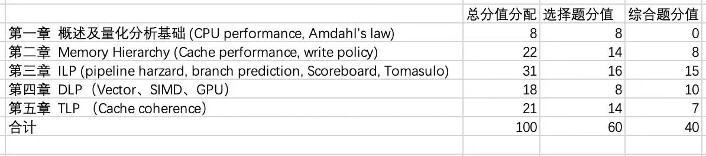

hsb老师重点：监听协议、MESI...

jxh老师重点：

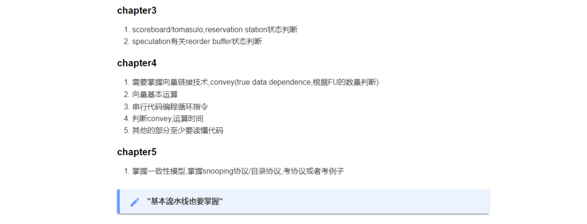

cr老师重点：

1. 量化分析：CPU performance，Amdahl's law，Cache performance， 流水线分析
2. pipeline的大题会出在ILP部分；体系最核心的东西围绕ISA展开，重点是实验的内容，数据通路，控制通路
3. hazard的各种情况和分类，要能指出具体例子的各种类型hazard
4. memory hierarchy、了解cache的四个question，性能分析和性能优化哪些方式是通过什么角度做的优化，write strategy每一种是什么样的
5. TLB的工作原理及各项包含的内容，virtual memory的各种块大小计算
6. ILP要看题设条件，可能会变每个器件的数量
7. scoreboard三个表的每一个项的含义，某一个时刻下应该是什么状态（不要和整体的弄混了）
8. tomasulo's approach每一个时刻的表，ROB，IS段流入一直是顺序的；多流出的情况及其实现（super pipeline - 加硬件实现流水线细分，解决性能分析里面的瓶颈问题，VLIW通过编译调度实现）
9. DLP and TLP。Flynn分类法的四个类型（SISD - 知道概念；SIMD - 向量计算，Array Processor不考；以Cray-1为例做的各个部分的分析（考试可能会改），向量处理机的优化 - 重点是link，分析能不能link，各种情况，给一段程序分析哪里可以链接可能不止一处，怎么分析clock cycle，RV64V、NVIDIA GPU的向量技术；和循环有关的并行Loop-Level Parallelism，如果是跨迭代相关就没法做向量链接了，如何消除；MISD不用管；MIMD：会考一些概念，对照课本UMA和NUMA的概念，其他的变形不会考；一致性协议一模一样的不会考了，snooping三四五态等等，不用记状态，考试都会给，根据操作要会判断状态的转换的过程）

cr复习ppt和去年的不同：

1. 常规流水线红星星去掉了，估计之前有大题今年没有了，把重点放ILP了

2. ISA去掉了一些内容，保留了设计原则和GPR Classification

3. 冲突类型由蓝星星变成红星星，甚至有两颗：

   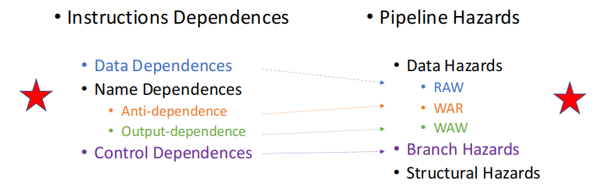

4. AMAT由蓝星星变成皇冠：

5. 重点来了，这三页是新加的：

   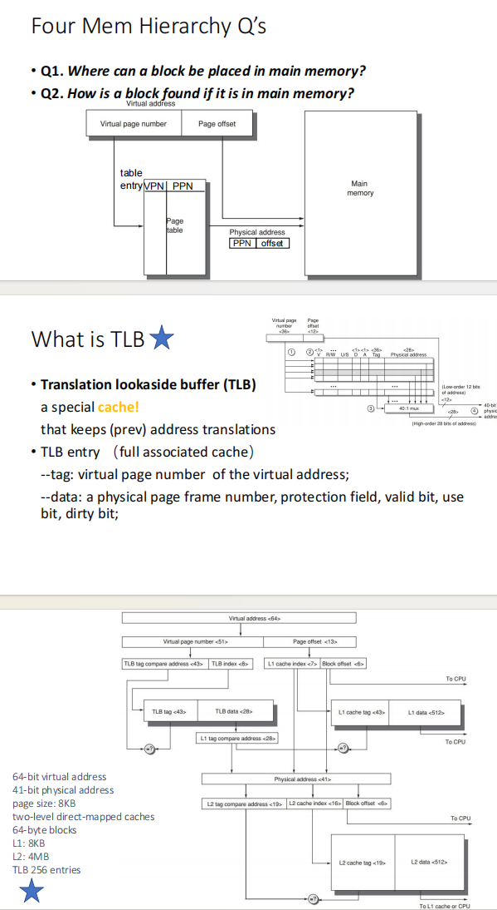

6. scoreboard和tomasulo本来的蓝星星变成了皇冠，没有加星星的加了蓝星星，感觉会考大题

7. 这页ppt加了很多表：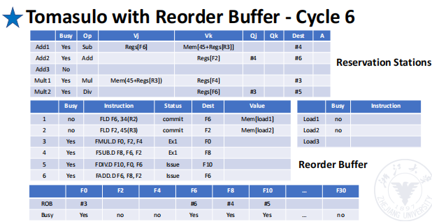

8. 重点又来了！SIMD里面的向量处理机部分全是新加的（从CRAY-1一直到Loop-Level Parallelism）

9. MIMD反而简略了，可能是不考特别难的大题了

---

现在回过头来看chap0的ppt的一些废话：

- 感觉体系结构从某种程度上讲确实是哲学课
- 着眼于优化性能的设计理念以及**why**
- 不哲学一点讲体系结构就是软硬件协同部分的设计和原理

---

## 1 计算机设计基础

*对应考纲第一章 - 概述及量化分析基础*

- CPU performance
- Amdahl's law

### 1.0 知识框架概述

计算机的发展基本可以概括为三个领域，对应三种特性：

- processing --- parallel
- transmission --- accuracy
- storage --- reliability

第一章就从顶层视角讲了一些如何量化评估performance以及一些设计的理念。

### 1.1 性能衡量

根据不同的用户需求，我们有衡量性能最基本的两个指标：

- PC用户 - 最短**响应时间** $\to$ Latency / Response time 响应时间 - 一个事件开始到结束的时间
- 大数据处理 - 最大**吞吐量** $\to$ Throughput / Bandwidth 带宽 - 给定时间范围内完成了多少工作量

对于单核处理器的性能评估，我们使用CPU time，具体有以下公式：

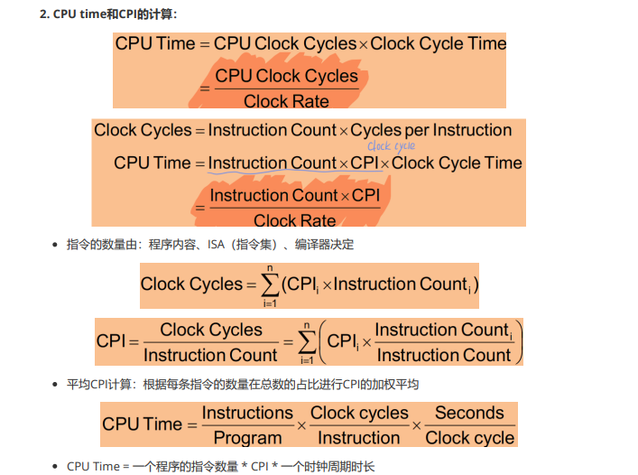

主要公式为：$CPU Time = \frac{\text{Instruction Count} \times \text{CPI}}{\text{Clock Rate}}$

而涉及到系统性能收益的提升，我们有：

1. Amdahl's Law - 单点优化对系统整体性能提升的收益

   对应的设计理念是make common case fast

   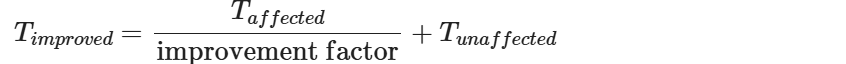

2. 加速比 - 性能是执行时间的倒数，相关公式如下：

   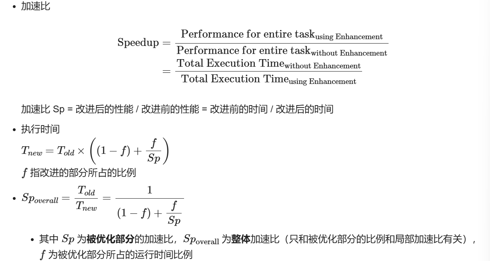

*其实我觉得这块掌握基本概念就可以，倒也没必要死记硬背。*

### 1.2 设计理念

*从计组开始老生常谈的八大设计理念（cr复习ppt上有*

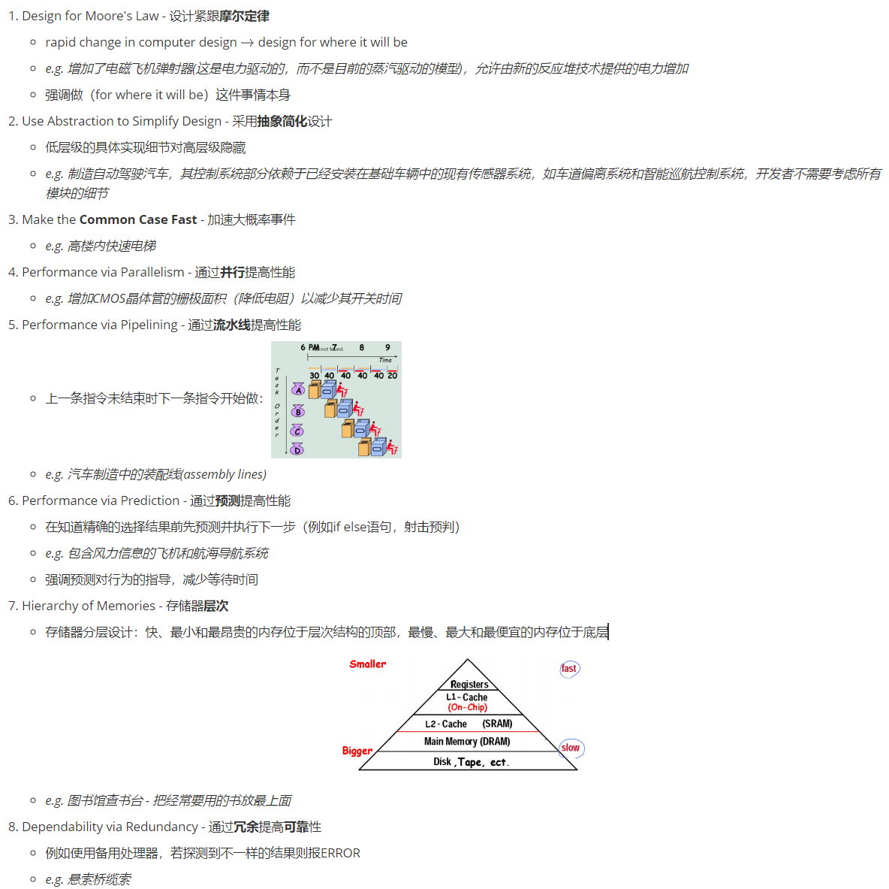

### 1.3 ISA

指令集是什么？

- 我的理解是高级语言和机器语言的桥梁，人类能看懂的最low level的语言

指令集架构设计的几个问题（这些问题的不同决定了不同类型的指令集）：

1. 操作数存哪 - 寄存器、内存、栈、累加器...
2. 几个操作数 - 0、1、2、3...
3. 操作寻址方式 - 寄存器、立即数、非直接寻址...
4. 支持什么类型和大小的操作数 - 整数、浮点数、字符、字符串、向量...
5. 支持什么操作类型 - 加、减、乘、比较、移动...

指令集架构设计原则：兼容，通用，高效，安全。

## 2 流水线

*对应考纲第三章 - ILP*

- Pipeline hazard
- Branch prediction

### 2.0 流水线概述

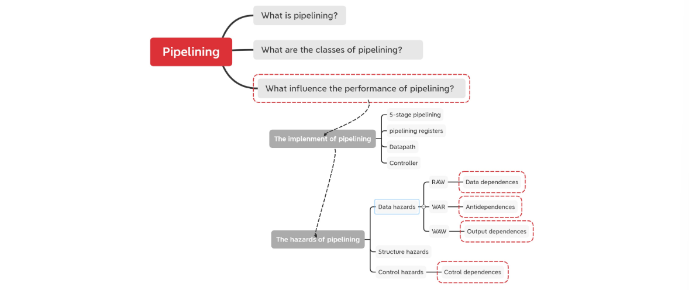

体系结构的流水线部分主要分为以下知识点：

1. 指令执行方式：串行、有重叠、两次重叠、流水线...
2. 流水线的分类：单功能/多功能（静态/动态）、不同粒度、线性/非线性、顺序/乱序、标量/向量处理器...
    - 这块不额外理了，看到上述概念要清楚地知道区别，不清楚的可以查看[课堂笔记](https://tsuki0512.github.io/2024_fall/CA/CA2/#classes-of-pipelining)
3. 流水线性能评估：吞吐量、加速比、效率...
4. 影响流水线性能的因素：流水线的设计、指令类型、指令相关性及其处理
    - 冲突类型：
5. 动态分支预测：BHT、BTB
6. 流水线非线性规划问题

### 2.1 流水线的overlapping设计

实现流水线的本质是通过overlap。将指令进行分段后可以让每一段使用不同的部件，并行执行。

- 每段时间如果不一致会引起：
    - 前面的阶段较长 - 资源浪费
    - 后面的阶段较长 - 部件冲突
- 分成三段后的时间计算：
    - 串行 - $3n\Delta t$
    - Single overlap - $(2n+1)\Delta t$
    - Twice overlap - $(n+2)\Delta t$
    - trade-off是硬件更复杂了
    - 流水线被分为几段称为流水线的深度
- 实现重叠的具体方式：
    - I Mem和D Mem区分避免结构冲突
    - 使用buffer缩短IF阶段时间使其和ID阶段合并
    - 也可以使用buffer平滑每段时间的差异：使得两个流水线阶段不需要直接连接，可以有空隙，流水线执行时间完全取决于EX段

### 2.2 流水线性能评估

#### 2.2.1 吞吐率Throughput

定义是$\frac{指令数量}{执行时间}$，没有量纲。

我们把最长的流水线段称为瓶颈段（时间为$\Delta t$），可以看到（推导出）$TP_{max} = \frac{1}{\Delta t}$

针对瓶颈段的优化方式有：

- subdivision - 给瓶颈段分段执行
- repetition - 在瓶颈段多使用几个部件并行执行

#### 2.2.2 加速比Speedup

$S_p = \dfrac{n\times m \times \Delta t_0}{(m+n-1)\times \Delta t_0} = \dfrac{n \times m}{m+n-1}$，没有量纲。

在$n >> m$的时候加速比约等于段数$m$，但是受数据读取传输损耗影响，段数不能无限大。

#### 2.2.3 效率Efficiency

具象化理解就是流水线时空图里面有颜色的占总长方形之比。单位是百分比。

$\eta = \dfrac{n\times m \times \delta t_0}{m(m+n-1)\delta t_0} = \dfrac{n}{m+n-1}$

在$n >> m$的时候效率约等于$100\%$。

记得看看[这两道例题](https://tsuki0512.github.io/2024_fall/CA/CA2/#pipeline-performance)

### 2.3 流水线冒险

感觉这一块lab1和3写过都差不多清楚了，稍微理个框架吧。细节看[课堂笔记](https://tsuki0512.github.io/2024_fall/CA/CA2/#hazards-of-pipelining)

流水线的冒险可以分为以下几类：

- 结构冒险 - 多条指令征用同一种资源
    - 解决方式：加bubble、加硬件、分I-cache和D-cache...
- 数据冒险
    - Data dependence: RAW
        - 可以通过调度指令解决
            - 静态调度：编译器，程序运行前
            - 动态调度：处理器，程序运行时
        - Forwarding 和 Stalling - 需要清楚判断条件
            - EX hazard
            - MEM hazard (double hazard)
            - Load-use hazard - 需要额外stall一拍
    - Name dependence: WAR/WAW
        - Anti-dependence - 毫不相干的两个操作数使用了同一个寄存器
        - Output-dependence - 两条指令的结果写到同一个寄存器内
        - 在顺序流水线重命名寄存器即可解决，乱序流水线可能有冲突冒险
- 控制冒险 - 采用分支预测减少stall
    - 静态分支预测
        - 延时槽
    - 动态分支预测
        - BTB - 1 bit、2 bits...
        - BHT
    - *这里也会有data hazard，处理思路也是能forward就forward，否则stall*

### 2.4 非线性流水线调度问题

看懂这个[例子](https://tsuki0512.github.io/2024_fall/CA/CA2/#schedule-of-nonlinear-pipelining)就行。

大致思路如下：

1. Initial conflict vector - 先不考虑时序问题，对每一个部件分开看，对每一个部件隔x拍会冲突的第x二进制位（最右边是第一位）设置为1，取每个部件的与，为0的位为下一条指令可以进来的拍数。
2. Conflict vector - 隔几拍就把原来的冲突向量右移几位，和新的冲突向量取与，为0的位为下一条指令可以进来的拍数。
3. State transition graph - 重复上述操作直到找到一个循环的调度（状态指的是当前的总的冲突向量）。

## 3 内存层次

*对应考纲第二章 - Memory Hierarchy*

- Chace performance
- Write policy

### 3.1 内存性能衡量

<!--

基于几个公式的计算：

1. 从CPU的执行和stall角度分类讨论：

   $CPUtime=IC \times (CPI_{Execution} + \frac{MemAccess}{Inst} \times MissRate \times MissPenalty) \times CycleTime$

   这里要注意$MemAccess = InstAccess + DataAccess$

2. 从CPU的指令类型（ALU还是Memory指令）分类讨论：

      - $AMAT(\text{Average Memory Access Time}) = \frac{\text{Whole accesses time}}{\text{All memory accesses in program}}$

        $ = (HitTime_{Inst} + MissRate_{Inst} \times MissPenalty_{Inst}) \times Inst\% + (HitTime_{Data} + MissRate_{Data} \times MissPenalty_{Data}) \times Data\%$

      - $CPU_{time} = IC \times (\frac{AluOps}{Inst}\times CPI_{AluOps} + \frac{MemAccess}{Inst}\times AMAT)\times CycleTime$

        $=(AluOps \times CPI_{AluOps} + MemAccess \times AMAT) \times Cycletime$ *我觉得这样理解会清楚一点*

-->

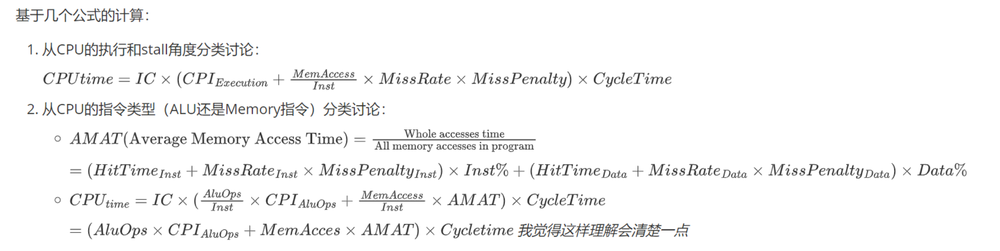

然后几个例题（建议自己做一遍或者抄到A4上）：

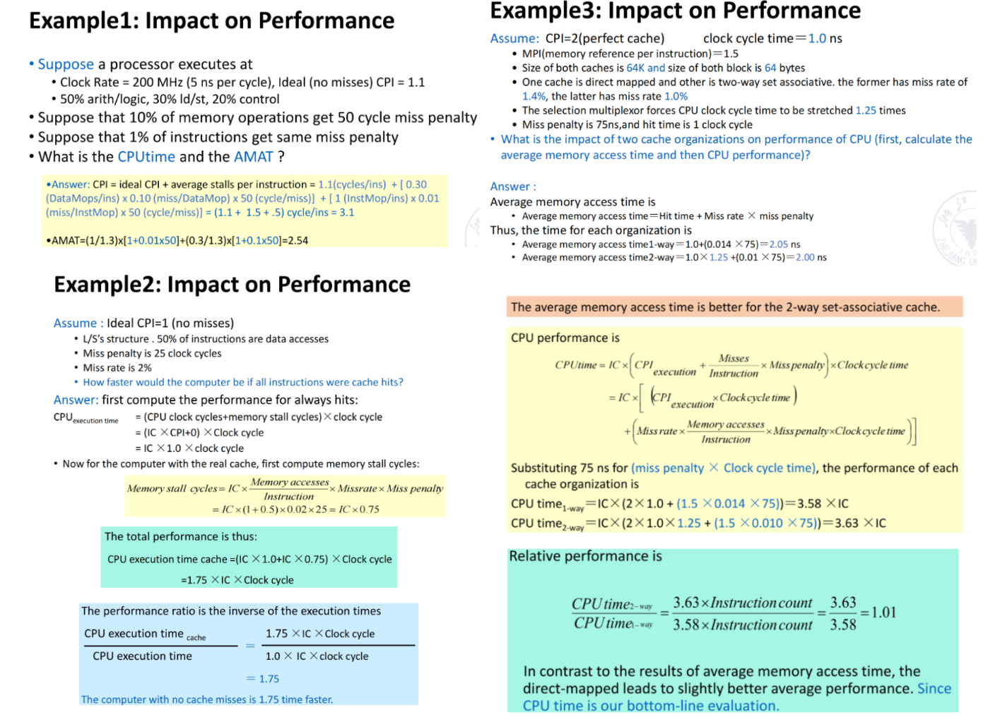

*注：example1的AMAT计算我觉得HitTime应该用1.1（好像也不对，看了eg3我觉得ideal CPI和hittime也不是一回事情），不知道为什么这里是1，有待确认。*

*re：默认的HitTime就是1个clock cycle（注意换算成具体时间的时候要×cycle time），但是一般情况下都会给出，HitTime和ideal CPI不是一回事情*

基于AMAT的优化方向：

1. 减少miss penalty
    - multilevel caches、critical word first、read miss before write miss、merging write buffers、victim caches
2. 减少miss rate
    - **larger block size、larger cache size、higher associativity、**way prediction、pseudo-associativity、compiler optimizations
    - *对miss rate、AMAT的影响趋势，不会考技术细节*
3. 减少hit time
    - small and simple caches、avoiding address translation、pipelined cache access、trace caches
4. 通过并行减少miss rate和miss penalty
    - non-blocking caches、hardware prefetching、compiler prefetching

### 3.2 Cache设计

基于计组的时候的四个问题：

#### 3.2.1 Block Placement

- Direct mapped - 相当于一路组相连
- Fully associative - 相当于n路组相连（n是cache的块数）
- Set associative

#### 3.2.2 Block Identification

使用tag辨别是否为同一个block：


#### 3.2.3 Block Replacement

- Random

- LRU - a stack replacement algorithm（同一时刻n块内的block是n+1块内block的子集）

    - 我们可以用栈模拟LRU的过程，清楚看到不同栈大小下的命中率

        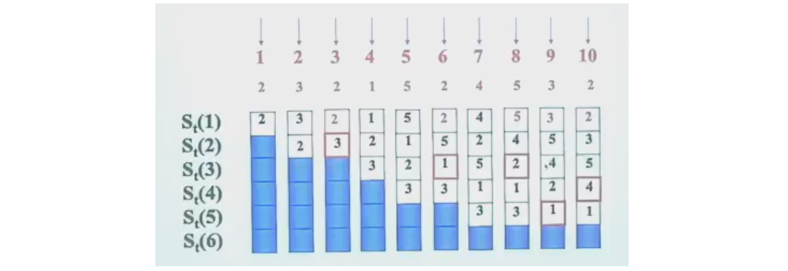

    - 我们可以用Comparison Pair Method实现LRU算法，核心部件是门和触发器：

        - 基本变量：用一个触发器表示两个块相对先后访问顺序，比如$T_{AB}$在A最近被访问时为1，B最近被访问的时候为0

        - 寻找被替换的块：在所有$T_{XY}$中均为最近不被访问的块

          

        - 每次访问块的维护：访问$A$后将所有$T_{AX}$置1或$T_{XA}$置0

- FIFO - not a stack replacement algorithm, 有belady现象（随着n增大命中率下降）

- OPT

#### 3.2.4 Write Strategy

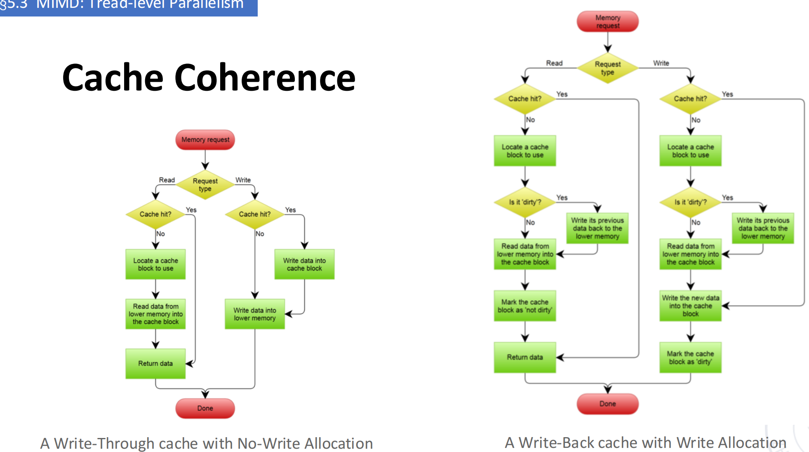

- Write Hit

    * **Write Through**：同时写回内存和cache。

      写到内存的时间较长，这个过程需要 **Write Stall**，或者使用 **Write Buffer**（节省stall的时间）。

    * **Write Back**：只在 Cache 中写，不写入memory，同时通过一个额外的 dirty bit 表示这个块已经被修改。

- Write Miss

    * **Write Around**(no-write allocate)：直接写到内存。
    * **Write Allocate**：将要写的块先读到 Cache 中，再写。

- In general, **write-back** caches use **write-allocate** , and **write-through** caches use **write-around**.

- write allocate可以降低miss的rate。

### 3.3 虚拟内存

virtual memory的范围是黄框部分：

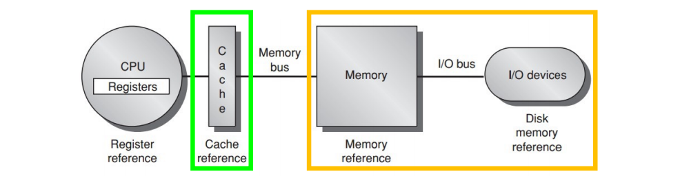

*os提到的这里不详细理了，就列个框架。*

- 物理地址和虚拟地址的转换
- 内存保护和共享
- 分页式和分段式

#### 3.3.1 虚拟内存设计问题

1. block placement - 为了降低miss rate采取全相联
2. block identification - 页号作为索引
3. block replacement - LRU
4. write strategy - write back with dirty bit, 在不得不写回disk的时候写回

#### 3.3.2 page table和TLB - cache对于虚拟内存的管理和优化

- 提出背景：如果我们采取最简单的页表完成虚拟地址映射的话，每次访问数据都要两次内存访问（一次页表一次实际数据）。所以我们引出了cache page table(TLB)。

- 基本思路：发送 tag (VPN) 尝试匹配，并看访问类型是否违规。如果匹配成功，就把对应的 PPN 送到 Mux，将偏移量加上 PPN 得到物理地址。

- 页大小选择：

    - 更大的页：页表更小；cache命中时间更短（页更大，要遍历的少）；更高效（一次搬更多数据）；TLB miss次数更少（映射了更多内存）。
    - 更小的页：内存的使用少；内部碎片少。

- 由此我们可以结合上述两种优点设计 - multiple page sizes

    - L1是指令cache，L2是数据cache（转换为物理地址之后再去查），两者页大小不一样

    - 这个图的位数计算好像是重点，需要会算（但是我还不是很会

      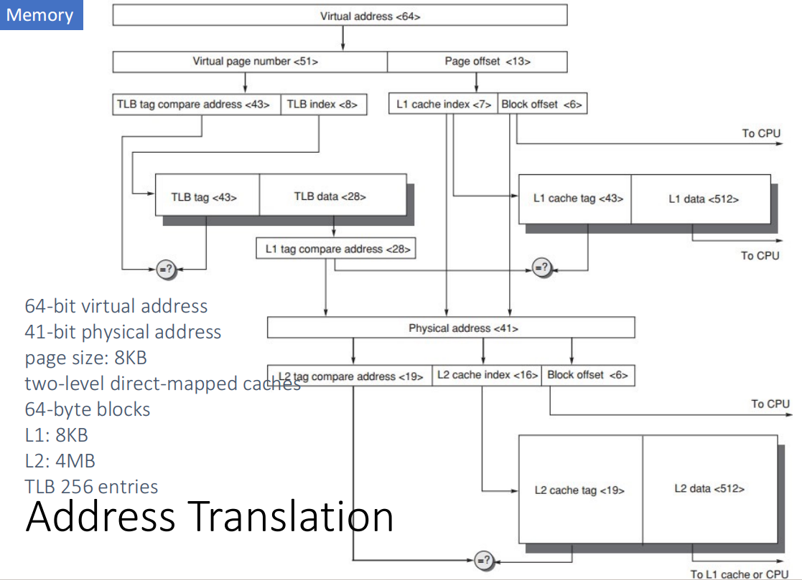

- 相关的计算：

    - 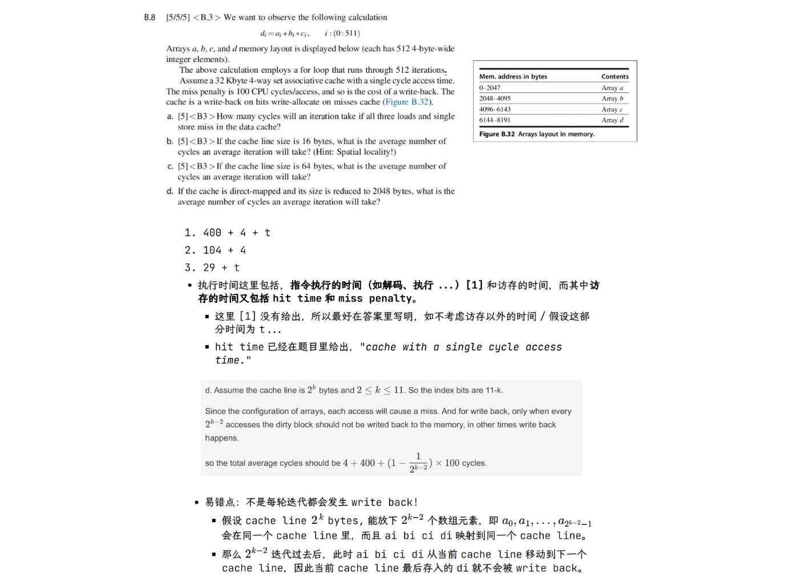

## 4 指令集并行

*对应考纲第三章 - ILP*

- Scoreboard
- Tomasulo

### 4.1 Scoreboard

执行流程：

1. **IS** - 顺序取指令，检测有无结构冲突（这里注意检查每个部件在设计的时候的个数，每种设计可能都不同）
2. **RO** - 从这里开始就是乱序了，检测有无数据冲突，读取操作数
3. EX
4. WB
5. *顺序提交，通过ROB实现*

在执行算法的时候，我们需要维护**三个表格**：

#### 4.1.1 Instruction Status

每条指令所在的阶段，具体的判断思路如下：

1. 指令顺序流入，每一拍流入一条指令
2. 如果判定没有结构冒险，则可以进入IS阶段，否则要等待占用此结构单元的指令WB结束释放该单元后进入IS阶段
3. 如果判定没有数据冒险，则可以进入RO阶段，否则需要等待对应操作数的指令WB结束后才可以进入RO阶段

例子：


<center>
    结构冲突：第6条指令等待第4条指令的ALU部件</br>
    数据冲突：第3、4条指令等待第2条指令的F2；第4、5条指令等待第1条指令的F6
</center>


<center>
    "when the FMUL.D is ready to write its result":</br>
    第3、4条指令：执行时间差异导致SUB执行完了但是MUL还在执行</br>
此时第6条指令由于第4条指令WB完毕，结构冲突消失，可以IS并且执行下面的步骤</br>
数据冲突：第5条指令等待第3条指令的F0
</center>


<center>
    "when the FDIV.D is ready to write its result":</br>
    此时第5条指令由于第3条指令WB完毕，数据冲突消失，可以RO并且执行下面的步骤
</center>

#### 4.1.2 Function Component Status

针对每个计算部件（`ld`、`sd`等指令是`Integer`部件）的状态记录。变量及其含义如下：

- `busy` - 此单元是否有指令正在使用；`op` - 此单元正在执行哪个类型的指令；
- `Fi` - 目的操作数对应的寄存器；`Fj`、`Fk` - 源操作数对应的寄存器；
- `Qj`、`Qk` - 源操作数等待的部件
- `Rj`、`Rk` - 源操作数的状态，个人理解这应该是一个寄存器的“锁”
    - `yes` - 这个操作数已经准备好了但是还没有读，因为其他操作数还没有ready。*这个时候相当于给这个寄存器加了一个不能写入新数据的锁*
    - `no` - 我觉得这个字面意思就是没有加写入锁，具体状态需要结合`Qi`、`Qj`是否有等待部件决定：
        - `Qi / Qj == null` - 操作数已经读取完毕
        - `Qi / Qj != null` - 正在等待`Q`中所指的部件的执行，操作数还没有ready

例子（分别对应4.1.1的三种情况）：


<center>这里F6在Divide指令下的yes决定了add指令必须等F6被读完（Div的Rk变成no）之后才能WB</center>


#### 4.1.3 Register Status

记录每个寄存器将被什么指令修改。

例子（分别对应4.1.1的三种情况）：


### 4.2 Tomasulo

使用寄存器重命名解决name dependence。

#### 4.2.1 基本的Tomasulo结构

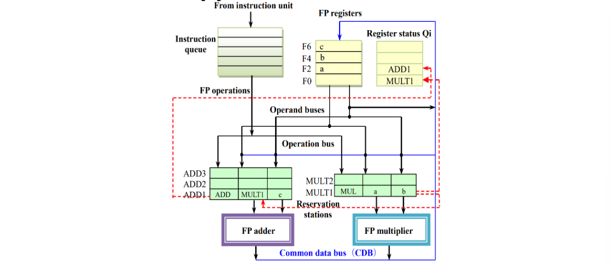

##### 4.2.1.1 执行流程

1. **IS** - 顺序取出队列中的指令放入保留站，如果有结构冲突则等待；进入保留站重命名消除WAR和WAW冒险。
   - 重命名：如果能读出来数值就直接读，如果需要等待则命名为等待的那个保留站。
2. **EX** - 等待保留站操作数全部就绪即可执行。
   - `ld`、`sd`指令多一步有效地址计算，IS之后执行地址计算然后再执行EX。
3. **WB** - 通过CDB总线将结果写回寄存器，并且通过广播将结果返回所有操作数等待的包含该保留站的保留站。释放保留站和`Qi`。

##### 4.2.1.2 数据表格

1. **Instruction status table**: 和scoreboard差不多，状态变成了IS、EX、WB三个阶段。
2. **Reservation stations table**: 功能部件状态表
    - `Busy`和`Op`和scoreboard一样
    - `Vj`、`Vk` - 记录操作数的具体的值
    - `Qj`、`Qk` - 记录操作数等待的保留站
    - `A` - 记录`ld`、`sd`指令的取值/写入地址
3. **Register status table**: 记录保留站的结果往哪里写。

例如上一组指令的两个时刻，三张表分别如下：

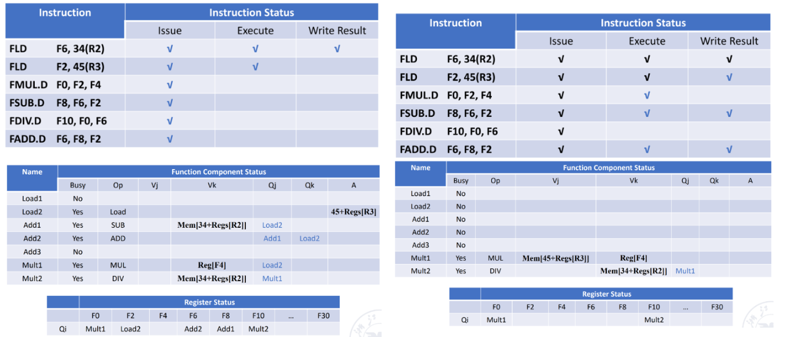

##### 4.2.1.3 例题

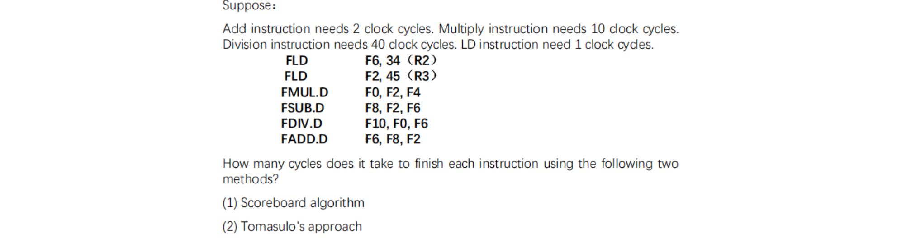

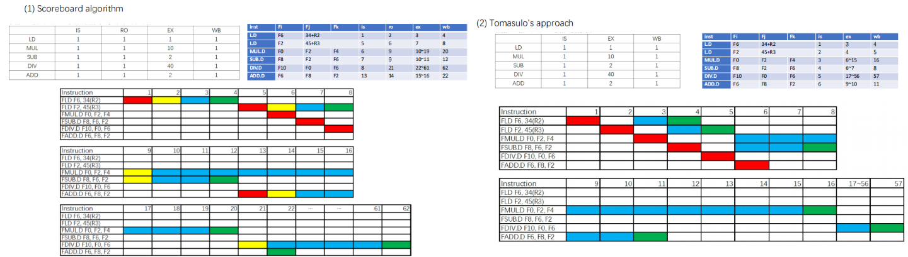

注意点：

1. 之前提到的scoreboard里面的F6被div上了锁，DIV读取之后ADD才能WB
2. IS段顺序流入，产生结构冲突只能等待
3. tomasulo里面`ld`、`sd`在IS之后EX之前需要额外一拍计算地址

#### 4.2.2 ROB (reorder buffer)

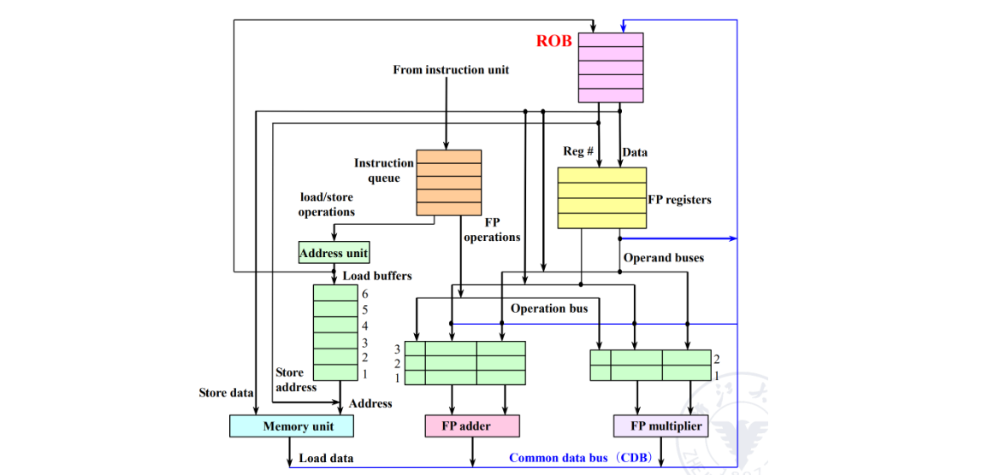

##### 4.2.2.1 执行顺序

为保证指令顺序提交（流出），添加一个ROB部件，并且修改WB状态为WB和commit两个状态：

- **WB** - 通过CDB总线将结果写到ROB，并且通过广播将结果返回所有操作数等待的包含该指令的保留站。释放保留站和`Qi`。
- **commit** - 确认前面的指令都已经提交后，将ROB的结果写到寄存器里。

##### 4.2.2.2 数据表格

1. **Reservation Station**: 记录保留站的数据，和没有ROB的table差不多，将`Qj`和`Qk`记录的内容变成了ROB内指令的序号，增加了`Dest`列记录写入的ROB的序号。
2. **Reorder Buffer**: 记录每个序号对应的是否busy及对应指令、状态、写入的目标寄存器和写入的值。
3. **Register Status**: 记录对应的寄存器将被哪个ROB内的指令修改。

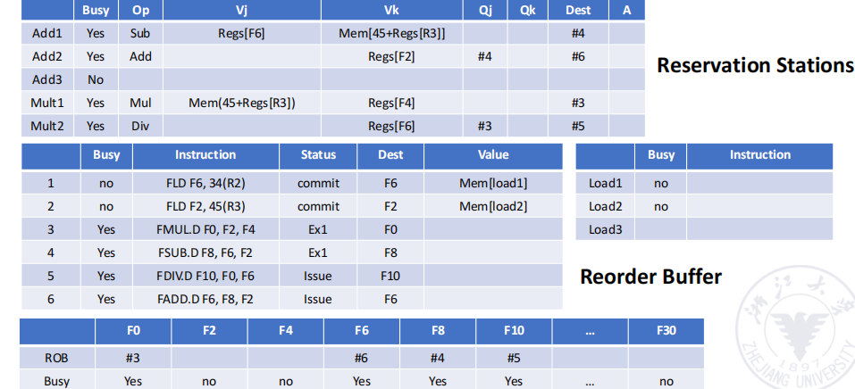

##### 4.2.2.3 例题

在上一道例题的基础上加一个commit状态，即在当前指令的WB结束且之前所有指令均commit之后可以commit：


### 4.3 多流出的流水线

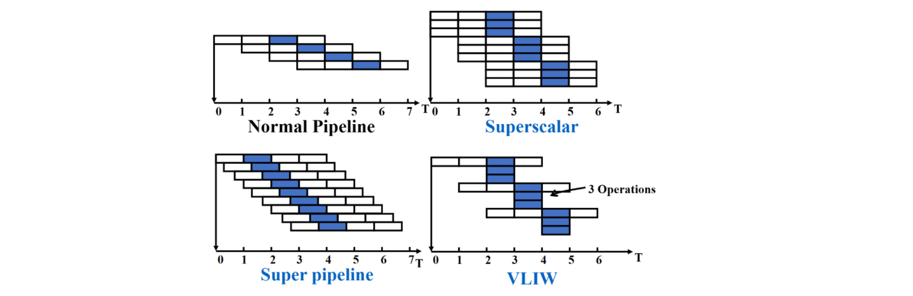

#### 4.3.1 Superscalar

#####  4.3.1.1 静态调度超标量

通过编译器完成。

每个时钟周期流出一个整型指令和一个浮点数指令，并行执行。

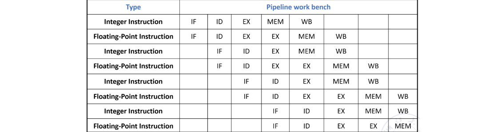

如果遇到了分支跳转指令，那么只流出这一条，不能和其他指令一起流出。

分支预测逻辑和普通流水线一致。

##### 4.3.1.2 动态调度超标量

通过硬件完成。

指令顺序进入两个保留站，并行分开处理。

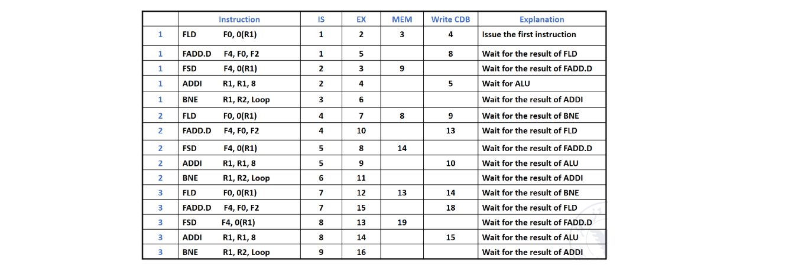

对于没有分支预测的情况，需要等待分支预测结果然后相关指令再进入EX阶段。

#### 4.3.2 Super pipeline

本质是流水线的细分，需要硬件的支持。

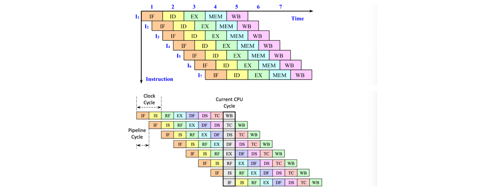

#### 4.3.3 VLIW

把比较复杂的阶段拆指令并行，通过编译器完成。

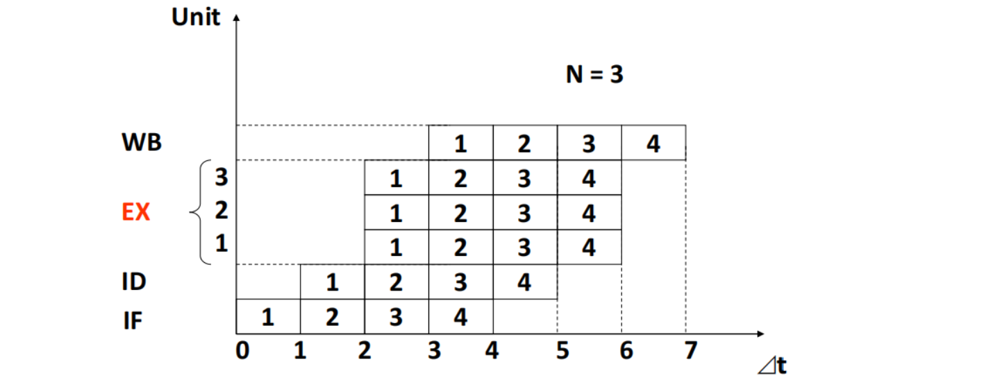

## 5 DLP

*对应考纲第四章 - DLP*

- vector
- SIMD
- GPU

情报：

- 以Cray-1为例做的各个部分的分析（考试可能会改）
- 向量处理机的优化 - 重点是link，分析能不能link，各种情况，给一段程序分析哪里可以链接可能不止一处，怎么分析clock cycle
- RV64V、NVIDIA GPU的向量技术
- 和循环有关的并行Loop-Level Parallelism，如果是跨迭代相关就没法做向量链接了，如何消除

### 5.1 SIMD - Vector Processor

SIMD为单指令流多数据流。

#### 5.1.1 向量基本计算方式

- Horizonal processing method 横向计算 - 逐个元素计算拼成结果向量
- Vertical procession method 纵向计算 - 按照功能逐个操作（加、乘）计算
- Horizonal and vertical processing method - 一个向量装不下所有数据：分组计算，组内纵向，组间横向

计算过程的硬件架构：


#### 5.1.2 CRAY-1及其分析

基本架构：

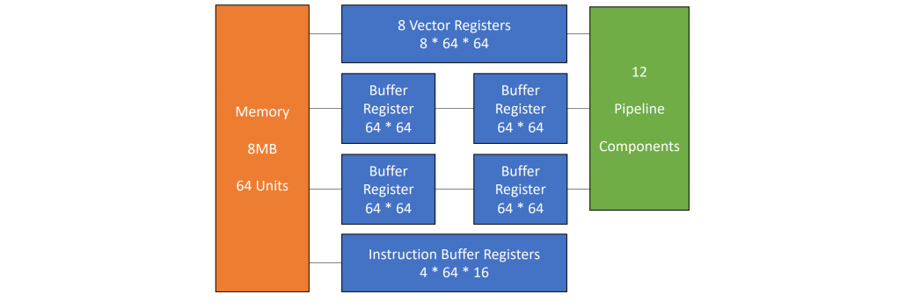

##### 5.1.2.1 向量指令相关性及其处理

- Vi conflict - 向量寄存器之间的依赖性，需要等待前一条指令的向量的**第一个元素计算完**再开始后续的指令。

  - RAW

    $V0 \leftarrow V1 + V2 $

    $V3 \leftarrow V0\times V4$

  - RAR

    $V0 \leftarrow V1 + V2$

    $V3 \leftarrow V1 \times V4$

- Functional conflict - 部件的结构冲突，必须等待前一条指令**最后一个元素完成**再开始后续的指令。

##### 5.1.2.2 CRAY-1指令类型

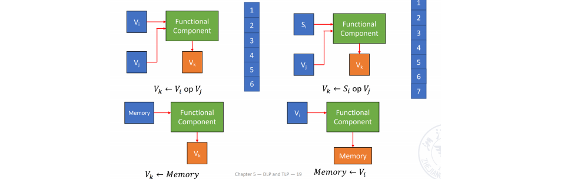

- 向量和向量计算
- 向量和标量计算
- 向量读取
- 向量存储

##### 5.1.2.3 CRAY-1的向量链接技术

在向量处理机的优化中，我们有以下几种技术：

- 增加功能部件使其并行工作
- 采用多处理器系统
- 采取recycling mining technology (?)

上述都依赖于增加部件，在这里我们关注**向量链接技术**。

基本应用场景是：两条指令第一条指令的结果是第二条指令的输入的时候，可以链接向量减少一次读写时间。

*这里的链接条件存疑，我上课记的是：后面的刚好要用到前面的且没有功能部件冲突，且两个操作数在同一拍准备好。后面的减少一次读写时间也存疑，个人理解的链接的本质是两条短指令变成一条长指令。*

在例题计算的时候，没有冲突的指令**并行**，存在RAW的指令**链接**，存在结构冲突的指令**串行**；向量功能内部**流水线执行**。

例子（抄到A4上）：

题目条件：

- 向量加法、读写需要6拍，向量乘法需要7拍；
- 把数据从寄存器送到功能部件需要1拍，功能部件结果写回寄存器需要1拍，数据从内存送到fetch function unit需要1拍；
- 计算$D = A \times (B + C)$，vector of length $N$，且$B$和$C$已经被存在$V0$和$V1$中。

解法：

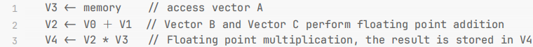

1. 三条指令串行的情况

   经过8拍$V0$的第一个元素到达$V2$，那么再过$(N-1)$拍$V0$的最后一个元素就会到达$V2$。

   因此总共需要$[(1+6+1)+N-1] + [(1+6+1)+N-1] + [(1+7+1)+N-1] = 3N+22$拍。

2. 前两条指令并行、和第三条指令串行的情况

   $max{[(1+6+1)+N-1], [(1+6+1)+N-1]} + [(1+7+1)+N-1] = 2N+15$

3. 采用向量链接技术

   我们只需要知道$V4$的第一个结果多久可以出来：$8+1+7+1=17$拍，随后还有$(N-1)$条指令，因此总共需要的拍数为$max{(1+6+1), (1+6+1)} + (1+7+1)+N-1 = N+16$拍。

#### 5.1.3 RV64V

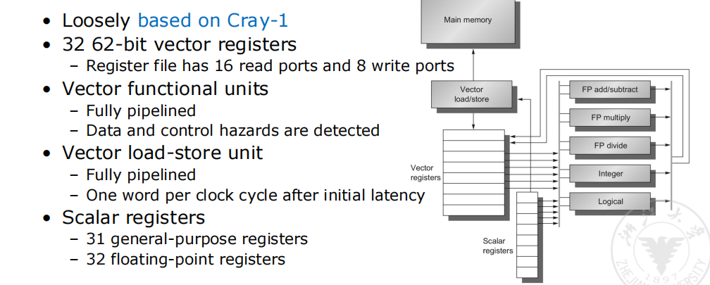

*这页复习ppt是今年新加的，但是我不知道能怎么考，先抄A4上吧*

标量处理和向量处理的汇编代码区别：

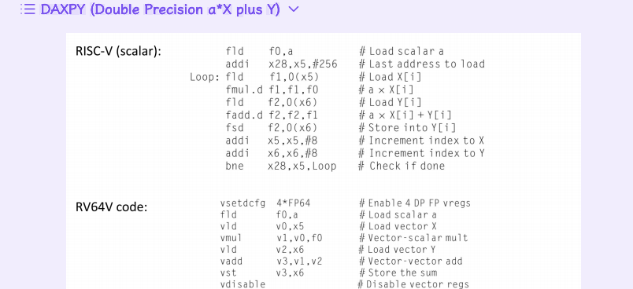

因为循环之间没有迭代相关（和跨迭代循环的数据相关），所以可以转化为向量运算，大大减少了指令条数。

还有一个例子：

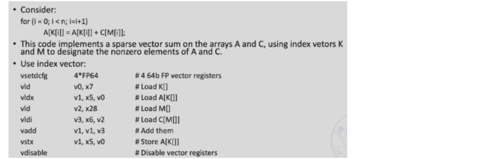

#### 5.1.4 NVIDIA GPU

还是属于SIMD的范畴。

内存管理：

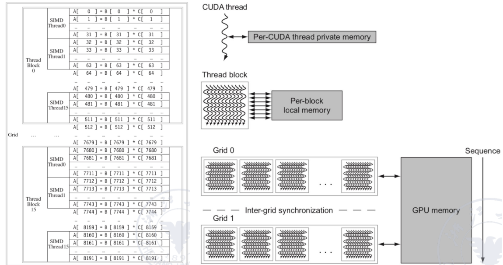

- 和向量机的相同之处：

  - 可以很好地处理数据级别的并行问题
  - Scatter-gather transfers 分散-聚集传输方式
  - Mask registers
  - Large register files

- 和向量机的不同之处：

  - 没有标量处理机

  - 采用多线程隐藏内存延迟

  - 拥有多个功能单元，而不像向量处理器那样只有少数几个深度流水线单元

  - 增加了硬件实现的线程调度机制，更快速和稳定

    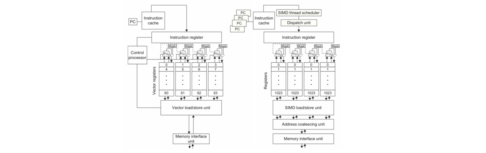

### 5.2 LLP

循环的并行是提升并行性的源泉。但是很多时候的并行需要条件判断。

1. 没有跨迭代相关的情况，直接并行

   

2. 有跨迭代相关但是可以消除

   *个人认为消除跨迭代相关的本质是不让B[i]和B[i+1]出现在一个循环里，把相关性放到同一个循环内*

   本次循环两个指令相关可以使用向量链接技术解决

   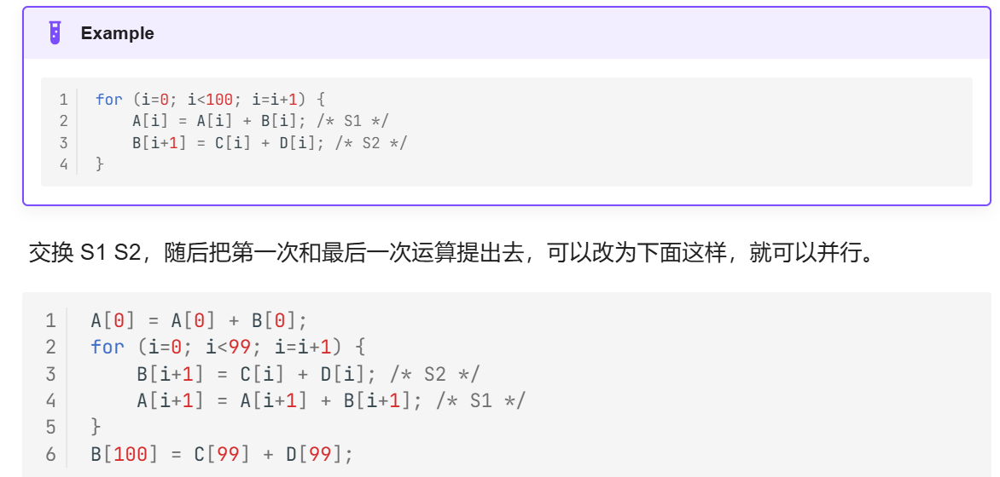

3. 无法消除的跨迭代循环（两条指令都跨迭代相关）

   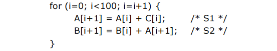

相关性的判断与通过重命名解决dependency：

- 数据相关（RAW）：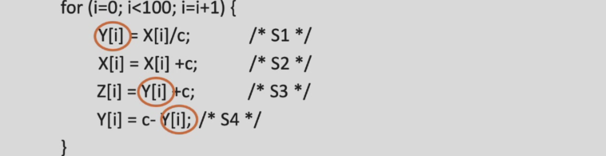
- 名相关（anti-dependence）：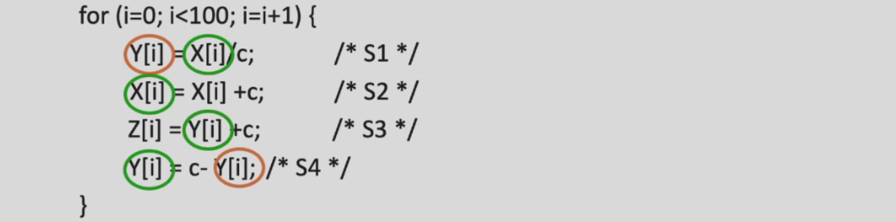
- 输出相关（output-dependence）：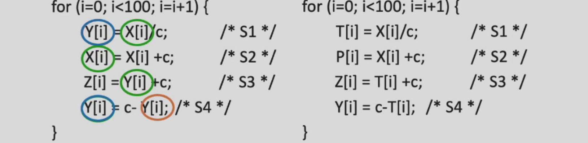
- 上图的右边展示了重命名消除相关性的方式：数据相关的寄存器名保存一致，其他的相关的寄存器名改成不一致的。（这个例子没有跨迭代相关）

## 6 TLP

对应考纲第五章 - TLP

- Cache coherence

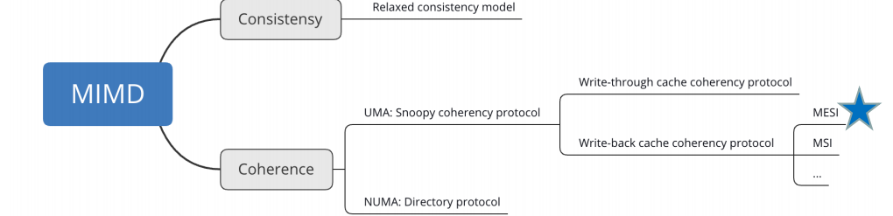


### 6.1 多处理器的内存架构

#### 6.1.1 Shared Memory System


有一个共同的地址空间，有一个统一的操作系统管理内存、给不同进程使用内存。

#### 6.1.2 Message Passing System

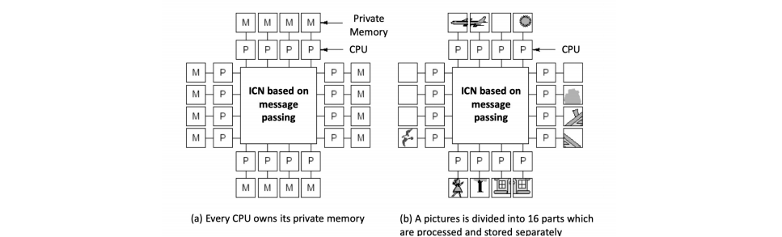

每一个进程都要自己的内存，通过ICN（互联网线）传递信息，可以共同完成任务；每一个进程都有自己的OS，可以分层，ICN连其他ICN：


#### 6.1.3 UMA


- 所有的物理存储器，由所有的进程一起使用，**均匀共享**，即没有进程对某个存储器有特殊的访问权限，访问的时间相同，即不存在谁离谁更近的问题。
- 进程可以有自己的拓展，比如 cache、IO、local memory；每个CPU也可以有自己的私有内存和cache。
- 因为他的高度共享性，UMA 也叫紧耦合系统。
- UMA又叫**SMP** - 对称多处理机或者centralized shared-memory multiprocessors。

#### 6.1.4 NUMA


- 对某个进程都自己的 local memory，由 ICN 连起来。

- 被共享的存储器是不均匀的。访问自己的 **local memory 最快**，访问别人的慢。

- 进程也可以有自己的拓展。

- NUMA 有两种拓展：

  - NC-NUMA: Non Cache NUMA 没cache

    

  - CC-NUMA: Coherent Cache NUMA 有cache

    有自己的 cache 和目录，存在 cache 一致性的问题。当有一个数据改了，如何保证其他 cache 里的数据的正确性。多个cache从表现上不存在内存的不统一，好像只有一个cache一样。

    

- NUMA又叫**distributed shared-memory multiprocessor (DSP)**。

<div align = center></div>

### 6.2 Cache coherence and memory consistency

状态机不用抄，给协议会分析就可以。

在Memory Consistency中，对一组先写后读的指令先读后写是错误的，需要一个model保证指令执行的顺序性。

而对于Cache Coherence而言，我们面对的问题是可能有多个 cache，都放有内存拷贝的数据，可能不一致。我们一般通过一个协议来约定，使得cpu在任意一个cache里面读数据，读出来的一定是最新的数据（即刚被写过的值）。最直接的思路就是让包含过期数据的cache失效。

#### 6.2.1 Snoopy Coherence Protocol

总线监听协议，适用于UMA(SMP)，所有处理器监听总线，由总线广播失效信息或更新数据。

针对不同的写策略，有不同的协议：

##### 6.2.1.1 Write Through


##### 6.2.1.2 Write back

**MSI**

状态：

- Invalid: 缓存块无效，不能被使用；
- Shared: 缓存块未被修改，且可能存在于多个缓存中，内存中的数据是最新的；
- Modified: 缓存行已被修改，且该缓存行是唯一的有效副本，内存中的数据已过时。

转换逻辑：

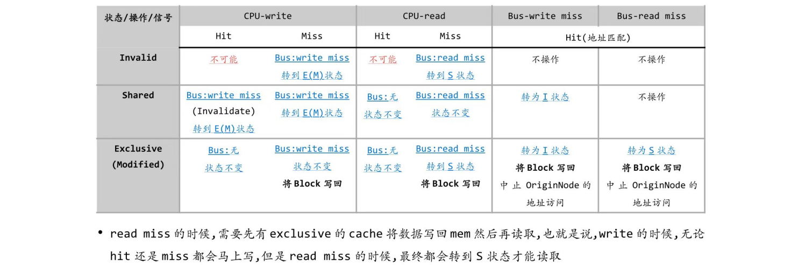

详解：（[来源](https://blog.csdn.net/violet_echo_0908/article/details/78839692)）

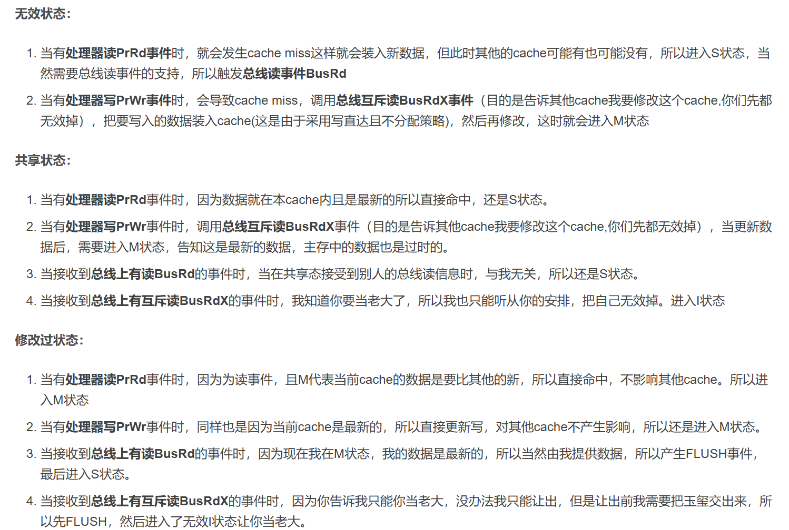

**MESI**

状态：

- Invalid: 缓存块无效，不能被使用；
- Shared: 缓存块未被修改，且可能存在于多个缓存中，内存中的数据是最新的；
- Modified: 缓存行已被修改，且该缓存行是唯一的有效副本，内存中的数据已过时；
- Exclusive：缓存块未被修改，且是唯一的有效副本，内存中的数据是最新的。

转换逻辑：

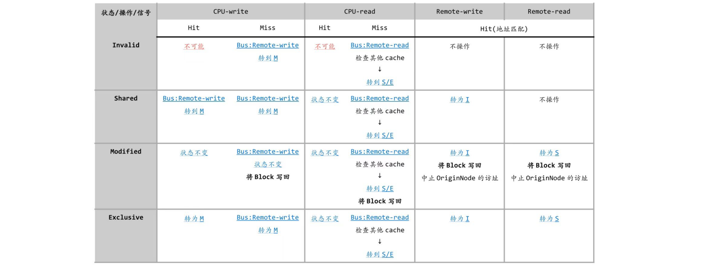

例子：

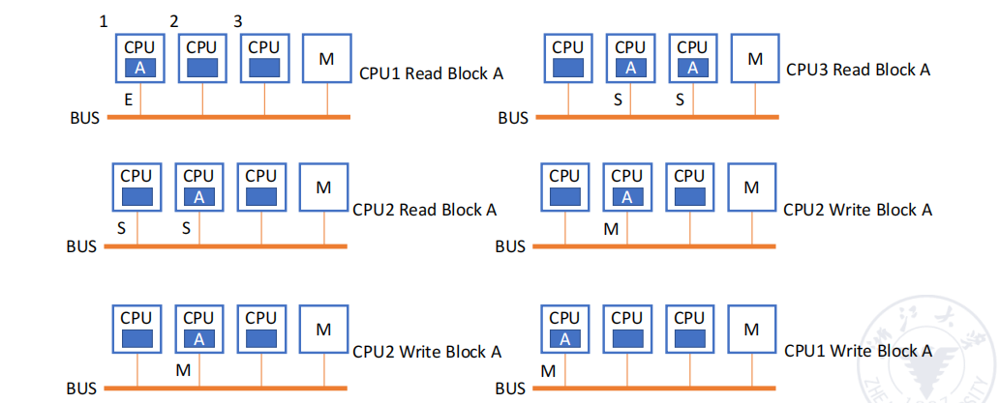

**MOESI**

添加状态：

- Owned: 缓存块已被修改，可以存在于多个缓存中，内存中的数据已过时，但其他缓存可以从拥

  有该缓存行的缓存中读取数据。

##### 6.2.1.3 False Sharing

本身两个线程之间的变量没有关系，但是在同一个cacheline里面，会导致cache的状态频繁切换，性能降低：

1. 多个处理器在同一个缓存块中存储不同的数据。
2. 一个处理器修改了缓存块中的数据，导致其他处理器的缓存块失效。
3. 其他处理器必须重新加载缓存块，即使它们访问的数据没有被修改

可通过内存填充，把两个变量分别放到两个 Cache：

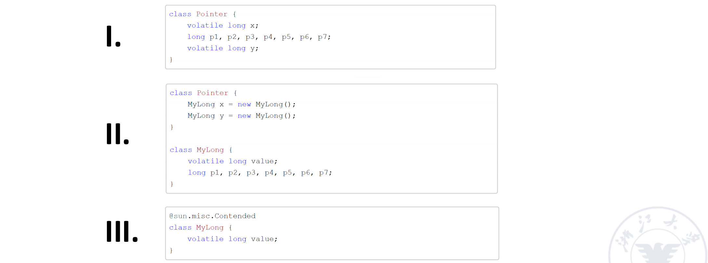

#### 6.2.2 Directory Protocol

目录协议，适用于NUMA(DSP)，用分布式目录记录系统中的哪些处理器在缓存中拥有某些存储块的副本，通过目录”点对点“发送失效信息。

就是是把 cache block 的共享信息存放在一个固定的地方，这个地方我们称之为 directory：

```
| State | Owner | Share List |
State: Block 的状态
Share List: 当前拥有该 Cache Block 拷贝的节点列表 
```

对每个缓存块，维护其状态(MSI Protocol)

- Shared：一个或多个目录拥有这个缓存块，且值是最新的
- Invalid
- Modified：正好一个目录拥有这个缓存块，在内存中的值已经过时  

对每个目录，维护其状态：

- Uncached
- Shared
- Exclusive

单个缓存块的 state transition diagram 如下：

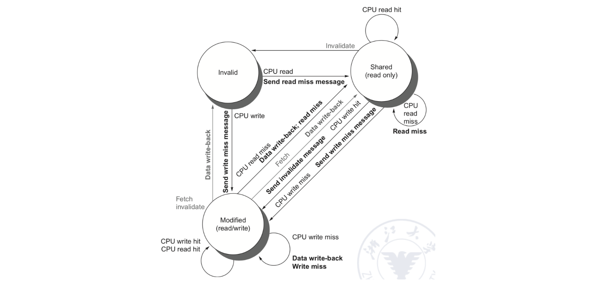

<center>来自本地处理器的请求显示为黑色，来自主目录的请求显示为灰色。</center>

目录的 state transition diagram 如下：

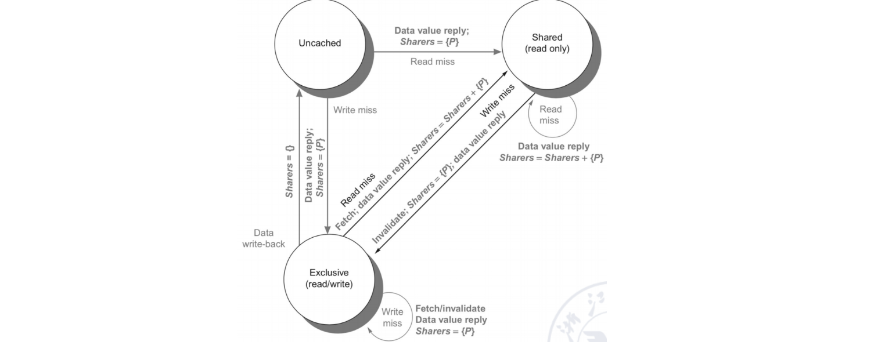

<center>所有的动作都是灰色的，因为它们都是外部引起的。</center>

和 MSI 的 transition 是类似的

#### 6.2.3 Memory consistency

基本规则：X → Y，操作 X 必须在操作 Y 前完成

顺序一致性 Sequential Consistency

- Accesses on each processor were kept in order
- Accesses on different processors were arbitrarily interleaved
- R → W：读操作必须在写操作之前完成。
- R → R：读操作必须在另一个读操作之前完成。
- W → R：写操作必须在读操作之前完成。
- W → W：写操作必须在另一个写操作之前完成。

松散一致性模型 Relaxed Consistency Models

- allow reads and writes to complete out of order, but to use synchronization operations to enforce ordering
  允许读和写无序完成，但使用同步操作强制排序
- Relax W → R：允许写操作在读操作之前完成
- Relax W → W：允许写操作在另一个写操作之前完成
- Relax R → W and R → R：允许读操作在写操作和另一个读操作之前完成

<script>
MathJax = {
  tex: {
    inlineMath: [['$', '$'], ['\\(', '\\)']]
  }
};
</script>
<script id="MathJax-script" async
  src="https://cdn.jsdelivr.net/npm/mathjax@3/es5/tex-chtml.js">
</script>
