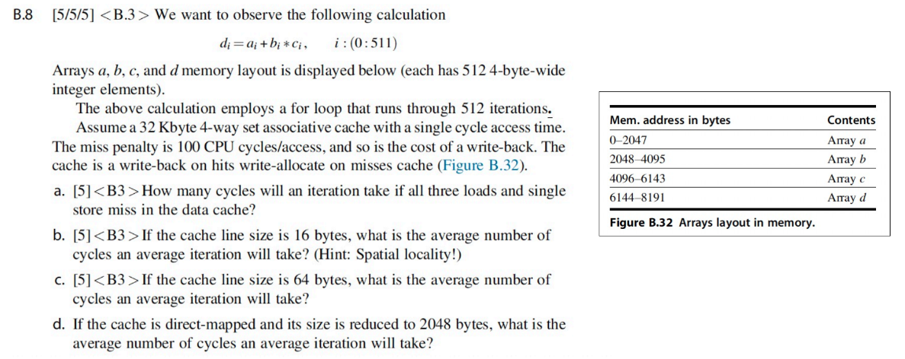

# 体系结构期末复习

开工时间：2024.12.20晚21:00

争取圣诞前拿下！（嗯。对不起，被bs硬控了。跨年前拿下！

*cr老师还没划重点，我先按我觉得是重点的理了（x*

----

*一点期末考情报*

期末章节分数分布：

重点：监听协议、MESI...

---

现在回过头来看chap0的ppt的一些废话：

- 感觉体系结构从某种程度上讲确实是哲学课
- 着眼于优化性能的设计理念以及**why**
- 不哲学一点讲体系结构就是软硬件协同部分的设计和原理

---

## 1 计算机设计基础

*对应考纲第一章 - 概述及量化分析基础*

- CPU performance
- Amdahl's law

### 1.0 知识框架概述

计算机的发展基本可以概括为三个领域，对应三种特性：

- processing --- parallel
- transmission --- accuracy
- storage --- reliability

第一章就从顶层视角讲了一些如何量化评估performance以及一些设计的理念。

### 1.1 性能衡量

根据不同的用户需求，我们有衡量性能最基本的两个指标：

- PC用户 - 最短**响应时间** $\to$ Latency / Response time 响应时间 - 一个事件开始到结束的时间
- 大数据处理 - 最大**吞吐量** $\to$ Throughput / Bandwidth 带宽 - 给定时间范围内完成了多少工作量

对于单核处理器的性能评估，我们使用CPU time，具体有以下公式：

而涉及到系统性能收益的提升，我们有：

1. Amdahl's Law - 单点优化对系统整体性能提升的收益

   

2. 加速比 - 性能是执行时间的倒数，相关公式如下：

   

*其实我觉得这块掌握基本概念就可以，倒也没必要死记硬背。*

### 1.2 设计理念

*从计组开始老生常谈的八大设计理念（会考吗（我不知道（我今天废话好多*

### 1.3 ISA

指令集是什么？

- 我的理解是高级语言和机器语言的桥梁，人类能看懂的最low level的语言

指令集架构设计的几个问题（这些问题的不同决定了不同类型的指令集）：

1. 操作数存哪 - 寄存器、内存、栈、累加器...
2. 几个操作数 - 0、1、2、3...
3. 操作寻址方式 - 寄存器、立即数、非直接寻址...
4. 支持什么类型和大小的操作数 - 整数、浮点数、字符、字符串、向量...
5. 支持什么操作类型 - 加、减、乘、比较、移动...

指令集架构设计原则：兼容，通用，高效，安全。

## 2 流水线

*对应考纲第三章 - ILP*

- Pipeline hazard
- Branch prediction

### 2.0 流水线概述

体系结构的流水线部分主要分为以下知识点：

1. 指令执行方式：串行、有重叠、两次重叠、流水线...
2. 流水线的分类：单功能/多功能（静态/动态）、不同粒度、线性/非线性、顺序/乱序、标量/向量处理器...
    - 这块不额外理了，看到上述概念要清楚地知道区别，不清楚的可以查看[课堂笔记](https://tsuki0512.github.io/2024_fall/CA/CA2/#classes-of-pipelining)
3. 流水线性能评估：吞吐量、加速比、效率...
4. 影响流水线性能的因素：流水线的设计、指令类型、指令相关性及其处理
    - 冲突类型：
5. 动态分支预测：BHT、BTB
6. 流水线非线性规划问题

### 2.1 流水线的overlapping设计

实现流水线的本质是通过overlap。将指令进行分段后可以让每一段使用不同的部件，并行执行。

- 每段时间如果不一致会引起：
    - 前面的阶段较长 - 资源浪费
    - 后面的阶段较长 - 部件冲突
- 分成三段后的时间计算：
    - 串行 - $3n\Delta t$
    - Single overlap - $(2n+1)\Delta t$
    - Twice overlap - $(n+2)\Delta t$
    - trade-off是硬件更复杂了
    - 流水线被分为几段称为流水线的深度
- 实现重叠的具体方式：
    - I Mem和D Mem区分避免结构冲突
    - 使用buffer缩短IF阶段时间使其和ID阶段合并
    - 也可以使用buffer平滑每段时间的差异：使得两个流水线阶段不需要直接连接，可以有空隙，流水线执行时间完全取决于EX段

### 2.2 流水线性能评估

#### 2.2.1 吞吐率Throughput

定义是$\frac{指令数量}{执行时间}$，没有量纲。

我们把最长的流水线段称为瓶颈段（时间为$\Delta t$），可以看到（推导出）$TP_{max} = \frac{1}{\Delta t}$

针对瓶颈段的优化方式有：

- subdivision - 给瓶颈段分段执行
- repetition - 在瓶颈段多使用几个部件并行执行

#### 2.2.2 加速比Speedup

$S_p = \dfrac{n\times m \times \Delta t_0}{(m+n-1)\times \Delta t_0} = \dfrac{n \times m}{m+n-1}$，没有量纲。

在$n >> m$的时候加速比约等于段数$m$，但是受数据读取传输损耗影响，段数不能无限大。

#### 2.2.3 效率Efficiency

具象化理解就是流水线时空图里面有颜色的占总长方形之比。单位是百分比。

$\eta = \dfrac{n\times m \times \delta t_0}{m(m+n-1)\delta t_0} = \dfrac{n}{m+n-1}$

在$n >> m$的时候效率约等于$100\%$。

记得看看[这两道例题](https://tsuki0512.github.io/2024_fall/CA/CA2/#pipeline-performance)

### 2.3 流水线冒险

感觉这一块lab1和3写过都差不多清楚了，稍微理个框架吧。细节看[课堂笔记](https://tsuki0512.github.io/2024_fall/CA/CA2/#hazards-of-pipelining)

流水线的冒险可以分为以下几类：

- 结构冒险 - 多条指令征用同一种资源
    - 解决方式：加bubble、加硬件、分I-cache和D-cache...
- 数据冒险
    - Data dependence: RAW
        - 可以通过调度指令解决
            - 静态调度：编译器，程序运行前
            - 动态调度：处理器，程序运行时
        - Forwarding 和 Stalling - 需要清楚判断条件
            - EX hazard
            - MEM hazard (double hazard)
            - Load-use hazard - 需要额外stall一拍
    - Name dependence: WAR/WAW
        - Anti-dependence - 毫不相干的两个操作数使用了同一个寄存器
        - Output-dependence - 两条指令的结果写到同一个寄存器内
        - 在顺序流水线重命名寄存器即可解决，乱序流水线可能有冲突冒险
- 控制冒险 - 采用分支预测减少stall
    - 静态分支预测
        - 延时槽
    - 动态分支预测
        - BTB - 1 bit、2 bits...
        - BHT
    - *这里也会有data hazard，处理思路也是能forward就forward，否则stall*

### 2.4 非线性流水线调度问题

看懂这个[例子](https://tsuki0512.github.io/2024_fall/CA/CA2/#schedule-of-nonlinear-pipelining)就行。

大致思路如下：

1. Initial conflict vector - 先不考虑时序问题，对每一个部件分开看，对每一个部件隔x拍会冲突的第x二进制位（最右边是第一位）设置为1，取每个部件的与，为0的位为下一条指令可以进来的拍数。
2. Conflict vector - 隔几拍就把原来的冲突向量右移几位，和新的冲突向量取与，为0的位为下一条指令可以进来的拍数。
3. State transition graph - 重复上述操作直到找到一个循环的调度（状态指的是当前的总的冲突向量）。

## 3 内存层次

*对应考纲第二章 - Memory Hierarchy*

- Chace performance
- Write policy

### 3.1 内存性能衡量

<!--

基于几个公式的计算：

1. 从CPU的执行和stall角度分类讨论：

   $CPUtime=IC \times (CPI_{Execution} + \frac{MemAccess}{Inst} \times MissRate \times MissPenalty) \times CycleTime$

   这里要注意$MemAccess = InstAccess + DataAccess$

2. 从CPU的指令类型（ALU还是Memory指令）分类讨论：

      - $AMAT(\text{Average Memory Access Time}) = \frac{\text{Whole accesses time}}{\text{All memory accesses in program}}$

        $ = (HitTime_{Inst} + MissRate_{Inst} \times MissPenalty_{Inst}) \times Inst\% + (HitTime_{Data} + MissRate_{Data} \times MissPenalty_{Data}) \times Data\%$

      - $CPU_{time} = IC \times (\frac{AluOps}{Inst}\times CPI_{AluOps} + \frac{MemAccess}{Inst}\times AMAT)\times CycleTime$

        $=(AluOps \times CPI_{AluOps} + MemAccess \times AMAT) \times Cycletime$ *我觉得这样理解会清楚一点*

-->

然后几个例题（建议自己做一遍或者抄到A4上）：

*注：example1的AMAT计算我觉得HitTime应该用1.1（好像也不对，看了eg3我觉得ideal CPI和hittime也不是一回事情），不知道为什么这里是1，有待确认。*

基于计算的优化方向（具体等划了重点再看吧）：

1. 减少miss penalty
    - multilevel caches、critical word first、read miss before write miss、merging write buffers、victim caches
2. 减少miss rate
    - larger block size、larger cache size、higher associativity、way prediction、pseudo-associativity、compiler optimizations
3. 减少hit time
    - small and simple caches、avoiding address translation、pipelined cache access、trace caches
4. 通过并行减少miss rate和miss penalty
    - non-blocking caches、hardware prefetching、compiler prefetching

### 3.2 Cache设计

基于计组的时候的四个问题：

#### 3.2.1 Block Placement

- Direct mapped - 相当于一路组相连
- Fully associative - 相当于n路组相连（n是cache的块数）
- Set associative

#### 3.2.2 Block Identification

使用tag辨别是否为同一个block：

#### 3.2.3 Block Replacement

- Random

- LRU - a stack replacement algorithm（同一时刻n块内的block是n+1块内block的子集）

    - 我们可以用栈模拟LRU的过程，清楚看到不同栈大小下的命中率

        

    - 我们可以用Comparison Pair Method实现LRU算法，核心部件是门和触发器：

        - 基本变量：用一个触发器表示两个块相对先后访问顺序，比如$T_{AB}$在A最近被访问时为1，B最近被访问的时候为0

        - 寻找被替换的块：在所有$T_{XY}$中均为最近不被访问的块

          

        - 每次访问块的维护：访问$A$后将所有$T_{AX}$置1或$T_{XA}$置0

- FIFO - not a stack replacement algorithm, 有belady现象（随着n增大命中率下降）

- OPT

#### 3.2.4 Write Strategy

- Write Hit

    * **Write Through**：直接写回到内存。

      写到内存的时间较长，这个过程需要 **Write Stall**，或者使用 **Write Buffer**（节省stall的时间）。

    * **Write Back**：只在 Cache 中写，不写入memory，同时通过一个额外的 dirty bit 表示这个块已经被修改。

- Write Miss

    * **Write Around**(no-write allocate)：直接写到内存。
    * **Write Allocate**：将要写的块先读到 Cache 中，再写。

- In general, **write-back** caches use **write-allocate** , and **write-through** caches use **write-around**.

- write allocate可以降低miss的rate。

### 3.3 虚拟内存

virtual memory的范围是黄框部分：

*os提到的这里不详细理了，就列个框架。*

- 物理地址和虚拟地址的转换
- 内存保护和共享
- 分页式和分段式

#### 3.3.1 虚拟内存设计问题

1. block placement - 为了降低miss rate采取全相联
2. block identification - 页号作为索引
3. block replacement - LRU
4. write strategy - write back with dirty bit, 在不得不写回disk的时候写回

#### 3.3.2 page table和TLB - cache对于虚拟内存的管理和优化

- 提出背景：如果我们采取最简单的页表完成虚拟地址映射的话，每次访问数据都要两次内存访问（一次页表一次实际数据）。所以我们引出了cache page table(TLB)。

- 基本思路：发送 tag (VPN) 尝试匹配，并看访问类型是否违规。如果匹配成功，就把对应的 PPN 送到 Mux，将偏移量加上 PPN 得到物理地址。

- 页大小选择：

    - 更大的页：页表更小；cache命中时间更短（页更大，要遍历的少）；更高效（一次搬更多数据）；TLB miss次数更少（映射了更多内存）。
    - 更小的页：内存的使用少；内部碎片少。

- 由此我们可以结合上述两种优点设计 - multiple page sizes

    - L1是指令cache，L2是数据cache（转换为物理地址之后再去查），两者页大小不一样

      

- 相关的计算：

    - 

## 4 指令集并行

*对应考纲第三章 - ILP*

- Scoreboard
- Tomasulo

// todo

