# 操作系统

## Introduction

课程主要内容：

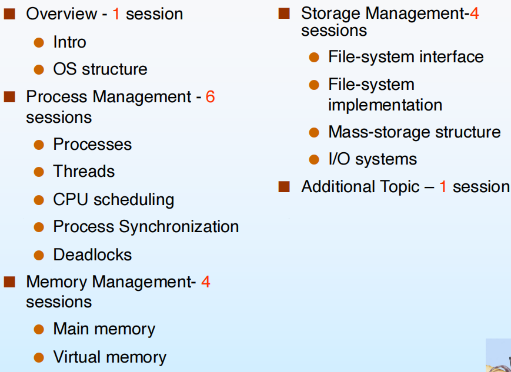

由上图我们也可以知道，这门课的侧重点分为：

1. 进程管理（难点）
2. 内存管理
3. 外存及其他存储管理

### 什么是操作系统

1. 系统组成观点——操作系统是**系统软件**：

   - 软件：

     - 应用软件
     - 中间件
     - **系统软件**，管理上层软件的执行

   - 硬件：

     - I/O
     - 存储器
     - CPU

   - 总线的数据传输由os管理，各部分以**请求**的方式和os、其他部分沟通，因此可以说操作系统管理硬件就是基于中断管理的。

     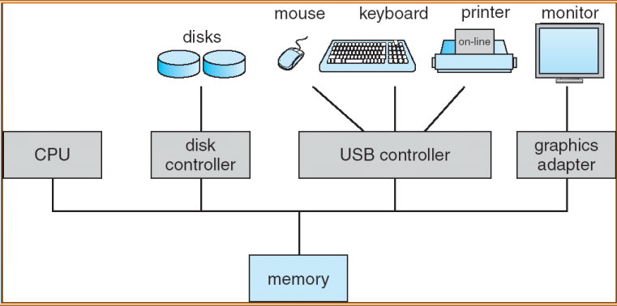

2. 用户视角——操作系统是用户与硬件的**接口**：

   - 命令级接口：键鼠、触屏、声音等
   - 程序级接口：提供程序调用的服务

3. 系统视角——操作系统是计算机系统**资源的管理者**：分配资源、管理进程、处理错误

4. 软件分层、扩充机器的观点——操作系统是扩充裸机的**第一层系统软件**：

   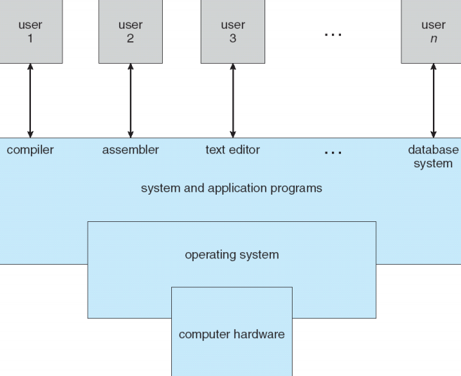

操作系统可以分为：

- 计算机运行的时候一直在跑的程序（必须的程序），被称为内核kernel
- 其他system program，例如I/O处理等

电脑启动运行的第一个程序不是os，是**bootstrap**，用于加载操作系统。

### 进程与中断

利用中断向量的形式维护。

大部分中断由硬件产生，不过系统中断是软件中断。

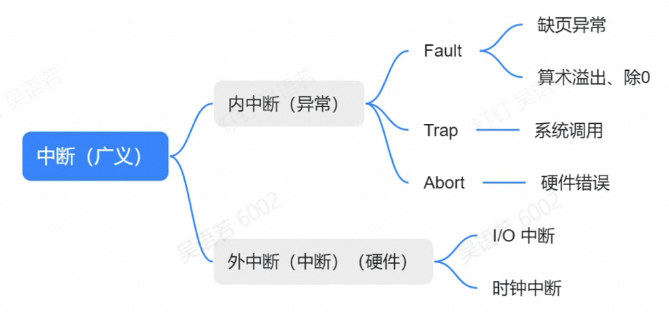

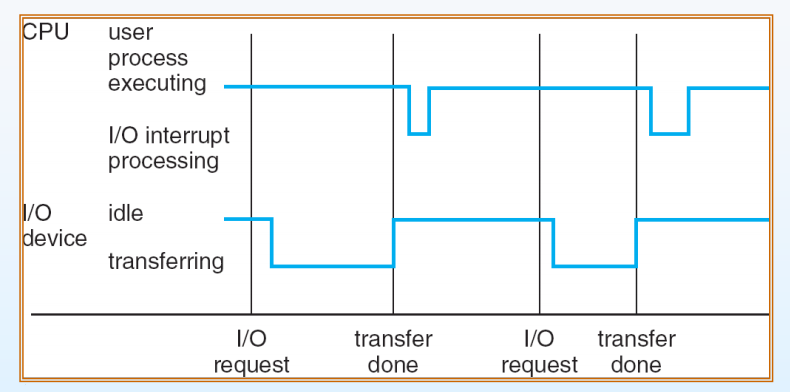

处理器提请求$\to$I/O传输直到传输完毕$\to$处理器中断处理传输的数据$\to$处理完毕继续执行之前的

- 同步I/O：中断持续在整个I/O进程
- 异步I/O：中断发生在发送请求和任务完成的时候（实现复杂，需要写callback函数）

管理硬件请求的等待队列：

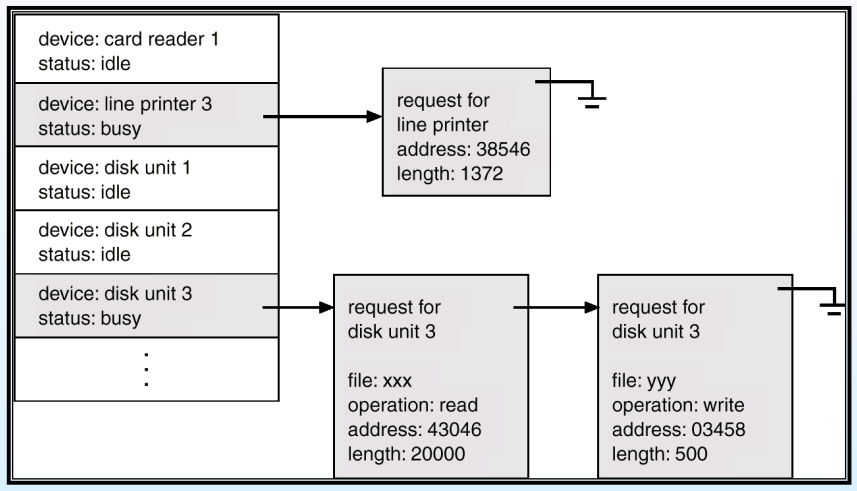

请求的选择有专门的调度算法。

**DMA**：

内嵌在CPU/memory里面的有一定计算能力的硬件，比如读了一部分内存的中断（频繁需要中断）DMA可以直接处理，不需要让CPU中断处理。

### 存储结构

Main memory 断电即丢失，Secondary storage 断电保留

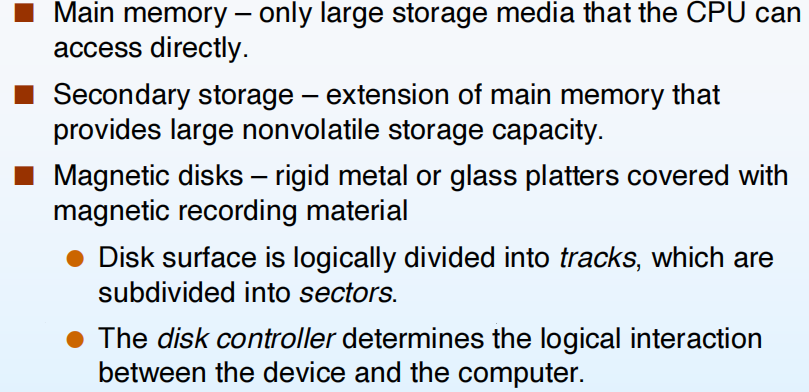

Caching - 把经常访问的数据存入更快速访问的缓存，提升数据访问性能；但是出现多任务的时候可能会出问题，比如两个进程同时对cache的内容造成了修改且未立刻写回（两个+100的进程最后只+了100），比较简单的解决方式是上锁，但是也会反向削弱性能。多处理器既有独立cache也有共享cache，可能会出现冲突竞争进而带来额外工作量。

CPU利用率随着同时间内的进程数量先增加后减少（硬件资源的竞争）。

同一个进程的物理地址可能并不是连续的，但是操作系统的管理会让用户认为在一个连续的空间。

### 用户态和内核态

两者相互切换是通过中断，系统调用是一个特殊的中断。

用户不能直接操作硬件，需要通过系统调用实现（例如在屏幕上显示"helloworld"）

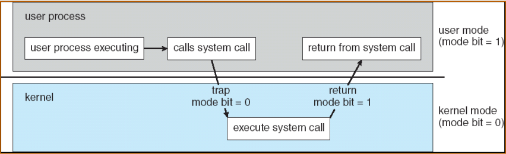

目的：

- 简化用户操作
- 保障系统安全

CPU跑操作系统的代码的时候为内核态（不跑代码只是占用CPU的状态是idle态），跑用户代码（应用软件）的时候为用户态。

### 进程管理

操作系统最小的任务单元是进程(process)。

进程是指系统里**正在执行**的任务。

操作系统负责管理进程和协调各进程之间的关系：

- 创建删除
- 暂停恢复
- 进程并行
- 进程间交流
- 处理进程死锁

### 内存管理

同一个进程的物理地址可能并不是连续的，但是操作系统的管理会让用户认为在一个连续的空间。有了操作系统之后用户只需要向操作系统申请内存即可。

### 存储管理

主要指硬盘、文件系统的管理。

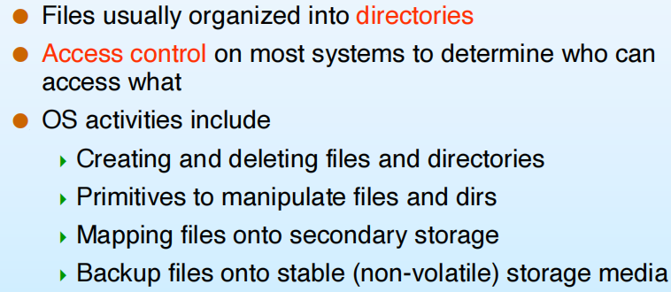

还有外接设备、I/O系统管理：外接设备要被顺利调用需要有一个I/O子系统（保证操作系统的安全 - 认证中心）。

### 保护与安全

用户隐私 - 访问控制，分组且拥有不同权限

## Operating-System Structures

### 操作系统提供的用户服务

- 用户界面
- 第三方程序执行
- I/O操作
- 文件系统管理

- 上网，和其他机器与进程沟通
- 错误检测与修复

### 用户和操作系统的交互

- CLI - 命令行
- GUI - 图形化界面，windows系统实现在内核态，交互比较快；Linux则放在用户态

### 系统调用

用户形式是C/C++的API（封装了背后很多的系统调用），可以大大简化用户操作，以复制文件这一操作背后的系统调用为例：

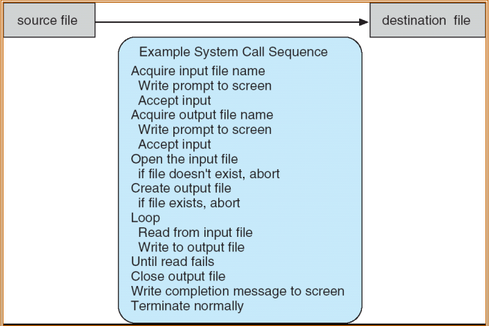

系统调用的基本实现：

- 每个系统调用给出一个number
- 操作系统有一个系统调用的table，每个号码对应了一串实现代码

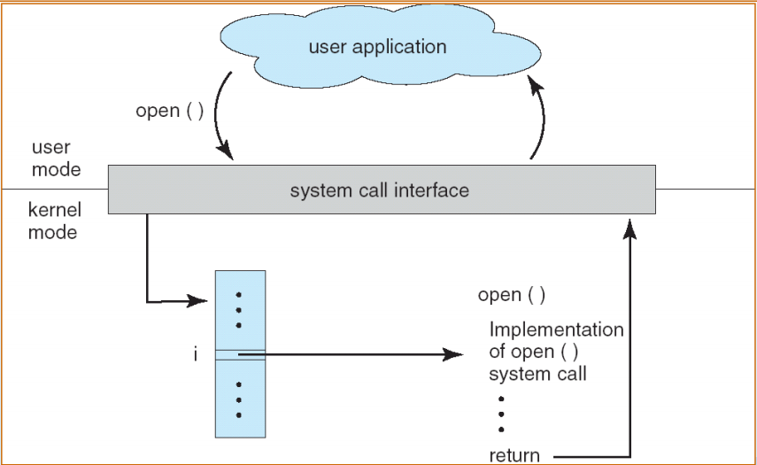

以C语言的执行为例：

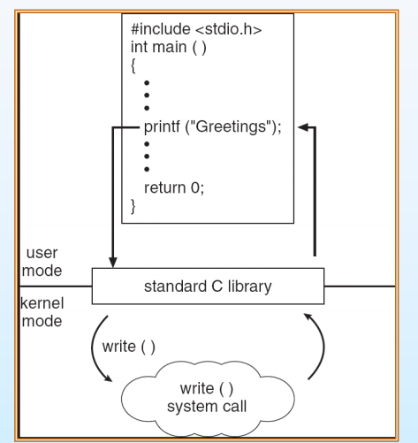

如何传递用户进程的参数？- 把参数（或参数的地址）放到固定的寄存器让操作系统去取

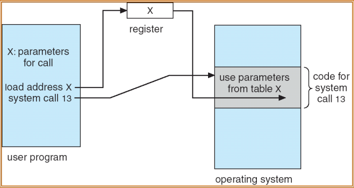

### 系统调用的分类

- 控制进程
- 文件管理
- 设备管理
- 信息维护 - 时间、日期等
- 远程通讯

### 系统程序(System Programs)

操作系统为了能够被简单地使用而提供的必要的程序。

### 操作系统的设计和实现

明确：

- 操作系统的目标 - 替代linux、windows几乎不可能，但是可以针对特定的外设或者目标开发操作系统
  - 用户目标 - 好用
  - 系统目标 - 简洁、稳定
- 基于的硬件类型

- Policy: What will be done?
- Mechanism: How to do it?

### 操作系统架构

#### MS-DOS

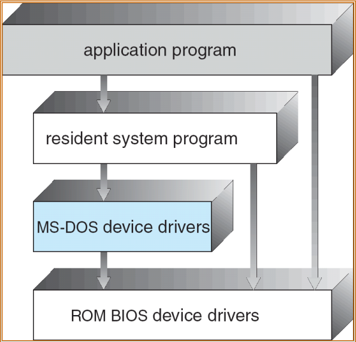

#### Layered approach

相邻的低层级layer为上一层提供了所有的需要的实现，不需要跨层级

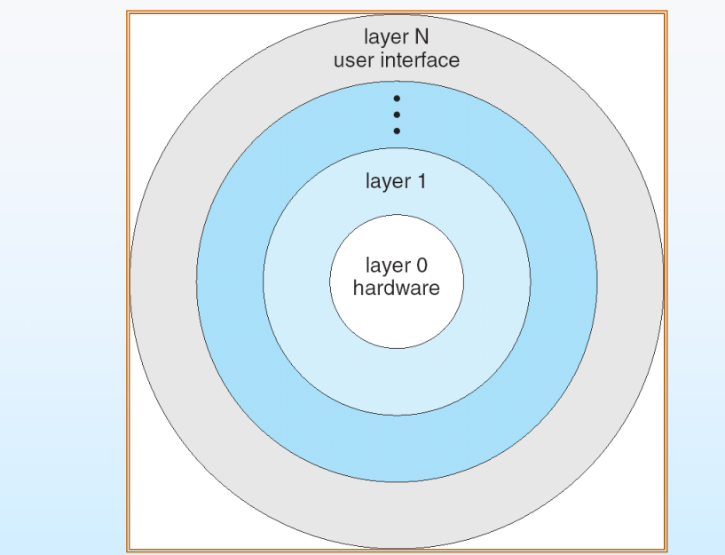

#### UNIX

单一结构系统，所有必要功能都在操作系统里面，但是被分成了几个相互独立的module，module之间通过API通信。

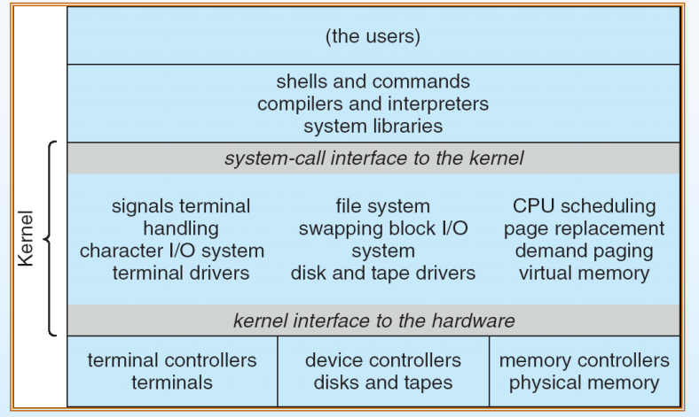

#### Microkernel System Structure

微内核，通常嵌入式 - 精简化；

迁移到不同硬件会简单 - 可迁移化，但是硬件部分放操作系统外面实现会造成另外的cost与卡顿

#### Modules

- 采用面向对象的方法
- 每个核心组件是独立的
- 通过已知接口进行通信
  - 模块之间相互调用，而不是消息传递
- 每个模块可以根据需要在内核中**加载**
- 类似于layers，但更灵活

#### Mac OS

基于BSD的扩展

### Virtual Machines - 虚拟机

让云计算成为可能。

云平台可以让用户自行决定服务器配置，获得节点。可以接受并发的请求。

在原来的操作系统基础上加了一层虚拟层：

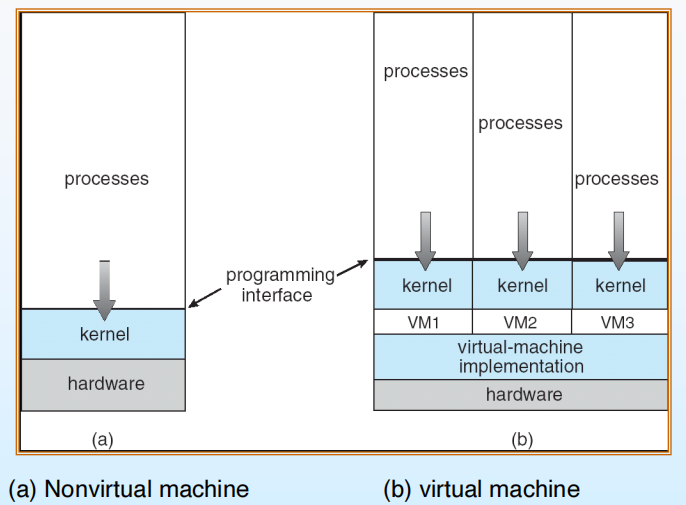

架构：虚拟层把虚拟机内部的请求翻译成给host os的请求：

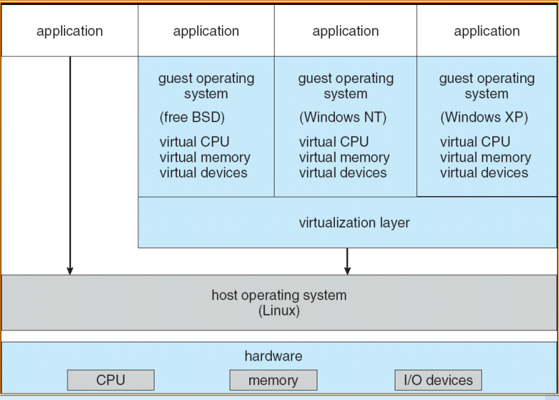

Docker：跑多个运行环境，不保证资源的隔离性，在硬件上有竞争关系，但是任务执行更快。

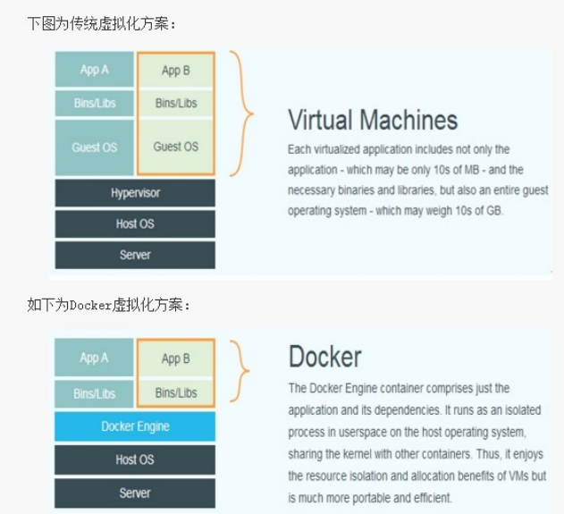

Java虚拟机：解释Java语言，把Java语言翻译成适应不同os的机器码：

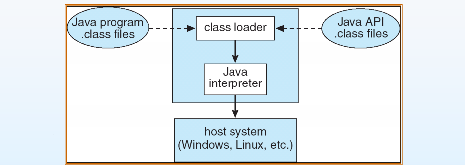
### Operating System Generation and Boot

操作系统设计出来需要兼容很多硬件，会有一个booting程序（存在于主板）将内核加载到计算机上使os跑起来。

1. 自检，检测各种硬件是否在线
2. 把磁盘/软盘（启动程序排第一的东西）的第一个block读取并放置到计算机固定的内存区域，执行第一条指令。一般这个时候读取的是硬件存储分区表，可以得知操作系统在内存的位置以及启动方式
3. 启动、运行操作系统
