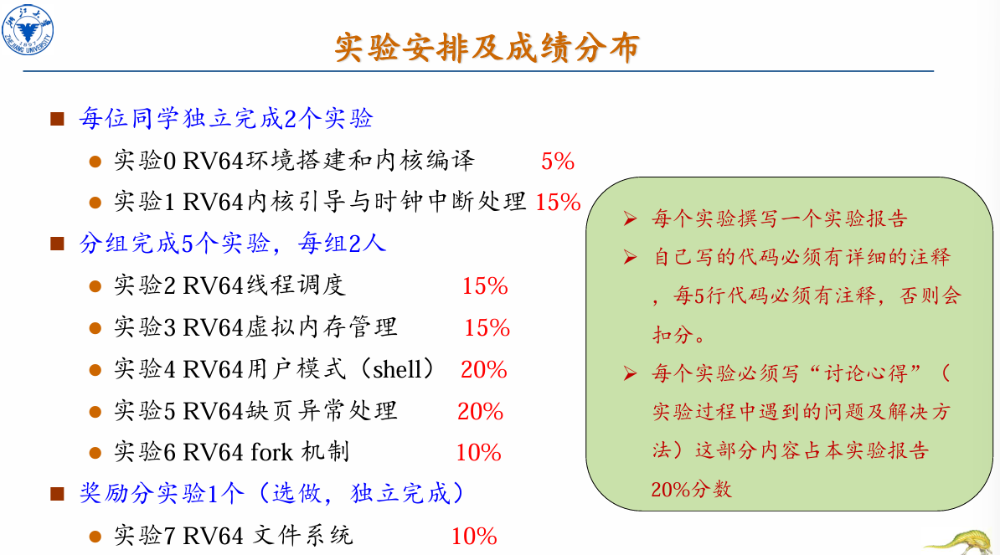

# 操作系统

## 课程基本信息

- 教材：Operating System Concepts 10th
- 参考资料：[Isshiki修's Notebook](https://note.isshikih.top/cour_note/D3QD_OperatingSystem/)
- 课程评定：
  - 期末 - 50%，以操作系统原理为主
  - 平时 - 50%
    - 作业 - 5%，学在浙大上
    - 平时课堂练习、点名 - 5%
    - 实验报告 - 20%
    - 实验验收 - 20%
  - Bonus - 最高6分，计入平时成绩，lab7 - 4分

实验：

