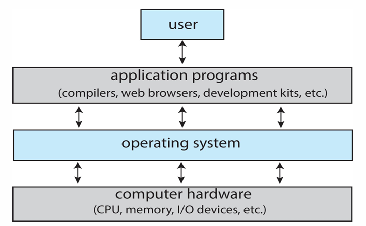
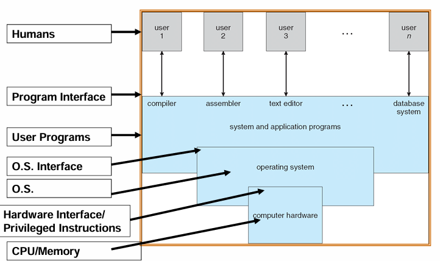

# Chapter1 Introduction

## 计算机系统架构

操作系统作为硬件和应用之间的接口。

## 操作系统是什么？——不同的视角解释

1. 系统组成观点——操作系统是**系统软件**：

   - 软件：
     - 应用软件
     - 中间件
     - **系统软件**
   - 硬件：
     - I/O
     - 存储器
     - CPU

2. 用户视角——操作系统是用户与硬件的**接口**：

   - 命令级接口：键鼠、触屏、声音等
   - 程序级接口：提供程序调用的服务

3. 系统视角——操作系统是计算机系统资源的**管理者**：分配资源、管理进程、处理错误

4. 软件分层、扩充机器的观点——操作系统是扩充裸机的**第一层系统软件**：

   

5. 计算机运行的时候一直在跑的程序（必须的程序），被称为内核kernel。

