# 操作系统期末复习

*参考笔记：[Isshiki修's Notebook](https://note.isshikih.top/cour_note/D3QD_OperatingSystem/Unit0/)*

我的os笔记方式和ads类似，还是将重心放在**知识框架的梳理**上，对于笔记中提到的东西如果有点陌生，还是建议去翻找ppt或者王道~

## 0 - Overview

### 0.1 操作系统定义

- 职能角度 - 资源管理
- 存在角度 - 管理用户程序的软件程序，kernel是计算机开机后一直在运行的程序

### 0.2 操作系统评价方式

1. 可靠性 - 异常处理机制
2. 安全性 - 权限管理机制 - 不同权限模式
3. 易用性 - 系统调用机制
      - 操作系统提供的接口：
        - 命令接口 - 给用户使用的
        - 程序接口 - 就是系统调用，给编程人员使用的
4. 高效性 - 任务执行机制 - 分时系统实现体感上的并行
5. 公平性 - 进程管理机制 - 避免饥饿现象
6. 可拓展性、易维护性等开发者角度

### 0.3 操作系统架构

- 单处理器系统 - 有且仅有一个单核的通用处理器（可以有别的不运行线程的专用处理器）
- 多处理器系统 - 多个单核的通用处理器 - 吞吐量提升，但非线性提升
- 集群系统 - 多个独立的计算机系统作为节点，通过冗余实现高可用服务，通过并行实现高性能计算
    - 对称集群 - 各个节点互相监督
    - 不对称集群 - 替补关系

### 0.4 操作系统任务处理

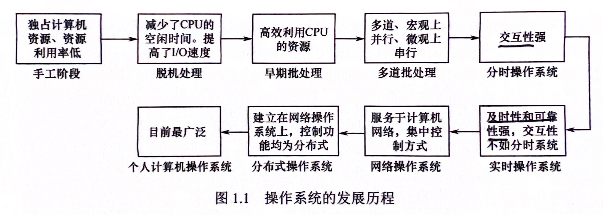

- 批处理系统：成批、串行，交互性差
    - 单道批处理阶段 - 同一时间一个任务，会导致CPU长时间空闲
    - 多道批处理阶段 - 多道，宏观上并发（王道原话：“并行”，所以这也是多道批处理的一个特点，但是没有达到真正意义上的进程并行），微观上串行
- 分时系统：“体感上”并行，按照时间片进行进程间切换
    - 同时性、交互性、独立性、及时性

- 实时系统：特定时间完成特定任务
    - *例如股票交易系统，因为股市的交易行情是实时变化的*

- 分布式系统：多台计算机共同完成一个任务

*几乎所有现代操作系统都是“多任务操作系统”，包括单cpu操作系统和多cpu操作系统。*

*在IBM-PC中，操作系统称为微型计算机操作系统。*

### 0.5 操作系统结构设计

有中心：

- 宏内核：耦合所有主要功能，效率高，可靠性低
- 微内核：只提供最基本功能，可靠性高，可拓展性高
  - 基本功能：进程（线程）管理、低级存储器管理、中断和陷入管理
  - 特点：灵活性和拓展性、可靠性和安全性、可移植性、分布式计算


*混合系统结合了宏内核和微内核的设计思路。*

分层网状：

- 分层设计：类似计网，$i$用$i-1$层接口，开发维护方便，但逐层接口调用导致效率受限
  - *最显著的不足：设计困难*

- 模块化设计：非递进式，将操作系统划分成独立模块

外核：记录已分配给各个虚拟机的有关资源。

### 0.6 操作系统运行原理

引导 $\to$ 用户态 |（中断（计时器）、系统调用）| 内核态

引导相关王道刷题记录：

1. 存放操作系统自举程序的芯片是ROM
2. 计算机操作系统的引导程序位于硬盘中
3. 计算机开机后，操作系统最终被加载到RAM
4. 计算机启动过程：CPU加电，CS:IP指向FFFF0H $\to$ 执行JMP指令跳转到BIOS $\to$ 登记BIOS中断程序入口地址 $\to$ 硬件自检 $\to$ 进行操作系统引导

原语：可被条用的公用小程序，处于操作系统底层，具有原子性，调用频繁。

*操作系统中，通道技术是一种硬件技术。*

*不同操作系统提供的系统调用接口不同。*

中断：

- 从紧急程度：可屏蔽中断、不可屏蔽中断

- 从触发原因：内中断（异常等程序导致的）、外中断（硬件产生，时钟中断、I/O结束）

  

中断相关王道刷题记录：

1. 在中断发生后，进入中断处理的程序属于**操作系统程序**。*被中断的程序本身可能是用户程序，也可能是OS程序，但是进入的一定是OS程序*
2. “访管”指令**仅在用户态下**使用。*是system call，将用户态变为核心态的程序。属于内部中断。内核态有且仅有这个指令无法执行。*
3. 处理外部中断时：
   1. 由硬件保存（中断隐指令自动保存）：PC（断点）、PSW（程序状态字）内容，TLB、cache内容；将CPU模式改为内核态；
   2. 由操作系统完成：保存通用寄存器内容，执行系统调用的服务例程，保存中断屏蔽字

## 1 - Process Management

*进程是资源分配和管理的独立单位*

### 1.1 进程基本概念

#### 1.1.1 进程的形式

- 内核态虚拟内存 - 元数据（进程控制块PCB）

  - 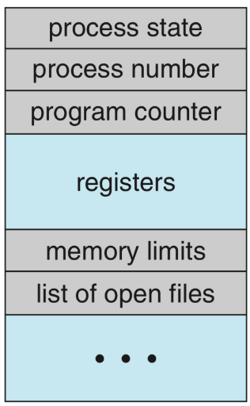 

- 用户态虚拟内存 - 实际需要的数据资源

    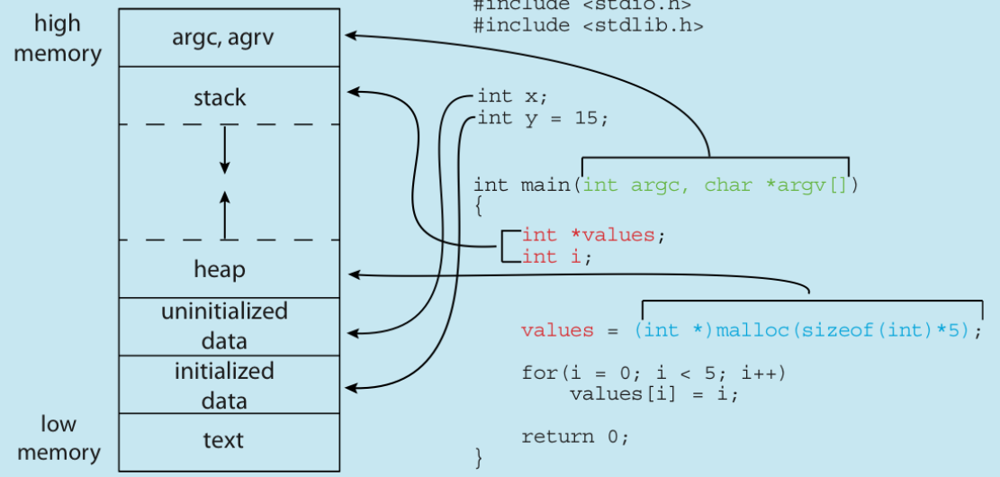

- 静态部分
    - text section - 代码
    - data section - 进程全局变量、静态变量
- 动态更新部分
    - heap - 被动态分配的内存
    - stack - 暂时性数据，函数传参、返回值等

#### 1.1.2 进程的状态

进程的状态和转换关系：

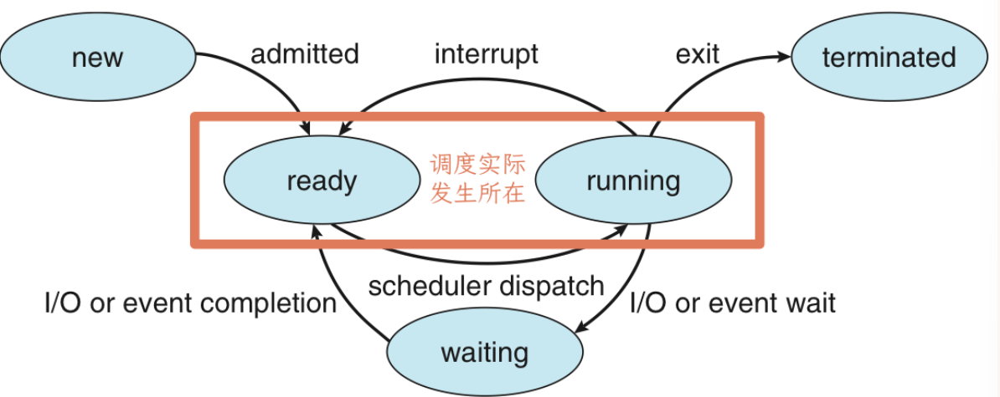

实现调度需要维护等待队列（可能有多个）和就绪队列：

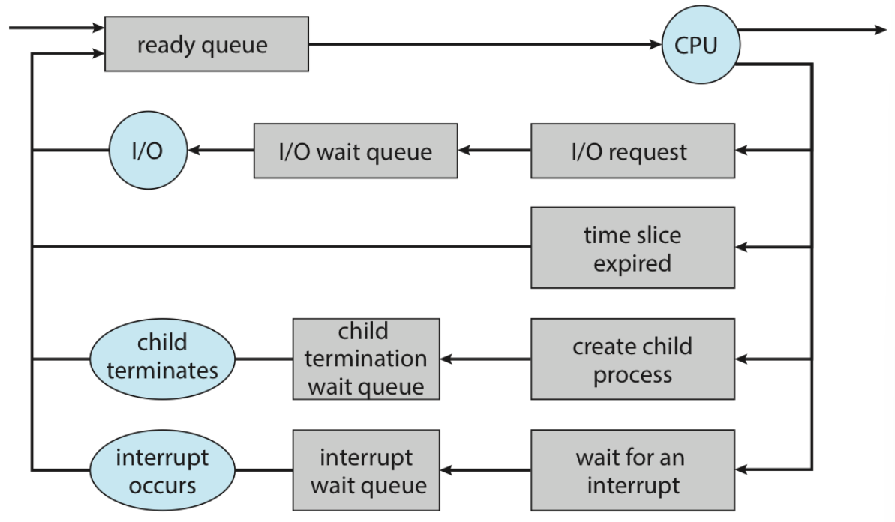

### 1.2 进程管理

#### 1.2.1 创建 - `fork()`

1. 复制父进程数据，即直接`fork`
2. 载入新程序并继续执行，`fork`后`execXX()`

相关技术：COW、`vfork()`

#### 1.2.2 终止 - `exit()`

子进程通过`exit()`终止之后（僵尸进程）需要父进程的`wait()`去回收资源，如果此时父进程被终止则变成孤儿进程，交由`init/systemd`来`wait()`或通过级联终止来避免。

#### 1.2.3 通信

- 信号量
- 共享内存 - 通过系统调用建立，更快
- 信息传递 - 不需要处理数据冲突，少量有用，分布式系统更容易实现
- 文件/管道（本质上也是一种文件，单向传输）

### 1.3 进程调度

- 调度分类
    - 抢占式 - 不占有资源的进程索取cpu资源
    - 非抢占式 - 已拥有资源的进程主动释放cpu资源
- 调度过程 - `__switch_to`
    1. 上下文切换 - 寄存器、进程状态、管理信息
    2. `sret`回用户态`sepc`
- 调度算法指标
    - cpu使用率
    - 吞吐量 - 单位时间内完成的进程数
    - 周转时间 -开始建立 $\to$ 进程完成
    - 等待时间 - = 周转时间 - 运行时间
    - 响应时间 - 发出请求 $\to$ 第一次响应
- 调度算法
    - FCFS - 非抢占式、实现简单
    - SJF - 非抢占式、平均等待时间最小，会导致饥饿现象且运行时间不好预估
    - SRTF - 抢占式（剩余运行时间最短）、平均等待时间最小，会导致饥饿现象且运行时间不好预估
    - RR - 抢占式、解决饥饿现象，频繁切换会导致较高的dispatch latency
    - priority scheduling - 和SJF/SRTF一样分成抢占式和非抢占式两种，会导致饥饿现象
        - priority aging - 避免饥饿现象，优先级随着等待时间不断增长
- 调度设计
    - multilevel queue scheduling - 队列间根据优先级抢占式调度，队列内根据需求采取不同的调度算法
    - multilevel feedback queue scheduling - 允许进程在队列间转移（占有太久cpu -- 优先级`--`；等待太久 -- 优先级`++`）

### 1.4 线程

定义：进程内可调度的执行单元

目的：减小fork和切换的开销

进程间线程共享静态资源，各自维护必需的动态资源：便于线程间通信、任务粒度小减少响应时间；进程内出问题会影响所有线程、内存保护问题。

多线程模型：

- 用户级多线程：支持更多线程数，更容易自定义线程调度算法
- 内核级多线程：单线程阻塞不导致整个进程阻塞，可以利用多核实现并行
- 关系（用户-内核）：一对一、多对多、多对一

## 2 同步

### 2.1 同步工具

#### 2.1.1 相关定义

- race condition：两个进程同时访问一个资源，并且需要对资源作出修改（这个操作在汇编级别不是原子的）的情况，如果不加访问限制则会导致使用过时数据从而写入错误结果。

- 临界资源：只能被至多一个用户占有的资源

- critical section（临界区段）：访问临界资源的代码段

  ```
  ┌─────────────────────┐
  │  Entry Section      │ <-- 判断能否进入临界区（不行则等待）
  ├─────────────────────┤
  │  Critical Section   │ <-- 获取、操作临界资源
  ├─────────────────────┤
  │  Exit Section       │ <-- 释放临界资源
  ├─────────────────────┤
  │  Remainder Section  │ <-- other codes
  └─────────────────────┘
  ```

- 临界区问题：如何保证最多只有一个用户在执行临界区段的代码

- 解决方案要求：

    1. 临界互斥
    2. 选择时间（选择下一个进入临界区的进程）有限
    3. 等待时间有限

#### 2.1.2 同步算法

*内核态的同步问题：对于单处理器只需要在中断发生后禁止中断即可；对于多处理器我们通过非抢占式内核实现内核态的进程数量唯一。接下来是一些更普适的解法。*

---

##### 2.1.2.1 Peterson's Algorithm

限制：参与竞争的进程只能有两个

```c
// `i` is 0 or 1, indicating current pid, while `j` is another pid.
process(i) {
    j = 1 - i;
    READY[i] = true;                    // ┐
    TURN = j;                           // │
    while (READY[j] && TURN == j) {}    // ├ entry section
        // i.e. wait until:             // │
        //  (1) j exits,                // │
        //  (2) j is slower, so it      // │
        //      should run now.         // ┘
    /* operate critical resources */    // - critical section
    READY[i] = false;                   // - exit section
    /* other things */                  // - remainder section
}
```

可以通过对各种情况的枚举完成对解决方案三条要求的证明。

但其实这个方法不适用于现代处理器，因为采用的是乱序流水线，`READY[i] = true`和`TURN = j`这两条指令没有严格的执行顺序。

##### 2.1.2.2 Memory Barriers

加入`memory_barrier()`主动禁止指令重排：

```c
// `i` is 0 or 1, indicating current pid, while `j` is another pid.
process(i) {
    j = 1 - i;
    READY[i] = true;                    // ┐
    memory_barrier();                   // │
    TURN = j;                           // │
    while (READY[j] && TURN == j) {}    // ├ entry section
        // i.e. wait until:             // │
        //  (1) j exits,                // │
        //  (2) j is slower, so it      // │
        //      should run now.         // ┘
    /* operate critical resources */    // - critical section
    READY[i] = false;                   // - exit section
    /* other things */                  // - remainder section
}
```

这里还涉及到两个memory model的定义：

1. 强有序(strongly ordered)：进程对内存做的修改立刻对其它处理器可见；
2. 弱有序(weakly ordered)：进程对内存做的修改不立刻对其它处理器可见；

---

##### 2.1.2.3 Hardware Instructions

我的理解是把一些操作在硬件层面包装成原子操作。

**`test_and_set()`**：

```c
// 目标设true并返回旧值
<atomic> test_and_set(bool * target) {
    bool ret = *target;
    *target = true;
    return ret;
}

// 使用test_and_set解决临界问题
process(i) {
    while ( test_and_set(&LOCK) ) {}    // - entry section
    /* operate critical resources */    // - critical section
    LOCK = false;                       // - exit section
    /* other things */                  // - remainder section
}
```

为了实现“有限等待时间”的需求，我们需要采取手动分配锁的调度方式：

```c
// `i` is process id in [0, n), where `n` is the count of related process. 
process(i) {
    WAITING[i] = true;                                  // ┐
    while ( WAITING[i] && test_and_set(&LOCK) ) {}      // ├ entry sec.
                                                        // │
    WAITING[i] = false;                                 // ┘

    /* operate critical resources */                    // - critical sec.

    // i.e. find next waiting process j                 // ┐
    j = (i + 1) % n;                                    // │
    while (i != j && !WAITING[j]) {                     // ├ exit sec.
        j = (j + 1) % n;                                // │
    }                                                   // │
    // release j's LOCK or release whole LOCK           // │
    if (i == j)     LOCK = false;                       // │
    else            WAITING[j] = false;                 // ┘

    /* other things */                                  // - remainder sec.
}
```

由释放锁的进程决定下一个进入临界区的进程，采用从$i + 1$开始的遍历形式保证选择顺序使得不会饥饿。

**`compare_and_swap()`**：

```c
<atomic> compare_and_swap(int * target, int expected, int new_val) {
    int ret = *target;
    // *target = (*target == expected) ? new_val : *target;
    if (*target == expected) {
        *target = new_val;
    }
    return ret;
}
```

和`test_and_set()`功能类似但是更加普适、可拓展性好。

通过这个原子操作，我们可以构造**Atomic Variables**（原子变量）：

```c
increment(atomic_int * v) {
    int tmp;
    do {
        tmp = *v;
    } while ( tmp != compare_and_swap(v, tmp, tmp+1) );
}
```

此时我们直接使用了封装好的原子操作实现了变量修改的原子性，不需要涉及临界区的讨论。

##### 2.1.2.4 Mutex Locks - 互斥锁

是对2.1.2.3的硬件层面原子操作在软件层面的封装：

```c
// `available` means whether the `LOCK` is free, or whether the related 
// resources is available
acquire() {
    while ( !compare_and_swap(&available, true, false) ) {}
}
release() {
    available = true;
}
```

这里也引入了两个概念：

- 忙等待：在`entry`的等待阶段依然占用CPU资源（使用`while`）
- 自旋锁(spinlock)：使用忙等待的互斥锁

可以通过系统调用避免忙等待，但是要权衡等待浪费的cpu资源和调度开销。

---

##### 2.1.2.5 Semaphores - 信号量

提供的两个标准化原子操作接口：

```c
<atomic> wait(reference S) {
    while (S <= 0) {} // 忙等待，表示资源有限
    S--;
}
<atomic> signal(reference S) {
    S++;
}
```

- counting semaphore - 计数信号量
- binary semaphore - 二值信号量：$0 \le S \le 1$，表示资源只有一个

应用：

1. 程序间通信（或手动串行）

   ```c
   semaphore S = 0;
   P0() {
       /* Section A */
       signal(S);
   }
   P1() {
       wait(S);
       /* Section B */
   }
   ```
2. 互斥

   ```c
   // `i` is process id and S is the semaphores
   process(i) {
       wait(S);    // i.e. release the 'LOCK'
       /* critical section */
       signal(S);  // only one process can pass this line at once
   }
   ```

优化：

避免忙等待：

```c
struct semaphore {
    value;
    waiting_list;
};

<atomic> wait(reference S) {
    S->value--;
    if (S->value < 0) {
        S->waiting_list.push(current process);
        sleep();
    }
}

<atomic> signal(reference S) {
    S->value++;
    if (S->value <= 0) {
        p = S->waiting_list.pop();
        wakeup(p);
    }
}
```

### 2.2 同步问题例子

#### 2.2.1 生产者消费者问题 - The Bounded-Buffer Problem

通过信号量保障生产消费对缓冲区使用的互斥：

```c
// suppose the capacity of the buffer is n
semaphore mutex = 1; // 互斥
semaphore empty = n; // 同步1，生产的等待条件
semaphore full  = 0; // 同步2，消费的等待条件
```

#### 2.2.2 读者写者问题 - The Readers-Writers Problem

由**读写冲突**和**写写冲突**引发的问题，通过以下信号量解决（避免饥饿）：

```c
semaphores rw_mutex   = 1; // 读写/写写互斥锁
semaphores mutex      = 1; // 修改read_count的互斥锁
int        read_count = 0; // 读者数量

// writer's code
writer() {
    wait(rw_mutex);
    /* critical section */
    signal(rw_mutex);
}
// reader's code
reader() {
    wait(mutex);            //   ┐
    read_count++;           //   ├ obtain `mutex` to increase
    if (read_count == 1) {  //   │ `read_count`
        wait(rw_mutex);     // ┐ │
    }                       // │ │
    signal(mutex);          // │ ┘
                            // ├── readers share `rw_mutex` to
    /* critical section */  // │   read critical resource
                            // │
    wait(mutex);            // │ ┐
    read_count--;           // │ ├ obtain `mutex` to decrease
    if (read_count == 0) {  // │ │ `read_count`
        signal(rw_mutex);   // ┘ │
    }                       //   │
    signal(mutex);          //   ┘
}
```

其中，由于`read_count`有比较操作，单一信号量不支持这样的原子操作，所以可以理解为`read_count`和`mutex`一起构成了一个原子变量。

#### 2.2.3 哲学家就餐问题 - The Dining Philosophers Problem

由于筷子的互斥我们对每一个筷子维护了一个信号量，但是这种直接的解法可能会导致死锁（每个哲学家都拿了自己右手边的筷子），我们有以下解决方案：

1. 允许最多 4 位哲学家同时获取筷子；
2. 哲学家必须同时获取两个筷子，而不能抓一支等一支；
    - 为了实现这一点，“抓筷子”这件事应当在一个临界段中完成；
3. 奇数哲学家先拿左手的筷子，偶数哲学家先拿右手的筷子，这样不会产生循环等待。

### 2.3 死锁问题

#### 2.3.1 相关定义

- 死锁：一个处于占有资源且等待资源的状态的线程集合，互相等待彼此占有的资源。
- 资源分配图：
    - 存在环 $\to$ 有可能处于死锁**状态**
    - 不存在环 $\to$ 不可能处于死锁状态
    - 环内节点**只有一个实例** $\to$ 一定处于死锁状态
- 安全状态：存在安全序列
    - 安全状态 $\to$ 一定可以**避免**死锁
    - 不安全状态 $\to$ 不一定可以避免死锁

- 死锁条件（必须同时满足）：
    1. 互斥 - mutual exclusion
    2. 持有并等待 - hold and wait
    3. 非抢占 - no preemption
    4. 循环等待 - circular wait
- 死锁处理：
    1. 从程序逻辑上预防 - 交给开发者
    2. 从行为规范上破坏死锁条件去预防 - **死锁预防**
    3. 禁止可能产生的死锁行为执行 - **死锁避免**
    4. 允许死锁出现后再去消除 - **死锁检测**和**死锁解除**

#### 2.3.2 死锁预防

核心思想是规范行为破坏四个死锁条件之一：

1. 互斥 - 无法破坏
2. 持有并等待 - 将申请并获得资源变成一次性的操作
3. 非抢占 - 允许抢占 - 会带来进程被打断可能无法恢复/继续、饥饿问题
4. 循环等待 - 给资源编号，规定资源申请顺序 - 效率低、资源扩展性差

#### 2.3.3 死锁避免

核心思想是通过一些调度算法组织可能导致死锁的行为：

- 资源分配图算法 - 基于资源分配图 - 适用于每个资源类别**只有一个实例**的情况
    1. 连好**所有**相关的 claim edge；
    2. 对于每条claim edge：
        1. 如果（在提出申请的时候）变为assignment edge不会成环，则变成request edge；
        2. 在获得资源的时候变成assignment edge
        3. 在释放资源的时候删除assignment edge

- 银行家算法 - 基于安全状态
    - 数据结构 - 进程数`n` | 资源种类`m`
        - `Available[m]`
        - `Max[n][m]`
        - `Allocation[n][m]`
        - `Need[n][m]` (`Need[i][j] = Max[i][j] - Allocation[i][j]`)
    - 算法
        1. 安全算法 - 寻找安全序列的方式判断是否为安全状态
        2. 资源请求算法 - 维护安全状态，当线程提出资源请求时，模拟资源被分配后的状态并通过安全算法判断是否仍然为安全状态，如果是，则分配。

#### 2.3.4 死锁检测及死锁解除

- 死锁检测：
    - 单实例：维护等待图（也是每个资源一个实例的，将资源分配图改为进程间等待关系）并定期调用环检测算法 - 维护和检测开销大
    - 多实例：类银行家算法（基于安全状态） *修佬说jjm说不考*
- 死锁解除：
    - 杀死所有死锁中的进程
    - 按照顺序（如优先级）逐个杀直到没有死锁
    - 回滚并且抢占之前分配的资源 - 饥饿 - 通过优先级算法考虑被回滚次数

## 3 内存

内存的管理是基于**页**的，相对于进程粒度更小。

### 3.1 基本概念

- 内存管理单元MMU - Memory management unit
    - 实现进程的内存保护 - 检查访存地址是否位于进程的`[base, base + limit]`范围内
    - 实现进程的**虚拟地址空间**（虚拟内存语境下进程的内存结构）到物理地址的映射 - 使用TBL完成
      - 页表基址寄存器PTBR（页表的物理地址），存于PCB中，参与上下文切换
      - 地址空间标识符ASID：解决进程切换时需要flushTLB的开销问题，在每次查询的时候额外判断地址空间是否一致
      - 共享页：多个虚拟地址对应同一个物理地址
          - 实现共享库、进程间通信的共享内存法
- 静态代码 $\to$ 动态进程过程中的内存转换
    - compile time - 将符号地址（**symbol address**）转换为可重定位地址（**relocatable address**，相对量）/绝对地址（**absolute address**，但是一旦起始地址发生改变，就需要重新编译）
    - load time - 将可重定位地址转换为绝对地址，此时如果起始地址改变只需重新装载
        - 动态装载（不需要操作系统支持）：未被调用的进程的可重定位地址存在磁盘；被调用时装载进内存
        - 动态链接库/共享库（需要操作系统支持）：能被动态链接的库
    - execute time - 如果进程允许被移动，将可重定位地址到绝对地址的转换放在这一步
- 内存分配
    - 可变划分 - 外部碎片
        - First Fit / Best Fit / Worst Fit ...
    - 固定划分 - 内部碎片

### 3.2 分页技术

#### 3.2.1 基本设计

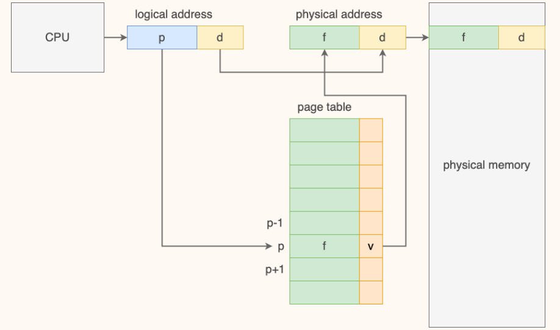

基本设计如上图，对应关系为：**虚拟地址-页 <-----页表-----> 物理地址-帧**

#### 3.2.2 优化与改进

##### 3.2.2.1 查询速度

为了加速查询，我们引入了cache中的TLB，具体流程如下：

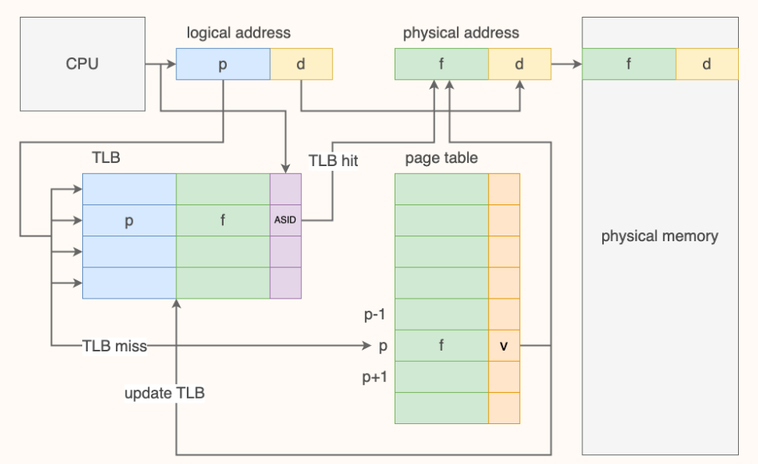

对于这个问题，我们定量分析方式如下：

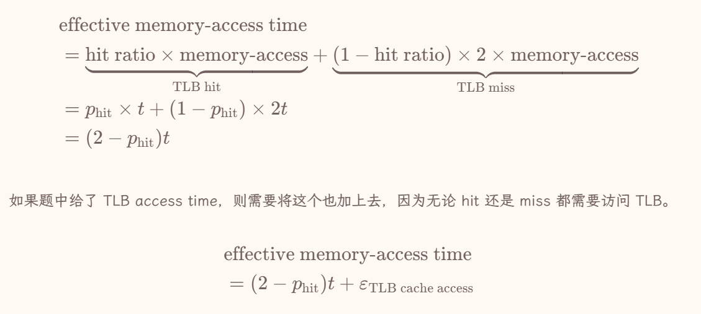

##### 3.2.2.2 页表内存

为了解决页表所占内存连续且过大的问题，我们提出以下三种设计：

1. 分层页表 - 使用v位减少部分不需要的映射

2. 哈希页表

    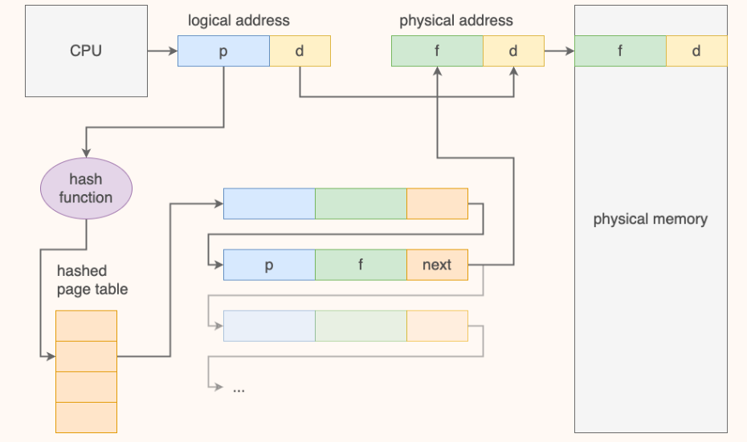

3. 反式页表 - 物理地址 <----- 反式页表 -----> 虚拟地址，不支持共享页，需要遍历查询

// todo：段式设计

### 3.3 按需换页 demand paging

#### 3.3.1 交换技术

- 换页：以帧/页为单位交换，只有在需要的时候将页从外部存储空间换入内存
- 交换空间（swap space）：放入这个空间的交换效率高，但是对于换入时机我们需要讨论：
    1. 进程被创建的时候page in
    2. 页第一次被换出的时候page in
    3. 文件系统中的页保留副本，被替换的时候直接覆盖不需要写回（？没太懂

*和交换技术不同，还有一种内存压缩的方式，即把frame放回外存并利用内部碎片，将其merge（没太懂。刷题的时候再看看*

#### 3.3.2 按需换页

结合我们设计的页表和交换技术的思想，我们按需换页的流程如下：

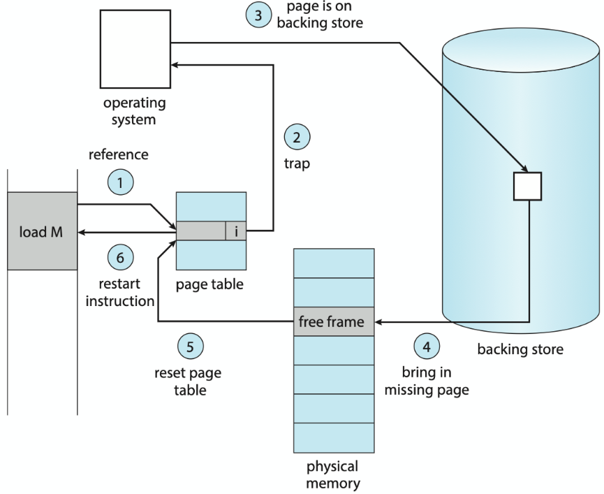

在这个过程中会有三次上下文切换（假设这次demand paging合法）：

1. 产生异常进入异常处理程序
2. 后备存储->内存的I/O中断
3. 再次调度到page fault的指令处

这里还有一些概念，我在此简单罗列一下：

- 在这里也会有两种不同的处理方式：

    - 纯按需换页pure demand paging - 只有被需求才载入内存

    - 预换页pre-paging - 一开始先将需要的页载入内存

- 而页表中查询不到映射关系且demand paging合法的情况下也有两种可能：
    - major/hard page fault - 缺了的页不在内存中
    - minor/soft page fault - 缺了的页在内存中（共享页、刚被释放还没flush）

### 3.4 物理帧管理

- 可用帧列表free-frame-list - 用来记录空闲帧
    - free-frame buffer pool - 保证空闲帧数量大于等于一个数，小于这个数就开始置换，可以保证进程不需要等待置换 *置换范围为global*
    - reclaim pages - 如果空闲帧数量低于下界则置换直到空闲帧数量大于上界 - 由内核例程**收割者（reapers）**完成
    - OOM(out-of-memory) - 特殊情况导致空闲帧数量特别少，OOM killer杀死OOM score（和进程使用内存百分比正相关）最高的进程

#### 3.4.1 分配策略

- 分配界限
     - 上界：空闲帧总数
     - 下界：每一条指令执行所需帧最大值
- 分配算法
    - equal allocation - 平均分配
    - proportional allocation - 按照进程大小加权分配
        - 可以在此基础上综合考虑进程优先级

#### 3.4.2 置换策略

牺牲帧（victim frame）：被页置换选中的帧，选中后需要判断`dirty`位是否为`1`，如果为`1`则写回后备存储。写回后更新相关元信息并返回该帧作为空闲帧。

1. OPT - 理论最优建模：在未来最久的时间内不会被访问到的页
2. FIFO - 维护一个FIFO队列即可实现，但是对opt拟合不好
3. LRU - 栈算法实现：计数器/链表序列，对opt拟合好但是开销大
4. LRU Approx - 基于优化LRU开销的想法，提出的一些类LRU算法
    - Additional-Reference-Bits Algorithm - 维护一个bits vector，在每个时钟中断的时候右移vector并在高位补上一个时间片内的reference bit（被使用过置`1`，否则置`0`）；算法的LRU就对应最小vector
    - Second-Chance Algorithm - 循环遍历frame，检查reference bit，如果为`0`则替换，为`1`则置`0`
    - Enhanced Second-Chance Algorithm / NRU - 再上一个算法的基础上纳入dirty bit，考虑`(reference, dirty)`，按照$(0,0)\to(0,1)\to(1,0)\to(1,1)$的替换优先级循环遍历查找
5. 基于计数的替换 - counter表示被使用的次数
    - LFU - 选择counter最小的frame作为victim frame
    - MFU - 选择counter最大的frame作为victim frame

置换范围：

- local - 置换只发生在当前进程的帧中
- global - scope的所有帧（受frame下界约束）
    - priority replacement - 只允许高优先级的进程替换低优先级的frame

### 3.5 抖动 - thrashing

抖动定义：几乎所有frames都在被使用，几乎每次置换都会有一次page fault

解决方法：

1. priority replacement  algorithm - 本质还是循环抢占，规定抢占方向（？）就可以避免这个问题
2. working set
    - 判定是否会thrashing：将每一个进程在一个$\Delta$时间窗口内用到过的frame建模为工作集$WS_i$，判断工作集之和和可用frame总量，如果大于则会thrashing
    - 解决thrashing：挂起部分进程
3. PFF - 缺页频率：与可用帧数量大致负相关，设定上下界进行负反馈控制

### 3.6 内核内存

避免内存碎片、保障连续性。

1. Buddy系统 - 通过二分的方式找到合适的内存，并在需要的时候可用合并回更大的内存
2. Slab分配 - 预先了解到内核常见数据结构大小 $\to$ 将对应大小的内存块注册到cache $\to$ 需要的时候分配对应大小的内存

## 4 输入/输出

### 4.1 定义

- 总线bus - 硬件与协议的统一，连接各个硬件传输数据
- 端口port - 设备与总线连接点
- 控制器controller - 控制硬件的设备组成

### 4.2 I/O方式

#### 4.2.1 轮询polling

CPU不断向controller查询状态直至可以完成I/O

#### 4.2.2 中断Interrupt

CPU提出I/O请求 $\to$ 调走进程 $\to$ I/O设备处理 $\to$ 向CPU发送中断，CPU对该进程做处理

#### 4.2.3 DMA

内存和I/O设备直接交互，CPU向DMA controller发送命令 $\to$ DMA处理完成后controller向CPU发送中断

### 4.3 I/O接口

各设备区别：

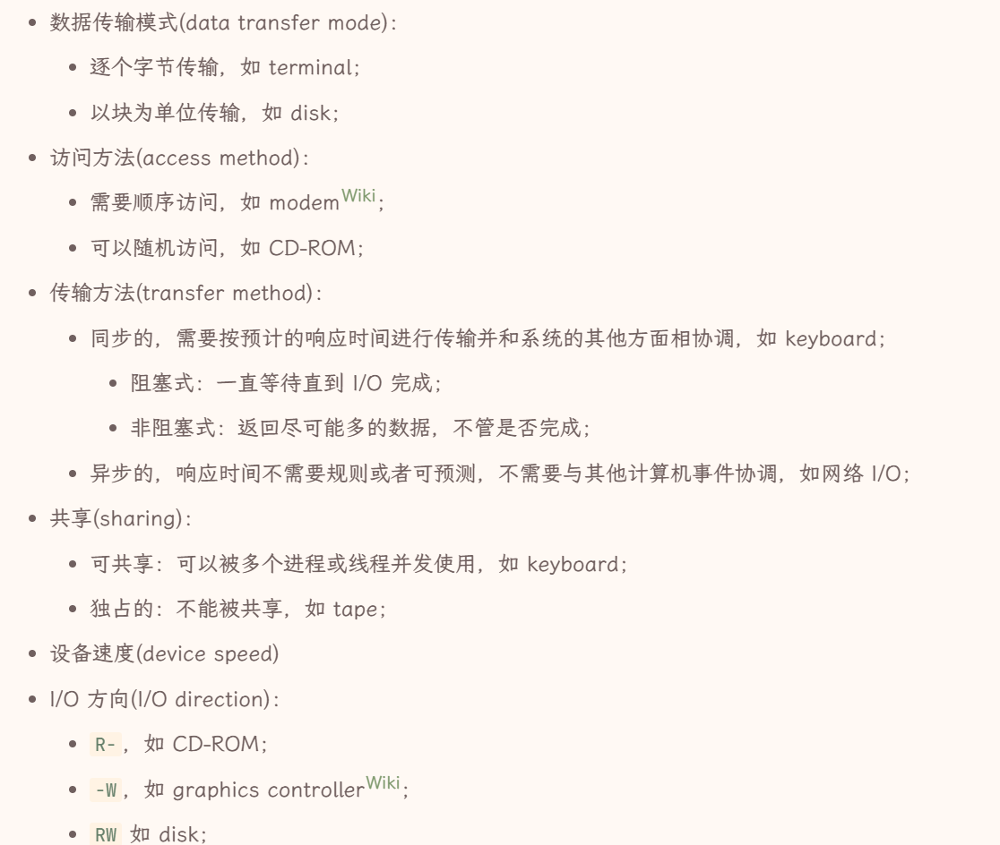

利用driver和controller屏蔽不同设备区别：

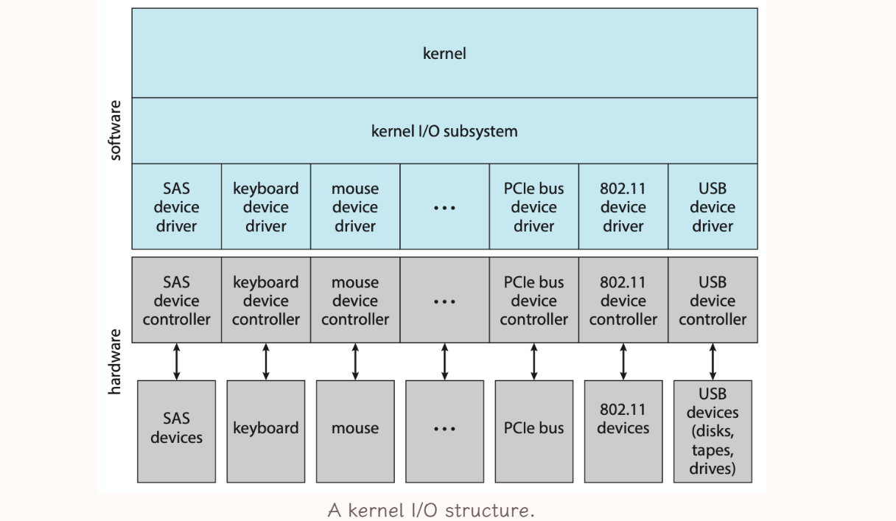

## 5 存储

### 5.1 硬盘 - HDD

属于易失性内存。

#### 5.1.1 I/O流程及开销计算

1. 磁头r/w heads$\to$柱面cylinders$\to$磁道tracks - 寻道时间seek time
2. 磁头$\to$扇区sectors - 旋转时延rotational latency - 平均旋转时延$\frac{1}{2} · \frac{1}{rpm} · 60s$
    - 和寻道时间相加是average access time（开销大头，距离越远开销越大）
3. 数据传输 - 传输时间transfer time = $\frac{\text{data to transfer}}{\text{transfer rate}}$

此外计算average I/O time的时候还要加上控制器开销controller overhead

而评估I/O性能的指标为disk bandwidth = $\frac{\text{传输数据量}}{{请求开始到传输完成的时间间隔}}$

#### 5.1.2 调度算法

默认会选择SSTF，I/O较为频繁的时候用LOOK或者C-LOOK

##### 5.1.2.1 FCFS

没有优化。

##### 5.1.2.2 SSTF

- 低平均响应时间、高吞吐量
- **不是理论最优**、方差大、饥饿问题、seek time计算开销

##### 5.1.2.3 SCAN

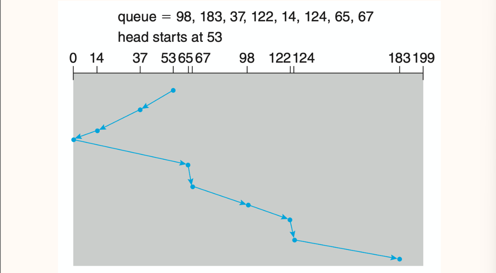

- 低平均响应时间、低方差、高吞吐量
- 部分磁头刚刚经过的地方的请求要等待的时间更长

##### 5.1.2.4 LOOK

在SCAN的基础上走到最靠近边界的请求对应的LBA就提前掉头 - 减少不必要的SCAN

##### 5.1.2.5 C-SCAN

在SCAN的基础上到达边界的时候径直返回另一端

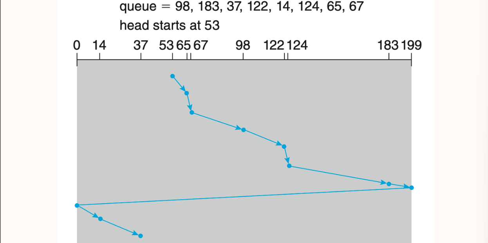

- 等待时间比SCAN更均匀

##### 5.1.2.6 C-LOOK

在C-SCAN的基础上走到最靠近边界的请求对应的LBA就提前掉头 - 减少不必要的C-SCAN

[一道不错的例题](https://note.isshikih.top/cour_note/D3QD_OperatingSystem/Unit5/#c-scan--c-look)

### 5.2 非易失性内存 - NVM

例如固态硬盘SSD

1. 没有寻道时间和旋转时延，比HDD更可靠快速小巧功耗低，价格更贵
    - 瓶颈在总线传输速率 - 会直接连接到系统总线
2. 以page粒度读写，必须先擦后写
3. 由若干die组成，支持并行
4. 擦除操作导致存在寿命

### 5.3 存储介质管理技术

#### 5.3.1 初始化流程

1. 低级格式化 - 实现自身结构化管理
    - 分扇区、创建映射和闪存转换层
    - 为扇区或页维护数据结构信息，将数据包装为 header + data + tail 的形式（元数据）
        - *“由于扇区数量与 header & tail 占用的空间正相关，所以扇区越大一般意味着用户可用空间越大。”没懂。*
    - 将坏块映射到不可见的备用分区
2. 记录操作系统所需数据结构
    - 分区partitioning - 将存储空间划分为一个个单独的logical disk
    - 卷创建与卷管理volume creating & management - 划定文件系统覆盖的范围
    - 逻辑格式化logical formatting - 在卷上创建和初始化文件系统

#### 5.3.2 RAID - 独立磁盘冗余阵列

使用冗余的方法解决硬盘的不可靠问题（具体可以看数据库笔记）。

## 6 文件系统

### 6.1 文件系统

- 文件系统FS：数据存储形式的逻辑视图
    - 文件系统挂载mount - 把一个文件系统的根目录挂载到另一个文件系统的mount point（某个目录）使得其可以访问被挂载的文件系统
    - 分层设计：
        - application programs
        - logical file system - 维护目录信息（不包括内容）
        - file-organization module - 实现文件逻辑地址到物理地址的映射，管理空闲空间
        - basic file system - 参与I/O调度，管理内存缓冲区和cache
        - I/O control - 与具体设备交互的接口
        - devices
    - 数据结构：
        - 硬盘数据结构
            - boot control block (per volume)
            - volume control block (per volume)
            - directory structure (per FS)
            - file control block (per FS)
        - 内存数据结构
            - mount table
            - directory cache
            - system-wide open-file table
            - per-process open-file table
            - buffers
- 虚拟文件系统VFS
    - 封装具体文件操作以支持不同文件系统
    - 为文件系统提供唯一标识文件的数字提示符
- 性能与安全：页缓冲、恢复、日志系统
- 典型文件系统（todo：参考笔记不全，待刷王道完善）
    - ext
    - FAT
    - NTFS

### 6.2 目录

- 目录：文件进行结构化组织和管理的方式，实现filename到FCB的映射（目录项：filename和指向FCB/Inode的指针）
    - 单级目录 - 文件名必须唯一，按文件名索引
        - 多级目录不同目录下文件名可以相同
    - 二级目录 - 主文件目录MFD下为每个用户分配一个用户文件目录UFD，按文件路径索引
    - 树形目录 - 叶子节点是非目录节点，非叶子节点是目录节点，按文件路径索引
    - 无环图目录 - 在树形目录基础上允许链接关系
        - 软链接soft link/符号链接symbolic link - 特殊的文件，指向文件的指针，删除文件不会删链接而是使得链接失效
        - 硬链接hard link - 目录表项，复制所有元信息；需要维护一致性，删除使用reference counter维护；无法跨越文件系统
    - 通用图目录 - 在无环图目录基础上允许存在环，通过算法避免问题
- 实现方法：
    - 线性检索法
    - 哈希表法

### 6.3 文件

- 文件：数据在硬件存储的抽象

- 文件控制块FCB：维护被打开文件具体信息（权限、操作日期、ACL、大小、所在地址）
    - UFS中指的是一个inode；NTFS中在master file table中被维护

- 文件属性：也被称为元数据，不同系统下包括不同的文件属性，例如`name`、`identifier`、`type`、`location`、`size`、`protection`、`timestamp`和`user identification`等
- 文件操作：
    - `create` - 文件系统中为文件分配空间、创建FCB + 目录中创建对应条目、更新父目录信息
    - `open`/`close`
        - 对文件的操作通过打开文件后获得的句柄handle完成
        - 打开文件表open-file table：保存被打开文件的信息（句柄、位置、访问权限）
            - 当前文件被打开次数open-file count - 在`delete`的时候如果`-1`后为`0`则释放空间
            - 系统调用`open()`的时候先在这里找（找到说明其他进程正在使用，付出额外一些开销即可使用），找不到再去目录结构找
    - `read`/`write`
        - 当前操作位置current-file-position pointer
        - `repositioning`/`seek` - 把pointer重新定位到给定值
    - `truncate` - 清空文件内容，保留文件属性
    - `locking`
- 权限保护：访问控制列表ACL（性价比低，表项可能不定长）；访问权限位access permission bits
- 文件类型：数据；程序。*UNIX系统使用magic number标识*
- 文件结构：无结构（流式存储）；简单记录结构（以record为单位存储）；复杂结构。
- 访问方式：
    - 顺序访问sequential access
    - 直接访问direct access/相对访问relative access/随机访问random access - 访问任意位置的时间几乎相同
        - 索引顺序访问indexed sequential-sccess

### 6.4 块分配与块组织

*这块会考计算题。*

**连续contiguous**

每个文件占用一段连续的block，目录记录文件名和起始地址、长度。

- 文件变小 - 产生外部碎片
    - 解决方式 - compacts，先迁移再存放消除空隙，但是开销大
- 文件变大 - 可能需要迁移文件
    - 解决方式 - extent，分配新的空间链接到原始空间后面

**链接linked**

目录记录文件名、起始地址和结束地址，每个block记录指向下一个block的指针（valid block size需要减去指针的长度）。

- 无法随机访问
- 指针需要额外存储空间
    - 使用多个连续块为一个链节的**簇cluster**减少指针的额外开销

**索引indexed**

目录记录文件名和index block，index block中顺序存放指向文件所有block的指针。

当一个index block不够的时候我们的解决方案：

1. 链接索引
2. 多级索引
3. **各多级索引混合模式** - 容易出计算题，要理解

### 6.5 空闲空间管理

- **位图bitmap**

    - 用一个bit`0/1`标识该block是否空闲。

    - 容易得到连续空间，bit和block相邻关系一致。

- **链表** - 将空闲的block连起来
- **分组** - n个空闲块地址存放第0个空闲块中，在第n个空闲块存储后n个空闲块的地址
- **计数** - 维护每个连续内存段起始地址和长度（块数）

---

嘿嘿第一轮完结撒花！不过预计还有很多需要补充的，后续刷王道会慢慢update上去！

2024.12.19
