# 计算理论Lec1

## 课程基本信息

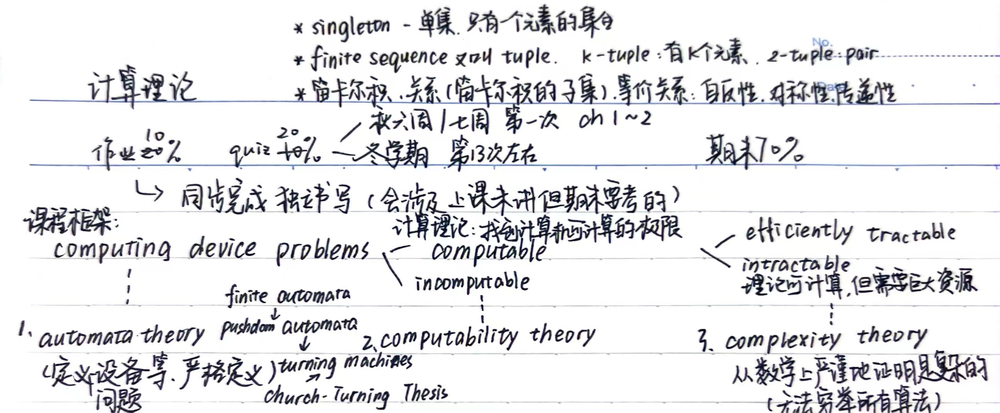

## 问题、语言定义

### 问题

- 问题分类
    - 优化问题（Optimization Problem）如最小生成树
    - 搜索问题（Search Problem）如找一棵权重最大为 k 的生成树
    - 判定问题（Decision Problem）如判断是否存在一棵权重最大为 k 的生成树
    - 计数问题（Counting Problem）如解决权重最大为k的生成树有多少棵
- 判定问题最简单 - 以上述例子为例，解决其他三个中任意一个问题即可解决判定问题；如果能证明问题的判定版本是困难的，那么其他三个版本的问题就是困难的
    - 对于一个问题有 yes-instance（作为问题的输入得到的输出为yes） 和 no-instance
    - 问题可以转化为 Given a string $w$, whether $w\in \{\text{encoding of yes-instance}\}$，这个问题由集合唯一决定
    - $\{\text{encoding of yes-instance}\}$ 就是一个语言（Language）

### 语言

- 字母表 Alphabet: **finite** set of symbols
    - $\Sigma = \{a, b, c\}$、$\Sigma = \{0, 1\}$、$\Sigma = \{\ \}$
- 字符串 String over $\Sigma$: **finite** sequence of symbols from $\Sigma$，可以选任意symbol，可以重复
    - $w = 010101$，$w = e$（或 $\epsilon$）是空串
    - $|w|$ 表示字符串长度（symbol个数），$|e| = 0$
    - $\Sigma^i$: set of all strings of length $i$ over $\Sigma$
    - $\Sigma^* = \bigcup_{i\geq 0} \Sigma^i$（$\Sigma$ 上所有字符串），$\Sigma^+ = \bigcup_{i\geq 1} \Sigma^i$
    - 字符串操作
        - 拼接（concatenation）：$w_1w_2$，$|w_1w_2| = |w_1| + |w_2|$，直接前后拼接
        - 反转（reversal）：$w^R$，$|w^R| = |w|$
        - 重复（exponentiation）：$w^i = \underbrace{ww\cdots w}_{i\ times}$，$w^0 = e$，$|w^i| = i|w|$
- 语言 Language over $\Sigma$: any subset of $\Sigma^*$

### 问题和语言的关系

- Decision Problem 和 Language 是**一一对应**的，Language 是 Decision Problem 的数学抽象
    - $\rightarrow$ {encodings of yes-instances}
    - $\leftarrow$ Given a string $w$, is $w$ in $L$?

## 自动机 Finite Automata

### 一般自动机

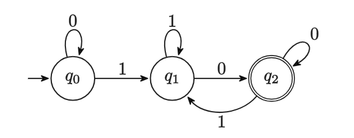

State Diagram

- 如上图就是一个 FA，$q_0$ （一个箭头加一个圆圈，unique）是初始状态，双圈 $q_2$ （several）是结束状态，箭头上的字母是转移条件

- 一个 FA 定义为一个五元组 $M = (K, \Sigma, \delta, s, F)$

    - $K$：状态集合（finite）
    - $\Sigma$：输入字母表
    - $\delta$：转移函数，$\delta\colon K\times \Sigma \to K$
    - $s\in K$：初始状态
    - $F\subseteq$：结束状态集合

- 执行逻辑：输入一个字符串，从初始状态，每次取出第一个字符，根据当前状态和字符查找转移函数，得到下一个状态，直到字符串为空，如果此时的状态为结束状态，则接受这个输入，否则拒绝这个输入。

- configuration：$C = (q, w)$，表示当前状态 $q$ 和剩余字符串 $w$，是执行sequence的一个tuple，也是$K \times \Sigma^*$的一个元素。

- yields

    - yields in one step：可一步转移到
        - 记为 $(q, w)\vdash_M (q', w')$，if $w=aw'$ for some $a\in\Sigma$ and $\delta(q, a) = q'$
    - yields：可转移到（不限制步数）
        - 记为 $(q, w)\vdash_M^* (q', w')$，if $(q, w)\vdash_M (q_1, w_1)\vdash_M \cdots \vdash_M (q', w')$

- 自动机接受字符串

    - $M$ accepts $w\in\Sigma^*$, if $(s, w)\vdash_M^* (q, e)$ for some $q\in F$
    - 即可以从初始状态 $s$ 通过一系列转移得到接受状态 $q$，且剩余字符串为空

- 自动机对应的语言（Language of $M$）

    - $L(M) = \{w\in\Sigma^*: M\text{ accepts }w\}$
    - 即所有能被自动机接受的字符串

- 自动机接受的语言

    - $M$ accepts $L$ if $M$ accepts **every** string in $L$ **and** rejects **every** string not in $L$ - 一个自动机只接受一个语言

    - $M$ accepts $L(M)$

    - 例子1：

      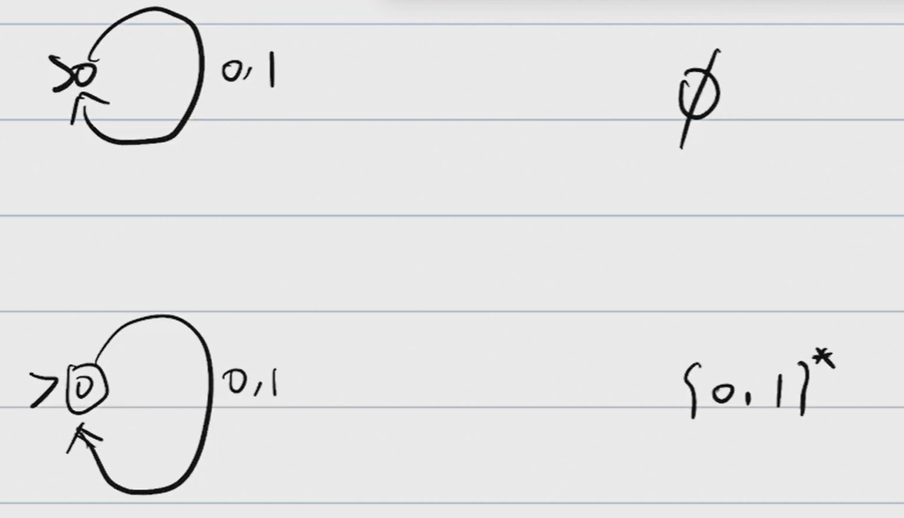

### NFA

#### 定义

上述对每一个起始状态和输入字符串都有固定的最终的固定状态的自动机被称为DFA(deterministic finite auto)，相反，最终状态不确定的被称为NFA(Non-deterministic f. a.)。

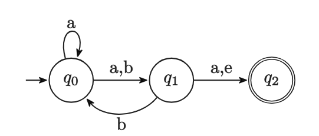

如上图是一个 NFA，和 DFA 有以下两个区别：

- 一个状态同一条件可以有多个转移方案（可以是0个）
- 可以有 $e$-transition，即不消耗字符的转移

同样定义为五元组 $M = (K, \Sigma, \Delta, s, F)$

- 和 DFA 区别只在 $\Delta$，是一个比函数更一般的关系（transition relation）
- $\Delta$：转移关系，$\Delta\subseteq K\times (\Sigma\cup\{e\})\times K$，分别代表：当前状态、读到的symbol、下一状态

#### 路线和构造

上述例子的路线有很多种：

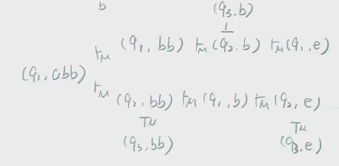

对于一个输入，NFA 可以有多种路线，但只要有一种路线能够接受，就认为 NFA 接受该输入

- 一种**理解**方式：并行计算，将所有可以走的路线看成是分裂进程，形成一颗树，运算结果由leaf决定，如果leaf有一个是被接受的，则该输入被接受；
- 另一种**理解**方式：NFA 可以猜测该往哪里转移，且总能猜对 - 从这一个角度出发容易**构造NFA**。

构造的例子：构造 NFA 接受 $L=\{w\in\{a, b\}^*: \text{the second symbol from the end is }b\}$

- 思路1：读到$a$不管它$\to$自指

- 思路2：读到$b$：

    - 不一定是倒数第二个$\to$自指
    - 是倒数第二个$\to$推进

- 思路3：处理读到倒数第二个$b$之后的最后一个symbol$\to$$a$或$b$都指向结束状态

    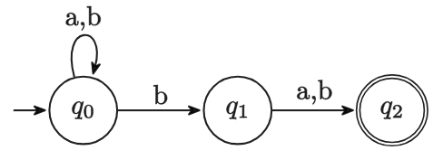

#### 语言

和DFA一样我们定义NFA对应的Language：

- 自动机对应的语言（Language of $M$）
    - $L(M) = \{w\in\Sigma^*: M\text{ accepts }w\}$
    - 即所有能被自动机接受的字符串
- 自动机接受的语言
    - $M$ accepts $L$ if $M$ accepts **every** string in $L$ **and** rejects **every** string not in $L$ - 一个自动机只接受一个语言
    - $M$ accepts $L(M)$

### DFA和NFA

#### 关系

- NFA 虽然看起来比 DFA 强大，但其二者实际上是等价的，可以相互转换并且保证两者对应的语言是一样的
    - $\forall$ NFA $M$，$\exists$ DFA $M'$，s.t. $L(M) = L(M')$
    - $\forall$ DFA $M$，$\exists$ NFA $M'$，s.t. $L(M) = L(M')$

#### 转换方式

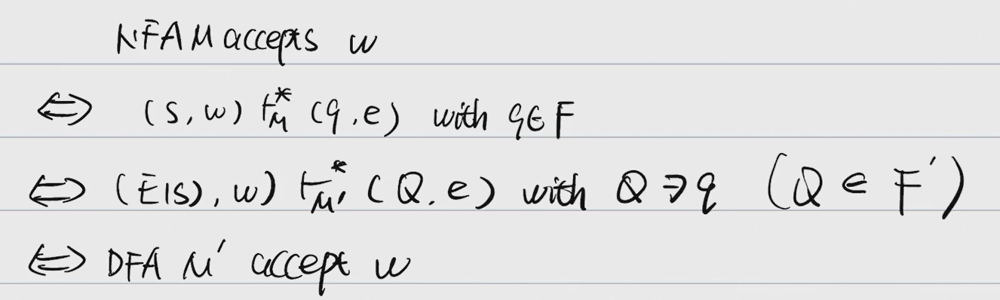

1. NFA 转 DFA 主要思路：函数是一种特殊的关系，DFA可以被看作一个特殊的NFA，满足NFA的性质
    - NFA 接收一个字符，会有多个转移方案，所有可达的下一状态合在一起的集合构成 DFA 的一个状态
    - 即 DFA 的状态是 NFA 的状态的幂集，结束状态是包含 NFA 的结束状态的 DFA 状态
    - $e$-transition 也要考虑，且不算在字符数里

2. NFA $M=(K, \Sigma, \Delta, s, F)$ 转为 DFA $M'=(K', \Sigma, \delta, s', F')$

    - $K' = 2^K = \{Q: Q\subseteq K\}$ - 可以理解成tree转换成了一个path，然后path的每一个node（每一层tree）成为了DFA的一个状态；即DFA的每一个状态都是NFA的状态的集合的子集

    - $F' = \{Q\in K': Q\cap F\neq \emptyset\}$ - 当且仅当DFA的最终状态包含了至少一个NFA的最终状态

    - $s' = E(s)$
        - 定义 $\forall q\in K, E(q) = \{p\in K: (q, e)\vdash_M^* (p, e)\}$
        - 即 $E(q)$ 是 $q$ **可以通过 $e$-transition 到达的状态集合**

    - $\delta$: $\forall Q\in K', \forall a\in\Sigma$ - 新的转移函数考虑的是从树的一层转移到下一层
        - $p$：上一层结点通过$a$可以到的状态的集合
        - 以及$p$可以通过 $e$-transition 到达的状态集合

$$
\delta(Q, a) = \bigcup_{q\in Q}\ \bigcup_{p: (q, a, p)\in\Delta}E(p)
$$

#### 两者等价关系证明

要证明两者对应的语言一样，即证明：

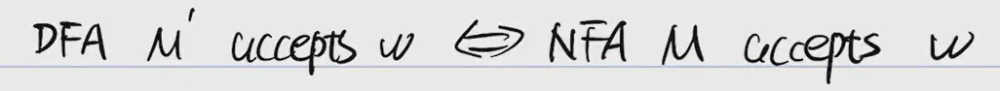

即证明：

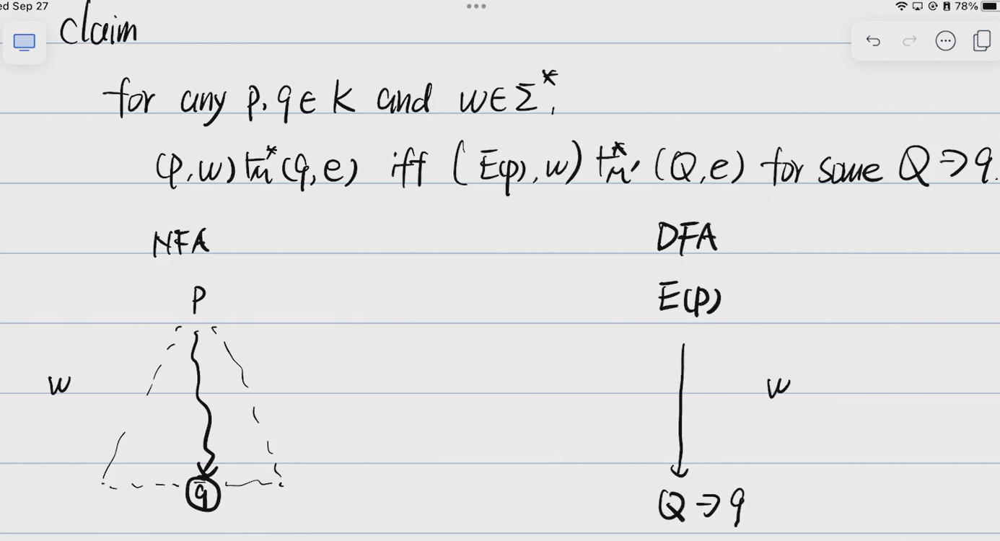

具体思路：by induction on $|w|$（考试不要求）

#### 转换的例子（NFA$\to$DFA，可能会考）

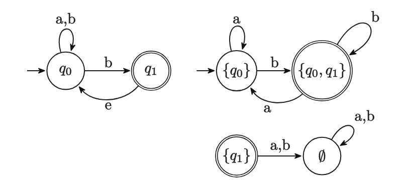

1. 列举DFA的全部状态，作为图中的结点
2. 确定起始状态$E(q_0)$
3. 确定接受状态 - DFA中包含$q_1$的状态
4. 枚举$\Sigma$，把树变成path
5. 去除起始状态不连接的点 - 右侧 DFA 的下边部分是冗余的，可以删掉

### 正则语言

A language is regular(正则) if it is accept by some FA. - 根据上述DFA和NFA的关系，也可以说A language is regular(正则) if it is accept by some NFA.

- 由上面的例子1，空集和$\{0. 1\}^*$都是正则的。

- 证明语言正则：构造一台接受这个语言的FA，例子：

    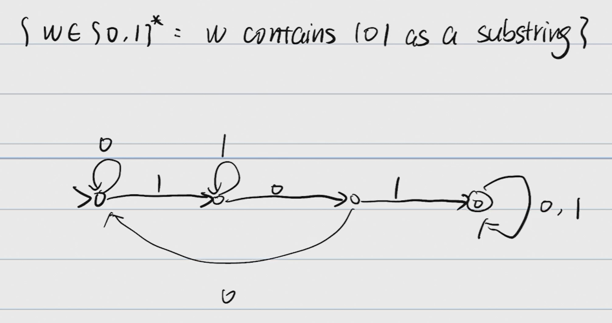

- Regular Operations

    - Union: $A\cup B = \{w: w\in A\text{ or }w\in B\}$
    - Concatenation: $A\circ B = \{ab: a\in A\text{ and }b\in B\}$
    - Star: $A^* = \{w_1w_2\cdots w_k: k\geq 0\text{ and each }w_i\in A\}$，$w_i$可以重复

- 定理：

    - 如果 $A$ 和 $B$ 是正则语言，则 $A\cup B$、$A\circ B$、$A^*$ 也是正则语言

- 证明：

    - Proof. if $A$ and $B$ are regular, so is $A\cup B$

        - 思路：合并两个接收 $A$ 和 $B$ 的 FA，并行地跑分别接受$A$和$B$的$M_A$和$M_B$，如果有一个接受了则接受

        - $\exists M_A=(K_A, \Sigma, \delta_A, s_A, F_A)\text{ accepts }A$，$\exists M_B=(K_B, \Sigma, \delta_B, s_B, F_B)\text{ accepts }B$

          $\text{let }M=(K, \Sigma, \delta, s, F)$，where:

            - $K = K_A\times K_B$
            - $s = (s_A, s_B)$
            - $F = \{(q_A, q_B): q_A\in F_A\text{ or }q_B\in F_B\}$
            - $\delta$: $\forall q_A\in K_A, \forall q_B\in K_B, \forall a\in\Sigma,\ \delta\big((q_A, q_B), a\big) = \big(\delta_A(q_A, a), \delta_B(q_B, a)\big)$

            $\text{then }M\text{ accepts }A\cup B$

    - Proof. if $A$ and $B$ are regular, so is $A\circ B$

        - 思路：猜连接之后的字符串的那一刀切在哪里可以分成$A$和$B$ - 考虑到之前对NFA的一种理解“NFA 可以猜测该往哪里转移，且总能猜对” - 连接两个接收 $A$ 和 $B$ 的 NFA，$A$的接受状态无条件跳转到$B$的起始状态
        - 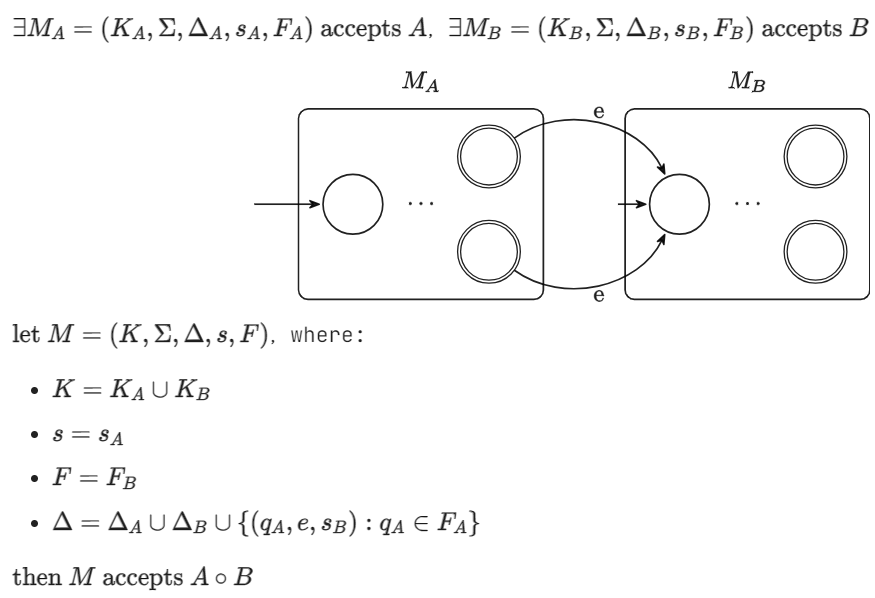
        - 可以证明新构造出来的$M$接受字符串$w$当且仅当$w$可以被切分成$A\circ B$

    - Proof. if $A$ and $B$ are regular, so is $A^*$

        - 思路：让一个接收 $A$ 的 NFA 自己进行循环
        - 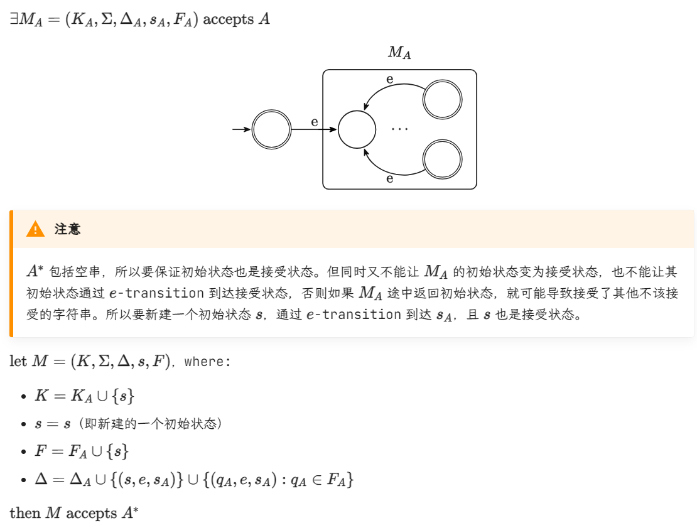

### 小结

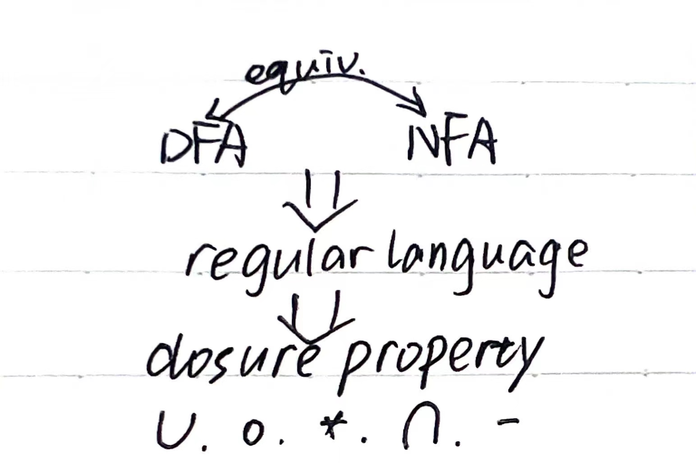