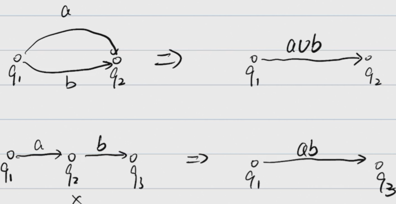
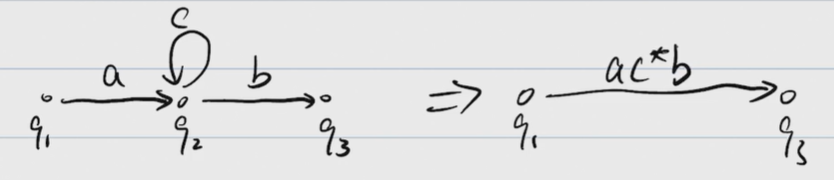
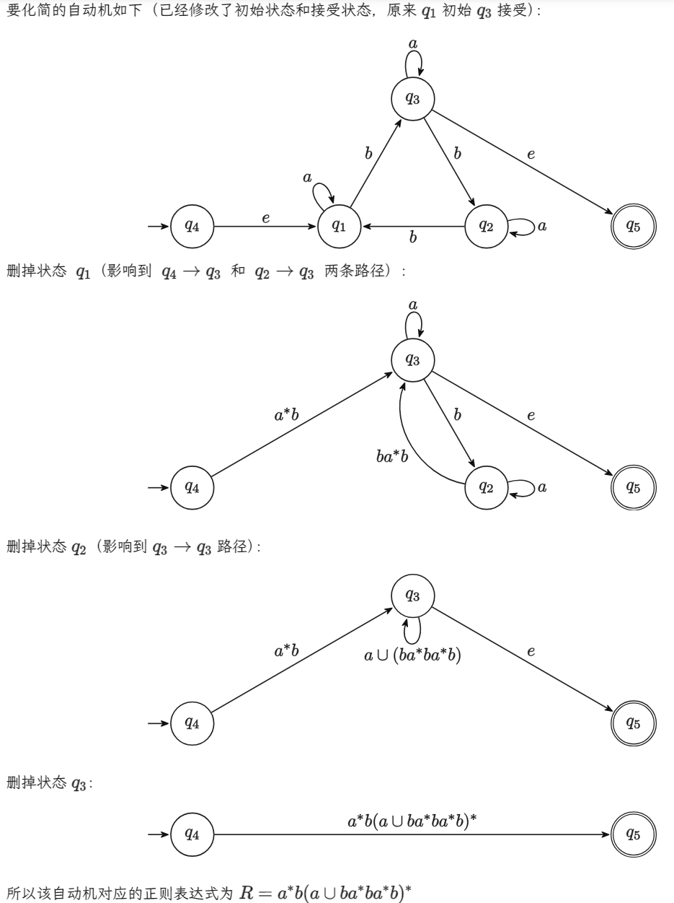
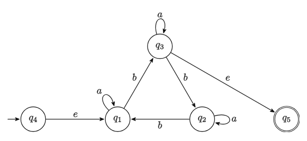
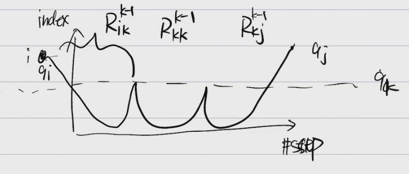
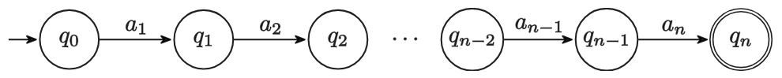
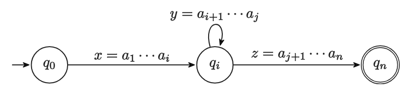

# 计算理论Lec2

## 正则表达式

### 定义

正则表达式是描述正则语言的一种方式。通过正则表达式，我们可以定义一个正则语言，即一组符合特定模式的字符串集合。

一个正则表达式由以下规则定义：

- **Atomic**：对于 $\emptyset$ 对应语言 $L(\emptyset)=\emptyset$，对于 $a\in\Sigma$ 有 $L(a)=\{a\}$
- **Composite**：
    - $R_1\cup R_2$ 对应语言 $L(R_1\cup R_2) = L(R_1)\cup L(R_2)$
    - $R_1R_2$ 对应语言 $L(R_1R_2) = L(R_1)\circ L(R_2)$
    - $R_1^*$ 对应语言 $L(R_1^*) = L(R_1)^*$
    - 优先级：$^* > \circ > \cup$
        - Ex. $a^*b\cup b^*a=\big((a^*)b\big)\cup\big((b^*)a\big)$

其实就类似于各编程语言中使用的正则表达式，不过那些正则表达式一般都加了不属于这里规定的正则表达式的更多功能（比如记录捕获组并在 \1 时引用捕获内容）。

### 例子

 - $\emptyset^*$ 对应语言 $\{e\}$
 - $a(a\cup b)^*b$ 对应语言 $\{w\in\{a, b\}^*: w\text{ starts with }a\text{ and ends with }b\}$
 - $(a\cup b)^*a(a\cup b)^*a(a\cup b)^*$ 对应语言 $\{w\in\{a, b\}^*: w\text{ contains at least two }a\text{'s}\}$

### 定理

一个语言$B$是正则的当且仅当它可以被一个正则表达式$R$描述，即$L(R) = B$。

#### 证明思路（工程视角）：

- $R\to B$
    - 任意一个正则表达式$R$都可以构造出一台NFA$M$，使得他们对应的语言一致。
    - 对于基础表达式，我们可以很容易地构造出NFA（空集和单个字符的），对于组合的，我们可以参考之前的正则语言closure部分的证明构造。

- $B\to R$

    - 即我们要解决一个问题：根据语言$B$对应的NFA$M$去构造一个正则表达式$R$，s.t. $L(R) = L(M)$

    - 步骤：

        1. 简化$M$，目标：
             - 没有箭头指向起始状态 - 加一个新的起始状态，连一条$e$到老的起始状态
             - 只有一个结束状态，且没有箭头从结束状态出来 - 新加一个结束状态，把老的结束状态都连一条$e$到新的结束状态，并取消老的结束状态的标记
        2. 把除了起始状态和结束状态外的状态删除，把箭头上面的label变成正则表达式，具体转换方式：
             - 
             - 
             - 最终得到一个从起始状态指向最终状态的状态机，箭头上的就是正则表达式

    - 例子（在删点的时候只需要关注长度为2且以要删除的点为中心的path即可）：

      

#### 严谨证明：

设 NFA $M=(K, \Sigma, \Delta, s, F)$，其中：

- $K = \{q_1, q_2, \cdots, q_n\}$，$s = q_{n-1}$，$F = \{q_n\}$
- $(p, a, q_{n-1})\notin\Delta$，$\forall p\in K, \forall a\in\Sigma$
- $(q_n, a, p)\notin\Delta$，$\forall p\in K, \forall a\in\Sigma$

求 $R$ 使得 $L(R) = L(M)$。

采用动态规划思想，划分子问题：

对于 $i, j\in[1, n]$ 以及 $k\in[0, n]$ 定义 $L_{ij}^k=\{w\in\Sigma^*: w\text{ drive M from }q_i\text{ to }q_j\text{ with no intermediate state having index }>k\}$

- 即 $L_{ij}^k$ 表示从 $q_i$ 到 $q_j$ 的路径表示的语言，且中间状态的下标不大于 $k$
    - 注意中间状态不包含首尾
- 记 $L_{ij}^k$ 对应的正则表达式为 $R_{ij}^k$
- 举例：
    - $L_{11}^0 = \{e, a\}$，对应 $R_{11}^0 = \emptyset^*\cup a$
        - 注意 $aa$ 不属于 $L_{11}^0$ 因为有中间状态 $q_1$，其下标大于 0
    - $L_{13}^0 = \{b\}$，对应 $R_{13}^0 = b$
    - $L_{41}^1 = \{e, a, aa, \cdots\}$，对应 $R_{41}^1 = \emptyset^*\cup aa^*$

动态规划过程部分：

- 目标：$R_{(n-1)n}^{n-2}$

- 起始已知：
    - $k=0\text{ and if }i=j$，有 $L_{ii}^0 = \{e\}\cup\{a: (q_i, a, q_i)\in\Delta\}$，可写出正则表达式 $R_{ii}^0$
    - $k=0\text{ and if }i\neq j$，有 $L_{ij}^0 = \{a: (q_i, a, q_j)\in\Delta\}$，可写出正则表达式 $R_{ij}^0$
    
- 递推关系：$L_{ij}^k = L_{ij}^{k-1}\cup\ ?$
    - 中间过程有若干次会到达 $q_k$，依此来进行划分，有 $L_{ik}^{k-1}$、$L_{kk}^{k-1}$（若干次）、$L_{kj}^{k-1}$ 几个阶段
    
      
    
    - 连接起来有 $L_{ij}^k = L_{ij}^{k-1}\cup L_{ik}^{k-1}\circ\big(L_{kk}^{k-1}\big)^*\circ L_{kj}^{k-1}$
    
    - 因此对应正则表达式有 $R_{ij}^k = R_{ij}^{k-1}\cup R_{ik}^{k-1}\big(R_{kk}^{k-1}\big)^*R_{kj}^{k-1}$

有以上这些关系，进行动态规划递推即可求解最终的正则表达式。

## Pumping Theorem

### 证明语言是正则的方法：

1. 构造DFA
2. 构造NFA
3. 构造正则表达式

### 证明语言不是正则语言的方法：

（正则语言的必要条件）

可以用来证明一个语言不是正则语言的一个定理。其内容如下：

- 令 $L$ 为一个正则语言
- 则存在一个整数 $p\geq 1$（称为 **pumping length**）
- 使得对于所有长度不小于 $p$ 的字符串 $w\in L$
- 都可以将 $w$ 分解为三部分 $w=xyz$，满足：
    1. 对于任意 $k\geq 0$，有 $xy^kz\in L$
    2. $|y|\geq 1$
    3. $|xy|\leq p$

### Pumping Theorem 证明

基本思路：如果字符串足够长，在状态数量有限的情况下一定有重复的子串

如果 $L$ 是有限的，那么令 $p=\displaystyle\max_{w\in L}|w|+1$ 即可满足所有要求。

如果 $L$ 是无限的，因为其是正则语言，所以存在一个 DFA $M$ 接受 $L$。令 $p$ 为 $M$ 的状态数，即 $p=|K|$。

令 $w\in L$ 且 $|w|\geq p$，现假设 $w=a_1a_2\cdots a_n$，则该自动机一定包含如下一条路径：

因为自动机只有 $p$ 个状态，但 $n$ 又不小于 $p$，所以一定存在 $0\leq i < j\leq p$，使得 $q_i$ 和 $q_j$ 是同一状态。这样这条路径就可以转化为：

因此 $xy^kz\in L$、$|y|=j-1\geq 1$、$|xy|=j\leq p$ 都满足。

### 例题1

证明 $L = \{0^n1^n:n\geq 0\}$ 不是正则语言

**反证法**，假设 $L$ 是正则的，令 $p$ 为其 pumping length。

根据 **pumping theorem**，$0^p1^p\in L$ 可以被写成 $0^p1^p=xyz$，满足：

- $xy^kz\in L, \forall k\geq 0$
- $|y|\geq 1$
- $|xy|\leq p$

由后两条可以推出 $y=0^t$（其中 $t\geq 1$），那么令 $k=0$，有 $xy^kz=xy^0z=xz=0^{p-t}1^p$，但这个字符串不在 $L$ 中，不符合第一条，产生矛盾，所以 $L$ 一定不是正则语言。

### 例题2

证明
$L = \{w\in \{0,1\}^*: \text{w has equal number of 0s and 1s}\}$
不是正则语言

在例题1的基础上，使用**closure property**，假定$L$正则，那么$L \cap 0^*1^*$正则，那么 $L' = \{0^n1^n:n\geq 0\}$ 正则，和例题1矛盾，故$L$不是正则语言。

## 总结

- regular language
- $DFA \Leftrightarrow NFA \Leftrightarrow REX$，重点是会构造
- closure property
- pumping theorem - 必要非充分条件