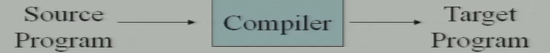
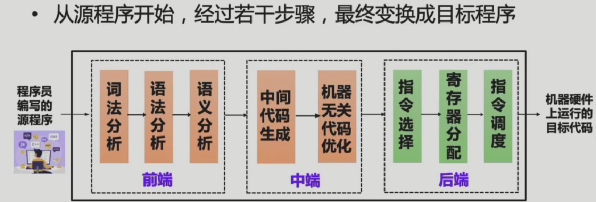
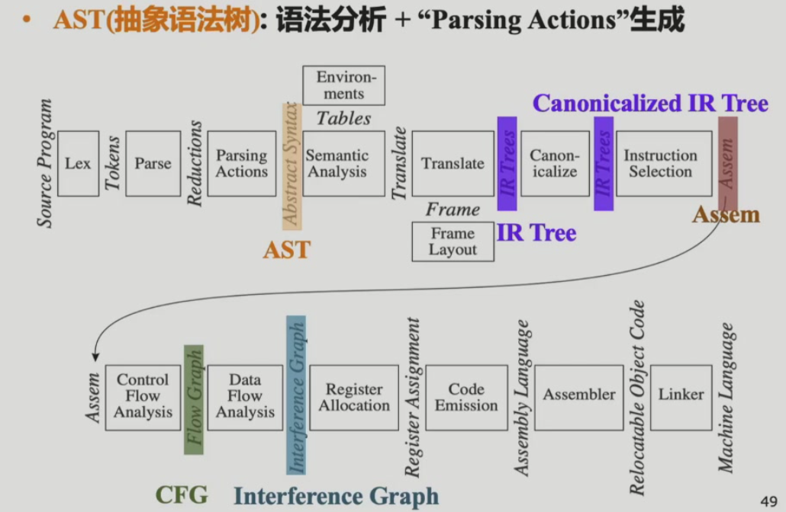
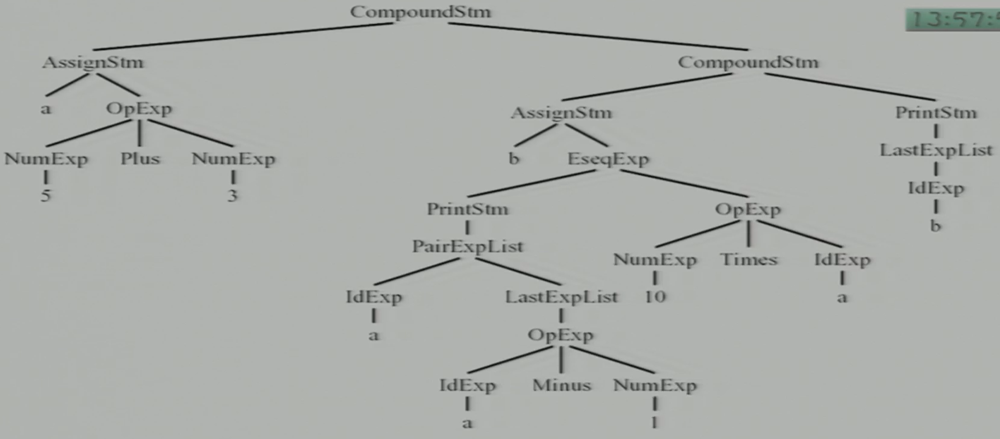
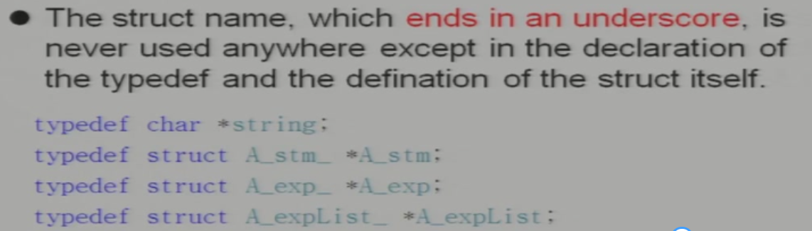
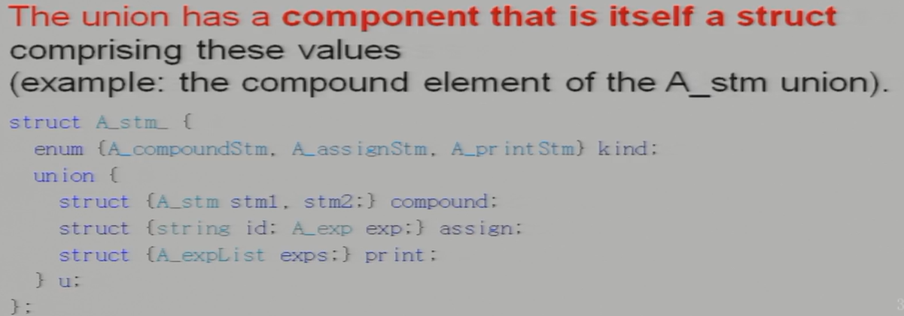
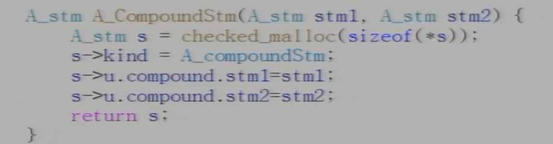
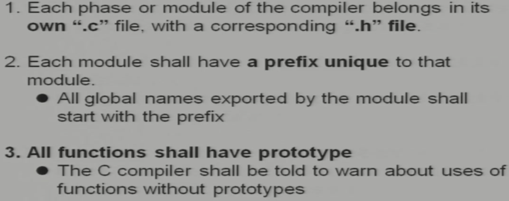
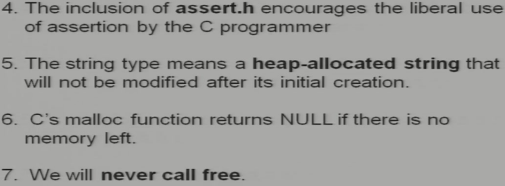

# 1 Introduction

## 1.0 什么是编译器

把源语言表述的源程序转换成目标语言表述的目标程序，并不是只有把高级语言写成的程序转换成可执行文件的程序才是编译器。

## 1.1 模块与接口

Tiger编译器的流程：

编译器被划分成了不同的**module**模块（**phases**阶段可以是一个或者多个module），每个模块之间通过**interface**接口连接。（并不是所有的编译器都是按照这个框架来的，能跑就行）

抽象语言：在模块间传递的信息的描述方式

- AST - 抽象语法树，语法分析+“parsing actions”生成
- IR Tree - 语义分析后按一定规则生成的树型中间表示
- Canonicalized IR Tree - 对IR Tree做变换所得（方便生成汇编）
- Assem - 指令选择器生成（一种特殊的汇编）
- CFG (Control Flow Graph) 控制流图 - 方便进行数据流分析，例如活跃变量分析(liveness Analysis)
- Interference Graph - 从活跃变量分析的结果构造，用于指导寄存器分配

### 1.1.1 各个阶段的具体功能

编译器前端：理解源语言，包括词法分析、语法分析、语义分析等

编译器后端：生成目标语言

- **Lex**词法分析 - 把源文件分成一个个word流（称为**tokens**）
- **Parse**语法分析 - 识别程序的短语结构
- **Parsing Actions** - 根据每一个短语生成抽象语法树

- **Semantic Analysis**语义分析 - 弄清楚每一个短语是什么意思：变量在哪里定义、使用，类型检查
- **Frame Layout** - 把变量、函数参数放到栈帧上
- **Translate** - 把前几个阶段的结果转换为IR Tree，前后端不绑定，可以任意切换源语言和目标语言

- **Canonicalize**规范化 - 消除表达式当中的副作用内容（让IR Tree和目标语言尽可能接近）
- **Instruction Selection**指令选择 - 把IR Tree转换成目标语言指令序列
- ***Control Flow Analysis**控制流分析 - 建立一个指令流转图，可以知道整个程序可能的执行路径*

- ***Data Flow Analysis**数据流分析 - 程序的变量信息间是怎么流动的*
- **Register Allocation**寄存器分配（这里的寄存器是虚拟寄存器，临时的名字，和具体机器无关）
- **Code Emission** - 产生具体的代码，分配具体的机器寄存器

### 1.1.2 具体接口的实现

不一定是实打实的数据结构，可能是一个或者一组函数，例如词法分析和语法分析之间通过调用词法分析阶段的`getNextToken()`获得接口的tokens。

## 1.2 工具和软件

比较重要的两个抽象：

- REX用于词法分析
- CFG用于语法分析

两个工具：

- Lex - 通过描述性规范（主要是REX规则序列）自动生成词法分析器
- Yacc - 自动生成语法分析器

## 1.3 树语言

把一个将程序变成抽象的树的语法称为树语言。（感觉和CFG对应的语法树类似？）

例子：

Q：编译器如何表示这个程序？

上图为产生该程序的语法树。父节点是对应语法表达式的标签，子节点是具体的语法表达式右边的一个个内容。

1. 树是通过语法描述的

2. 一个树是通过一个或者多个`typedef`描述的（因为语法树有很多不同的节点），每一个对应了一个语法中的symbol

3. 每一个`typedef`定义的是特定结构的指针
      

1. 每一个`struct`包含一个类型域因为可能有多个产生式

2. 如果产生式右边包含多个symbol，那么需要定义一个`struct u`作为多个symbol的union结构：
      

3. 如果产生式右边只有一个symbol，那么就不需要union结构，直接定义一个string就可以

4. 每一个类（产生式）会有一个constructor function（用于申请内存和赋值）：
      

5. 为了减少模块交互的冲突，会给每一个模块添加独特的前缀

6. `typedef`的名称需要以小写字母开头，constructor functions需要以大写字母开头，enumeration atoms和union variants均以小写字母开头

一些工程上的规则（应该不是很重要）：

