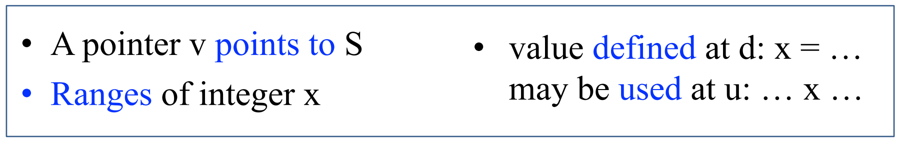
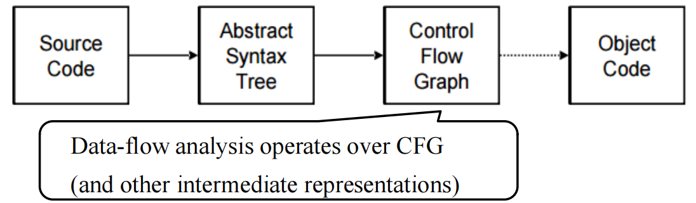
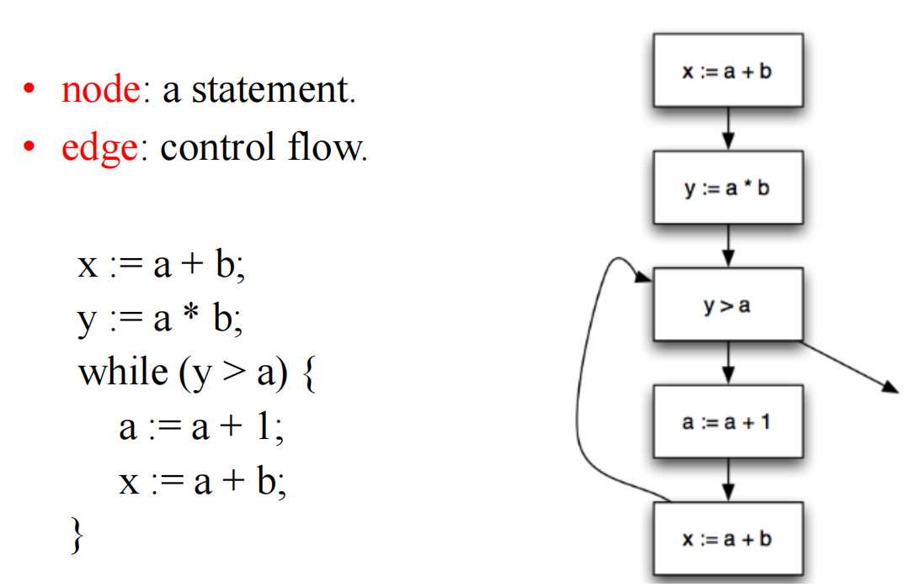
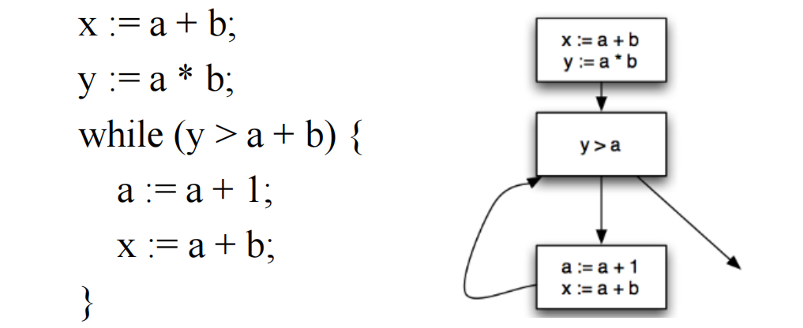
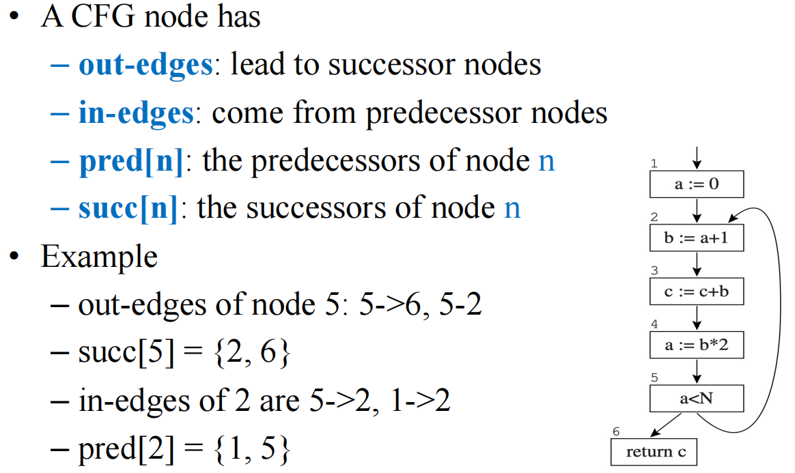
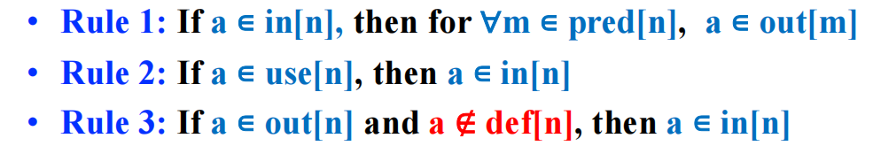
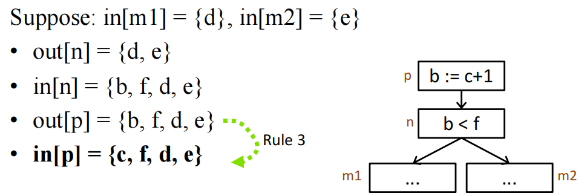
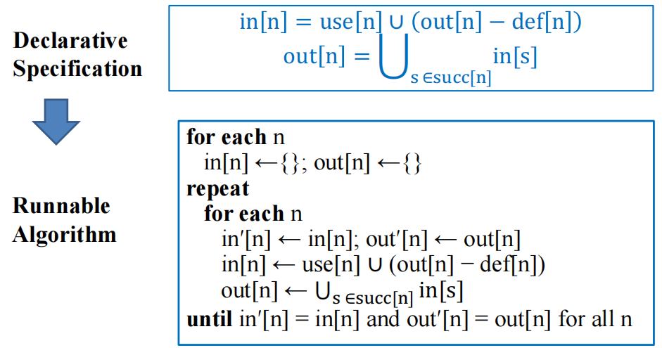
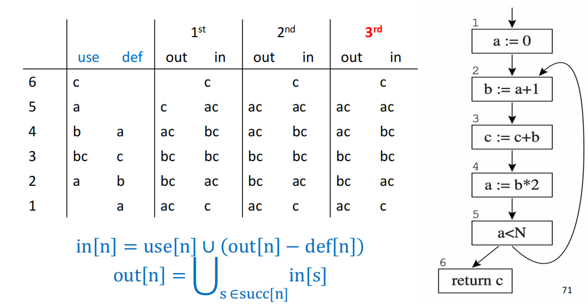

# 10 Liveness Analysis 活跃变量分析

参考资料：

- 姚培森老师2024~2025学年春夏ch10ppt
- [wcjj的笔记](https://shiseab.github.io/notebook/Compiler/ch10/#dataflow-analysis)
- 伟大的Gemini 2.5 pro deep research

---

追踪变量的生命周期，判断哪些之后还会被用到，哪些已经不再需要了

## 1 数据流分析

在不实际运行程序的情况下，通过静态分析程序的源代码或IR，来收集程序在（可能的）运行时关于数据如何“流动”的信息 。

### 1.1 编译优化

**信息收集的层次：** 编译器优化和分析可以在不同的粒度或范围上进行 ：

- **局部优化 (Local Optimization):** 工作范围通常限制在单个**基本块**（Basic Block）内。这是最简单直接的分析层次。
- **过程内/全局优化 (Intraprocedural/Global Optimization):** 分析范围扩展到整个函数或过程。此时，需要考虑基本块之间的控制流转移。
- **过程间/全程序优化 (Interprocedural/Whole-Program Optimization):** 分析跨越多个函数或过程的边界，甚至在整个程序的范围内进行。这是最复杂但可能带来最大收益的分析层次，有时甚至在链接阶段进行（称为链接时优化，LTO）。

**分析与转换：** 编译器优化的过程通常遵循一个两步流程 ：

1. **分析 (Analyze):** 在这个阶段，编译器对程序的IR执行“程序分析”，以收集关于程序行为的“事实”。例如，确定一个变量在某点是否“活跃”，一个表达式的值是否为常量，或者一个指针可能指向哪些内存位置。
    
2. **转换 (Transform):** 在收集到足够的事实之后，编译器会基于这些事实对程序进行等价的转换，目的是提升程序的性能（如速度、空间效率）或减小程序体积。*常见的转换包括常量折叠（将运行时的常量计算提前到编译时完成）、死代码消除（移除不会影响程序最终结果的代码）、循环不变代码外提（将循环中每次迭代都计算相同结果的语句移到循环外）以及寄存器分配（将变量有效地分配到CPU寄存器中）等。*

在不同的优化粒度范围，编译器会使用不同的中间表示，例如 Local 时使用 dependence graph；Intraprocedural (or global) 时使用 control-flow graph for dataflow analysis；Interprocedural (or who-program) 时使用 Call graph, ICFG, SDG

### 1.2 CFG



数据流分析中一种至关重要的中间表示，一个有向图。

组成元素：

**节点 (Nodes):**

- 在最细粒度的CFG中，一个节点可以代表程序中的一条单独语句，例如赋值语句（如 `x := y op z` 或 `x := op z`）、复制语句（如 `x := y`）、条件分支语句（如 `if x relop y goto L`）或无条件跳转语句（如 `goto L`）。

**边 (Edges):**

- 一条从节点A到节点B的边表示，当节点A代表的语句执行完毕后，程序控制流可能转移到节点B代表的语句。例如，顺序执行的语句之间会有一条边；条件语句则会根据条件的真假产生两条或多条出边，分别指向不同的后续语句。

例子：



在满足特定条件的时候，我们可以考虑将语句们聚合成一个**基本块**。

**基本块 (Basic Blocks)：CFG的简化与加速**

- 定义：一个基本块 (Basic Block) 是一段连续的指令序列，它满足以下两个条件：
    1. 只有一个入口点：控制流只能从基本块的第一条指令进入。
    2. 只有一个出口点：控制流只能从基本块的最后一条指令离开（即块内除了最后一条指令外，没有任何跳转指令；最后一条指令可以是跳转指令）。
- 例子：
    
但是在活跃变量分析中，每个basic block都只有一个 statement（single-statement basic blocks）。

CFG中的节点关系：

- `pred[n]`: 表示CFG中节点 `n` 的所有**前驱 (predecessor)** 节点的集合。即那些执行后可能立即跳转到节点 `n` 的节点。
- `succ[n]`: 表示CFG中节点 `n` 的所有**后继 (successor)** 节点的集合。即节点 `n` 执行后可能立即跳转到的那些节点。

例子：



### 1.3 分析的不可判定性

考虑这个代码：

```c++
x = 10;    // 变量x在这一行之后是否活跃？
f();       // 调用一个函数f
return x;  // 返回x的值
```

表面上看，变量 `x` 在第1行被赋值后，其值在第3行被使用，因此 `x` 在第1行之后似乎是活跃的。但是，如果函数 `f()` 是一个永不返回的函数（例如，它内部包含一个无限循环），那么第3行的 `return x;` 语句实际上永远不会被执行。在这种情况下，第1行对 `x` 的赋值就是无用的，`x` 在该点之后也就不再活跃。判断一个变量是否活跃，竟然间接依赖于判断函数 `f()` 是否会停机——而著名的“停机问题”正是不可判定的经典例子。

我们使用Rice定理推广可得：**任何关于程序计算的函数本身的非平凡（nontrivial）语义属性都是不可判定的**。

因此我们在活跃变量分析的时候，采取了**过近似 (overapproximation)**的策略，分析算法找出的活跃变量集合，可能会比在任何一次实际动态执行中真正活跃的变量集合要大一些，但它绝不会遗漏任何一个真正活跃的变量。例如，当遇到一个 `if` 条件分支时，由于在编译时无法确定条件是真还是假（这可能取决于运行时的输入），静态分析通常会假设两个分支都可能被执行。

## 2 活跃变量分析

### 2.1 活跃变量

**定义：** 一个变量 `x` 在程序的某个点 `p` (或者说在执行某条语句 `s` 之前) 被认为是**活跃 (live)**的，必须满足以下三个条件 ：

1. 从点 `p` 开始，存在至少一条可能的执行路径。
2. 在这条执行路径上，变量 `x` 的当前值在未来的某个点 `s'` 被**使用 (used)** (例如，出现在表达式的右侧、作为函数参数、或在条件判断中)。
3. 在这条执行路径上，从点 `p` 到达使用点 `s'` 的过程中，变量 `x` 没有被**重新定义 (redefined / killed)** (即没有新的值赋给 `x`)。


而我们的分析方式通常是反向分析的。

通过活跃变量分析我们可以：

1. **实现寄存器分配 (Register Allocation)**

考虑以下代码序列：

```c++
a = 1      // 语句1执行后，a活跃，其值为1
b = a + 2  // 语句2使用a，定义b。执行后，a不再活跃（假设后续不再用），b活跃
c = b + 3  // 语句3使用b，定义c。执行后，b不再活跃（假设后续不再用），c活跃
return c   // 语句4使用c
```

我们可以分析出各个变量的活跃区间（这里用语句编号表示，区间为左闭右开，表示变量在该语句执行后到下一相关语句执行前是活跃的）：

- 变量 `a` 的活跃区间大约是：从语句1之后到语句2之前。
- 变量 `b` 的活跃区间大约是：从语句2之后到语句3之前。
- 变量 `c` 的活跃区间大约是：从语句3之后到语句4之前。 

（更精确地说，`a` 在语句1执行后到语句2执行前是活跃的；`b` 在语句2执行后到语句3执行前是活跃的；`c` 在语句3执行后到语句4执行前是活跃的。） 由于这三个变量 `a`, `b`, `c` 的活跃区间互不重叠，编译器可以将它们都分配到同一个寄存器（例如，`r`）中。代码可以被重写为 ：

```c++
r = 1        // 对应 a = 1
r = r + 2    // 对应 b = a + 2 (即 r = r + 2)
r = r + 3    // 对应 c = b + 3 (即 r = r + 3)
return r     // 对应 return c
```

通过这种方式，原本需要三个不同存储位置的变量，现在只需要一个寄存器即可，大大提高了寄存器的利用率。

2. **Code Optimizations** -- **死代码消除 (Dead Code Elimination):** 如果一个赋值语句 `$x =...$` 执行之后，变量 `x` 立即变成“死的”（即它的值在后续的任何执行路径中都不会再被使用），那么这个赋值语句就是**死代码 (dead code)**。它做了无用功，浪费了计算资源。编译器可以利用活跃性信息安全地移除这类死代码，从而减小程序体积并可能提高运行速度。
3. **IR Construction** -- **优化静态单赋值（SSA）构造 (Optimizing SSA Construction):** SSA是一种重要的中间表示形式，它要求每个变量只被赋值一次。活跃性信息可以帮助更有效地将程序转换为SSA形式，并进行基于SSA的优化。
4. **Security/Reliability** -- **检测未初始化变量的使用 (Detecting Use of Uninitialized Variables):** 虽然这不是活跃性分析的主要目标，但相关的分析技术（例如，通过跟踪变量是否在使用前已被明确定义）可以帮助编译器发现潜在的程序错误，如使用了未经初始化的变量。

### 2.2 构建数据流方程

#### 2.2.1 `def[n]`和`use[n]`，`in[n]`和`out[n]`的定义

为了进行活跃变量分析，我们需要首先为CFG中的每个节点 `n`（代表一条语句或一个基本块）确定两组关键的局部信息：在该节点中被**定义 (defined)** 的变量集合和被**使用 (used)** 的变量集合 。

- **`use[n]` (变量使用集合):** 指在节点 `n` 所代表的语句或指令中，其值被**读取或使用**的变量的集合。通常，这指的是出现在表达式右侧、作为函数调用参数、或在条件判断语句中被引用的变量。
    - 例如，对于语句 `$x := y + z;`，`use[n]` 是 `{y, z}`。
    - 对于语句 `if (a < b) goto L;`，`use[n]` 是 `{a, b}`。
    - 对于语句 `return c;`，`use[n]` 是 `{c}`。
- **`def[n]` (变量定义集合):** 指在节点 `n` 所代表的语句或指令中，被**赋值或写入新值**的变量的集合。通常，这指的是出现在赋值语句左侧的变量。
    - 例如，对于语句 `$x := y + z;`，`def[n]` 是 `{x}`。
    - 对于语句 `if (a < b) goto L;`，`def[n]` 通常是空集 `{}`，因为条件判断语句本身一般不改变任何变量的值（除非有副作用，但简单模型中通常不考虑）。

数据流分析就是将上述局部信息通过CFG在全局范围内传播，一个变量可能因为在某个节点被 `use` 而变得活跃；一个变量的当前值则可能因为在某个节点被 `def` 而“死亡”（即其旧值不再活跃，新值开始活跃）。

而对于CFG中的每一个节点 `n`，我们关心两个关键的活跃变量集合 ：

- **`in[n]` (Live-in set):** 在节点 `n` 的**入口处 (entry)**，即在节点 `n` 代表的语句即将执行**之前**，处于活跃状态的变量的集合。如果一个变量 `x` 属于 `out[n]`，这意味着在节点 `n` 执行完毕后，`x` 的值沿着从 `n` 出发的某条控制流路径，在未来的某个时刻将会被使用。
- **`out[n]` (Live-out set):** 在节点 `n` 的**出口处 (exit)**，即在节点 `n` 代表的语句执行完毕**之后**，处于活跃状态的变量的集合。如果一个变量 `x` 属于 `in[n]`，这意味着在节点 `n` 即将执行之前，`x` 的当前值是必需的。要么在节点内部被使用，要么在之后的节点被使用。

`in[n]` 和 `out[n]` 就是在特定程序点（语句的入口和出口）对活跃性进行的形式化描述。整个分析的目标就是为程序中的所有节点 `n` 计算出这些集合。

#### 2.2.2 构建数据流方程

活跃性规则：



1. **规则1 (信息从后继节点的`IN`流向当前节点的`OUT`)：**如果一个变量 `a` 在节点 `m` 的某个直接后继节点 `n` 的入口处是活跃的（即 $a \in in[n]$, $m \in pred[n]$），那么变量 `a` 在节点 `m` 的出口处也必须是活跃的（即 $a \in out[m]$）；
2. **规则2 (信息从`USE`流向`IN`)：**如果一个变量 `a` 在节点 `n` 中被直接使用（即 $a \in use[n]$），那么变量 `a` 在节点 `n` 的入口处必须是活跃的（即 $a \in in[n]$）；
3. **规则3 (信息从`OUT`流向`IN`，如果未被`DEF`)：**如果一个变量 `a` 在节点 `n` 的出口处是活跃的（即 $a \in out[n]$），并且变量 `a` **没有**在节点 `n` 中被重新定义（即 $a \notin def[n]$），那么变量 `a` 在节点 `n` 的入口处也必须是活跃的（即 $a \in in[n]$）。
    例子（四行推理分别使用了规则：1；23；1；3）：
    

**数据流方程组** ： 基于上述规则，我们可以得到以下两个核心的数据流方程：

1. **$out[n] = \bigcup_{s \in succ[n]} in[s]$**
      - 解释：一个变量在节点 `n` 的出口处是活跃的，当且仅当它在节点 `n` 的至少一个直接后继节点 `s`的入口处是活跃的。这个方程体现了活跃性信息是如何从后继节点的 `in` 集合“向上”或“反向”流入当前节点的 `out` 集合的。
      - 描述了活跃性如何跨越控制流边**反向**传播。
2. **$in[n] = use[n] \cup (out[n] - def[n])$**
      - 解释：一个变量在节点n的入口处是活跃的，存在两种可能性：
          - **情况一：** 该变量在节点 `n` 中被直接使用（即属于 `use[n]` 集合）。
          - **情况二：** 该变量在节点 `n` 的出口处是活跃的（即属于 `out[n]` 集合），**并且**它没有在节点 `n` 中被重新定义（即不属于 `def[n]` 集合）。
      - 描述了活跃性如何受到语句 `n` 的**局部**行为（即它的使用和定义）的影响。

### 2.3 求解数据流方程




节点遍历顺序： 对于反向数据流分析（如活跃变量分析），以与控制流相反的顺序（例如，CFG的拓扑排序的逆序）处理节点，并且在处理每个节点 `n` 时，先计算 `out[n]` 再计算 `in[n]`，通常能使算法更快收敛。

例子：



## 3 其他探讨

### 3.1 加速计算

**1. 使用基本块**

当使用基本块作为CFG节点时，我们需要重新定义 `use` 和 `def`（其中 `B` 代表一个基本块）：

- `use`：是在基本块 `B` 中，那些在块内任何对其的定义（赋值）**之前**就被使用的变量的集合。
- `def`：是在基本块 `B` 中被定义（赋值）的所有变量的集合（如果一个变量在块内被多次定义，通常我们关心的是其最终的定义，或者简单地将其视为被定义过即可，具体取决于分析的精度需求）。
- 计算基本块的 `use` 和 `def` 时，需要考虑块内语句的顺序。例如，如果块内有语句 `s_1: y := x; s_2: x := 1;`，那么对于整个块而言，`x` 是被 `use` 的（在 `s_1`），然后被 `def` 的（在 `s_2`）。

**2. 集合的表示方法 (Representation of Sets)**

在数据流分析中，`in`、`out`、`use`、`def` 集合的表示和操作效率对整体性能有很大影响。

常见的集合表示方法有：

- 位向量 (Bit Arrays / Bit Vectors) - 适合稠密集合
    - 如果程序中总共有 `V` 个不同的变量，我们可以为每个变量分配一个唯一的序号（从0到 `V-1`）。然后，一个长度为 `V` 的位向量就可以用来表示一个变量集合。向量中的第 `i` 位为1表示第 `i` 个变量在该集合中，为0则表示不在。
    - **优点：** 集合操作可以非常高效地通过按位逻辑运算来实现。
    - **缺点：** 稀疏集合下位向量会造成大量的空间浪费（大部分位都是0）。
- 排序列表 (Sorted Lists) - 适合稀疏集合
    - 用一个有序的列表（例如，按照变量名或其唯一ID排序）来存储集合中的变量。
    - **优点：** 集合的并集、交集等操作可以通过类似于归并排序中的合并步骤来实现，时间复杂度与集合大小成线性关系。
    - **缺点：** 对于稠密集合列表操作（尤其是查找和插入）可能比位向量的位运算要慢。

**3. 一次分析一个变量 (Analyzing One Variable at a Time)**

适用于当编译器只对少数几个变量的活跃性感兴趣时，或者当许多临时变量的活跃范围非常短且局部时。

### 3.2 理论视角

**1. 时间复杂度**

对于一个大小为 $N$ 的程序（最多 $N$ 个节点和 $N$ 个变量），每次集合操作的时间复杂度为 $O(N)$。最坏情况下，迭代算法的时间复杂度为 $O(N^4)$。但在实际应用中，由于合适的计算顺序，通常在 $O(N)$ 到 $O(N^2)$ 之间。

**2. 最小不动点**

活跃变量的数据流方程可能有多个解。但迭代算法总是能计算出**最小不动点**，这个解是所有其他解的子集。这意味着它提供了最精确的过近似。

### 3.3 静态活跃性 vs. 动态活跃性

- **静态活跃性（Static Liveness）**（过近似）：一个变量 `a` 在节点 `n` 处是静态活跃的，如果存在从 `n` 到 `a` 的某个使用点的一条控制流路径，且该路径上没有对 `a` 的定义。这是编译器在编译时可以确定的活跃性。
- **动态活跃性（Dynamic Liveness）**（欠近似）：一个变量 `a` 在节点 `n` 处是动态活跃的，如果程序的某个执行路径从 `n` 到 `a` 的使用点，且该路径上没有对 `a` 的定义。这是程序实际运行时才能确定的活跃性，通常难以精确计算。

**重要关系**：如果一个变量是动态活跃的，那么它也一定是静态活跃的。
