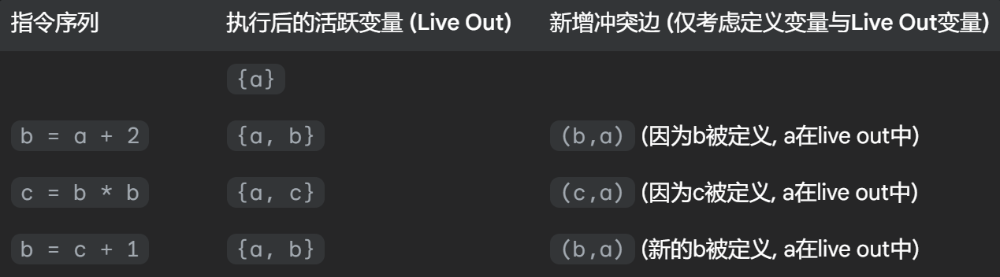
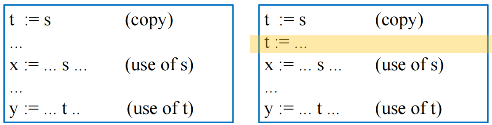
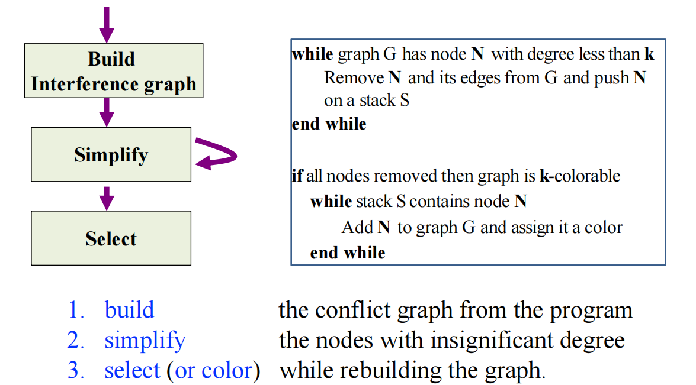
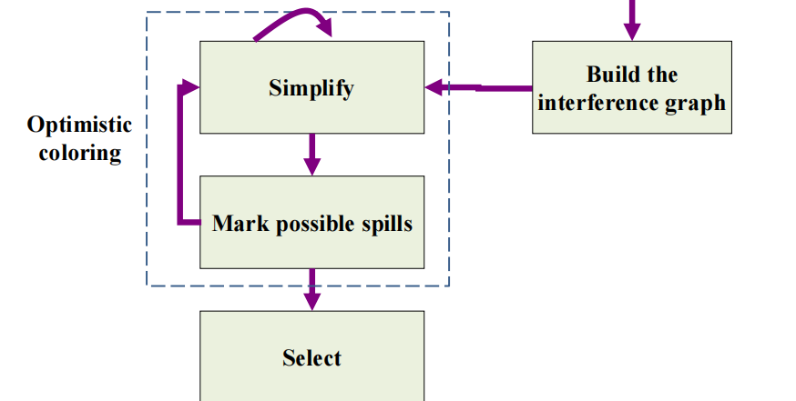
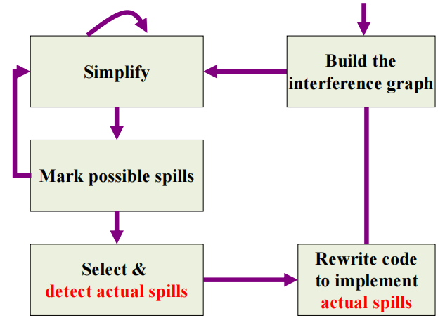
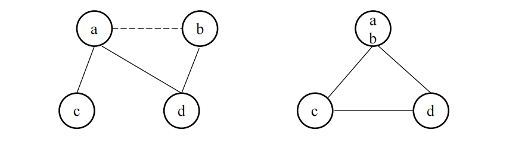
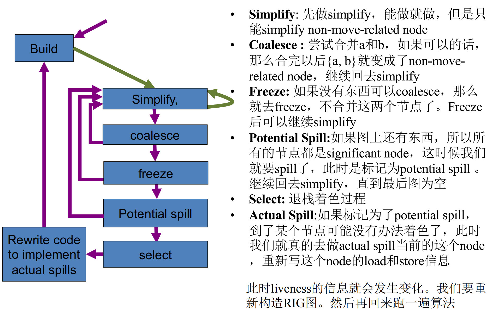
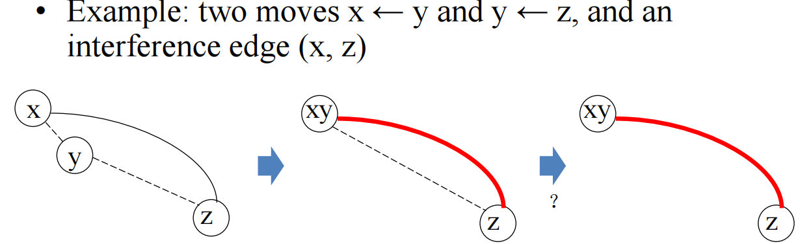
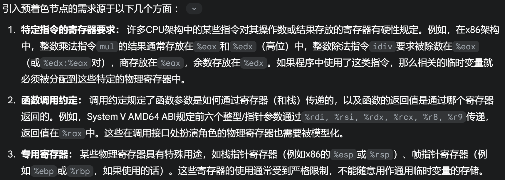

# 11 Register Allocation 寄存器分配

参考资料：

- 姚培森老师2024~2025学年春夏ch11ppt
- [wcjj的笔记](https://shiseab.github.io/notebook/Compiler/ch11/)
- [伟大的Gemini 2.5 pro deep research](https://docs.google.com/document/d/1IP_Gj_iWpSZcCbsURjPri4wgXa10j5oCh_ZdpM4sFJc/edit?usp=sharing)

---

将理论上无限的临时变量，有效地映射到实际上非常有限的物理寄存器集合中。

目标：

- 映射临时变量到寄存器
- 保持程序语义
- 优化性能

## 1 图着色算法

### 1.1 冲突图 Interference Graph

**冲突图定义**

它是一个无向图，我们通常表示为$G=(V,E)$

- 节点 (Nodes $V$)：图中的每一个节点代表程序中的一个临时变量（temporary variable）或者说虚拟寄存器（virtual register）
- 边 (Edges $E$)：图中的边表示临时变量之间的“冲突”关系。如果两个临时变量 `a` 和 `b` 在程序的某个（或某些）执行点上**同时活跃**（live at the same time），那么在代表它们各自的节点之间连接一条无向边$(a,b)$
- 节点的颜色则代表了为它分配的物理寄存器

如果两个临时变量（节点）在冲突图中有边相连，那么它们就不能被分配到同一个物理寄存器中。

**冲突图构建**

构建冲突图的算法思路是遍历程序的每一条指令，并根据该指令执行后的活跃变量信息（即 `out` 集合）来添加冲突边。

- 规则1：如果指令 `n` **不是**一条传送指令（MOVE instruction，形如 `a := c`），那么，对于$L_{out}[n]$（在指令 `n` 执行完毕**之后**的活跃变量集合）中的每一个变量$b_i$（其中$b_i\neq a$），我们都需要在冲突图中添加一条边$(a,b_i)$
    例子：
    
- 规则2：如果指令`n`是一条MOVE指令`a := c`，对于$L_{out}[n]$中的每一个变量$b_k$，如果$b_k$不等于源变量$c$ (即$b_k\neq c$)，则在冲突图中添加一条边$(a,b_k)$
    - 我们通常情况下不为$(a,c)$添加冲突边，因为它们包含相同的值，这样可以为消除不必要的复制指令（MOVE合并）变成可能
    - 但如果在`a := c`这条MOVE指令之后，变量`c`仍然是活跃的，并且在稍后的程序中，变量`a`被一条**非MOVE指令**重新定义了（例如，`a := x + y`），那么在这个新的 `a` 的定义点，新产生的 `a` 的生命周期就可能与 `c`（它从MOVE指令开始的生命周期）发生重叠。在这种情况下，就需要为这个（新的）`a` 和 `c` 添加冲突边。
    - 
        上图的左边不需要为`(t, s)`添加冲突边，右图需要。
### 1.2 图着色算法概述

- 如果我们拥有$K$个可用的物理寄存器，那么寄存器分配问题就等价于一个经典的图论问题：**K-着色问题（K-Coloring Problem）**。即，我们能否用最多$K$种不同的颜色来为该冲突图的所有节点着色，同时满足上述相邻节点颜色不同的约束 。
    - 寻找给$G$着色所需的最少颜色数量 - NP-Hard
    - 判定是否可以使用$K$种颜色着色 - NP-Complete
    - 因此，我们主要采用**启发式算法（heuristic algorithms）**来寻找一个可行的、足够好的近似解

## 2 简化的着色算法

### 2.1 Kempe定理

如果一个图$G$包含一个节点$n$，该节点$n$的度数（degree，即与其相邻的节点数量）严格小于$K$ (即$degree(n)<K$)，并且假设通过移除节点$n$及其所有关联边后得到的子图$G′=G−\{n\}$是$K$-可着色的，那么原始图$G$本身也是$K$-可着色的。

利用这个定理的思路：如果图中存在度数小于$K$的节点，我们可以暂时将它们从图中移除，因为它们总是“容易着色”的。这自然地引出了一种基于栈的迭代移除和反向着色算法。

### 2.2 算法



1. 构建：根据上述两个规则构建冲突图
2. 简化：
    - 当图 `G` 中存在度数小于 `K` 的节点 `N` 时，将其从 `G` 中移除，并将其推入栈 `S`；
    - 重复此过程直到图 `G` 中所有节点的度数都大于等于 `K`，或者图为空：
        - 图为空代表这张图是可以$K$ - 着色的
        - 如果图 `G` 中所有节点的度数都大于等于 `K`，那么无法继续移除节点，我们需要讨论如何通过“溢出”处理
3. 选择：当简化阶段的图为空的时候，可以按照简化阶段移除节点的**逆序**，将被移除的节点逐个加回到图中，并为它们分配合适的颜色

**该算法只是一个可能失败的快速启发式，当失败时，并不意味着图不是K-可着色的。**

## 3 溢出处理

### 3.1 溢出的定义

选择冲突图中的一个或多个节点（即临时变量），不再为它们分配物理寄存器，而是将它们的值存储到主存储器中（通常是在当前函数的栈帧内）。

当需要读取这些溢出变量的值时，编译器会生成指令从内存中将其加载（load）到一个临时占用的寄存器中；当这些溢出变量的值被修改后，编译器会生成指令将其存储（store）回内存中。

溢出的内存读取代价往往很大，因此我们会尽可能去避免溢出操作。

### 3.2 乐观着色 Optimistic Coloring

核心思想：在简化阶段卡住时，与其过早地决定溢出一个高度数节点，不如先“乐观地”假设它最终能够被着色，然后继续处理图的其余部分。



1. **标记潜在溢出 (Mark Potential Spill)：**当简化阶段卡住（所有剩余节点度数 ≥ $K$）时，根据某种启发式规则选择一个节点$v_{spill}$作为“潜在溢出（potential spill）”的候选者 。
2. **继续简化：** 将这个被标记为潜在溢出的节点$v_{spill}$从冲突图中移除，并像处理低度数节点一样将其压入简化栈$S$中。然后，尝试继续对剩余的图进行简化操作。
3. **选择阶段的检验：**当所有节点（包括那些被标记为潜在溢出的节点）都被压入栈 S 并且图变为空后，进入选择阶段。当之前被标记为潜在溢出的节点$v_{spill}$从栈中弹出准备着色时，算法会检查其所有邻居节点实际使用的颜色情况。
      - **乐观成功**：如果$v_{spill}$的邻居们所使用的不同颜色的数量严格小于$K$，那么$v_{spill}$就可以被成功着色。这种情况下，该节点实际上并不需要溢出。
      - **乐观失败（需要实际溢出）：** 如果$v_{spill}$的所有$K$种可用颜色都已经被它的邻居们占用了，那么乐观的假设就失败了。此时，节点$v_{spill}$无法被分配到一个物理寄存器，它必须进行**实际溢出（actual spill）**。

### 3.3 实际溢出 Actual Spill



1. detect actual apills: 根据spill优先级（后面会讨论）寻找优先级最低的变量溢出，编译器为其分配一个内存存储空间，这个位置通常位于当前函数的活动记录（activation record）或栈帧（stack frame）中。假设溢出的变量是$b$，我们将这个内存地址称为$b_a$。
2. 代码改写：在每个使用$b$的操作之前，插入$b_i:=load\text{ } b_a$；在每个定义 `b` 的操作之后，插入 store $b_i,b_a$。而$b_i$（每次下标不一样）就是一个全新的、生命周期极短的临时变量。
3. 重新进行活跃变量分析、构建冲突图并且执行着色算法，直至最终所有未被溢出的临时变量都能成功分配到物理寄存器。

例子：

```asm
...
c = r3          // c is defined
...
... =... c... // c is used
...
r3 = c          // c is used
...
```

假设变量$c$被选为实际溢出：

```asm
...
c1 = r3         // New temp c1 holds the value for c
M[cloc] = c1    // Store c's value to memory location cloc
...
c2 = M[cloc]    // Load c's value from memory into new temp c2
... =... c2...// Use the loaded value
...
c3 = M[cloc]    // Load c's value again if needed
r3 = c3         // Use the loaded value
...
```

## 4 合并 Coalescing

### 4.1 定义

定义：给定一条MOVE指令 `MOVE t2, t1`，如果临时变量`t1`（源）和`t2`（目标）在冲突图中**不直接冲突**，那么我们就可以考虑将它们**合并** 。合并的操作意味着：  

1. 这条MOVE指令 `MOVE t2, t1` 可以从程序中被**消除**。
2. 在冲突图中，节点`t1`和节点`t2`被合并成一个**单一的新节点**。这个新的合并节点将继承原先`t1`和`t2`各自所有的冲突邻居的并集。

优点：消除冗余指令、可能改善图的可着色性

风险：可能增加冲突边的数量，并使图不可着色



ppt的例子，但是不是很好（可以通过乐观着色解决），举一个更一般化的风险场景：

- 假设$K$=3，节点`a`的邻居是`{x, y}` ($degree(a)=2<K$)，节点`b`的邻居是`{y, z}` ($degree(b)=2<K$)，`a`和`b`之间没有冲突。存在MOVE `a,b`。如果合并`a`和`b`得到`ab`，那么`ab`的邻居将是`{x, y, z}` ($degree(ab)=3=K$)。
- 在这个例子中，两个原本可以被轻松简化的低度数节点，在合并后变成了一个度数等于$K$的节点。这个新节点`ab`不再能通过简单的度数小于$K$的规则被简化。

### 4.2 保守合并 Conservative Coalescing

**只在合并操作被认为是“安全”的时候才执行它**。“安全”通常意味着合并不会增加图中高度数节点的数量，或者至少不会将一个原本$K$-可着色的图转变为一个不再$K$-可着色的图，从而避免引入新的溢出。

两种准则：

- **Briggs 准则 (Briggs Criterion)：**假设要合并因MOVE指令 `MOVE a,b` 而关联的两个不直接冲突的节点`a`和`b`。可以执行合并，如果合并后形成的新节点`ab`，其所有邻居中，度数显著（significant degree）的节点（即度数$≥K$的节点）的数量严格小于$K$。
- **George 准则 (George Criterion)：**假设要合并节点`a`和`b`。可以执行合并，如果对于节点`a`（或对称地，对于节点`b`）的**每一个邻居 `t`**，都满足以下两个条件之一：
    1. 邻居`t` **已经与**节点`b`冲突（即图中已存在边`(t,b)`）。
    2. 邻居`t`的度数**不显著**（即$degree(t)<K$）。

### 4.3 集成合并的图着色算法



freeze：如果图中既没有节点可以被简化，也没有不冲突或者安全的move可以合并，我们会查找图中是否存在一个**MOVE相关**的节点`u`，并且这个节点`u`本身的度数是低的（即$degree(u)<K$）。如果找到这样的节点`u`：

- 算法决定**放弃**与节点 `u`相关的所有MOVE指令的合并机会，节点`u`被视为可简化的节点。

例子：**Constrained Moves** - 由于 move 指令的 src 和 dest 结点是互相干扰的，导致无法合并。



此时将`(y,z)`的move关系冻结。

## 5 预着色 Precolored Nodes

### 5.1 预着色节点

预着色节点是冲突图中的一类特殊节点，它们直接代表机器硬件中的**物理寄存器** 。

需求来源：



属性：

- **相互冲突：** 假设机器有$K$个物理寄存器，那么代表这$K$个不同物理寄存器的$K$个预着色节点在冲突图中被认为是两两相互冲突的。即它们构成一个 $K$-完全子图（$K$-clique）。
- **不可简化：** 在图着色算法的“简化”阶段，预着色节点永远不能被移除。
- **不可溢出：** 预着色节点（物理寄存器）本身不能被“溢出”到内存。

处理方法：

1. 构建冲突图阶段：为每一个物理寄存器创建一个预着色节点，将它们的冲突边（构成的$K$-clique）加入图中，而预着色节点和非预着色节点之间的冲突关系遵循最开始提到的两条规则；
2. 简化阶段：只简化非预着色节点；
3. 选择阶段：按照冲突图关系正常着色；
4. 当图中只剩下预着色节点时，分配过程（一轮）结束。

合并：

- 通常含预着色节点的合并使用**George准则**进行保守合并的判断，不含预着色节点的合并使用**Briggs准则**进行保守合并的判断
- 尽量缩短这些物理寄存器作为固定用途的生命周期，如果其生命周期较长，可以考虑人为缩短：在需要该值的起点，用一条MOVE指令将其从物理寄存器复制到一个新的临时变量中；在后续代码中使用这个临时变量；当不再需要该值或者需要将其写回原物理寄存器时，再用一条MOVE指令将其从临时变量复制回物理寄存器。

### 5.2 调用约定

| 寄存器类型 (Register Type) | 特点 (Characteristic)                                  | 编译器处理方式 (Compiler Handling during Reg Alloc)          | 倾向于分配给… (Tends to be Allocated to...)            |
| -------------------------- | ------------------------------------------------------ | ------------------------------------------------------------ | ------------------------------------------------------ |
| 调用者保存 (Caller-Save)   | 被调用者可随意修改；调用者若需其值则自己保存恢复       | `CALL`指令被认为隐式定义（破坏）所有调用者保存寄存器，因此与跨调用活跃的临时变量产生冲突 | 不跨越函数调用的变量 (Variables NOT live across calls) |
| 被调用者保存 (Callee-Save) | 被调用者若使用，必须在函数入口保存其值，在函数出口恢复 | 通常在函数入口将值从物理寄存器移至新临时变量，函数体内使用该临时变量，出口处再从临时变量移回物理寄存器。新临时变量参与图着色分配 | 跨越函数调用的变量 (Variables live across calls)       |

## 6 例子

ppt2的p39开始的例子可以过一遍（Google文档也有解析）。值得参考的spill优先级：

$\text{SpillPriority} = \frac{(\text{uses\_outside\_loop} + \text{defs\_outside\_loop} + 10 \times (\text{uses\_inside\_loop} + \text{defs\_inside\_loop}))}{\text{degree}} $

