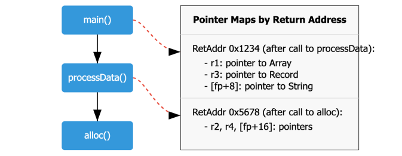
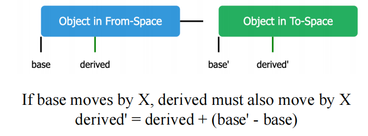

# 13 Garbage Collection 垃圾回收

参考资料：

- 姚培森老师2024~2025学年春夏ch13ppt
- [wcjj的笔记](https://shiseab.github.io/notebook/Compiler/ch13/)
- [伟大的Gemini 2.5 pro deep research](https://docs.google.com/document/d/1g4Tzsd6ufEodyKfs4oDSM8KGWovRvKkFFiSoRR_S7SA/edit?usp=sharing)

---

## 1 概述

一种自动内存管理机制，自动释放程序不再使用的存储空间。垃圾回收主要工作的区域是用于存储动态分配的对象的**堆(Heap)**。

包含两个阶段：  

1. **垃圾检测 (Garbage detection):** 找出哪些对象是存活的，哪些是死掉的。
2. **垃圾回收 (Garbage reclamation):** 回收死对象所占用的存储空间，使其可以被后续的内存分配请求重用 。

### 1.1 可达性近似

和活跃变量判断同理，一个内存单元是否不再被使用是**不可判定**的。

因此，我们需要做一个保守的近似，只回收真正的垃圾，核心思想是利用**可达性 (reachability)** 信息：如果一个在堆上分配的对象无法通过任何从程序变量（如寄存器中的值、栈上的局部变量和参数、全局变量）开始的指针链访问到，那么它就是不可达的，可以被认为是垃圾 。

即：**不可达 (unreachable) ⇒ 不活跃 (not live / no longer used)** 

### 1.2 基本数据结构

**1. 有向图 Directed Graph**


左图中一个大块（包含3个小块是一个record），也就是说`20`、`59`都是可达的。

**2. 空闲链表 Freelist**


用于管理堆中的空闲块：

- 空闲的内存块被组织成一个链表
- 当程序请求分配内存时，可以从空闲链表中取出一个合适的块
- 当GC回收了垃圾对象后，这些对象所占用的空间会被合并（如果可能）并添加回空闲链表中

除了空闲链表分配，还有**线性分配 (Linear allocation)** 等方式。在线性分配中，内存被视为一个大的连续区域，分配时只需简单地递增一个指向下一个可用地址的指针 (`next`)，直到达到区域的末尾 (`limit`) 。复制收集算法常采用这种高效的分配方式。

## 2 标记-清除收集 Mark-and-Sweep

### 2.1 算法流程


1. **标记阶段 (Mark Phase):**
      - 从根节点（程序变量）开始，遍历所有可达的对象
      - 对所有搜索到的（可达的）对象进行标记
      - 通常采用DFS或BFS来遍历对象图
          ```c++
          // 对每个根变量 v 调用 DFS(v)
          for each root v:
              DFS(v)
          
          function DFS(x):
              // 检查 x 是否是一个指向堆内记录的指针
              if x is a pointer into the heap:
                  // 检查该记录是否已被标记
                  if record x is not marked:
                      mark record x // 标记记录
                      // 递归地对记录 x 的每个指针字段 f_i 调用 DFS
                      for each field f_i of record x:
                          DFS(x.f_i)
          ```
        x的值是某record的地址，换句话说它指向该record
2. **清除阶段 (Sweep Phase):**
    - 线性扫描整个堆内存区域
    - 检查堆中的每一个对象：
        - 如果对象被标记了，说明它是可达的，取消其标记，为下一次GC做准备
        - 如果对象没有被标记，说明它是不可达的垃圾，将其占用的内存空间回收到空闲链表 (freelist) 中，以供后续分配使用
    - ```c++
      // 初始化 freelist 为空或者指向已有的空闲块
      freelist =...
      // p 从堆的起始地址开始扫描
      p = first address in heap
      while p < last address in heap:
          // 检查记录 p 是否被标记
          if record p is marked:
              unmark p // 取消标记，为下次GC准备
          else: // 记录 p 未被标记，是垃圾
              // 假设记录的第一个字段 f1 可以用来链接空闲链表
              let f1 be the first field in p
              p.f1 = freelist // 将当前垃圾块链入 freelist 的头部
              freelist = p
          // 移动 p到下一个记录的起始位置
          p = p + (size of record p)
      ```
当空闲链表为空，无法满足新的内存分配请求时，垃圾回收器会被再次触发 。  

### 2.2 成本分析


- 当内存非常满、垃圾很少时，GC效率低下
- 如果垃圾占比很高的情况下，均摊cost接近$c_2$
- 如果$\frac{R}{H} \gt 0.5$，建议扩大堆的大小，以降低未来GC的频率和分摊成本

### 2.3 显式栈 Explicit Stack


通过显式栈代替了函数递归调用的DFS

- 优势：栈空间是以word为单位分配的，而不是像递归调用那样为每个调用创建完整的活动记录，减少了DFS的辅助内存占用
- 缺陷：显式栈的大小在最坏情况下仍可能与堆的大小相当

### 2.4 指针反转 Pointer Reversal

**思想：**

称为**Deutsch-Schorr-Waite (DSW) 算法**，核心思想：遍历对象图时，不使用额外的显式栈，而是巧妙地利用被遍历对象自身的指针字段来存储返回路径（即父节点信息），从而实现回溯。

**算法：**

- 当DFS向下访问一个新的子记录时，它会：
    1. 标记该子记录
    2. 修改子记录中的一个（待访问的）指针字段，使其指向其父记录（即DFS路径上的前一个记录）
          - 这个被修改的字段相当于保存了栈帧中的返回地址
    3. 同时，需要保存该字段原始指向的子节点，以便后续访问

- 当DFS从一个记录回溯时，它会利用之前被修改的指针字段找到父记录，并恢复该字段原始的指针值。

回溯的示例（红色三角形处就是回溯）：


**伪代码：**


解释：

```c++
// 函数入口，x_root 是需要开始遍历的根节点指针
function DFS(x_root)
    // 1. 初始化检查：确保根节点是一个有效的指针，并且它所指向的记录还没有被标记过。
    //    这是为了防止重复遍历已经访问过的对象图部分。
    if x_root is a pointer and record x_root is not marked
        // --- 初始化遍历 ---
        t ← nil             // 初始化父节点指针 t 为空(nil)，因为根节点没有父节点。
        x ← x_root          // 将当前节点 x 设置为根节点。
        mark record x       // 标记当前节点 x，表示它已被访问。
        done[x] ← 0         // 初始化 x 的已处理字段计数器为0。
        // --- 主循环：持续遍历直到回溯到根节点之外 ---
        while true
            i ← done[x]     // 获取当前节点 x 已经处理过的字段数量。
            // --- A. 向下遍历 (Descend) ---
            // 检查当前节点 x 是否还有未处理的字段。
            if i < # of fields in record x
                y ← x.fi        // 获取 x 的第 i 个字段的内容，存入临时变量 y
                // 检查 y 是否是一个指向未标记子节点的有效指针。
                if y is a pointer and record y not marked
                    // *** 指针反转核心操作：向下移动 ***
                    // 准备从 x 移动到子节点 y。我们需要保存返回路径。
                    // 1. 将 x 的第 i 个字段（原本指向 y）修改为指向它的父节点 t。
                    //    这样，x 的这个字段就临时变成了存储返回信息的“栈”空间。
                    x.fi ← t
                    // 2. 更新父节点指针 t，使其指向当前的 x。
                    t ← x
                    // 3. 将当前节点 x 更新为子节点 y，准备开始处理这个新的子节点。
                    x ← y
                    // 对新成为当前节点的 x 进行初始化。
                    mark record x      // 标记这个新节点。
                    done[x] ← 0        // 初始化新节点的已处理字段计数器为0。
                else 
                    // 如果 y 不是一个有效的、未标记的子节点指针（可能是null，或指向已标记节点，或不是指针），
                    // 那么我们只需继续处理 x 的下一个字段。
                    done[x] ← i + 1
            // --- B. 回溯 (Ascend) ---
            // 如果当前节点 x 的所有字段都已处理完毕 (i >= # of fields)。
            else
                // *** 指针恢复核心操作：向上移动 ***
                // 1. y 临时保存当前节点 x 的指针，因为 x 即将成为“子节点”（相对于它的父节点而言）。
                y ← x
                // 2. 将当前节点 x 恢复为其父节点 t。
                x ← t
                // 检查是否已完成整个遍历。如果 x 变回了 nil，意味着我们已经从最初的根节点回溯完毕。
                if x = nil then return
                // 3. 获取父节点 x（即恢复后的x）中我们之前用来下降的那个字段的索引。
                //    这个索引值就保存在父节点的 done 计数器中。
                i ← done[x]
                // 4. 从父节点 x 的第 i 个字段中取出“祖父”节点的指针，存入 t。
                //    因为当初下降时，x.fi 被设置成了指向其父节点（即现在的t）。
                //    现在 x.fi 中存的就是“旧的t”，也就是祖父节点。
                t ← x.fi
                // 5. 恢复父节点 x 的第 i 个字段的原始指针，使其重新指向子节点 y。
                x.fi ← y
                // 6. 父节点 x 的第 i 个字段已经处理完毕，计数器加1，准备处理下一个字段。
                done[x] ← i + 1
```

### 2.5 内存碎片

- 外部碎片 (External fragmentation)：空闲内存不连续
    - 
- 内部碎片 (Internal fragmentation)：分配给一个对象的内存块大于对象实际需要的大小
    - 

标记-清除算法的一个主要缺点是它会导致**内存碎片 (memory fragmentation)** 

### 2.6 优缺点分析

**优点 (Pros)** :  

- **能够回收循环引用**
- **对象不移动** - 在回收过程中，存活的对象保持其原始内存地址不变
- **如果垃圾很少，效率较高**

**缺点 (Cons)** :  

- **如果垃圾很多，效率较低**
- **程序执行必须暂停**
- **导致堆碎片化**

## 3 引用计数 Reference Counting

### 3.1 算法

为堆中的每个对象维护一个**引用计数值 (reference count)**，该计数值表示当前有多少个指针指向该对象：

- 当一个指针被赋值为指向某个对象时，该对象的引用计数值加1
- 当一个指针不再指向某个对象时（例如，指针被赋为null，或指向其他对象，或指针本身被销毁），该对象（之前被指向的那个）的引用计数值减1
- 当一个对象的引用计数值变为0时，该对象就成为了垃圾，可以立即被回收（例如，将其空间添加到空闲链表中）

具体实现：

当执行指针赋值操作 `x.fi = p` 时，涉及的操作如下：

1. 新指向：`p` 所指向对象的引用计数增加
2. 旧指向：`x.fi` 原来指向的对象的引用计数减少
3. 回收检查：如果某个对象的引用计数降为0，则：
      - 该对象被放入空闲链表
      - 该对象内部引用的所有其他对象的引用计数也相应减少（这可能导致级联回收）

### 3.2 优缺点

- 优点
    - 增量式开销 - 对象的管理（计数更新和可能的回收）与程序执行交织在一起，垃圾回收的代价被平摊到程序的整个运行过程中
    - 即时回收 -  一旦对象的引用计数变为0，其内存可以立即被回收并加入空闲链表，供后续分配使用
    - 实现简单
- 问题
    - 无法回收循环引用 - 引用计数只跟踪指向对象的直接引用数量，而不是从根开始的可达性，所以循环引用的对象即使已经成为垃圾，它们的引用计数也不会变为0，因此永远不会被回收，造成内存泄漏：
    
    - 性能开销大 - 更新引用计数的操作本身会带来显著的性能开销 。每次指针赋值，例如 `x.fi = p`，都需要执行一系列操作，远不止一条简单的机器指令：
    ```c++
    // 原始赋值: x.fi = p
    // 引用计数下的等效操作:
    z = x.fi           // 保存 x.fi 原来指向的对象 (old_target)
    if z is not null:
        z.count = z.count - 1 // 递减 old_target 的引用计数
        if z.count == 0:
            putOnFreelist(z)  // 如果 old_target 计数为0，回收它（可能级联）
    
    x.fi = p             // 执行实际的指针赋值
    if p is not null:
        p.count = p.count + 1 // 递增 p 指向的对象 (new_target) 的引用计数
    ```
    这些操作涉及多次内存访问和计算，其总开销远大于一条简单的赋值指令，使得引用计数在高频率指针操作的场景下效率较低 。 
- 解决方法（仅了解）：
  

## 4 复制收集 Copying Collection

### 4.1 基本思想

复制收集算法将堆内存平均划分为两个大小相等的半空间 (semi-space) ：  

- **From-空间 (from-space):** 当前程序正在使用的内存区域。新对象的分配发生在这里。
- **To-空间 (to-space):** 保留区域，在GC发生之前保持未使用状态。

**基本算法流程** :  


1. 程序在From-空间中分配对象。
2. 当From-空间被填满，无法满足新的分配请求时，GC被触发。
3. GC从根节点开始，遍历所有可达的对象。
4. 所有在From-空间中找到的可达对象都被**复制**到To-空间中。复制过程中，对象会被紧凑地排列在To-空间的起始位置。
5. 在复制对象的同时，所有指向这些对象的指针（包括根指针和堆内指针）都需要被更新，以指向它们在To-空间中的新地址。
6. 一旦所有可达对象都被复制到To-空间，From-空间中剩余的所有对象（无论是否是垃圾，因为它们未被复制）都被认为是垃圾。整个From-空间可以被视为完全空闲。
7. 最后，**交换From-空间和To-空间的角色**。原来的To-空间（现在包含了所有存活对象）变成新的From-空间，程序将在这里继续分配。原来的From-空间（现在是完全空闲的）变成新的To-空间，等待下一次GC。

好处：

1. 分配快速
2. 无碎片

需要解决的问题：

1. 复制所有可达对象
2. 保持对象间所有正确的指针关系
3. 避免多次复制同一个对象

### 4.2 Cheney's Algorithm

基于BFS的遍历和复制对象图的算法。


机制：

- **To-空间区域划分:** 
    1. **已复制并已扫描 (Copied and scanned):** 这部分区域的对象已经被复制过来，并且它们内部的所有指针字段也已经被检查和更新完毕。
    2. **已复制 (Copied):** 这部分区域的对象已经被复制过来，但它们内部的指针字段尚未被处理。这部分区域实际上就是BFS的工作队列。
    3. **空 (Empty):** To-空间中尚未使用的部分，新复制的对象将被放到这里。
- **两个关键指针:**
    - `scan`: 指向“已复制”区域的开始，即下一个需要被扫描处理其内部指针的对象。
    - `next`: 指向“空”区域的开始，即下一个对象将被复制到的位置。
- **工作队列:** `scan` 和 `next` 指针之间的区域（即“已复制但未扫描”的区域）构成了BFS的工作队列。
- **算法终止条件:** 当 `scan` 指针追上 `next` 指针时，说明工作队列为空，所有可达对象都已被复制并扫描完毕，GC过程结束。

算法步骤：

1. **初始化:** `scan` 和 `next` 都指向To-空间的起始地址。
2. **处理根节点**
      - 遍历所有根节点。
      - 对于每个根指针 `r`，调用 `Forward(r)` 函数。`Forward(r)` 会将 `r` 指向的对象（如果它在From-空间且未被复制）复制到To-空间的 `next` 位置，更新 `next` 指针，并在原对象处留下转发指针。然后 `Forward(r)` 返回对象在To-空间的新地址。
      - 根指针 `r` 被更新为指向其在To-空间中的副本。
3. **主循环 (处理工作队列):**
      - `while scan < next`: (只要工作队列不为空)
          - 令当前处理对象为 `current_obj = record at scan`。
          - 遍历 `current_obj` 的每一个指针字段 `fi`。
          - 对每个指针字段 `current_obj.fi`，调用 `Forward(current_obj.fi)`，并将返回的新地址（在To-空间中）写回 `current_obj.fi`。
          - `scan = scan + size of record current_obj` (将`scan`指针移到下一个待扫描对象，即当前对象处理完毕)。
4. **结束:** 当 `scan == next` 时，GC完成。

概括理解就是copy是这个节点本身有无copy进去，scan是这个节点的子节点有无copy进去。

### 4.3 指针转发 Pointer Forwarding

是复制收集中一个关键的子过程，用于确保对象只被复制一次，并且所有旧的指针都能正确地更新到对象的新位置。

当一个对象从From-空间被复制到To-空间后，其在From-空间中的**原址的第一个字段会被覆盖，写入一个指向其在To-空间新位置的指针**。每次在From-空间遇到对象都会通过检查第一个字段来确定该对象是否在之前被复制过。


**Case 1: `p` 指向From-空间，且对象已被复制**

- `if p is a pointer to from-space then`
    - `if record p's first field (p.f1) points to to-space then` (检查是否存在转发指针)
        - `return p.f1` (返回转发指针，即对象在To-空间的新地址)

**Case 2: `p` 指向From-空间，但对象尚未被复制**

- `else` (p.f1不指向To-space，说明没有转发指针)
    - `new_address_in_to_space = next`
    - `copy record p to new_address_in_to_space`
    - `next = next + size of record p` (更新`next`指针)
    - `p.f1 = new_address_in_to_space` (在From-空间的原对象处设置转发指针)
    - `return new_address_in_to_space`

**Case 3: `p` 不指向From-空间 (即已指向To-空间，或者是null，或非堆指针)**

- `else`(p不指向from-space)
    - `return p` (直接返回原指针p，无需操作)

例子：


例子2：


### 4.4 优缺点

优点：

- 简单
- 运行时间与活对象数量成正比
- 自动整理，消除碎片

缺点：

- 浪费一半内存
- 需要精确的类型信息
- 局部性差：
    - Cheney算法采用BFS顺序复制对象。这可能导致在逻辑上相关的对象（如树的父子节点）在物理内存中相距较远，而物理上相邻的对象可能逻辑上不相关。
    - 良好的引用局部性对程序性能至关重要，因为它可以提高缓存命中率。
    - DFS通常能提供更好的局部性，但DFS实现复制收集需要更复杂的技术，如指针反转。
    - 有一个混合了深度优先和广度优先思想的`Chase`算法（不考），试图在一定程度上改善局部性，其基本思路是在复制一个对象时，尝试立即复制它的一个子节点，尽可能地进行深度优先探索，直到遇到已复制或null节点，再回退到广度优先扫描。

## 5 垃圾回收与编译器的接口 Interface to the Compiler

不考。

<!--和编译器的交互分为以下方面：

1. 将程序中的对象创建语句（如 `new Object()`）翻译成调用运行时分配例程的指令
2. 描述根节点的位置，让垃圾回收知道从哪里开始追踪可达对象
3. 描述堆上数据记录的布局，让垃圾回收知道每个对象的内部结构，特别是哪些字段是指针，哪些是普通数据，以及对象的大小
4. 生成实现读/写屏障的指令维护垃圾回收时的不变性

---

//todo 这一块还没仔细看，以下内容来自[wcjj](https://shiseab.github.io/notebook/Compiler/ch13/#fast-allocation)

### 5.1 快速分配机制

经验性的测量表明，程序中大约七分之一的指令可能是存储（store）指令，这意味着分配操作也可能非常频繁。

由于 Copying Collection 不产生碎片，内存分配可以非常高效。allocation space（即 to-space） 是一块连续空闲区域，`next`指针指向下一个可用内存的起始位置，`limit`指针指向该区域的末尾。

给大小为 N 的 record 分配流程：

1. Call the allocate function
2. Test *next + N < limit* ? (If the test fails, call GC)
3. Move *next* to *result*
4. Clear *M[next],* *M[next+1],* ..., *M[next + N - 1]* 将分配区域清0
5. next ← next + N ，更新 next
6. Return from the allocate function

A. Move result into some computationally useful place

B. Store useful values into the record

为了进一步降低分配开销，使用 inline expanding 消除 step1&6；将 step A与3结合起来；step B 可覆盖 step 4；step 2&5不可消除，但可以通过将 `next` 和 `limit` 指针保存在寄存器中，以减少指令数至 3条。

最终 内存分配指令数可只用 4 条。

### 5.2 描述数据布局：类型描述符

GC 需要能够处理不同数据类型的 records，也就是需要能够理解对象的内部结构。具体来说，需要知道：

- Different length: used when adding scan
- Field type: used by Forward （Only pointers need to be processed）

编译器通常会为程序中定义的每种对象类型生成 **Type Descriptors**。每个对象实例在内存中会包含一个指向其类型描述符的引用（通常在对象头中）。

- 面向对象语言中，对象通常已经拥有指向其类对象的指针，该类对象可以充当或包含类型描述符，因此可能没有额外开销。
- Statically typed language 中，如果原生不支持此类元数据，则可能需要为每个对象增加 one-word 的开销来存储 Type Descriptors 指针


### 5.3 描述根节点：指针映射表

由于 GC 需要从 roots 开始，所以 GC 必须准确识别所有 root，才能追踪到所有存活对象。roots 可以是：

- Registers
- Local variables in stack frames
- Temporary variables
- Global variables

中存储的指针，指向 heap。

利用 Pointer Map 识别指针：编译时识别出哪个 temp 是 pointer、Stack slot 中是否有指针、寄存器分配时指针属性也会传递给 register，由此构造 map。

但是由于 Live temporaries change at every program point，为每一条指令生成一个 map 又不现实，所以选择在 specific program points where garbage collection can occur 时生成 pointer map：

- When allocation: inserting before alloc_record
- Any function call (which might indirectly call alloc_record)

接下来介绍查找 root 的算法：

1. Start at the top-most stack frame and current PC
2. Look up return address in pointer map
3. Mark(mark-and-sweep)/forward(copy collection) pointers in current frame using the map
4. Move to caller's frame
5. Repeat until all frames are processed



callee-save regs 需要特殊处理 ： 当函数`g()`调用函数`h()`，而`h()`内部触发了GC时，`h()`可能已经将其自身使用的一些被调用者保存寄存器（其原始值属于`g()`或更早的调用者）保存到了自己的栈帧中。`h()`本身可能不知道这些保存的寄存器值哪些是指针。

所以，函数的 Pointer Maps 还需要含关于它在调用其他函数时，哪些 callee-save regs 中仍然持有从其调用者（caller）传来的、且仍然活跃的指针的信息。这些信息需要沿着调用链传播。例如，如果`f()` 调用 `g()`，`g()`将一个指针存入被调用者保存寄存器 `r_callee_save`，然后`g()`调用`h()`。在`g()`调用`h()`的那个点的指针映射中，必须指明`r_callee_save`包含一个指针。这样，如果`h()`（或`h()`调用的任何函数）触发GC，GC在扫描`g()`的栈帧（或处理`h()`保存的`r_callee_save`副本）时，就能知道`r_callee_save`的内容需要作为根来处理

### 5.4 派生指针及其处理

Derived Pointers 指那些不直接指向堆对象起始地址，而是指向 middle, start, end of object 的指针。


在 Copying Collection 中，**when** base pointers are updated to point to new locations, derived pointers need different adjustment logic. 如果 GC 不知道这些派生关系，或者不知道如何计算这个调整，就会导致 derived pointers 失效



例：


从活跃性分析的角度看，一旦a的值被用于计算t1，后续没有对a的其他引用，a似乎就"死亡"了，然而，对于GC来说，必须保持a存活，因为t1是从a派生的，在GC过程中需要知道a的新地址来正确更新t1。

Solution：

- **Pointer map** ：for each derived pointer, specify which base pointer it's derived from
- **Liveness** ：a derived pointer implicitly keeps its base pointer live!
-->