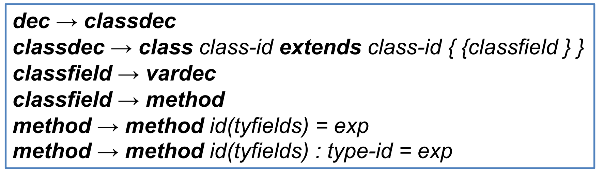
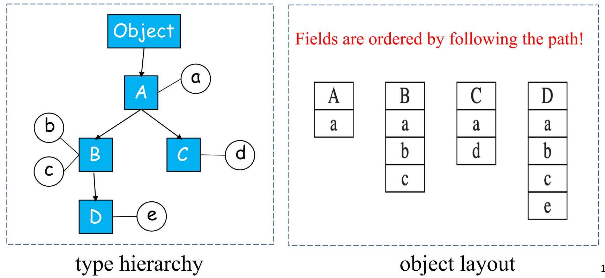
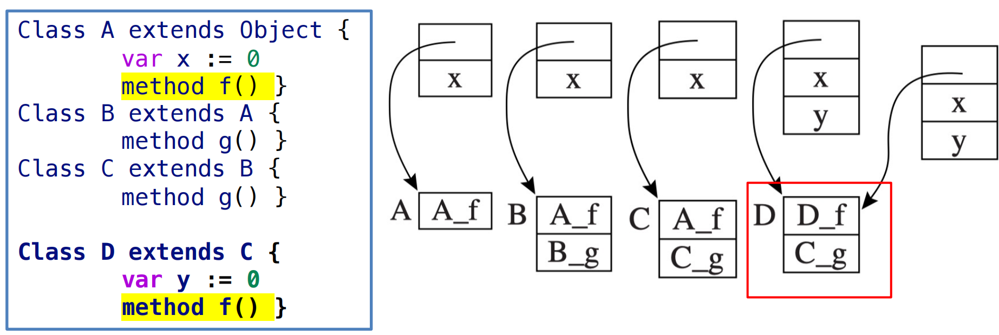
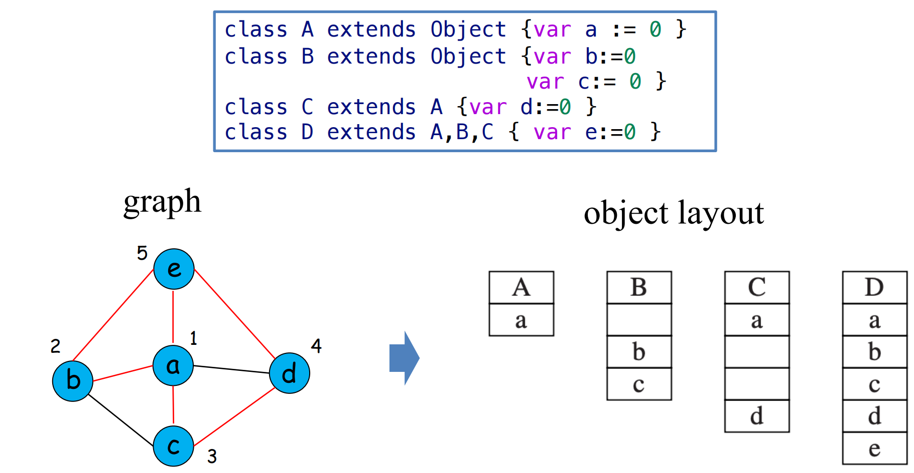

# 14 Object-oriented Languages 面向对象语言

参考资料：

- 姚培森老师2024~2025学年春夏ch14ppt
- [wcjj的笔记](https://shiseab.github.io/notebook/Compiler/ch14/)
- [伟大的Gemini 2.5 pro deep research](https://docs.google.com/document/d/1xtqZjHHMwXQUIb8Sx_nhK0BNRRddvAoJUTsmXfAKq6k/edit?usp=sharing)

---

## 1 类的实现 Classes

我们的讨论基于tiger的拓展语言object-tiger，其语法拓展规则：



方法声明类似于函数声明，可以指定参数 (`tyfields`)、方法体 (`exp`) 以及可选的返回类型 (`type-id`)

### 1.1 类声明

- `class B extends A {... }`定义了一个名为`B`的新类，它继承自类`A`
- 类`A`中定义的所有字段和方法都隐式地属于类`B`
- 在类`B`中，可以**重写 (override)** 从 A 继承来的方法，但通常不允许重写字段，当重写方法时，参数类型和返回类型必须与被重写方法保持一致
- 系统中通常预定义一个名为 Object 的基类，它没有任何字段或方法，作为类层次结构的根

### 1.2 方法和self参数


- 类`B`中的每个方法都有一个**隐式的形式参数**，在这里称为`self`，其类型为`B`
- `self`并不是一个关键字，而是编译器为每个方法自动添加的第一个参数。在运行时，当通过一个对象调用其方法时，`self`参数会自动绑定到该对象实例
- 以上图为例，当调用`self.move(10)`时，实际上是调用当前`Car`对象的`move`方法。当外部代码执行`c.move(60)`时，编译器会将其转换为类似`move(c, 60)`的形式，其中`c`作为隐式的`self`参数传递给`move`方法。这个隐式的`self`参数使得方法能够访问和操作其所属对象的字段。

### 1.3 对象创建和方法调用

- `exp → new class-id`: 创建一个指定类`class-id`的新对象
- `exp → lvalue.id`: 访问对象字段
    - 例如，`b.x`表示对象`b`的字段`x`
- `exp → lvalue.id()`: 调用无参方法
- `exp → lvalue.id(exp{, exp}*)`: 调用带参数的方法

在方法调用`b.f(x,y)`中，对象`b`会自动绑定到方法`f`的隐式`self`参数，编译器需要将这些高级的面向对象操作转换为底层的内存访问和函数调用指令。例如：

- `new B`需要翻译成内存分配和初始化的代码；
- `b.x`需要根据`x`字段在对象`b`内存布局中的偏移量来生成访存指令；
- `b.f(x,y)`则涉及到查找方法`f`的实际代码地址并执行调用。

### 1.4 类层次结构

- 程序中所有类之间的继承关系构成了一个**类层次结构 (class hierarchy)**
    - 单继承语言中表现为一棵树 - 每个节点**最多只能有一个父节点**
    - 多继承语言中表现为一个有向无环图 - 每个节点可以有**零个、一个或多个父节点**

### 1.5 关键问题

- 字段布局 (Field layout)
- 方法分派 (Method dispatch)
- 成员关系测试 (Membership test)

## 2 单继承 Single Inheritance

### 2.1 字段继承与布局

采用前缀法(prefixing)

当类`B`继承自类`A`时：

- 从类`A`继承而来的字段会被放置在`B`类对象内存布局的**起始部分**，并且保持它们在`A`类中定义的顺序
- 类`B`自己新定义的字段则接续排列在继承字段之后
- 字段的排列顺序是沿着从根 (Object) 到当前类的路径依次添加的

例子：



### 2.2 方法继承与分派(dispatch)

**方法代码生成**

- 每个类的方法都会被编译成一段机器码，这段代码位于内存中的某个特定地址
- 在语义分析阶段，每个变量的环境条目中通常会包含一个指向其所属类的描述符的指针
- 每个类描述符 (class descriptor) 则包含了指向其父类描述符的指针以及一个方法实例列表。每个方法实例都关联一个机器码标签（即其代码的入口地址）

**方法分派**

当程序执行到一个方法调用点时（例如`object.method()`），编译器（或运行时系统）需要确定究竟应该跳转到哪个具体的代码地址去执行，这个过程称为方法分派。

分派的策略取决于方法是静态的还是动态的。

#### 2.2.1 静态方法分派

调用的目标地址在**编译时**就可以确定。当调用一个静态方法`c.f()`时，执行的代码取决于变量`c`的**声明类型 (declared type)**，而不是`c`在运行时实际指向的对象的类型。

编译 `c.f()`（其中 `c` 的声明类型是类 `C`）的步骤如下：

1. 在类 `C` 的描述符中查找方法 `f`
2. 如果在 `C` 中未找到，则查找 `C` 的父类的描述符
3. 沿着继承链向上持续查找，直到在某个祖先类 `A` 中找到方法 `f`
4. 编译器随后生成一个直接的函数调用，跳转到标签 `A_f`（即类 `A` 中方法 `f` 的实现代码）

例子：

```c++
class Animal extends Object {
  method makeSound() = print("Generic animal sound")
  static method describeSpecies() = print("Animal species")
}

class Dog extends Animal {
  method makeSound() = print("Woof!")
  static method describeSpecies() = print("Canis familiaris")
}

//...
var a: Animal := new Dog
a.describeSpecies()

```

在这个例子中，虽然变量 `a` 在运行时指向一个 `Dog` 对象，但由于 `a.describeSpecies()` 调用的是静态方法，并且 `a` 的声明类型是 `Animal`，编译器会：

1. 看到变量 `a` 的声明类型是 `Animal`。
2. 静态方法解析会在 `Animal` 类中查找 `describeSpecies` 方法。
3. 调用被编译为直接跳转到 `Animal_describeSpecies` 的代码。 因此，即使 `a` 指向 `Dog` 对象，执行的仍然是 `Animal` 类版本的静态方法 `describeSpecies`。

#### 2.2.2 动态方法分派

调用行为取决于对象在**运行时**的实际类型。

考虑类层次结构：`A` -> `B` -> `C` -> `D`。如果 `A` 中定义了一个动态方法 `f()`，而 `D` 中重写了 `f()`。当通过一个类型为 `A` 的引用（但实际指向 `D` 的对象）调用 `f()` 时，应该执行 `D` 中版本的 `f()`。

通常采用**虚函数表 (virtual table, vtable)**或称为**分派向量 (dispatch vector)**的机制：

- **虚函数表结构:** 每个拥有动态方法的类，其类描述符中都会包含一个虚函数表。这个表是一个函数指针数组，表中的每一项对应一个动态方法的名称，并指向该类针对此方法的具体实现代码地址。
- **继承与重写对虚函数表的影响:**
    - 当类 `B` 继承自类 `A` 时，`B` 的虚函数表会首先包含 `A` 中所有动态方法的条目。这些条目初始时指向 `A` 中对应方法的实现。如果 `B` **重写**了某个继承自 `A` 的方法（例如 `f`），那么 `B` 的虚函数表中对应 `f` 的条目就会被更新，指向 `B` 自己实现的 `f_B` 版本。
    - 如果 `B` 定义了**新的**动态方法（例如 `g`），这些新方法的条目会附加在继承的方法条目之后。

例子：



**动态方法调用过程:** 当执行一个动态方法调用 `c.f()` 时，其中 `f` 是动态方法，编译后的代码会执行以下步骤：

1. **获取类描述符指针:** 从对象 `c` 的固定偏移量处（通常是对象内存的起始位置，即虚函数表指针 `vptr`）获取指向其类描述符 `d` 的指针。
2. **获取方法实现地址:** 从类描述符 `d` 的虚函数表中，根据方法 `f` 的（编译时已知的）固定偏移量，获取指向具体方法实现代码的指针 `p`。
3. **调用方法:** 跳转到地址 `p` 执行代码，并保存返回地址。

## 3 多继承 Multiple Inheritance - Graph Coloring

在多继承问题中，我们不能简单地把每个父类的所有字段都放在对象布局的开头，因为它们会相互冲突。我们使用图着色法解决字段布局问题。

- **图的构建:**
    - 图中的每个**节点 (node)** 代表一个唯一的字段名（例如，`a`, `b`, `c`, `d`, `e`）
    - 如果两个不同的字段在程序中的某个类里**同时存在**（即它们属于同一个类的实例，或者通过继承关系共同存在于一个子类实例中），则在这两个字段对应的节点之间添加一条**边 (edge)**。这条边表示这两个字段是相互“冲突”或“干扰”的，它们不能被分配到对象内存布局中的同一个偏移位置
- **着色:**
    - 图的**颜色 (colors)** 代表字段在对象内存布局中的**偏移量 (offsets)**，例如 0, 1, 2,...
    - 图着色的目标是为每个节点分配一个颜色（偏移量），使得任意两个通过边直接相连的节点都具有不同的颜色

**图着色步骤：**

1. **构造冲突图 (Interference Graph Construction) :**
      - 遍历程序中所有的类定义
      - 对于每个类，找出其拥有的所有字段（包括继承的和自身定义的）
      - 对于该类中的任意一对不同的字段，在冲突图的对应节点之间添加一条边
2. **着色 (Coloring) :**
      - 为冲突图的每个节点分配一个颜色（偏移量），要求相邻节点颜色不同
      - 在字段布局中，颜色直接对应内存偏移量
3. **确定布局 (Determining Layout) :** 根据着色结果，确定每个类中各个字段的实际偏移量

例子：



**局限性：空间浪费 (Wasted Space)**

从布局示例可以看出，为了保证全局偏移量的一致性：

- 类 B 的对象实例中，偏移量1是未使用的空槽
- 类 C 的对象实例中，偏移量2, 3 是未使用的空槽
