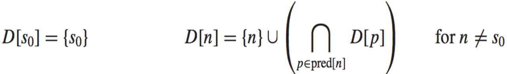

# 18 Loop Optimizations 循环优化

参考资料：

- 姚培森老师2024~2025学年春夏ch18ppt
- [wcjj的笔记](https://shiseab.github.io/notebook/Compiler/ch18/)
- [伟大的Gemini 2.5 pro deep research](https://docs.google.com/document/d/1mDtN2WMq79dWwMHOOsm14RHWq8bWzZE0ipS5a5ekl8A/edit?usp=sharing)

---

一个程序90%的执行时间，往往消耗在仅仅10%的代码上，而这关键的10%代码，绝大多数情况下都潜藏在程序的循环结构中，因此对循环进行优化是提升程序性能最关键、最有效的手段。

本章节我们关注两个问题：

1. 如何精确地识别循环？
2. 如何执行最基础且最有效的优化？- Loop Invariant Hoisting

## 1 Loops and Dominators 循环与支配

建立在CFG之上。

### 1.1 Loops定义

对循环严格的定义的核心思想是确保循环有一个唯一的入口。

一个控制流图中的循环是满足以下三个条件的结点集合$S$，其中包含一个特殊的“首结点”（header）$h$：

1. 从$S$中的任何一个结点出发，都存在一条路径能够回到首结点$h$；
2. 从首结点$h$出发，存在一条路径能够到达$S$中的任何一个结点；
3. **（核心）**除了通往首结点$h$的边之外，不存在任何从$S$外部结点指向$S$内部结点的边 - **首结点是进入该循环的唯一入口**。

如果我们遍历每一个节点都做不成$h$，那这个节点集合就不是Loop。

**结构化控制流（Structured control-flow）**：结构化的控制流只会产生**可规约图**，许多编译分析和循环优化技术都依赖于图是可规约的这一特性：

- 可规约图 (Reducible Graphs)：图中的所有圈（cycles）都符合上述对Loop的定义
    - 大多数高级语言产生的是可规约图，例如Java只会产生可规约图
- 不可规约图 (Irreducible Graphs)：图中包含一些不符合上述对Loop定义的圈
    - 它们可以由非结构化的控制流产生，例如使用了`goto`语句的C/C++程序就可能产生不可规约图

### 1.2 寻找循环

#### 1.2.1 支配节点

**定义**：

一个结点`d`**支配**（dominates）另一个结点`n`，当且仅当从程序的入口结点到结点`n`的**每一条**可能的执行路径都必须经过`d`。

- 每个结点都支配它自身

**算法**：

找出所有结点的支配者集合的算法。

数据流方程如下：



`D[n]`表示支配结点`n`的结点集合，`pred[n]`表示`n`的所有前驱结点集合。

执行流程：将入口结点`s0`的支配集设为`{s0}`。对于所有其他结点`n`，将其支配集`D[n]`初始化为一个包含所有结点的全集。反复遍历所有结点（除入口外），根据上述方程更新它们的支配集。每次更新都是取其所有前驱结点支配集的交集，再加上结点自身。直到到达不动点。

**例子**：


**直接支配节点与支配树**：

- 在结点`n`的所有支配者中，存在一个“最接近”`n`的支配者，我们称之为`n`的**直接支配结点（Immediate Dominator, idom）**
    - 除了入口结点，每个结点都有且仅有一个直接支配结点
- 这种唯一的父子关系，使得我们可以将整个程序的支配关系组织成一棵**支配树（Dominator Tree）**
    - 每个结点的父结点就是它的直接支配结点，而它的所有祖先结点就是它的所有支配者
- 在这棵树上，将判断`d`是否支配`n`，简化成了树上祖先查询问题
- 例子：
    

#### 1.2.2 循环

**回边（Back Edge）**：一条从结点`n`指向结点`h`的边被称为回边，当且仅当`h`支配`n`（即`h dom n`）

每一个回边`n -> h`都唯一地定义了一个**自然循环（Natural Loop）**，这个自然循环由两部分组成：

1. 循环的首结点`h`
2. 所有能够到达`n`，并且路径上不经过`h`的结点集合

**算法**：

1. 计算控制流图的支配关系
2. 找出所有的回边`n -> h`
3. 对于每一个回边，从`n`开始，在**反向**的控制流图上进行遍历（但不能越过`h`），所有能被遍历到的结点，再加上`h`本身，就构成了这个回边所对应的自然循环

**循环嵌套树**：

- 一个首结点可能对应多个自然循环（如果有多条回边指向它），在这种情况下，编译器通常会将它们合并成一个更大的循环进行分析。
- 当一个自然循环的所有结点被完全包含在另一个自然循环内，且它们的的首结点不同时，我们就称之为**嵌套循环（Nested Loop）**。
    - 不包含任何其他循环的循环被称为**最内层循环（Innermost Loops）**，它们通常是优化的首要目标，因为它们的执行频率最高。
    - 为了获得程序循环结构的全貌，编译器会构建一棵**循环嵌套树（Loop-Nest Tree）** 。这棵树的结点代表程序中的各个循环，父子关系表示循环的嵌套。树的根可以看作是整个函数体，而树的叶子结点则对应着最内层循环。这个宏观视图可以指导编译器按照从内到外的顺序，系统地进行循环优化。


构建算法：

1. 构建支配结点树
2. 通过分析图中的后向边来识别所有的自然循环，自然循环的入口点被称为循环首结点
3. 为每个首结点合并自然循环
    - 一个首结点`h`可能有多条后向边指向它，从而形成多个自然循环,这一步要求将所有以同一个`h`为首结点的自然循环合并成一个大的循环，记为`loop[h]`
4. 构建循环首结点的树
    - 如果首结点 `h2` 所在的循环完整地处在首结点 `h1` 的循环（即 `loop[h1]`）内部，那么在嵌套树中，`h1` 就在 `h2` 的上方（即 `h1` 是 `h2` 的父节点） 

### 1.3 Loop Preheader


为循环创建一个**前置首结点（Loop Preheader）** ：

- 这是一个专门为优化而创建的新基本块，它的唯一后继是原循环的首结点。
- 所有原来指向循环首结点的边，现在都重定向到这个前置首结点。
- 这样一来，无论循环有多少个入口路径，编译器都有了一个唯一的、干净的“准备区”来插入优化代码，极大地简化了后续的变换操作。

## 2 Loop Invariant Hoisting 循环不变式上提

核心思想：将那些在每次循环中都计算出相同结果的“不变”代码，从循环体内移动到循环体外，只计算一次。

### 2.1 Loop Invariant 循环不变式

指的是一个在循环中结果始终不变的表达式。

一个形如`x := v1 op v2`的赋值语句是循环不变的，当且仅当它的所有操作数（`v1`, `v2`）满足以下条件之一：

1. 操作数是常量
2. 所有能到达该语句的操作数定义都来自于循环的外部
3. 循环内部只有一个定义能到达该操作数，且该定义本身也是一个循环不变式

这个定义是递归的，因此我们要通过迭代不动点的方式找出所有不变式。

例子：

```c
L1: i := i + 1
    b := 7
    t := a + b
    *i := t
    if i < N goto L1
```

- `i := i + 1`：不是不变式，因为`i`在每次迭代中都会改变
- `b := 7`：是**不变式**，因为操作数`7`是一个常量
- `t := a + b`：假设`a`的定义在循环外，而`b`刚刚被我们确定为不变式，因此，`t := a + b`也是**不变式**
- `*i := t`：不是不变式，因为地址`i`在每次迭代中都在变化

### 2.2 不变式上提条件

1. **支配条件 (Dominance Condition)**：包含不变式赋值语句`d: t <- expr`的基本块，必须支配所有在循环外**使用**变量`t`的循环出口
   - 防止在某些执行路径上引入不必要的计算和错误的最终结果
2. **唯一性条件 (Uniqueness Condition)**：在循环中，被赋值的变量`t`只能有这**唯一**一个定义
3. **前置首结点条件 (Pre-header Condition)**：被赋值的变量`t`在循环的**前置首结点**处不能是**活跃的（live-out）**
    - 否则会在`t`的旧值被使用之前，过早地将其覆盖，导致第一次迭代出错

例子：


