# 2 Lexical Analysis 词法分析

## 2.0 总览

词法分析的任务：

1. 以字符流输入
2. 识别token并以token流输出
3. 删除程序中不必要的东西（例如空白、注释等）

例子：

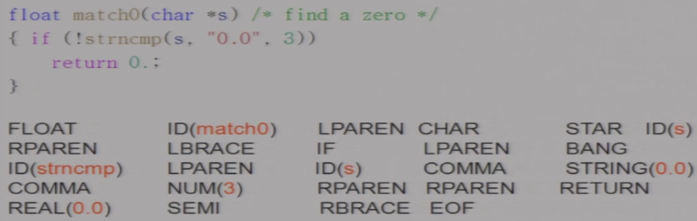

开发者自己命名的会附带语义值例如`s`、`3`；

## 2.1 Lexical Token词法单词

- a lexical token由一序列的字符组成，是语法的基本单元
- 语义值可以是无限的，但是单词的类型一定是有限的
- reserved words - 不能被用作identifier类型token语义值的words
- non-tokens - 例如宏定义、include、注释等等

### 2.1.1 词法分析器的生成

首先我们考虑最朴素的词法分析规则（语言描述）：

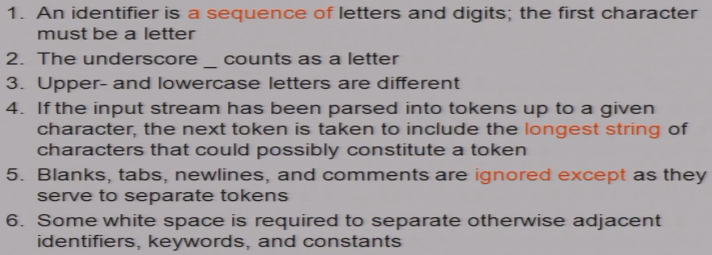

更精确的、机器友好的表述方式：正则表达式；实现方式：确定性有限自动机

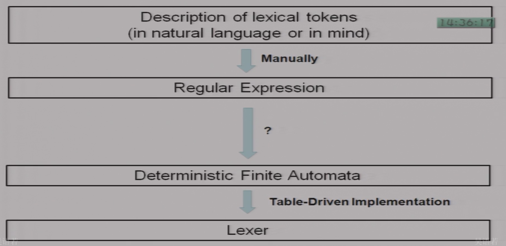

而我们所要讨论的就是REX转DFA的过程

## 2.2 Regular Expression正则表达式

### 2.2.1 正则表达式定义

同计算理论。见[REX笔记](https://tsuki0512.github.io/2024_fall/%E8%AE%A1%E7%AE%97%E7%90%86%E8%AE%BA/Lec2/)

一些简写（不扩展表达能力）：

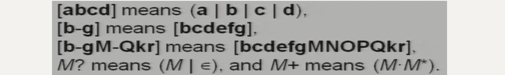

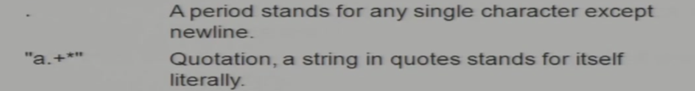

### 2.2.2 正则表达式在词法分析中的应用

使用正则表达式完成词法分析的例子：

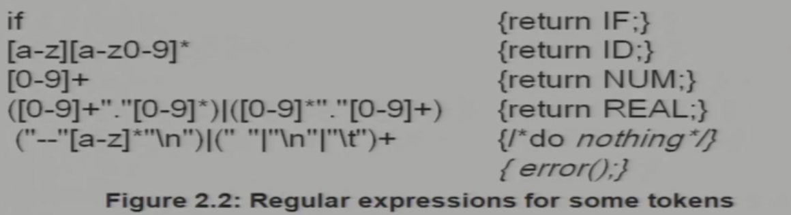

注：error表示上述没有一个匹配上了的（是必须的）

### 2.2.3 歧义处理

bit ambiguous - 一个字符流可以匹配多个正则表达式，例如`if8`

处理方法：

1. longest match
2. rule priority - 根据规则和规则之间的优先级关系，越前面越高

## 2.3 FA

DFA是生成正则表达式匹配程序的程序实现（很难直接自动生成REX的匹配程序）

### 2.3.1 DFA的程序实现（DFA转Lexer）

通过一个二维数组判断状态转换（state `0`是判定为不接收的状态），一个一维`finality`数组实现终止状态类型判断：

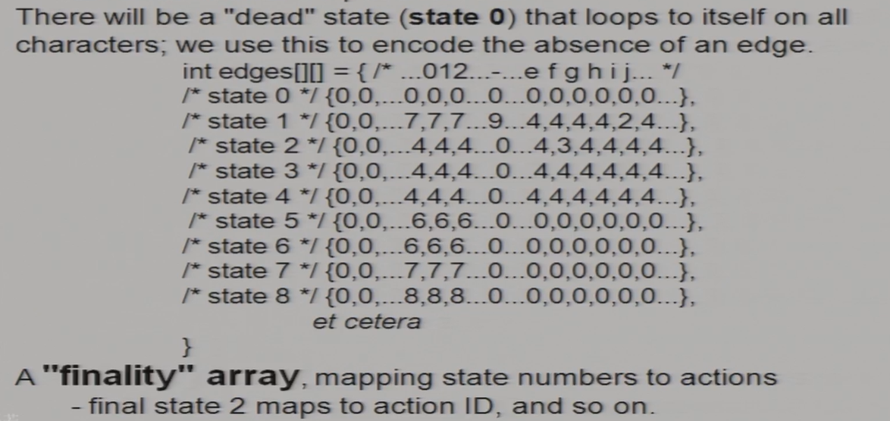

不过不同token类型的有限自动机是分开的：

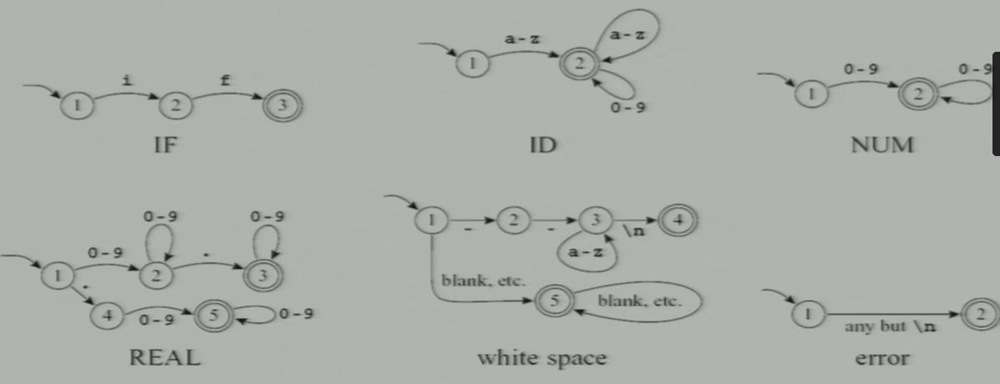

我们需要把输入跑在一个FA上，要将这些自动机**组合**：

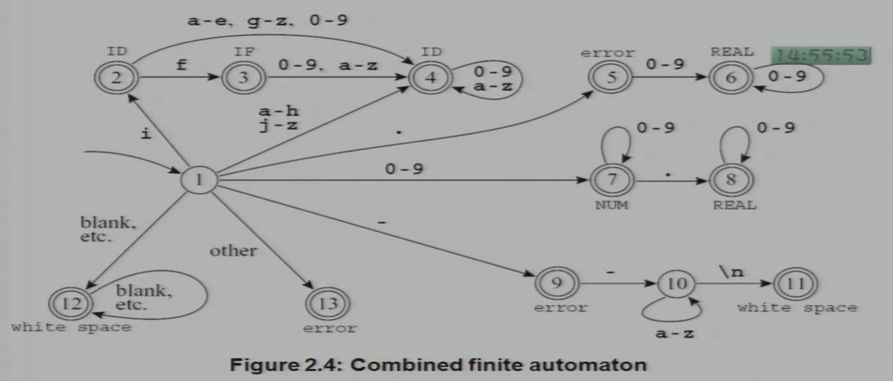

然后将终止状态标记上对应的token类别

**如何实现最长匹配？**

一边走一边记已经经过的final状态以及最后一个final状态是什么，对应的类型是什么，直到走到了`0`状态。

例子（自动机就是figure2.4的自动机）：

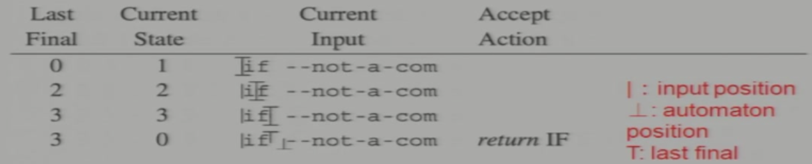

我们通过last final序列实现最长匹配。

### 2.3.2 REX转DFA

通过NFA（定义见[笔记](https://tsuki0512.github.io/2024_fall/%E8%AE%A1%E7%AE%97%E7%90%86%E8%AE%BA/Lec1/#nfa)）。

#### 2.3.2.1 REX转NFA

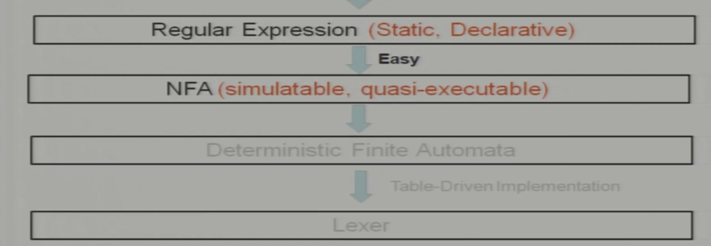

基本思路是把REX里面的基本元素和操作对应到NFA里面的每个部分：

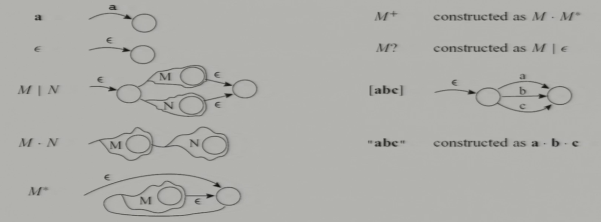

各token类别NFA组合方式：

- 新建一个起始状态分别指向各个token类别NFA的起始状态，转换条件为$\epsilon$
- 合并所有规则

例子：

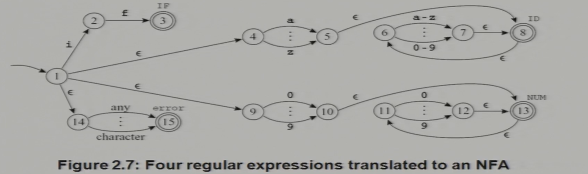

#### 2.3.2.2 NFA转DFA

见[笔记](https://tsuki0512.github.io/2024_fall/%E8%AE%A1%E7%AE%97%E7%90%86%E8%AE%BA/Lec1/#dfanfa)。

算法实现与例子：

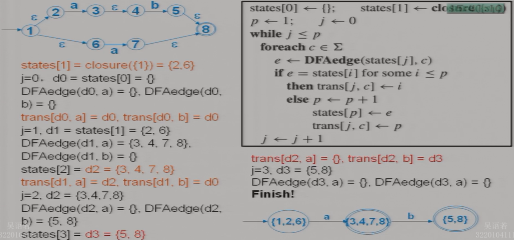

- 为了避免状态指数爆炸的问题，我们只有在访问到对应的状态的时候才将其添加入`state[]`数组内。
- 在终止状态的判断中，我们采用优先级规则，如果同时包括了两个token类别的终止状态，判定为优先级更高的token类别的终止状态。
- DFA构建出来后，`state`可以舍弃，`trans`需要保留。

#### 2.3.2.3 DFA简化

把等价状态（能够接收和拒绝同样的字符串的两个/多个状态）简化为一个状态。

简化方式：把其中一个状态$s_2$的入边指向另一个状态$s_1$，删掉$s_2$。

**如何找等价状态**（充分条件）？

- 首先，要么都是终止状态。要么都是非终止状态；
- 其次，如果for any symbol c, `trans[s1, c] == trans[s2, c]`，那么`s1`和`s2`等价。

充分必要的算法已经实现，在这里没有展开。

## 2.4 Lex: 一个词法分析器的生成器

基于REX生成C程序完成词法分析。

输入：

- REX
- action：每当匹配到指定类型的token，完成什么行为，例如`count++`

输出：

- C语言实现的词法分析器

例子：

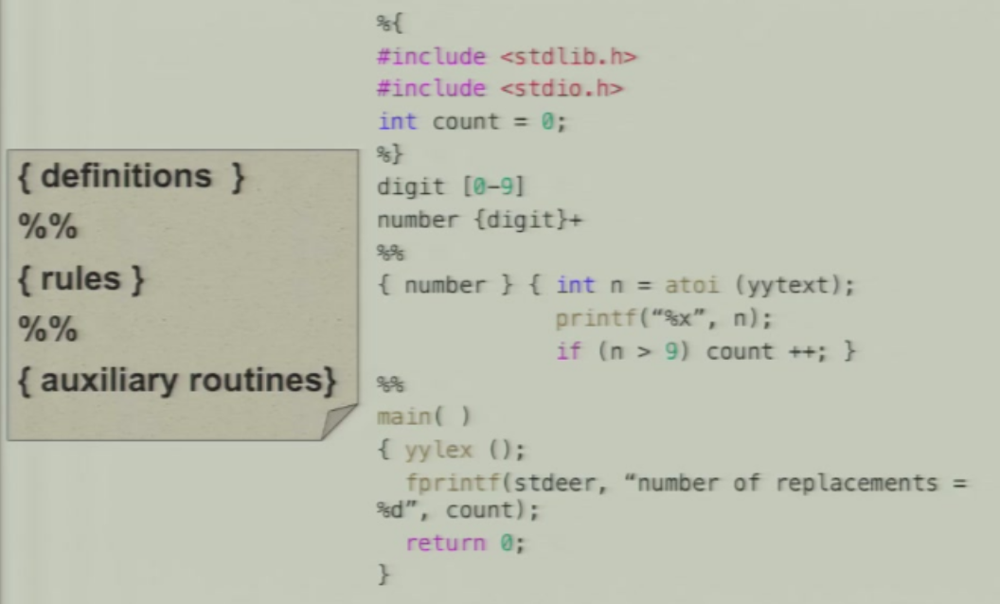
