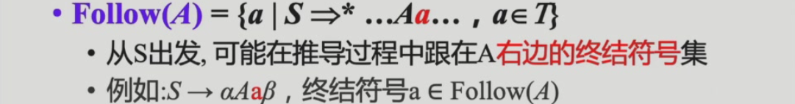

# 3 Parsing语法分析

## 3.1 语法分析概述

语法分析的任务就是分析由词法分析后生成的token序列是否符合语法，如果符合，则生成语法树（通常是**抽象语法树AST**）

### 3.1.1 上下文无关文法

#### 3.1.1.1 CFG

定义可以看[这里](https://note.tonycrane.cc/cs/tcs/toc/topic2/)。

在实际代码中EOF的处理：

- `$` 作为输入的结束符号，表示输入流已经结束。

- 为了明确 `$` 必须在完整的 `S` 短语之后出现，定义了一个新的起始符号 `S'` 并引入产生式 `S' → S$`。
- 该文法用于解析数学表达式，确保优先级正确：
    - 乘除 (`*`、`/`) 优先级高于加减 (`+`、`-`)，因为 `T` 层次低于 `E`。
    - 括号 `(E)` 可用于改变计算顺序。
- `S -> E$` 确保解析完整表达式后，输入流必须结束 (`$`)。

*一个有意思的东西（不考，我似懂非懂的）：*

#### 3.1.1.2 推导和归约

**最左推导**：每步代换最左边的非终结符

*相对应的最右规约是自底向上的优先把最右边终结符变成非终结符的过程*

**最右推导**：每步代换最右边的非终结符

推导是生成语言的角度；归约是识别语言的角度。

#### 3.1.1.3 CFG的Parse Tree

推导过程的图形化表示。

对编译器来说，CFG的搜索$O(N^3)$已经很复杂了，我们利用CFG的子集去简化复杂度（降为线性）。

### 3.1.2 设计编程语言的文法

消除二义性：“给定CFG是否无二义性”是不可判定问题

常用技术为**分层**：

不存在通用算法，但是有很多经验解决这个问题。

---

## 3.2 递归下降分析

### 3.2.1 概述

语法分析的方法分两类：

- 自顶向下Top-down：从分析树根部开始，尝试推导(derive)出输入串

   - 非终结符的替换：不确定性会带来算法复杂度问题，因此规定每次都替换最左边的非终结符

   - 产生式的选择：按顺序选择，如果过程中检测到不正确，可能需要**回溯**，但是回溯的代价太高了，类似于NFA，我们想找到类似DFA的文法

      - 回溯举例：

         

- 自底向上Bottom-up：从分析树叶子开始，尝试归约(reduce)到文法的开始符号S

### 3.2.2 LL(1)和预测分析法

#### 3.2.2.1 LL(1)文法

- L：从左到右扫描
- L：最左推导
- k：向前看k个token来确定产生式（通常k=1）
    - 每次为最左边的非终结符号选择产生式时，向前看1个输入符号，预测要用的产生式

#### 3.2.2.2 First集和Follow集

##### 3.2.2.2.1 定义

**First集**

**Follow集**

**Nullable**

定义：X is Nullable **iff** X 可以derive一个空串 **iff**：

- Base case：$x \to \epsilon$
- Inductive case：$X \to Y_1...Y_n$，if $Y_1...Y_n$是n个非终结符且都可以生成空串

##### 3.2.2.2.2 算法

1. nullable（根据递归生成过程寻找Nullable集）：
   
   nullable集合只增不减，全集有限，所以算法收敛（下面两个算法也同理，算法结束条件都是各集合不能再增长）。
2. first：
   
3. follow：
   
4. follow集一些简化的结论：
   
5. 例子：
   
   // follow todo
6. 虎书中的优化算法（三个集合同时计算且加速收敛）：
   

#### 3.2.2.3 LL(1)文法定义

//todo

### 3.2.3 文法改造

### 3.2.4 错误恢复
