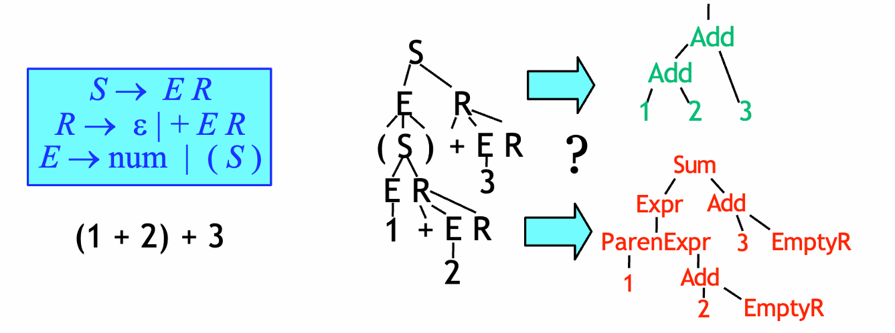
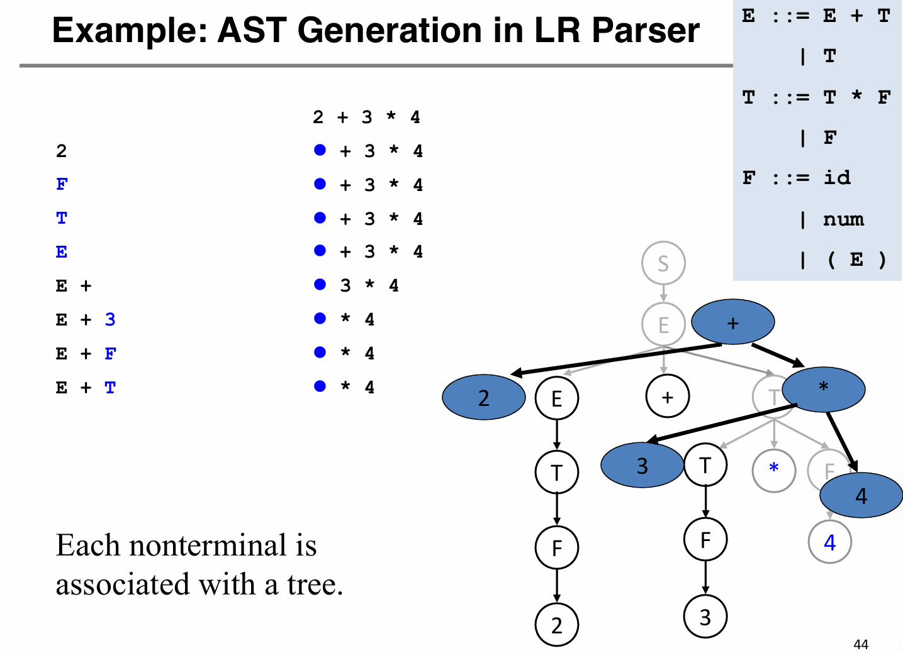
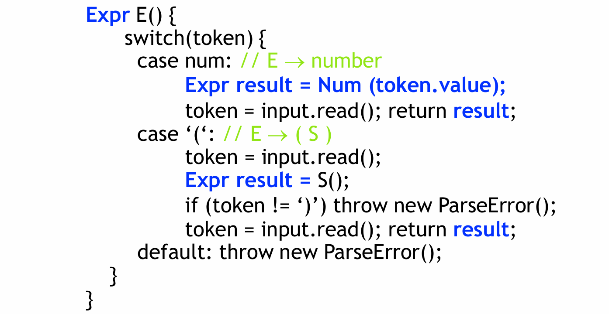
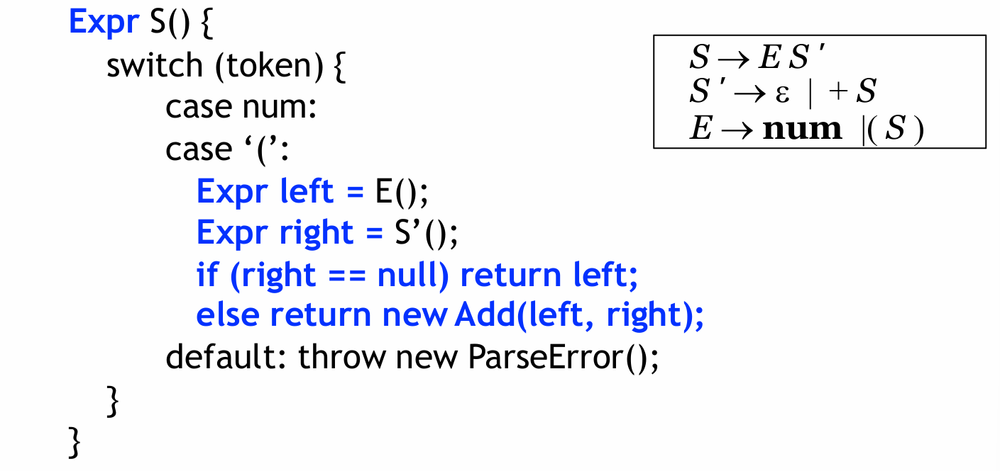

# 4 Abstract Syntax

*后面的章节就是理解大致概念和例子就好，前面的parsing会比较复杂*

## 4.1 属性文法

*不要求掌握*

属性文法：上下文无关文法+属性+属性计算规则

- 属性：文法符号的语义特征，例如变量类型、值
- 属性计算规则（语义规则）：与产生式相关联，反应文法符号间的关联、属性的传递

具体实现：语法生成器支持的语义动作

语义动作：为产生式左边的表达式赋予semantic value（Yacc里面自带支持）

弊端：前后端耦合度很高，不方便单模块优化

## 4.2 抽象语法树

### 4.2.1 AST的表示

我们对属性文法解耦之后，语义分析步骤中输入AST，输出IR Tree（中间表示，事实上我们也可以认为AST本身也是一种“中间表示”）。

裸的语法分析树有比较多的冗余，我们在语义分析生成的树中会更加关注程序实际表述的语义部分。因此，AST的作用是 - a clean interface between the parser and 后续的编译流程

*不用太关心虎书上的c语言代码*

### 4.2.2 AST的构造

一边parse一边造AST：

**1 - Top-down**

*一边递归下降，一边造AST*

回顾递归下降：根据lookahead token，为当前非终结符选择语法产生式。

造AST的过程：一边parse一边造node

**2 - bottom-up**

声明式，实现方式和Yacc的语义动作相似。
