# 5 Semantic Analysis 语义分析
*注：ppt还没发，很多图片都还没插上*
广义的语义分析：只要超越语法、涉及语义的所有分析、生成；

狭义的语义分析：

1. 通过AST确定一些静态属性：
    - type
    - scope
2. 把AST翻译成一些中间表示

## 5.1 符号表 Symbol Table

- **Binding** - 维护一个`<Name/Symbol, Meaning/Attribute>`的映射
- **Environment** - Binding的集合
    - 环境更新的例子：//todo - [img1 - 例子]
    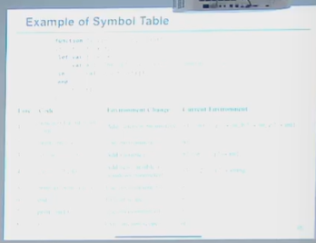
    - 如果有重名的情况，会采取覆盖操作
    - 退出对应scope之后，相应的环境会被丢弃
- **Symbol Table** - 环境的集合

### 5.1.1 实现方式

由于复杂的优先级和覆盖关系，所以简单的哈希表不好实现。

需要实现的函数（interface）：

- insert - 插入一个符号并且实现覆盖关系
- lookup - 在符号表中查询当前的符号
- enter - 进入一个scope
- exit - 退出一个scope

实现方式分类：

- 命令式 - 有了新的就看不到老的，但是退出scope的时候还能回得去
- 函数式 - 每次发生变化的时候老的都还保留着，$O(1)$恢复到任意新老状态

**1 - 命令式**

定义：

单个哈希表（存储所有变量绑定的字典）+一个scope栈

实现：

// todo [img2 - python代码实现]

举例：

// todo [img3 - 使用哈希表和stack实现的例子]

**2 - 函数式**

基本思想：在创建新的环境的时候，保留旧环境的表格，直接新建一个表格，方便快速“回退” - *不可变数据结构思想*

使用BST作为底层数据结构，在插入的时候使用**路径复制**技术，避免完全拷贝。

// todo [img4 - BST的实现方式]

**3 - 两种实现方式的对比**

// todo [img5 - 实现方式的对比图]

## 5.2 类型检查 Type Checking

### 5.2.1 类型及其作用

- 开发效率：更高层次的编程抽象
- 运行性能：类型指导的编译优化
- 安全可靠：内存安全乃至功能正确
    - soundness - 取决于想要表达什么和证明什么
    - completeness
//todo

涉及的问题：

- 合法类型表达式
- 如何定义两个类型等价
- *类型转换规则*
- *类型推导*

### 5.2.2 Tiger类型系统

*tiger语言不涉及显/隐式类型转换*

#### 5.2.2.1 类型种类

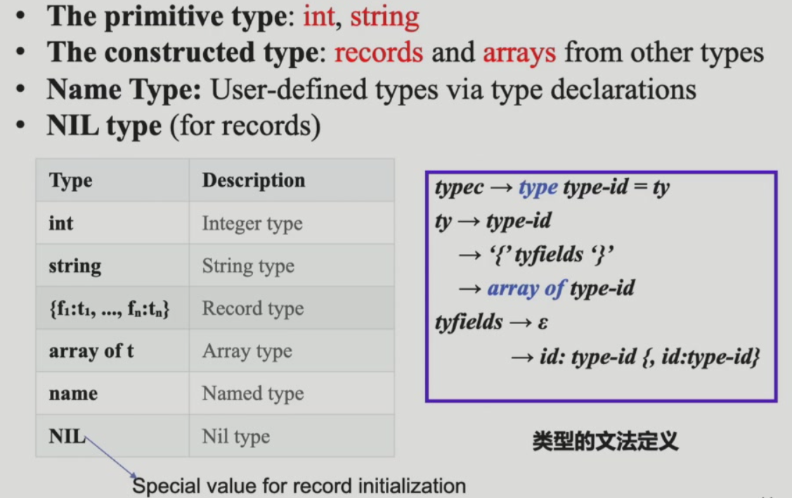

#### 5.2.2.2 类型规则（是否等价）

- **NE - name equivalence**：类型名称相同才是类型相同
- **SE - structure equivalence**：类型的结构定义相同

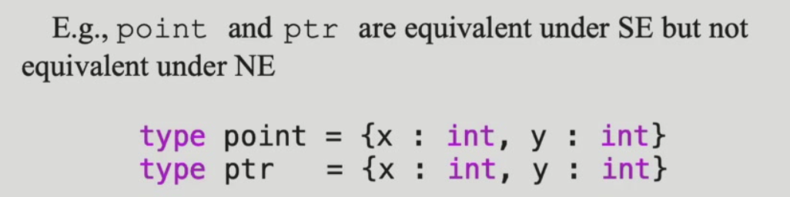

tiger语言使用NE，使用不同的类型名不等价：

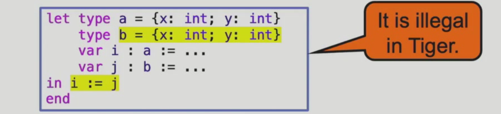

`a`是类型名，`point`是变量名（匿名类型，是独立的）：

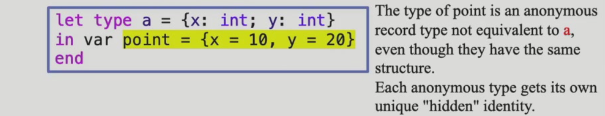

每一个record type表达式创建了一个新的不一样的record type，但是如果`type b = a`的方式创建`b`这个类型之后`a`和`b`类型的变量是NE的：

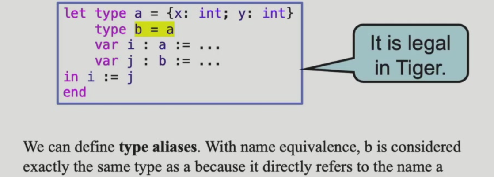

递归定义规则（不能形成非法的定义环）：

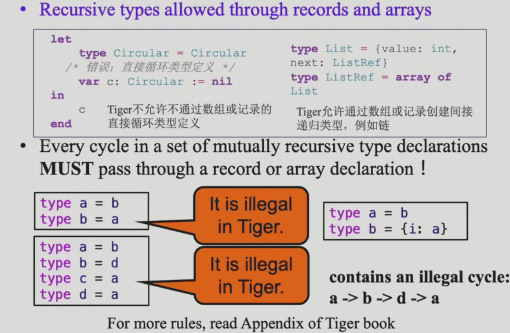

其他的一些规则（见虎书）

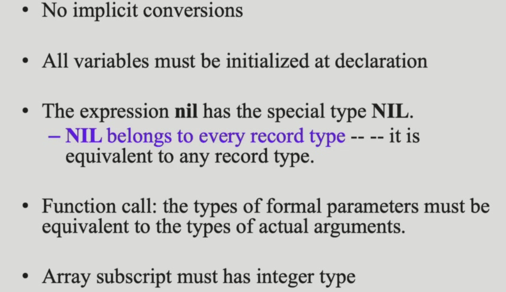

type是一个命名空间，函数和变量共用另一个命名空间：

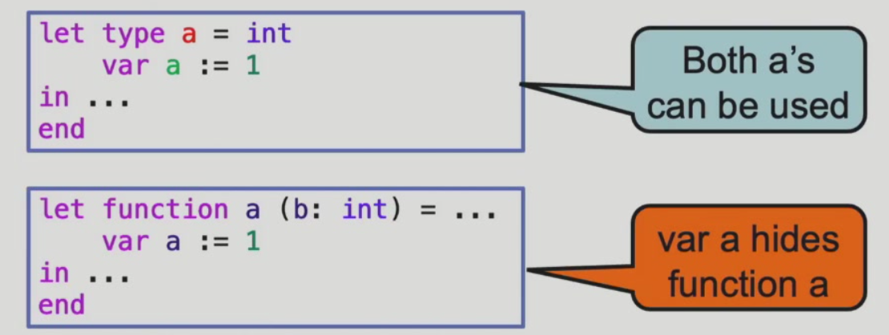

上图的上面两个定义都有效，下面的函数定义会被变量定义覆盖。

### 5.2.3 Tiger类型检查

#### 5.2.3.1 Formalization（无需掌握）

如何维护更新并使用type system

使用typing rule进行类型推演 - 多个前置条件推一个结论：

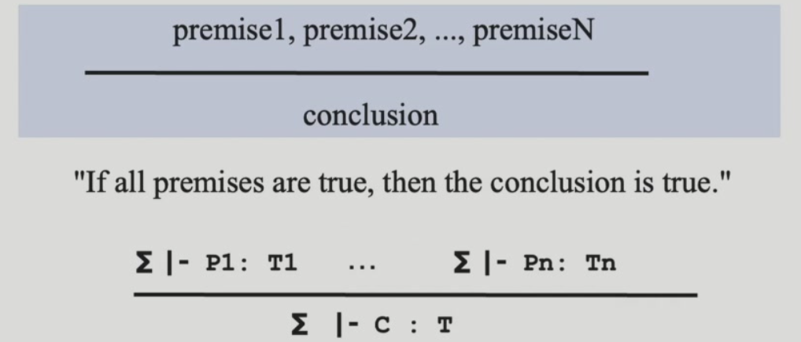

例子：

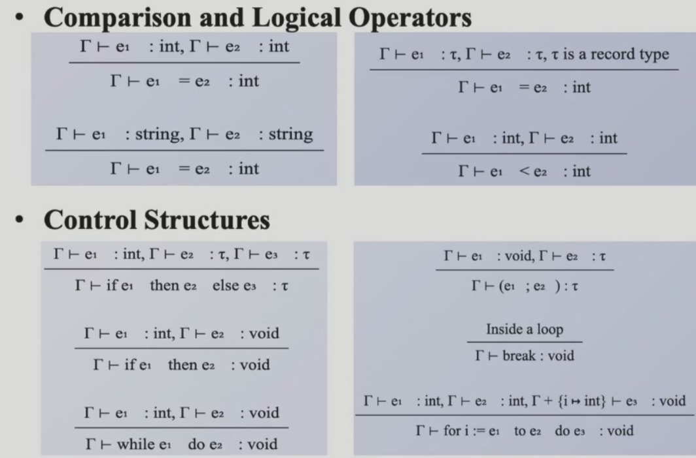

不管是parsing还是类型推导都可以被看作利用某些规则构造推演树。

推演过程举例如下：

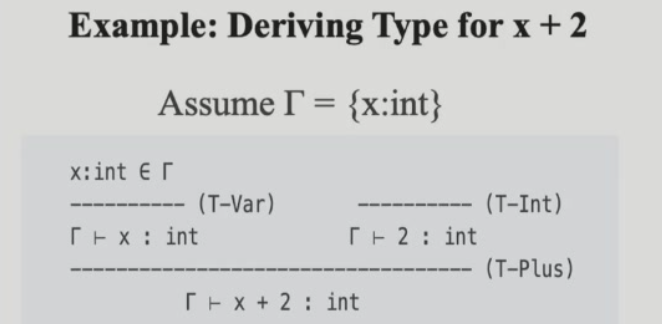

T-Var、T-Int和T-Plus都是我们使用的rule，而推演方向从上往下和从下往上都有，例如parsing的top-down和bottom-up。更详细的例子：

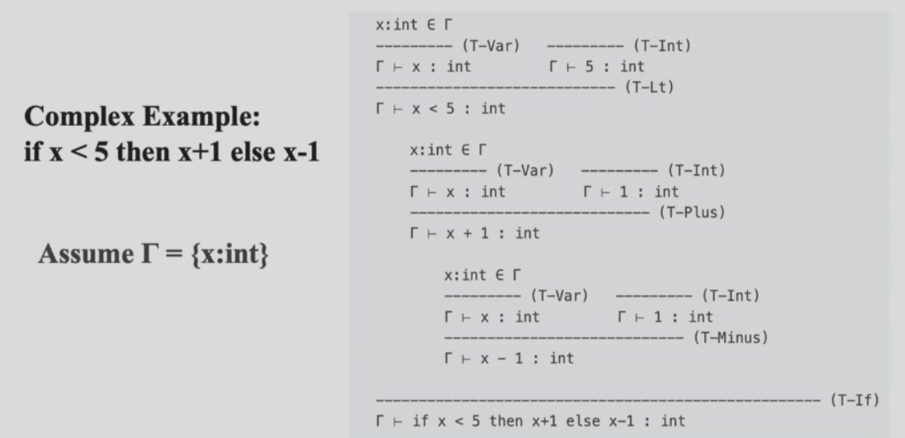

#### 5.2.3.2 

tiger的类型检查里面有两个环境：

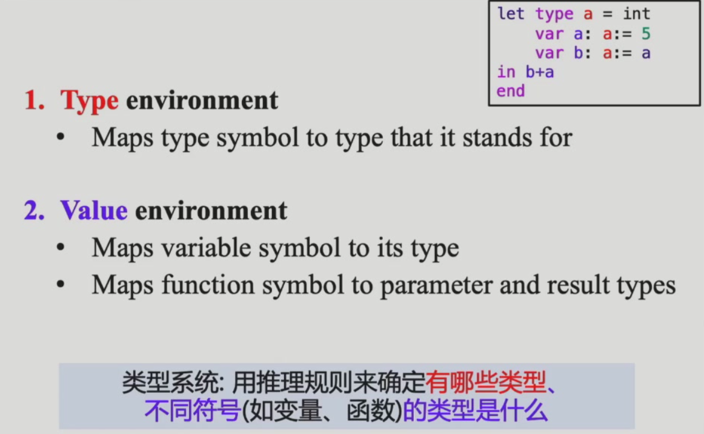

类型检查是从上往下的递归遍历ast，而子模块的类型信息从下往上传至root的过程。

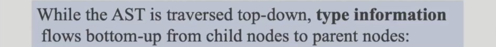

以一个类型检查的完整流程为例：

let本身的类型由`in`后面的类型决定，`x`的类型由`5 + 3`的子树决定，`*`的类型由`x * 2`决定：

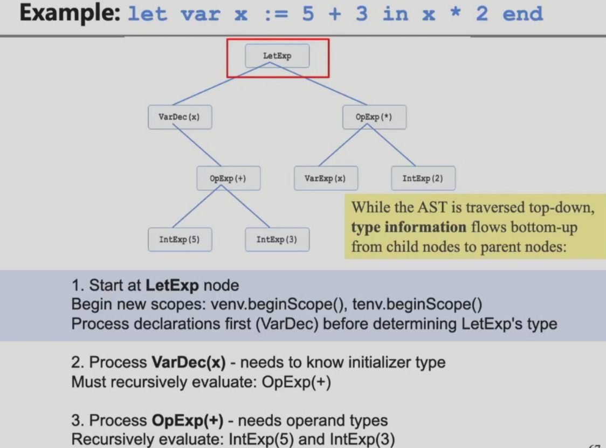

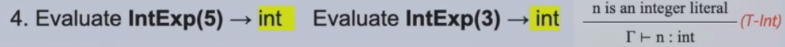

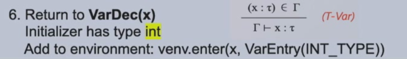

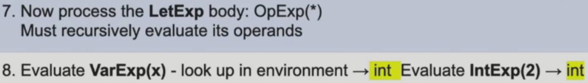

在第8步中体现了遍历的同时也是在更新环境的，我们查询的是实时更新之后的环境，可以查询得到`x`的类型。

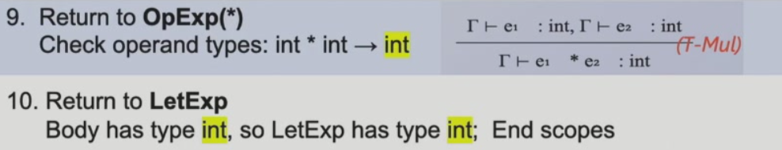

*yps：复习的时候需要取不同课堂ppt的并集*

---

**期中考考到这里。**
