# 6 Activation Record

*本章节内容和Register Allocation有很大的联系*

## 6.0 内存布局的回顾

一个编译器应该翻译所有的**CODE**到汇编指令并且为所有**DATA**开辟空间，所存储的内容类型如下图：

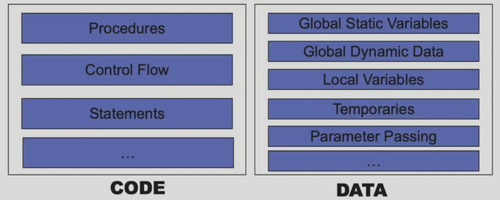

而地址空间的分布如下：

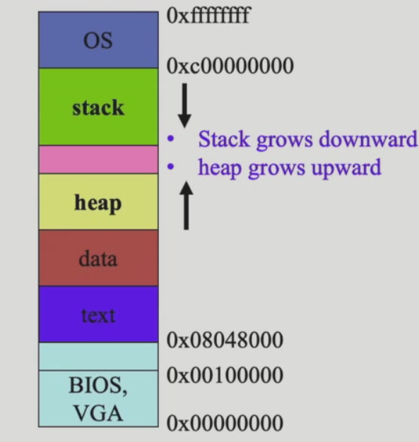

而我们的activation record一般存在于栈上：

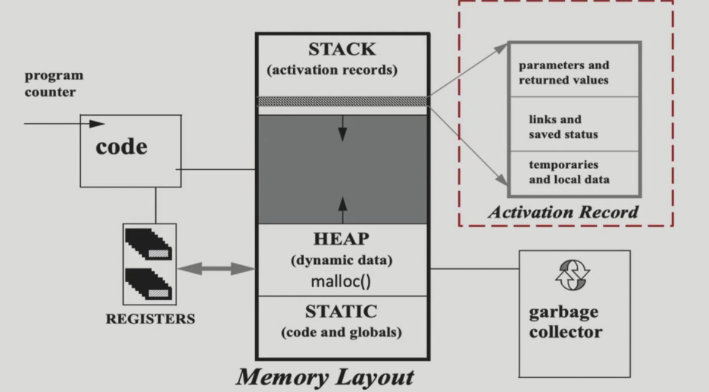

只有涉及到高阶函数可能会涉及通过heap的实现。

全局变量和静态变量不存在于堆栈，而会放在额外的静态变量的内存区域。

函数调用：

- API - 类::方法

- ABI
    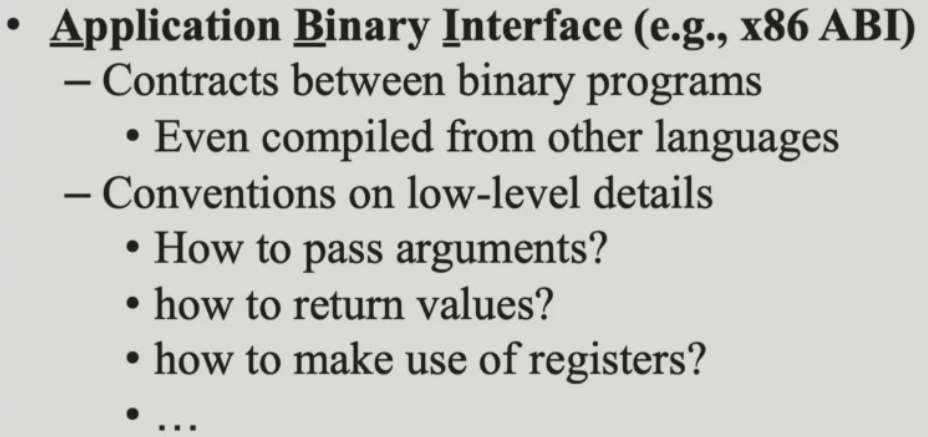
    在这章我们通过ABI实现

## 6.1 Stack Frame

每次对一个函数的调用都会被看作一个actication(活动记录) of函数

每次调用会产生不同的副本：

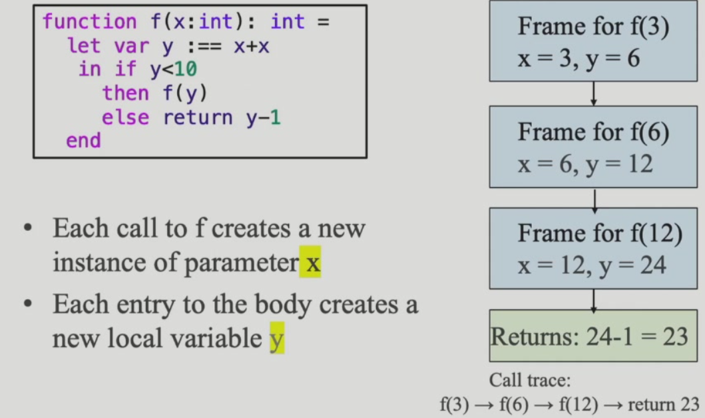

关键的问题是如何layout the activation record使得caller和callee可以正确高效的沟通。

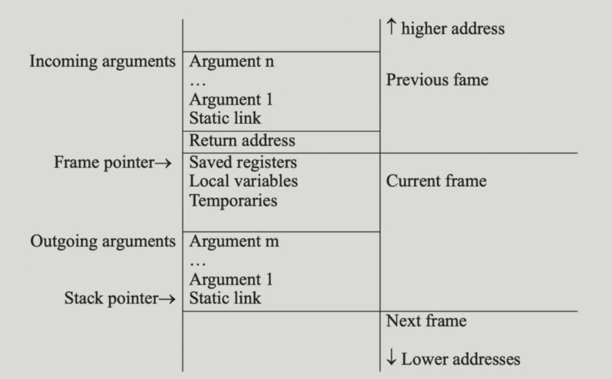

stack里面的frame是从高地址向低地址增长的。

静态变量和全局变量的考点（单独分在一个特殊区域，不在堆栈）：

tiger的record和array一般放在堆上。

### 6.1.1 Frame Pointer and Stack Pointer

为了更好的通信，会在帧栈中存储上一个frame pointer的值。

两个指针在函数调用的时候的变化：

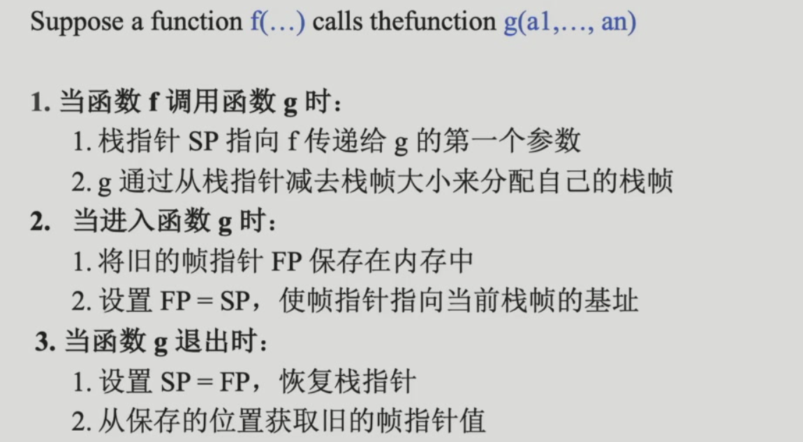

## 6.2 Use of Registers

*how to reduce memory traffic?*

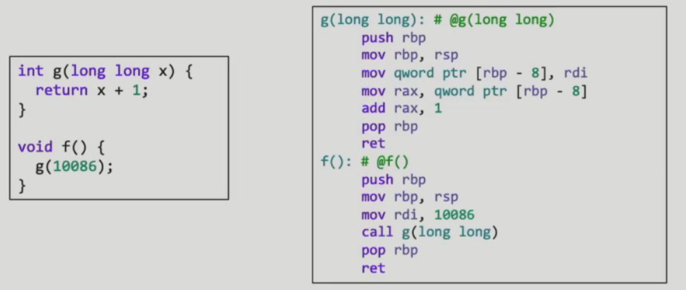

使用寄存器去优化变量在内存空间的读取。

不完全使用stack-frame通信而使用register - 是memory hierarchy视角的优化，访问寄存器比使用内存快。

优化的可能性：

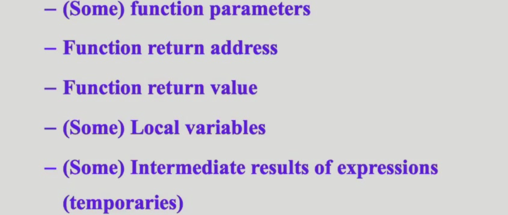

1. 传参方式
    tiger的传参：call-by-value
    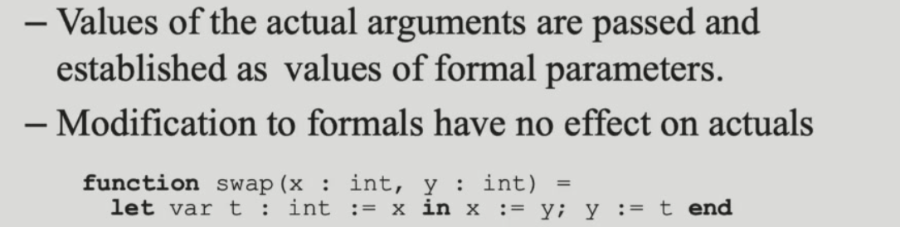
    部分寄存器用作传参：
    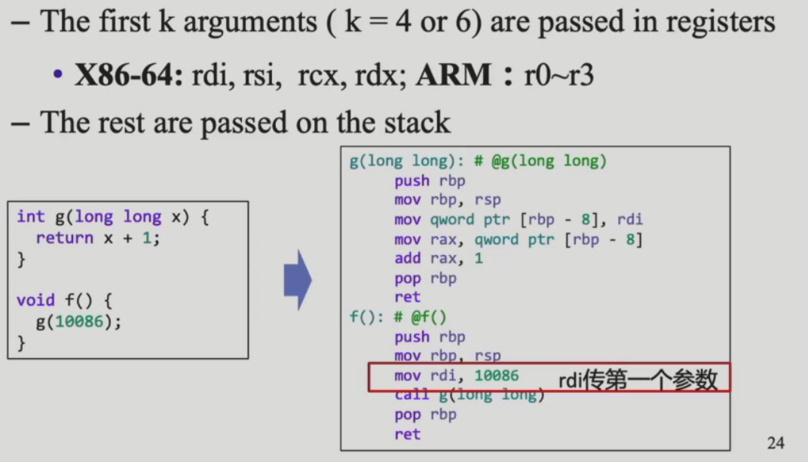
    当然寄存器的使用会有些问题，比如：
    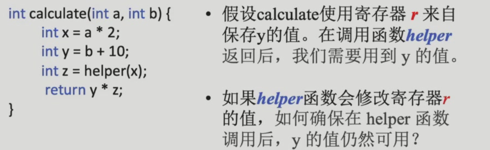
    一个用于存储local变量的寄存器在函数中间用于传参覆盖了，那么这个local变量的值应该如何在函数后期获取？
    - 涉及到caller和callee的保存工作，至于谁来执行save是经验之谈。
        - caller-save：
            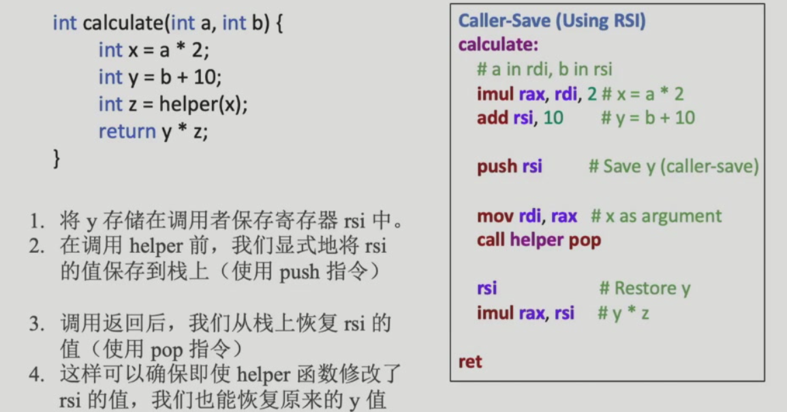
        - callee-save：
            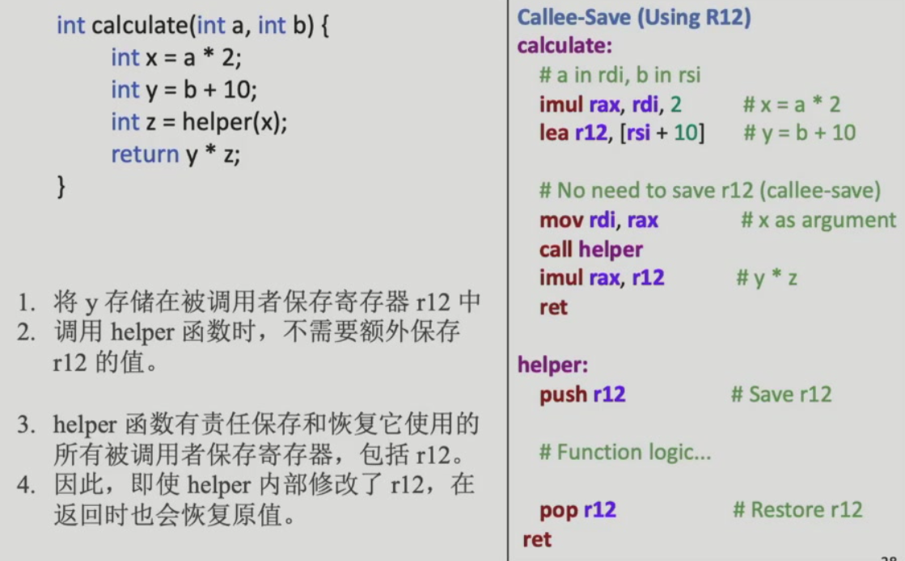
    - 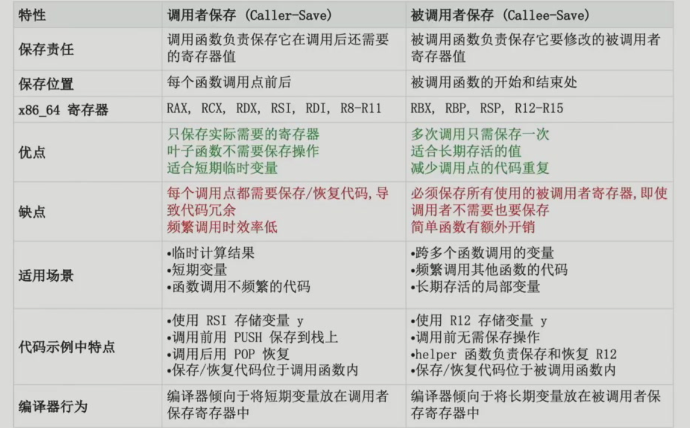
        不同编译器有权决定不同的caller-save和callee-save场景，`rbp`都是callee负责save的
    - 但是先存再取又带来了一个问题：本来是想通过register减少访存的，但是这样的存取又带来了额外的访存，没有实现这个设计本身的优化目的，优化方式如下：
        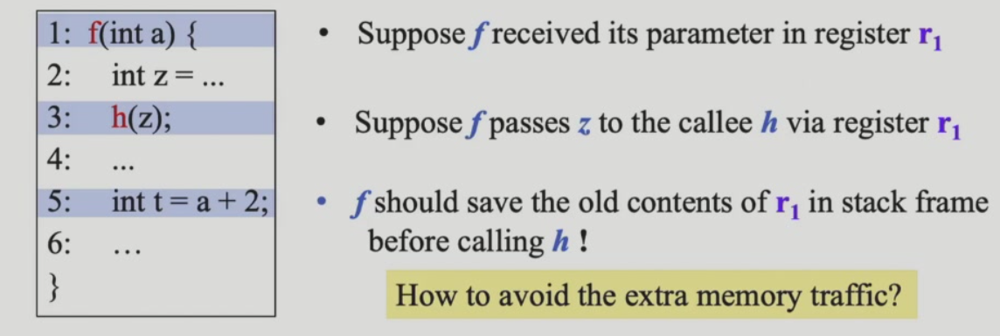
        - dead variable - 如果某个变量在后面不再被使用，那么存储这个变量的寄存器可以被overwrite，后续调用函数的时候不需要再保存这个寄存器的值：
            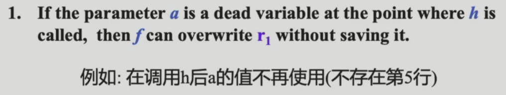
        - 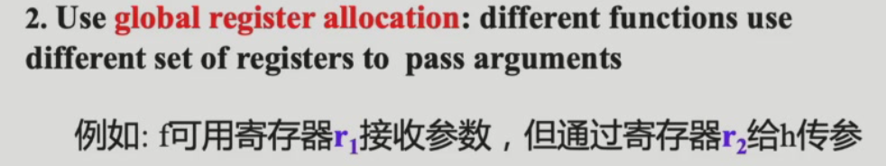
        - 
        - 利用硬件特性：
            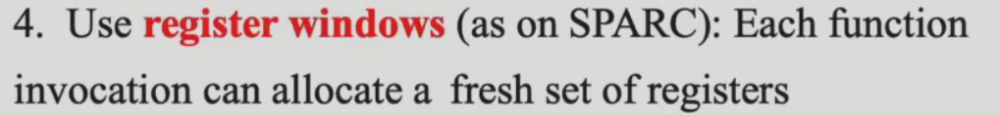
2. 

## 6.3 Frame-Resident Variables

---

## 6.4 Block Structure

## 6.5 Block Structure: Implement

## 6.6 A Typical Layout for Tiger
