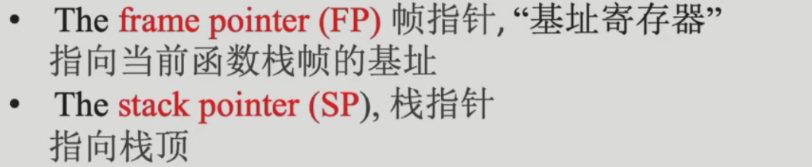

# 6 Activation Record

*本章节内容和Register Allocation有很大的联系*

## 6.0 内存布局的回顾

一个编译器应该翻译所有的**CODE**到汇编指令并且为所有**DATA**开辟空间，所存储的内容类型如下图：

而地址空间的分布如下：

而我们的activation record一般存在于栈上：

只有涉及到高阶函数可能会涉及通过heap的实现。

全局变量和静态变量不存在于堆栈，而会放在额外的静态变量的内存区域。

函数调用：

- API - 类::方法

- ABI
      
      在这章我们通过ABI实现

## 6.1 Stack Frame

每次对一个函数的调用都会被看作一个actication(活动记录) of函数

每次调用会产生不同的副本：

关键的问题是如何layout the activation record使得caller和callee可以正确高效的沟通。

stack里面的frame是从高地址向低地址增长的。

静态变量和全局变量的考点（单独分在一个特殊区域，不在堆栈）：

tiger的record和array一般放在堆上。

### 6.1.1 Frame Pointer and Stack Pointer

为了更好的通信，会在帧栈中存储上一个frame pointer的值。

两个指针在函数调用的时候的变化：

## 6.2 Use of Registers

*how to reduce memory traffic?*

使用寄存器去优化变量在内存空间的读取。

不完全使用stack-frame通信而使用register - 是memory hierarchy视角的优化，访问寄存器比使用内存快。

优化的可能性：

1. 传参方式 
      tiger的传参：call-by-value 
       
      部分寄存器用作传参： 
       
      当然寄存器的使用会有些问题，比如： 
       
      一个用于存储local变量的寄存器在函数中间用于传参覆盖了，那么这个local变量的值应该如何在函数后期获取？
      - 涉及到caller和callee的保存工作，至于谁来执行save是经验之谈。 
            - caller-save：
            
            - callee-save：
            
      - 
            不同编译器有权决定不同的caller-save和callee-save场景，`rbp`都是callee负责save的
      - 但是先存再取又带来了一个问题：本来是想通过register减少访存的，但是这样的存取又带来了额外的访存，没有实现这个设计本身的优化目的，优化方式如下：
            
            - dead variable - 如果某个变量在后面不再被使用，那么存储这个变量的寄存器可以被overwrite，后续调用函数的时候不需要再保存这个寄存器的值：
                  
            - 
            - 
            - 利用硬件特性：
                  
2. 返回地址
       - 使用特殊寄存器保存返回地址
3. 返回值
       - 
4. 局部变量
       - 只有一部分有机会放到寄存器，比如生命周期比较长暂时不需要的会先放到栈上需要的时候再取出来
            

## 6.3 Frame-Resident Variables

*既然很多地方都可以使用寄存器，那为什么还需要stack frame去分配内存空间*

首先寄存器的数量是有限的。

其次：

1. 过程间通过引用的方式传参：
      
2. 过程内访问变量地址：
      
3. 内部函数访问外部函数的变量：
       
   个人理解是生命周期带来的问题
4. 值太大了无法写入单个寄存器：
      
5. 数组变量，因为访问数组需要地址计算：
      
6. 传参：
      
7. 局部变量太多：
      
**逃逸变量：**

---

## 6.4 Block Structure: Implementation

### 6.4.1 Static Link

**重点**

会定义一个词法上的level：

在调用`print`的时候，变量通过：

- `z` - 直接访问`rbp`
- `b` - level3把frame pointer传给level4，level4通过ptr加变量的偏移量访问到目标变量的地址
- `a` - level2把自己的frame ptr传给level3，level3把自己的frame ptr传给level4，然后level4获取level3的frame ptr再去读取level2的frame ptr，加上偏移量找到目标变量地址
- `global` - 和上面的帧ptr传递同理

具体流程：

和动态链接的区别：

### 6.4.2 Display

**可能重点**

维护一个全局数组，记录每一个帧的ptr

变量的访问直接通过`Display`数组：

更新维护过程：

在访问的时候可以做到$O(1)$，但是维护代价高。

---

两者对比：

### 6.4.3 Lambda Lifting

一种代码重构技术，它通过将嵌套函数转换为顶层函数，并显式传递所有需要的变量作为参数，来简化程序结构：

1. **消除嵌套**：把层层嵌套的函数变成平级的独立函数
2. **显式传参**：原来隐式使用的上级变量现在必须明确作为参数传递
3. **清晰依赖**：每个函数需要什么数据一目了然

## 6.5 A Typical Layout for Tiger

1. **incoming arguments（传入参数）**：
      - 由调用者传递给被调用函数的参数。
2. **static link（静态链接）**：
      - 用于访问嵌套函数的外部环境，帮助函数找到其非局部变量。
3. **local variables（局部变量）**：
      - 当前函数内部定义的变量。
4. **return address（返回地址）**：
      - 指示控制应该返回到调用函数的哪个位置。这个地址由调用指令（CALL）生成。
5. **temporaries（临时变量）**：
      - 用于存储在函数执行过程中需要的临时数据。
6. **saved registers（保存的寄存器）**：
      - 为了在函数调用期间保存寄存器的值，以便在返回时恢复。
7. **outgoing arguments（传出参数）**：
      - 函数调用其他函数时需要传递的参数。

tiger不支持高阶函数，不然stack frame问题会变复杂很多：

