# 6 Activation Record 活动记录

参考资料：

- 姚培森老师2024~2025学年春夏ch6ppt
- [wcjj的笔记](https://shiseab.github.io/notebook/Compiler/Activation_Record/)
- [伟大的Gemini 2.5 pro deep research](https://docs.google.com/document/d/1T5g9M2VY3Izk89pLCuGsQZxOPvnBFLj-F8UanP27wsk/edit?usp=sharing)
- 无敌韩天尊老师的笔记

---

一个编译器应该翻译所有的**CODE**到汇编指令并且为所有**DATA**开辟空间

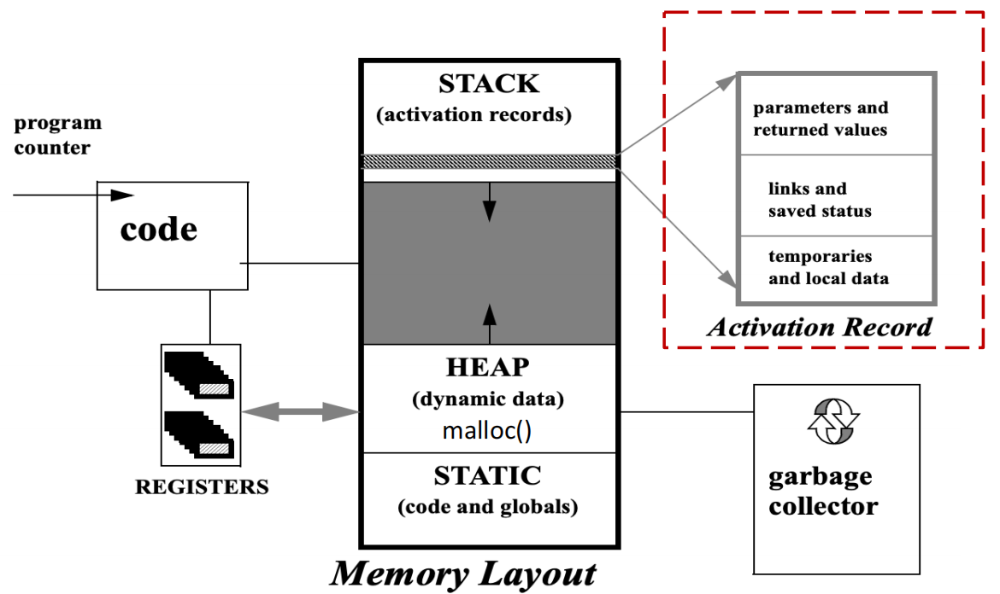

## 6.1 Stack Frame

### 6.1.1 活动记录

一个函数的**调用 (invocation)** 或**激活 (activation)**，是指该函数在程序执行过程中的一次具体运行实例。活动记录（或称栈帧）就是为这一次激活而在栈上分配的内存块，详细记录了本次函数调用所需的所有信息，并负责与调用它的函数（调用者，caller）和被它调用的函数（被调用者，callee）进行通信。

一个活动记录（或栈帧）的内部布局如下：

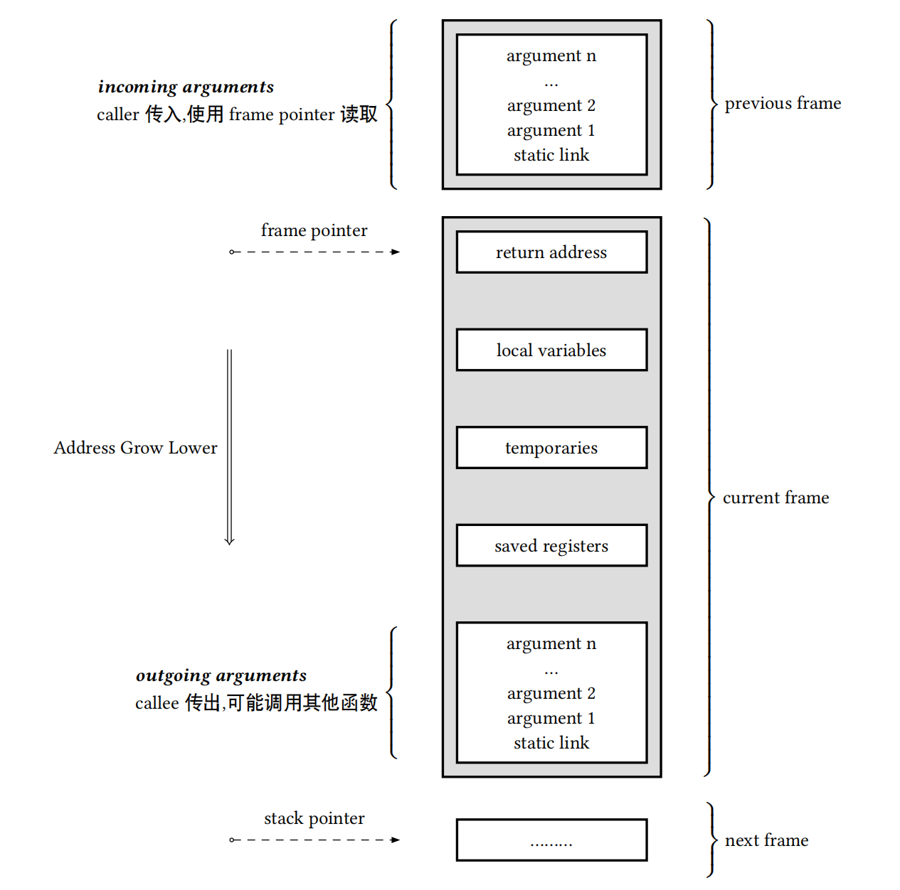

| 组件                               | 位置（相对于FP）       | 目的                                                     | 设置者            |
| ---------------------------------- | ---------------------- | -------------------------------------------------------- | ----------------- |
| **传入参数 (Incoming Arguments)**  | 高地址 (e.g., [FP+16]) | 存放调用者传递的、未通过寄存器传递的参数。               | 调用者 (Caller)   |
| **返回地址 (Return Address)**      | 高地址 (e.g., [FP+8])  | 记录函数执行完毕后应返回到调用者的哪条指令。             | CALL指令          |
| **动态链接 (Saved Frame Pointer)** | [FP]                   | 存放调用者的帧指针(FP)，用于函数返回时恢复调用者的栈帧。 | 被调用者 (Callee) |
| **静态链接 (Static Link)**         | 低地址 (e.g., [FP-8])  | 指向词法父作用域的栈帧，用于访问非局部变量。             | 调用者 (Caller)   |
| **保存的寄存器 (Saved Registers)** | 低地址                 | 保存那些被当前函数使用，但其值需要在返回前恢复的寄存器。 | 被调用者 (Callee) |
| **局部变量 (Local Variables)**     | 低地址                 | 存放函数内部声明的、需要分配在内存中的局部变量。         | 被调用者 (Callee) |
| **临时变量 (Temporaries)**         | 低地址                 | 存放表达式计算过程中的中间结果。                         | 被调用者 (Callee) |
| **传出参数 (Outgoing Arguments)**  | 最低地址               | 为即将调用的其他函数准备参数的空间。                     | 当前函数          |

传入传出参数：调用者将参数放在自己的“传出参数”区（或寄存器中），而被调用者则在其“传入参数”区接收这些值；

- **栈指针 (SP, 在x86-64中为`rsp`)**：它始终指向**栈的顶部**。当数据被压入（push）栈时，SP的地址值会减小（因为栈向低地址增长）；当数据被弹出（pop）时，SP的地址值会增大。SP是动态变化的，反映了栈的实时边界 。
- **帧指针 (FP, 在x86-64中为`rbp`)**：它也叫“基址指针”(Base Pointer)。与动态变化的SP不同，FP在函数执行期间通常指向**当前活动记录的一个固定基准位置**（通常是动态链接所在的位置）。

### 6.1.2 函数序言与结语

```asm
# 函数 f 调用 g(10086)
f():
  push rbp          # 保存调用者 f 的帧指针
  mov rbp, rsp      # 设置 f 自己的帧指针
  mov rdi, 10086    # 将参数 10086 放入寄存器 rdi
  call g            # 调用 g
  pop rbp           # 恢复调用者 f 的帧指针
  ret

# 函数 g 的实现
g(long long):
  push rbp          # 1. 函数序言(Prologue): 保存调用者 f 的 rbp (这就是动态链接)
  mov rbp, rsp      # 2. 设置 g 自己的新 rbp，指向当前栈顶
  sub rsp, 16       # 3. 为 g 的局部变量分配空间 (移动 rsp)
 ...               # 函数体，可以通过 [rbp-...] 访问局部变量
  mov rsp, rbp      # 4. 函数结语(Epilogue): 恢复 rsp，释放局部变量空间
  pop rbp           # 5. 恢复调用者 f 的 rbp
  ret               # 6. 从栈中弹出返回地址，返回 f
```

1. 当函数`f`调用函数`g`时：
    - 栈指针`SP`指向`f`传递给`g`的第一个参数
    - `g`通过从栈指针减去栈帧大小来分配自己的栈帧
2. 当进入函数`g`时：
    - 将旧的帧指针`FP`保存在内存中
    - 设置`FP`=`SP`，使帧指针指向当前栈帧的基址
3. 当函数`g`退出时：
    - 设置`SP`=`FP`，恢复栈指针
    - 从保存的位置获取旧的帧指针值

### 6.1.3 静态变量和全局变量

- **所有对全局变量的引用都指向同一个对象**，一个全局变量在内存中只有一个实例，因此，它不能被存储在随函数调用创建和销毁的活动记录（Activation Record）中，即全局变量不在堆栈内
- **全局变量会被一次性地分配一个固定的内存地址**，这种拥有固定地址的变量是静态分配
- 在Tiger语言里，字符串常量（string constants）也是作为全局变量来分配内存的
- tiger的record和array一般放在堆上

## 6.2 寄存器

使用寄存器去优化变量在内存空间的读取，不完全使用stack-frame通信而使用register是memory hierarchy视角的优化，访问寄存器比使用内存快。

### 6.2.1 传递参数

现代体系结构（如x86-64, ARM）的**应用二进制接口 (Application Binary Interface, ABI)** 规定，前 *k* 个（通常是4或6个）参数直接通过指定的寄存器传递。只有超出六个的参数，或者某些特殊类型的参数，才会通过栈来传递。

- X86-64: `rdi`, `rsi`, `rcx`, `rdx`; ARM: `r0`~`r3`

这种情况下会有寄存器冲突问题：

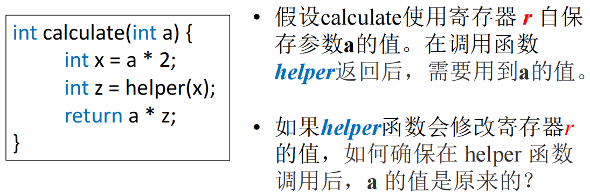

我们通过caller-save和callee-save解决：

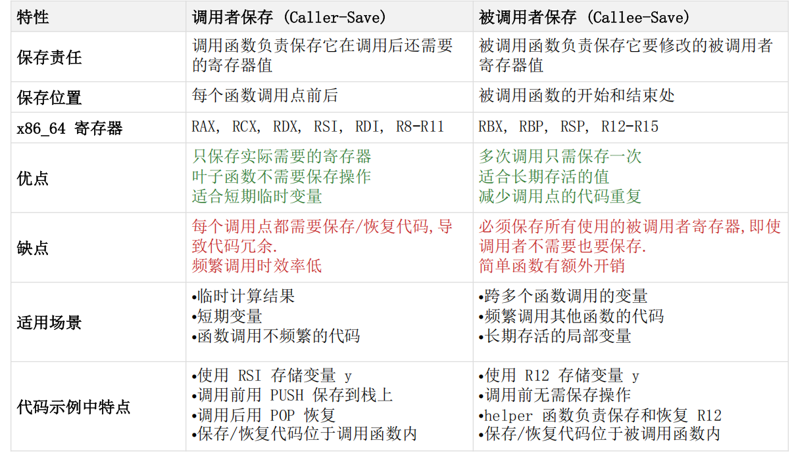

caller-save例子：

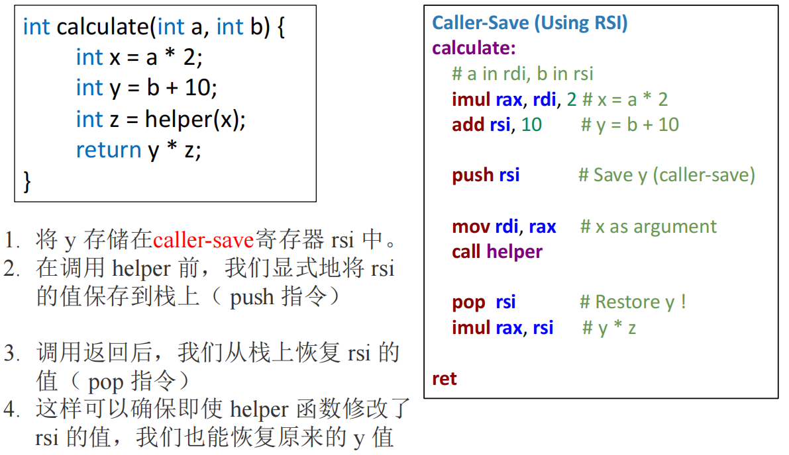

callee-save例子：

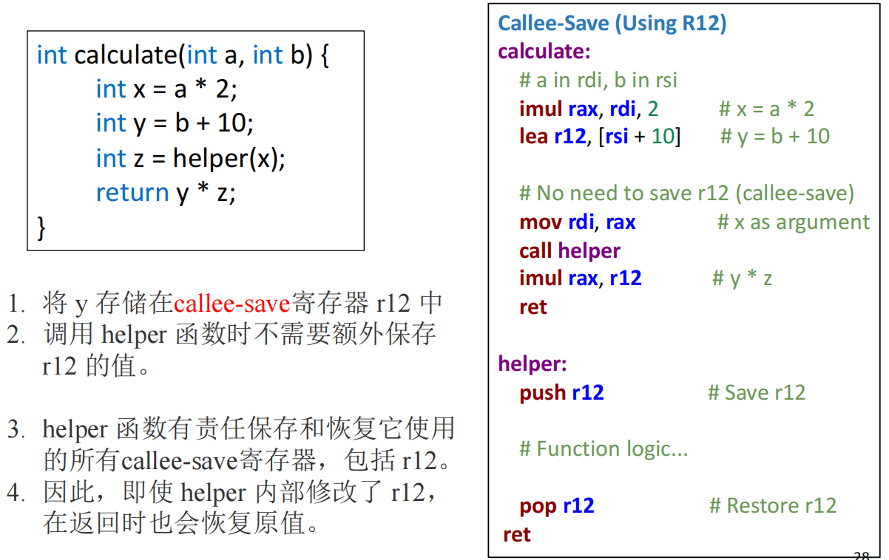

但是先存再取又带来了一个问题：本来是想通过register减少访存的，但是这样的存取又带来了额外的访存，没有实现这个设计本身的优化目的，优化方式如下：

1. 死变量分析，可以直接覆盖不再活跃的寄存器
2. 使用全局寄存器分配：不同的函数使用不同的寄存器组来传递参数
3. 叶子过程的优化：
    - 定义：在函数调用树中，处于最末端的函数，即**那些自身不会再调用任何其他函数的函数**，被称为“叶子过程”或“叶子函数”
    - 叶子函数可以自由地使用所有“调用者保存”（Caller-Save）的寄存器，而无需在函数开头保存它们、在结尾恢复它们，因为它根本没有“调用者”的角色转换
4. （硬件特性）使用寄存器窗口：每次函数调用都可以分配一组全新的寄存器

### 6.2.2 返回地址与返回值

- 返回地址：现代架构中，`call` 指令会隐式地将下一条指令的地址（即返回地址）保存起来（逻辑上是压入栈中），而 `ret` 指令则会取出这个地址并跳转
- 返回值：
    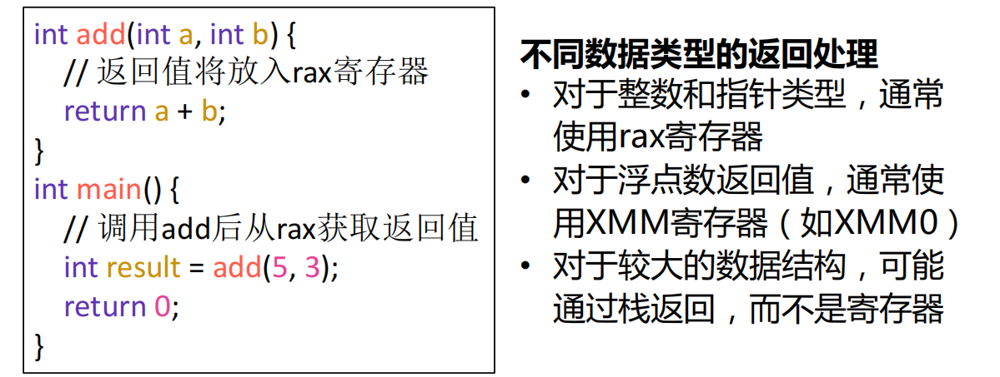

### 6.2.3 局部变量

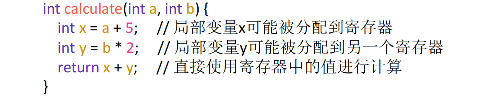

只有一部分有机会放到寄存器，比如生命周期比较长暂时不需要的会先放到栈上需要的时候再取出来（具体在寄存器分配中讨论）

## 6.3 驻留在frame的变量

### 6.3.1 逃逸变量

原因：它的生命周期或可访问性超出了单个函数内部、单个寄存器所能管理的范畴，从而被迫需要一个稳定、可寻址的内存位置

当程序需要的不仅仅是变量当前的值，而是它的地址（它的身份）时，这个变量就必须“逃逸”出寄存器的短暂世界，进入到更稳定、更具身份标识的内存世界中。所有导致变量逃逸的场景，本质上都是程序需要对变量进行“寻址”操作的场景。

可能性：

1. 使用引用传递
2. 取地址
3. 嵌套函数

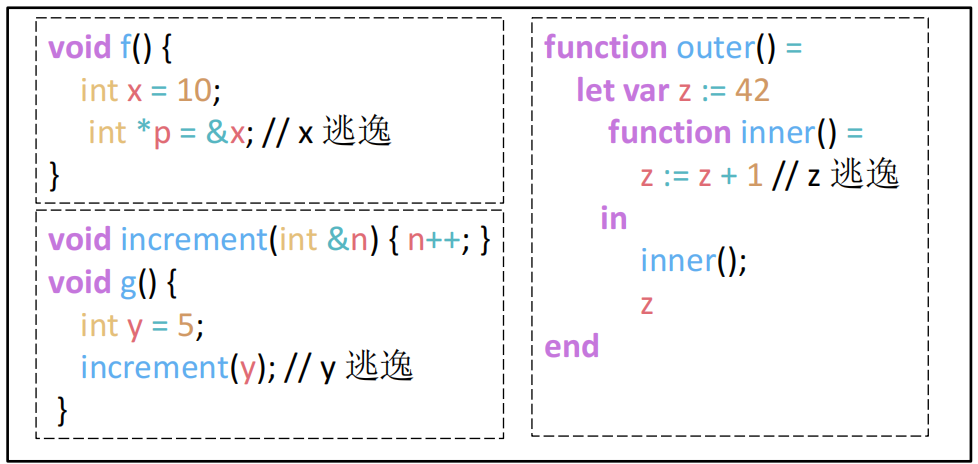

### 6.3.2 驻留原因

1. 变量通过引用传递 (Passed by Reference)
    - 当一个函数期望接收一个变量的地址（例如C/C++中的指针或引用），以便能修改原始变量时，这个原始变量必须存在于内存中：
        ```c++
        void increment(int *ptr) { // ptr 是一个地址
          (*ptr)++; // 通过地址修改原始变量的值
        }
        
        void main() {
          int x = 10; // x 必须在栈上有位置，才能获取其地址
          increment(&x); // 传递的是 x 的地址，而不是值10
          // 此处 x 的值变为 11
        }
        ```
        为了让 `increment` 函数能通过指针 `ptr` 找到并修改 `x`，`x` 必须有一个内存地址。因此，`x` 逃逸了。
2. 变量的地址被获取 (Address is Taken)
    - 在程序中，任何时候使用取地址操作符（如C语言中的 `&`）获取一个局部变量的地址，该变量都必须被分配在栈帧中：
        ```c++
        void process() {
          int count = 0;
          int *ptr = &count; // 获取 count 的地址并赋给指针 ptr
          *ptr = 42; // 通过指针修改 count 的值
        }
        ```
        因为代码需要 `count` 的地址，所以编译器必须为 `count` 在栈上分配空间
3. 变量被嵌套的函数访问 (Accessed by a Nested Procedure)
    - 在支持词法作用域和嵌套函数（或闭包）的语言中，如果一个内部函数引用了其外部函数的局部变量，这个局部变量就会逃逸。因为内部函数可能作为返回值或参数传递出去，其执行时间可能在外部函数返回之后，此时外部函数的栈帧理论上已经销毁。为了让内部函数仍能访问该变量，变量必须存放在一个比栈帧更持久的地方（在更高级的实现中，它甚至可能被分配到堆上，但在此模型中，它必须在栈帧中以支持静态链接等机制）：
        ```c++
        void outer() {
          int shared = 10; // shared 被内部函数访问，所以它逃逸了
          void inner() {
            printf("%d", shared); // 访问外部函数的变量
          }
          inner();
        }
        ```
4. 变量太大无法放入单个寄存器 (Too Big for a Single Register)
    - 例子：
        ```c++
          struct LargeStruct {
            double values; // 80字节
            char name;    // 100字节
          };
          
          void process() {
            // 这个结构体太大，总大小为180字节，远超64位寄存器
            struct LargeStruct data;
            data.values = 3.14;
          }
        ```
5. 变量是数组 (Is an Array)
    - 例子：
        ```c++
        void calculateSum() {
          int numbers; // 数组必须在栈上分配以获得基地址
          for (int i = 0; i < 100; i++) {
            numbers[i] = i; // 访问 numbers[i] 需要地址计算
          }
        }
        ```
6. 持有变量的寄存器被用于特殊目的 (Register is Needed for Another Purpose)
7. 寄存器不足（寄存器溢出, Register Spilling）

## 6.4 Block Structure

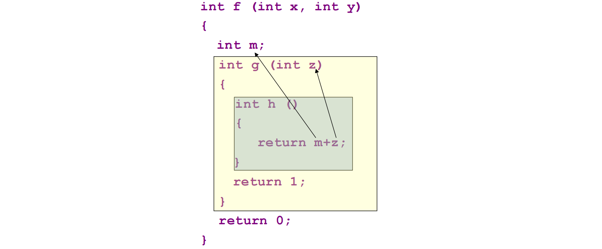

块状函数下**嵌套函数（Nested Functions）**的特性引入了一个问题：内部函数如何访问外部函数中定义的变量？

在函数 `h` 中，访问 `z` 相对简单，因为 `z` 是其直接词法父函数 `g` 的参数。但访问 `m` 就变得非常棘手。`m` 既不是 `h` 的局部变量，也不是全局变量，而是一个**非局部变量（non-local variable）**。

这个问题的根源在于**静态结构**与**动态调用链**之间的不匹配。

- **静态结构**：在源代码中，`h` 嵌套在 `g` 内部，`g` 嵌套在 `f` 内部。所以 `f` 是 `h` 的静态祖先。
- **动态调用链**：在运行时，`h` 可能被任何能够调用它的函数所调用。栈帧中的动态链接（即保存的旧 `rbp`）只会指向调用 `h` 的那个函数，而这个调用者可能与 `f` 毫无关系。

因此，仅靠我们之前讨论的动态链接是无法找到 `f` 的栈帧的。我们需要一种新的机制，一种能够反映代码静态嵌套结构的指针。这催生了三种主要的实现策略：静态链接、Display数组和Lambda提升。


### 6.4.1 Static Link（重点）

**核心思想：**

在每个函数的活动记录中，增加一个额外的指针，称为**静态链接（Static Link）**，它指向其**直接词法父函数**的最新活动记录

- **工作原理**：当一个嵌套深度为 `n` 的函数需要访问一个定义在嵌套深度为 `m` (`m < n`) 的非局部变量时，它需要沿着静态链接链向上“爬” `n - m` 次，以到达正确的祖先函数的栈帧，这个需要攀爬的层数 `n - m` 是在编译时就可以确定的
- **访问成本**：访问一个 `k` 层之外的非局部变量，需要进行 `k` 次内存解引用操作，因此访问时间是 `O(k)`

**例子：**

```c++
function level1_main() =       // 深度 1
  let var global := 100
  function level2(x) =         // 深度 2
    let var a := x + global
    function level3(y) =       // 深度 3
      let var b := y + a
      function level4(z) =     // 深度 4
        print(z + b + a + global)
      in level4(y + 1) end
    in level3(a + 1) end
  in level2(10) end
```

当 `level4` 函数执行 `print` 语句时：

- 访问 `z`：`z` 是 `level4` 的局部变量，直接访问（0次链接跳转）。
- 访问 `b`：`b` 定义在 `level3`（深度3）。`level4`（深度4）需要通过它的静态链接（指向 `level3` 的帧）跳转1次来找到 `b`。
- 访问 `a`：`a` 定义在 `level2`（深度2）。`level4` 需要跳转2次：先通过静态链接到 `level3` 的帧，再通过 `level3` 帧中的静态链接到 `level2` 的帧。
- 访问 `global`：`global` 定义在 `level1_main`（深度1）。`level4` 需要沿着静态链接链跳转3次才能到达 `main` 的帧。

**具体流程：**

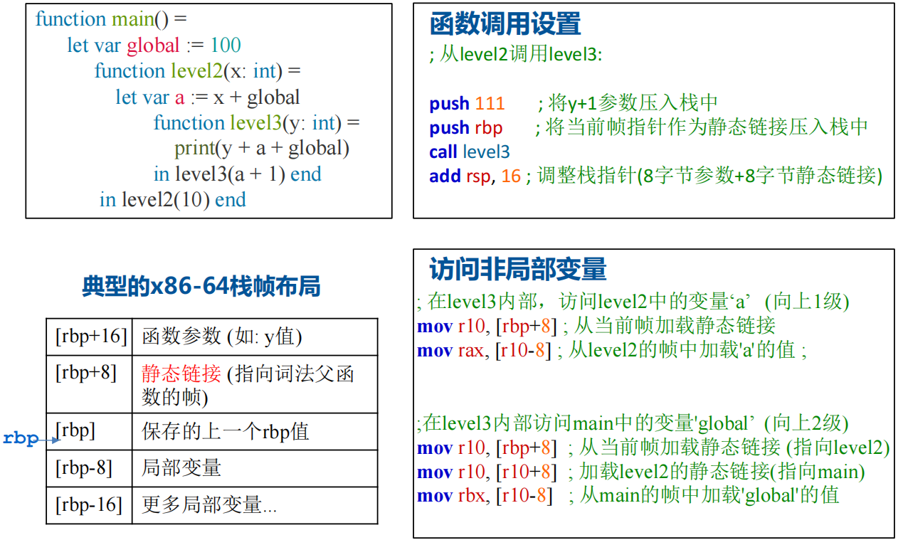

**优缺点：**

- **优点**：实现相对简单，每个活动记录只需增加一个指针的空间开销。
- **缺点**：对于深度嵌套的函数，访问外层变量的成本很高，因为需要多次内存访问，可能导致性能瓶颈。

**和动态链接对比：**

| 特性     | 静态链接 (Static Link)       | 动态链接 (Dynamic Link) / 控制链接      |
| -------- | ---------------------------- | --------------------------------------- |
| 用途     | 访问词法作用域内的非局部变量 | 管理栈帧，实现函数返回                  |
| 指向     | 词法父函数的栈帧             | 调用者函数的栈帧                        |
| 决定因素 | 源代码的静态嵌套结构         | 运行时的动态调用序列                    |
| 建立方式 | 调用时由调用者显式传递       | call 指令执行时，通过 push rbp 自动创建 |

### 6.4.2 Display（可能重点）

- **工作原理**：维护一个全局的指针数组`display`，数组的第 `i` 个元素 `display[i]` 始终指向当前活跃的、嵌套深度为 `i` 的那个函数的最新活动记录
- **访问机制**：当一个函数需要访问嵌套深度为 `m` 的非局部变量时，它不再需要沿着链条跳转，它只需通过 `display[m]` 直接获得目标帧的指针，然后通过编译时已知的偏移量访问变量，这使得任何非局部变量的访问时间都变成了 `O(1)` 
- **Display 数组的维护**：`O(1)` 的高效访问是有代价的，这个代价就是对 Display 数组的维护。
    - **进入函数**：当一个嵌套深度为 `i` 的函数被调用时，必须执行两个步骤：
        1. 将 `display[i]` 的**旧值**保存到新创建的活动记录中。
        2. 将 `display[i]` 更新为指向这个新活动记录的指针。
    - **退出函数**：当函数返回时，必须从其活动记录中取出之前保存的旧值，并用它来**恢复** `display[i]`。
- **优缺点**：
    - **优点**：非局部变量访问效率极高（`O(1)`），代码生成也相对直接。
    - **缺点**：函数调用的开销变大。每次函数进入和退出都需要对 Display 数组进行读、写和保存操作，这比仅仅传递一个静态链接要复杂和耗时。此外，Display 作为一个全局数组，在多线程环境下需要额外的同步和管理机制。

例子：

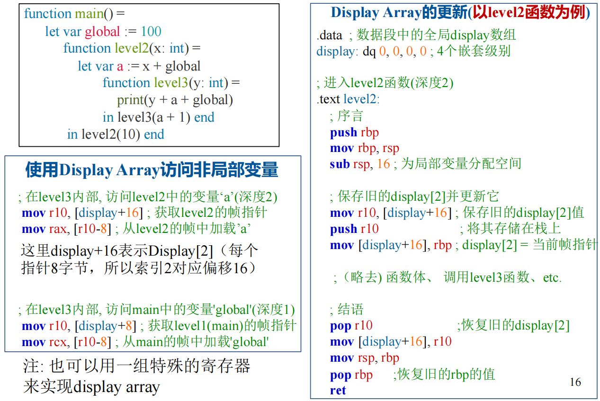

### 6.4.3 Lambda Lifting

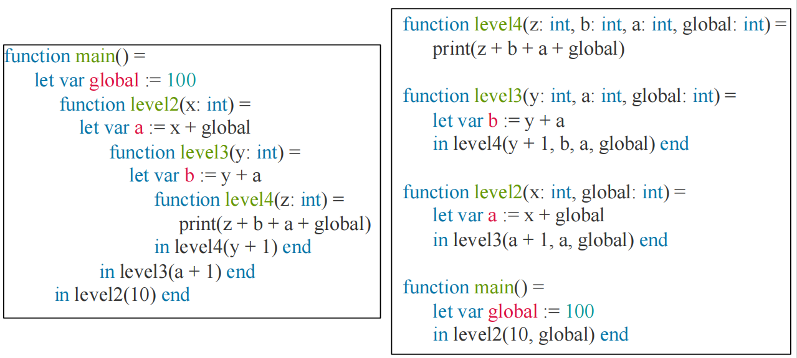

通过在**编译时重写代码**来彻底消除非局部变量的存在，核心步骤如下：

1. **分析**：编译器分析每个函数，找出它直接或间接（通过调用其内部的嵌套函数）访问的所有非局部变量。
2. **提升**：将这些非局部变量作为**额外的参数**添加到该函数的定义中。
3. **重写**：修改所有对该函数的调用点，将这些非局部变量作为实参传递过去。

经过这个过程，所有的嵌套函数都被“提升”到了顶层，变成了普通的全局函数。它们不再依赖于任何外部的词法上下文，因为所有需要的上下文都通过参数明确地传递进来了。

**优缺点**：

- **优点**：极大地简化了运行时环境，不再需要静态链接或 Display 数组。所有数据依赖都通过参数明确化，这本身就是一种优化，有利于编译器进行更深入的分析。
- **缺点**：可能导致函数调用的开销显著增加，因为需要传递大量的额外参数，造成所谓的“参数爆炸”。在某些情况下，即使被调函数在某条执行路径上根本用不到某个非局部变量，也必须为它传递参数。

三种方法的对比：

| 特性         | 静态链接 (Static Links)  | Display 数组                          | Lambda 提升 (Lambda Lifting)   |
| ------------ | ------------------------ | ------------------------------------- | ------------------------------ |
| 访问时间     | O(k)，k为嵌套层级差      | O(1)，直接访问                        | O(1)，作为参数直接访问         |
| 函数调用开销 | 中等（传递一个额外指针） | 高（保存和恢复Display条目）           | 可能非常高（传递多个额外参数） |
| 空间需求     | 每个栈帧一个额外指针     | 一个全局数组 + 每个栈帧一个保存的指针 | 函数签名增加额外参数           |
| 运行时复杂度 | 中等（需要遍历链接）     | 高（需要维护全局数组）                | 低（无特殊运行时机制）         |

*// A Typical Stack Frame Layout for Tiger 暂时还没理（应该不考吧）*
