# 7 Translation into Intermediate Code 中间代码生成

参考资料：

- 姚培森老师2024~2025学年春夏ch7ppt
- [wcjj的笔记](https://shiseab.github.io/notebook/Compiler/ch7-IR/)
- [伟大的Gemini 2.5 pro deep research](https://docs.google.com/document/d/1mwpVoPyHAa_hlRk4K_bBlySJzOPcdAVA050EQWlPzhI/edit?usp=sharing)

---

## 7.1 中间表示概述

为什么需要IR？- 使用中间介质简化编译的路径种类：

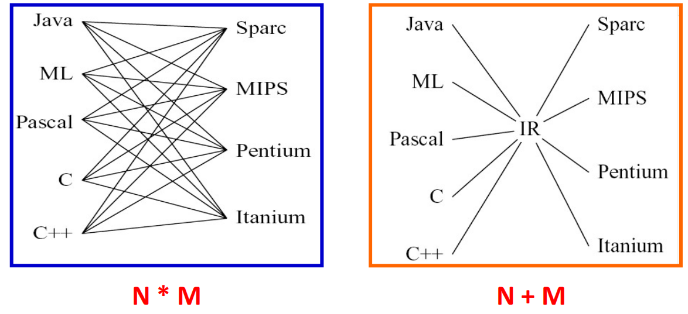

降低复杂性，提升复用性（hinders **modularity**, hinders **portability**）

**三地址码 TAC**

核心特点是每条指令最多只包含一个运算符和三个“地址”

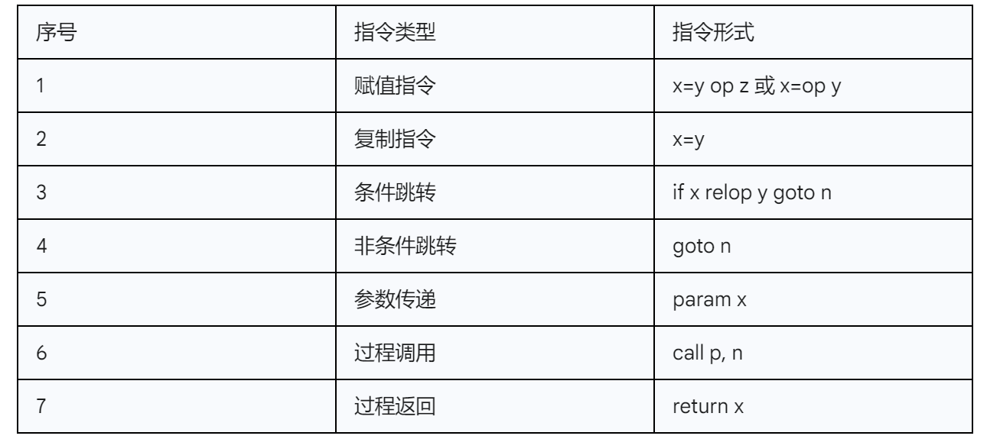

例子：

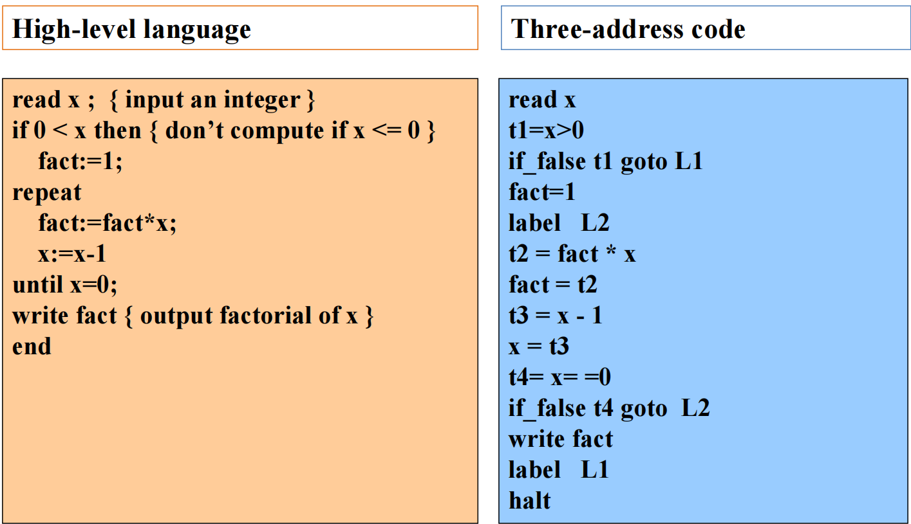

## 7.2 树形中间表示

中间表示在抽象语法树（AST）和底层汇编指令之间取得一个平衡点。一方面，它像AST一样保留了程序的层次化结构；另一方面，它的节点所代表的操作又非常接近于目标机器的指令，比如内存访问、二元运算等。

IR Tree由两大类节点构成

- 用于计算值的**表达式（Expression, Exp）**
- 用于执行动作的**语句（Statement, Stmt）**

文法描述：

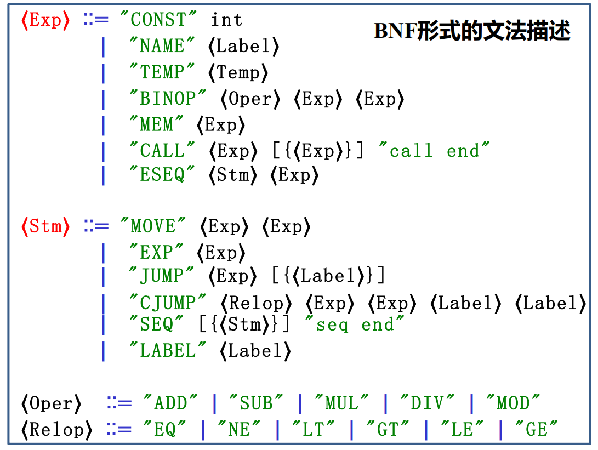

### 7.2.1 表达式

| 节点 (Node) | 功能描述 (Description) | 示例 (Example) |
| :--- | :--- | :--- |
| CONST(i) | 整数常量i | CONST(42) → 值为42 |
| NAME(n) | 符号常量n，通常是一个代码标签（Label），其值为该标签的内存地址 | NAME(L1) → 标签L1的地址 |
| TEMP(t) | 临时变量t，可以看作是一个虚拟寄存器，在寄存器分配前我们不关心其数量 | TEMP(t123) → 临时变量t123中存储的内容 |
| BINOP(o,e1,e2) | 对两个子表达式e1和e2应用二元操作o（如加减乘除、位运算等） | BINOP(PLUS, TEMP(t1), CONST(1)) → 计算 t1 + 1 |
| MEM(e) | 访问内存，e是一个计算地址的表达式，MEM节点既可以表示从内存加载数据（fetch），也可以表示向内存存储数据（store），`MEM(e)`在左边就是写，在右边就是取 | MEM(TEMP(fp)) → 访问帧指针fp所指向地址的内存内容 |
| CALL(f,l) | 调用函数f，参数列表为l，f通常是一个NAME节点，l是Exp节点的列表 | CALL(NAME(print),[TEMP(t1)]) → 调用 print(t1) |
| ESEQ(s,e) | 顺序组合，先执行语句s（为了其副作用），然后计算表达式e并返回其结果 | ESEQ(MOVE(TEMP(t), CONST(1)), TEMP(t)) → (t=1; t)，整个表达式的结果是t的值，即1 |

**ESEQ的理解和副作用：**

- `s`可能会影响`e`的结果，导致有时候不可交换

- ESEQ解决了在一个以“表达式求值”为核心的树状结构中，如何优雅地嵌入“产生副作用的语句”
- **副作用（Side effects）** 是指在计算表达式之外，对程序状态产生的任何可观察的改变，最常见的就是修改某个内存单元或临时变量（寄存器）的值
- a=5这个赋值操作，其主要目的就是产生副作用（改变a的值），它本身不返回值
- ESEQ(s, e)的语义是：先执行语句s，s的执行是为了其副作用，s本身不返回值。执行完s后，再计算表达式e，整个ESEQ节点的值就是e的值
    - 例如，ESEQ(MOVE(TEMP(a), CONST(5)), BINOP(PLUS, TEMP(a), CONST(5)))，会先执行MOVE语句使a的值变为5，然后计算a+5，最终整个表达式的结果是10

### 7.2.2 语句

用于执行动作、改变状态或控制程序的执行流程，它们本身不返回任何值

| 节点 (Node) | 功能描述 (Description) | 示例 (Example) |
| :--- | :--- | :--- |
| MOVE(d,s) | 将源表达式s计算出的值，移动到目标位置d；d通常是TEMP或MEM节点，如果是MEM节点，表达式通常为MOVE(MEM(e1), e2)形式 - 计算e1，得到地址a，再计算e2，放入地址a | MOVE(TEMP(t1), CONST(42)) → t1 = 42 |
| EXP(e) | 计算表达式e，但完全忽略并丢弃其计算结果，这通常是为了利用e的副作用 | EXP(CALL(NAME(print),...)) → 调用print()函数，不关心其返回值，只为了其打印效果 |
| JUMP(e,labs) | 无条件跳转，跳转到由表达式e计算出的地址，e通常是一个NAME节点 | JUMP(NAME(L1), [L1]) → goto L1 |
| CJUMP(o,e1,e2,t,f)| 条件跳转，比较e1和e2（使用关系操作o），如果结果为真，则跳转到标签t；否则，跳转到标签f | CJUMP(LT, TEMP(t1), CONST(0), L1, L2) → if t1 < 0 goto L1 else goto L2 |
| SEQ(s1,s2) | 语句序列，按顺序先执行语句s1，然后执行语句s2 | SEQ(MOVE(...), JUMP(...)) → 先执行一个赋值语句，再执行一个跳转语句 |
| LABEL(n) | 定义标签，将符号名n的值定义为当前指令在内存中的地址，它作为跳转指令的目标。 | LABEL(L1) → 定义一个名为L1的标签，相当于汇编中的 L1: |

*Name是使用这个symbol，比如goto .L，而Label是定义这个symbol，即.L*

### 7.2.3 例子

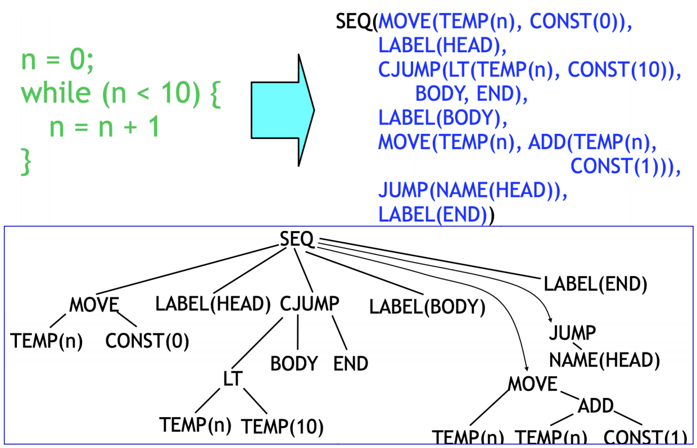

- 最外层的`SEQ`节点将整个代码块串联起来
- `MOVE(TEMP(n), CONST(0))`：对应循环前的初始化 `n := 0`
- `LABEL(HEAD)`：定义了循环开始的标签，作为循环判断和返回的锚点
- `CJUMP(LT, TEMP(n), CONST(10), BODY, END)`：这是循环的核心判断。如果 `n < 10` 为真，跳转到`BODY`标签；否则，跳转到`END`标签，退出循环
- `LABEL(BODY)`：定义了循环体的入口
- `MOVE(TEMP(n), BINOP(ADD, TEMP(n), CONST(1)))`：这是循环体的内容，对应 `n := n + 1`
- `JUMP(NAME(HEAD))`：循环体执行完毕后，无条件跳转回`HEAD`标签，进行下一次循环判断
- `LABEL(END)`：定义了循环结束后的代码位置

## 7.3 翻译到IR Trees

我们的翻译以tiger文法为例：

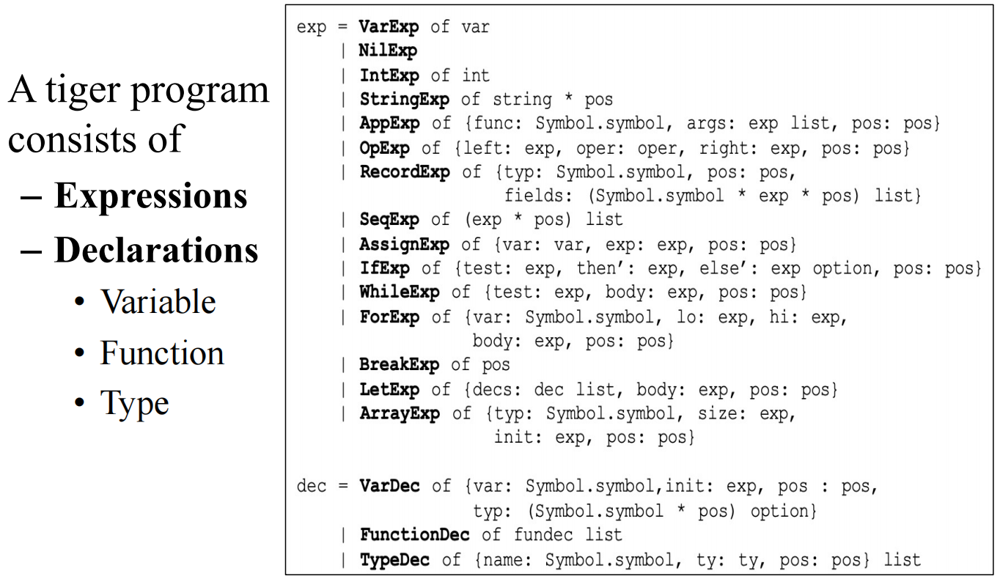

### 7.3.1 翻译框架

我们将AST表达式分为以下三类：

- **`Ex`** - 一个能够计算出结果值的表达式
    - 它应该被翻译成一个`Tree.exp`节点
    - 例如`a + b`
- **`Nx`** - 一个不产生任何结果值的语句
    - 它应该被翻译成一个`Tree.stmt`节点
    - 例如赋值语句 `a := b` 或一个 `while` 循环
- **`Cx`** - 一个用于控制流程的条件表达式
    - 它不直接计算出0或1，而是被翻译成一个能够根据条件真假跳转到不同目标标签的`Tree.stm`
    - 最典型的例子就是 `CJUMP`

转换：例如，当`if`语句需要一个条件（`Cx`），而我们提供了一个`x+1`（`Ex`）时，`Ex -> Cx`的转换会自动将`x+1`的结果与0比较，生成一个`CJUMP`。反之，当赋值语句需要一个值（`Ex`），而我们提供了一个`x>0`（`Cx`）时，`Cx -> Ex`的转换会生成一段代码，使用一个临时变量，当条件为真时给它赋值1，为假时赋值0，最后返回这个临时变量。

### 7.3.2 翻译简单变量和数据结构

**简单变量访问**

在函数中访问一个局部变量，实际上是访问它在当前函数**栈帧（Stack Frame**中的存储位置，我们通过一个特殊的寄存器——**帧指针（Frame Pointer, `fp`）**来定位当前的栈帧。

因此，访问一个距离帧指针偏移量为`k`的局部变量`v`，其IR Tree表示为 ：  

$MEM(BINOP(PLUS,TEMP(fp),CONST(k)))$

这棵树的含义是：取`fp`寄存器的值，加上常量偏移`k`，得到变量的实际内存地址，然后通过`MEM`节点访问该地址的内容。

静态链接：

对于支持嵌套函数的语言，一个内部函数可能需要访问定义在外部函数中的变量，这通过**静态链接（Static Link）**实现。访问一个嵌套层级为`n`的变量，需要沿着静态链进行`n`次解引用，其IR Tree会形成一个嵌套的`MEM`结构： 

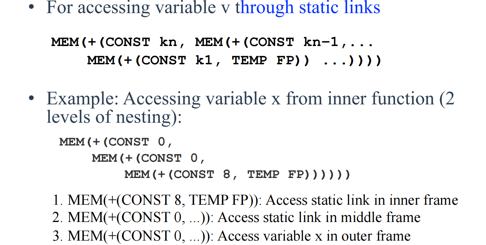

这表示从当前帧指针`fp`开始，首先找到指向外层函数栈帧的静态链接，然后一层层回溯，直到找到目标变量所在的栈帧，最后加上变量在该帧内的偏移量`k_x`来访问它。

**R值与L值 (R-Values and L-Values)**

- **R值 (R-value)**：指表达式的“值”，通常出现在赋值号的右边，如 `a+3`。它是一个可以被计算但不能被赋值的量。
- **L值 (L-value)**：指一个可被赋值的“内存位置”，通常出现在赋值号的左边，如变量`x`、数组元素`a[i]`。它也可以出现在右边，此时表示该位置存储的“内容”。

在IR Tree中，`MEM`节点的角色由其上下文决定：

- 当作为`MOVE(d, s)`语句的目标`d`时，`MEM(...)`代表一个**L值**，表示要向这个内存地址**存入（Store）**数据
- 当出现在其他任何地方时，`MEM(...)`代表一个**R值**，表示要从这个内存地址**取出（Fetch/Load）**数据

不同语言对L值的处理方式有很大差异：

- **标量L值 (Scalar L-value)**：L值所代表的内存位置只包含一个不可再分的数据单元（如一个整数或一个指针）。Tiger语言的设计极大地简化了翻译，因为它规定**所有变量都是标量**。数组和记录变量本身只存储一个**指针**，这个指针是标量。
- **结构化L值 (Structured L-value)**：L值代表一块包含多个组成部分的内存区域，例如C语言中的结构体或Pascal中的数组。对结构化L值的赋值（如 `struct1 = struct2`）意味着要拷贝整个数据结构的内容，而不仅仅是一个指针。

Tiger的“一切皆为标量指针”的设计哲学，意味着赋值操作永远是简单的单字（word-sized）拷贝，`MEM(e)`足以完成所有访存操作。而对于支持结构化L值的语言，编译器在生成IR时必须考虑数据的大小和对齐，可能需要生成特殊的块拷贝（block move）指令。

**算术运算**

算术运算的翻译相对直接：

- **二元运算**：源语言中的加减乘除等二元运算符，直接映射到`BINOP(op, e1, e2)`节点
- **一元运算**：IR Tree中没有专门的一元运算节点，一元运算需要被转换为等价的二元运算
    - 一元取负 `-x` 被翻译为 `BINOP(MINUS, CONST(0), e_x)`，即 `0 - x`
    - 一元按位取反 `~x` 被翻译为 `BINOP(XOR, e_x, CONST(-1))`，即 `x XOR 0xFF..FF`

---

**数组下标`a[i]`访问**

数组和记录变量本身都是指针，访问数组元素`a[i]`需要两步：首先获取数组的基地址，然后计算元素的偏移地址。其IR Tree结构如下：

$MEM(BINOP(PLUS,MEM(e_a),BINOP(MUL,e_i,CONST(W))))$

解释：

1. `e_a`是表示变量`a`的表达式，通常是 `MEM(+(TEMP(fp), CONST(k_a)))`
2. `MEM(e_a)`：**第一次`MEM`访问**。这是为了解引用指针，获取存储在变量`a`中的值，也就是数组在堆上的**基地址**
3. `e_i`是计算索引`i`的表达式
4. `BINOP(MUL, e_i, CONST(W))`：计算索引偏移。将索引`i`乘以每个元素的大小`W`（Word size，例如4字节）
5. `BINOP(PLUS,...)`：将基地址和索引偏移相加，得到目标元素的最终内存地址
6. 最外层的`MEM(...)`：**第二次`MEM`访问**。访问上一步计算出的最终地址，获取或存入元素的值

**记录字段`r.f`访问**

记录字段的访问与数组类似，但偏移量是固定的。如果字段`f`是记录的第`n`个字段（从0开始），其偏移量就是`n * W`。翻译结果为 ：  

$MEM(BINOP(PLUS,MEM(e_r),CONST(n∗W)))$

这里的`MEM(e_r)`同样是用于获取记录在堆上的基地址。

### 7.3.3 翻译控制流相关语句

**`if-else`语句**

一个`if test then stmt1 else stmt2`语句会被翻译成如下结构的IR Tree ：

```
SEQ(CJUMP(op, e1, e2, t, f),
    SEQ(LABEL(t),
        SEQ(stm1,
            SEQ(JUMP(NAME(join)),
                SEQ(LABEL(f),
                    SEQ(stm2,
                        LABEL(join)))))))
```

解释：

1. `CJUMP(...)`：对`test`表达式进行翻译，生成条件跳转。如果为真，跳到`t`标签（`then`分支的入口）；如果为假，跳到`f`标签（`else`分支的入口）
2. `LABEL(t)` 和 `stm1`：`then`分支的代码
3. `JUMP(NAME(join))`：`then`分支执行完毕后，无条件跳转到`join`标签，跳过`else`分支
4. `LABEL(f)` 和 `stm2`：`else`分支的代码
5. `LABEL(join)`：`then`和`else`分支的汇合点，程序从这里继续往下执行

**逻辑运算符的短路求值**

- AND：
    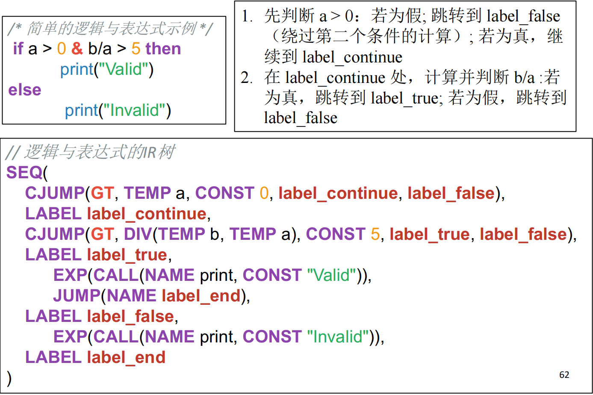
- OR：
    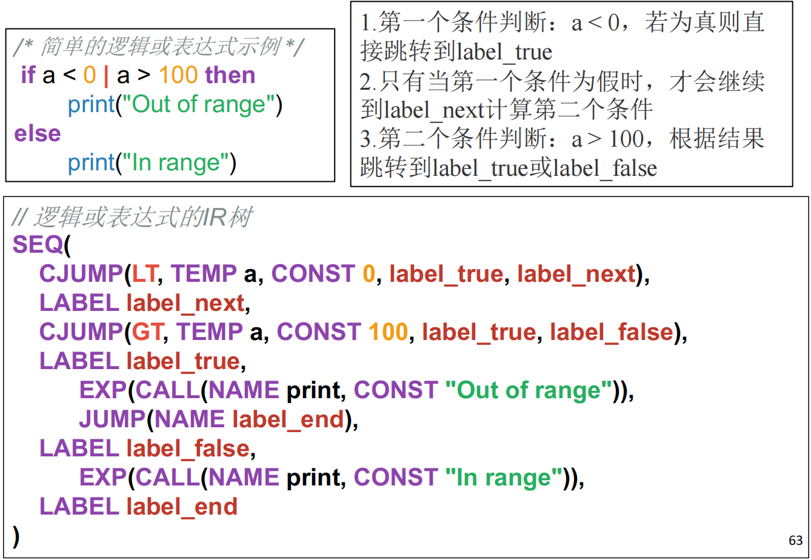

**`while`循环**

基本框架：

```
SEQ(LABEL(test),
    SEQ(CJUMP(..., body, done),
        SEQ(LABEL(body),
            SEQ(body_stm,
                SEQ(JUMP(NAME(test)),
                    LABEL(done))))))
```

1. `LABEL(test)`：循环判断的入口
2. `CJUMP(...)`：对循环条件进行判断，若为真跳到`body`，否则跳到`done`退出循环
3. `LABEL(body)` 和 `body_stm`：循环体的代码
4. `JUMP(NAME(test))`：循环体执行完后，无条件跳回`test`进行下一次判断
5. `LABEL(done)`：循环的出口

有`break`则直接跳转到`done`

例子：

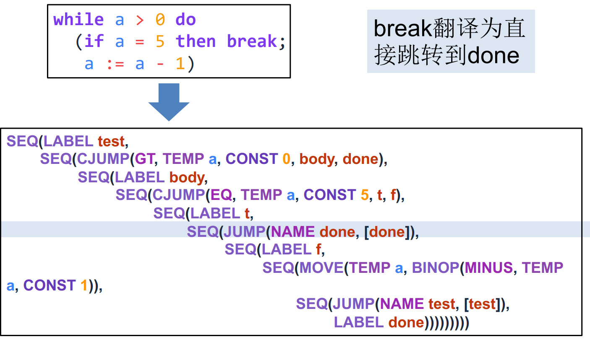

**`for`循环**

转换为`while`循环

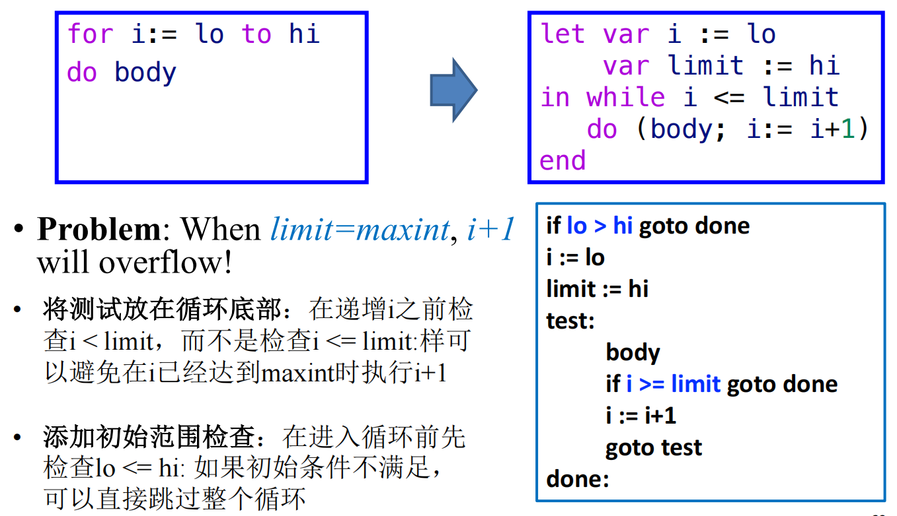

### 7.3.4 函数翻译

**函数调用**

翻译一个函数调用`f(a1,..., an)`，除了要处理所有参数表达式的求值外，一个关键点是处理支持嵌套函数所必需的**静态链接（Static Link）**，翻译结果为：

$CALL(NAME(l_f),[sl,a_1,...,a_n])$

- 这里的`sl`就是静态链接
- 它是一个隐藏的、额外的参数，指向**调用者**的**静态父级**函数的栈帧
- 当一个内层函数需要访问外层函数中定义的非局部变量时，它就通过静态链接（以及可能由多个静态链接组成的静态链）逐层回溯，找到定义该变量的栈帧，并从中读取数据 

**函数声明**

1. **序言 (Prologue)**：函数开始执行前的一系列准备工作
      - 放置函数标签，使其可以被调用
      - 调整栈指针（`sp`），为当前函数分配新的栈帧
      - 将返回地址、旧的帧指针（`fp`）以及任何需要由被调用者保存的寄存器（callee-save registers）压入栈中，以便函数返回时恢复
      - 处理传入的参数，包括将静态链接保存到当前栈帧的特定位置
2. **函数体 (Body)**：这是函数的核心逻辑。我们将函数内的表达式（在Tiger中，函数体就是一个表达式）翻译成IR Tree 。  
3. **尾声 (Epilogue)**：函数返回前的一系列清理工作
      - 将函数的返回值（如果有的话）移动到约定的返回值寄存器中（如`eax`）
      - 从栈中恢复之前保存的被调用者保存寄存器、旧的帧指针和返回地址
      - 重置栈指针，释放当前函数的栈帧
      - 执行返回指令，跳转到之前保存的返回地址，将控制权交还给调用者
