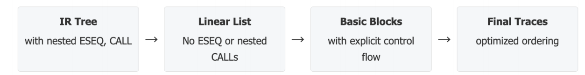
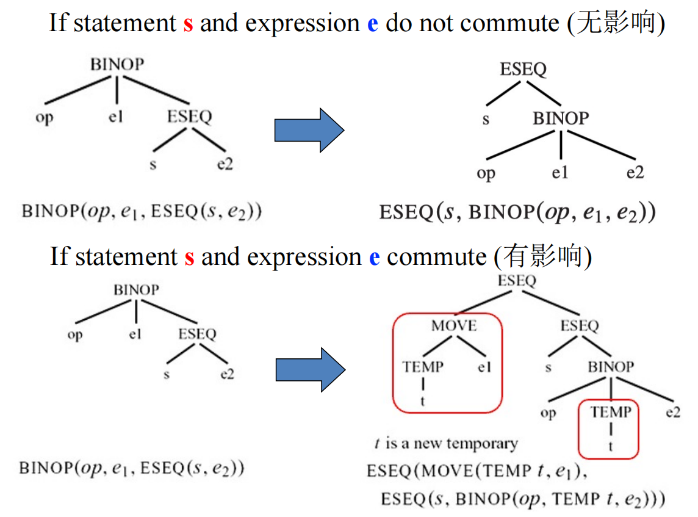
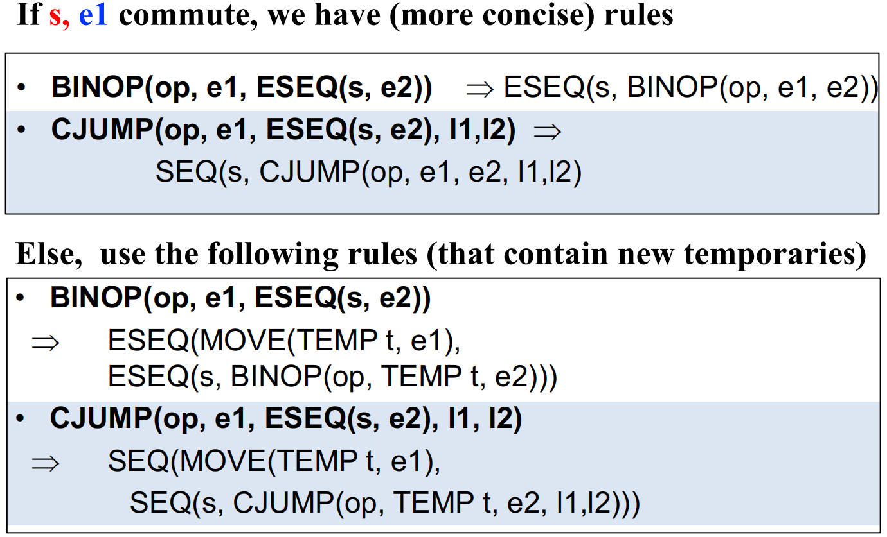
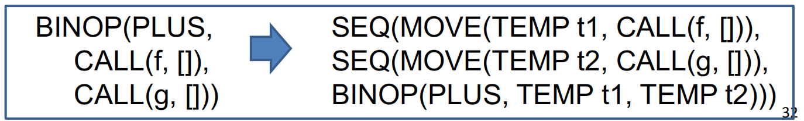
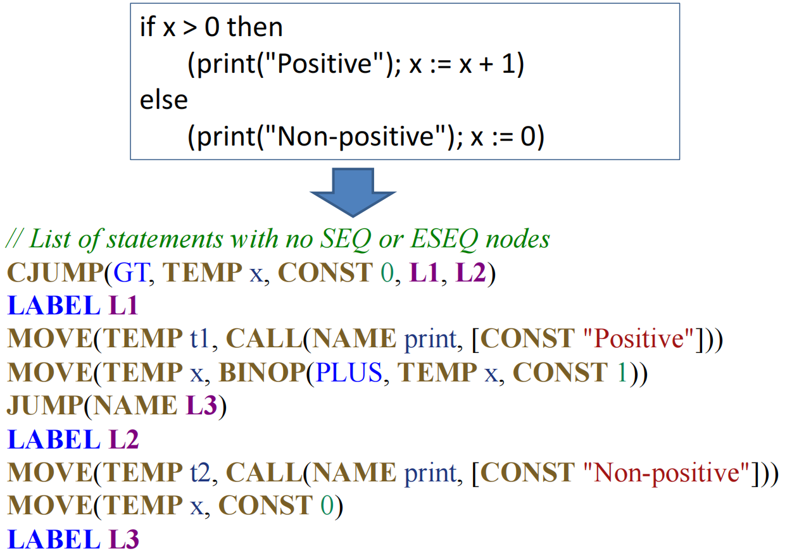
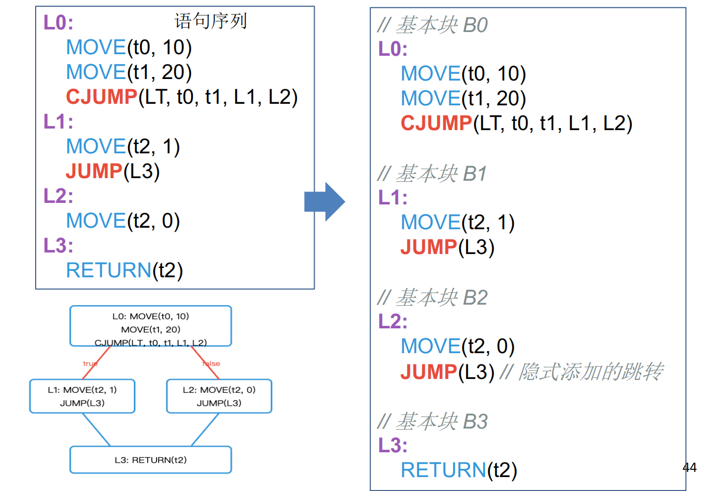
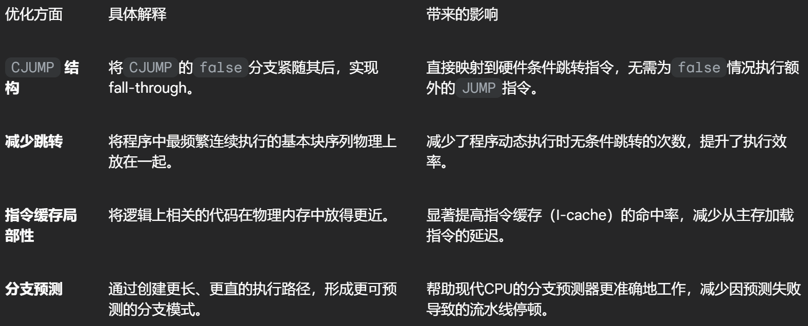
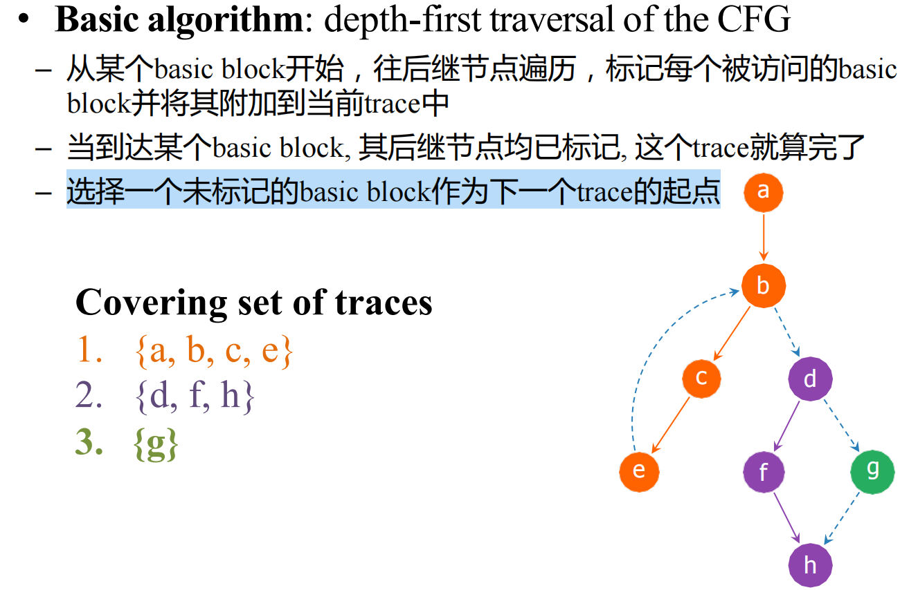
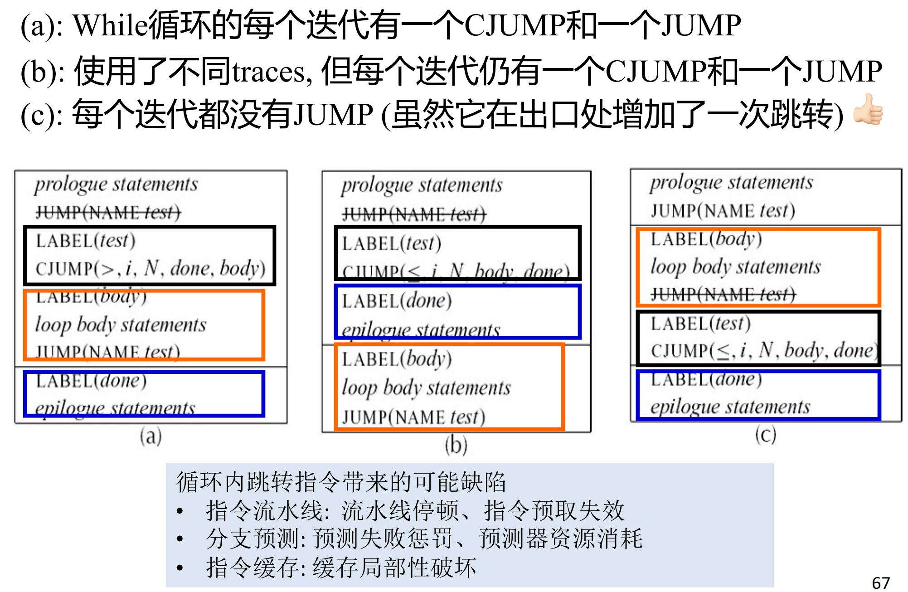

# 8 Basic Blocks and Traces

参考资料：

- 姚培森老师2024~2025学年春夏ch8ppt
- [wcjj的笔记](https://shiseab.github.io/notebook/Compiler/ch8/)
- [伟大的Gemini 2.5 pro deep research](https://docs.google.com/document/d/1shRRQEoZW_99KdioAKMHg1VUHOrEhzdgoVjLMRt8W3g/edit?usp=sharing)

---

## 8.1 规范形式

要将复杂的树形IR转换成一种更简单、更清晰、更接近机器本质的表达形式：一个没有嵌套控制流、由纯粹语句构成的线性序列，因为是IR与真实机器指令集之间存在三大根本性“不匹配”问题：

1. **`CJUMP`**
      - 在我们的树形IR中，条件跳转指令 CJUMP(cond, trueLabel, falseLabel) 能够根据条件的真假，直接跳转到两个不同的目标标签。
      - 然而，真实硬件的条件跳转指令（如x86架构的 JG 或 JZ）通常遵循一种“失败则直行”（fall-through）的模式：当条件为真时跳转到指定标签，当条件为假时则顺序执行紧随其后的下一条指令。
2. **`ESEQ`**
      - ESEQ(s, e) 节点（Expression Sequence）允许我们将一个可能产生副作用的语句 s 嵌入到一个表达式 e 的求值过程中。
            - 例如，在 BINOP(PLUS, TEMP a, ESEQ(MOVE(TEMP a, 5), v)) 中，MOVE 语句修改了临时变量 a 的值。这导致子表达式的求值顺序会直接影响最终结果，严重破坏了表达式求值的“纯粹性”和可预测性。
3. **`CALL`** - 当一个函数调用（`CALL`）作为另一个函数调用的参数时，例如 `CALL(f, [e1, CALL(g, [e2,...])])`：
      - **寄存器冲突:** 许多体系结构（如ARM64）的调用约定规定，函数的第一个参数和返回值都使用同一个寄存器（例如X0），在上述例子中，`CALL(g,...)` 执行后，其返回值会存入X0寄存器，这可能会覆盖掉先前为调用 `f` 而准备在X0寄存器中的第一个参数 `e1` 的值
      - **状态副作用:** `g` 函数的执行远不止返回一个值，它还可能修改全局变量、改变堆内存状态等，如果 `e1` 的计算依赖于这些可能被 `g` 改变的状态，那么 `e1` 的最终值将取决于它是在 `g` 调用之前还是之后被计算，这引入了不确定性

## 8.2 线性化

经过线性化处理后，我们得到的中间产物被称为“规范树”（Canonical Trees），满足以下两个核心属性：  

1. **无 `SEQ` 或 `ESEQ` 节点：** 所有的语句都被“提升”到了顶层，形成一个扁平的列表。程序中不再存在任何形式的嵌套语句序列，这使得指令的执行顺序一目了然。
2. **`CALL` 的父节点约束：** 每个 `CALL` 节点的父节点必须是以下两种情况之一：
      - `EXP(...)`：当函数调用仅为了其副作用（例如，打印输出、修改全局状态）而不需要其返回值时。
      - `MOVE(TEMP t,...)`：当函数调用的返回值需要被使用时，它必须被立即存入一个专用的临时变量 `t` 中。

### 8.2.1 消除`ESEQ`

#### 8.2.1.1 基本规则

- **合并副作用:** `ESEQ(s1, ESEQ(s2, e))` 可以被重写为 `ESEQ(SEQ(s1, s2), e)`。这个规则将两个连续的副作用语句 `s1` 和 `s2` 合并成一个单一的语句序列 `SEQ(s1, s2)` 。  
- **提升 `ESEQ`:**
    - `BINOP(op, ESEQ(s, e1), e2)` ⇒ `ESEQ(s, BINOP(op, e1, e2))`
    - `MEM(ESEQ(s, e1))` ⇒ `ESEQ(s, MEM(e1))`
    - `JUMP(ESEQ(s, e1))` ⇒ `SEQ(s, JUMP(e1))`
    - `CJUMP(op, ESEQ(s, e1), e2, l1, l2)` ⇒ `SEQ(s, CJUMP(op, e1, e2, l1, l2))`

当`ESEQ` 位于一个其求值顺序相对独立的位置时（例如 `BINOP` 的左操作数），其副作用语句 `s` 可以安全地提到整个表达式之前执行，而不会影响其他部分。

#### 8.2.1.2 交换性 Commutativity

然当 `ESEQ` 出现在 `BINOP` 的右操作数，即 `BINOP(op, e1, ESEQ(s, e2))` 时，我们不能再像之前那样简单地将`s` 提升到整个 `BINOP` 之前。

根本原因在于求值顺序的依赖性：`e1` 必须在 `s` 之前求值，而 `s` 又必须在 `e2` 之前求值。如果强行将 `s` 提升，它的副作用就可能污染 `e1` 的计算环境，导致错误的结果。

例如，考虑 `s = MOVE(MEM(x), y)` 和 `e1 = MEM(x)`，如果先执行 `s`，`e1` 读取到的值将是 `y`，而正确的语义要求 `e1` 读取 `x` 处原有的值 。

为了解决这个问题，引入“交换性”（Commutativity）：

- **可交换（Commuting）：**如果语句 `s` 的执行**绝对不会**影响表达式 `e1` 的值，我们就称 `s` 和 `e1` 是可交换的。在这种情况下，我们可以安全地重排它们的执行顺序，即将 `s` 提升到 `e1` 之前。
      - **重写规则:** `BINOP(op, e1, ESEQ(s, e2))` ⇒ `ESEQ(s, BINOP(op, e1, e2))` 。  
- **不可交换（Non-commuting）：**如果语句 `s` **可能**影响 `e1` 的值，或者我们无法静态地证明它不影响（保守策略），我们就必须严格维持 `e1` -> `s` -> `e2` 的求值顺序。
      - **重写规则:** `BINOP(op, e1, ESEQ(s, e2))` ⇒ `ESEQ(MOVE(TEMP t, e1), ESEQ(s, BINOP(op, TEMP t, e2)))` 。  

其他重写的例子：

### 8.2.2 提升`CALL`

立即将函数调用的结果保存到一个全新的、唯一的临时变量中：

- **核心重写规则:** `CALL(fun, args)` ⇒ `ESEQ(MOVE(TEMP t, CALL(fun, args)), TEMP t)` 。  

经过这个转换，原先的 `BINOP(PLUS, CALL(f,), CALL(g,))` 会被转换成一个等价的、线性的指令序列，彻底解决了寄存器冲突问题 ：  

当然，如果一个 `CALL` 节点本身已经处于规范形式（即其父节点是 `EXP` 或 `MOVE`），则无需进行转换 。

### 8.2.3 展平`SEQ`

经过消除 `ESEQ` 和规范化 `CALL` 之后，我们的IR会变成由 `SEQ` 节点连接起来的结构，形如 `SEQ(s1, SEQ(s2, SEQ(s3,...)))` 。

最后一步非常简单，就是利用`SEQ` 节点的结合律 `SEQ(SEQ(a, b), c) = SEQ(a, SEQ(b, c))`，将这种嵌套结构“展平”，形成一个逻辑上的语句列表：`s1, s2, s3,...`。

**一个线性化的例子：**

## 8.3 基本块与Traces的构建

线性化之后，`CJUMP`指令与真实机器指令之间的不匹配问题依然存在。

我们通过构建Basic Blocks和Traces来解决这个问题，其最终目标是重新编排代码，使得每个 `CJUMP(cond, lt, lf)` 指令都能紧随其 `false` 分支标签 `LABEL(lf)`，从而实现高效的“失败则直行”。

### 8.3.1 Basic Blocks

**定义**

在进行代码重排之前，我们首先需要将线性的指令流切分成若干个有意义的、不可分割的单元**basic block**。

一个基本块是一段连续的指令序列，它必须严格满足以下三个属性：

1. **单一入口：**控制流只能从该块的第一条指令进入
2. **单一出口：**控制流只能从该块的最后一条指令离开
3. **内部无跳转：**除了块的第一条指令和最后一条指令外，块的内部不允许包含任何其他`LABEL`或跳转指令

这一定义保证了只要基本块的第一条指令被执行，块内的所有指令就必然会按顺序依次执行，直到最后一条。

**算法**

从指令列表的头部开始遍历：

1. 每当遇到一个`LABEL`指令，它标志着一个新基本块的开始。如果当前正在构建一个块，则该块在此`LABEL`之前结束。
2. 每当遇到一个`JUMP`或`CJUMP`指令，它将是当前块的最后一条指令。执行完该指令后，当前块结束。
3. **补充跳转**
      - 如果一个块的结束不是因为跳转指令（例如，它的下一条指令是一个 `LABEL`），编译器会自动在该块末尾添加一个指向下一个块起始标签的无条件 `JUMP` 指令，以确保控制流的明确性。
4. **补充标签**
      - 如果一个块的开始没有 `LABEL`（例如，程序的入口点），编译器会为其生成一个新的 `LABEL`。

通过这个算法，任何一段线性代码都可以被唯一地划分成一组基本块和它们之间的跳转关系，这些关系共同构成了程序的“控制流图”（Control Flow Graph, CFG），其中节点是基本块，边是跳转。

### 8.3.2 Traces

**定义**：一个由基本块组成的序列，它代表了程序在运行时一条可能的、连续的执行路径

**目标**：找到一组Traces，它们能够覆盖CFG中的所有基本块，每个块恰好属于一个Trace

**好处**：

**算法**：贪心算法

将程序中所有的基本块放入一个待处理的集合 `Q` 中，所有块初始为“未标记”状态，只要 `Q` 中还存在未标记的块，就重复以下步骤：

1. **选择起点：**从 `Q` 中任意选择一个未标记的块 `b`，开始一条新的、空的Trace。
2. **延伸Trace:**
      - 将块 `b` 标记为“已处理”，并将其追加到当前Trace的末尾。
      - 检查 `b` 的后继块。在所有未被标记的后继中，选择一个来继续延伸Trace。
            - **选择策略**：这里的选择是启发式的，一个非常有效的策略是**优化常见情况**：
                  - 对于以 `CJUMP(cond, lt, lf)` 结尾的块，优先选择其 `false` 分支 `lf` 作为下一个块，因为我们希望 `lf` 成为fall-through路径。
                  - 对于以 `JUMP(l)` 结尾的块，唯一的选择就是 `l`。
      - **结束Trace：**如果块`b`的所有后继块都已经被标记过了（即它们已属于其他Trace），那么当前Trace的延伸就此结束。

回到第2步，从 `Q` 中寻找下一个未标记的块，开始构建下一条Trace，直到所有块都被标记。

**例子**：

**最后的`CJUMP`修整**

1. 理想情况：`CJUMP` 紧随其 `false` 标签 - `CJUMP(cond, lt, lf)` 指令之后紧跟着 `LABEL lf`，无需任何操作

2. 条件相反情况：`CJUMP` 紧随其 `true` 标签 - `CJUMP(cond, lt, lf)` 指令之后紧跟着 `LABEL lt`：
      - **反转条件并交换标签**：将原指令改写为 `CJUMP(negate(cond), lf, lt)`

3. 完全不匹配情况：`CJUMP` 之后既非 `true` 也非 `false` 标签
      - **引入新标签和无条件跳转**：
            1. 创建一个全新的、唯一的标签，例如 `lf_new`
            2. 将原指令修改为 `CJUMP(cond, lt, lf_new)`
            3. 在 `CJUMP` 指令之后，立刻插入 `LABEL lf_new`，并在其后紧跟一条无条件跳转指令 `JUMP(NAME lf)`

**Optimal Traces评估**

1. 热点路径优先 (Hot Path Prioritization)
2. 局部性增强 (Locality Enhancement) - 将逻辑上相关、可能会被连续访问的代码块在内存中也放得彼此靠近
3. 跳转最小化 (Jump Minimization) - 在程序最常见的执行路径上（例如循环内），尽可能地减少无条件跳转

例子：

