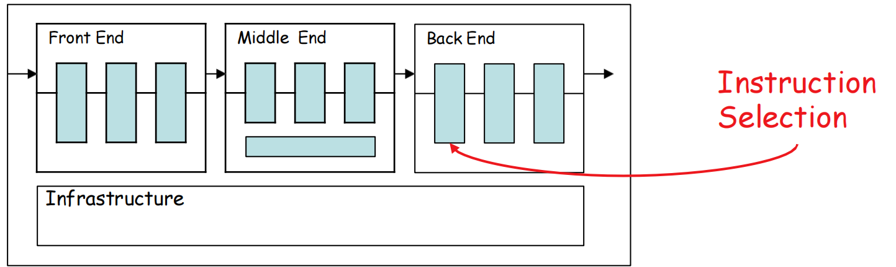
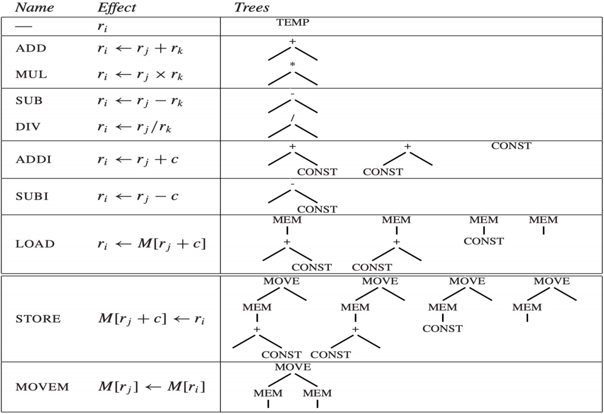
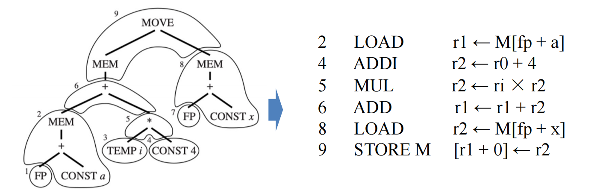
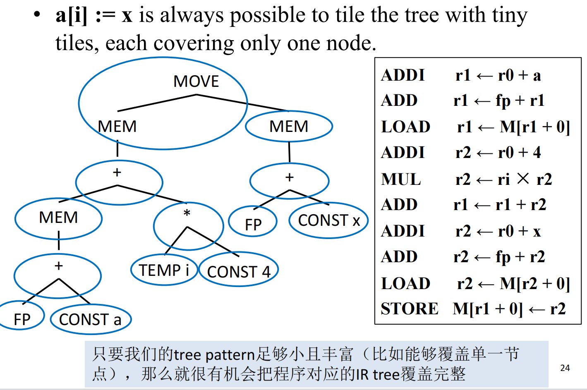
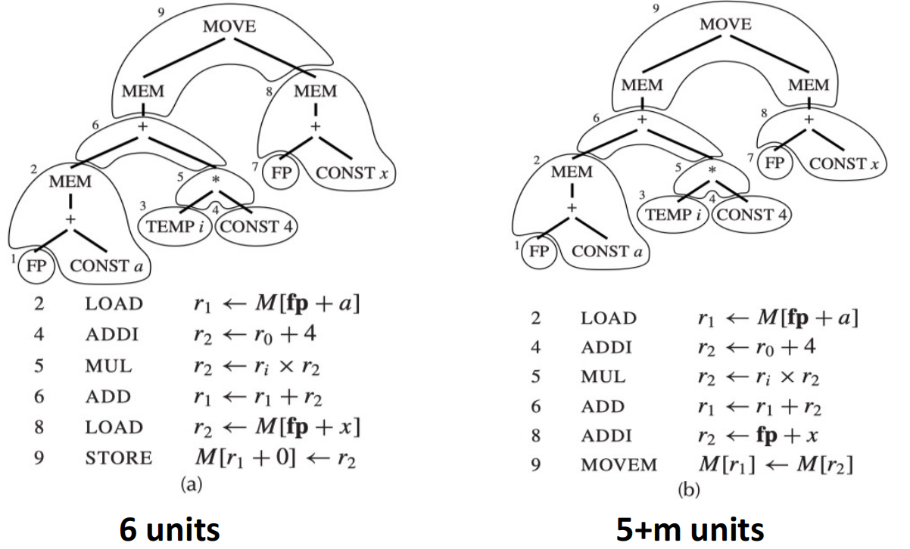
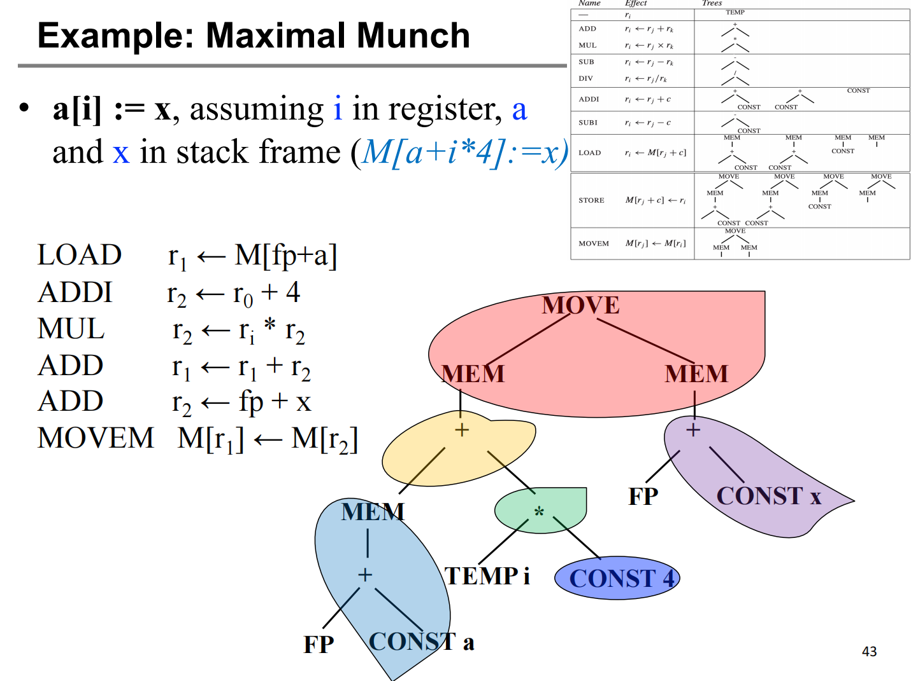
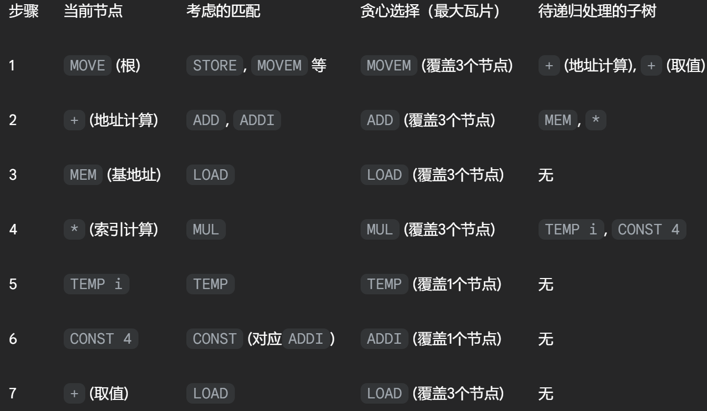
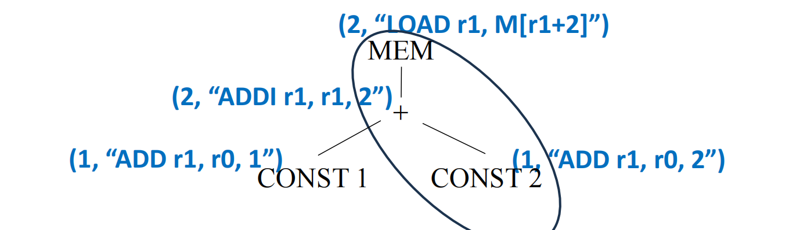
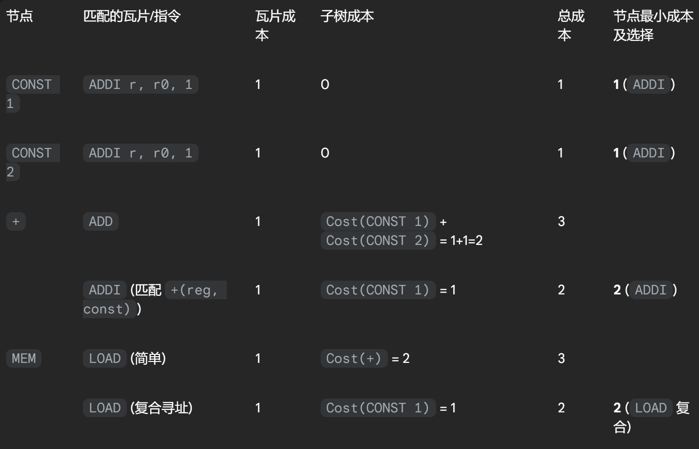
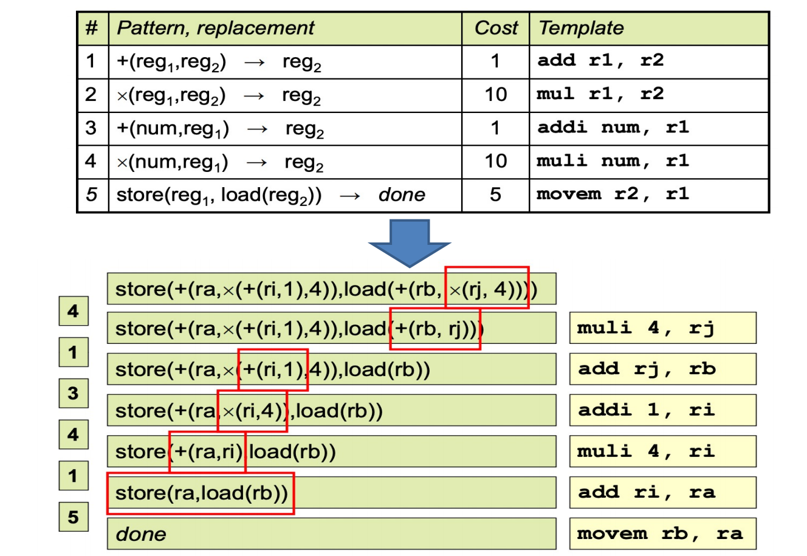

# 9 Instruction Selection 指令选择

参考资料：

- 姚培森老师2024~2025学年春夏ch9ppt
- [wcjj的笔记](https://shiseab.github.io/notebook/Compiler/ch9/)
- [伟大的Gemini 2.5 pro deep research](https://docs.google.com/document/d/1MNkROc8ut2046zJPyHo9GNet-MSXNCAWxwlFxX9GPWM/edit?usp=sharing)

---

## 9.1 指令选择概述

指令选择阶段的任务是以排好序的规范树为输入，生成“伪汇编代码”（Pseudo-assembly Code）- 假设有无限数量的虚拟寄存器。

- 指令选择的本质，是一种形式化的**模式匹配**（Pattern Matching）
- 对于树状结构的IR而言，最自然的匹配方式就是**树覆盖**（Tree Covering）
- 用指令**完整且无重叠**地去覆盖整个IR树

### 9.1.1 Jouette架构

Jouette是一个典型的RISC（精简指令集计算机）风格的架构，其设计遵循“加载/存储”（load/store）原则，即算术运算只能在寄存器之间进行，与内存的数据交换必须通过专门的加载（`LOAD`）和存储（`STORE`）指令完成，特性如下：

- **通用寄存器文件**：拥有一组通用寄存器，可以存放数据或地址
- **零寄存器**：寄存器`r0`的值永远是0
- **单周期延迟**：为简化分析，我们假设除特殊的`MOVEM`指令外，所有指令的执行时间（延迟）都是一个时钟周期

指令集及其对应的树：

以`a[i]:=x`这条指令选择的两种方式为例：

- 只要我们的指令集中包含了能够覆盖每一种IR基础节点（如`+`, `*`, `MEM`, `CONST`等）的指令，那么我们总能保证为任何合法的IR树找到一个有效的平铺方案。这为算法的**正确性**提供了底线保障。
- 优化的目标，则是在这个基础上，通过智能地选用“大瓷砖”，找到比这个底线方案更“好”的平铺。

### 9.1.2 最优平铺 Optimal Tiling 与 最佳平铺 Optimum Tiling

我们以执行周期数作为评估成本。在Jouette架构中，我们假设大部分指令成本为1，而某些特殊指令（如`MOVEM`）可能有更高的成本。

- **最佳平铺 (Optimum Tiling)**：指一个**全局最优**的方案。在所有可能的平铺方案中，该方案的总成本是**最低的**。找到最佳平铺是指令选择的终极目标。
- **最优平铺 (Optimal Tiling)**：指一个**局部最优**的方案。在该方案中，**任何两个相邻的瓷砖都不能被合并成一个成本更低的单一瓷砖**。

这两者之间的关系是：**一个最佳平铺方案，必定也是一个最优平铺方案；但反之不成立，一个最优平铺方案，不一定是最佳的。**

## 9.2 算法

### 9.2.1 Maximal Munch 最大匹配

**思想：**

贪心（Greedy）、自顶向下（Top-down），在树的当前节点，总是选择能够匹配的、包含节点数最多的瓦片

1. 从IR树的根节点开始
2. 在当前节点，寻找能够匹配的最大的瓦片（即覆盖节点数最多的树模式），用这块瓦片覆盖对应的IR树部分
3. 对所有未被该瓦片覆盖的子树的根节点，递归地执行步骤2，直到整棵树被完全覆盖

**指令生成：**

整棵树被瓦片覆盖后，就进入了指令生成的阶段。虽然瓦片选择的过程是**自顶向下**的，但指令的生成（发射）顺序却是**后序遍历（Postorder treewalk）**的。这意味着，编译器会先为子节点（即子问题）生成指令，然后再为父节点（覆盖当前节点的瓦片）生成指令。

**例子：**

可以认为`CONST 4`需要一个额外的指令来计算，比如可能是`ADDI r2 ← r0 + 4`

### 9.2.2 Dynamic Programming 动态规划

**基本思想：**

目标是最佳平铺，采用一种**自底向上（Bottom-up）**的、基于成本计算的策略。

其核心原则是对于树中的每一个节点，计算出覆盖以它为根的子树的**最小成本**。

- 成本：考察所有能够以当前节点为根进行匹配的瓦片。对于每一个可能的瓦片，其覆盖成本等于该瓦片对应指令的自身成本，加上它所有未覆盖的子树的（已经计算出的）最小成本之和。算法会比较所有这些可能性，并为当前节点记录下那个使其总成本最小的瓦片选择。

**算法：**

1. **自底向上遍历树**：从叶子节点开始，向根节点方向处理
2. **计算节点成本**：对于当前处理的节点 `n`，执行以下操作： 
      - 找出所有能以 `n` 为根匹配的瓦片集合 `{t1, t2,...}`
      - 对每个瓦片 `ti`，计算其总成本：$Cost(t_i)=Cost(instruction_{t_i})+∑Cost(subtree_j)$，其中$Cost(subtree_j)$是子树 `j` 在前序步骤中已计算出的最小覆盖成本
      - 比较所有$Cost(t_i)$，找出其中的最小值
      - 在节点 `n` 上存储这个最小成本，以及达到这个最小成本所选择的瓦片
3. **遍历至根节点**：当根节点的最小成本计算完毕，也就找到了整棵树的最佳平铺方案

**例子：**

以`MEM(PLUS(CONST(1), CONST(2)))`为例：

整体流程如下：

**指令生成：**

- 从树的根节点开始，进行一次**前序遍历**
- 在访问每个节点时，算法首先查看之前为它记录下的最佳瓦片
- 递归地为这块瓦片的所有子节点（即那些需要预先计算结果的子树）调用代码发射函数
- 递归返回后，再发射当前瓦片所对应的指令

以上面的例子为例，发射过程如下：

1. 从根节点`MEM`开始。其最佳瓦片是 `LOAD` (复合)，该瓦片有一个子节点 `CONST 1`
2. 递归调用，为 `CONST 1` 发射代码。`CONST 1` 的最佳瓦片是 `ADDI`，它没有子节点
3. 发射指令：`ADDI r1 <- r0 + 1`
4. 从 `CONST 1` 的调用返回
5. 发射 `MEM` 节点对应的指令：`LOAD r2 <- M[r1 + 2]`

---

两个算法的评估：

- **T** - 瓦片（tile）的总种类数量
- **K** - 一个匹配的瓦片平均覆盖的节点数
- **K'** - 需要检查的最大瓦片尺寸（即最大的瓦片包含的节点数）
- **T'** - 每个树节点平均能匹配上的瓦片数量
- **N** - 输入的中间表示（IR）树中的总节点数

基于以上参数，给出了两种算法的运行时间复杂度：

- 最大匹配 (Maximal Munch) - 其时间复杂度与$\frac{(K' + T')*N}{K}$成正比
- 动态规划 (Dynamic Programming) - 其时间复杂度与$(K' + T')*N$成正比

对于一个给定的目标机器架构，K、K' 和 T' 都可以被看作是常量，因此，上述两种算法的**运行时间都是线性的**，即与输入树的大小 `N` 成正比。

### 9.2.3 Tree Grammar 基于树文法的通用方法

**核心思想**

核心动机是**自动化** 。其目标是创建指令选择器生成器。开发者不再需要用过程式的代码去实现模式匹配，而是可以用一种高层次的、声明式的语言来描述目标机器的指令集。

编译器用正则表达式来描述词法，用上下文无关文法（CFG）来描述语法。类似地，我们可以用一种特殊的**树文法（Tree Grammar）**来描述指令选择中的瓦片。

在树文法中：

- **非终结符（Nonterminals）**：通常代表一种值的“类别”，如`reg`（表示值在寄存器中）或`mem`（表示值在内存中）
- **产生式规则（Production Rules）**：每个产生式代表一个瓦片/一条指令，它描述了一个树模式（产生式的右侧）如何被归约为一个非终结符（产生式的左侧）

每个规则通常都关联三样东西：

1. 一个树模式产生式
2. 一个与该规则相关的成本
3. 一个代码生成模板或动作

例如，一条`ADD`指令可以被描述为： `reg_i -> +(reg_j, reg_k) { cost: 1, action: "add r_i, r_j, r_k" }`

这条规则的含义是：一个由根节点`+`和两个`reg`类子节点构成的树模式，可以被“归约”为一个`reg`（即计算结果存放在一个寄存器中），这个操作的成本是1，并且应该生成`add`汇编指令。

通过这种方式，整个指令选择过程就转换成了：用这套树文法去“解析”输入的IR树，并找到一个成本最低的解析（推导）过程。

这使得编译器后端更加健壮、易于维护，并且极大地简化了向新架构移植的工作——理论上，只需要为新架构编写一份新的树文法描述文件即可。像**Twig**、**BURG**以及现代编译器基础设施（如**LLVM**）中的**TableGen**工具，正是这种强大思想的实践体现。

例子：

| 编译器任务 (Compiler Task) | 方法 (Approach)                                    |
| -------------------------- | -------------------------------------------------- |
| Twig                       | 自底向上的动态规划 (Bottom-up dynamic programming) |
| BURG                       | 自底向上的重写文法 (Bottom-up rewriter grammar)    |
| LLVM TableGen              | 模式匹配表生成 (Pattern matching tablegen)         |

## 9.3 CISC vs RISC

对于RISC架构，由于指令功能单一、成本均匀，Maximal Munch这类简单的贪心算法往往就能找到接近甚至就是最佳的平铺方案。但在CISC上，“最优”与“最佳”之间的鸿沟会变得非常明显，必须动用动态规划这类更强大的算法才能获得高质量代码。

| 特性           | RISC (精简指令集)                | CISC (复杂指令集)                |
| -------------- | -------------------------------- | -------------------------------- |
| **寄存器**     | 数量多 (如32个)，通用            | 数量少 (如8-16个)，有专用类别    |
| **算术运算**   | 仅在寄存器间进行 (Load/Store)    | 可直接对内存操作数进行运算       |
| **寻址模式**   | 简单，种类少 (如`M[reg+const]`)  | 复杂，种类繁多                   |
| **指令格式**   | 通常为“三地址” (`r1 <- r2 + r3`) | 通常为“二地址” (`r1 <- r1 + r2`) |
| **指令长度**   | 固定长度 (如32位)                | 可变长度                         |
| **指令副作用** | 通常没有，一条指令一个效果       | 可能有 (如地址自增)              |

| 挑战             | 解决方案                                                     | 示例与解释                                                   |
| ---------------- | ------------------------------------------------------------ | ------------------------------------------------------------ |
| **寄存器少**     | 自由生成虚拟寄存器，完全依赖后续的寄存器分配器进行物理寄存器映射和必要的**溢出**（spill，将值存入内存）。 | 指令选择阶段不关心只有8个物理寄存器，它为每个中间结果都生成一个新的`TEMP`。 |
| **寄存器类别**   | 显式地使用`MOVE`指令在不同类别的寄存器间传递数据。           | x86的乘法指令`mul`要求一个操作数在`eax`。为计算`t2*t3`，需生成`mov eax, t2; mul t3`。 |
| **双地址指令**   | 为模拟三地址操作，引入额外的`MOVE`指令来保存被覆盖的操作数。寄希望于后续的窥孔优化或寄存器分配器能消除冗余的移动。 | 为实现`t1 <- t2+t3`而不破坏`t2`，需生成`mov t1, t2; add t1, t3`。 |
| **内存操作数**   | 设计专门的、更大的瓦片来直接匹配这些“算术+内存访问”的复合模式。 | 为`add eax, [ebx+8]`这样的指令设计一个能匹配`+(reg, MEM(...))`的复杂瓦片。 |
| **复杂寻址模式** | 创建特定的、巨大的瓦片来匹配这些复杂的地址计算模式，如`[base + index*scale + offset]`。 | 一个瓦片可能直接覆盖IR树中对应`基址+（变址*比例）+偏移`的整个子树。 |
| **指令副作用**   | 1. 忽略不用：最简单的策略。2. 特殊逻辑匹配：在代码生成器中硬编码对特殊模式（如自增寻址）的识别和处理。3. 使用更强大的算法：采用基于**DAG（有向无环图）**的覆盖算法，因为DAG能更好地表示多输出的操作。 | 自增寻址`r2 <- M[r1++]`同时修改`r2`和`r1`，它破坏了树形结构“单输出”的假设，用树覆盖难以优雅地建模。 |
