# 期中梳理

基本信息：占总评15%，考试时间4.17 - 13:25

可以带一张a4（可手写/打印），考试范围到语义分析的符号表部分

[cheating sheet](./midterm.assets/编译原理_midterm_A4_ver3.pdf)
<!--

## 考试内容

- 词法分析
- 语法分析
- 语义分析 - 符号表

## 参考资源

- 三份作业
- [咸鱼暄学长的笔记](https://xuan-insr.github.io/compile_principle/)
- [CubicYYY学长的笔记](https://cubicy.icu/compiler-construction-principles/)
- hm老师的整理
- 姚培森老师的ppt及课上的笔记
- 祖传期中A4
- 期中历年卷*8

## cheating sheet

// todo，在祖传A4的基础上改

## 面向考试的知识梳理

// todo

参考资源2345，并且同步更新祖传A4

-->

## 1 词法分析

### 1.1 概述与定义

任务：字符流 $\to$ token流

定义：

// 这里每个老师的定义好像都不太一样，不过应该不考

- token - 单词的类型，有限
    - lexeme - 词素，一个token的实例，无限（语义值也是无限的）
    - reserved words - 不能被用作identifier类型token语义值的words
- non-tokens - 例如宏定义、include、注释等等

### 1.2 实现方式

1. 先由自然语言规则通过人工描述将其变成REX
2. 把REX使用Thompson算法以自动化的形式转为NFA
3. 通过子集构造法（也是自动化的形式）转成DFA
4. 通过Hopcroft最小化算法简化DFA
5. 组合不同token类型的DFA，再通过*一个二维数组判断状态转换（state `0`是判定为不接收的状态），一个一维`finality`数组实现终止状态类型判断*实现DFA的自动执行来（不是很重要）生成词法分析器的代码

而整个实现过程中，我们会关注REX的表示方式以及第2、3、4步的三个算法。

#### 1.2.1 REX的表示方式

**优先级**

闭包>连接>选择

**简写方式**

- `[abcd]`代表`(a|b|c|d)`

- `[b-g]`代表`[bcdefg]`

- `[b-gM-Qkr]`代表`[bcdefgMNOPQkr]`

- `ε`可以被省略

- `M?`代表一个或没有

- `M+`代表至少一个

- `.`代表任意一个character（除了newline）

- `""`代表引用，只能一个一个字符
    精准匹配引用里面的内容

**REX命名**

通过$d_i \to r_i$的方式给$r_i$命名成$d_i$，并且之后可以将$d_i$视作一个character一样在REX中使用，比如：

```c++
digit -> [0-9]
number -> digit+
```

**歧义处理**

*如果所有语句都只对应一个语法树，那么这个文法没有歧义*

1. longest match 最长匹配
      - 实现方式：通过last final序列（细节见词法分析2.3.1）
2. rule priority 规则优先 - 根据规则和规则之间的优先级关系，越前面越高

#### 1.2.2 REX转NFA

**单个NFA的构造**

- 对基本的RE直接构造：$\epsilon$, $a$
    
- 对复合的RE递归构造：`st`, `s|t`, `s*`
    
- 对简化表示方式的转换：
    

**不同token类别的NFA的组合**

- 新建一个起始状态分别指向各个token类别NFA的起始状态，转换条件为𝜖
- 合并所有规则

#### 1.2.3 NFA转DFA

1. 首先列出所有状态的$\epsilon$闭包
2. 初始状态是NFA起始状态的$\epsilon-transition$的closure
3. 计算在每个新状态下在各个字符上的转移的闭包作为新的状态，转移自然成为新的转移
4. 包含原接受状态的所有新状态都是接受状态

一些算法的定义和例子：

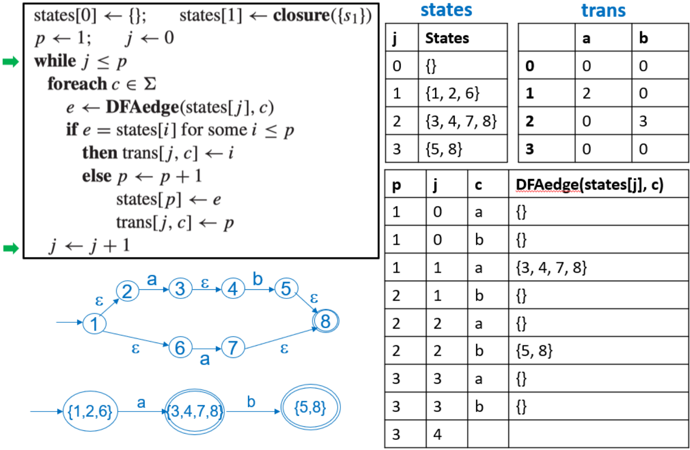

#### 1.2.4 DFA最小化

1. 划分等价类：
     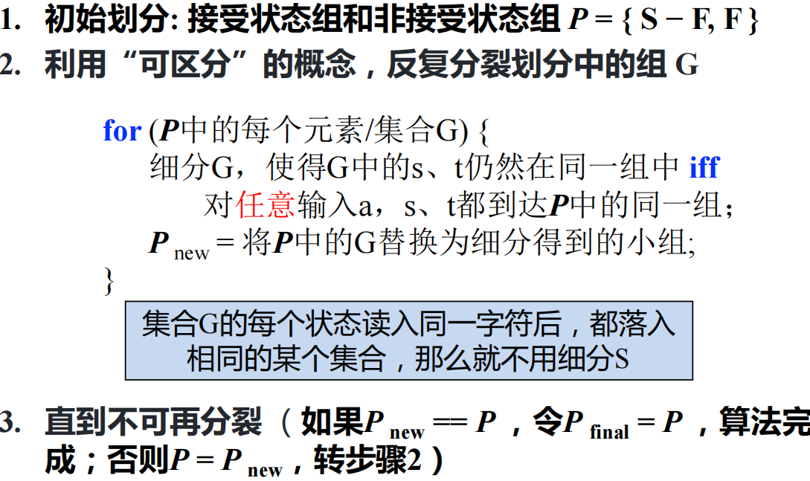
2. 重建DFA：从划分得到的等价类中选取代表，并重建DFA

## 2 语法分析

任务：token序列$\to$抽象语法树

### 2.1 定义

**EOF的解决**

添加一个新的开始符号`S'`和一个新的规则`S'->S$`

**推导和规约**

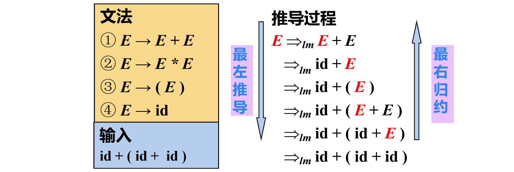

**句型、句子和语言**

- 句型：起始符号推导出来的任意串，既可以包含终结符，又可以包含非终结符，也可能是空串
- 句子：仅含终结符号的句型
- 语言：由文法推导出的所有句子构成的集合

**编程语言的文法**

编程语言的文法由于为了语法分析的高效而添加了一定的处理和限制，是任意CFG的子集。

- 消除二义性
    - “给定CFG是否无二义性”是不可判定问题，不存在通用的算法
    - 通常用于解决这个问题的方式是**分层**：
        - 运算优先级 - 根据算符不同的优先级，引入新的非终结符；越接近开始符号 S 的文法符号优先级越低
        - 运算结合性 - 左结合：而全是加法时，左边的加离根节点最远
            
    - 
- 消除左递归
    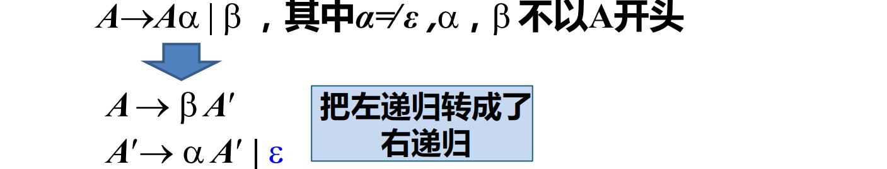
- 提左公因子
    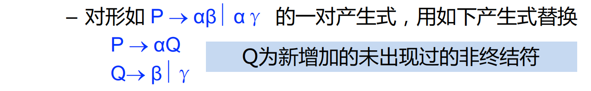

### 2.2 Top-Down - LL(1)

采用最左推导（每次优先替换最左边的非终结符），代表文法是LL(1)文法。

#### 2.2.1 First、Follow和Nullable

**Nullable集 - 一个文法对应单个集合，定义是集合内的每一个元素可以生成空串**

定义：

- Base case：𝑥→𝜖
- Inductive case：𝑋→𝑌1...𝑌𝑛，if 𝑌1...𝑌𝑛是n个非终结符且都可以生成空串

算法：根据定义递归生成寻找，结束条件是集合不再增长。

**First集 - 一个符号（终结符和非终结符）对应单个集合，定义是可以由这个符号推导得到的串的首终结符号的集合**

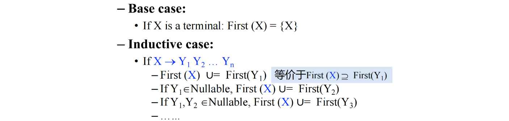

上述规则似乎是关于非终结符的，但是First是关于文法符号串（如产生式右部) 的，规则如inductive case。

**Follow集 - 一个非终结符对应单个集合，定义是从起始符号出发，可能在推导过程中跟在这个符号右边的终结符号的集合**


对于一些特殊产生式的follow集合推论：


#### 2.2.2 LL(1)算法的预测分析表

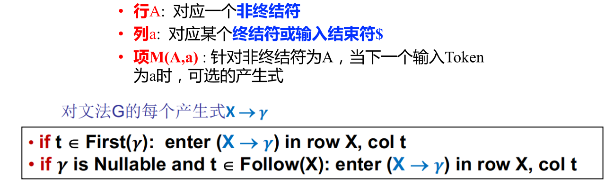

如果表格内有冲突，则代表其不是LL(1)文法，我们需要通过消除左递归和提左公因子将其转换为LL(1)文法。

而保证产生式唯一性的条件如下（对任何两个产生式$A\to \alpha | \beta$）：


### 2.3 Bottom-Up - LR(0)、SLR(1)、LR(1)和LALR


#### 2.3.1 LR(0)

**状态/项**

产生式加一个·记录当前识别进度，当·在产生式最后的时候是可以使用这个产生式规约的状态。

- 起始状态为𝑆′→·𝑆$
- 终止状态为𝑆′→𝑆·$

**项集闭包**

*这里直接写直接构造DFA的思路了，NFA就是把闭包看作ε-transition然后子集构造法形成DFA*

两个循环，先遍历闭包中每一个item，再遍历每一个以item的·后面的symbol为起始项的转换关系；直至不再增长（不动点思想）。

**转换关系**

goto函数最开始是空集，对于闭包里面每一个项，如果·后面是X，则将其加入goto的结果，并且计算其closure。

**整体DFA构造算法**

对每一个状态里面的每一项计算goto的结果并加入DFA直至不再增长。

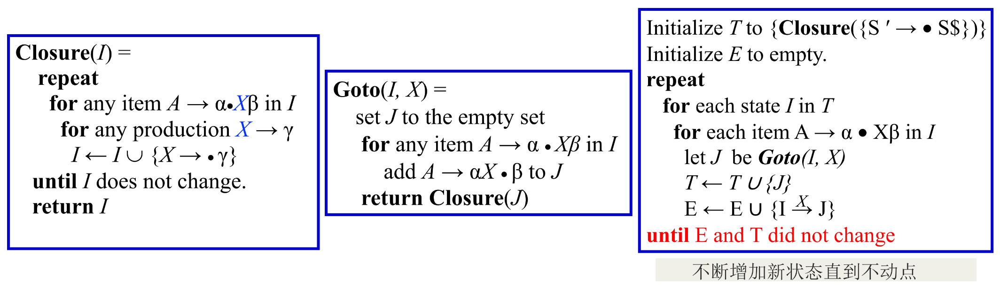

**语法分析表**

意义：

以状态为行，以`Action`的终结符和`GOTO`的非终结符为列，表项内容为操作：

- `Action`表项：
    - shift+goto下一状态：例如`s2`就是shift并且去到第二个状态
    - 当状态i**存在**以·为结尾的项时（有一个项满足就整体都选择规约），选择index为k的产生式进行reduce
- `GOTO`表项：
    - 列是每次规约所用产生式左边的nonterminal`A`，表示每次规约之后去到的下一个状态是什么

通过DFA构造：

1. `s`和`g`都由状态转移关系决定，如果是非终结符就是`g`，终结符就是`s`，然后当前状态对应行，转移读入的符号是列，去到的状态是`g/s`后面跟的数字；
2. `r`就是如果这个状态包括·在最后的产生式，那么使用这个产生式规约，**这一整行**的`Action`都加上`r+产生式对应的序号`这一项。

例子：


**符号栈与状态栈**

统一状态下先操作符号栈再操作状态栈：

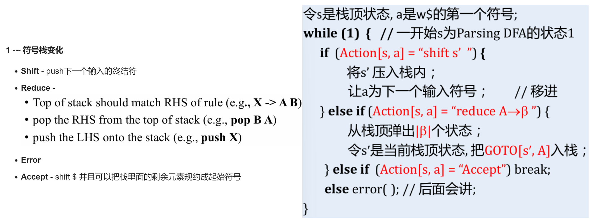

例子：

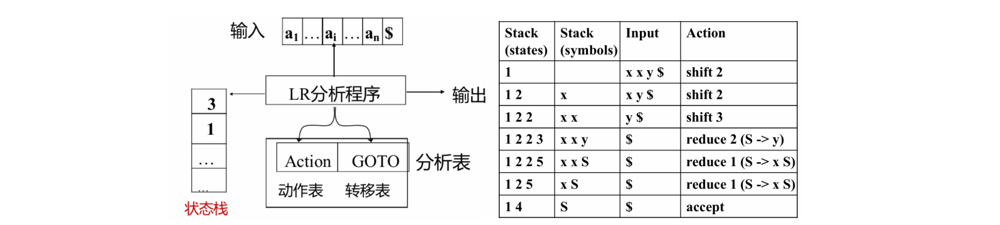

#### 2.3.2 SLR(1)

在LR(0)的基础上在规约条件中增加了next token是否在产生式左边的follow集合内的判断：


#### 2.3.3 LR(1)

**状态/项**

定义LR(1)的项为𝐴→𝛼·𝛽,𝑎，其中𝑎是lookahead的next token（终结符）。起始状态是$S'\to· S\$, ?$，$?$代表任意终结符。

**项集闭包**

我们在添加闭包项的时候，应该对item的next token加以判断（产生式和之前是同理的），同时我们要注意每一次增长的时候即使有这个产生式也要重新计算，因为next token可能不一样。

**转换关系**

基本相同，next token直接一模一样复制过去就可以。

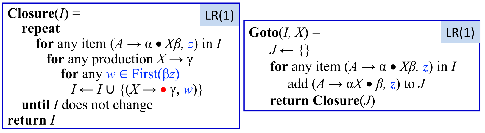

**语法分析表**

其他一样，而规约的时候只需要填入next token对应的列即可。

- 如果要根据𝐴→𝛼𝛽·,𝑎规约，下一个输入符号必须是$a$

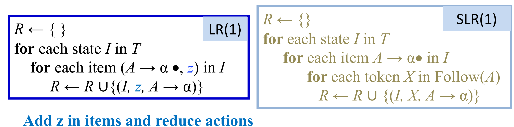

#### 2.3.4 LALR

核心思想：合并LR(1)中只有lookahead symbols不同的状态。

合并流程：core（状态中去掉lookahead的部分）保留，lookahead取并集。

合并完成之后同步改变转换edge：

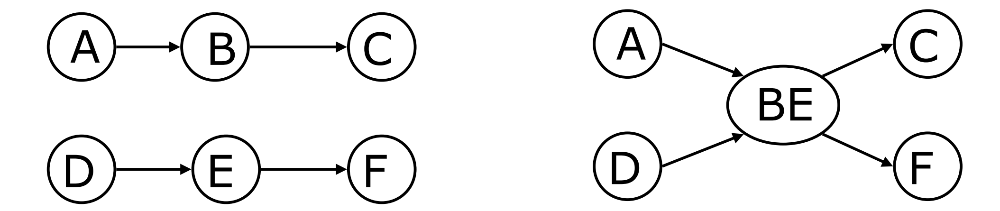

例子：

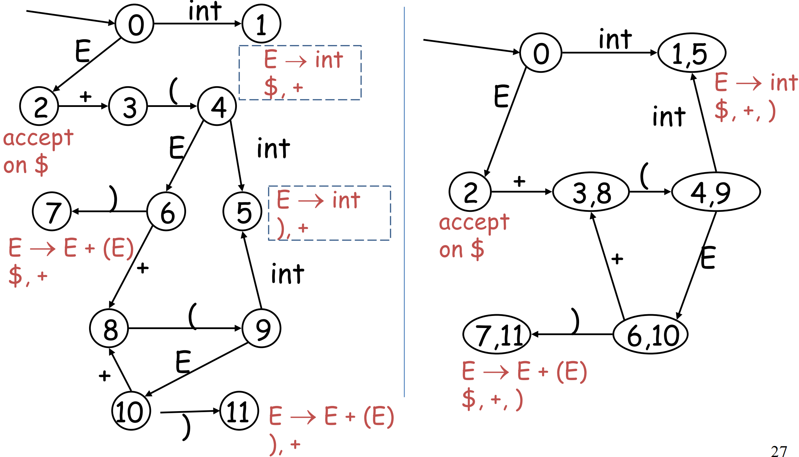

两个方法的语法分析表例子：

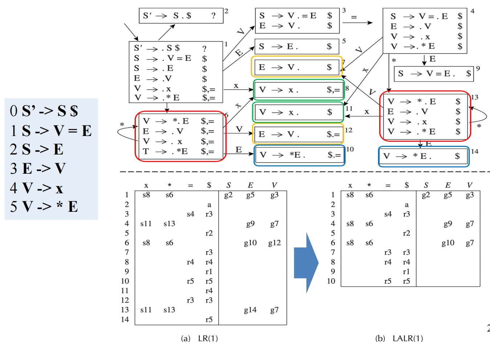

<!--

## 3 抽象语法

*这章不考*

### 3.1 语义动作

就是在语法分析的过程中同步携带语义动作，传递表达式的语义（lab1代码涉及的内容）：


### 3.2 抽象语法树

AST的作用是 - a clean interface between the parser and 后续的编译流程。

将语法树转换成只具有操作符和操作数的AST，删除了语法分析当中对后续流程无用的冗杂信息。

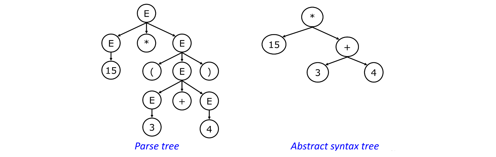

而AST的构造过程和语法分析的方式相关：

#### 3.2.1 Top-Down

一边parse一边造node，同时为node增加返回值：

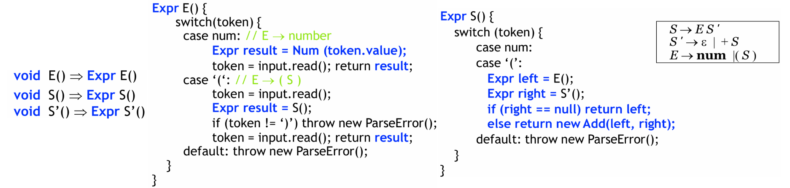

#### 3.2.2 Bottom-Up

和实验实现的方式相同，在执行自底向上规约的时候附带语义动作。

-->

## 3 语义分析 - 符号表

### 3.1 定义

- **Binding** - 维护一个`<Name/Symbol, Meaning/Attribute>`的映射，使用`|->`表示映射
    - 
- **Environment** - Binding的集合
    - 环境更新的例子：
        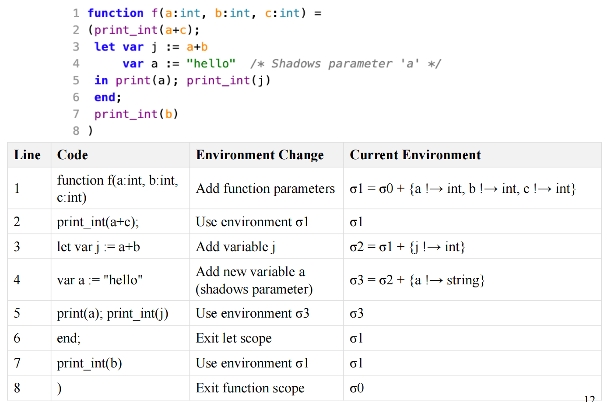
    - 如果有重名的情况，会采取覆盖操作
    - 退出对应scope之后，相应的环境会被丢弃
- **Symbol Table** - 环境的集合

*工程上，java的符号表是这样实现的（个人理解是基于class和package等嵌套实现）：*

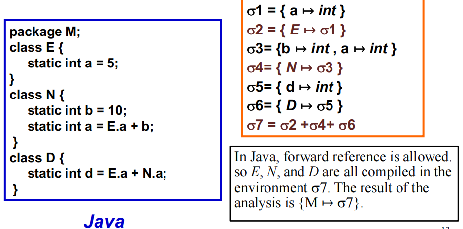

### 3.2 实现方式

需要实现的函数（interface）：

- insert - 插入一个符号并且实现覆盖关系
- lookup - 在符号表中查询当前的符号
- enter - 进入一个scope
- exit - 退出一个scope

实现方式分类：

- 命令式 - 有了新的就看不到老的，但是退出scope的时候还能回得去
- 函数式 - 每次发生变化的时候老的都还保留着，𝑂(1)恢复到任意新老状态

**命令式 - Imperative Style**

实现方式：一个存储所有有效bindings的哈希表+一个记录哪些符号在哪些作用域的栈（利用作用域marker）

- 进入新作用域 - 往栈里面推一个marker
- 添加一个符号 - 同时往哈希表里面添加、在栈里面记录
- 退出作用域 - 在哈希表中删除属于最后一个作用域的符号（pop栈直到marker）

代码实现（更好地解释了上面的实现方式）：
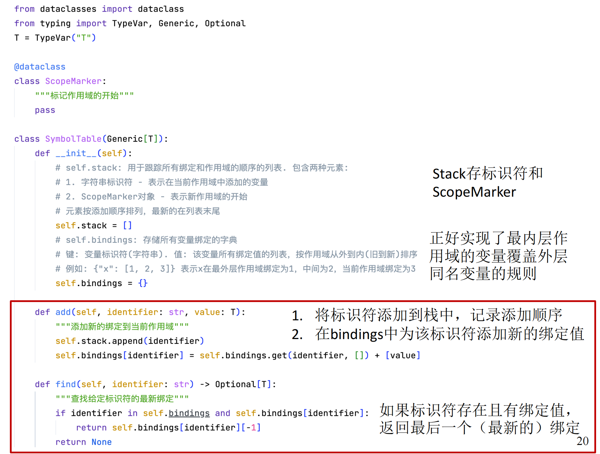

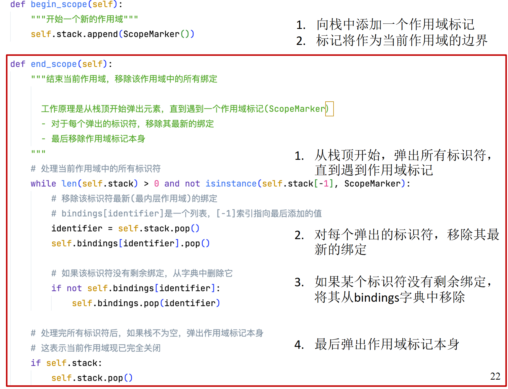

例子：

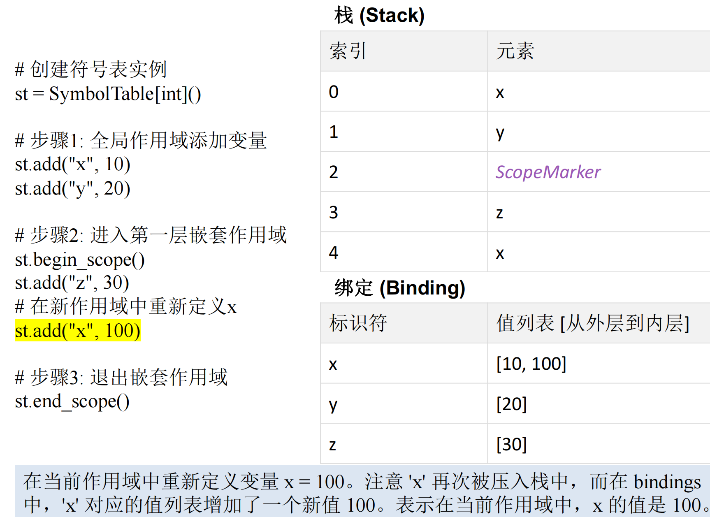

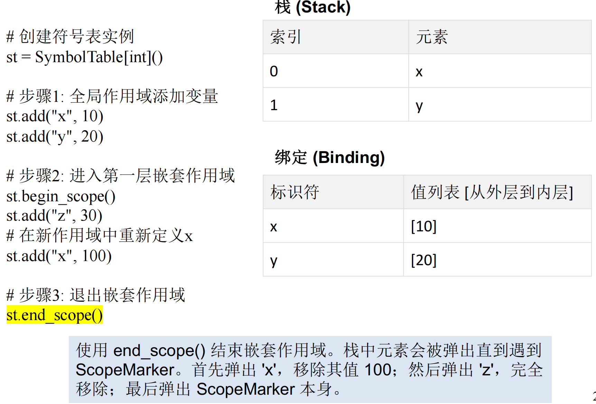

最终状态：嵌套作用域已关闭，只剩下全局作用域中的变量 x = 10 和 y = 20。

**函数式 - Functional Style**

基本思路：

当我们新进入一个作用域的时候，我们会新建一个专属于这个作用域的表格（而不是编辑旧的表格），而退出这个作用域的时候直接删除这个作用域的表格即可，方便快速回退。

实现方式：

通常使用平衡二叉树BST，排序方式直接采用字符串的大小比较，节点内容是标识符到binding的映射。

- 查找就是标准的BST搜索算法，复杂度$O(\log{n})$

- 插入是使用了**路径复制**技术：“复制从根节点到被插入节点的父节点的所有节点”
    比如插入了`z->int`，就是先创建`z`这个节点，再复制所有的`z`的祖先：
    

**两者比较**

| 特性     | 命令式                 | 函数式                     |
| -------- | ---------------------- | -------------------------- |
| 状态管理 | 可变状态，直接修改数据 | 不可变状态，创建新实例     |
| 数据结构 | 标准字典/哈希表        | 持久化数据结构             |
| 内存使用 | 通常较低               | 较高（由于持久化数据结构） |
| 并发性   | 需要显式同步           | 天然线程安全               |
| 调试     | 可能更困难（状态变化） | 更容易（不可变状态）       |

*而在这里我们使用字符串作为键值时可能会遇到性能问题：当键值为字符串时，进行查找操作时需要进行昂贵的字符串比较。*

*解决方案：使用符号（symbol）数据结构，每个符号对象与一个整数值相关联。所有相同字符串的出现都会映射到同一个符号，而不同的字符串则映射到不同的符号。通过将键值设置为符号，可以在查找时进行便宜的整数比较。*

---
