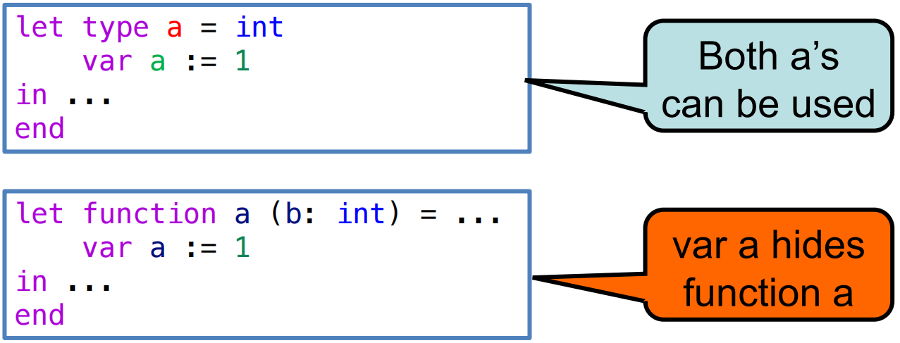

# 5 Semantic Analysis 语义分析 - type checking 类型检查部分

参考资料：

- 姚培森老师2024~2025学年春夏ch5ppt
- [wcjj的笔记](https://shiseab.github.io/notebook/Compiler/Semantic_Analysis/#2-type-checking)
- [伟大的Gemini 2.5 pro deep research](https://docs.google.com/document/d/1CHXMTaK2N4JSDfwb7nYxvQ4G-Xc---1Ku4iTiooGXI4/edit?usp=sharing)

---

类型检查的作用：

- 提升开发效率：更高层次的编程抽象
- 优化运行性能：类型指导的编译优化
- 保障安全可靠：内存安全乃至功能正确

涉及的问题：

1. 语言中合法的类型有哪些
2. 如何判断两个类型是等价的
3. 使用这些类型的规则是什么

*tiger语言不涉及显/隐式类型转换*

## 5.1 Tiger语言的类型系统

### 5.1.1 类型定义

- **基本类型 (Primitive Types)**：类型系统中最原子的单位，无法再被分解
    - `int`、`string`
- **构造类型 (Constructed Types)**：由其他类型组合而成的复合结构
    - **记录类型 (Record Type)**：将多个命名字段（field）及其对应的类型捆绑在一起，形成一个新的复合数据结构，其语法形式为 $\{f_{1}:t_{1},..., f_{n}:t_{n}\}$
    - **数组类型 (Array Type)**：表示由某一特定类型的元素组成的序列。其语法形式为 `array of t`
- **命名类型 (Name Type)**：程序员可以通过 `type` 声明为已有的类型（无论是基本类型还是构造类型）赋予一个新的名字，从而创建命名类型
- **NIL 类型**：这是一个特殊的类型，专属于字面值 `nil`，`nil` 用于表示一个“空”的记录，可以被赋予任何记录类型的变量，作为其初始值

例子：

```c++
/* 基本类型变量声明与初始化 */
var i: int := 42
var s: string := "hello"

/* 命名记录类型的定义与使用 */
type point = {x: int, y: int}
var p: point := point {x=10, y=20}

/* 命名数组类型的定义与使用 */
type intArray = array of int
var arr: intArray := intArray of 0

/* NIL 类型的应用 */
var my_point: point := nil
```

### 5.1.2 类型等价判断

- **NE - name equivalence**：类型名称相同才是类型相同
- **SE - structure equivalence**：类型的结构定义相同

```c++
type point = {x: int, y: int}
type ptr = {x: int, y: int}
```

这个例子中，`point`和`ptr`是SE但不NE的。

tiger语言使用**NE**，使用不同的类型名不等价。在这个前提下，有以下几个推论：

1. **独立的记录类型声明创建不同的类型**：即使两个记录类型声明的结构一模一样，它们也会被视为两种完全不同的类型。因此，以下代码在 Tiger 中是**非法**的，因为类型 `a` 和 `b` 被认为是不同的，变量 `i` 和 `j` 的类型不匹配：
    ```c++
    let
      type a = {x: int; y: int}
      type b = {x: int; y: int}
      var i: a := a{x=1, y=2}
      var j: b := b{x=3, y=4}
    in
      i := j  /* 非法操作！a 和 b 是不同类型 */
    end
    ```
2. **匿名记录类型具有唯一身份**：在 Tiger 中，记录的实例化表达式，如 `{x=10, y=20}`，会创建一个匿名的记录类型。这个匿名类型拥有一个自己独特的“隐藏”身份，它与任何其他类型（包括结构完全相同的命名类型）都**不等价**。
3. **类型别名是等价的**：Tiger 允许创建类型别名。如果一个类型 `b` 被定义为另一个类型 `a` 的别名，那么 `a` 和 `b` 在命名等价的规则下被视为完全相同的类型，因为它们指向的是同一个源头声明。因此，以下代码是**合法**的：
    ```c++
    let
      type a = {x: int; y: int}
      type b = a  /* b 是 a 的别名 */
      var i: a := a{x=1, y=2}
      var j: b := i /* 合法操作！a 和 b 是相同类型 */
    in
      i := j
    end
    ```

### 5.1.3 tiger类型规则

- **无隐式类型转换**：Tiger 是一种强类型语言，不允许在不同类型之间进行自动的、隐式的转换。例如，不能直接将一个整数赋值给需要字符串的地方。所有类型转换必须由程序员显式执行。
- **变量声明时必须初始化**：为了避免使用未定义的值，Tiger 强制要求所有变量在声明时都必须被赋予一个初始值。
- **函数调用**：调用函数时，传入的实际参数（actual arguments）的类型必须与函数定义中形式参数（formal parameters）的类型**等价**（遵循命名等价原则）。
- **数组下标**：用于访问数组成员的下标表达式，其类型必须是 `int`。
- **NIL 类型规则**：字面值 `nil` 拥有特殊的 `NIL` 类型。这个类型非常灵活，它**属于**并且**等价于**任何记录类型。这意味着 `nil` 可以被赋值给任何记录类型的变量，作为其初始的空值状态。
- **递归类型定义规则**：Tiger 允许定义递归类型，这对于创建链表、树等数据结构至关重要。但是，为了确保类型定义的良构性，Tiger 施加了一条关键限制：**任何相互递归的类型声明所形成的环路，都必须经过一个 `record` 或 `array` 类型**。
    - 考虑一个非法的直接循环定义：
        ```c++
        /* 非法定义 */
        type a = b
        type b = a
        ```
        当编译器试图计算类型 `a` 的大小时，它发现需要先知道类型 `b` 的大小；而要计算 `b` 的大小，又需要回头知道 `a` 的大小。这陷入了一个无法解析的无限循环，这样的类型在物理内存中无法表示。
    - 考虑一个合法的间接循环定义：
        ```c++
        /* 合法定义：通过记录类型实现链表 */
        type int_list = {head: int, tail: int_list}
        var my_list: int_list := nil
        ```
        这个例子中，`int_list` 是一个记录类型。编译器在计算其大小时，发现它由一个 `int` 和一个 `int_list` 组成。关键在于，记录中的字段 `tail` 实际上存储的不是一个完整的 `int_list` 结构，而是一个指向另一个 `int_list` 结构的**指针或引用**。指针的大小是固定的（例如4或8字节）。因此，`int_list` 的大小就是 `sizeof(int) + sizeof(pointer)`。记录或数组类型在这里充当了一个“间接层”，它通过引入指针来打破无限递归，使得类型的大小可以被确定，从而能够在内存中实际分配。

### 5.1.4 命名空间

type是一个命名空间，函数和变量共用另一个命名空间。

在同一个作用域内，一个类型和一个变量（或函数）可以拥有相同的名字而不会产生冲突。类型检查器能够根据上下文来区分它们。

编译器内部必须维护两个独立的环境来分别管理这两种名称绑定。



上图的上面两个定义都有效，下面的函数定义会被变量定义覆盖。

## 5.2 Tiger类型检查

### 5.2.1 环境

1. **类型环境 (Type Environment, `tenv`)**：这个环境负责将**类型符号**（即类型名称）映射到它们所代表的实际类型结构。
      - 例如，当遇到 `type a = int` 声明时，`tenv` 中会增加一个条目，将符号 `a` 映射到内部表示的 `int` 类型。当检查器后续遇到类型名 `a` 时，它会查询 `tenv` 来解析其具体含义。
2. **值环境 (Value Environment, `venv`)**：这个环境负责存储变量和函数的信息。
      - 具体来说，它将**变量符号**映射到它们的类型，并将**函数符号**映射到它们的签名（即参数类型列表和返回类型）。例如，当遇到 `var x: int := 0` 声明时，`venv` 会增加一个条目，将符号 `x` 映射到 `int` 类型。

这两个环境是类型检查器在遍历 AST 时的上下文。每当进入一个新的作用域（如 `let` 表达式或函数体），新的环境层就会被创建；退出作用域时，相应的环境层则被销毁。

### 5.2.2 类型检查算法

遍历AST实施类型检查：

- **自顶向下控制流**：类型检查器从 AST 的根节点开始，递归地访问其子节点。
    - 例如，要检查一个加法表达式 `e1 + e2`，检查器首先访问代表 `+` 的操作节点，然后向下递归地调用自身来分别检查左子节点 `e1` 和右子节点 `e2`。
- **自底向上信息流**：虽然控制流是向下的，但为了确定父节点的类型，必须首先知道其所有子节点的类型。
    - 在 `e1 + e2` 的例子中，检查器必须等待对 `e1` 和 `e2` 的递归调用返回它们各自的类型（比如都是 `int`）之后，才能根据加法规则判断出 `+` 节点自身的类型也是 `int`。类型信息就像是从树的叶子节点产生，然后逐级向上传递，最终汇集到根节点。

以表达式 `let var x := 5 + 3 in x * 2 end` 的类型检查为例：

*先临时定义一个局部变量 `x`，并让它的值为 `8`。然后，在这个临时的上下文中，计算 `x * 2` 的值，并将这个计算结果（`16`）作为整个 `let` 表达式的最终值。*

AST：

```
          LetExp
          /    \
    VarDec(x)   OpExp(*)
       \         /     \
     OpExp(+) VarExp(x) IntExp(2)
     /    \
IntExp(5) IntExp(3)
```

**步骤 1: 访问 `LetExp` 节点**

- **动作**: 类型检查器从根节点 `LetExp` 开始。`LetExp` 结构引入了一个新的作用域。检查器会调用 `venv.beginScope()` 和 `tenv.beginScope()` 来创建新的环境层。
- **控制流**: 按照 `let` 表达式的规则，首先处理其声明部分。检查器向下递归，访问 `VarDec(x)` 节点。

**步骤 2: 访问 `VarDec(x)` 节点**

- **动作**: `VarDec(x)` 是一个变量声明。为了确定 `x` 的类型，检查器需要知道其初始化表达式的类型。
- **控制流**: 检查器继续向下递归，访问 `VarDec(x)` 的子节点 `OpExp(+)`。

**步骤 3: 访问 `OpExp(+)` 节点**

- **动作**: `OpExp(+)` 是一个二元加法操作。为了确定其类型，检查器需要知道其左右两个操作数的类型。
- **控制流**: 检查器再次向下递归，分别访问 `IntExp(5)` 和 `IntExp(3)`。

**步骤 4: 访问 `IntExp` 叶子节点**

- **动作**: `IntExp(5)` 和 `IntExp(3)` 是 AST 的叶子节点，这是递归的基准情况。根据 `(T-Int)` 规则，整数常量的类型是 `int`。
- **信息流**: `IntExp(5)` 返回类型 `int`。`IntExp(3)` 返回类型 `int`。类型信息开始**自底向上**流动。

**步骤 5: 返回至 `OpExp(+)` 节点**

- **动作**: 检查器收到了来自左右子节点的类型，都是 `int`。它应用加法 `(T-Plus)` 规则：`int + int` 的结果是合法的，其类型为 `int`。
- **信息流**: `OpExp(+)` 节点计算出自己的类型为 `int`，并将此类型返回给其父节点 `VarDec(x)`。

**步骤 6: 返回至 `VarDec(x)` 节点**

- **动作**: `VarDec(x)` 接收到其初始化表达式的类型为 `int`。由于 `x` 没有显式类型声明，Tiger 语言会根据初始化表达式的类型推断 `x` 的类型为 `int`。检查器随后更新当前作用域的值环境，添加一个新的绑定。
- **环境更新**: `venv` 中添加绑定 `x \mapsto int`。至此，`let` 表达式的声明部分处理完毕。

**步骤 7: 访问 `LetExp` 的主体**

- **动作**: 检查器现在开始处理 `let` 表达式的主体部分。
- **控制流**: 向下递归，访问 `OpExp(*)` 节点。

**步骤 8: 访问 `OpExp(*)` 节点**

- **动作**: 这是一个乘法操作，同样需要其左右操作数的类型。
- **控制流**: 向下递归，分别访问 `VarExp(x)` 和 `IntExp(2)`。

**步骤 9: 访问主体部分的叶子节点**

- **动作**:
    - 对于 `VarExp(x)`：检查器在当前 `venv` 中查找 `x`。根据步骤 6 添加的绑定，查找到 `x` 的类型是 `int`。
    - 对于 `IntExp(2)`：根据 `(T-Int)` 规则，其类型是 `int`。
- **信息流**: `VarExp(x)` 返回类型 `int`。`IntExp(2)` 返回类型 `int`。类型信息继续向上流动。

**步骤 10: 返回至 `OpExp(*)` 节点**

- **动作**: 检查器收到了来自左右子节点的类型，都是 `int`。它应用乘法 `(T-Mul)` 规则：`int * int` 的结果是合法的，其类型为 `int`。
- **信息流**: `OpExp(*)` 节点计算出自己的类型为 `int`，并将此类型返回给其父节点 `LetExp`。

**步骤 11: 返回至 `LetExp` 节点**

- **动作**: `LetExp` 节点收到了其主体表达式的类型为 `int`。根据 `let` 表达式的规则，整个表达式的类型就是其主体部分的类型。
- **最终类型**: 整个 `let var x := 5 + 3 in x * 2 end` 表达式的类型被最终确定为 `int`。
- **环境清理**: 检查结束，退出 `let` 作用域。调用 `venv.endScope()` 和 `tenv.endScope()`，丢弃在步骤 1 中创建的环境层，恢复到外部环境。
