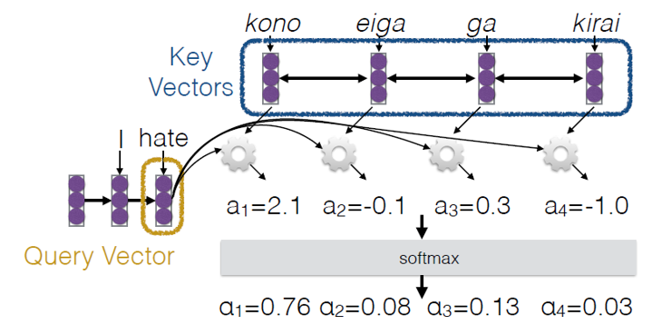
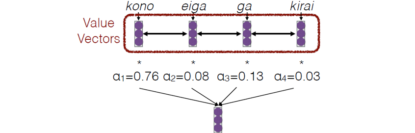
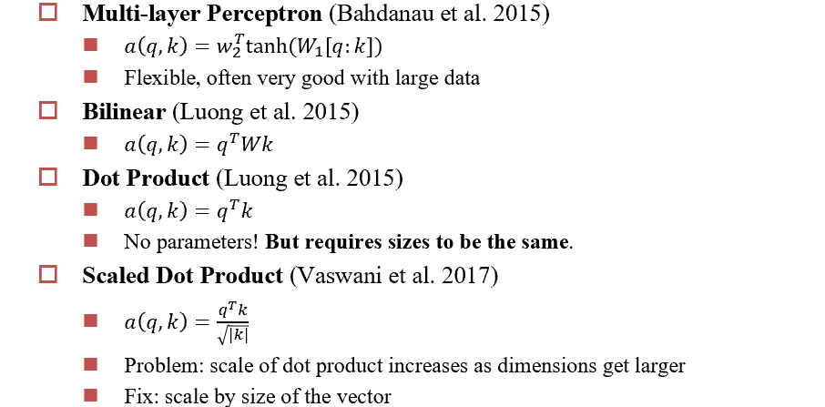
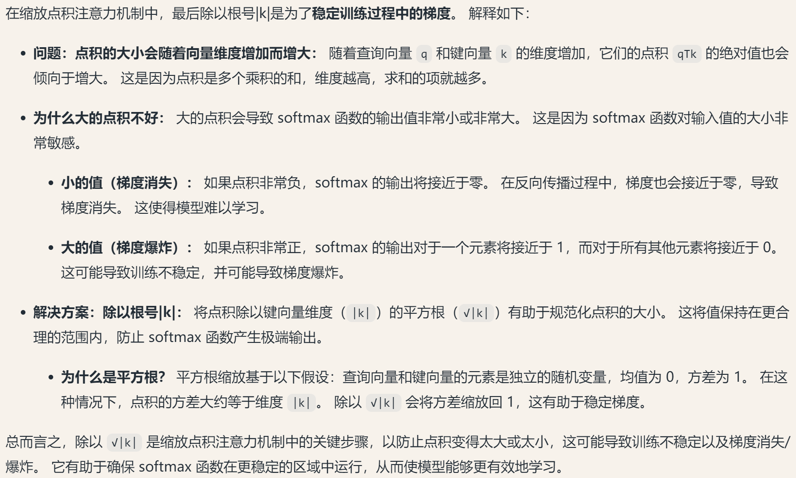
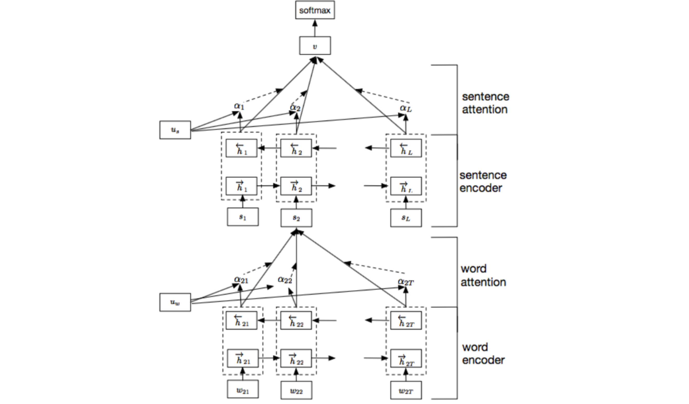
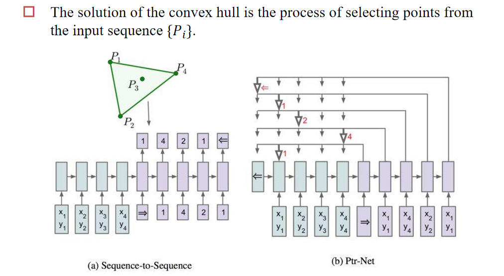
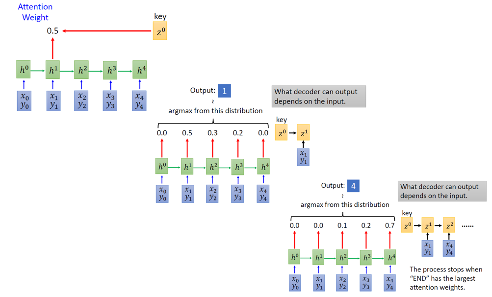

# Chap5 Attention

## 5.1 基本原理

在nlp中的attention机制，用于解决翻译问题中的瓶颈问题：RNN的滑动窗口在最开始的时候上文为空，会使用空白padding，导致第一个词预测不准确，而第一个词的预测直接影响到后续所有任务的执行。

而注意力机制可以从被翻译的语言空间中选取对这个词的翻译任务有用的词（使用注意力权重实现）：

最后拿去预测的词向量是这些词向量和注意力权重的加权和：

不同的通过$q、k$计算attention的方式：

直接点乘不需要参数，但是需要保证两个向量维度相同。现在广泛使用的是最后一个。为了避免维度过大带来的点积过大我们会除一个$|k|$的平方根：

## 5.2 应用

1. **选择复制内容**（类比跨模态对齐[1](https://www.ultralytics.com/zh/blog/multi-modal-models-and-multi-modal-learning-expanding-ais-capabilities)[3](http://www.ia.cas.cn/xwzx/mtsm/202011/t20201116_5749351.html)）
2. **捕捉序列依赖**（自注意力全局建模[7](https://blog.csdn.net/YPeng_Gao/article/details/135953895)[9](https://zhuanlan.zhihu.com/p/696136220)）
3. **跨模态特征融合**（多模态注意力对齐[1](https://www.ultralytics.com/zh/blog/multi-modal-models-and-multi-modal-learning-expanding-ais-capabilities)[6](https://wenku.csdn.net/column/35w2puygir)[9](https://zhuanlan.zhihu.com/p/696136220)）
4. **多源信息整合**（多源融合策略[2](https://www.ibm.com/cn-zh/think/topics/multimodal-ai)[14](https://blog.csdn.net/weixin_41990278/article/details/132211121)）

*链接是deepseek联网版自己搜的*

## 5.3 不同的注意力变形

### 5.3.1 Hierarchical Structures

层次化注意力机制，核心思想是通过两层注意力机制来捕捉文档中的关键信息

1. **词级别编码和注意力机制**：对每个句子中的词进行编码，并通过注意力机制计算每个词的重要性，生成句子的表示。
2. **句子级别编码和注意力机制**：对文档中的每个句子进行编码，并通过注意力机制计算每个句子的重要性，生成文档的表示。

### 5.3.2 Pointer Network

解决的问题是在一堆点中找到一个点集可以包括所有点。

input是每个点的位置信息，输入结束标记符之后开始输出，将每一次的记忆作为key去计算每一个点的q的点积，点积最大的作为下一个点，并将这个点写入记忆继续寻找下一个点。

应用：路由选择、控制神经网络结构变化、早退机制，神经网络解决算法问题的开始，用神经网络去近似地估计、替代比较复杂的问题。

