# Chap3 Convolutional Neutral Networks

卷积神经网络通常用于处理视觉对象。

## 1 基本原理

每一个神经元其实就是在做特征检测，第一层会做非常简单的对象检测，第二层的输入是第一层的结果，检测简单的形状，而后面的层可能就会检测形状的组合。

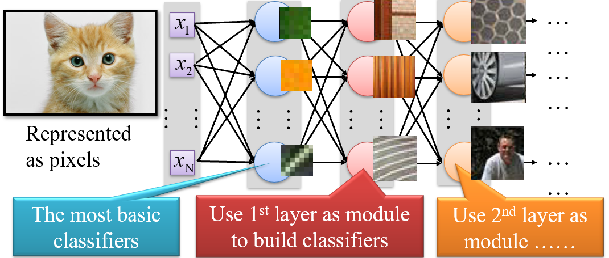

### 1.1 图像特征识别的特点

1. 在我们做检测的时候，同一个特征会出现在不同图片的不同区域。每个神经元只能检测指定位置的特征，因此不同位置的特征需要不同的神经元，但是由于检测都是同一个特征，所以神经元都是差不多的：
    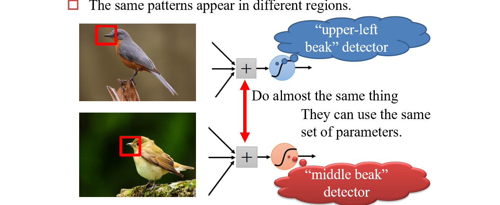
2. 下采样：通过例如移除一张图片所有奇数列和奇数行的方式缩放图片，这个缩小不影响神经元的特征检测。 
   基于上述特性，完整的CNN如下图所示：
    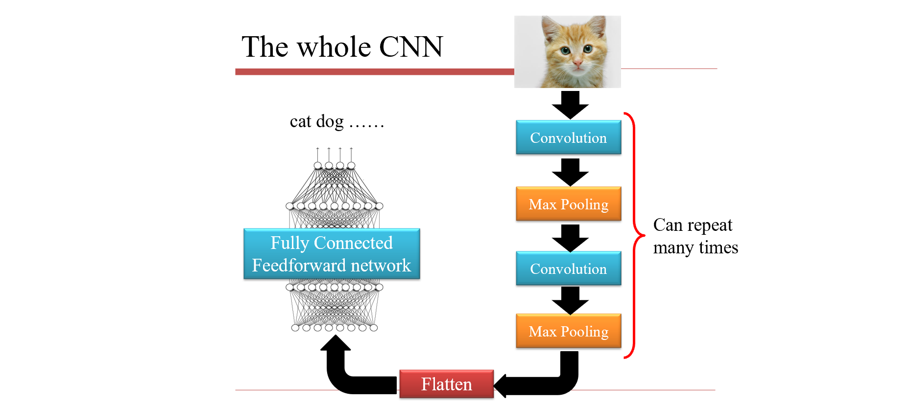

### 1.2 卷积

过程就是逐位相乘再相加，所得结果为中间格的值。不同卷积核提取不同特征，比如这个检测到了从左上到右下的斜线：

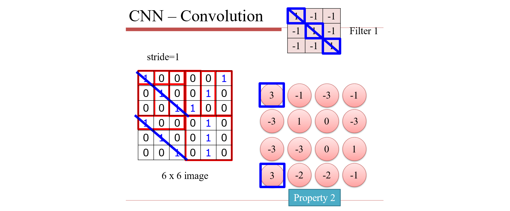

- 因为我们关注的特征一般是小于这个图像的，所以我们用一个比较小的卷积核去做卷积（特征提取），得到的结果是关于这个特征的热力图，第二层就是在这个热力图的基础上卷积；

- 而由于特征可能出现在不同的位置，所以我们用卷积核遍历整张图片；

- 卷积核就是在训练过程中被训练的参数；

- 因为边缘可以补0，所以卷积之后图片大小不变：zero padding:
    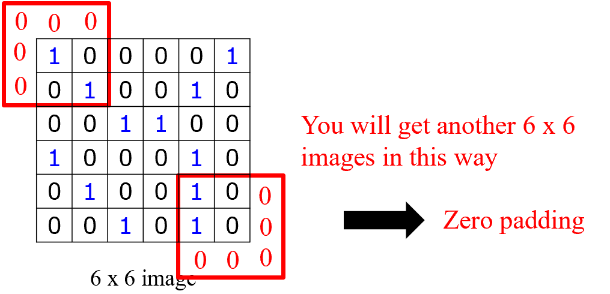
    在神经网络中的实现就是在一个神经元内，只有被对应卷积核覆盖的像素点才有值，而不同位置只是置1的输入变量不一样，权重参数是一样的(Shared Weights)：
    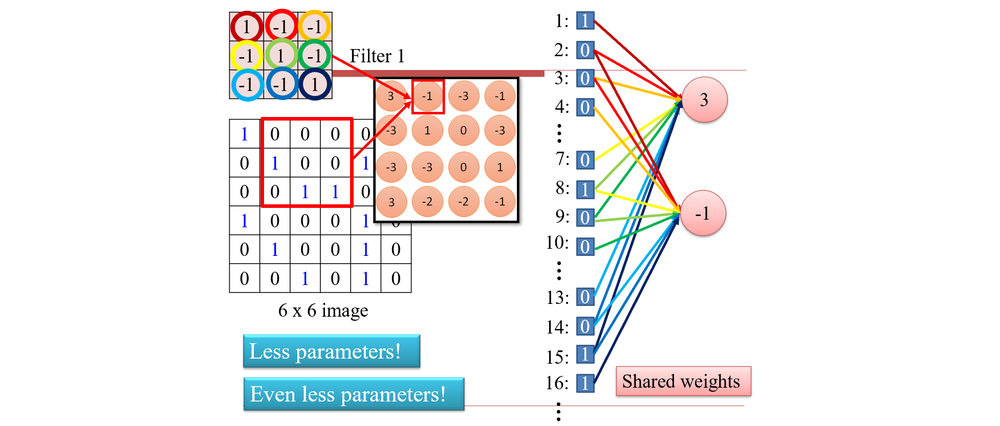

### 1.3 池化

对应特性：下采样不影响特征识别

Max Pooling：对feature map分块，保留块内最大值，检测区域内最强特征。而池化之后的图片缩小，也减少了后续的计算量。

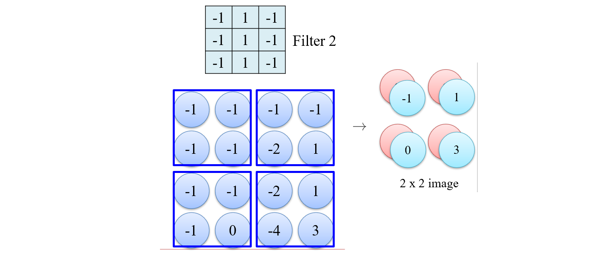

平均池化：检测一个模式/特征有多频繁，例如alpha go。

如何设计卷积核的数量？- 前少后多，因为模式的组合的可能性比简单的特征、形状更多，需要更多的神经元检测器。池化也是减少卷积核数量增加的一种方式。

### 1.4 Flatten

当池化后的特征图足够小以致于无法继续池化的时候，我们将其拉直输入MLP进行分类：

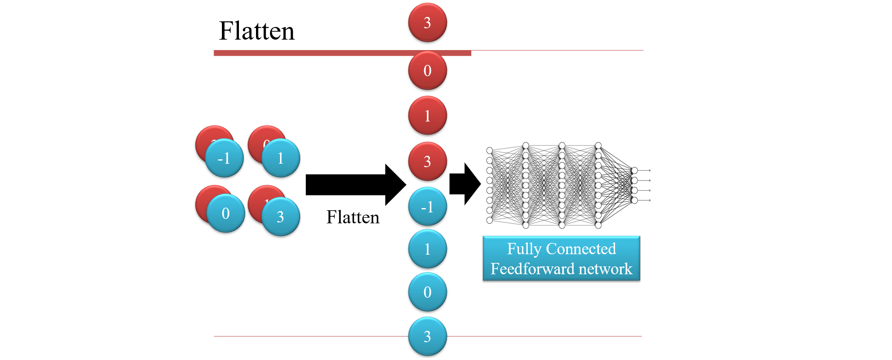

### 1.5 例子：CNN处理围棋问题

为什么可以？- 围棋棋面符合CNN的三个特征

- 特征小于整张图
- 特征可能出现在整张图的不同位置
- *下采样不影响特征识别* - 存疑

分类问题是next move(19*19个位置)

## 2 CNN的历史

人类的一个视觉神经会处理多个视觉感知器的输入，因此除了感知光线之外也能直接感受形状。

人类的视觉神经元以以下方式组织：$\text{simple cells} \to \text{complex cells} \to \text{hyper-complex cells}$

且具有平移不变性。

而之后人们将脑神经科学的结构做了计算机模拟，就有了最早的CNN。

平移不变 $\to$ 权值共享 $\to$ 数据增强（对输入数据做变化，比如翻转旋转输入、将输入trunking，实现旋转缩放不变性）、最大池化 $\to$ LeNet（使用tanh作为激活函数）$\to$ **AlexNet（dropout：每次训练的时候随机丢弃神经元，最后推理阶段激活所有神经元，防止过拟合）**

## 3 CNN的应用与变形

### 3.1 CNN的变形

- VGGNet - 最后的任务重用图像分类，完成图像分割、跟踪等任务。实验结果表明效果最好的层数为16、19层。
    - 为什么不是越深越好？- 有梯度消失问题
- GoogLeNet - 把网络变宽。同一层内使用不同大小卷积核。
    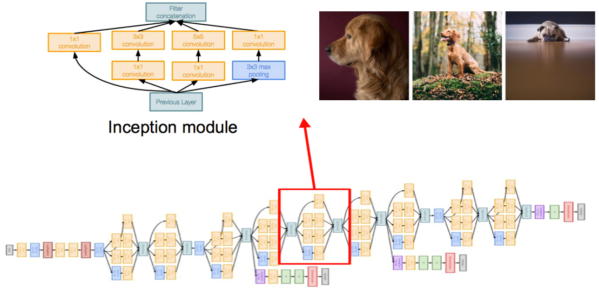
    - 为什么之前不用`5*5`而用`3*3`？- 减少计算量，两个`3*3`叠加就是`5*5`
    - 但是之前的架构可能会在不同层次检测同一个特征，造成冗余，所以我们在同一层使用不同大小的卷积核检测同一特征
    - `1*1`卷积 - 做整体缩放，如下图把32张feature map做线性组合将其变成1张，减少计算量；例如transformer也采取了这个思想
        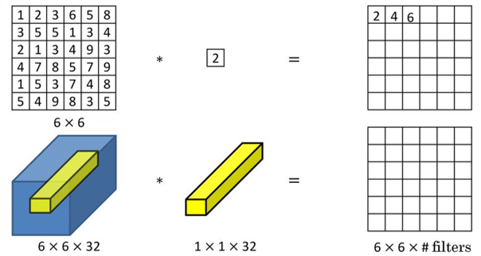
    - 传统多任务学习：通过同时训练多个相关任务，模型能够利用不同任务之间的相关性。例如，在图像分类和物体检测的任务中，图像的特征可以被同时用于这两个任务，从而提高整体性能。多任务学习可以起到正则化的作用，减少过拟合的风险。当模型在多个任务上进行训练时，它需要学习更通用的特征，从而避免在单一任务上过拟合。
        - 辅助任务学习：在网络中间层加入输入信号（多任务一般是在最后一层），在中间层就开始分类，强化中间层能力。
- ResNet - 解决了梯度消失的问题
    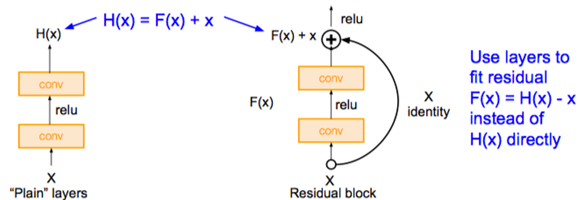
    本来学的是x怎么变成y，现在学的是x和y的差异，x加什么变成y，增加了一个跳变，解决梯度下降之后大大增加了网络的深度。
- DenseNet - 在连接之间插入dense block，跳变可能不止一层：
    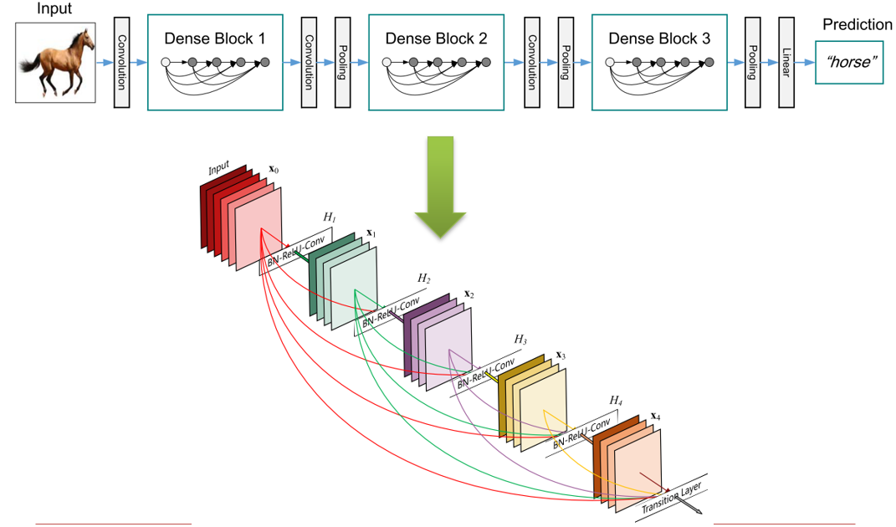

### 3.2 卷积核的变种

- 1D卷积核：滑动窗口
    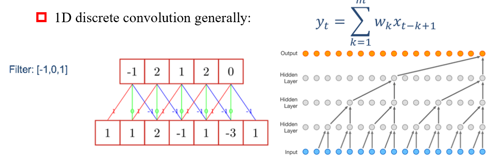
- 2D卷积核（如上述介绍）
    - 2D卷积处理3D输入
        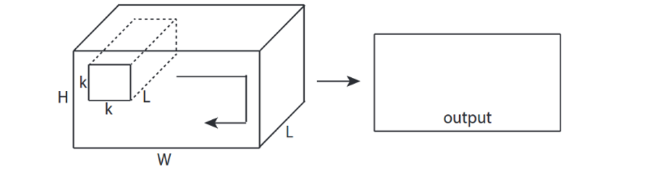
        利用之前的`1*1`卷积核
- 3D卷积核（例如处理视频，第三个维度是时间）
    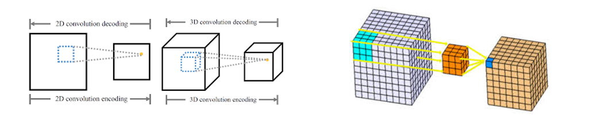
- 图卷积 - 图由节点（vertices）和边（edges）组成，节点可以表示实体，边表示实体之间的关系；图卷积旨在利用这些结构信息来学习节点或图的特征
    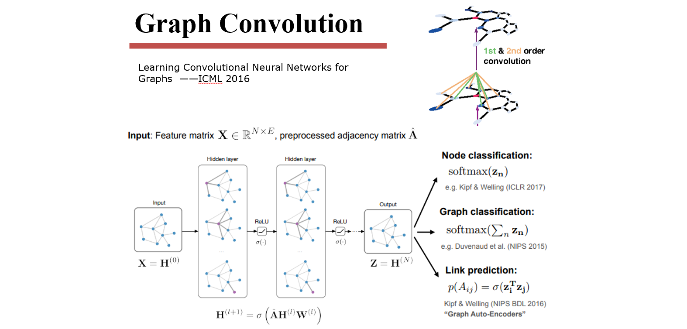
- 球卷积 - 把3D物品投影到球然后做卷积
    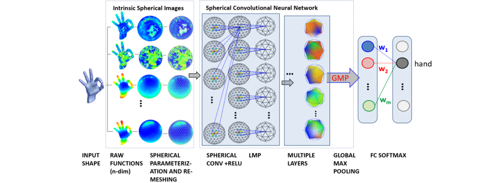
- 转置卷积 - 一般是用来做生成的，本来是从大卷到小，用于生成需要从小卷到大，例如文生图任务，实现方式是小图和大卷积核，常见应用风格迁移
    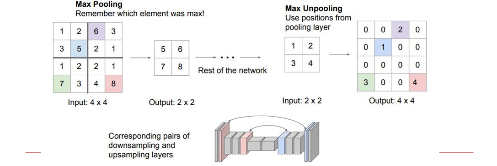

### 3.3 Capsule Network

卷积神经网络的问题：

- 池化丢失了**位置信息**，例如旋转人脸导致无法识别，但是交换眼睛和嘴巴的位置却导致依旧识别为人：
    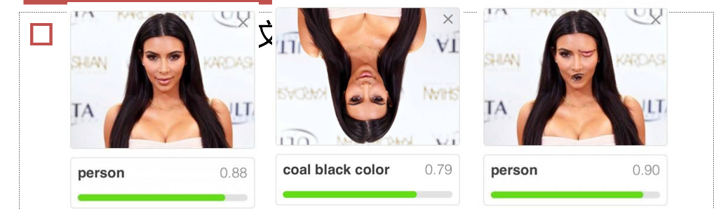
    针对上述问题，有一个尝试是capsule network：
    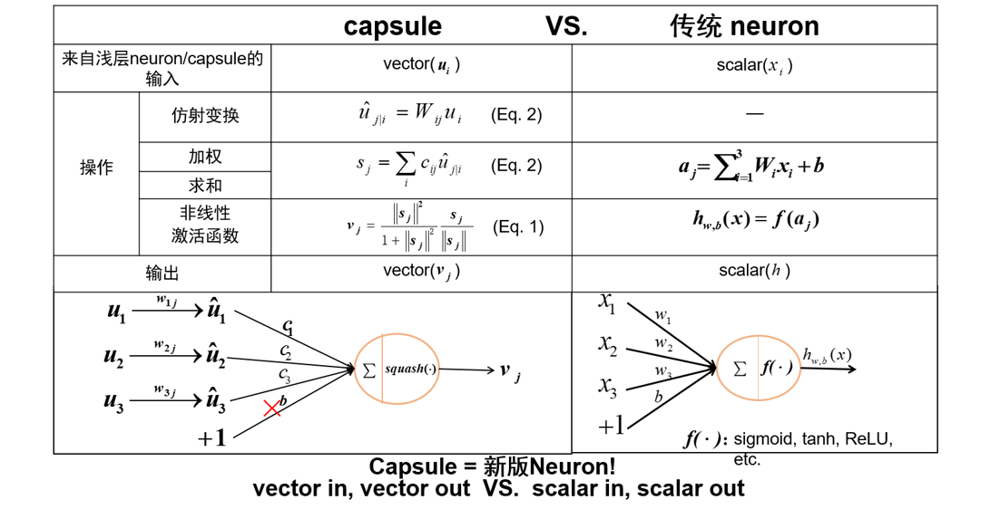

传统的神经元基本处理的是标量，标量没有方向，而capsule做的就是将输入变成向量（数组实现），输出也是数组。而我们在神经元会对其进行仿射变换，加权求和的过程也是根据注意力机制动态变化的：

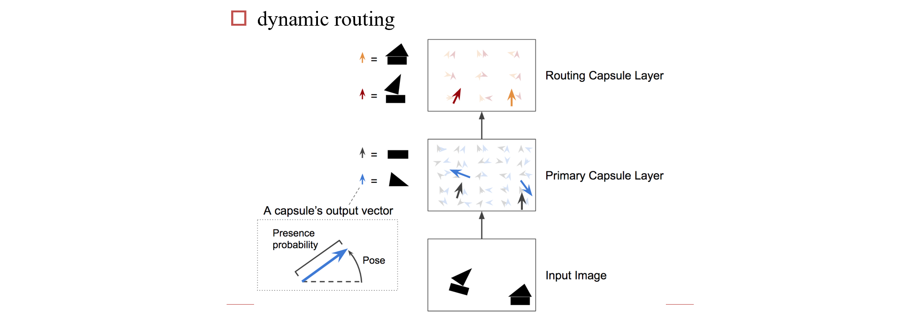

检测形状和形状的朝向，初始层是三角形的capsule和长方形的capsule，然后对这两个capsule做动态路由，在下一层匹配成帆船/房子的capsule。

没有成功可能是硬件不匹配。

### 3.4 Kolmogorov-Arnold Network (KAN)

提出了一种理论：很多简单函数的组合可以表达多种复杂函数。

KAN不学权重，学激活函数。

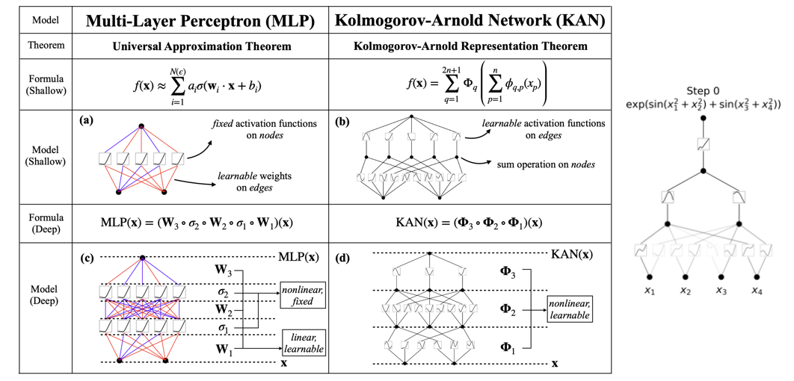

函数怎么学？- 学样条函数B-Splines，把每个函数定义域切成小块，用数字表示（近似）每一个小块的函数；最后的激活函数是所有这些函数的线性组合，而学习的过程就是调整每一个函数对应的参数的过程（拉长、拉宽等）。

优点？- 表达能力比传统mlp好，同样的性能需要参数更少，因为函数本身就携带更多的信息。新内容进来的时候对旧内容的记忆更好。

需要更高精度？- 把样条变得更小，进一步细化参数，不需要新增。

怎么做卷积？把卷积核从数字变成函数。

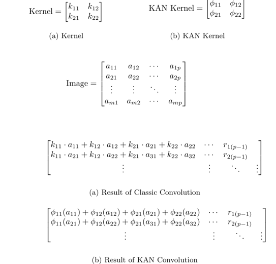

最大的优势在于支持科学计算，训练结束之后可以直接根据激活函数写出公式：

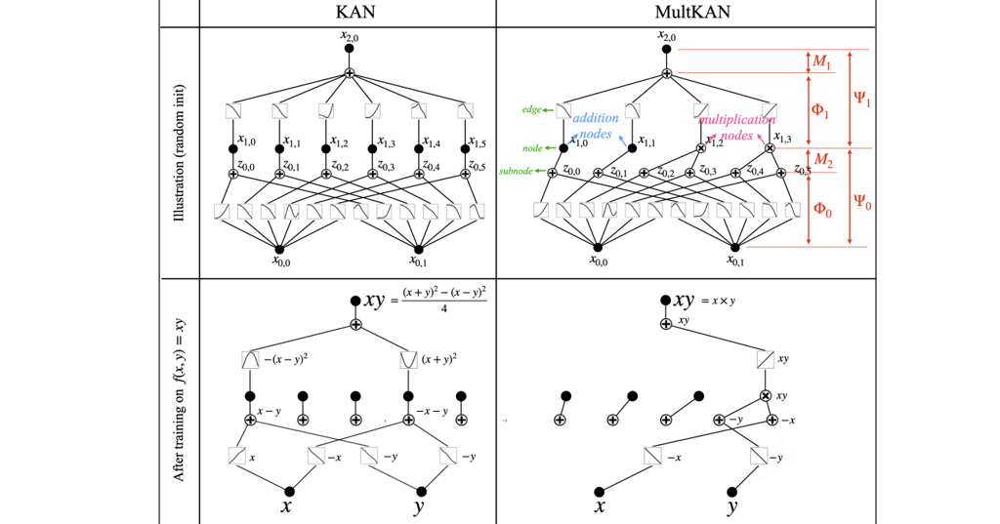

不但可以简单地完成输入输出的映射，还能显式地表达映射关系，适用于研究一些普适的科学原理。

MultiKAN - 之前是将所有样条函数简单相加，现在引入了乘法，表现能力更强，例如上图的右边用更简单的方式表达了和左图相同的内容。

### 3.5 CNN for NLP

考虑一个任务，比如句子（情感/主题/...）分类。

如何利用词向量得到句子特征？- 最简单的方式就是Bag of words --- 相加所有词向量，把相加结果扔给分类器。

- 不考虑词的顺序，太粗糙。*区分不了俄罗斯炮轰乌克兰vs乌克兰炮轰俄罗斯*

为了解决序列问题，提出了**Bag of n-grams** - 我们使用一个大小为n的窗口在句子上滑动提取x个n元组，再相加去分类：

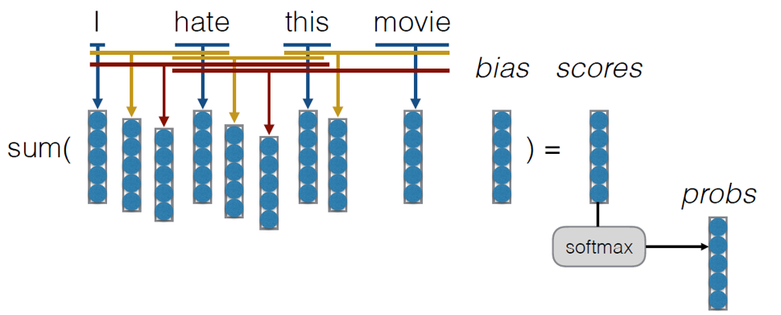

问题：

- 参数爆炸，二元、三元的组合太多了

（一维）卷积的本质其实也是滑动窗口，调整步长可以使得组合更少：

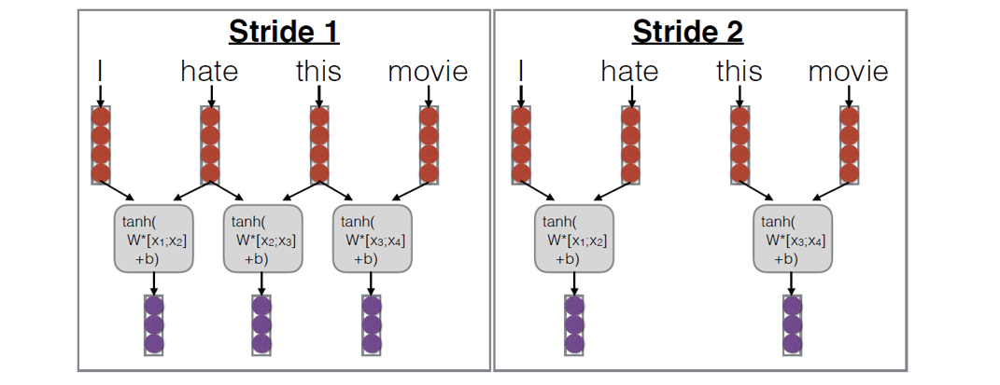

我们可以通过一些规则将句子分为几段：

- **Max pooling:** “Did you see this feature anywhere in the range?” (most common)
- **Average pooling:** “How prevalent is this feature over the entire range”
- **k-Max pooling:** “Did you see this feature up to k times?”
- **Dynamic pooling:** “Did you see this feature in the beginning? In the middle? In the end?”

整体架构：将每个词向量纵向排布，使用不同卷积核（行数n代表n元组）检测不同特征，对得到的feature map做pooling后组合分类：

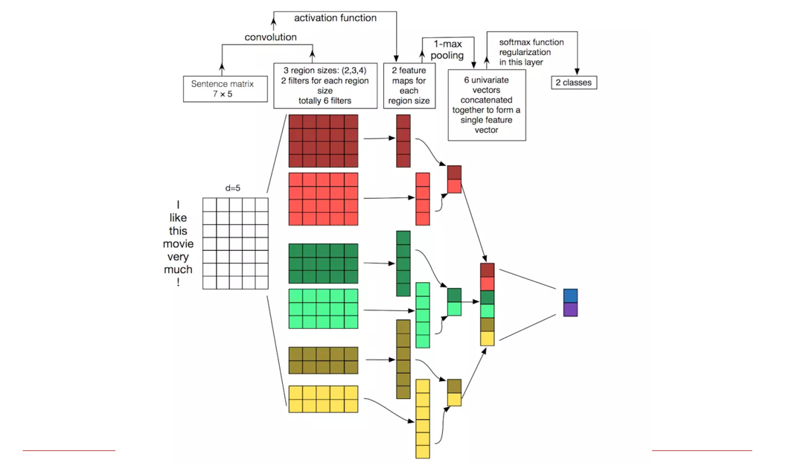

还有一种技术是膨胀卷积Dilated Convolution，方便并行且避免了重叠，在nlp里面用得比较多：

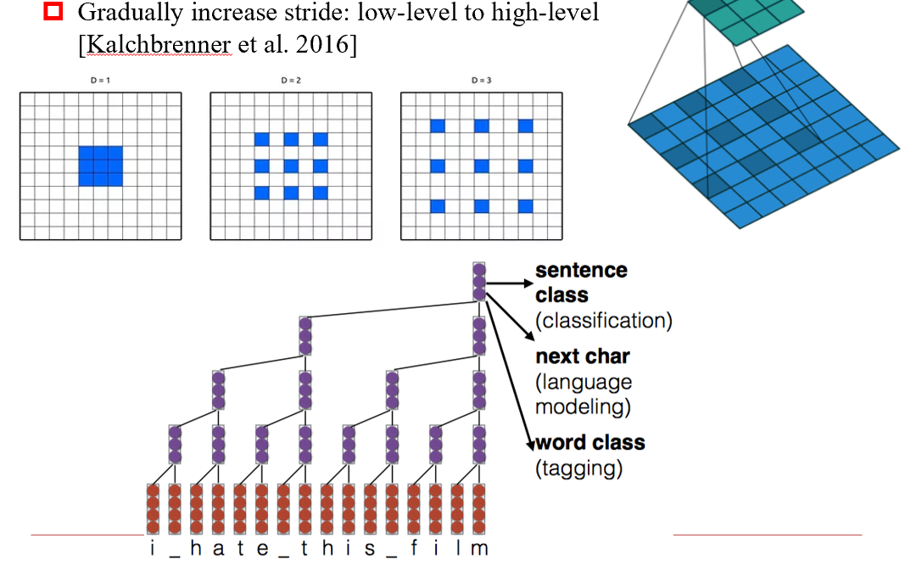

相当于卷积的流程不是全连接，而是构成了树，重新定义了邻居关系。

*这里的表述存疑*