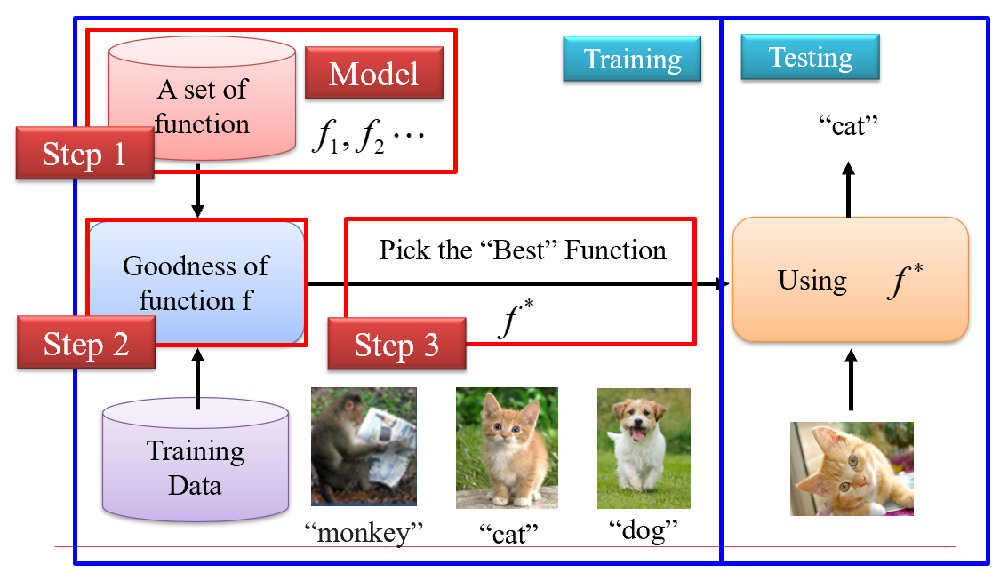
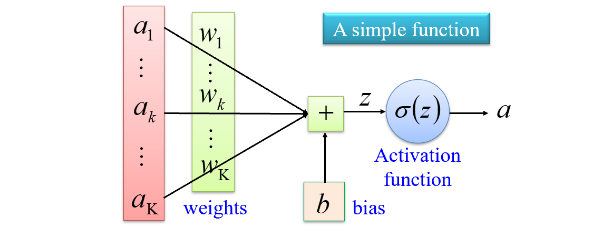
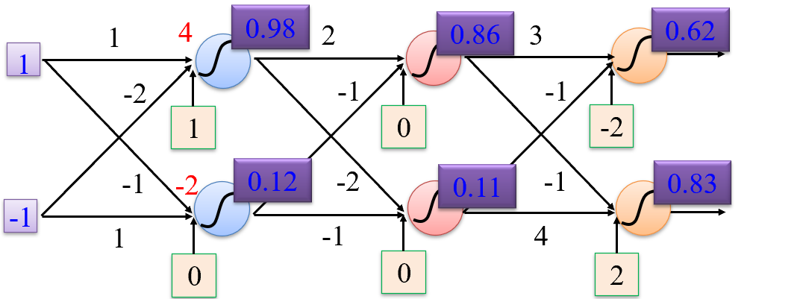
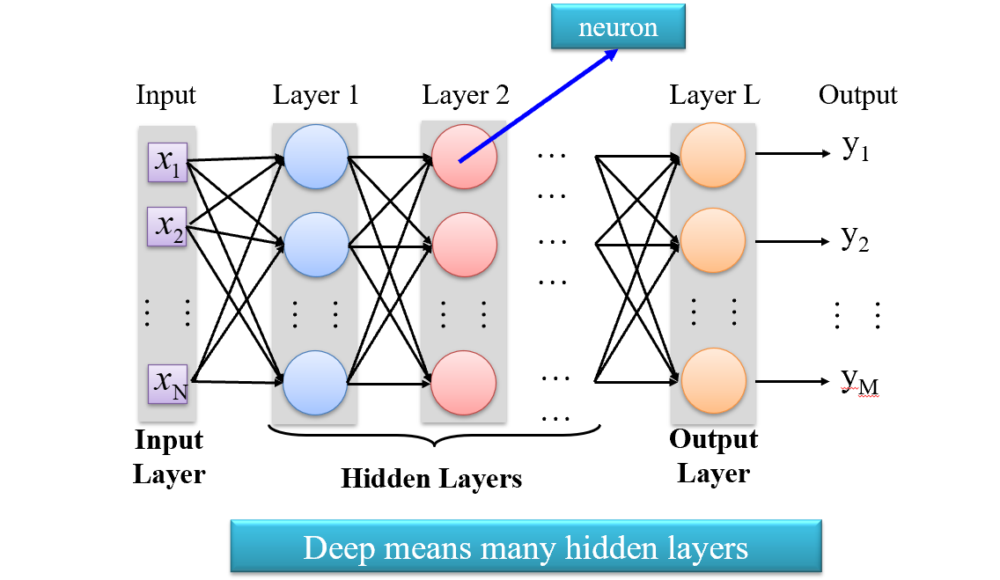
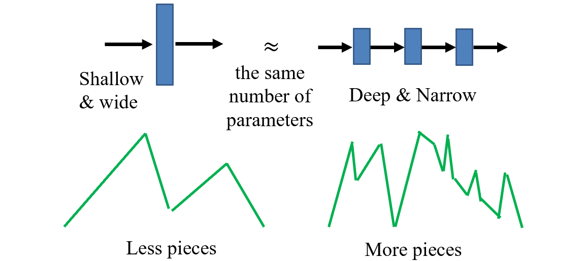
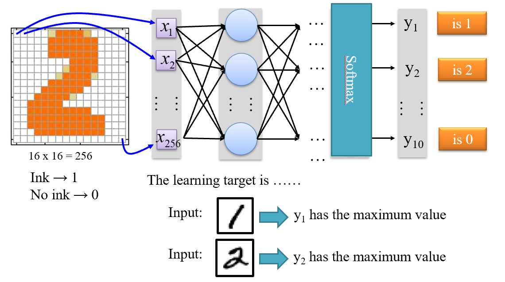
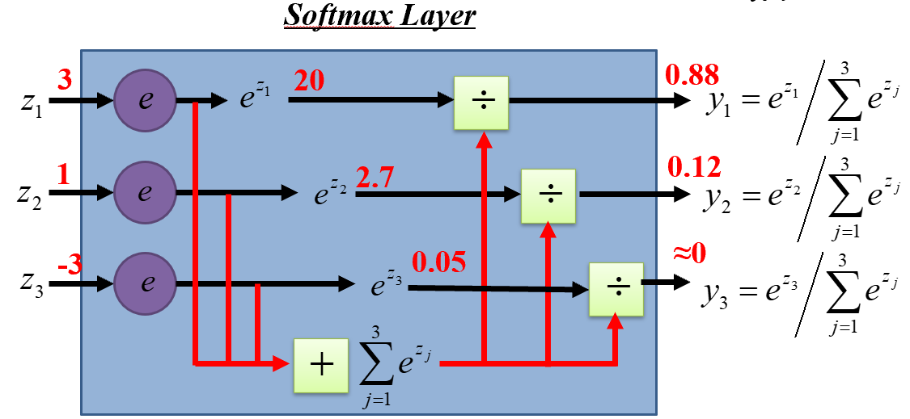
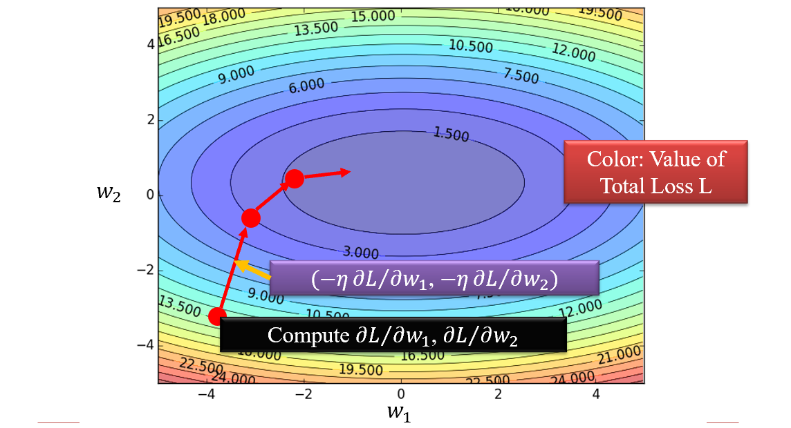
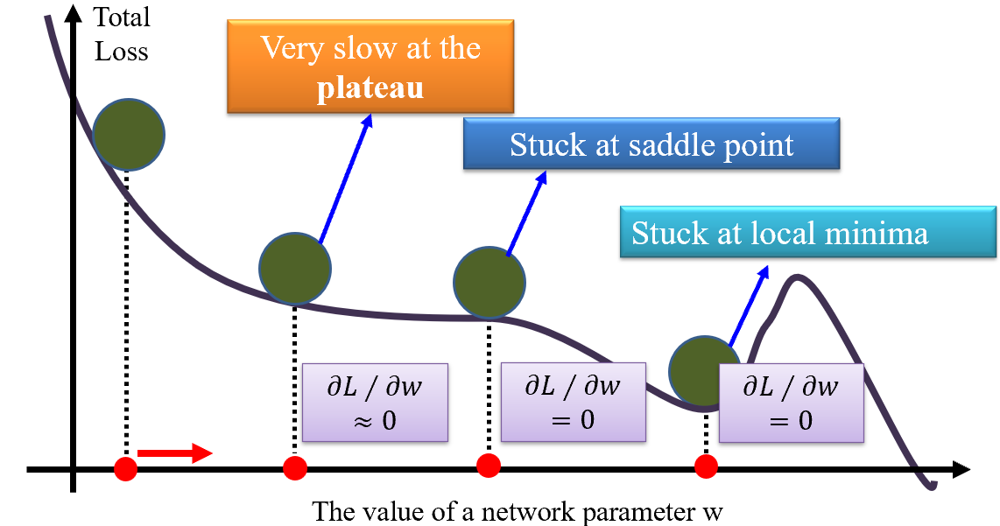

# Chap1 Deep Learning Basics

## 1 Machine Learning

本质是寻找一个**映射关系**（函数）。例如：

- 语音识别：一组表示振幅的数字$\to$语音内容（可以用每一个单词对应的数字序列表示），在映射关系内部的输入输出都是数字形式的
- 图像识别：照片（3个矩阵表示一张图像，分别表示RGB的亮度）$\to$识别出的图像内容，*根据任务的内容类别编号*
- 下象棋：棋盘（每个点使用`-1,0,1`表示不同的状态）$\to$下一步操作（可数因此可以分为有限个类别）
- 对话系统：用户输入$\to$机器的响应

机器学习的过程：

1. 定义一组函数，称作模型；函数中参数变化会带来模型变化；
2. 找到模型中比较好的参数：使用训练集评判对应参数的函数好不好，建立评判方式后的学习方式称为监督学习

神经网络采用的function是非线性系统。

### 1.1 Define a set of function —— Neural Network

#### 1.1.1 神经元

输入处理：

*非线性体现在激活函数*

激活函数不能采用简单的`(0,1)`分段函数的原因：有不可导点且存在梯度消失问题，反馈机制无法根据当前点的导数值判断当前函数和目标点的接近情况。

输出更多样，处处可导优化更方便，在`(0,1)`变化附近可以通过导数给出信号。

什么样的输入更容易激活：输入的特征和参数一致（大参数对应的输入更大）

#### 1.1.2 神经网络

几个神经元的输出作为下一个神经元的输入，从而构成网络结构。

例如FFN：

下一层的每一个神经元都能看到上一层的每个神经元的信息，层和层的神经元是独立的（方便向量计算，结构变化容易）。

参数定义function，网络结构定义function set。

标准的神经网络分为输入层、中间层、输出层：

hidden layers数量增长到一定程度之后会出现梯度消失问题，性能不再提升。

为什么深的比浅的好？

- 在相同参数的前提下，深的神经网络比浅的神经网络拟合能力更好。

  

trade-off就是计算量增大，需要算力支撑。

加速宽神经元计算：神经元分组，并行计算，只取部分分组参与计算；

加速计算：pipeline计算每层神经网络 - 先前向后反向的过程会产生bubble，解决方式之一是同时跑一个前向-反向和一个反向-前向。

### 1.2 Goodness of function

以手写数字识别为例，我们的输入层是每一个像素，输出层分别对应0~9的判别，哪个被激活就被识别为哪个数字：

输出层取最大值的操作也不可导，我们采用softmax layer，把数字间的差距变大，再归一化：

接着我们采用一个标准来评判模型的好坏，用loss来衡量输出和标准之间的差距。

一般采用平方${(y_1-\bar{y_1})}^2$ - MSE，不用绝对值是因为不可导。

整个模型的loss使用total loss评估，我们定义总损失最小的函数为最好的函数。

那么优化目标就转化成了最小化total loss的参数集合。

当参数过多的时候，我们采用随机梯度下降法（从所有参数中选择一个bench - 一组参数），这不一定能收敛到最优解，这个方法在算力充足的今天仍然被采用，因为匹配硬件。

### 1.3 Pick the best function

穷举法的复杂度过高。

我们采用梯度下降法去寻找使得L最小化的**参数集合**（是一个高维空间）。

动态学习率的有一种方法是模拟小球的运动，动量逐渐减少（动态学习率解决振荡问题）且在平坦的地方走得快陡峭的地方走得慢。

这个方法有一个问题是只能找到局部最优解，甚至停留在saddle point：

因此梯度下降对初始值的位置有要求。

寻找最优参数集合的过程为反向传播。

