# Natural Language Generation and Neural Machine Translation

*量子计算为什么快？- 因为模拟了从s到d的光的路径，走遍了两点之间的所有路径找到了最优，把一个问题设计成一个优化问题之后可以通过量子探索所有路径，相干抵消其他路径，坍缩至唯一保留的最优路径。*

- 判别和生成有什么关系？- 如果可以生成一样东西，那么自然就很容易判别它；因此生成任务本身对理解能力的要求很高。
- 目前我们已经将所有的处理任务都转化成了生成任务。

## 1 NLG

自然语言生成是很多任务的子模块：

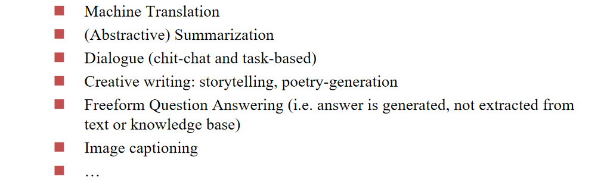

**Language Modeling** - **语言模型**：在窗口内上文的条件下next word的概率：

字典里面所有词的$P$相加应该等于1，这是一个**概率分布**。

由于概率值一般都比较小，所以我们在概率前加一个log，比较好把控精度。

我们给语言模型加入条件，就是**conditional** language modeling：

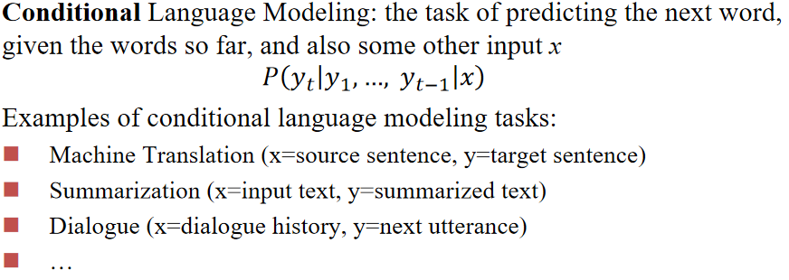

对给定的任务，我们加入特定的condition $x$，并通过RNN先编码之后作为条件概率的条件。

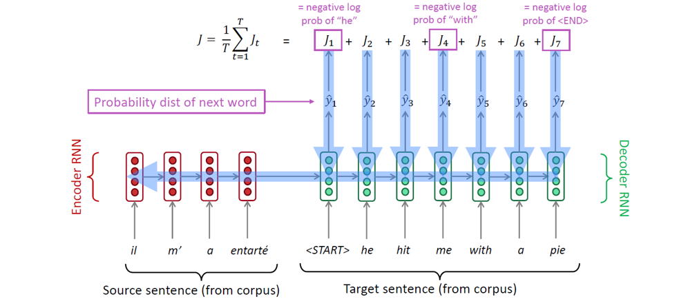

### 1.1 训练过程

在训练过程我们的反向传播调整同时涉及生成阶段和条件编码阶段。

在训练过程中，我们将gold（也称为reference）目标句子（前面的正确的预测结果）输入解码器，不管解码器预测什么。这种训练方法被称为teacher forcing。

但是这样会导致实际应用过程中的错误累积和放大。我们考虑设置一个训练过程中逐步降低的比例$q$，在前面预测错误的情况下以$q$的概率纠正即输入正确的前文，否则不进行纠正。

也可以采取强化学习的方式，只告诉句子整体好不好，不指出具体的错误。

### 1.2 隐空间传递

如何把编码器的编码结果向量给解码器？

- 有可能编码器输出的向量和解码器读入的向量维度不同，需要做transformation：
    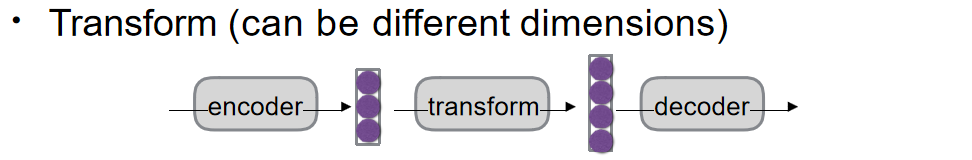
- RNN有可能出现遗忘，我们每次解码过程都输入一次编码器的输出向量：
    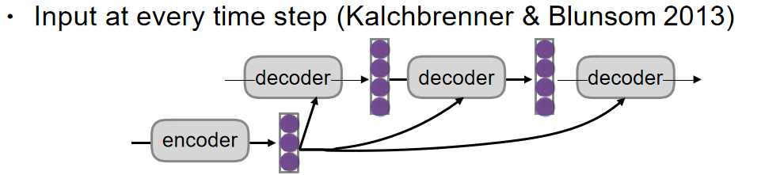

### 1.3 选词问题

**Argmax** - 每次选概率最大的词，是一个贪心的做法，每次提问的答案相同

**Sampling** - 以比较大的概率选择分数较高的词，所以不是百分百的概率选中概率最高的词。**目前我们采用的是这个方法**，每次提问的答案不同（有时候相同可能是因为采取了缓存优化）

分类：

**1. 纯采样 (Pure Sampling):**

- **过程:** 在每一步 `t`，都从概率分布 `P_t` 中随机抽取一个词作为下一个词。
- **对比:** 类似于贪婪解码，但不是选择概率最高的词 (argmax)，而是进行随机采样。

**2. Top-n 采样 (Top-n Sampling):**

- **过程:** 在每一步 `t`，首先将概率分布 `P_t` 限制为概率最高的 `n` 个词，然后从这 `n` 个词中随机抽取一个词作为下一个词。
- **对比:** 类似于纯采样，但会先截断概率分布，只保留概率最高的 `n` 个词。
- 特殊情况:
    - `n=1` 时，等同于贪婪搜索，每次都选择概率最高的词。
    - `n=V` 时，等同于纯采样，其中 `V` 是词汇表的大小。
- 参数 `n` 的影响:
    - **增加 `n`:** 会得到更多样化/更冒险的输出。 因为有更多的词被纳入考虑范围，模型更有可能选择一些不常见的词，从而产生更具创造性的文本。
    - **减少 `n`:** 会得到更通用/更安全的输出。 因为只有概率最高的几个词被考虑，模型倾向于选择更常见的词，从而产生更保守的文本。

**Beam search** - 类似于下棋不止考虑一步，考虑后面好几步之后的局面采取当前的最优解（当然步数也有限制，不然可能性太多计算量太大），采取top-n策略并且每次实施剪枝，只保留概率（这里做了log处理）最大的k (beam size) 个路径，最后选择每个节点和最大的路径：

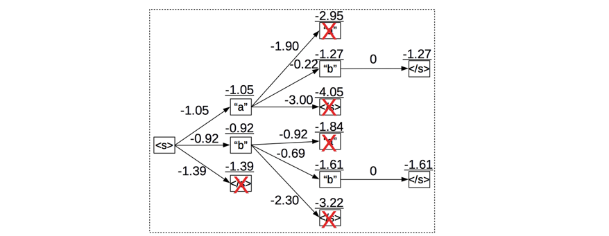

- **`k` 太小：** 容易陷入局部最优，生成质量差的文本。
- **`k` 太大：** 计算成本高，且可能导致生成结果过于保守、缺乏创造性，甚至在某些任务中降低评价指标。

还有一个问题：当k比较大的时候倾向于选择比较短的输出。

#### Softmax Temperature

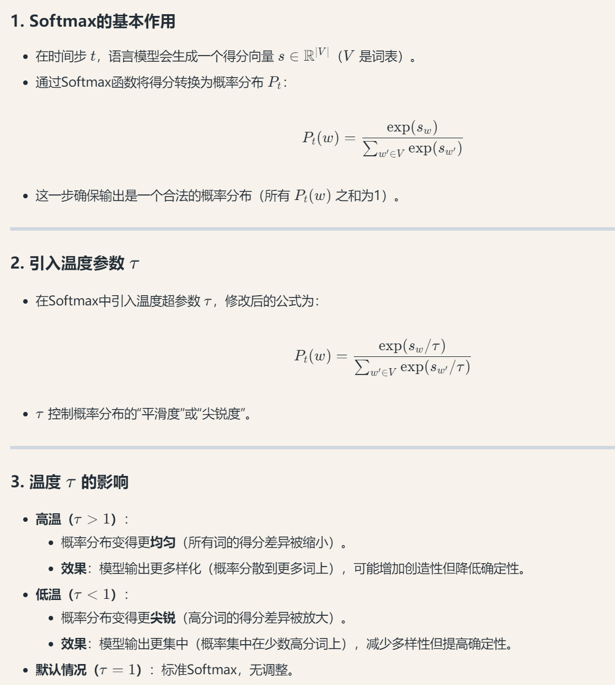

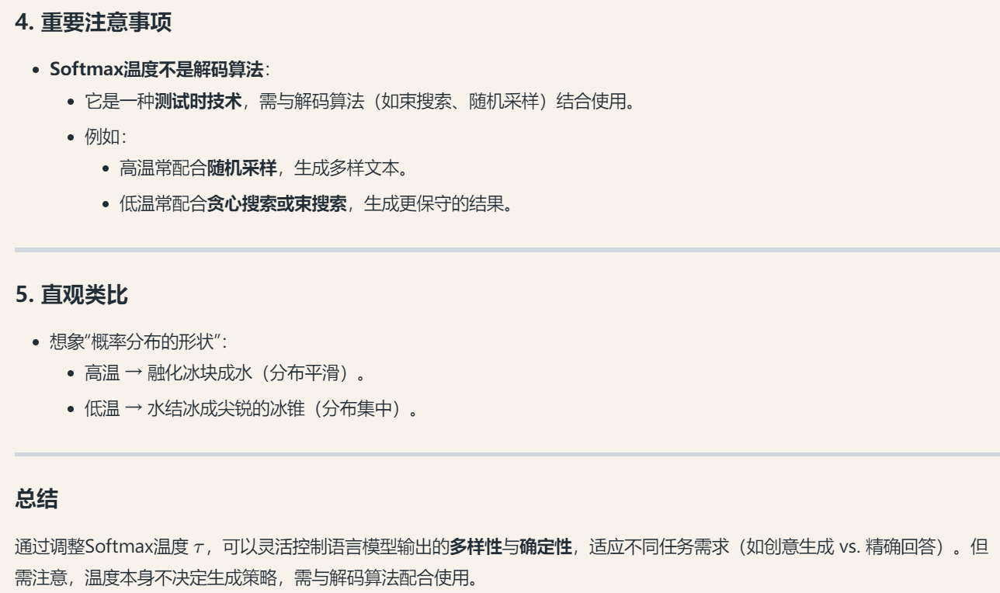

### 1.4 Ensembling

集成学习的核心思想是将多个模型的预测结果进行组合，以获得更准确和稳健的预测。

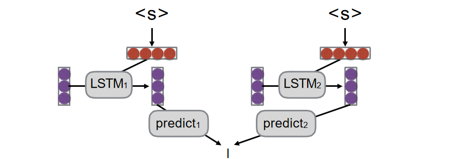

1. **输入**：两个 LSTM 模型（LSTM1 和 LSTM2）接收相同的输入序列（用红色圆圈表示）。
2. **预测**：每个 LSTM 模型独立处理输入并生成自己的预测结果（分别标记为 predict1 和 predict2）。
3. **集成**：将两个模型的预测结果进行组合（用底部的垂直线表示），生成最终的集成预测。

集成阶段的思路：让M1评估p2（p2在M1内的概率），M2评估p1。

### 1.5 Evaluation

#### 1.5.1 Human Evaluation

"Final goal, but slow, expensive, and sometimes inconsistent."

#### 1.5.2 BLEU

评估每个元组的生成比例，所有元组比例相乘最后乘上一个惩罚系数（简洁性的惩罚）：

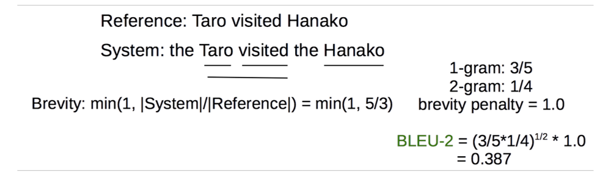

优点是简单；缺点是通常与人类评估不匹配，不利于比较非常不同的系统。

#### 1.5.3 METEOR

在BLEU的基础上考虑释义，重新排序，以及功能词/内容词的差异。

#### 1.5.4 Perlexity - 困惑度

$ppx = -\log(likelihood)$

likelihood就是我们说的似然函数：

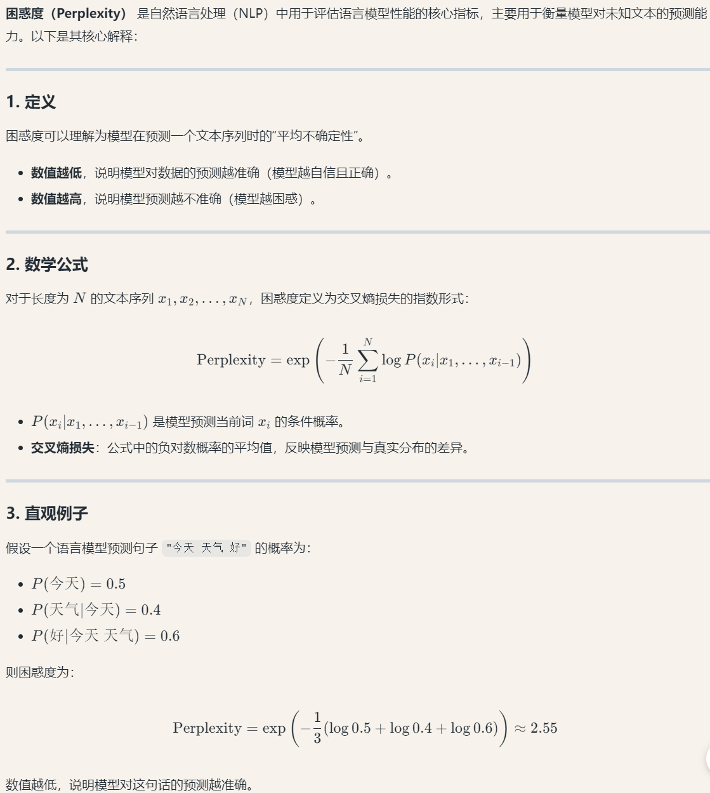

## 2 SMT

### 2.1 机器翻译历史

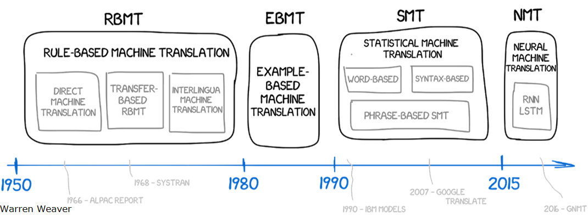

先是基于规则的直接翻译，而后期的统计机器翻译的核心是从语料数据里面学习一个概率模型。

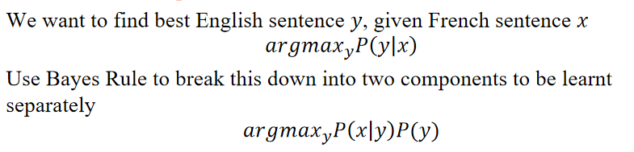

统计机器学习要解决的就是求上面这个公式，$P(y)$是母语群体说这句话的概率，$P(x|y)$则需要用到平行语料。