# Chap4 Recurrent Neural Networks

## 4.1 基本结构

*CNN从本质上是模拟了人的视觉，RNN相比CNN来讲多了“记忆”功能*

memory的加入使得神经网络可以处理时序问题，例如天气预测、股票涨跌、而文字中的上下文也是同理的。

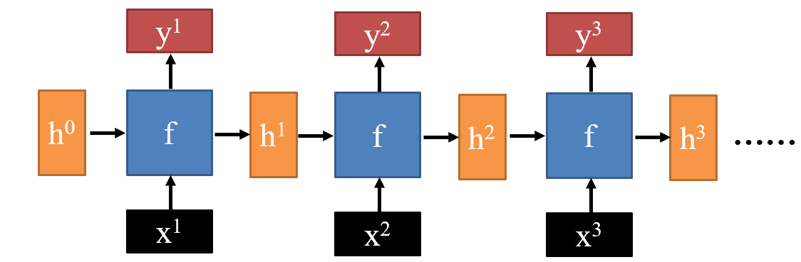

$h^n$是一个“记忆”向量，$h^0$最开始是随机初始化的，每次处理完之后改变再输入$f$里面。

比如执行语句分词任务：

```
"今天我来上nlp" --- BI B BI BII
```

这些词对应的`B`或者`I`就是下一个$f$的$h$。

## 4.2 RNN变种

**Deep RNN**

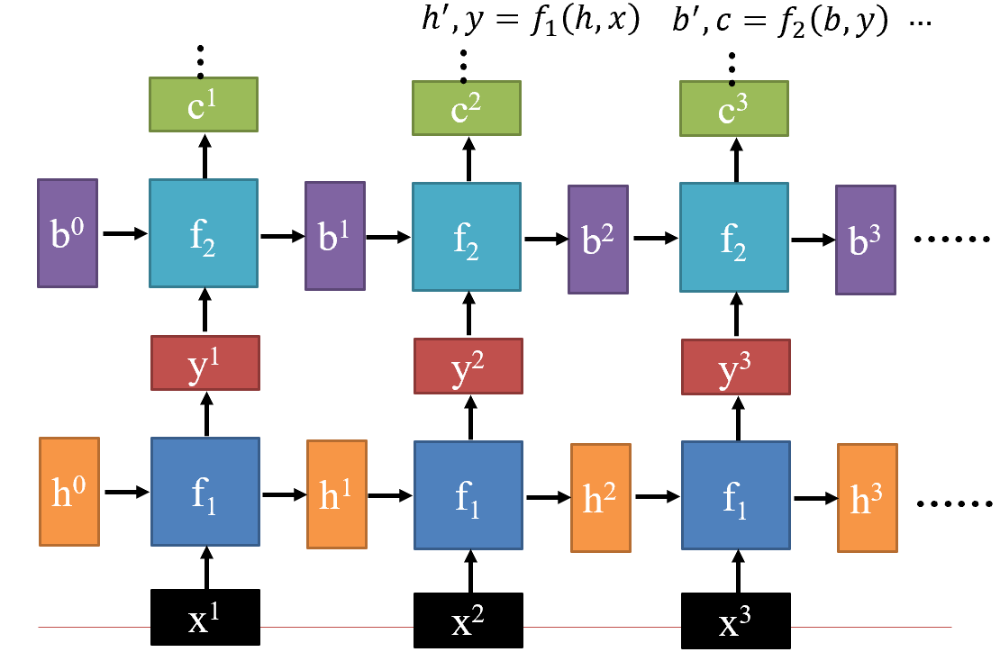

**Bidirectional RNN**

使用前向后向RNN分别获取双向（上下文）信息再合并

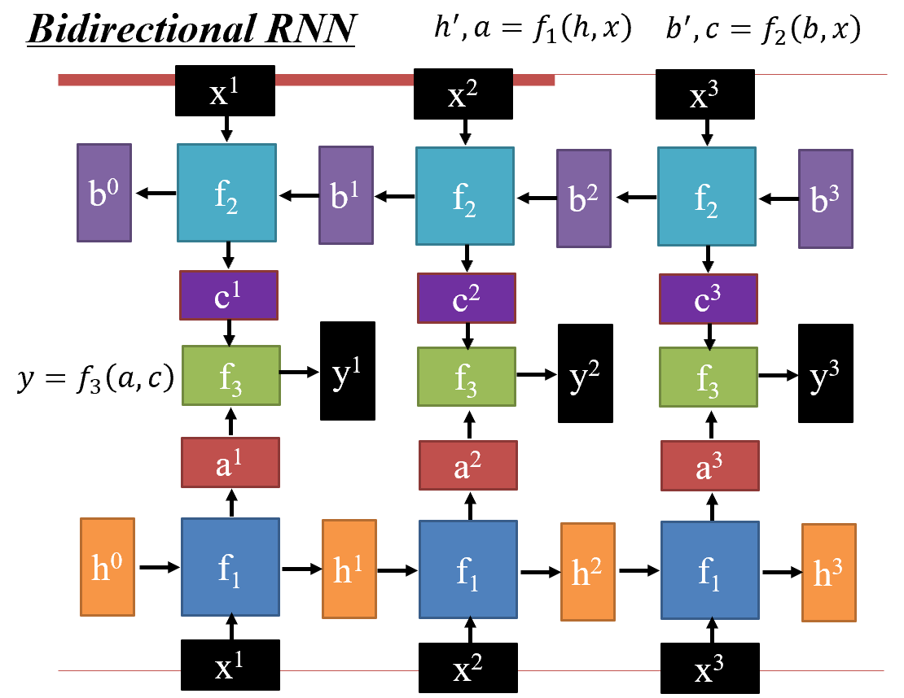

## 4.3 工作原理

### 4.3.1 最简单的**Naive RNN**：

先处理输入，使用$W^h$和$W^i$变到同一维度再**相加** - 其实也等价于一个$h + x\to h$的全连接神经网络

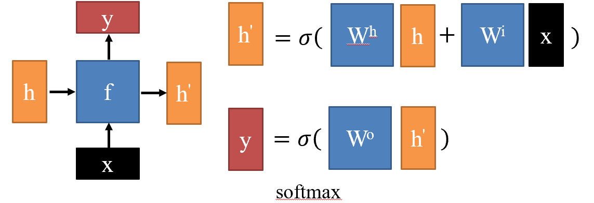

问题：

- $h$的变化太剧烈，新组合的记忆和原来的记忆差别大，“思维跳跃”，记不住内容也不稳定。

### 4.3.2 解决方式：**LSTM** - 长短时记忆

把输入记忆分成：$c$ - 长期记忆，改变小，通过加法改变；$h$ - 短期记忆，改变快

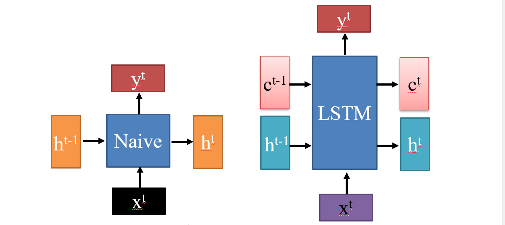

实现方式：

1. 根据输入决定哪些写入长期记忆、哪些从长期记忆去掉，哪些写入短期记忆；拼接投影调整维度之后激活，每个维度都是`0`或者`1`，表示这个阀门是否开放
   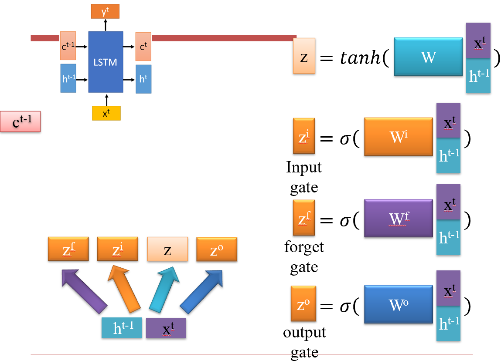
2. peephole：仅仅缩放长期记忆，并且把长期记忆拼接入输入
   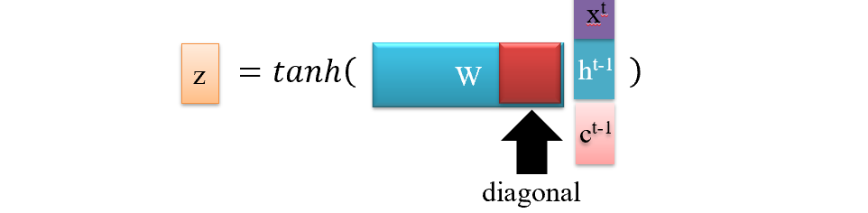
3. 这个圈圈表示逐位相乘但不相加。</br>
   $z^i$控制哪些数据要向前传，$z^f$控制哪些记忆需要忘记一些，两者相加构成新的长期记忆；</br>
   $z^o$和长期记忆组合就是短期记忆，也是输出；</br>
   根据这些规则不断传递、更新记忆。</br>
   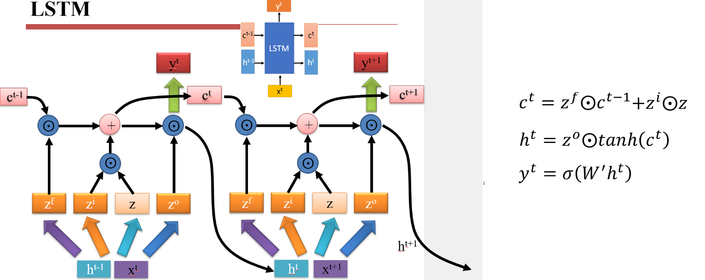

为了探究LSTM中哪部分最重要，谷歌做了一个消融实验。
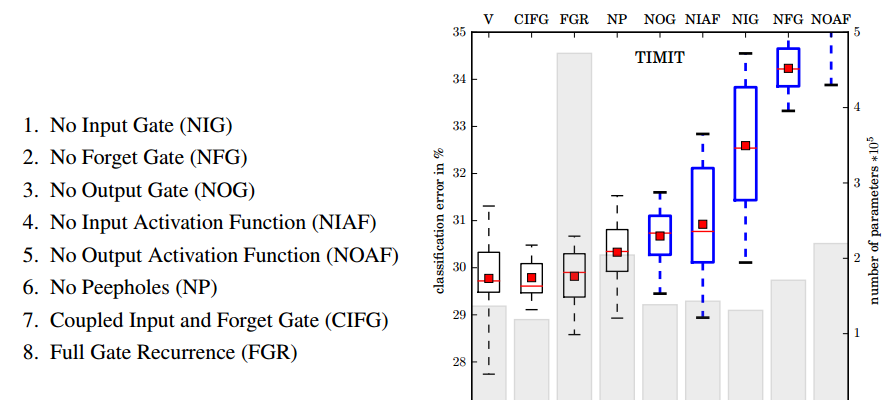

探究结果：</br>
1. 标准 LSTM 运作良好</br>
2. 简单 LSTM：耦合输入和忘记门，去除窥视孔</br>
3. 忘记门对性能至关重要</br>
4. 输出门激活功能至关重要</br>
问题：</br>
1. 串行的，计算慢且不好gpu加速</br>
2. 梯度消失/爆炸问题：LSTM在做计算的时候会被展开成一个非常深（导致梯度消失）且中间参数都一样的神经网络，而且不好做跳跃会导致信息丢失；最后我们输出可以表示为$y = W^{LT}X$，$L$表示层数，这样的结构容易导致跳变巨大的损失函数，是对反向传播优化过程非常不友好的解空间，并且特别大的梯度相乘会在程序上带来`NA`错误，导致网络崩溃</br>
   - 最简单的解决方式：weight clear，梯度截断，#define MAXN 9999..，一旦出现`NA`将其替换成`MAXN`</br>
   - 其他方法：回滚，重新训练</br>
变种：</br>
*不同的连接方式*</br>
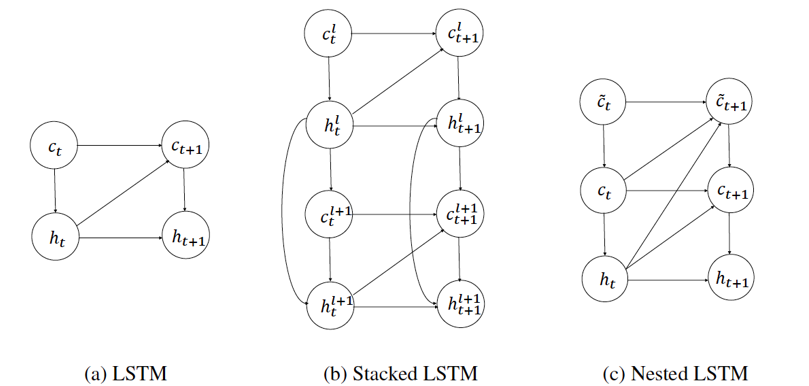

### 4.3.3 GRU
只有一个记忆，把input gate和forget gate合成一个reset gate：
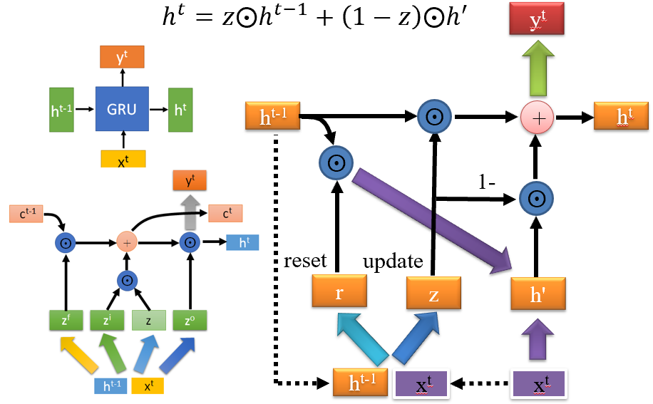
工业界效能更好。

## 4.4 RNN for NLP

相比CNN，RNN擅长捕获远距离依赖关系。

1. 编码器
      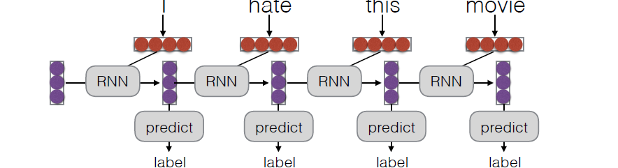</br>
      训练：手动设置训练集label，出错之后反向传播，调整路径上面的RNN的参数</br>
      最后也输出的代表整个句子的词向量用于后续的分类任务。
2. 解码器：用于生成任务，例如next token prediction
   
我们将编码器和解码器连起来，就构成了sequence to sequence的架构：
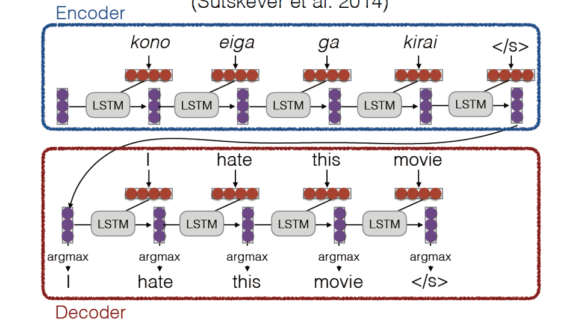
上述就是一个翻译任务的流程，句子读取完毕之后就实现了这个句子在语义空间的编码，之后的decoder根据语言词典和句子在语义空间的编码（memory）完成逐个单词的翻译，同时记忆也随着之前被输出的单词而更新。