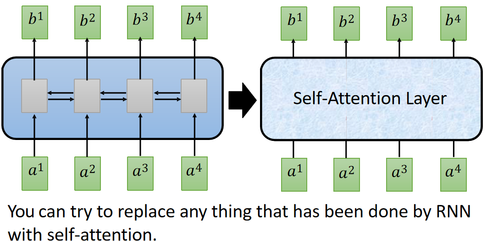
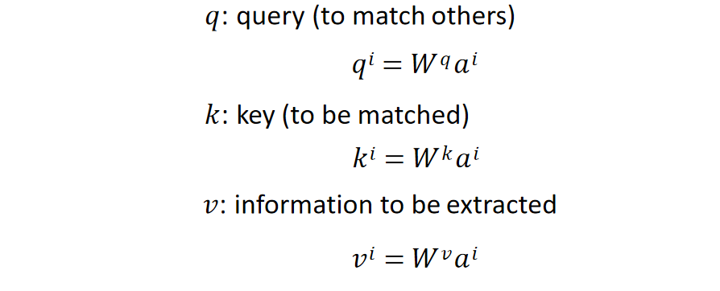
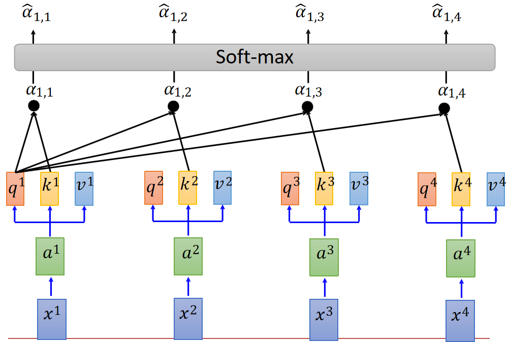
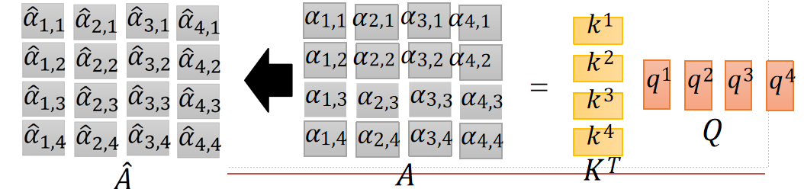
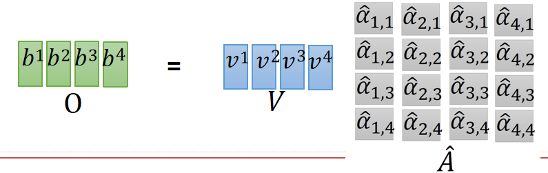
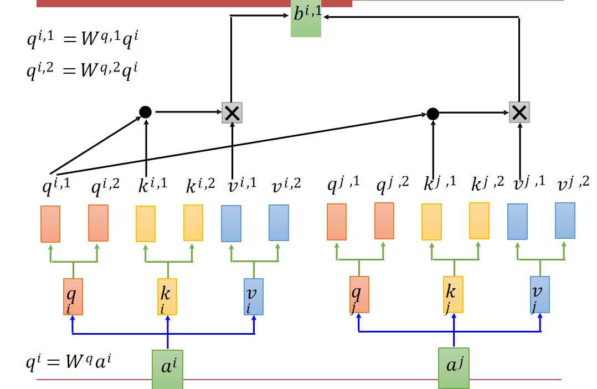
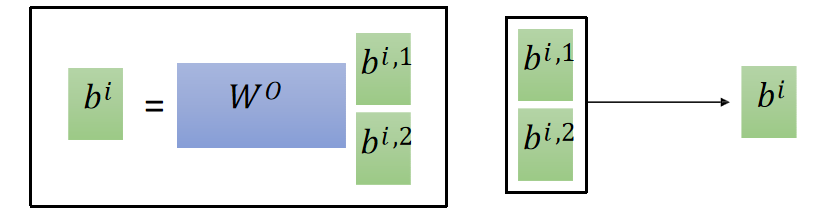
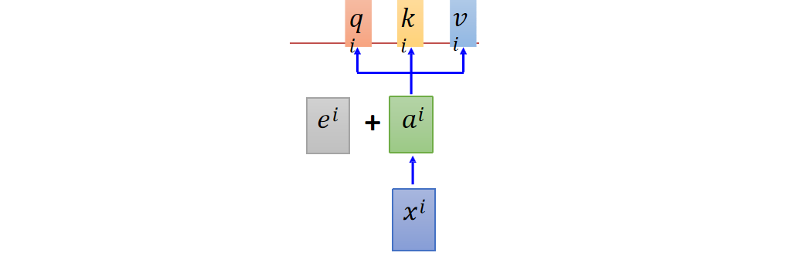
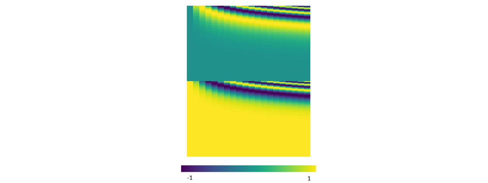
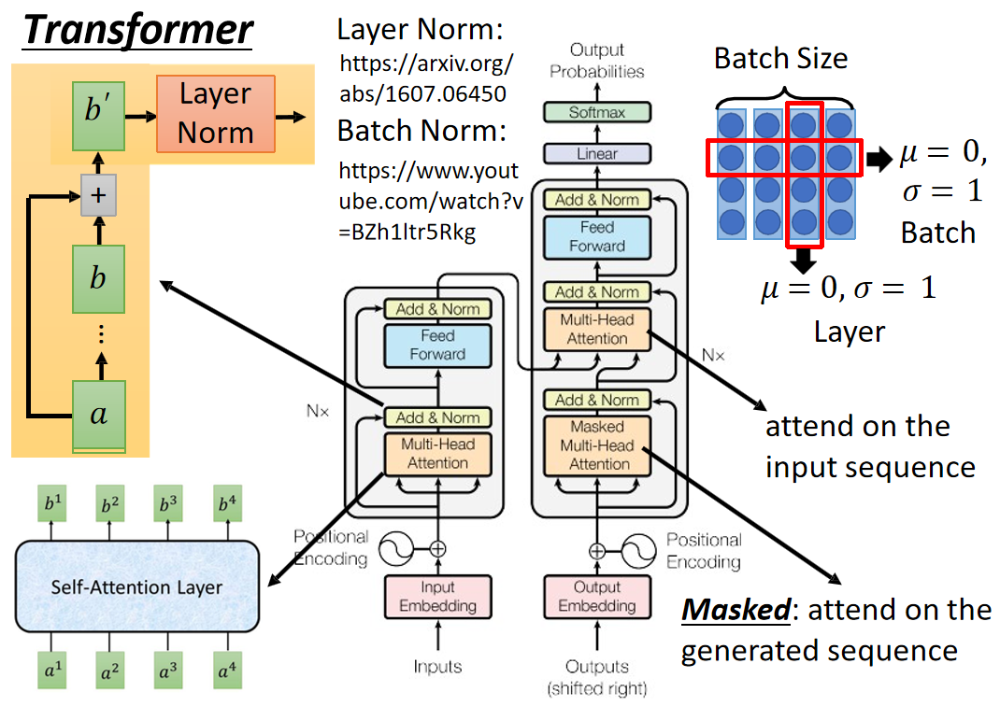

# Transformers

## 1 组件细节

### 1.1 自注意力

RNN的缺点是难并行（激活层有串行的依赖关系） - 不好scale up，于是我们考虑把它替换成自注意力层。

把每一个输入向量编码成`q`、`k`和`v`三个向量：

使用自己的`q`和其他的`k`相乘、归一化计算两两之间的注意力：

而我们可以把所有`q`拼到一起，把所有`k`拼到一起，矩阵相乘（可以使用GPU加速）算出所有的attention（再归一化）：

最后和`v`相乘得到编码结果：

### 1.2 多头注意力

我们的`q`编码取决于任务类型，而不同的任务类型可能会带来不同的`q`，所以这个时候就产生了多头注意力机制：

但实操的时候就分开两组`q`和`k`计算`b`，最后把两组`b`拼在一起：

### 1.3 位置编码

但是这样的self-attention丢掉了语序的信息，所以我们要在向量中加入位置信息的编码（最简单的方式就是在内容的向量中拼接一个one-hot representation，但是这样长度不定，而且耗费参数；我们通常直接在上面加一个位置编码）：

使用频率变化表示位置（从左到右一列代表一个位置，越靠后频率越高，既可以表达绝对位置也可以表达相对位置）：

## 2 整体架构

transformer快在编码，解码是无法并行的。

bench-normalization：对每一个bench的每一个维度做均值为0方差为1的高斯归一化，