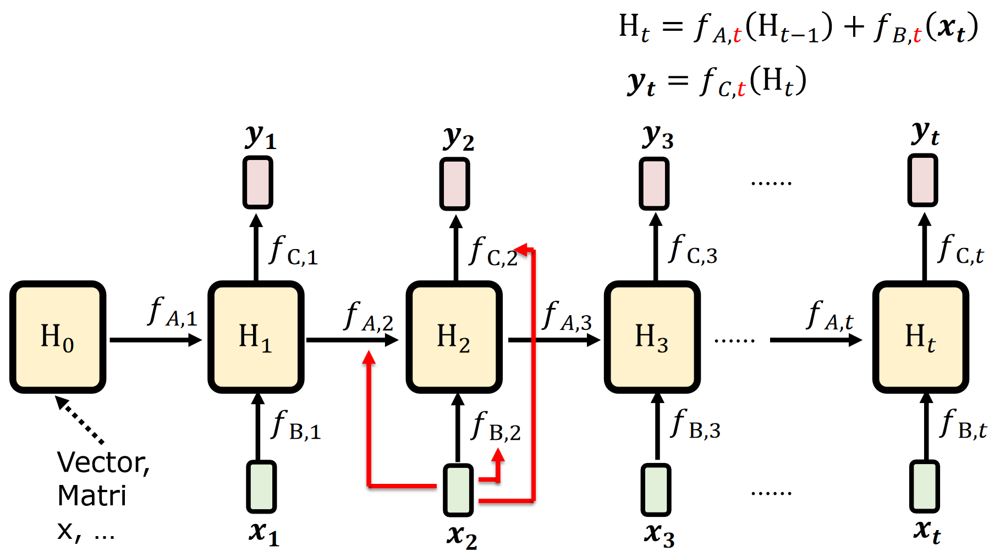

# Transformers

## 1 组件细节

### 1.1 自注意力

RNN的缺点是难并行（激活层有串行的依赖关系） - 不好scale up，于是我们考虑把它替换成自注意力层。

首先我们会通过字典将输入的单词变成tokens，查字典的过程可能有不存在在字典里面的词，有一种处理方式是使用`<UNK>`，但是低频词往往是很重要的词，所以会带来问题。现在有一种比较好的处理方式是使用Unicode编码。

Transformer和MLP、RNN比较像。

把每一个输入向量编码成`q`、`k`和`v`三个向量：

使用自己的`q`和其他的`k`相乘、归一化计算两两之间的注意力：

而我们可以把所有`q`拼到一起，把所有`k`拼到一起，矩阵相乘（可以使用GPU加速）算出所有的attention（再归一化）：

最后和`v`相乘得到编码结果：

和原始token的v相加得到当前token的语义向量：

### 1.2 多头注意力

我们的`q`编码取决于任务类型，而不同的任务类型可能会带来不同的`q`，所以这个时候就产生了多头注意力机制：

但实操的时候就分开两组`q`和`k`计算`b`，最后把两组`b`拼在一起：

实验发现multihead其实是有冗余的，多个head的工作效果可能和保留一个最好的head没有什么区别，但是如果不做多个head又找不到最好的那个head。

### 1.3 位置编码

但是这样的self-attention丢掉了语序的信息，所以我们要在向量中加入位置信息的编码（最简单的方式就是在内容的向量中拼接一个one-hot representation，但是这样长度不定，而且耗费参数；我们通常直接在上面加一个位置编码）：

使用频率变化表示位置（从左到右一列代表一个位置，越靠后频率越高，既可以表达绝对位置也可以表达相对位置）：

## 2 整体架构

transformer快在编码，解码是无法并行的。

### 2.1 normalization

随着模型参数的增加，我们一次可以输入训练的参数也变少了，我们的方式是多次输入小批量的数据，记录梯度但不立马做梯度下降更新参数，而是等待所有训练数据都分批次输入完毕之后梯度累加更新参数。但是每一个batch都可能有不一样的特征导致模型永远处于抖动状态无法收敛。因此我们要做batch-normalization：对每一个batch的每一个维度做均值为0方差为1的高斯归一化。

但是在transformmer里面做的是layer-normalization，把每层的输出结果拉到比较相似的维度。

- **Batch Normalization (BN)**
    - 计算维度：对同一特征通道的所有样本进行归一化（跨样本）。
        - 假设输入张量形状为 `[batch_size, channels, height, width]`（如CNN），BN 对每个通道独立计算均值和方差（即对 `batch_size × height × width` 的所有值归一化）。
    - **依赖Batch大小**：需要较大的batch size（如32以上）来稳定统计量，小batch时效果差（因统计估计不准确）。
    - **适用场景**：CNN等固定维度模型，对batch size敏感。
- **Layer Normalization (LN)**
    - 计算维度：对单个样本的所有特征进行归一化（跨特征）。
        - 对 `[batch_size, channels, height, width]`，LN 对每个样本的所有 `channels × height × width` 计算均值和方差。
    - **不依赖Batch大小**：统计量仅基于单样本，适合小batch或动态batch（如RNN、Transformer）。
    - **适用场景**：RNN、Transformer等序列模型或变长输入。

### 2.2 feed-forward

在自注意力机制融合了序列中不同位置的信息并更新了每个位置的表示后，FFN 独立地对每个位置的这个新表示进行非线性的、更复杂的转换和特征提取，从而增强了每个位置的向量表示能力，为后续层或最终的输出任务提供更丰富的特征。它是 Transformer 中不可或缺的一部分，与自注意力机制相辅相成，共同构建了 Transformer 强大的表示学习能力。

feed-forward：中间宽，两边短/少，占据了transformer的大部分参数，计算复杂度很高，我们通常会将不同的维度进行切分并行计算：

map reduce的问题是通讯代价很高，并且一个地方出问题会导致整个任务失败。

有一个类似的方法是MOE，将一个大网络拆分成多个（例如上图就是4个）小网络，把密集激活改成稀疏激活：

---

AI的解释是：

MOE即Mixture of Experts（专家混合模型），下面从概念、工作原理、应用场景等方面进行通俗讲解。

**概念**

想象你要解决一个复杂的问题，比如给不同类型的水果分类，有苹果、香蕉、葡萄等。一个人可能没办法对所有水果都了如指掌，但是如果有一群专家，其中一个专家擅长识别苹果，一个擅长识别香蕉，另一个擅长识别葡萄，把这些专家组合起来，让他们一起工作，就能更准确地完成水果分类任务。MOE就是基于这样的思路，它把多个不同的“专家模型”组合在一起，每个专家模型擅长处理某一类特定的数据或任务，通过协作来完成一个更复杂的任务。

**工作原理**

1. 专家模型（Experts）

- 这些专家模型就像是各个领域的专业人士。在机器学习里，每个专家模型通常是一个神经网络，它们被训练来处理输入数据的不同部分或模式。例如，在图像识别任务中，一个专家模型可能擅长识别动物，另一个可能擅长识别交通工具。每个专家模型独立地对输入数据进行处理，并给出自己的预测结果。

2. 门控网络（Gating Network）

- 门控网络就像是一个调度员，它的作用是根据输入数据，决定每个专家模型在最终决策中所占的权重。当有新的数据输入时，门控网络会分析这些数据，然后判断哪个专家模型更适合处理这些数据，为每个专家模型分配一个权重。比如，当输入的是一张动物的图片时，门控网络会给擅长识别动物的专家模型分配较高的权重，给其他专家模型分配较低的权重。

3. 最终输出

- 最后，根据门控网络分配的权重，将各个专家模型的输出进行加权求和，得到最终的预测结果。例如，如果有三个专家模型，门控网络给它们分配的权重分别是 0.6、0.3 和 0.1，那么最终的输出就是这三个专家模型输出按照这些权重进行加权组合的结果。

**应用场景**

自然语言处理

- 在机器翻译中，不同的专家模型可以分别处理不同类型的句子结构或语言风格。比如，一个专家模型擅长处理正式文体的句子翻译，另一个擅长处理口语化句子的翻译。门控网络根据输入句子的特点，为这些专家模型分配权重，从而提高翻译的准确性。

图像识别

- 对于复杂的图像识别任务，如识别包含多种物体的场景图像。不同的专家模型可以分别专注于识别不同类型的物体，如人物、建筑、车辆等。门控网络根据图像的内容，决定每个专家模型的贡献，以实现更精确的图像识别。

**优势**

- **提高性能**：通过将不同的专家模型组合在一起，MOE 能够利用每个专家模型的优势，处理更复杂的任务，从而提高整体的性能和准确性。
- **可扩展性**：可以根据需要添加或减少专家模型，以适应不同规模和复杂度的任务。

---

### 2.3 Transformer without normalization

在图像、声音的模态处理上，transformer的layer norm层的效果和tan函数很像，于是就使用这一函数替代了layer norm层，所提出的新方法就被称作DyT。

## 3 改进与拓展

最开始的优化主要是基于自注意力机制（占据了非常多的计算量）。

### 3.1 MLP-Mixer

*用MLP做信息混合，主要应用于图像处理领域*

（参数以下图为例，可以视实际情况调整）把图像切成3*3的patch，把一个patch作为一个token，形成9个channel，把channel翻转一下然后对各个维度的特征做混合，再翻转回来对各个patch的特征做混合，最后mix之后的矩阵就包括了不同维度不同patch内的特征（相当于qk重合？），非常快速地实现了注意力机制。

*相当于是一个x轴的傅里叶变换和y轴的傅里叶变换叠加可以代表任何形式的傅里叶变换*

### 3.2 Linear Attention

上图是RNN的架构，我们一般认为其公式是和$t$严格相关的串行的生成，无法并行训练，但是其好处是它的参数量/时间和输入长度没有平方关系（即对输入长度没有限制）。

那么RNN是否可以尝试实现并行训练呢？

我们把它的生成过程展开并且代入：

发现限制我们并行计算的是$f_A$的递归调用关系，那我们尝试不要$f_A$，也就是让模型不遗忘。

我们发现这些计算都可以并行，并且其形式和注意力机制没有什么区别（除了没有softmax），于是我们称之为linear attention：

去掉forget gate会不会有问题？- 会，在RNN笔记中有提及相关的实验。

它和transformer最大的区别是没有softmax，使用绝对值去处理特征（忽略了输出之间的相对大小关系）：

### 3.3 Retention Network

在linear attention架构的基础上为记忆加一个系数，模拟其被遗忘的过程，使得新加的东西对其有影响：

### 3.4 Gated Retention Network

为遗忘参数添加了一个控制方式：

体现在架构上面就是多算了一个γ：

更细化的改进有为记忆圈乘（逐位相乘不相加）一个矩阵（不同的列代表不同功能），逐个元素地控制下一步的记忆：

---

这一类工作的汇总（$S$就是“记忆”）：

其中mamba是第一个在文本任务中做出效果的模型：具有随着参数增大而涌现出智能的特征，特别擅长做推理，参数小速度快。

## 4 预训练+微调

预训练：先通过其他低成本的任务训练模型，使得模型具有解决最终复杂任务（训练成本可能很高甚至无法做）的能力

然后再拿预训练好的模型在具体任务上面做微调，整个流程大致如下：

### 4.1 怎么做预训练

预训练的核心要求其实就是无成本，例如词向量等等，大量的公开数据、平行语料即可实现。

除了word2vec，还有其他训练方式：

**1. Glove**

**2. FastText**

**3. 使用CNN理解中文token**

这类方式的问题是每一个token的独立表示都是一致的，没有受到上下文的语义影响，不带上下文语义。

于是我们使用Contextualized Word Embedding（例如LSTM、Self-attention layers和Tree-based model）去解决这个问题：

使得“狗”这个token也包括了前文的信息，那基于这些一词多义现象，我们可以有一个以向量相似度（下图中越黄表示“苹果”一词的语义相似度越高）为基准的聚类方式：

由此，（因为数据的免费的）自监督预训练的方式带来了很多大模型。

但是模型变大又会带来很多任务的问题，我们又产生了很多缩小模型（尽可能保留效果）的方法：

还有一些架构（这里老师没有细讲）：

### 4.2 fine tuning

#### 4.2.1 任务分类

从输入输出的角度我们可以将自然语言处理任务分为八类：

对于多句话的输入任务，我们需要对每句话之间使用特殊的token做一个分割：

对于copy from input任务，我们输入输出范式如下：

实现的方式则是通过两次注意力机制分别找到答案的开头的token和答案的结束token：

而对于seq2seq的任务我们就使用一个encoder接上一个decoder的方式：

但是这里还有一个问题，就是我没有办法训练decoder（是task specific的），所以我就把这个decoder放在预训练，使得预训练的model既作encoder又作decoder，同时调整注意力机制使得这个encoder任务看不到后面的答案：

#### 4.2.2 微调方式

在fine-tune阶段我们会有两种参数调整方式，一种是同时调整model和task-specific的参数，但是这个方式的训练成本太大了，另一种方式就是固定预训练的model只调整task-specific的参数。

于是有了adaptor和lora两种微调方法：

##### 4.2.2.1 Adaptor

在预训练的model里面内嵌一个Apt，训练的时候同时调整Apt和Task Specific的参数：

具体嵌入方式如下：

还有一种处理方式是**Weighted Features**，就是拿不同隐藏层的输出加权（加权方式是训练出来的）作为Task-Specific的输入：

##### 4.2.2.2 LoRA

全写是low rank adaptation。

对参数做低秩分解，因为可能很多参数是冗余的，可以把大矩阵做小矩阵拆解（保证之后两个小矩阵相乘可以还原大矩阵），减少了参数的数量。

不同于adapter，LoRA加在了transformer的旁路上，优势是可以比较好地不破坏模型的结构。

### 4.3 自监督学习

监督的信号来源于输入的数据本身，比如把x拆成x1x2，x1作为输入预测x2。

自监督学习的优势是什么？- 相比监督学习数据量大，相比强化学习反馈信号密集

劣势是什么？- 数据质量没有好的保障

以下是自监督学习的几个方式：

##### 4.2.3.1 BERT

使用上下文去预测被mask的词（也可能是random token，因为实际执行任务的时候没有mask）：

##### 4.2.3.2 Predict Next Token

就是gpt的方式，基于自回归的next-token-prediction

这里需要对注意力机制做处理：（如果用LSTM没问题，如果用transformer需要做好前面token看不到后面token的注意力处理）

这里可以理解为加了mask就是decoder，不加就是encoder。
encoder-decoder架构就是通过拼接两种注意力掩码实现的。