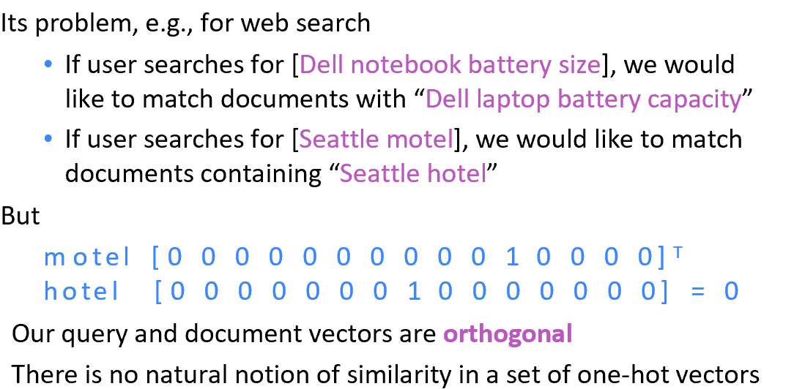
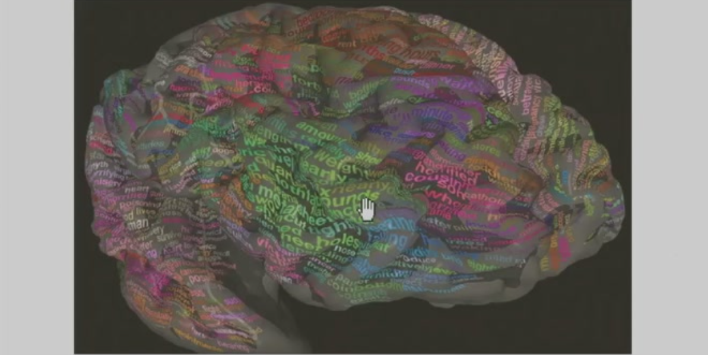
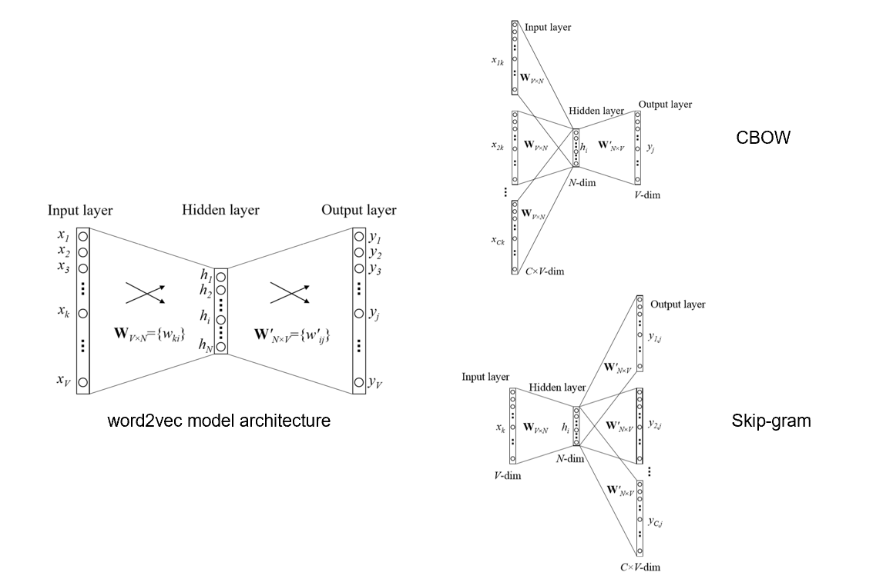
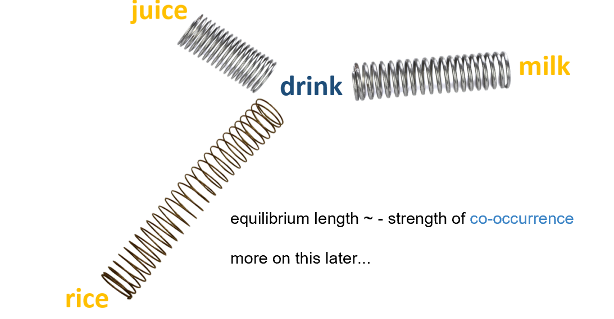
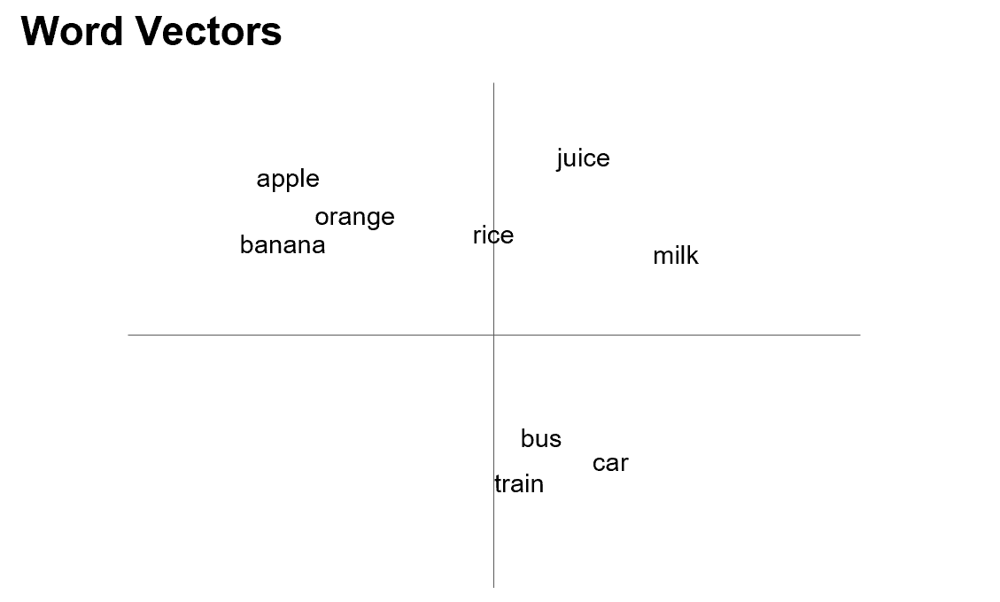
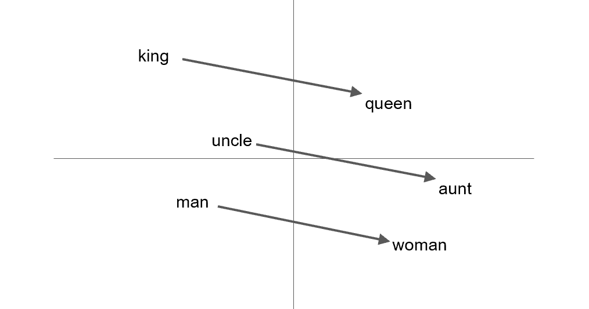

# Chap2 Word Embedding

## 1 离散的单词表示

什么是embedding？- 高维空间的投影，本质上是一种降维，每一个点根据低维轴的语义特征分布，可以度量每个点之间在指定特征上的距离。CNN支持非线性投影。

如何降维 - 比如四个输入两个输出，神经网络两个全连接层，第一层4个神经元第二层2个神经元

在embedding之前如何表达词的意思？ - 构造一个字典WordNet

用数字表示单词的弊端 - 引入了无端的关联，比如单词之间没有大小、加和关系

- 于是我们把单词表示成数轴上面的一个轴（one-hot representation），例如`(0,0,1),(0,1,0),(1,0,0)`，对一篇文档的每个词向量相加即可得到每个词的频率向量（TFV），每个文档的向量距离代表其相似度。
    - 问题：
        - 高频词比如"the" "a"等所有文档都很多，需要用一个stop word词典去掉这些词的影响
        - 检索不出同义词，无法捕捉词语之间的语义关系，每个词语都是正交的
          
        - 耗费空间
    - 逆词频：计算一个词在多少篇文章出现，如果出现得少就更具有代表性
## 2 Distributional similarity based representations

通过听到不同单词的人脑状态（不同脑区的激活、抑制情况 - 一个向量）划分单词：

如何了解一个词的意思：通过上下文，如果在某个上下文去掉这个词，再填入的那个词就和原来的词表征就比较相似。

这个过程的两种方法：

1. continuous bag-of-word (CBOW)
      把上下文送到模型预测`apple`
      
      - 输入：字典维向量，隐藏层乘input matrix降维至300维左右（经验数值），再乘一个output matrix升维至字典维输出
      - 但是这个输入是one hot的，所以并没有做计算，过程无非就是选了一个300维的向量，这个向量$v$直接影响到输出的上下文，所以这个$v$的距离也就表示了单词之间的相似程度

2. skip-gram (SG)
      把`apple`输入进去预测上下文
      

训练过程宏观考量是调整单词之间的”距离“，因为只有接近才能被激活；这是一个动态平衡的过程（一个单词和别的很多单词都有关系）：

最后的结果：

可以在语义空间做计算，例如`king - uncle`这个欧式距离表示从男性到女性的转变：

## 3 上述工作几个优化方向

其实这个做法并没有理论上的贡献，它认为的技术创新：

1. 计算输出层的时候，使用特殊方法加速：输出的时候不再使用one-hot编码，采用huffman编码，因为预测是逐位预测的，所以把高频词放到huffman tree的头上，只需要预测几位就可以（预测一个path），比如之前需要预测5万位，但是"the"这个高频词可能预测3位就结束了。
      - 但是应用并不多，因为不符合硬件支持，GPU反而更适用于原始方法
2. negative sampling负采样
      - 通过最大化正样本的概率和最小化负样本的概率来训练模型，使得相似的词在向量空间中靠近，而不相关的词远离。

## 4 应用

1. 衡量word similarity
2. 机器翻译：在语言空间对齐不同语言的词语
3. ...

## 5 缺陷

1. 没有办法解决一词多义问题
2. 比较难调试，基于语料驱动的训练过程比较难修改（手动干预训练过程）
3. ...