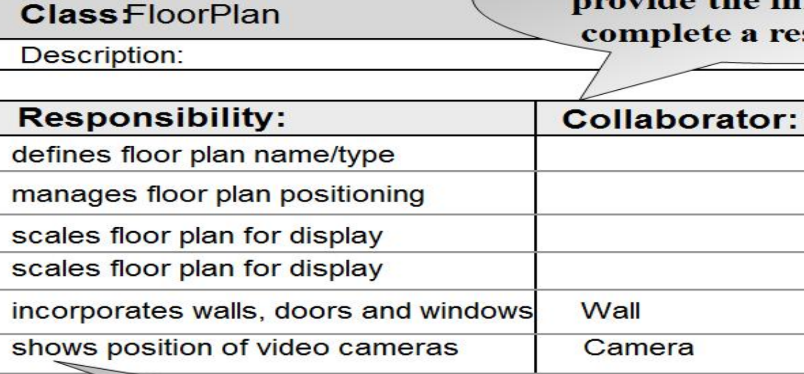

# 软件工程 期末速成笔记

## 知识点

### 第一章 软件的本质

- 软件的定义是构成一个配置的一系列条目或对象的集合
    - 指令
    - 数据结构
    - 文档
- 特性：损耗与退化
    - no wear out but deteriorate
    - 失效率 - 浴盆曲线
    - 退化：持续变更引入新错误导致质量下降
    - 无备件
- 应用类型
    - 系统软件
    - 应用软件
    - 工程/科学软件
    - 嵌入式软件
    - 产品线软件
    - web/移动应用
    - 人工智能软件
- 遗漏软件
    - 长生命周期
    - 业务关键性
    - 如果重大变更 —— Reengineering
- 软件神话
    - 错误观念

### 第二章 软件工程

- 层次化技术
    - 质量关注 quality focus
    - 过程 process - 管理和组织开发
    - 方法 methods - 开放和分析软件的技术和步骤
    - 工具 tools - 支持过程和方法的自动化工具
- 过程框架的五个活动
    1. 沟通
    2. 策划
    3. 建模
    4. 构建
    5. 部署
- 七项通用原则
    - 存在皆为价值
    - 保持简单
    - 保持愿景
    - 他人将消费你所生产的
    - 拥抱未来
    - 为复用提前计划
    - 思考

- umbrella activities - 软件工程的支撑活动，项目管理、质量保证、配置管理等

- agile process models - 敏捷过程模型

### 第三章 软件过程结构

- 四种过程流 process flow
    - 线性 linear
    - 迭代 iterative
    - 演化 evolutionary
    - 并行 parallel
- 过程模式 - 在软件工程上下文中一致地描述问题的解决方案
    - 模式名称 pattern name
    - 意图 intent - 模型遇到的环境和问题
    - 类型
        - 阶段模式 stage pattern - 过程框架活动
        - 任务模式 task pattern - 软件工程动作或工作任务
        - 制品模式 phase pattern - 框架活动的顺序
    - 初始背景
    - 问题
    - 方案
    - 结果背景
    - 相关模式
    - 已知应用和示例
- 过程评估 - 软件过程的当前状态
    - 通用标准：ISO 9001:2000 for software & SPICE
    - CMMI
        1. 初始级 initial
        2. 已管理级 managed
        3. 已定义级 defined
        4. 已量化管理级 quantatively managed
        5. 优化级 optimizing

### 第四章 过程模型

*不允许skip*

- 规定性过程模型
    - 瀑布模型 waterfall model - 系统的、顺序的软件开发方法
        - *需求定义明确时的一种合理的方法*
    - 增量过程模型 incremental process model - 每个线性序列产生一个可交付的软件
        - *需要快速得到可运行的核心产品的一种良好方法*
        - RAD模型 - 高速的增量模型
    - 演化过程模型 Evolutionary Process Model - 迭代模型
        - *具有迭代性、能够轻松适应产品需求变化、通常不会产生一次性系统*
        - 原型模型 prototyping model
            - *用于客户需求不明确的情况*
        - 螺旋模型 spiral model
            - *强调风险分析*
        - 并发开发模型 concurrent development model
            - *并发工程的另一种称呼、定义触发工程活动状态转换的事件*
- 专用过程模型 Specialized Process Models
    - 基于构件的开发 (Component-Based Development)
        - *依赖于面向对象技术的支持*
    - 形式化方法模型 (The Formal Methods Model)
        - *通过数学方法，精确定义系统需求*
    - 面向方面软件开发 (Aspect-Oriented Software Development)
- 统一过程 The Unified Process - UP
    1. 初始阶段 Inception
    2. 精化阶段 Elaboration
    3. 构建阶段 Construction
    4. 移交阶段 Transition
    5. 生产阶段 Production

- 个体和团队过程模型 Personal and Team Process Models
    - 个体软件过程 PSP
    - 团队软件过程 TSP

### 第五章 敏捷开发

- 敏捷性 - 核心驱动力：变化的普遍性
    - 有效响应变化
    - 强调沟通
    - 由客户需求驱动
    - 自组织/自控制
    - 快速、增量交付软件
- 敏捷开发的12条原则

//todo

## 画图题

### 1 用例图

角色、角色的行为、第三方参与的部分

用例图方框是一定要画的

### 2 CRC卡

类名、类的描述信息、职责、合作类




### 3 类图

类名、成员变量、成员方法（`funcname(func_args, ..) : type`）

### 4-1 状态图 state diagram

节点 - 状态（状态名，状态变量，状态活动） + 边 - 事件

- q：状态变量是什么
  ```c
  system status = "Copying"
  display msg = "copy count =" // string常量
  display message = #copies // 具体变量值
  display status = steady | blinking // 好像是这两个状态二选一，啥意思还不知道
  ```

### 4-2 活动图 activity diagram

感觉容易搞混

单线圈圈是起始状态，菱形是判断（分叉）、双线圈圈是结束状态

### 5 时序图

节点：用户、登录页面、业务逻辑、数据库...

有向边：出边节点对入边节点的行为

### 6 数据流图

数据在各个系统之间的流动，通常分为数据请求和数据返回两个流动边

有两种画法，未确认


### 7 软件架构图

如果是layered software architecture：


- UI layer
    - `xxx`App - 例如`WebApp`、`MobileApp`
- Server layer
    - `xxx`management - 感觉像是前后端那些进程，比如`QR_management`、`Security_management`
    - `xxx`maintenance - 资源和数据库的管理，比如`Logistics_resource_maintenance`、`Sports_database_maintenance`
- Database Layer
    - `xxx`database - 比如`User_database`、`Sports_database`

如果是web-based software architecture：


差不多这样，具体还没看细节

感觉和这个有点像，没找到完全对应的课本内容


### 例题


- 一个知识产权管理局（IPMB）希望建立一个**专利申请处理系统（PAPS）**，以实现其专利流程的自动化并提高效率。
- 申请人输入姓名和电子邮件后，可以注册一个新账户。
- 登录系统后，他/她可以修改其个人资料，包括所属单位、电话号码、地址等。
- 申请人可以向PAPS系统提交其专利申请。对于每项专利，申请人应选择专利主题目录并输入以下信息：专利名称、作者、所属单位、摘要、关键词、附件。
- 然后，申请人可以查看专利审批状态，并根据审查员的意见提交相应的函件。
- 系统将为每项专利指派一名**主审工程师（PE）**来处理申请。PE将简要检查申请的格式合规性，然后通知申请人该专利将被正式审查或直接驳回。
- 之后，PE将指派并邀请审查员，并根据审查员的意见做出决定（批准、暂停、驳回）。
- 审查员可以查看审查任务、下载申请文件，并在线提交意见和决定。
- 每位PE可以同时处理多项专利。
- 为了方便PAPS的运作，系统需要维护一些列表，例如审查员列表、专利主题列表。

#### 数据流图

参考这个：


还有个人资料管理系统、专利系统（专利申请、审批系统）

角色还有PE、审查员

#### CRC卡

- applier

- patent

#### 状态图

- patent

#### 软件架构图

#### 测试策略


#### RMMM plan


1. **RMMM** 指的是**风险缓解、监控和管理 (Risk Mitigation, Monitoring, and Management)**。
2. **RMMM 计划：**
      1. **项目：** EMSS 系统
      2. **风险类型：** 人力资源风险 或 红外硬件风险
      3. **优先级（1 低 ... 5 严重）：** 3
      4. **风险因素：** 在软件开发过程中，出现人员变动，例如软件工程师离职。
      5. **可能性：** 40%
      6. **影响：** 软件开发流程延迟
      7. 监控方法：
            1. 监控工程师的情绪；
            2. 检查工程师的生产力；
            3. 调查竞争对手的薪资水平
      8. 缓解措施（应急方案）：
            1. 组织团队建设活动；
            2. 丰富文档；
            3. 频繁的技术会议或培训；
            4. 建立人力资源储备库。
      9. 管理（资源预估）：
            1. 寻找新人；
            2. 工作交接；
            3. 总结原因

## 简答题 - 计算题

### 1 流程图与圈复杂度 Flowcharts and Cyclomatic Complexity

- 题干：According to following flowchart,... Please answer following question: (1) What is the value of the Cyclomatic Complexity, V(G)? (2) Please list all independent logical paths for testing.

做法：


例题：


path3应该是123578

### 2 等价划分和边界值分析技术设计测试用例


边界值分析的时候还需要添加一个边界值内的典型值样例。

### 3 缺陷放大模型


假设：(1) 在概要设计、详细设计和编码/单元测试阶段，新产生的错误数分别为 20、60、60；(2) 在概要设计与详细设计之间，以及详细设计与编码/单元测试之间，传入的错误与被放大的错误是相同的；(3) 放大系数 x 的值，在详细设计和编码/单元测试阶段是相同的，均为 3。

如果未使用FTR（正式技术评审）和使用FTR的情况下，整个流程的检测效率分别为0和50%，请说明概要设计、详细设计和编码/单元测试的缺陷放大过程，并分别计算出这两种情况下，经过编码/单元测试后的最终错误数。


ppt例子：


有点没懂这个分叉的方式。

### 4 LOC和FP方法估算项目成本

用LOC和FP方法估算项目成本，并解释FP度量的优势。（quiz和历年卷出现过两次）


有两种传统的估算方法：LOC（代码行）方法和 FP（功能点）方法。假设总人工成本率为每月8000美元。对于某一类型的软件项目，其平均生产率分别为 625 LOC/人月（即 LOC/pm）和 6.4 FP/人月，总估算规模分别为 35000 LOC 和 370 FP。请回答以下问题。（7分）

(1) 每 LOC 和每 FP 的成本分别是多少？以人月（pm）为单位，分别通过以上两种估算方法得出的总估算项目成本是多少？

(2) 在某些方面，为什么基于 FP 的度量方法比基于 LOC 的度量方法更具优势？


### 5 风险暴露度


## 简答题 - 概念题

### 1 软件过程与方法学


---

### 2 需求分析


---


---

### 3 测试

描述黑盒测试和白盒测试之间的区别：黑盒测试从用户视角出发，不关心内部实现，只关注输入和输出是否符合功能需求（测试“What”）。白盒测试则深入代码内部，利用对程序逻辑结构的了解来设计测试用例，以覆盖尽可能多的代码路径（测试“How”）。

列出四种类型的系统测试


请描述OAILP/PPS/PHM/AMS/PAPS的测试策略

//todo

一个好的软件测试应具备哪些属性


