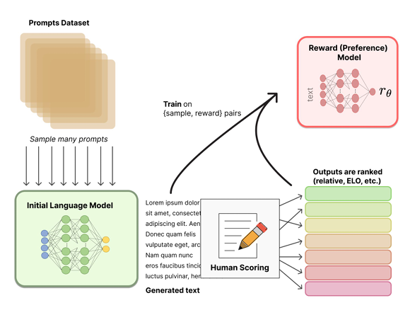
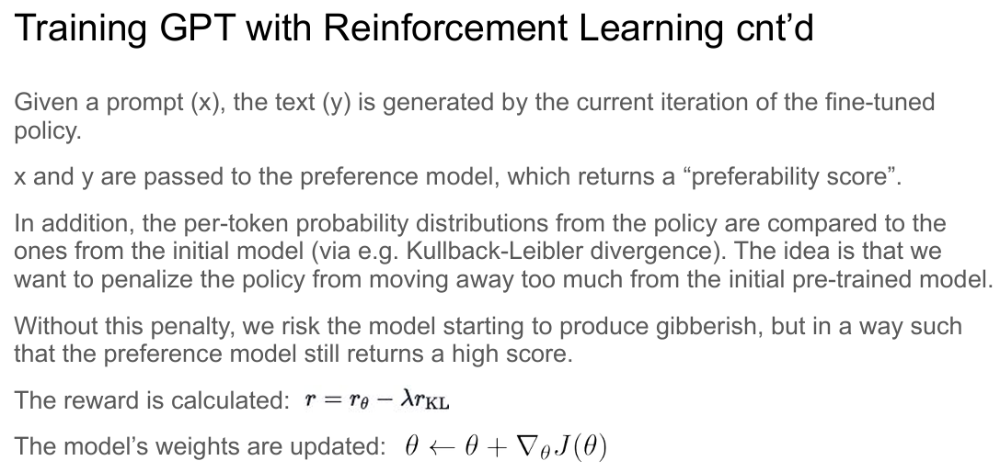
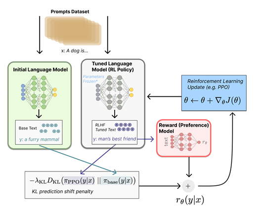
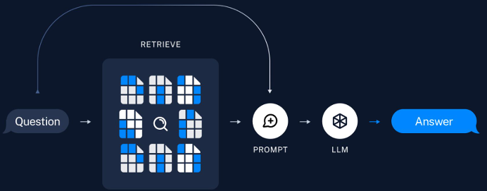
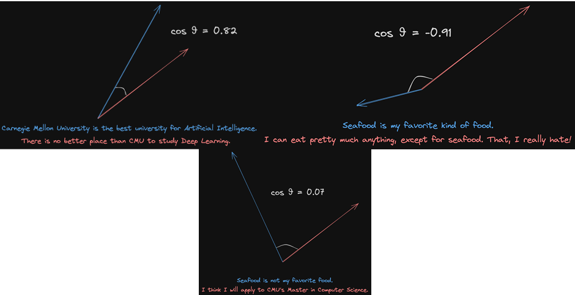

# Lec of prof. mattia

## 1 Transformers

简单的介绍from chatGPT:

1. **自注意力机制（Self-Attention）**：
   - Transformer模型的核心是自注意力机制，它允许模型在处理输入的序列时，对序列中不同位置的数据进行权衡和关联。这种机制帮助模型捕捉到序列内的长距离依赖关系。
   - 在一个典型的注意力机制实现中，有三个主要的组成部分：Queries（查询）、Keys（键）和Values（值）。例如，在编码器-解码器架构中：
     - **编码器**会生成一系列输出（键和值）。
     - **解码器**在每一步生成查询。
     - 查询和键之间的相似性（通常使用点积或其他相似性度量）来决定每一个值的权重（即关注的程度）。
2. **多头注意力（Multi-Head Attention）**：
   - 在传统的自注意力机制上，Transformer使用了所谓的多头注意力机制。这种机制实质上是并行运行多个自注意力层，每个层关注输入数据的不同部分，然后将这些信息综合在一起。这样可以让模型从多个角度理解数据。
   - 每个层关注的不同的部分可以是不同range的序列内容。
3. **位置编码（Positional Encoding）**：
   - 由于Transformer不使用任何递归或卷积层，模型本身并不具备处理序列顺序的能力。为了解决这个问题，Transformer引入了位置编码，通过添加一些与位置相关的信息到输入序列中，使模型能够利用序列中元素的顺序信息。
4. **层次结构**：
   - Transformer模型通常由多个相同的层堆叠而成，每一层都包含多头注意力子层和前馈神经网络子层。每个子层的输出都会进行一次规范化（Layer Normalization），并通过残差连接传递给下一个子层。
5. **编码器-解码器架构**：
   - 在许多应用中，Transformer模型被构造为编码器-解码器的形式。编码器负责处理输入数据，解码器则负责生成输出。解码器在生成每个输出时也会利用自注意力机制关注到编码器生成的所有输出。

### Attention

[attention详解](https://blog.csdn.net/Tink1995/article/details/105012972)

### Transformer architecture

[transformer architecture详解](https://blog.csdn.net/Tink1995/article/details/105080033)

### Training BERT

pre-training: masked language modelling

### Training GPT

pre-training: next token prediction

RLHF - reinforcement learning with human feedback: rank the output by human preference, the training the language model on [sample, reward] pairs

这个减代表的是如果reward在一次训练中变化过大，则不太值得信任这个结果。

概括来说，我们会根据reward和两个模型之间的变化程度综合进行梯度下降的优化。

## 2 Retrieval augmented generation

### Shortcomings of Large Language Models

1. hallucinate: 比如会对语法正确但是实际不正确、有问题的prompt作出回应
2. train system not cover everything - 涉及到个人私人信息的问题LLM并不会知道
3. 可能不会使用最新的信息训练

RAG试图解决上述问题。

### Process of RAG

Given

- an LLM
- a prompt

RAG is

1. **Retrieving** information related to the prompt from one or multiple data sources.
2. **Augmenting** the prompt with the retrieved information.
3. Allowing the LLM to **generate** a response.

### Preparation

load $\to$ split $\to$ embed $\to$ store

### Query

query related information in the prepared data

### Techniques

- embeddings: encoder, e.g. sentence transformers (frequently used default)

- cosine similarity:

  

  语义相同`cos`值会趋近于1，语义相反会趋近于-1。毫不相干会趋近于0。

- database: vector database

- framework to code system up

## 3 Vector databases

why we need?

- Recall in RAG - provide store and a faster query

## 4 API - Application Programming Interface

