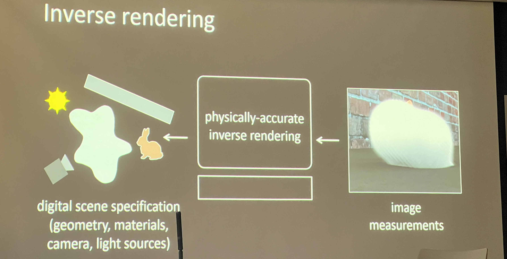

# Introductions to graphics and rendering
## Forward rendering

下图从左到右就是forward rendering

## Inverse rendering

## Differentiable rendering

从渲染的最终输出（即生成的图像）可以计算得到关于其输入参数（如场景几何、材质属性、光照条件等）的梯度。有了这些梯度信息，就可以利用标准的机器学习优化技术，如梯度下降，来自动调整渲染参数，以达到某种特定的优化目标。

# Ray tracing and geometric representations

// to be continued
