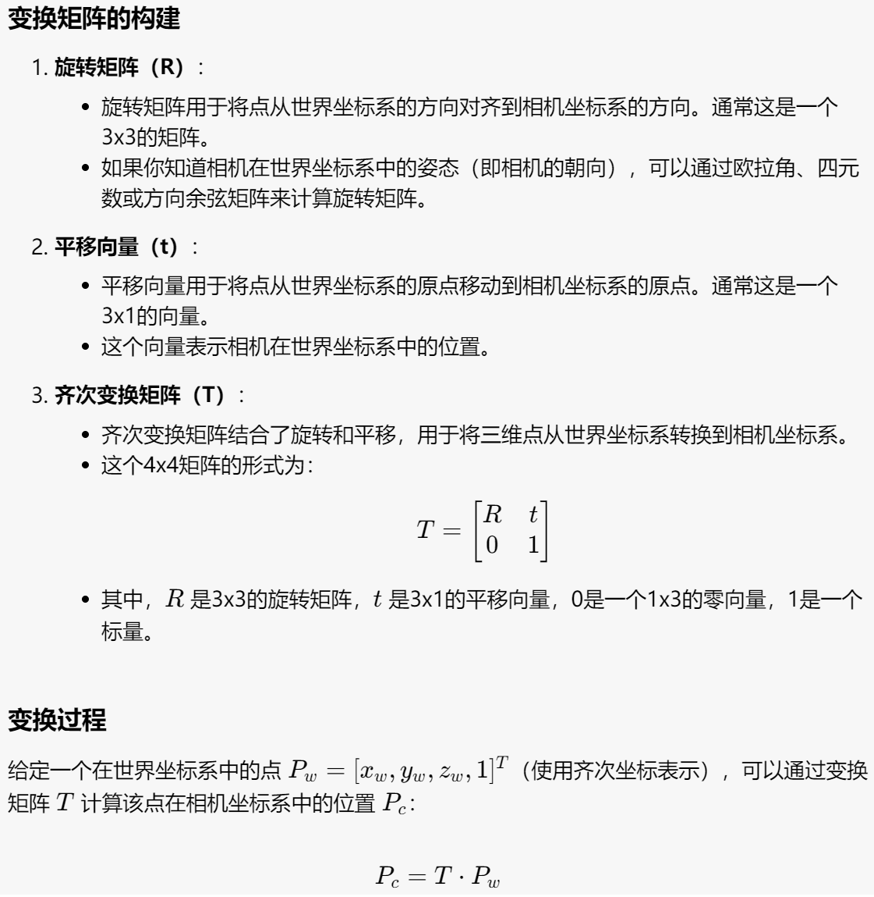
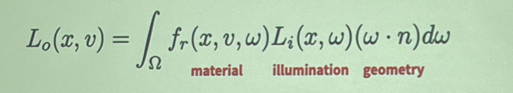
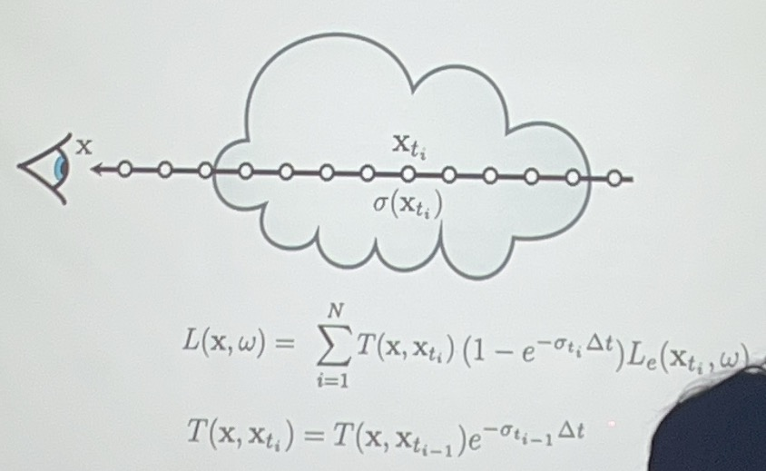

# 3D Vision

## 3D Representations

---

surface/boundary representations:

### Depth Maps

representing the visible without 3D structure - 2.5D

### Point Clouds

### Triangular Meshes

三个点组成的三角形叫face，表示了point cloud之间点的关系

可以计算ray-triangle intersections

可能有歧义（向内还是向外）

改变点的位置可以改变物品的shape，但是有些改变涉及到的数据会比较多，也比较复杂

### Parametric Surfaces

例如：

$$f((u,v)) = (u, v, u^2- v^2)$$

提供了二维平面坐标到三维坐标的映射

问题就是如何找到一个global structure去表示形状外的点

rendering也比较困难，因为对于$f$而言很难应用到ray-triangle intersections

---

volume representations:

### Voxelized 3D

将三维空间分割成小立方体（体素），每个体素代表三维空间中的一个固定体积，类似于二维图像中的像素。通过这种方式，可以用体素来描述和表示复杂的三维形状和结构。

相比mesh（只是表示表面），这种方式需要更多数量的体素去达到一个比较好的表示效果。

### Implicit Surfaces

一般的式子为$F(x,y,z) = 0$

物品外部为正，内部为负

对于这种表达方式，Boolean operations are easy。

1. **识别交点和交线**：
    - 计算两个几何体之间的交点和交线。这通常涉及几何体的边与面的相交检测。
    - 对于多边形网格，这可能需要遍历所有面和边，使用射线投射或其他几何算法来检测交点。
2. **分割几何体**：
    - 使用交点和交线将原始几何体分割成多个部分。每个部分代表几何体的一部分，这些部分可以是面片、体素或其他几何元素。
    - 确保分割后的几何体仍然保持正确的拓扑结构。
3. **选择保留部分**：
    - 根据所选的布尔操作类型（并集、交集或差集），确定哪些部分需要保留。
    - 并集：保留两个几何体的所有部分。
    - 交集：仅保留两个几何体的重叠部分。
    - 差集：保留一个几何体的部分，同时去除与另一个几何体重叠的部分。
4. **合并几何体**：
    - 将保留的部分合并成一个新的几何体。这可能需要重新生成网格或曲面。
    - 确保合并后的几何体是封闭的，并且没有自相交的部分。
5. **修复拓扑结构**：
    - 检查并修复任何拓扑错误，如重复顶点、边或面。
    - 确保所有的法线方向一致，并且几何体的表面是光滑的。
6. **优化和简化**：
    - 进行必要的优化步骤，如去除冗余的几何元素、简化网格和提高计算效率。
    - 可能需要使用网格简化算法来减少多边形数量，同时保持几何体的形状和细节。

能够自然地描述复杂的形状和拓扑结构。

#### Signed Distance Function

对于空间中的一个点，SDF返回该点到最近的表面的距离

---

这都是建立在solid shape的基础上的，不支持包含烟雾、液体的表达

对于烟雾来说，识别一个点在物体里面外面没有意义，可以使用一个点的密度去表达这个shape

## Image Formation

我们需要解决的问题是如何通过Surface-based 3D形成image

我们需要解决：

- Geometry - 一个3Dpoint在image的哪个点
- Physics - 这个点成像结果是什么样的

### Geometry

从世界坐标系（World Frame）到相机坐标系（Camera Frame）的变换：

相机坐标系映射到image：

在一般情况下一个点会接收来自四面八方的光，没有办法成像，所以我们引入了pinhole camera

从数学原理上讲，我们需要pinhole projection model完成3D形状到2D image位置的映射

在我们默认$f = 1$的情况下，映射关系为$(X,Y,Z)\to(\frac{X}{Z}, \frac{Y}{Z})$

但是我们没有办法直接通过上述式子写出矩阵形式，需要增加一个维度实现（具体公式见prelearning）

当pinhole位置不等于image原点的时候我们对变换矩阵要作一定的改变即可实现。

### Physics

radiance: energy along a ray, 可以通过公式计算出一条ray射到一个point上面的energy

根据当前点接收到的ray energy强度以及点上的material可以计算image pixel上面的appearance

$(\omega·n)$是直射和偏射的区别（同样一条射线直射能量高，偏射能量低）

## 3D from Multi-view

是通过不同视角的照片重建3D模型的过程。

理论上两个视角就可以重建，但是这非常困难，增加相机数量会重建得更加准确。

我们要关注的不仅仅是重建出的3D信息，更要关注如何渲染这个3d representation进而如何很好地传递信息。

### (Neural/Grid-based) Density Fields

密度场：3D点到该点密度的映射

关键问题就是如何渲染密度场，在渲染后的图像中每一个像素表示什么、如何来的？

但是这个方法不适用于流动的物品，例如雾、云、液体等

我们需要知道光线（的能量等）在这个介质中发生了什么变化

- absorption，光线的部分能量丢失

  

  左边是absorption系数（和介质有关），中间是原始的光线能量（原本光线能量越强，吸收越多），对介质厚度积分

- emission - 部分介质自己会发射光线，例如火焰

  

  会增加光线的能量

- scattering - 一部分是折射出去的，一部分是折射进来的

  - out-scattering
  - in-scattering

注意上面公式的$L_e$和$L_s$，不等同于$L$，所以不完全和入射光是线性关系。

*但是这个计算成本很高。*

考虑只有吸收的情况：

左边的系数被称为透光率$T$

加上emission之后：

对于均匀质地介质的特殊情况：

问题之一就是计算机不会算积分，我们可以取很多个离散点然后用点的能量近似点周围一段的能量。

有了渲染算法后我们如何进行3D representation？

1. 可以考虑grid representation，并且为了更好地表示，我们可以定义一个非二进制的密度。

2. 机器学习模型

一般情况下渲染出来会比较模糊，使用position encoding可以更好地表示high frequency encoding

NeRF:

- **输入**：三维空间中的一个点的坐标和视角方向。
- **输出**：该点的颜色（RGB）和密度。
- **训练**：通过大量的视角图像对神经网络进行训练，使其能够准确地预测场景的辐射场。

### Rendering Primitives(e.g. Gaussians)- 基于图元的渲染

1. draw samples along the way - wasteful - we know where the samples are

   改进：find primitives that affect the ray

2. aggregate their contributions to render

#### Mesh Rendering

我们可以通过一些方式使得渲染出来的可微：

但是这个计算方式会造成冗余，我们对一个三角形会产生多次计算。优化如下：（先对每个三角形做迭代再对每个像素做迭代）

1. **光栅化器（Rasterizer）**：

    - **Affine & Projection Transform**：将三维模型通过相机进行仿射和投影变换，转换为二维视图。

    - Rasterize (return Fragments)：将三维模型分解成多个片段（fragments），包括：

        - **Z buffer**：用于深度测试，确定像素的可见性。
        - **2D Euclidean distance**：计算每个片段到相机的二维欧几里得距离。
        - **Barycentric coordinates**：计算每个片段在三角形内的重心坐标。
        - **Pix to face**：将像素映射到对应的面。

2. **着色器（Shader）**：

    - Texturing & Lighting：对每个片段应用纹理和光照计算，包括：
        - **Ambient & Diffuse**：环境光和漫反射光照。
        - **Specular**：镜面反射光照。

    - Blending (aggregate across K)：将多个片段进行混合，生成最终的图像：
        - **Sigmoid Silhouette**：使用 Sigmoid 函数处理轮廓。
        - **Softmax RGB**：对 RGB 颜色进行 Softmax 处理，得到最终的颜色输出。

#### Gaussian Rendering

//todo 这块没懂

## 3D Prediction

### Predict Volumetric 3D

我们的目标是通过单张2D的图片去建立3D representation of the underlying world

最简单的想法就是找到一个满足这个视角的图片的3D representation，但是这会导致其他视角or实际的3D representation不合理，因为一个2D的视角会带来很多解

我们需要通过[image, 3D]的数据集去训练，训练获取一个比较好的预测结果

我理解的过程是：

1. 2D decoder
2. 3D encoder
3. 把encode出来的每个体素的probability变成binary

隐式解码器会带来更好的预测效果

### Predict Point Clouds

在这里loss的定义为predicted point距离最近的参考点之间的距离，比单纯的p和参考binary的{0,1}方差更好（我猜是和point cloud的性质有关，不太好作单个单位的分割）

parametrically point clouds - 预测的点数量是固定的，一个2D图片的点的特征对应了一组固定的3D点

### Predict Mesh

一般是从一个固定的mesh开始通过改变点的位置去deform实现prediction的。

### Modelling Uncertainty

上面的预测我们都是给出了一个固定的预测，但是我们一张图片不可能包含所有的信息，需要对某些不确定的地方作处理。

### Modelling Distributions over 3D

//todo

