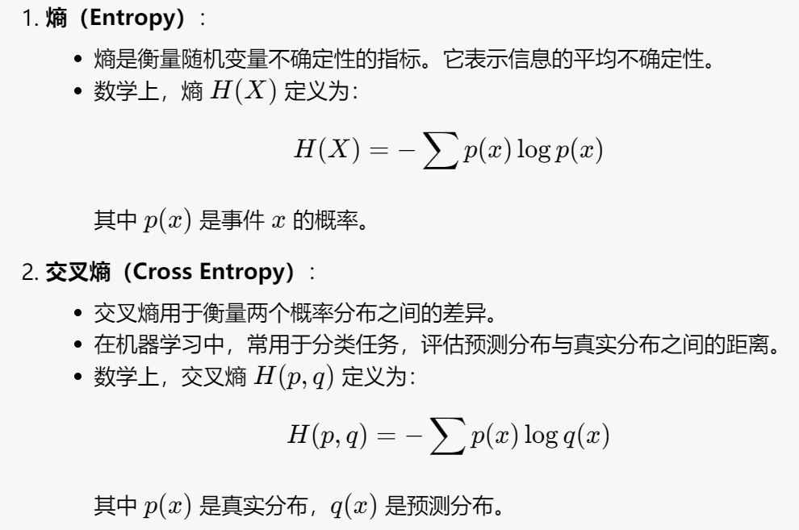
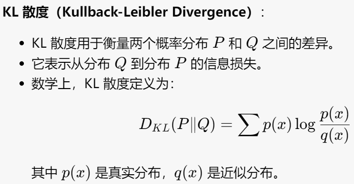
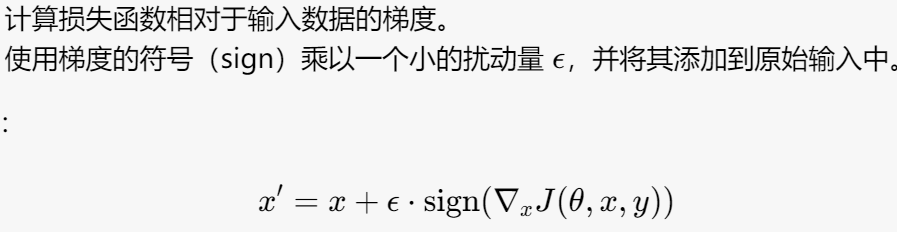
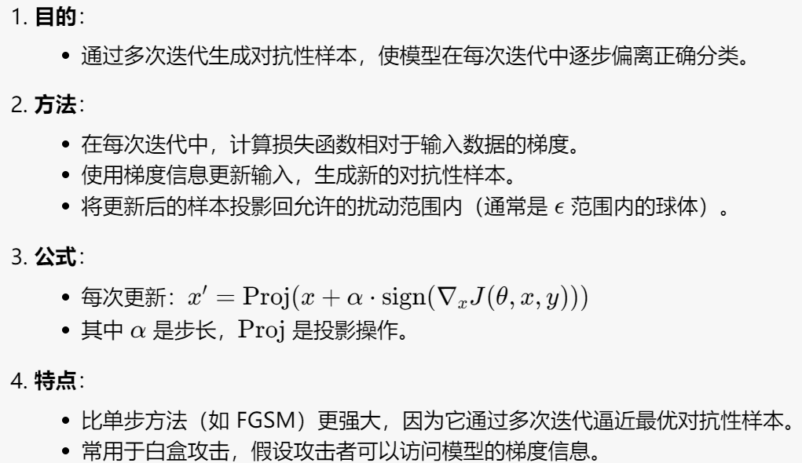

# Lecture by prof. Ding Zhao

## fundamentals about CV

### 关键概念

通常情况下，交叉熵在训练分类模型时常用作损失函数，因为它能有效地衡量模型预测的准确性。KL 散度在机器学习中常用于优化模型，使得预测分布尽可能接近真实分布。

### CNN

- 卷积操作及对应的output大小计算 - reduce size
- Pooling操作 - reduce size and select the most important feature (filter the noise)
- dropout - 随机舍弃部分神经元，提高稳定性

以上具体内容见dip笔记和prelearning

### Deep Learning Structure

一些基本的结构见之前线上课程的笔记。

- Point net (3D point cloud) - 用于处理 3D 点云数据的深度学习架构。它能够直接对点云进行分类和分割，而不需要将其转换为其他形式（如体素或网格）。

## Feature Visualization

通过可视化网络中的特征，可以揭示模型在不同层次上学习到的模式和特征。

### Deconvnet

通过逆转卷积过程来理解和解释模型的行为，可以揭示哪些输入特征对特定神经元的激活有贡献。

### "Deep Dream"

"Whatever you see there, I want more of it!"

- enhance deeper layers

- add multiple channels

## Adversarial attacks

- 通过对原始输入施加微小且有意的扰动生成。
- 这些扰动通常对人类不可察觉，但会导致模型错误分类。

### poisoning-type adversarial attacks

通过污染训练数据来影响机器学习模型的性能，在训练阶段引入恶意数据，使模型在测试阶段表现不佳。

### Evasion-type adversarial attacks

攻击者通过对输入数据进行微小的扰动，使模型在测试或使用时产生错误输出。

- noise attack - 给输入数据增加少量noise

- boundary attack

  - 从一个已被错误分类的样本开始，逐步向目标样本逼近。
  - 在每一步中，调整样本以保持在决策边界之外，同时尽量接近原始输入。
  - 通过迭代优化，逐步减少对抗性样本与原始样本之间的差异。

- FGSM (Fast Gradient Sign Method)

  

- projected gradient descent

  

### Physical-type adversarial attacks

[参考链接](https://blog.csdn.net/weixin_51176105/article/details/134189851)

### Defending against adversaries

- min-max loss
- //todo
- randomized smoothing - make model more robust, push the decision boundary of $f$ further away from the training data points.

