学习路径：项目线上课程结合gpt、b站大学以及其他开源资源自学，如有侵权请联系删除🙏


## Lec0

### 基本技术

- python
- pytorch<br>
    - 一点零碎的基础学习笔记：[pytorch](pytorch.md)
- GitHub
- LLM (ChatGPT等)

可以使用GPT自学

### 简要介绍

计算机视觉应用？ - 自动驾驶、核磁共振（疾病检测）、修图软件（更好地符合人类对美学的理解）、scan一个物品变成3D模型

基本任务：

1. **图像分类（Image Classification）**：
   图像分类的任务是将一张图像分配到一个或多个类别标签中。例如，系统可能需要判断一张图片是显示猫、狗还是汽车。这是计算机视觉中最基础也是最广泛应用的一种形式。<br>
   把每个像素分类 - 识别物品
2. **目标检测（Object Detection）**：
   目标检测不仅涉及识别图像中的物体类别，还需要定位这些物体的具体位置。这通常通过在图像中为每个检测到的对象绘制边界框（bounding boxes）来实现。
3. **图像分割（Image Segmentation）**：
   图像分割任务旨在将图像中的每个像素分类到特定的类别。这包括语义分割，将图像中所有像素分类到多个类别，以及实例分割，不仅区分类别，同时区分同一类别中的不同个体。

### 在线资源

1. **CS231n** & **EECS 498.008**
2. inverse problem of computer vision - computer graphics **CMU 15-462**
3. 数学基础 

## Lec1

### 1 - 数学基础

#### Algebraic structures

定义一个algebraic structure需要定义一个集合的元素和这个集合上面的运算，以及运算和元素的性质（结合律、自反律、交换律等）

闭包（封闭性） - 对集合内两个元素做运算，得到的元素依然属于这个集合

一种algebraic structure是向量空间/线性空间

 

应用：

IMU（Inertial Measurement Unit，惯性测量单元）是一种测量和报告物体的特定物理量的设备，主要用于测量角速度和线性加速度。IMU通常包含三个正交的加速度计和三个正交的陀螺仪，用来感知在三维空间中的加速度和旋转。

主要组件：

- 加速度计（Accelerometers）：用于测量物体在各个方向上的加速度，可用于感知重力导向和运动加速度。
- 陀螺仪（Gyroscopes）：用于测量物体围绕其三个轴的旋转速度。

#### Group - 群

 

### 2 - 优化问题 - 寻找最小值

损失函数衡量的是模型预测错误的程度，优化的目标就是最小化这个损失函数。在机器学习中，模型训练的过程实质上是通过优化算法（如梯度下降）最小化损失函数，从而找到最佳模型参数的过程。

有些问题我们需要使用循环、迭代的方式找到近似的最优解

感觉很像数值分析学的东西，我们需要评价特定方法（在不同参数下）的误差、cost（迭代次数）

例如梯度下降法，我们需要采取合适的步长（learning rate）

不同learning rate的效果 

基于二阶导的梯度下降法计算量过大，通常并不会表现出很好的性能

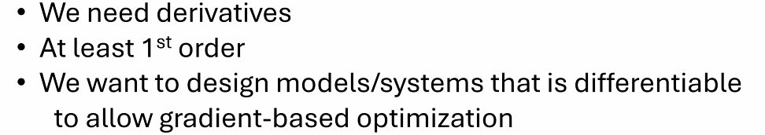 

可微性是指函数在定义域内各点处均具有导数，这是执行梯度下降等基于梯度的优化算法的先决条件。梯度下降算法通过迭代过程寻找损失函数的最小值，逐步调整模型参数以最小化误差。

---

#### 补充：梯度下降法原理与细节
线性回归模型的损失函数是每一个点误差平方的平均数：

由此我们可以给出一个保证梯度下降（损失函数递减）的算法：


而根据上述线性的例子，我们也可以给出梯度下降法的范式：


这个不断沿着梯度下降的方向更新参数使得损失递减的过程也叫做**向前传递**。

---

代码实现：

##### 1.定义模型


一般情况下初始化不会这么简单，在这里为了方便把初始参数都赋值为0。

##### 2.梯度下降法

`optimizer = torch.optim.SGD(model.parameters(), lr = learning_rate)` - 定义使用梯度下降法学习，把`.SGD`改成`.Adam`就是使用Adam法学习

在计算梯度这一步使用反向传播法`loss.backward()`计算，在每一次计算之前记得清空上次的计算`optimizer.zero_gard()`


其中，我们可以手动实现（不调用第三方库）模型参数的更新：


---

反向传播

在我们讨论反向传播算法之前，需要先分清楚几个概念：


通俗来讲，反向传播就是根据损失函数计算梯度，而向后传播则包括：

1. 调用反向传播计算梯度
2. 根据梯度的值更新模型参数

//todo

---

局限：


*上图左边4这个点梯度为0，但并不是我们想要的点*

优化：随机梯度下降法


其他优化：

归一化：通过调整learning rate去消除梯度绝对值差距过大的影响。

### 3 - Rigid Body Transformations

刚体变换主要由以下两个组成部分：

1. **旋转（Rotation）**：
   表示物体绕一个固定点（通常是中心点）的旋转。在三维空间中，旋转可以通过旋转矩阵或四元数来表达。旋转矩阵是一个3x3的正交矩阵且行列式为1，而四元数是提供了一种更为紧凑和鲁棒的方式来表示旋转。

2. **平移（Translation）**：
   描述物体沿直线从一个位置移动到另一个位置的过程。在数学表达上，平移可以通过向量来描述，这个向量指明了移动的方向和距离。

   使用矩阵实现无旋转的平移

比较难的就是旋转操作：

在二维平面上我们使用乘一个旋转矩阵的方式

三维平面我们根据不同的旋转轴有三个不同的旋转矩阵

而我们结合这三个方向的旋转（我的理解是把一个旋转正交分解）可以得到一个一般的旋转矩阵：

 

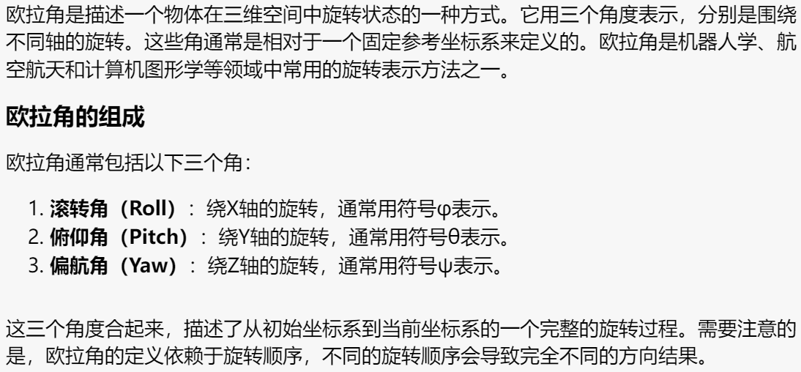 

这个方法的局限性也就在于我们不同的旋转顺序会导致不一样的结果，单方向的旋转会影响其他方向

还会有“万向锁”问题。当俯仰角接近±90度时，偏航角和滚转角会合并在一起，造成自由度的丧失，这可以通过四元数或其他旋转表示方法来避免。

因此我们一般也不用欧拉角实现旋转相关代码。

所以我们考虑别的表达方式：

还有一种几乎相同的表达方式：

这就不会有万向锁的问题

如何通过这个表示方法计算？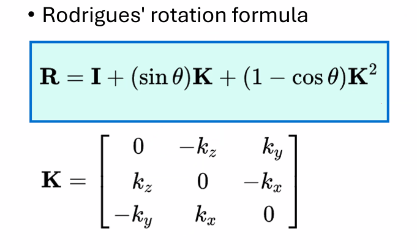

$\theta$是旋转角，$K$是旋转轴

另外一种方式 - Quaternion 

为什么使用矩阵？现在的GPU基本被设计成适用于解决矩阵问题模式

二维平面结合旋转和平移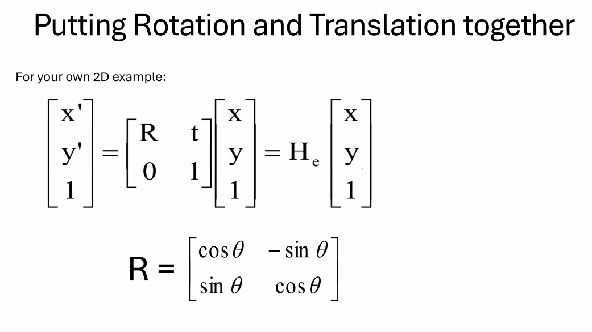

三维情况下我们拓展变换矩阵维度即可

可以来描述all kinds of motions

### 4 - Camera Model

what is a camera? - a projection from 3D to 2D

基本成像模型：Pinhole Camera

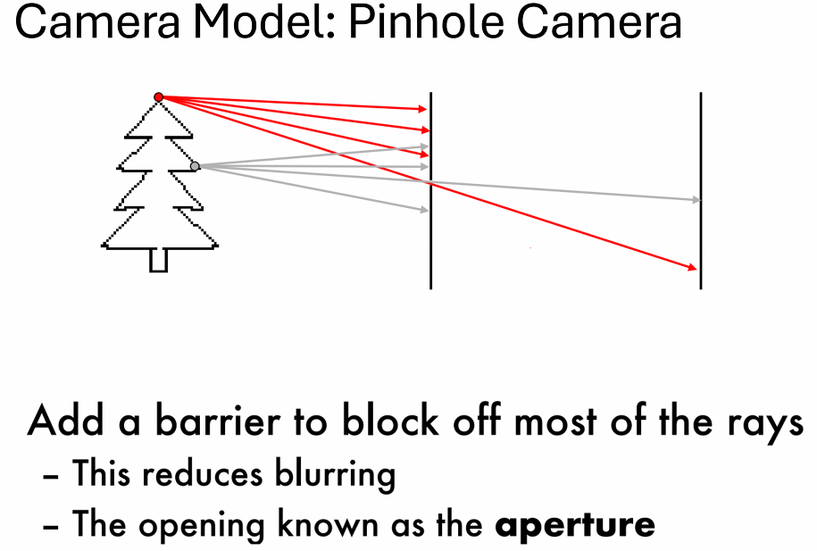 

那么怎么找相机的pinhole就成为了一个问题

本质还是一个三维到二维的映射问题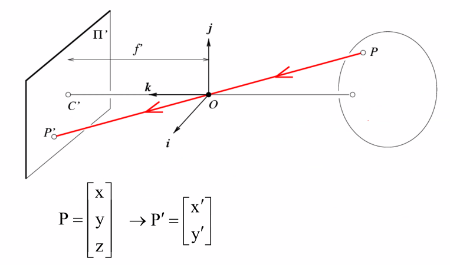

使用相似三角形可以推

对于这个变换我们也可以写成**矩阵形式**：

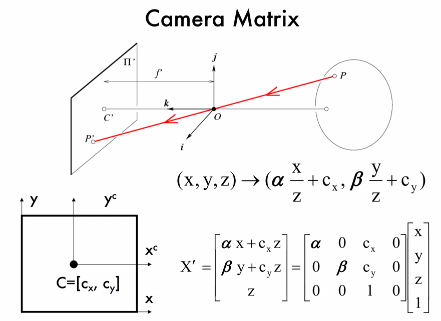 

*问题：不可逆，没有办法从2D照片推出具体距离（一般使用雷达解决）*

对于成像是倒着的问题，我们只需要把$x'$轴和$y'$轴翻转即可

光圈大小的影响？

大光圈 - 更模糊

但是光圈太小，进入的光线会太少；所以我们需要lens（凸透镜）汇聚光线，但是也就带来了变形问题：

 

解决方法：多个镜头（？，camera matrix好像也可以解决（这块我没有特别理解

3D to 2D 映射的特点：

## Lec2: Deep Learning Basics

### 0 - 补充：CNN基础

#### 1 图像识别

##### 1.1 图片的数字化

图像识别的第一步就是将图片数字化，表示为张量。


*像素点的值表示该像素点的黑白程度*

对于彩色图片，采用三原色分解，使用三位张量表示。

##### 1.2 模型结构

首先把数字化之后的图片数据铺平（有数据损失，但是依然可以得到比较好的训练结果）变成一维，即可输入到模型结构：


##### 1.3 代码实现（机器学习范式）

1. 数据准备<br>


2. 生成模型<br>
一般情况下需要定义模型这个类，但多层感知器可以直接使用pytorch提供的线性模型（在使用pytorch的封装库的时候尽可能多去看官方文档）


3. 评估模型 - 在训练模型之前，可以直接测试我们生成的模型是否可以正常运行


4. 训练模型<br>
遍历训练数据 - 取出张量形状 - 计算`logits` - 计算损失 - 清空梯度（图片中应该是`zero_grad`） - 触发反向传播算法 - 更新参数


5. 生成并训练模型<br>
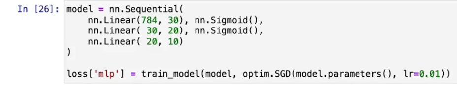
优化：使用更优的激活函数、加入归一化层

6. 处理过拟合问题<br>
    - 随机失活<br>使用pytorch提供的`Dropout`即可实现
     
    - 添加惩罚项<br>
     

附：<br>
关于模型、组件的模式问题：在评估模式和训练模式下不同模型和组件的表现不同，因此需要手动通过代码切换以达到最佳的训练效果
例如评估模型的代码：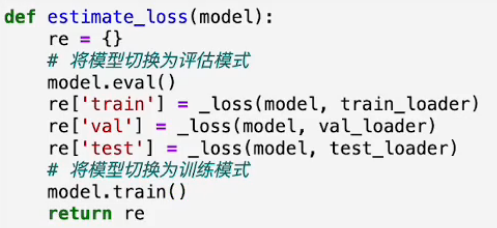
随机失活组件：


//TODO

---

```
Lecture Topic 1: From Neural Nets to CNN
Lecture Topic 2: Legendary Alexnet and ResNet
Lecture Topic 3: More Architectures: Unet, YOLO and more
```

首先，我们要理解一个神经单元的定义：

 

接收 - 加总 - 转换（激活函数） - 发出

激活函数例子


但是二维空间的分类可能是非线性的，也就有了不同的激活函数


现在我们需要把这些东西写成矩阵形式而不是求和 - 更快的计算速度

这个模型的参数由上面提到的梯度下降法训练确定

### 1 - Image formation model

一张好的图片要让the color blind也可以轻松辨别，也就是每个颜色维度都需要有辨识度

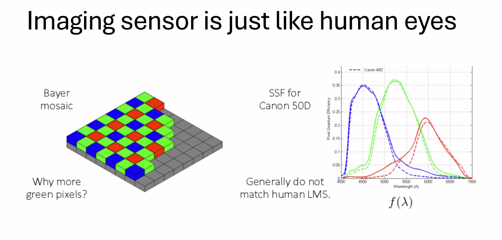 

#### 拜耳滤镜阵列（Bayer mosaic）

拜耳滤镜是一种广泛用于数码摄像机和其他成像设备中的彩色滤镜阵列。这种排列模式包含红色、绿色和蓝色滤镜，分布在图像传感器的像素上。该图解显示了每四个像素中，通常有两个绿色像素，一个红色和一个蓝色像素。这种设计模仿了人类眼睛中视网膜的锥细胞，人眼对绿色的灵敏度比红色或蓝色更高，因此增加绿色像素有助于提高图像的亮度感知和细节分辨率。

#### 2 - 卷积层

去噪 - 平均/中位去噪法（左右两边的点一起）

滤波（内积） - 见dip笔记

举个例子：


效果：

- Horizonal Sober filter - 第二张
- Vertical Sobel filter - 第三张


在pytorch内有现成的可以调用的函数

加速：running your image over your filter (convolution的交换律成立)

使用不同的kernel，我们可以得到不同层级的特征图，包含不同级别的特征

 

#### 3 - 卷积神经网络
##### 3.1 梯度消失的解决
避免gradient vanishing: 

（在underflow的时候误以为取到了opt）

##### 3.2 ResNet
 

通过这个方式解决了gradient vanishing，也就增加了支持的学习layer的个数

在传统的神经网络中，随着网络深度的增加，信息在通过网络的每一层时都会逐渐丧失，导致梯度消失，使得深层网络难以训练。ResNet 通过引入“残差学习”的概念来解决这个问题。如果我们将网络层设计为学习输入和输出的残差（即差异）而不是直接学习输出，网络可以更容易地优化，因为在理想情况下残差应是零，网络可以更容易地推动其输出接近输入。

#### 残差块（Residual Blocks）

ResNet 的基础构件是残差块，每个残差块包括两条路径：

1. **主路径**：主路径包括权重层（通常是卷积层），包括激活函数和批归一化等。
2. **快捷连接（Shortcut Connection）**：快捷连接允许输入直接“跳过”一些层，通过添加输入和主路径的输出来形成块的最终输出。

这种结构允许梯度直接通过快捷连接反向传播，避免了在深层网络中常见的梯度消失问题。

## Lec3

### Deep Learning Foundations

1. LeNet<br>
早期卷积神经网络，应用：数字识别<br>
主要包括：输入层、几个卷积层（使用卷积核提取图像特征）、池化层（下采样层，减少参数数量和计算复杂度），全连接层和输出层

2. AlexNet<br>
在CPU上计算CNN，支持更大更深层次的网络

3. VGG<br>
使用了非常均一的架构，只使用了3x3的小卷积核和2x2的最大池化层，层次结构非常简单但效果显著

4. ResNet<br>
解决梯度消失问题，网络可以承载更多的层次而不会丢失梯度信息，大幅度提升网络深度

### ResNet补充
参考视频：[ResNet](https://www.bilibili.com/video/BV1D1421r7sj?vd_source=6f82f093f306817f2a6bd3375dacfd43)<br>
注：这整个系列都讲得特别好且适合入门

### Start your first deep learning project

学习pytorch的最好资料就是[官网](https://pytorch.org/tutorials/beginner/basics/intro.html)


阅读代码的时候关注上述三个过程是如何实现的，以及如何定义自己的数据集结构；训练集、验证集（训练的时候可以不断切换、调整）和测试集（在最开始就分离出来，不参与训练，不获得feedback；用于展示模型的能力）的定义。


不同的模式下需求不一样，对应算法处理也有不一样，例如`train()`过程中会有`Dropout`来提升鲁棒性，而`Eval()`中不会有（以节省算力）；`no_gard()`会把grad flow disable掉，节省算力，支持在短时间内跑大量的验证集。


OOM - cuda内存不够，可以调整`batch_size`

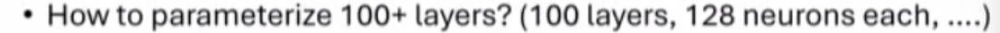

合理使用循环


*differentiable - 可微的*<br>
- histogram function - 直方图函数
- `argmax`&`argmin` - 返回最大最小值的下标<br>
如果我们的final result是建立在不可微的函数的基础上，我们可能需要做出一些调整

### More Advanced Architectures in CNN

#### 1.FCNN

FCNN: 对每一个图片的像素作分类 - 图片划分(segmentation)


输出：假设有21个类，每个像素点对应了一个21维度的向量，包含了每个类的可能性信息。

#### 2.Unet


也是一个广泛用于segmentation的方法，主要用于医学图像的分割，分割处理效果很好

#### 3.YOLO - you look only once

用于detection - 检测到物体的位置+识别物体类别

主要框架（下图左边，已经是一个比较通用的范式）不变，右边根据不同功能和算法有调整

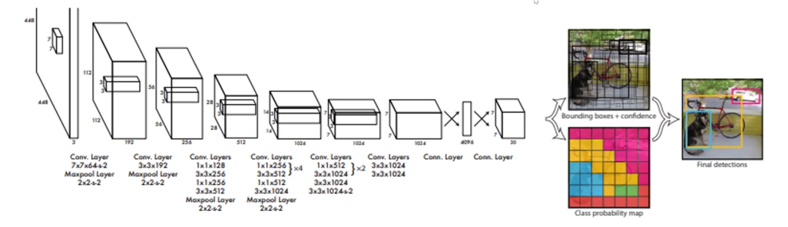

画一个框需要几个参数？- 4个（2个角），也就是这个算法的输出

### Summary in CNN

对神经网络我们更应该关注为什么这样设计、原理是什么，而不是每层的参数，这些通常都是很经验主义的。

### 3D Vision: Triangulation and Bundle Adjustment

#### 1.Triangulation - 三角化

#### 2.Epipolar Geometry - 对极线几何

#### 3.Essential/Fundamental Matrix - 本质矩阵&基础矩阵

#### 4.Bundle Adjustment - 光束平差

### Know About Your Sensors

### SfM and SLAM

## Lec4

### Transformers: Backbone of Modern AI

### Generative Models: from VAE to Diffusion

### Physics Based Machine Vision

<script>
MathJax = {
  tex: {
    inlineMath: [['$', '$'], ['\\(', '\\)']]
  }
};
</script>
<script id="MathJax-script" async
  src="https://cdn.jsdelivr.net/npm/mathjax@3/es5/tex-chtml.js">
</script>
