## 1 Algorithm analysis

Algorithm is a finite set of instructions to accomplish a particular task.

- Input 可以是0个，例如圆周率计算
- Output
- Definiteness 每个指令都是清晰的
- Finiteness （是一个相对概念）
- Effectiveness 正确性

-----------

program VS algorithm

program 不需要有限且不需要一个特定目标，是算法的具体实现

algorithm 是有一个特定目标的

---------------

### What to Analyse

- 硬件和编译器的run times
- 时间复杂度、需要内存
    - 一般分析平均复杂度和最坏复杂度

### Asymptotic Notation

point: predict the growth 重点是趋势

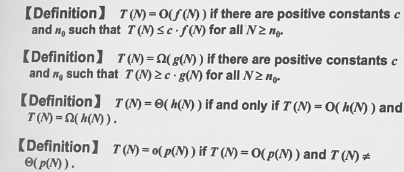

$O(N)$限定了上限，$\Omega(N)$限定了下限，而$\Theta(N)$限制住了数量级

$$T_1(N) + T_2(N) = max(O(f(N)), O(g(N)))$$

$$T_1(N) * T_2(N) = O(f(N))* O(g(N))$$

结论性：${(logN)}^k$是接近线性的

一般有效的算法时间复杂度都在O(NlogN)

一般规则：

- for循环：迭代次数*循环内运行时间
- 嵌套for循环：所有for循环大小的乘积*循环语句运行时间
- 连续语句：相加
- if/else：取max
- 注意判断题目中是否有不执行的语句

 recursion：斐波那契数列例子 T(N) = T(N - 1) + T(N - 2) + 2，根据数学归纳法可证，$$(3/2)^N < T(N) <(5/3)^N$$，复杂度很高

方法：

1. $T(2N)/T(N)$代入
2. 求极限

### Compare the Algorithms

具体例子：

**子序列最大和问题：**

考虑for loop的时候应计算worst case；

优化1：ThisSum不置0；

优化2：**Divide and Conquer** 分治法

- 使用递归将数据不断二分
- 逐个计算、比较并合并，同时计算两个$N/2$中最优解的两端并比较
- 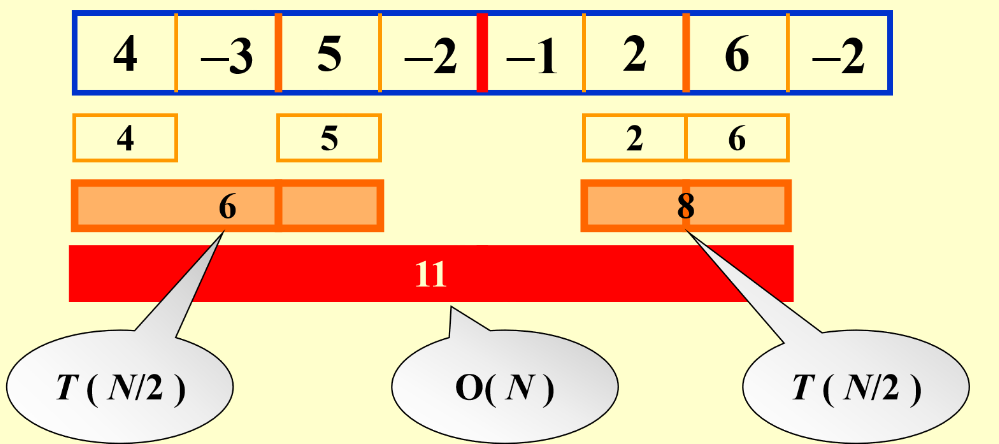

复杂度分析：$T(N) = 2T(N/2) + cN, T(1) = O(1)$

*//分成两半求解+整个序列遍历，遍历起点是左最大序列的左端，遍历终点是右最大序列的右端*

$T(N) = 2[2T(N/2^2)+cN/2]+cN = 2^kO(1) + ckN, where N/2^k = 1$

$\rightarrow T(N) = O(NlogN)$

 优化3：**On-line Algorithm**  $T(N) = O(N)$

只扫描一次，遇到小于0的ThisSum及时置0

在线算法核心：来一个处理一个数，不把所有数装入内存或者读取内存，memory是efficient的，任何时间都能得到一个目前的最佳结果

### Logarithms in the Running Time

递归算法：find_x[lb,ub]

$T(N) = T(N/2) + O(1) \rightarrow T(N) = O(logN)$

### Checking Your Analysis

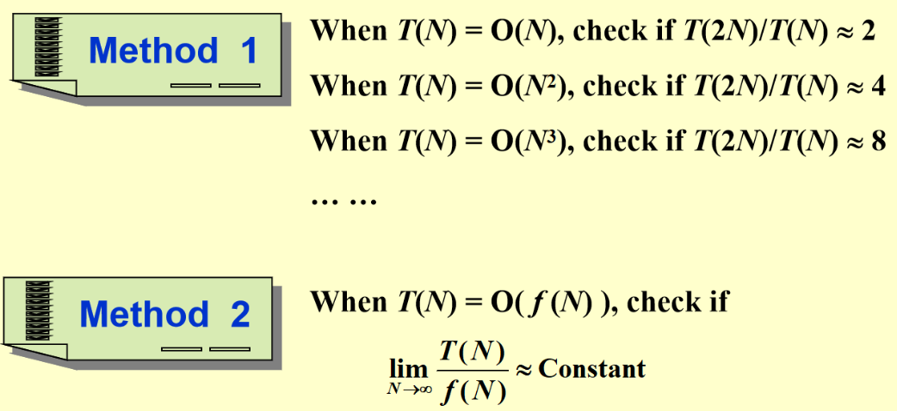

## 2 Lists

### Abstract Data Type (ADT)

抽象数据类型：将数据类型的定义和实际操作分离

Objects VS Operations

### 基本操作：

- 简单数组操作

    - 数组大小需要被评估，有顺序、查找比较快，但是插入和删除慢

- 简单链表操作

    - 无顺序、申请内存（malloc系统级操作）和查找很慢，不过插入和删除快（但是寻找的过程还是O(N)）

    - 断链的内存找不回来且无法free
    - 双向链表：方便查找前一个，但是不从根本上解决查找线性复杂度问题

### 多项式的表示：

- 数组
- 链表

### Multilists:

eg.学生选课

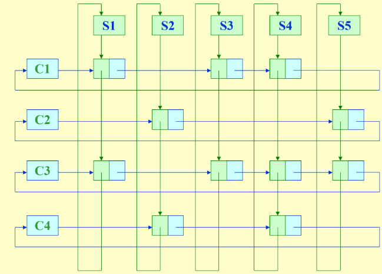

- 优势：节省内存，有多少个item就是选了多少节课

### 链表的游标实现

*Next pointer 存的是下一个数据的下标*

数组实现列表

```c
struct ListNode{
  int element;//该元素的数据
  int next;//下一个元素的索引值(数组下标)
};
```

如果在索引是k的结点后面插入一个结点，新结点的索引是n

```c
p = node[k].next//记录下该结点后面一个结点的索引
node[k].next = n//把k后面一个结点变为n
node[n].next = p //原来k的后面一个结点放在n后面
```

由于缺少内存管理，array很快就会满。

## 3 Stacks and Queues

### 3.1 The Stack ADT

**Stack:** a Last-In-First_Out

和链表区别：stack是指向前一个数据，最后有一个指针指向栈顶

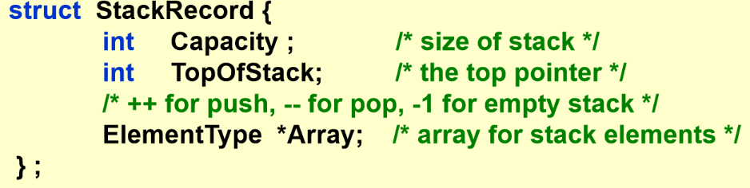

- operations: （Pop和Top操作在空栈情况下会报错，是逻辑错误；Push操作在满栈情况下会报错，是操作错误）
    - 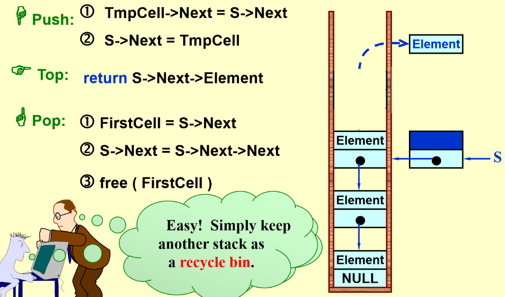
    - Push 插入
    - Top 置顶
    - Pop 删除
    - 避免malloc/free：不执行真正的deletion，把数据放到另外一个链表

- 应用：

    - 检查括号是否平衡
        - 思路：左括号Push，右括号（和top匹配）Pop
        - 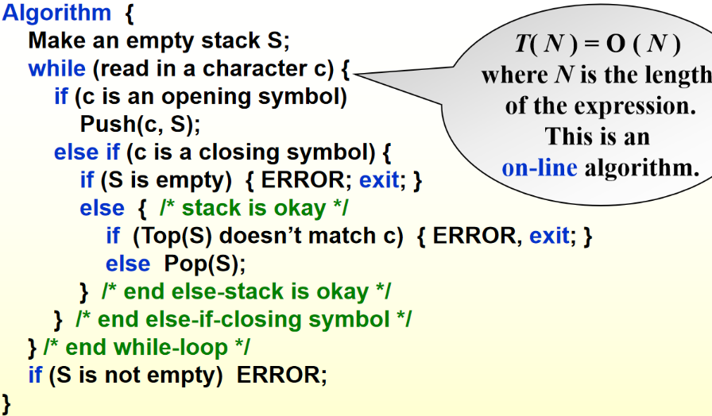

    - 计算器问题（postfix）
        - infix to postfix：把数字放在运算符前面，运算符按优先级排序
            - 遇到数字Output
            - 遇到运算符，空栈或者比top优先级高就push
            - 遇到运算符，比top优先级低或相等就pop**所有比它优先级高或相等**的运算符最后将此运算符push
            - 括号：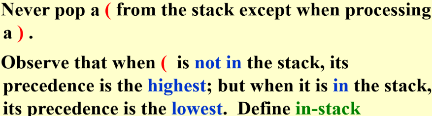
            - 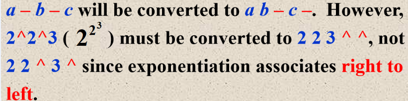
        - 遇到数字就push，遇到运算符就pop两个然后把运算结果push进去，最后pop最上面的结果
        - 时间复杂度O(N)
  
    - 系统栈问题：如果一直使用递归会占内存，时间复杂度也高

### 3.2 The Queue ADT

**Queue**: a First-In-First-Out list

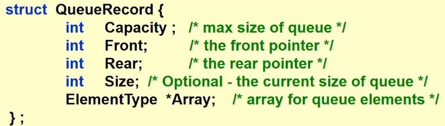

- operations：
    - Enqueue 队尾插入
    - Front
    - Dequeue 队头删除

- 解决线性queue内存浪费问题->circular queue
    - 在仅剩一个空item的时候如果再插入一个item，rear和front差1，和初始状态一样，无法区分满还是空状态
        - 解决方案：空着（浪费一个空间，但是时间开销小）/加一个size判断（时间开销大）
        - 陷阱：没有count操作的时候，必须空出一格

## 4 Trees

### Trees Preliminaries

- 从祖先开始：Lineal Tree
- 从儿子开始：Pedigree Tree (Binary Tree)

- 用法：组织结构、搜索、决策树

- 定义：树是节点的集合

    - 集合可以为空

    - 否则，一棵树由

        -  一个被称为根的区分节点r
        - 零个或多个非空(子)树T1, ... , Tk（一个节点除了根节点有且仅有一个父节点）<br>
组成，每个树的根都通过从r的有向边连接

- 注意：
    - 子树不能连接在一起（Tree是没有环路的），树中的每个节点都是某一个子树的根
    - **N个节点的树有N-1个edge**
    - 画图时通常将根节点画在最上面
    - 所有操作从根开始
    - 操作基本都是递归的

- 组成：
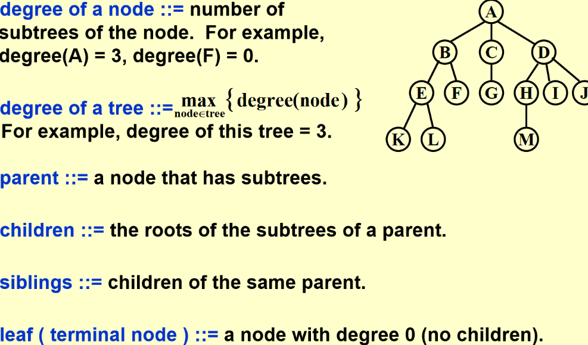
*parent 和 children 不是对称的，是有指向的*
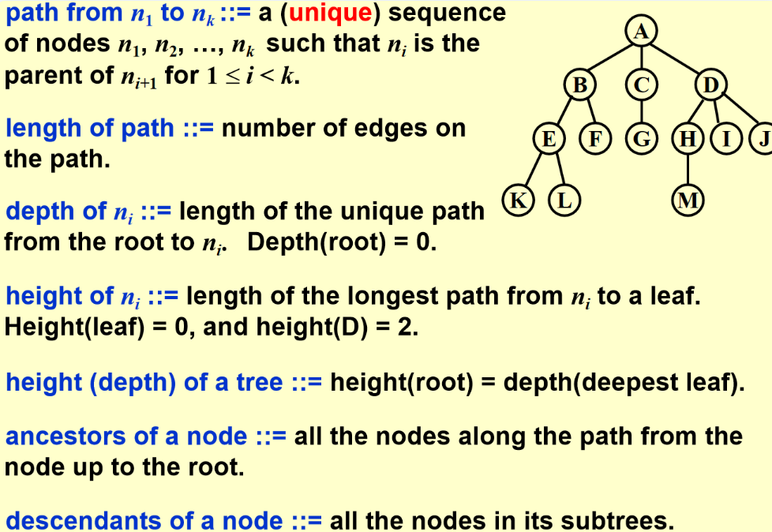

- 数据结构实现
    - 一维数组：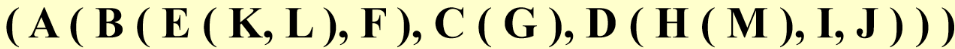
    - 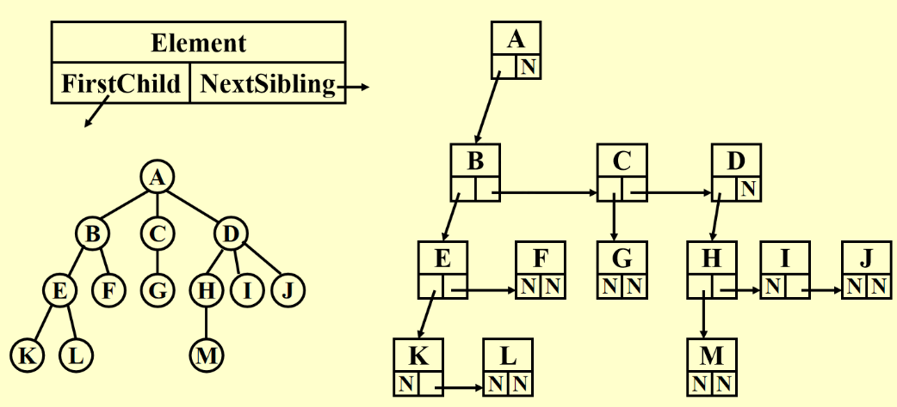
  
*not unique since the order of the child is not unique*

### Binary Trees

- no node can have more than two children
- Expression Trees
    - 遇到运算符，最后两个元素出栈，构成以运算符为r的一个元素，整体入栈
    - 特点：
        - 所有操作数顺序不变且都是叶节点
        - 根节点是运算的最后一步

- 树的遍历
    - 先序遍历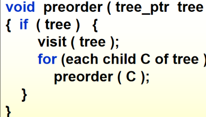
    - 后序遍历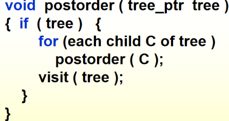
    - 层次遍历 - **queue**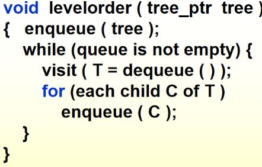
    - 中序遍历（递归法：）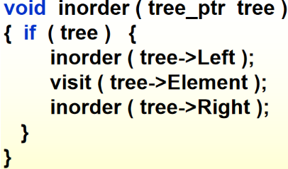
    - 中序遍历的非递归形式： - **stack**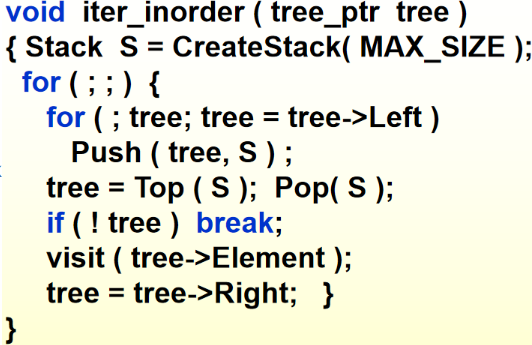*使用自己的栈代替系统规定的栈*

- 例子
    - 分级文件系统中的目录列表

### Threaded Binary Trees

- 利用Tree中的空节点加速中序遍历

- 左指针空：指向中序遍历前一个；右指针空：指向中序遍历后一个。

- 创建一个假头节点，其左子节点指向第一个节点，右节点指向自己

- 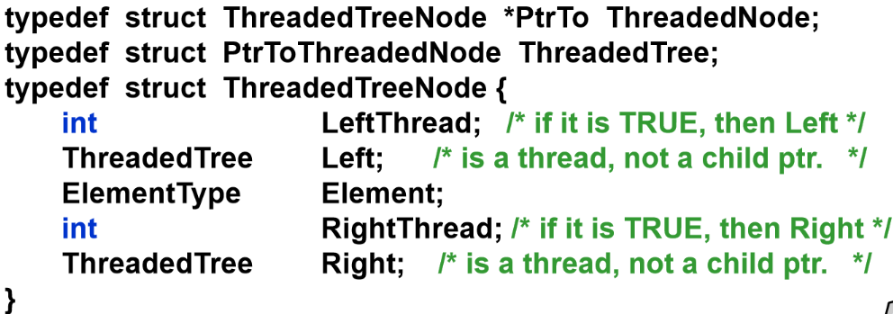

- 多了两个Boolean用于判断左右节点是否为thread

- 例子：

*第一个有内容的节点的左节点指向dummy head node，最后一个有内容的节点的右节点指向dummy head node的右节点；dummy head node左边指向根节点，右边指自己*

### Properties of Binary Trees

- Skewed Binary Trees
- Complete Binary Trees - all the leaf nodes are on two adjacent levels
- 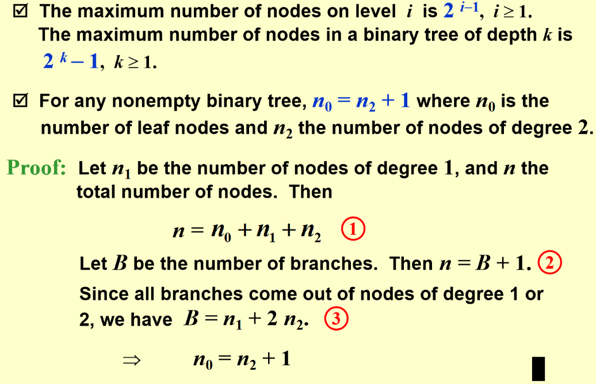

### Binary Search Trees (BST)

数据是动态变化的

- **definition**

  继承了所有二叉树的特点，是递归定义的

- **ADT**
  - Objects: 具有零个或多个元素的有限有序列表
  - Operations: 

- Implementations

    - Find
    递归版本：
    ```c
    Position  Find( ElementType X,  SearchTree T ) 
    { 
          if ( T == NULL ) 
              return  NULL;  /* not found in an empty tree */
          if ( X < T->Element )  /* if smaller than root */
              return  Find( X, T->Left );  /* search left subtree */
          else 
              if ( X > T->Element )  /* if larger than root */
    	  return  Find( X, T->Right );  /* search right subtree */
              else   /* if X == root */
    	  return  T;  /* found */
    } 
    ```
    时间复杂度：$T( N ) = S ( N ) =O( d )$,   where d is the depth of X;
    循环版本：
    ```c
    Position  Iter_Find( ElementType X,  SearchTree T ) 
    { 
          /* iterative version of Find */
          while  ( T )   {
              if  ( X == T->Element )	return T ;  /* found */
              if  ( X < T->Element )	T = T->Left ; /*move down along left path */
              else	T = T-> Right ; /* move down along right path */
          }  /* end while-loop */
          return  NULL ;   /* not found */
    } 
    ```
    - FindMin & FindMax<br>
    Min:
    ```c
      Position  FindMin( SearchTree T ) 
    { 
            if ( T == NULL )   
                return  NULL; /* not found in an empty tree */
            else 
                if ( T->Left == NULL )   return  T;  /* found left most */
                else   return  FindMin( T->Left );   /* keep moving to left */
      } 
    ```
    Max:
    ```c
      Position  FindMax( SearchTree T ) 
    { 
            if ( T != NULL ) 
                while ( T->Right != NULL )   
        T = T->Right;   /* keep moving to find right most */
            return T;  /* return NULL or the right most */
      } 
    ```
    - Insert<br>
    构建BST就是insert的叠加
    - malloc
    - 赋值
    - 左右孩子赋NULL
    ```c
      SearchTree  Insert( ElementType X, SearchTree T ) 
    { 
      	if ( T == NULL )
          {/* Create and return a one-node tree */ 
      		T = malloc( sizeof( struct TreeNode ) ); 
      		if ( T == NULL ) 
      			FatalError( "Out of space!!!" ); 
      		else
          	{ 
      			T->Element = X; 
      			T->Left = T->Right = NULL; 
              } 
          }  /* End creating a one-node tree */
          
          else  /* If there is a tree */
       	if ( X < T->Element ) 
      		T->Left = Insert( X, T->Left ); 
      	else if ( X > T->Element ) 
      		T->Right = Insert( X, T->Right ); 
      	   /* Else X is in the tree already; we'll do nothing */ 
          return  T;   /* Do not forget this line!! */ 
      }
    ```
    忽略insert的具体操作，其实就是search操作的框架<br>
    防止malloc报错：把buffer的指针申请一个比较大的内存<br>
    处理重复的数：不添加或为每一个node加入count，取决于具体的问题
    - Delete
        - 删除叶节点：直接将父节点的链接变成NULL
            - 删除degree为1的节点：直接让孩子去替代他那个位置
        - 删除degree为2的节点：
            - 将该节点**替换**为左子树中最大的节点或右子树中最小的节点，尽量删可以**减少树的高度**的节点
            - 将替换节点从子树中**删除**
        - 
        ```c
        SearchTree  Delete( ElementType X, SearchTree T ) 
        {    
            Position  TmpCell; 
            if ( T == NULL )   Error( "Element not found" ); 
            else  if ( X < T->Element )  /* Go left */ 
            T->Left = Delete( X, T->Left ); 
            else  if ( X > T->Element )  /* Go right */ 
            T->Right = Delete( X, T->Right ); 
          else  /* Found element to be deleted */ 
            if ( T->Left && T->Right )
                {  /* Two children */ 
                /* Replace with smallest in right subtree */ 
                  TmpCell = FindMin( T->Right ); 
                  T->Element = TmpCell->Element; 
                  T->Right = Delete( T->Element, T->Right );  
                } /* End if */
              else 
                {  /* One or zero child */ 
                  TmpCell = T; 
                  if ( T->Left == NULL ) /* Also handles 0 child */ 
                T = T->Right; 
                  else  if ( T->Right == NULL )  T = T->Left; 
                    free( TmpCell ); 
                }  /* End else 1 or 0 child */
              return  T; 
        }
        ```
        Lazy deletion: 如果没有很多删除，那么可以使用延迟删除：向每个节点添加一个标志字段，以标记节点是活动的还是已删除的。因此，我们可以删除一个节点，而不会释放该节点的空间。如果重新插入已删除的键，则不必再次调用malloc。

- Average-Case Analysis<br>
树的高度取决于插入的顺序

## 5 Priority Queues

需要优先级的时候需要此数据结构

操作：

- 优先级排序初始化
- 插入
- 删除最小
- 找最小

实现方式及算法复杂度：

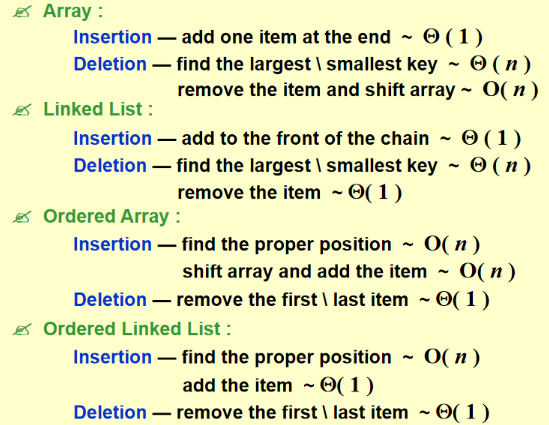

*相比之下Linked List是最优解，但是仍有一个N数量级的复杂度*

BST的插入和删除相比之下更优，插入删除的复杂度都是logN数量级的，平衡树更快但没必要（有指针，很危险）

### Binary Heap

层次遍历是连续的，逻辑上可以成为一棵二叉树，但是实际的实现还是数组

完全二叉树：

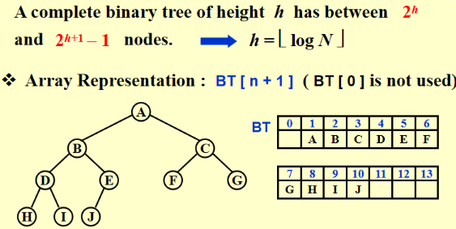

*在这里0节点是空出的，且完全二叉树和最下面这层有多少个没有关系*

在完全二叉树的前提下，因为树的高度是确定的，所以插入删除操作的复杂度也是有确定关系的

寻找父子节点（真正的实现是位移）：

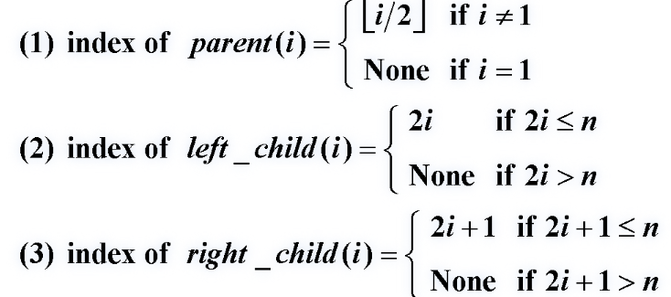

代码实现：

- 初始化建堆

```c
PriorityQueue  Initialize( int  MaxElements ) 
{ 
	PriorityQueue  H; 
	if ( MaxElements < MinPQSize ) 
		return  Error( "Priority queue size is too small" ); 
    	/*数据规模过小，没必要使用Heaps数据结构*/
	H = malloc( sizeof ( struct HeapStruct ) ); 
    if ( H ==NULL ) 
		return  FatalError( "Out of space!!!" ); 
    /* Allocate the array plus one extra for sentinel */ 
    H->Elements = malloc(( MaxElements + 1 ) * sizeof( ElementType )); 
    if ( H->Elements == NULL ) 
		return  FatalError( "Out of space!!!" ); 
    H->Capacity = MaxElements; 
    H->Size = 0; 
    H->Elements[ 0 ] = MinData;  /* set the sentinel */
    return  H; 
}
```

最小堆：既是完全二叉树也是最小树（父节点一定比所有子节点小，没有左右大小要求），最大堆同理。

基本操作：

- 插入：通过下标换算不断和父节点比较，如果比父节点小就交换（3步）并且进行下一步比较，不断迭代，找到比它大的父节点或到了根节点就结束

```c
/* H->Element[ 0 ] is a sentinel */ 
/* 元素[0]是一个不大于堆中最小元素的哨兵，用于保证for loop是有限的，或者在for loop中加一个是否到达根节点的判断，但是这样每次循环会多一次判断 */
void  Insert( ElementType  X,  PriorityQueue  H ) 
{ 
	int  i; 
	if ( IsFull( H ) ) 
    { 
		Error( "Priority queue is full" ); 
		return; 
    } 
    for ( i = ++H->Size; H->Elements[ i / 2 ] > X; i /= 2 ) 
		H->Elements[ i ] = H->Elements[ i / 2 ]; /*Faster than swap*/
    H->Elements[ i ] = X; 
}
```

$T (N) = O ( log N )$

- 删除最小元素：先构建好一个完全二叉树，再完成顺序排列

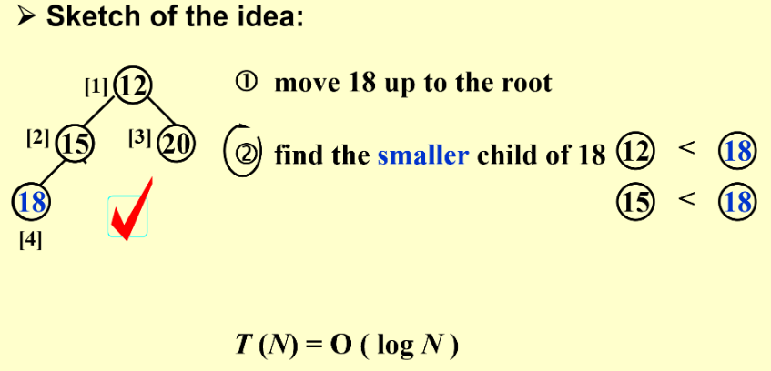

```c
/*这章代码都必考的！！*/
ElementType  DeleteMin( PriorityQueue  H ) 
{ 
    int  i, Child; 
    ElementType  MinElement, LastElement; 
    if ( IsEmpty( H ) ) 
    { 
         Error( "Priority queue is empty" ); 
         return  H->Elements[ 0 ];   
    } 
    
    MinElement = H->Elements[ 1 ];  /* save the min element */
    LastElement = H->Elements[ H->Size-- ];  /* take last and reset size */
    /*没有把末尾的数清零，只是把size-1*/
    
    for ( i = 1; i * 2 <= H->Size; i = Child ) 
    {  
        /* Find smaller child */ 
        Child = i * 2; 
        if (Child != H->Size && H->Elements[Child + 1] < H->Elements[Child]) 
	    	Child ++;     
        if ( LastElement > H->Elements[ Child ] )   
        /* Percolate one level */ 
	    	H->Elements[ i ] = H->Elements[ Child ]; 
        else
            break;   /* find the proper position */
    }
    /*真正执行赋值LastElement是在循环外*/
    H->Elements[ i ] = LastElement; 
    return  MinElement; 
}
```

- 其他操作

    - 查找除最小元素之外的任何元素都必须对整个堆进行线性扫描

    - DecreaseKey ( P, ▲, H ) -> Percolate up 上浮

    - IncreaseKey ( P, ▲, H ) -> Percolate down 下沉

    - Delete ( P, H )

        - DecreaseKey(P, $\infty$, H)
        - DeleteMin(H)

    - **BuildHeap ( H )**

        - 如果使用N次插入，$T(N)=O(NlogN)$ -> too slow

        - 在现成的树的基础上调整，从倒数第二层开始，调整一半的节点即可，$T(N) = O(N)$
        - 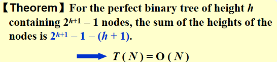

- 堆排序 = 
    - 建堆 $O(N)$
    - N次deletemin $N*O(logN)$
    - 总时间复杂度：$O(NlogN)$，worst case 和 best case 都一样

- 应用：找到第k大的元素
    - 建堆
    - k次deletemin/n-k次deletemin（看哪个小决定建不同的树）

- 全排序：queue sort；取top k/1000/...：heap -$O(N) + O(klogN)$

- d-Heaps ---- All nodes have d children
    - DeleteMin每次比k次，时间复杂度为$O(dlog_dN)$
    - $*2$或者/2都是位运算操作，但是$*d$或者/d就不是
    - 当优先级队列太大而无法完全放入主存时，d堆就变得有趣了

## 6 The Disjoint Set ADT

### Equivalence Relations

**x~y** -> x and y of **a set S**(都是定义在一个集合上的) are in the same **equivalence class**

- symmetric 对称
- reflexive 自反
- transitive 传递

### The Dynamic Equivalence Problem

算法功能：给定一个等价关系~，判定任意a和b是否为a ~ b

```c
Algorithm: (Union / Find)
{   
    /* step 1: read the relations in */
    Initialize N disjoint sets;
    /*初始化的时候每个数据都是独立的*/
    while ( read in a ~ b ) 
    {
        if ( ! (Find(a) == Find(b)) ) Union the two sets;
    } /* end-while */
    /* step 2: decide if a ~ b */
    while ( read in a and b )
    {
        if ( Find(a) == Find(b) )   output( true );
        else   output( false );
    }
}
```


实现：forest；指针是反向的

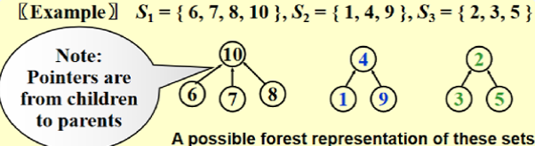

操作：

- Union(i, j)：将$S_i$和$S_j$替换成$S=S_i\bigcup S_j$
- Find(i)：找到包含i的$S_k$

### Basic Data Structure

- Union&Find<br>
  将其中一个根的父指针设置为另一个根
    - 链表操作：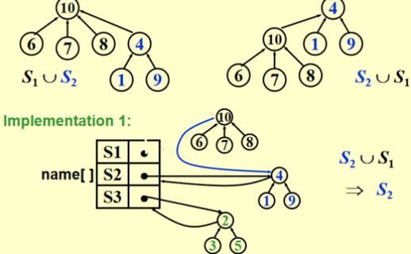
    - 实现1：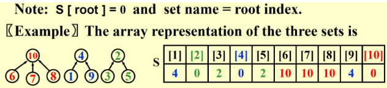
        - Union 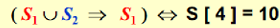
        ```c
        void  SetUnion ( DisjSet S, SetType Rt1, SetType Rt2 )
        {    S [ Rt2 ] = Rt1 ;     }
        ```
        - Find
            - 链表：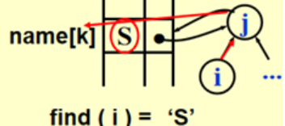
            - 数组：
            ```c
            SetType  Find ( ElementType X, DisjSet S )
            {   for ( ; S[X] > 0; X = S[X] );
                return  X ;
            }
            ```
        - 建立等价关系
        ```c
        Algorithm using union-find operations
        {  
            Initialize  Si = { i }  for  i = 1, ..., 12 ;
            for  ( k = 1; k <= 9; k++ )  
            {  
                /* for each pair  i ≡ j */
              if  ( Find( i ) != Find( j ) )
                  SetUnion( Find( i ), Find( j ) );
              /*最坏时间复杂度O(N^2)*/
          }
        }
        ```
    - 实现2：改变Union操作（smart union）<br>
    寻找更小的cluster被合并<br>
    记录Size: 用当前这棵树的根节点记录这棵树的大小，因为正数已经用来表示父子节点关系了，所以用负数来储存避免出错；每棵树在最开始的时候大小为1，故初始化为-1。<br>
    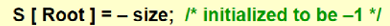
    
    - 实现3：Union by Height<br>
    将矮的树并到高的树上<br>
    >例如，如果我们将所有集合放在一个队列中，并重复地将前两个集合从队列中取出，然后将联合放入队列中，就会出现最坏的情况。如果查找比联合多很多，则运行时间比快速查找算法更差。此外，应该清楚的是，联合算法可能没有更多的改进。这是基于这样一种观察，即任何执行联合的方法都将产生相同的最坏情况树，因为它必须任意地打破联系。因此，在不完全修改数据结构的情况下，加快算法速度的唯一方法是在查找操作上做一些聪明的事情。这种巧妙的操作被称为路径压缩。路径压缩是在查找操作期间执行的，与执行联合所使用的策略无关。假设操作是find(x)。路径压缩的效果是，从x到根的路径上的每个节点都将其父节点更改为根节点。图8.14显示了find(15)之后的路径压缩对图8.12的一般最差树的影响。路径压缩的效果是，随着额外的两个指针移动，节点13和14现在离根更近一个位置，节点15和16现在离根更近两个位置。因此，未来对这些节点的快速访问将(我们希望)为进行路径压缩付出额外的工作。如图8.15中的代码所示，路径压缩是对基本查找算法的一个微不足道的更改。对find例程的唯一更改是使S[x]等于find返回的值;因此，在递归地找到集合的根之后，使x直接指向它。这将递归地发生在到根的路径上的每个节点上，因此这实现了路径压缩。正如我们在实现堆栈和队列时所说，修改被调用函数的参数不一定符合当前的软件工程规则。有些语言不允许这样做，所以这段代码可能需要修改。
    >
    >*Read Figure 8.13 on p.273*
    - 实现4：Union by Size with Path Compression 路径压缩<br>
    目的：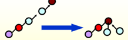
    ```c
    SetType  Find ( ElementType  X, DisjSet  S )
    {   
        ElementType  root,  trail,  lead;
        for ( root = X; S[ root ] > 0; root = S[ root ] )
            ;  /* find the root */
        for ( trail = X; trail != root; trail = lead ) {
           lead = S[ trail ] ;   
           S[ trail ] = root ;   
        }  /* collapsing */
        return  root ;
    }
    ```
    让所经过的节点都指向父节点<br>
    优化后：与**Union-by-Height**不兼容，因为它改变了高度。Just take “height” as an estimated **rank**.<br>
    - 实现5：Union by Rank（已经经过路径压缩）
    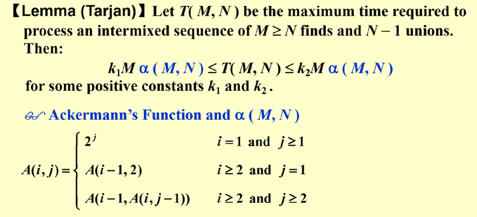
    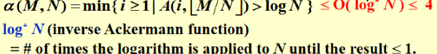

<script>
MathJax = {
  tex: {
    inlineMath: [['$', '$'], ['\\(', '\\)']]
  }
};
</script>
<script id="MathJax-script" async
  src="https://cdn.jsdelivr.net/npm/mathjax@3/es5/tex-chtml.js">
</script>
