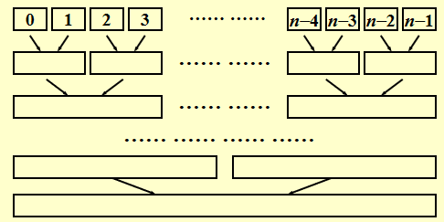
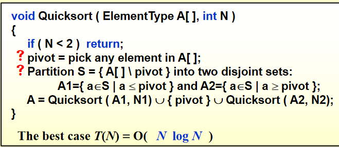
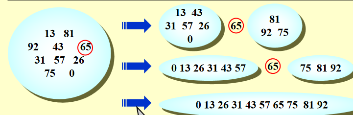
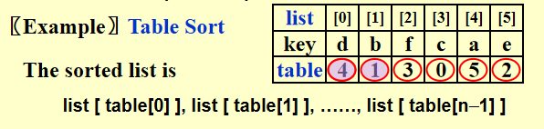
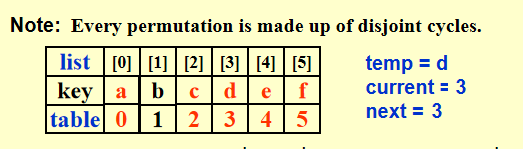
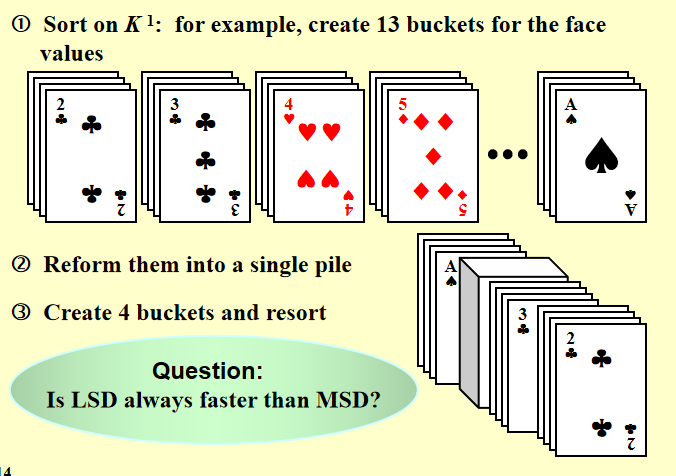
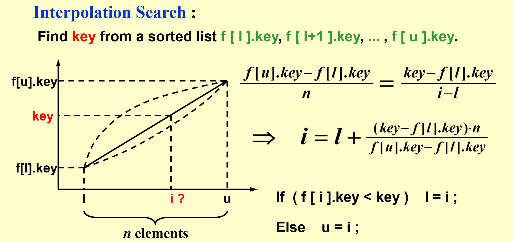
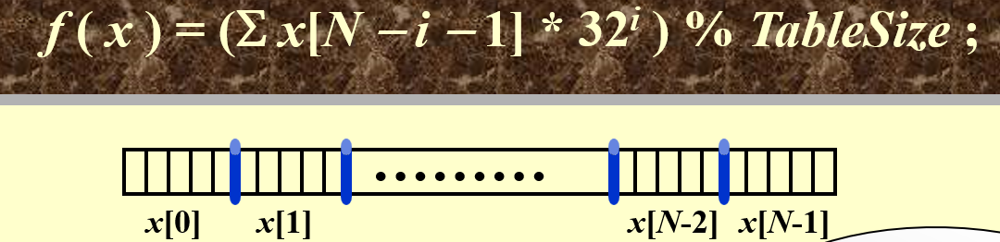

# Chapter6 Sorting

## ADT定义

```c
void  X_Sort ( ElementType  A[ ],  int N )
/*N是一个合法整数，为了方便会假设A为整数数组；` > `和` < `操作符存在，并且是唯一允许对输入数据进行的操作；只考虑内部排序*/
```

## 插入排序

```c
void InsertionSort ( ElementType A[ ], int N ) 
{
    int  j, P; 
    ElementType  Tmp; 
    for ( P = 1; P < N; P++ ) 
    { 
		Tmp = A[ P ];  /* the next coming card */
		for ( j = P; j > 0 && A[ j - 1 ] > Tmp; j-- ) 	A[ j ] = A[ j - 1 ]; 
	      /* shift sorted cards to provide a position for the new coming card */
		A[ j ] = Tmp;  /* place the new card at the proper position */
    }  /* end for-P-loop */
}
```

时间复杂度：

- worst case - $O(N^2)$
- best case - $O(N)$

## 简单排序复杂度的下限

定义**逆序对（inversion）**为具有i < j但A[i] > A[j]性质的任意有序对(i, j) $\rightarrow$ 一次（相邻）交换只能**消除一个逆序对**，排序的过程就是消除逆序对的过程

$T ( N, I ) = O(I+N)$ where I is the number of inversions in the original array.

由best和worst的情况可得：average case 的时间复杂度是$N(N-1)/4$

**任何**通过**交换相邻元素**进行排序的算法需要$\Omega(N^2)$的时间

## 希尔排序 - Shellsort

隔n个数取一个的**多轮插排**，一次交换可以消除多个逆序对；最后一轮就是1-sort（插排），保证结果正确性。


```c
void Shellsort( ElementType A[ ], int N ) 
{ 
	int  i, j, Increment; 
    ElementType  Tmp; 
    for ( Increment = N / 2; Increment > 0; Increment /= 2 )  
	/*h sequence */
		for ( i = Increment; i < N; i++ ) 
        { /* insertion sort */
	    	Tmp = A[ i ]; 
	      	for ( j = i; j >= Increment; j -= Increment ) 
				if( Tmp < A[ j - Increment ] ) 
		      		A[ j ] = A[ j - Increment ]; 
				else 
		      		break; 
			A[ j ] = Tmp; 
		} /* end for-I and for-Increment loops */
}
```

时间复杂度不好分析，是用一种看似复杂的方法减少了交换次数

- worst case: $\Theta(N^2)$ 
- 没有严格要求一定要取prime number
- 优化：考虑no common factors，取
- 优化后的worst case: $\Theta(N^{3/2})$
- 优化后平均时间复杂度: $O(N^{5/4})$
- 

*大规模数据queue sort更好用，小规模数据shell sort或者insertion sort更好用，并且在面对大规模数据的时候也会执行cut off使其变成多块小规模数据然后执行shell sort/ insertion sort*

## 堆排序 - Heapsort

```c
Algorithm 1:
{
    BuildHeap( H ); /* O( N ) */
    for ( i=0; i<N; i++ ) 
		TmpH[ i ] = DeleteMin( H ); /* O( log N ) */
    for ( i=0; i<N; i++ ) 
		H[ i ] = TmpH[ i ]; /* O( 1 ) */
}
```

$T(N)=O(NlogN)$

缺点：空间复杂度doubled

Algorithm2: 建最大堆

建完一个最大堆之后原地排序，不需要再开一个数组

```c
void Heapsort( ElementType A[ ], int N ) 
{  
    int i; 
    for ( i = N / 2; i >= 0; i - - ) /* BuildHeap */ 
        PercDown( A, i, N ); 
    for ( i = N - 1; i > 0; i - - ) 
    { 
        Swap( &A[ 0 ], &A[ i ] ); /* DeleteMax */ 
        PercDown( A, 0, i ); 
    } 
}
```

Average Time Complexity: $2NlogN-O(NloglogN)$

缺点：实际操作过程中读内存次数太多了，耗时并没有理论那么少

## 归并排序 - Mergesort

### 归并两个有序数组

 $T(N) = O(N)$

### 分治法实现归并排序

```c
void MSort( ElementType A[ ], ElementType TmpArray[ ], int Left, int Right ) 
{   
    // 数据划分
	int  Center; 
    if ( Left < Right ) 
    {  
        /* if there are elements to be sorted */
        Center = ( Left + Right ) / 2; 
        MSort( A, TmpArray, Left, Center ); 	/* T( N / 2 ) */
        MSort( A, TmpArray, Center + 1, Right ); 	/* T( N / 2 ) */
        Merge( A, TmpArray, Left, Center + 1, Right );  /* O( N ) */
        // If a TmpArray is declared locally for each call of Merge, then S(N) = O(NlogN)
    } 
} 

void Mergesort( ElementType A[ ], int N ) 
{   
    ElementType  *TmpArray;  /* need O(N) extra space */
    TmpArray = malloc( N * sizeof( ElementType ) ); 
    if ( TmpArray != NULL ) 
    { 
        MSort( A, TmpArray, 0, N - 1 ); 
        free( TmpArray ); 
    } 
    else  FatalError( "No space for tmp array!!!" ); 
}

/* Lpos = start of left half, Rpos = start of right half */ 
void Merge( ElementType A[ ], ElementType TmpArray[ ], int Lpos, int Rpos, int RightEnd ) 
{   
    int  i, LeftEnd, NumElements, TmpPos; 
    LeftEnd = Rpos - 1; 
    TmpPos = Lpos; 
    NumElements = RightEnd - Lpos + 1; 
    while( Lpos <= LeftEnd && Rpos <= RightEnd ) /* main loop */ 
        if ( A[ Lpos ] <= A[ Rpos ] ) 	TmpArray[ TmpPos++ ] = A[ Lpos++ ]; 
        else	TmpArray[ TmpPos++ ] = A[ Rpos++ ]; 
    while( Lpos <= LeftEnd ) /* Copy rest of first half */ 
        TmpArray[ TmpPos++ ] = A[ Lpos++ ]; 
    while( Rpos <= RightEnd ) /* Copy rest of second half */ 
        TmpArray[ TmpPos++ ] = A[ Rpos++ ]; 
    for( i = 0; i < NumElements; i++, RightEnd-- ) 
         /* Copy TmpArray back */ 
        A[ RightEnd ] = TmpArray[ RightEnd ]; 
}
```

### 复杂度分析

$T(1) = 1$

$T(N) = 2T(N/2)+O(N)=2^kT(N/2^k)+k*O(N)=N*T(1)+logN*O(N)=O(N+NlogN)$



非递归实现：自己划分，分到单独一块为止，直接执行合并

归并排序需要线性的额外内存，复制数组的速度很慢。它很少用于内部排序，但对于**外部排序**非常有用。

### 内部排序与外部排序比较

| 特性     | 内部排序             | 外部排序             |
| :------- | :------------------- | :------------------- |
| 数据位置 | 内存中               | 外部存储设备上       |
| 数据量   | 小到中等             | 非常大               |
| 速度     | 快                   | 慢（由于磁盘I/O）    |
| 算法举例 | 快速排序、堆排序等   | 外部归并排序         |
| I/O操作  | 较少                 | 频繁                 |
| 使用场景 | 内存可以容纳全部数据 | 内存无法容纳全部数据 |

## 算法稳定性

稳定排序的概念：能保证排序前**2个相等的数**其在序列的前后位置顺序和排序后它们两个的**前后位置顺序相同**

**选择排序、快速排序、希尔排序、堆排序**不是稳定的排序算法；而**冒泡排序、插入排序、归并排序和基数排序**是稳定的排序算法。

## 快速排序 - Quicksort

现有排序算法中实际最快的

算法核心：选支点，分成左小右大两部分；一次至少排好一个数（支点）



e.g. 

### pivot的选取

Pivot = median(left, center, right)

用头中尾三个数的中位数逼近整体中位数

### 划分操作

把选中的Povit放到最后一位

用`i ++`和`j --`寻找逆序对并交换，一次交换消除两个逆序对，直到`i`和`j`遍历了整个序列，将`pivot`插入二者之间

### 适用情况

- 当N很小(<=20)时，快速排序比插入排序慢
- 故当N很小时cutoff采用其他方法

### 具体实现

```c
void  Quicksort( ElementType A[ ], int N ) 
{ 
	Qsort( A, 0, N - 1 ); 
	/* A: 	the array 	*/
	/* 0: 	Left index 	*/
	/* N – 1: Right index	*/
}

/* Return median of Left, Center, and Right */ 
/* Order these and hide the pivot */ 

ElementType Median3( ElementType A[ ], int Left, int Right ) 
{ 
    int  Center = ( Left + Right ) / 2; 
    if ( A[ Left ] > A[ Center ] ) 
        Swap( &A[ Left ], &A[ Center ] ); 
    if ( A[ Left ] > A[ Right ] ) 
        Swap( &A[ Left ], &A[ Right ] ); 
    if ( A[ Center ] > A[ Right ] ) 
        Swap( &A[ Center ], &A[ Right ] ); 
    /* Invariant: A[ Left ] <= A[ Center ] <= A[ Right ] */ 
    Swap( &A[ Center ], &A[ Right - 1 ] ); /* Hide pivot */ 
    /* only need to sort A[ Left + 1 ] … A[ Right – 2 ] */
    return  A[ Right - 1 ];  /* Return pivot */ 
}
// !!!很重要!!!
void  Qsort( ElementType A[ ], int Left, int Right ) 
{   
    int  i,  j; 
    ElementType  Pivot; 
    if ( Left + Cutoff <= Right ) 
    {  
        /* if the sequence is not too short */
        Pivot = Median3( A, Left, Right );  /* select pivot */
        i = Left;     
        j = Right – 1;  /* why not set Left+1 and Right-2? */
        for( ; ; ) 
        { 
        	while ( A[ + +i ] < Pivot ) { }  /* scan from left */
        	while ( A[ – –j ] > Pivot ) { }  /* scan from right */
        	if ( i < j )	Swap( &A[ i ], &A[ j ] );  /* adjust partition */
        	else     break;  /* partition done */
        } 
        Swap( &A[ i ], &A[ Right - 1 ] ); /* restore pivot */ 
        Qsort( A, Left, i - 1 );      /* recursively sort left part */
        Qsort( A, i + 1, Right );   /* recursively sort right part */
    }  /* end if - the sequence is long */
    else /* do an insertion sort on the short subarray */ 
        InsertionSort( A + Left, Right - Left + 1 );
}
```

**非递归实现**就是自己找left和right

### 复杂度分析


*Read Figure 6.16 on p.214 for the 5th algorithm on solving kth largest problem.*

## 大型结构体排序（表排序）- table sort

避免大规模的copy，将指针字段添加到结构中并交换指针——间接排序。如果确实有必要，最后再重新安排结构。


节省空间复杂度的重排方法：


## 任意排序的lower bound

任何基于比较排序的算法在最坏情况下的计算时间必须为$\Omega(NlogN)$

证明：

树的最小高度为$NlogN$

## 桶排序和基数排序 - Bucket Sort and Radix Sort

### 桶排序

```c
Algorithm
{
    initialize count[ ];
    while (read in a student’s record)
        insert to list count[stdnt.grade];
    for (i=0; i<M; i++) {
        if (count[i])
            output list count[i];
    }
}
```

$T(N,M) = O(M+N)$

### 基数排序

- 从末位开始**桶排序**
- 从左到右倒二位排序
- ...递归
- 直到排到第一位


基数定义:

分类：

- **MSD**

  

- **LSD**

  

## Hashing

核心思想：search by formula - 有点类似蛛网图的查找



### Hash Tables

hash function **f(x)** - 把一个元素map到一个bucket里面去的映射

- easy to compute

- 最小化collision

- Probability($f(x)=i$) = 1/b - **uniform hash function**

- hash function 的选取

  例：字符串的hash function

  

  ```cpp
  Index Hash3( const char *x, int TableSize ) 
  {
      unsigned  int  HashVal = 0; 
      while( *x != '\0' )	HashVal = ( HashVal << 5 ) + *x++; 
      return HashVal % TableSize; 
  } 
  ```

loading density $\lambda = n/(s*b)$ - 反应拥挤程度，和running time相关


**collision** - 不同的identity的hash function的value是一样的

**overflow** - hash a new identifier into a full bucket

时间复杂度：没有overflow的情况下，$T_{search}=T_{insert}=T_{delete}=O(1)$

但是如果实现不好，有很多overflow的话，就会变成线性的

### Seperate Chaining

用链表解决collision问题

```cpp
struct  ListNode; 
typedef  struct  ListNode  *Position; 
struct  HashTbl; 
typedef  struct  HashTbl  *HashTable; 
struct  ListNode { 
	ElementType  Element; 
	Position  Next; 
}; 
typedef  Position  List; 
/* List *TheList will be an array of lists, allocated later */ 
/* The lists use headers (for simplicity), */ 
/* though this wastes space */ 
struct  HashTbl { 
	int  TableSize; 
	List  *TheLists; 
}; 
```

- 创建一个空table

```cpp
HashTable  InitializeTable( int TableSize ) 
{   
    HashTable  H; 
    int  i; 
    if ( TableSize < MinTableSize ) 
    { 
	    Error( "Table size too small" );  
        return NULL;  
    } 
    H = malloc( sizeof( struct HashTbl ) );  /* Allocate table */
    if ( H == NULL )	FatalError( "Out of space!!!" ); 
    H->TableSize = NextPrime( TableSize );  /* Better be prime */
    H->TheLists = malloc( sizeof( List ) * H->TableSize );  /*Array of lists*/
    if ( H->TheLists == NULL )   FatalError( "Out of space!!!" ); 
    for( i = 0; i < H->TableSize; i++ ) 
    {   /* Allocate list headers */
        H->TheLists[ i ] = malloc( sizeof( struct ListNode ) ); /* Slow! */
        if ( H->TheLists[ i ] == NULL )  FatalError( "Out of space!!!" ); 
        else    H->TheLists[ i ]->Next = NULL;
    } 
    return  H; 
} 
```

- 查找

```cpp
Position  Find ( ElementType Key, HashTable H ) 
{ 
    Position P; 
    List L; 

    L = H->TheLists[ Hash( Key, H->TableSize ) ]; //Hash是我的Hash Function

    P = L->Next; 
    while( P != NULL && P->Element != Key )  /* Probably need strcmp */ 
	P = P->Next; 
    return P; 
} 
```

- 插入

```cpp
void  Insert ( ElementType Key, HashTable H ) 
{ 
    Position   Pos, NewCell; 
    List  L; 
    Pos = Find( Key, H ); 
    if ( Pos == NULL ) 
    {   
        /* Key is not found, then insert */
        NewCell = malloc( sizeof( struct ListNode ) ); 
        if ( NewCell == NULL )	FatalError( "Out of space!!!" ); 
        else 
        { 
             L = H->TheLists[ Hash( Key, H->TableSize ) ]; 
             NewCell->Next = L->Next; 
             NewCell->Element = Key; /* Probably need strcpy! */ 
             L->Next = NewCell; 
        } 
    } 
} 
```

在这种算法情况下，$\lambda$≈1

### Open Addressing

整体算法框架：

```cpp
Algorithm: insert key into an array of hash table
{
    index = hash(key); // hash table 对应的 bucket
    initialize i = 0 // collision probing 的次数
    while ( collision at index ) 
    {
        index = ( hash(key) + f(i) ) % TableSize; // 不同的probing算法只是f(i)不一样
        if ( table is full )    break;
        else    i ++;
    }
    if ( table is full )	ERROR (“No space left”);
    else	insert key at index;
}
```

$\lambda$≈0.5

#### 1. Linear Probing

$f(i)=i$

#### 2. Quadratic Probing

$f(i)=i^2$

**定理1：**

条件：

- quadratic probing is used
- the table size is **prime**
- the table is **at least half empty**

结论：

- a new element can always be inserted

**定理2：**

-  the table size is **a prime of the form 4k + 3** $\rightarrow$ the quadratic probing $f(i)=$±$i^2$ can probe the entire table

**查找：**

```cpp
Position  Find ( ElementType Key, HashTable H ) 
{   
    Position  CurrentPos; 
    int  CollisionNum; 
    CollisionNum = 0; 
    CurrentPos = Hash( Key, H->TableSize ); 
    while( H->TheCells[ CurrentPos ].Info != Empty && 
          H->TheCells[ CurrentPos ].Element != Key ) 
    { 
        CurrentPos += 2 * ++CollisionNum - 1; // 相当于+i^2，但是利用了和上一轮结果的关系，这样更快
        if ( CurrentPos >= H->TableSize )  CurrentPos -= H->TableSize; 
    } 
    return CurrentPos; 
} 
```

**插入：**

```cpp
void  Insert ( ElementType Key, HashTable H ) 
{ 
    Position  Pos; 
    Pos = Find( Key, H ); 
    if ( H->TheCells[ Pos ].Info != Legitimate ) // 在查找中因为此位置元素没有key而返回的pos
    { 
        /* OK to insert here */ 
        H->TheCells[ Pos ].Info = Legitimate; 
        H->TheCells[ Pos ].Element = Key; /* Probably need strcpy */ 
    } 
} 
```

**删除** - lazy deletion，在rehashing的时候正式执行删除

**次聚集问题** - 在$\lambda$比较大的时候会出现

*quadratic hashing = open addressing + quadratic probing*

#### 3. Double Hashing

$f(i)=i*hash_2(x) $ 	// $hash_2( x )$ is the 2nd hash function

tip: $hash_2(x)=R-(x\% R)$ with R a prime smaller than TableSize, will work well.

### Rehashing

做法：

- Build another table that is about twice as big;
- Scan down the entire original hash table for non-deleted elements;
- Use a new function to hash those elements into the new table.

什么时候需要？

-  As soon as the table is half full
- When an insertion fails
- When the table reaches a certain load factor - 因为$\lambda$越大，时间复杂度更高，所以对性能有要求的话可能就在一个给定的load factor的时候就执行rehashing了

<script>
MathJax = {
  tex: {
    inlineMath: [['$', '$'], ['\\(', '\\)']]
  }
};
</script>
<script id="MathJax-script" async
  src="https://cdn.jsdelivr.net/npm/mathjax@3/es5/tex-chtml.js">
</script>
