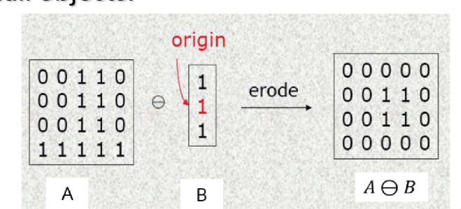

# 历年卷汇总及答案整理
说明： 
[历年卷来源](https://github.com/youuYouu02/DIP2022-2023) 
参考笔记：[hobbitqia](https://note.hobbitqia.cc/dip/)&[jiepeng's notes](https://note.jiepeng.tech/CS/DIP/) 
感觉dip这门课面向历年卷复习很有必要，我们这一届考试的时候80%以上都是之前考过的，由于是闭卷所以要尽可能背准确 
答案是自己做的，可能会有一些小问题

## 2022-2023秋冬学期真题

> 注：题目是中英对照的，回答用中文或英文均可

### 一、填空题（1*n）

1. **Digital image (or video stream) 数字图像** is the main form to present information. For human being, more than 60% information are obtained by **vision 视觉**.

2. 设备相关的颜色空间：（RGB）（CMY）（HSV）；设备无关的颜色空间：（CIE xyz）（CIE `L*a*b`）（CIE YUV）

3. Image Data 要求每一行必须是 **4** 的倍数，例如 `13 A1 17 19 18 15` 在文件中存储为：（`13 A1 17 19 18 15 00 00`）

4. BMP图像的文件结构：（IMAGE FILE HEADER）（IMAGE IMFORMATION HEADER）（PALETTE）（IMAGE DATA）

### 二、说明题

1. 数码相机成像原理（6'）

2. JPEG压缩的基本思想和优势 
压缩策略：根据压缩比要求，从高频到低频逐步削减信息 
优势：高频信息占用存储空间大，减少高频信息更容易获得高压缩比；低频信息可以保留物体的基本轮廓和色彩分布，最大限度维持图像质量；适合用于互联网的视觉媒体。

3. BMP图像调色板的作用（4'） 
将颜色重新编码，使其在低位的情况下可以最大程度地保留原来的颜色

4. 获取二值图像时，如何确定一个好的阈值

5. 腐蚀操作的物理意义；给出 input image 和 struct element 要求画出腐蚀后的矩阵 
消除边界点，使边界向内部收缩的过程。可以⽤来消除⼩且⽆意义的物体。 

6. 解释可视化增强的对数操作

7. 直方图均衡化为什么不能做到真正均衡 
步骤2中，所得的sk不可能正好等于8级灰度值中的某一级，因此需要就近归入某一个灰度级中。这样，相邻的多个sk就可能落入同一个灰度级，需要在步骤3时将处于同一个灰度级的像素个数累加。因此，离散灰度直方图均衡化操作以后，每个灰度级处的概率密度（或像素个数）并不完全一样。

8. 解释最近邻插值的过程

9. 表情比例图的方法

10. 写出双边滤波的 general idea 和双边滤波与高斯滤波的区别 
一幅图像有两个主要特征: 
空间域S，它是一幅图像中可能位置的集合。这与分辨率有关，也就是图像中的行数和列数。 
强度域R，是可能像素值的集合。用来表示像素值的位数可能会变化。常见的像素表示形式是无符号字节(0到255)和浮点数。 
同时考虑Space Domain S和Intensity Domain R，把图片分成大尺度特征、结构和小尺度特征、纹理两部分。 
高斯滤波只考虑了空间域，而双边滤波由于考虑了intensity domain，因此具有保边的作用。

11. SIFT 的 full version

12. Back-propagation 的方法

13. RLE（给一张图，要求写出编码）

### 三、计算题（5）

1. w=0.8, 模型取点数为3，问最少要取几个点才能保证概率>95%RANSEC收敛

   (1-0.8^3)^n = 1 - 0.95

   RANSEC:
   
   1. 选择出可以估计出模型的最⼩数据集；
   2. 使⽤这个数据集来计算出数据模型；
   3. 将所有数据带⼊这个模型，计算出“内点”的数⽬
   4. ⽐较当前模型和之前推出的最好的模型的“内点“的数量，记录最⼤“内点”数的模型参数和“内点”数；
   5. 重复1-4步，直到迭代结束或者当前模型已经⾜够好了(“内点数⽬⼤于⼀定数量”)。

### 四、证明题（4+6）

1. 请证明膨胀和腐蚀的对偶关系（4'）

2. 请证明SNF中p=1时是中值滤波，p=2时是均值滤波（6'） 
中值滤波就是一堆绝对值相加，最小值在中值处取到 
均值滤波就是求导，导数零点的解就是均值 

## 2021~2022秋冬学期真题

1. 为什么说数字图像是信息的主要展示方式？成像方式有哪些？ 
可见光、X射线、超声波、红外线

2. 给出相机的示意图，描述相机的成像过程 
重复

3. (1) 设备无关的颜色有哪些？设备有关的颜色有哪些？ 
重复 
  (2) 假如RGB的颜色空间是一个正立方体，那么(0,0,0)到(1,1,1)这条对角线表示什么？ 
灰度从255到0的从黑到白的消色

4. JPEG图像的压缩策略是什么？有什么优点？ 
重复

5. (1) 给定结构元和图像，画出腐蚀操作的结果。并说说腐蚀操作的意义 
重复 
  (2) 在(1)的基础上，画出膨胀操作的结果 
开运算

6. 给定图像，写出行程编码，并说明行程编码的原理 
重复

7. 写出对数增强的过程 
重复

8. 直方图均衡化的结果分布不均匀的原因 
重复

9. 双线性插值的过程 
（1）定义双线性方程g(x,y)=ax+by+cxy+d。 
（2）分别将A、B、C、D四点的位置和灰度代入方程，得到方程组。 
（3）解方程组，解出a、b、c、d四个系数。 
（4）将P点的位置代入方程，得到P点的灰度。

10. 导向滤波和双边滤波相比有什么优点

保边（保梯度就一定能保边，反之不一定） 
非迭代 
O1的时间，快且不需要通过近似的方法 
不存在梯度逆转的问题 

11. Harris角点检测公式推导以及如何判断

12. CNN中的池化是什么？有什么作用？ 
池化（Pooling），在深度学习领域，特别是在卷积神经网络（CNN）中，是一种缩减采样（Downsampling）或子采样（Subsampling)技术，通常用于减少数据的维度，降低处理复杂度，同时保留重要的信息。池化操作可以减少模型对位置的敏感性，增加模型对小的变化和扰动的鲁棒性，并减少参数数量，从而帮助防止过拟合。 
常见的池化操作有： 
    1. 最大池化（Max Pooling）：在覆盖的区域内取最大值作为该区域的输出。 
    2. 平均池化（Average Pooling）：计算覆盖区域内所有元素的平均值作为输出。 
    3. 全局池化（Global Pooling）：例如全局平均池化（Global Average Pooling），在整个宽度和高度上进行池化，通常用在网络的最后几层，将每个特征图缩减为单个值。 
池化的意义主要体现在以下几个方面： 
        1. **特征不变性**：通过池化，网络能够对输入图片中的小变动保持不变性，比如平移、旋转和缩放。 
        2. **降低维度**：池化减少了后续层的输入数据的大小，这意味着计算量和参数数量降低，内存使用也减少。 
        3. **防止过拟合**：由于减少了模型的参数数量和复杂度，池化有助于防止模型过度适应训练数据的细节，即过拟合现象。 
        4. **强化特征**：最大池化有助于突出强特征，忽略不那么显著的特征。 
综上所述，池化是深度学习中一种重要的操作，它在简化网络结构的同时帮助提取和保留关键特征，对于构建高效和强大的卷积神经网络至关重要。 
13. 直方图均衡化计算

## 2020~2021秋冬学期真题

1. 图像与图形在来源/应用方面的不同，举3种成像方式 
图像和图形是视觉表现形式，它们在来源和应用方面存在一些显著的不同： 
 来源差异： 
**图像(Image)** 
**真实来源**：图像通常指的是通过摄影、扫描或其他数字捕捉技术获得的真实世界的视觉表示。这包括数码照片、扫描的文档和实时视频流。 
**像素构成**：数字图像通常由像素组成，这些像素在屏幕上排列成网格，每个像素包含颜色信息。 
**图形(Graphic)** 
**设计创作**：图形指的是由图形设计师或艺术家创作的视觉元素，这些元素可以是插画、设计图案、图标、类型排印、动画或者是通过计算机软件生成的3D模型。 
**向量或位图**：图形可以是基于向量的（由形状和线条组成，可以无限缩放而不失真）或者是位图（由像素组成，放大后可能会失真）。 
 应用差异： 
**图像(Image)的应用** 
**摄影**：个人和专业摄影、新闻摄影、肖像摄影等。 
**文档记录**：身份证明、法律文件扫描、历史档案数字化等。 
**娱乐**：电影、电视节目、视频游戏中的实景或者CGI（电脑生成图像）。 
**监控**：安全监控、交通管理、环境监测等。 
**图形(Graphic)的应用** 
**品牌和广告**：公司标识、广告、市场推广材料等。 
**用户界面设计**：网站、应用程序、软件界面的图标、按钮、布局等。 
**信息可视化**：图表、地图、信息图解等，用于呈现数据和信息。 
**艺术和娱乐**：漫画、动画、视频游戏中的角色和场景设计等。  
在实际使用中，图像和图形往往可以相互结合，如在广告设计中融合摄影图像和图形元素，或者在电影特效中将实拍图像与计算机生成图形结合。不同的来源和应用使得图像与图形各有其特点和优势，但它们在视觉传达中都扮演着至关重要的角色。 
成像方式重复了 

2. 介绍数码相机生成图片的过程 
重复

3. 哪些因素会对景深有影响？如何影响？ 
   (1) 镜头光圈：光圈越大，景深越小；光圈越小，景深越大； 
   (2) 镜头焦距：镜头焦距越长，景深越小；焦距越短，景深越大； 
   (3) 拍摄距离：距离越远，景深越大；距离越近，景深越小。 

4. HSV各个字母的意思，画简图表示HSV，以及比RGB好在哪里 

5. 如何生成高质量二值化图片（大津+局部自适应） 
感觉和23年的4差不多，再加一个滚动窗口？

6. 开运算和物理意义 

7. 给图，写直方图匹配过程 

8. 给trump到abama的morph图，问如何morph 
根据变换的快慢，设置相应的步长，将图a每一点的RGB逐渐变成图b相同位置像素的RGB。可以选择等比或等差的方式，对于灰度图像，可以直接用等比或等差级数定义步长，使颜色从原图变到目标图。对于彩色图像，RGB三色同时从原图变到目标图像。可以分别变化，也可考虑RGB的相对比例关系同时变化。 

9. 给了6×6的矩阵，用3×3的窗口算中值与拉普拉斯滤波（计算量巨大） 
用对应窗口加权求和，边界用补0处理？

10. 双边滤波的基本思想与各个项的解释 
基本思想重复

11. SIFT步骤与如何实现旋转不变性，SUFT步骤 
实现旋转不变性：获取特征点和对应尺度，分成$4*4$的窗口，每个窗口统计像素梯度形成$4*4*8=128$维向量，并且取最高频方向作为优势方向，将其旋转至标准的给定方向。 

12. 给你PPT上的那两张图，问如何拼接图像 
检测两张图像的特征点，找到对应的点对，用这些点对对齐图像 
尺度——放大缩小 
方向——直方图统计、旋转 

13. 给图，写BP全过程 
重复

这个可能会考：

交叉熵（含义，交叉熵损失） 
$L=-log(P_c)$ 
用作损失函数（Loss Function），用于衡量模型预测概率分布与真实标签的概率分布之间的差异 

