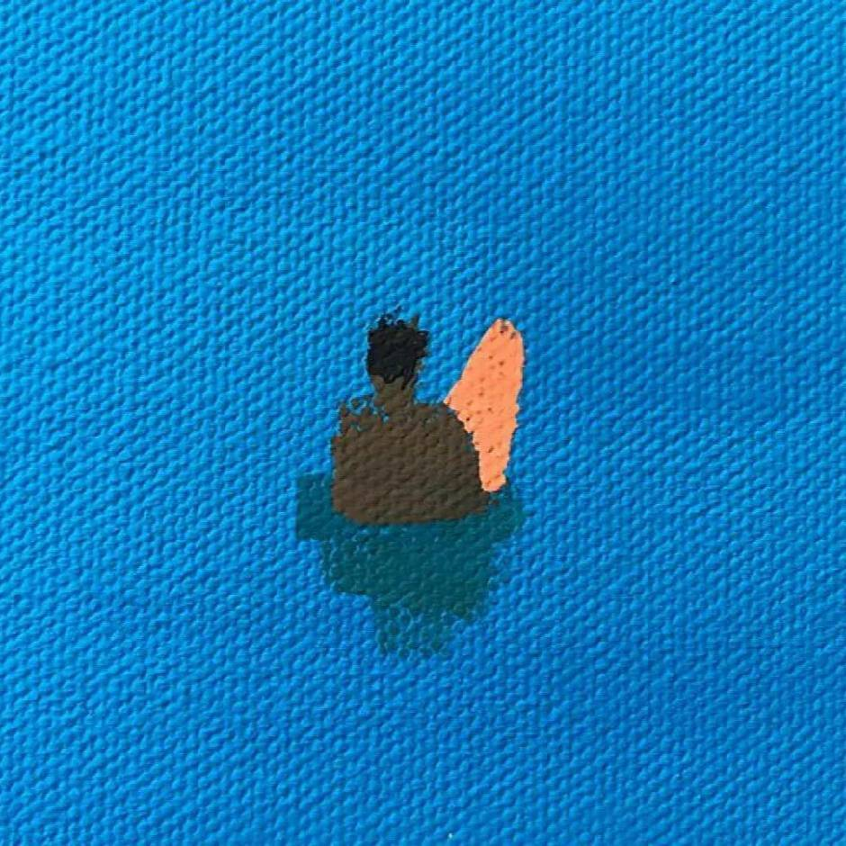

# 欢迎来到我的主页

我是浙江大学计算机科学与技术专业22级本科生，会在这里不定期更新一些课程笔记、技术积累和课程心得！

注：由于大一的时候很多笔记都是以手写/思维导图的方式整理的，所以在一些数理基础课程中以pdf链接的形式上传了我的资料，大家可以根据需要单击链接下载~

希望对看到这里的你有帮助~也欢迎大家一起交流！

!!! abstract "推荐阅读"
    * [高级数据结构与算法分析期末整理](ADS_复习整理.md)
    * [图像信息处理历年卷整理](dip历年卷整理.md)
    * [计算机体系结构期末整理](2024_fall/CA/final_review.md)

!!! blue-box ""
    

        <!--copy说明：要把这个组件copy到别的网站的时候记得把assets文件夹下面的stylesheets.css一起copy过去，并且在mkdocs.yml里面加上
        extra_css:
          - assets/stylesheets.css-->
        

            
        

        <a href="https://zjucssu.github.io/home/" title="xx" target="_blank" style="text-decoration: none; color: black; display: block; padding: 10px; background-color: '#dbe4f5'; border-radius: 8px; transition: background-color 0.3s;" onmouseover="this.style.backgroundColor='#f2f9fe'" onmouseout="this.style.backgroundColor='#dbe4f5'"; >
            
欢迎光临CSSU官方网站！内含计算机学院的日常通知、资源汇总以及权益服务渠道！

        </a>
    

!!! purple-box "朋友们！"
    

    <!--修改：图片链接、友链、文字说明、备注-->
        

            
        

        <a href="https://hzeroyuke.github.io/my_blog/" title="xx" target="_blank" style="text-decoration: none; color: black; display: block; padding: 10px; background-color: white; border-radius: 8px; transition: background-color 0.3s;" onmouseover="this.style.backgroundColor='#E6E6FA'" onmouseout="this.style.backgroundColor='white'">
            
华零的blog

            
相信我们的未来， 那是有花、有星星、有我们的日子

        </a>
        

            
        

        <a href="https://collapsar11.github.io/" title="xx" target="_blank" style="text-decoration: none; color: black; display: block; padding: 10px; background-color: white; border-radius: 8px; transition: background-color 0.3s;" onmouseover="this.style.backgroundColor='#E0E8FF'" onmouseout="this.style.backgroundColor='white'">
            
slx's notebook

            
\lxjj/\lxjj/\lxjj/

        </a>
    

    

    <!--修改：图片链接、友链、文字说明、备注-->
        

            
        

        <a href="https://mem.ac" title="xx" target="_blank" style="text-decoration: none; color: black; display: block; padding: 10px; background-color: white; border-radius: 8px; transition: background-color 0.3s;" onmouseover="this.style.backgroundColor='#E8E0EC'" onmouseout="this.style.backgroundColor='white'">
            
memset0

            
很牛的学弟

        </a>
        

            
        

        <a href="https://zephyriiiii.github.io/blog/" title="xx" target="_blank" style="text-decoration: none; color: black; display: block; padding: 10px; background-color: white; border-radius: 8px; transition: background-color 0.3s;" onmouseover="this.style.backgroundColor='#e0f2f1'" onmouseout="this.style.backgroundColor='white'">
            
Zephyr2023's NoteBook

            
\shdd/\shdd/\shdd/

        </a>
    

