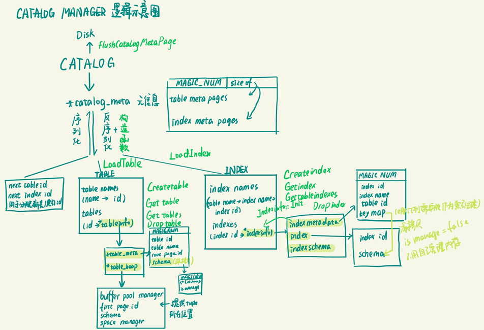

注：我在minisql中负责的部分为part4和part7，在实现过程中遇到了很多困难，其中一部分就是理解给出的框架代码和成员变量。因此也就有了我在个人详细报告中的以下部分（也是我认为应该存在于指导文档的内容）。<br>
*下面这部分是我报告的节选，不涉及具体的代码实现，目的就是帮助大家更好地理解对应部分是要做什么。未违反诚信守则。*
## 2 Part4 - Catalog Manager

#### 2.1 模块功能概述



<center>图1 Catalog Manager逻辑示意图</center>

如图所示，本模块主要管理和维护数据库的所有模式信息，主要是管理了一个目录，可以索引对应id的表格和索引元数据的数据页，并且通过两者的元数据可以load相关表格和索引的信息，支持表格和索引相关的创建、访问、删除操作。

#### 2.3 表的索引和管理

在这个部分我们主要需要实现`CatalogManager`这个类，实现这个类的关键和难点即自顶向下拆解、弄清楚这个类的成员变量及其数据类型，才能根据这些`Index`和`Table`的数据组织方式完成对应的成员函数。

##### 2.3.1 `CatalogManager`成员变量说明

去除了用不到的成员变量后，最顶层的`CatalogManager`内部成员变量如下：

```cpp
private:
  CatalogMeta *catalog_meta_;
  std::atomic<table_id_t> next_table_id_;
  std::atomic<index_id_t> next_index_id_;
  // map for tables
  std::unordered_map<std::string, table_id_t> table_names_;
  std::unordered_map<table_id_t, TableInfo *> tables_;
  // map for indexes: table_name->index_name->indexes
  std::unordered_map<std::string, std::unordered_map<std::string, index_id_t>> index_names_;
  std::unordered_map<index_id_t, IndexInfo *> indexes_;
```

我们可以看到，这个类下面的成员变量可以分为四大类：

- 和目录信息直接相关的、会被序列化到数据库文件的第`CATALOG_META_PAGE_ID`号数据页中的目录元信息指针`*catalog_meta_`，数据类型为`CatalogMeta *`；

  - 在这里我们并不清楚目录元信息的具体构成，所以我们需要查看`CatalogMeta`这个类的成员变量：

    ```cpp
    private:
      static constexpr uint32_t CATALOG_METADATA_MAGIC_NUM = 89849;
      std::map<table_id_t, page_id_t> table_meta_pages_;
      std::map<index_id_t, page_id_t> index_meta_pages_;
    ```

    在这里，第一个`MAGIC_NUM`变量是起到验证序列化正确性的魔数，不起到存储实际信息的作用；目录元信息内的有效信息即两个`map`容器，分别存储了数据库中`table`和`index`的`id`和数据页位置的对应关系。

- 用于记录下一个`table`和`index`的`id`的`next_table_id_`和`next_index_id_`，数据类型为`std::atomic<table_id_t>`，根据`config.h`和`atomic`内的信息`struct atomic<unsigned int>`和`using index_id_t = uint32_t;	using table_id_t = uint32_t;`，我们可以判断其数据类型为32位无符号整数；

- `table`的具体信息，这些内容不会被写入数据页，需要在构造函数中根据目录元信息的两个`map`容器去`Load`出来。而具体信息主要包括两个`unordered_map`容器，其中一个记录了表名和`id`的对应关系，另一个则记录了`id`和`TableInfo *`的对应关系；

  - 在这里我们并不清楚`TableInfo`里面的数据内容及组织形式，所以我们通过查看`table.h`获取更多细节：

    ```cpp
    private:
      TableMetadata *table_meta_;
      TableHeap *table_heap_;
    ```

    在这里包含了两个指针，我们去对应的文件寻找详细信息：

    - 表的元信息`TableMetadata`包含以下内容：

      ```cpp
      private:
        static constexpr uint32_t TABLE_METADATA_MAGIC_NUM = 344528;
        table_id_t table_id_;
        std::string table_name_;
        page_id_t root_page_id_;
        Schema *schema_;
      ```

      除去魔数之外，包含以下内容：

      - 表的`id`

      - 表名称

      - 表对应的根页`id` - 因为一个`table`很可能对应不止一个`page`，所以我们给每个`table`配置了一个`tablemeta`的根页`id`，这样所有该`table`相关的`page`都形成了**双向链表**的关系。因此我们通过在目录元信息中存储一个`page`的`id`，就能找到这个`table`对应的所有的`page`。

      - 表对应的`Schema`（仍然不清晰，我们继续拆解）：

        ```cpp
        private:
          static constexpr uint32_t SCHEMA_MAGIC_NUM = 200715;
          std::vector<Column *> columns_;
          bool is_manage_ = false; /** if false, don't need to delete pointer to column */
        ```

        我们可以看到`Schema`这个类主要内容是一个存储了`Column`指针的`Vector`容器，那么`Column`里面又包括了什么呢？

        ```cpp
        private:
          static constexpr uint32_t COLUMN_MAGIC_NUM = 210928;
          std::string name_;
          TypeId type_;
          uint32_t len_{0};  // for char type this is the maximum byte length of the string data, otherwise is the fixed size
          uint32_t table_ind_{0};  // column position in table
          bool nullable_{false};   // whether the column can be null
          bool unique_{false};     // whether the column is unique
        ```

        看到这里就比较清晰了，我们发现`Column`类包括的就是我们熟悉的表格的每一个属性的名称、类型和约束条件。

    - 去除用不上的成员变量，`TableHeap`包含以下内容：

      ```cpp
      private:
        BufferPoolManager *buffer_pool_manager_;
        page_id_t first_page_id_;
        Schema *schema_;
        TableSpaceManager space_manager_;
      ```

      我们可以看到这里并没有`table`对应的`id`，主要还是一些用于内存池操作的相关变量，故我们将其理解成封装好的实现表级别的操作和管理的类，具体细节不在这个Part研究。

- `index`的具体信息，这些内容和`table`的具体信息一样，不会被写入数据页，需要在构造函数中根据目录元信息的两个`map`容器去`Load`出来。而具体的信息也主要包括了两个`unordered_map`容器：

  - `std::unordered_map<std::string, std::unordered_map<std::string, index_id_t>> index_names_;` - 最外层的容器记录了表名和它对应的所有在这个表上的索引，而所有索引也使用一个`unordered_map`容器存储，每一个element分别记录了每个索引的名称和对应的`id`；

  - `std::unordered_map<index_id_t, IndexInfo *> indexes_;` - 记录了索引的`id`和索引信息的对应关系，同样，在这里我们并不清楚`IndexInfo`里面的数据内容及组织形式，所以我们通过查看`indexes.h`获取更多细节：

    ```cpp
    private:
      IndexMetadata *meta_data_;
      Index *index_;
      IndexSchema *key_schema_;
    ```

    - 这个类包含了这个索引定义时的元信息 `meta_data_`，该索引的模式信息 `key_schema_` 和索引操作对象 `index_`。其中除了 `meta_data_` 以外，其他两个信息都是通过反序列化后的元数据生成的。

    - 索引元数据的定义如下：

      ```cpp
      private:
        static constexpr uint32_t INDEX_METADATA_MAGIC_NUM = 344528;
        index_id_t index_id_;
        std::string index_name_;
        table_id_t table_id_;
        std::vector<uint32_t> key_map_; /** The mapping of index key to tuple key */
      ```

      由此我们可以发现，索引的元数据记录了这个索引的名字、`id`和所在的表名，以及从索引到元组的映射`key_map_`（用于浅拷贝函数）；

    - `Index`类的定义如下：

      ```cpp
      protected:
        index_id_t index_id_;
        IndexSchema *key_schema_;
      ```

      通过`using IndexSchema = Schema;`我们可以知道`*key_schema`指向的内容也主要是一个包含了每一个属性的名称、类型和约束条件的`Vector`容器；
      
    - 现在我们根据这些成员变量完成`IndexInfo`的初始化函数：//略

## 3    Part7 - Lock Manager

#### 3.1 模块功能概述

我们在这个模块主要需要实现`LockManager`这个类，功能包括：

- 追踪发放给事务的锁
- 依据隔离级别适当地授予和释放`S`和`X`锁
- 完成死锁检测和相关的处理

我们需要实现的函数主要分为两块：

1. 锁管理器中授予事务共享锁、独占锁和升级锁的功能及相关函数
2. 绘制等待图及死锁检测

#### 3.2 事务管理器

给出的`TxnManager`模块的功能有：

1. 边界控制：开始时分配所需资源，成功完成时执行提交操作并持久化，遇到错误或需要撤销时回滚并撤销更改
2. 并发控制：确保事务不会互相干扰
3. 故障处理：检测到错误时，回滚撤销或者尝试恢复

同时`Txn`类负责通过参数控制事务的隔离级别，由`LockManager`负责检查，在遇到失败的锁操作时将事务中止并**抛出异常**，由`TxnManager`捕获异常并回滚。

在这个工程中，隔离级别有：

1. **`kReadUncommitted` (读未提交)**
   - 在这个级别下，事务可以读取其他未提交事务的更改。这是最低的隔离级别，允许最大程度的并发，但同时也容易出现“脏读”（dirty reads），意味着一个事务可能读取到另一个事务未提交的更改，如果那个事务回滚，读取的数据就是无效的。
2. **`kReadCommitted` (读已提交)**
   - 此隔离级别保证一个事务只能读取已经提交的更改。这可以防止脏读，但不保证在同一事务中多次读取同一数据时数据保持不变（即不可重复读现象可能发生）。大多数数据库系统的默认隔离级别是读已提交。
3. **`kRepeatedRead` (可重复读)**
   - 可重复读保证在一个事务内多次读取同一记录的结果是一致的，即在这个事务执行期间，隐藏了其他事务所做的修改。这可以防止不可重复读，但仍可能面临其他问题，比如幻读（其他事务插入或删除了符合查询条件的记录，导致两次执行同一个查询可能得到不同的结果）。这个级别通常提供较高的数据一致性保障。

#### 3.3 锁管理器

##### 3.3.1 `LockManager`类给出代码分析

和第四部分一样，我们还是先对我们要实现的这个`LockManager`类内的成员变量和成员函数进行分析拆解。

首先类内包括了`LockMode`这一枚举类，枚举了三种记录上面锁的状态，分别是：

- `kNone` - 表示这个记录上目前没有任何锁
- `kShared` - 表示这个记录上有共享锁
- `kExclusive` - 表示这个记录上有独占锁

而这个类内还有两个内部类：

1. **`LockRequest`**

此类代表由事务（`txn_id`）发出的锁请求。它包含以下成员：

- `txn_id_`：发出请求的事务的标识符
- `lock_mode_`：请求的锁类型（例如，共享或排他）
- `granted_`：已授予事务的锁类型

2. **`LockRequestQueue`**

这个类用于处理锁请求的队列，包含了这一队列的相关信息和处理的相关方法。

包含以下成员变量：

- `req_list_`：类型为包含`LockRequest`元素的`list`容器，用于记录所有的锁请求
- `req_list_iter_map_`：类型为`unordered_map<txn_id_t, ReqListType::iterator>`，构造了对应`id`的事务和锁请求列表迭代器的映射，用于快速索引 `req_list_` 列表中每个事务ID对应的锁请求
- `cv_`：类型为`condition_variable`，用于管理因为锁竞争而被阻塞的事务，具体操作如下：
  - **等待（Waiting）**：一个事务线程在不能获取所需的锁时，会调用 `cv_.wait(lock, predicate)` 进入等待状态。这里 `lock` 是一个互斥锁（通常是与条件变量配合使用的），`predicate` 是一个返回布尔值的函数或可调用对象，表示等待持续的条件。该线程会在 `predicate` 为 `false` 时阻塞，直到其他线程在相同的条件变量上调用 `notify_one()` 或 `notify_all()`。
  - **通知（Notifying）**：当锁的状态变更允许被阻塞的事务继续执行时，可以调用 `cv_.notify_one()` 或 `cv_.notify_all()` 来唤醒一个或所有等待中的线程。被唤醒的线程会重新评估 `predicate`，如果结果为 `true`，则继续执行。
- `is_writing_`：指示当前是否持有排他性写锁
- `is_upgrading_`：指示是否正在进行锁升级
- `sharing_cnt_`：持有共享锁的事务数量的整数计数

包含的处理锁请求队列的方法如下：

- `EmplaceLockRequest()`：将新的锁请求添加到队列前端，并在map中存储其迭代器
- `EraseLockRequest()`：根据`txn_id`从队列和map中移除锁请求。如果成功返回`true`，否则返回`false`
- `GetLockRequestIter()`：根据`txn_id`检索队列中特定锁请求的迭代器

而除去上述内部类，`LockManager`这一整个类还包含锁管理器相关的以下成员变量：

- `lock_table_`：是每一条记录`RowId`和在这条记录上面的锁请求队列`LockRequestQueue`的映射，记录了数据库每一条记录上对应的锁请求队列

- `latch_`：数据类型为`mutex`，用于提供互斥锁的基本功能，保证线程不冲突。包含以下操作：

  - **锁定（Lock）**：调用 `lock()` 方法可以锁定互斥锁。如果锁已被其他线程锁定，则当前线程将被阻塞，直到该锁被释放
  - **尝试锁定（Try Lock）**：调用 `try_lock()` 方法尝试锁定互斥锁。如果锁在调用时可用，这个方法会锁定它并返回 `true`；如果锁已被其他线程持有，则不会阻塞当前线程，直接返回 `false`
  - **解锁（Unlock）**：调用 `unlock()` 方法可以解锁互斥锁，释放对资源的独占权，使其他线程能够获取锁

  ```cpp
  void someFunction() {
      // 使用 unique_lock 对 latch_ 加锁
      std::unique_lock<std::mutex> lock(latch_);
      // 安全地修改 lock_table_
      lock_table_[someKey] = someValue;
      // lock 在这个 block 结束时自动释放
  }
  ```

  由此，我们需要在锁管理的成员函数最开始都给`latch`加锁来确保锁的成员变量被安全的修改，确保这些操作不会与其他线程冲突或产生数据不一致性。