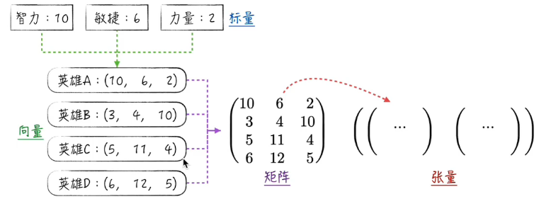
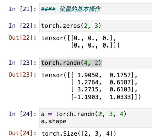
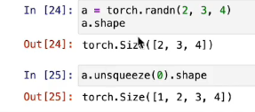
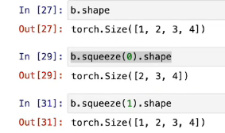
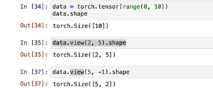
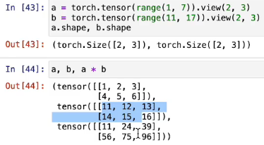
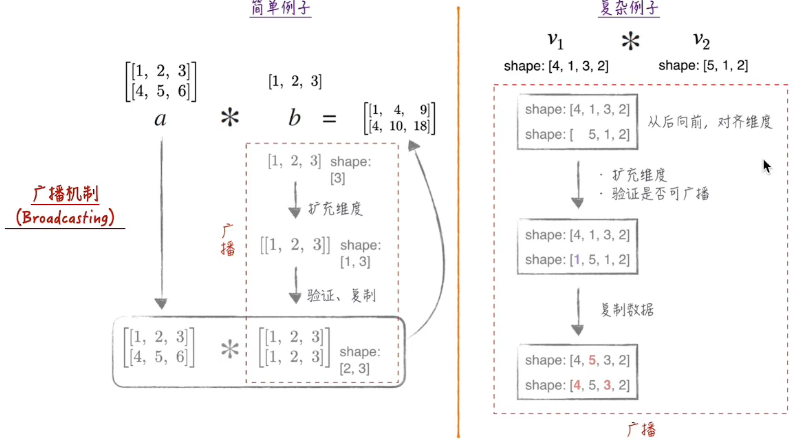
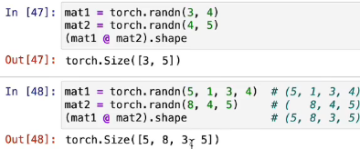

# Pytorch基础

todo:[pytorch practice](https://colab.research.google.com/github/dvgodoy/PyTorch101_ODSC_London2019/ blob/master/PyTorch101_Colab.ipynb#scrollTo=BIUmWPfKtAm1)

## 张量

### 定义
张量(Tensor)是pytorch的基础数据结构。

- 标量是0阶张量，向量是1阶张量，矩阵是2阶张量；当然也存在更高阶的张量（上图最右边可以理解为不同游戏版本的各英雄的各项属性(x）

### 基本操作
一般情况下比起具体数字，我们更加关注张量的形状

#### 生成

#### 修改形状

1. 增加维度（不改变数据内容） 

2. 降低维度（前提：有一个维度为1） 
 
*当我们减少的维度长度不等于1的时候操作不会有效，见上图`In[31]`*
3. 通过`View`函数实现 
只支持内存毗邻数据的计算 
可以空一个维度函数自行计算 

#### 计算
两个形状一样的张量可以逐元素计算 
e.g. 相乘 - 对应元素逐个相乘 

#### 广播机制

#### 矩阵运算
高维张量：后两位矩阵运算，前面的维度是逐个元素计算（广播机制） 
